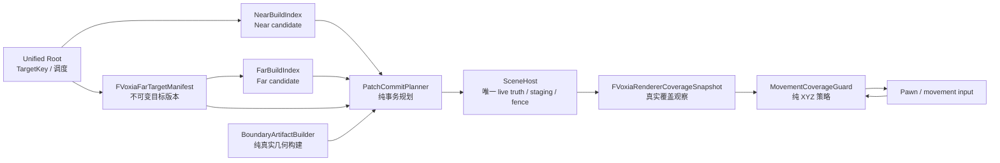
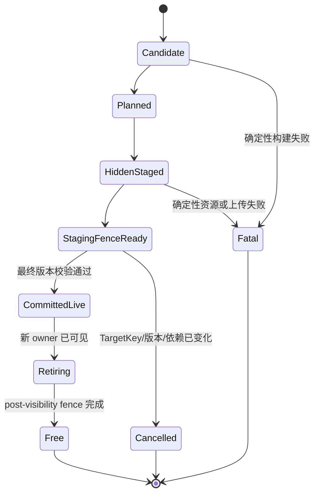

# Voxia 无空洞 Near/Far 呈现与三维移动安全门设计

- **日期**：2026-07-26
- **状态**：设计已确认，待书面复核与实施计划
- **范围**：现役 Voxia 唯一生产组合根中的 Near/Far Patch 可见交接、真实边界几何、
  renderer fence、全空气 Near、完整 XYZ 移动安全门与逐帧验收
- **前置决策**：
  - [Voxia Near/Far Patch Diff 流送设计](2026-07-25-voxia-patch-diff-streaming-design.md)
  - [当前客户端流送与 LOD 真值](../../00-current-truth/design/client/streaming-lod.md)
  - [系统正交设计纲领](../../30-reference/overview/2026-06-27-架构设计指导思想-系统正交.md)
- **不改变**：服务端权威、baseline 硬校验、完整 XYZ、Near `3×3×3 tiles`、
  Near Patch `4³ chunks`、Far Patch `8³ tiles`、渐进 Patch 流送、唯一生产组合根、
  confirmed 体素编辑语义

## 1. 决策摘要

本修复不增加临时遮洞墙、固定延时、盲重试或第二套 handoff truth。它补全已经批准但未完整
贯通到渲染器的 Patch presentation transaction：

1. boundary shell 必须携带真实、不可变、可渲染的 face、vertical skirt、LOD stitch、
   edge/corner cap，而不只是 SlotId、类型与 fingerprint；
2. 新 owner 只有在隐藏侧准备完成并通过真实 staging fence 后，才可以替换旧 owner；
3. Near 退出前必须验证负责接管其完整空间的**精确目标 FarPatchVersion**已经 live 且
   renderer-ready，禁止只检查 FarPatchId 是否存在；
4. 旧 owner 保留到替代者完成可见切换；post-visibility fence 完成后才回收旧资源；
5. “已确认全空气”是 Near 的正式完成态，不得把零组件误判为未加载；
6. 玩家可以离开最近一个完整渲染 Near 窗口最多 3 chunks；完整 XYZ 任一方向超过该安全带时，
   只阻止继续增大离开距离的移动，允许返回或沿边界移动；
7. 无空洞证明来自真实 renderer handles、ownership、boundary 与 fence epoch，不再由同一
   ledger 计数自证。

一句话原则：

> 新地板铺好并确认显卡能画以前，绝不拆旧地板。

## 2. 已确认根因

### 2.1 接缝墙只有账本身份，没有渲染几何

当前 `FVoxiaFarPatchBoundaryShell` 生成 face/edge/corner 的 after-image、artifact kind 与
identity；`UVoxiaVoxelPresentationSceneHost::StageFarPatchCommit` 将它们写入
`PresentationCommitLedger`，但只从 `Stage.MeshShards` 创建可见组件。已有
`FVoxiaNearFarBoundarySeamBuilder` 能构造接缝 quad，却没有接入现役 Patch 生产提交路径。

因此 `Wall`、`PermanentWall`、`ProvisionalWall`、`Stitch` 目前可以在 ledger 中存在，却没有
对应的 renderer artifact。近远景向内的 vertical wall 缺失是确定性实现缺口，不是数据偶发。

### 2.2 Near 退出只验证旧 Far PatchId 存在

`AVoxiaWorldActor::ContinueNearPatchPresentation` 会等待全部待移动 Near Patch 完成后再开始移除，
这一点保留。但移除前只调用 `SceneHost->IsLiveFarPatch(PatchId)`。该判断最终只是检查 live map
中是否存在这个 PatchId。

Far Patch 覆盖 `8³ tiles`。玩家移动一个 Tile 时，同一 FarPatchId 往往继续存在，但其旧版本
排除了原 Near 立方体内的页面；新目标版本必须补入刚退出 Near 的 Tile，并携带新的 content、
dependency 与 boundary fingerprint。旧 ID 存在不等于新版本已经具备接管 coverage。

Real-RHI 证据中已经出现：

```text
05:41:02.643  最后一个新 Near Patch 提交
05:41:02.651  开始移除退出侧 Near
05:41:06.747  新 Far generation 才整体提交
```

代码允许 Near 在目标 Far 尚未被精确证明时退出，形成间歇性空洞窗口。

### 2.3 Patch 路径没有完成 renderer fence 契约

ownership texture 的更新会进入 Render/RHI 队列；Patch 提交路径随后立即切换组件可见性。
现有 post-visibility fence 主要服务旧 whole-generation visibility swap，Patch move/remove
没有形成完整的 hidden staging → staging fence → visible commit → post fence 闭环。

这不是多秒级空洞的首要根因，但若只修版本 gate，仍可能残留单帧时序风险。

### 2.4 当前 proof 对实际渲染盲区

现有 root proof 将 `RequiredSeamFaces` 与 `LiveSeamFaces` 都赋为同一个 ledger slot 数量。
这只能证明账本有 identity，不能证明组件存在、材质绑定正确、ownership 已上传或 GPU 已看到
新版本。

## 3. 目标与非目标

### 3.1 目标

1. 任意 Far→Near、Near→Far、Far→Far 可见交接期间，每一帧都没有地图空洞；
2. 接缝向内的 vertical wall、不同 LOD stitch 与棱角 cap 都有真实渲染资源；
3. 保留逐 Patch 流送，不等待完整 Far target；
4. 保留服务端权威与 confirmed edit 顺序；
5. 保留移动连续性，并以独立、可配置的完整 XYZ 安全门限制加载落后；
6. 显式区分“确认全空气”和“仍在等待”；
7. CLI、结构化日志和 Real-RHI runner 能逐帧证明无 gap、无 overlap、无 orphan seam；
8. 快速折返、Relocate、体素编辑与长时间运行不产生资源泄漏或第二条生产路径。

### 3.2 非目标

1. 不修改服务端 wire codec、ChunkSnapshot/Delta 或 voxel intent 语义；
2. 不改变 Near/Far 空间尺寸、LOD 半径或 Patch 尺寸；
3. 不重写 canonical worldgen、surface/material/lighting 算法；
4. 不把 boundary 几何焊入 Far 主网格并扩大主网格重建范围；
5. 不引入固定等待毫秒数、Tick 轮询式自愈、运行时扩容或“最终补上即可”的验收；
6. 不恢复已归档的 Tile handoff coordinator、whole-generation 正式路径或 XZ/有限 Y 假设。

## 4. 不变量

### 4.1 唯一事实

- `UVoxiaVoxelPresentationSceneHost` 继续是唯一 live presentation truth；
- Root 只拥有当前 `FVoxiaPatchTargetKey`、调度与派生 readiness；
- Near/Far BuildIndex 只拥有 target candidate 状态，不拥有 live renderer truth；
- target manifest 是不可变目标描述，不是第二份 live 镜像；
- MovementCoverageGuard 只返回决策，不持有流送或 renderer 状态。

### 4.2 可见覆盖

对每个应该可见的表面位置，任一时刻必须满足：

```text
可见 Near owner
或
可见 Far owner
或
可见 canonical boundary/seam artifact
```

交接允许短暂重叠准备，但可见提交后不得出现两个可见 owner；更不能出现零 owner。

### 4.3 时间性不变量

- staging fence 完成前，旧 owner 不能隐藏；
- 精确目标版本验证失败时，旧 owner 继续 live；
- post-visibility fence 完成前，旧资源不能回收到池；
- Busy 只由明确的资源/fence 事件唤醒，不以超时猜测完成；
- deterministic failure 保留旧画面、停止危险动作、返回可诊断 Fatal，不伪装成功。

### 4.4 完整 XYZ

coverage、Near 完成窗口、ownership、boundary、距离、安全带、测试路线和 CLI 字段全部使用
XYZ。不得把 Y 固定为零，也不得把安全带降为水平面距离。

## 5. 模块边界



### 5.1 NearBuildIndex / FarBuildIndex

继续负责：

- 固定 stencil 依赖；
- source、content、dependency 与 boundary fingerprint；
- Waiting、Ready、InFlight、Cancelled、Fatal；
- candidate 的不可变 CPU artifact。

禁止负责：

- 判断旧组件何时隐藏；
- 查询或复制 live component map；
- 直接等待 render fence；
- 通过自身 pending 数宣称 renderer coverage 完成。

### 5.2 FVoxiaFarTargetManifest

Far builder 在现有“先完成全部 target metadata，再逐 Patch 生成 mesh”的阶段发布一个不可变
manifest：

```text
FVoxiaFarTargetManifest {
  TargetKey
  PatchId -> exact FarPatchVersion
  PatchId -> exact target tile/page coverage
  PatchId -> immutable boundary profile identity
}
```

它只表达“本次目标应该是什么”。SceneHost 用它把 Near 退出空间映射到必须接管的精确 Far
版本；live 状态仍只从 SceneHost 读取。Root 可以路由 immutable ref，但不得维护可写副本。

### 5.3 PatchCommitPlanner

这是纯逻辑模块。输入：

- 当前 TargetKey；
- Near/Far candidate；
- FVoxiaFarTargetManifest；
- SceneHost 冻结 snapshot；
- boundary input profiles 与 committed Near ownership；
- confirmed edit 时的 `FConfirmedEditKey`。

输出固定 `FVoxiaPatchPresentationPlan`：

```text
FVoxiaPatchPresentationPlan {
  TargetKey
  exact candidate versions
  exact required live versions
  exact PatchId / SlotId / ownership 写集合
  immutable geometry after-images
  explicit remove after-images
}
```

它不创建 UObject、不提交 ledger、不等待 fence。写集合有冲突的计划不能同时 stage。

### 5.4 BoundaryArtifactBuilder

沿用并补全现有 `FVoxiaFarPatchBoundaryShellBuilder` 与
`FVoxiaNearFarBoundarySeamBuilder` 的纯构建职责，统一输出
`FVoxiaBoundaryGeometryArtifact`：

```text
FVoxiaBoundaryGeometryArtifact {
  canonical SlotId
  kind: exact | vertical_skirt | lod_stitch | wall |
        provisional_wall | permanent_wall | edge_cap | corner_cap
  bPresent
  version fingerprint
  geometry identity
  immutable compact quad/mesh payload
  material family identity
}
```

约束：

- 无几何必须显式 `bPresent=false`，不能靠“数组里没找到”表达；
- 一个 canonical SlotId 同时最多有一个 live artifact；
- builder 只读固定 26 邻位 profile 与 committed Near mask，不递归扩大事务；
- boundary payload 不持有 UObject；
- 真实 component 与资源池只由 SceneHost 拥有。

canonical SlotId 是逻辑所有权，不强制一个 SlotId 创建一个 UObject。SceneHost 可以把多个
artifact 组装为有固定上限的 immutable boundary render batch，但必须维护
`SlotId -> batch handle + geometry range + identity` 的精确映射。一个 batch 只有在已无 live slot
引用且 post-visibility fence 完成后才可回收。物理 batching 不得改变逻辑事务原子性，也不得
复制共享 slot。

### 5.5 SceneHost

SceneHost 统一拥有：

- live/staged/retiring Near、Far、boundary component handles；
- committed Near/Far PatchVersion；
- exact Near owned chunks；
- canonical boundary/seam slots；
- live/candidate ownership texture；
- staging fence、post-visibility fence 与资源池；
- 由上述事实派生的 `FVoxiaRendererCoverageSnapshot`。

SceneHost 不生成 target candidate，也不决定加载优先级。

live ownership texture 与 candidate ownership texture 必须是不同的 GPU 可写资源。禁止在仍被
当前 live 材质采样的 texture 上原地更新，再以 GameThread 调用顺序假设 GPU 已看到新内容。
candidate texture 在隐藏侧完成上传和 staging fence 后，visible commit 只切换材质绑定；旧
texture 在 post-visibility fence 后回池。

### 5.6 MovementCoverageGuard

独立纯模块。`FVoxiaMovementCoverageGuardConfig` 固定声明
`MaxOutsideCommittedNearChunks=3`，guard 输入：

- 最近一个完整 renderer-confirmed Near 窗口；
- 当前玩家 chunk；
- 候选玩家 chunk；
- 候选 chunk 是否已有合法可见 owner；
- `MaxOutsideCommittedNearChunks=3`。

输出 `FVoxiaMovementCoverageDecision`：

```text
Allow
BlockOutward(reason, outside_depth_xyz, max_depth)
AllowReturn
AllowBoundaryMotion
```

它不启动流送、不访问 provider、不修改 SceneHost、不设置定时器。

### 5.7 renderer-ready 的精确定义

CPU mesh 完成不等于 renderer-ready。`GeometryReady` candidate 只有同时满足以下条件才算
renderer-ready：

1. hidden component 已创建并注册；
2. component 的 geometry identity 与 candidate 完全一致；
3. material family 与 ownership 参数绑定完成；
4. candidate ownership texture 与受影响 boundary artifacts 已在隐藏侧 staged；
5. staging fence 已完成；
6. 对应 `FVoxiaPatchPresentationPlan` 尚未因 TargetKey、PatchVersion 或输入 fingerprint 变化而
   stale。

`VerifiedEmpty` 不要求创建 component，但必须具备完整内容证明，并完成 ownership、boundary 与
staging fence。renderer-ready 仍然是隐藏侧准备状态；只有 visible commit 后才成为 live。

## 6. Patch 内容完成态

系统必须显式区分：

```text
Waiting
VerifiedEmpty
GeometryReady
Fatal
```

这四种状态属于同一条正式流送与呈现管线，不是四条分支系统。`VerifiedEmpty` 与
`GeometryReady` 使用完全相同的 TargetKey、PatchVersion、BuildIndex、commit plan、
ownership、boundary、staging fence、visible commit、coverage proof 与 retirement 流程；
唯一差别是不可变内容 payload 中有没有需要提交的三角形。

- 禁止为空气 Near/Far 创建专用 actor、专用入口、第二套 scheduler 或 fallback；
- 禁止跳过正常版本校验、ownership 提交、boundary after-image 或 fence；
- 禁止用“组件数量为 0”决定走另一条路径。

- `Waiting` 与 `Fatal` 属于构建/候选状态，不能写入 live；
- `VerifiedEmpty` 与 `GeometryReady` 都可形成合法 committed Near/Far after-image；
- `VerifiedEmpty` 仍携带 PatchVersion 与 source/content/dependency identity；
- `VerifiedEmpty` 不创建占位网格，不用透明面或零面积三角形伪装 renderer-ready；
- `FVoxiaRendererCoverageSnapshot` 将合法的 `VerifiedEmpty` 视为空间已确认，而不是 renderer gap；
- `GeometryReady` 必须有与 geometry identity 匹配且 staging-ready 的组件；
- Near 的 `VerifiedEmpty` 仍携带 exact owned chunks；Far 的 `VerifiedEmpty` 仍携带 target
  tile/page coverage；
- CLI 必须分别报告 Near/Far 的 verified-empty、geometry-ready、waiting 与 fatal 数量。

因此玩家在高空时，整个 Near 窗口可以没有任何三角形但仍然完整；向地面下降时，新出现的表面
必须按正常 transaction 交接，不能把“先前为空”当成永久无组件状态。

## 7. 可见事务

### 7.1 生命周期



规则：

- `Candidate` 到 `StagingFenceReady` 可以 Cancelled，且不能修改 live；
- visible commit callback 开始后不得调用可能失败的构建、分配或验证；
- commit 同时切 geometry、ownership、boundary 和 ledger after-image；
- retirement 只能回收，不能反向改写 live truth。

### 7.2 Far → Near

1. Near candidate 的 exact owned chunks、内容态与 CPU mesh 完成；
2. Planner 生成 Near geometry、ownership delta 与受影响 seam slots；
3. SceneHost 在隐藏侧创建/注册组件并准备 candidate ownership；
4. staging fence 完成；
5. 最后验证 TargetKey、NearPatchVersion、confirmed edit key 与 boundary inputs；
6. 同一可见提交显示 Near、切 ownership、替换 seam；
7. arm post-visibility fence；
8. fence 完成后回收被替代资源。

禁止先让 Far shader 丢弃，再等待 Near 组件进入 renderer。

### 7.3 Near → Far

1. Far 继续逐 Patch 准备，不等待全部 6859 个 target Patch；
2. Planner 将退出 Near Patch 的 exact chunks 映射到 `FVoxiaFarTargetManifest`；
3. 对每个相关 PatchId，要求：
   - SceneHost live FarPatchVersion 与 manifest 精确相等；
   - 对应 renderer handles 已 staging-ready/live；
   - 必需 boundary artifacts 已 ready；
4. 任一条件未满足时保留旧 Near，返回 Waiting/Busy；
5. 全部满足后规划 Near remove、ownership delta 与 seam after-images；
6. staging fence 和最终校验通过后原子切 owner；
7. 旧 Near 只在 post-visibility fence 后回收。

这里等待的是退出区域实际依赖的少量 Far 版本，不是完整 Far generation。

精确 Far 版本可以在仍被 Near ownership 遮蔽时先提交为 standby-ready。它已经具备正确
geometry/VerifiedEmpty 证明、boundary 与 renderer handles，只是尚未获得可见 owner。Near
remove transaction 只负责在最终 fence 后切换 ownership，不重新构建 Far。

### 7.4 Far → Far boundary

- candidate Far Patch 的主几何与固定 26 boundary slot after-images属于同一 transaction；
- 邻 Patch 尚未 live 时提交 provisional wall；
- target 外没有邻居时提交 permanent wall；
- 邻 Patch 到达后直接以同一 SlotId 替换成 exact/stitch；
- 新 boundary staging-ready 前，旧 wall 继续 live；
- 不允许“先 remove slot，后续事务再 add”。

## 8. 完整 XYZ 移动安全门

### 8.1 安全锚点

SceneHost 从 exact committed Near coverage 派生：

```text
FVoxiaLastCompleteNearWindow {
  TargetKey
  center_tile_xyz
  min_chunk_xyz
  max_chunk_xyz
  verified_empty_patch_count
  geometry_patch_count
  coverage_fingerprint
  renderer_epoch
}
```

只有完整 `21³ chunks` 全部处于 `VerifiedEmpty` 或 `GeometryReady`，且所需 staging fence 已完成，
该窗口才可成为新的安全锚点。渐进提交中的不完整目标不能提前替换锚点。

安全锚点允许落后于当前请求的 TargetKey；这正是加载追不上时保留旧完整 Near 的依据。新目标
发布不能清空或伪造锚点。每个 `21³` chunk 必须由 live Near after-image 的 exact owned chunks
覆盖，不能用 Patch 外包围盒或“有组件”推测完整性。

### 8.2 距离定义

对候选玩家 chunk `P` 与完整 Near 轴对齐范围 `[Min, Max]`：

```text
outside_x = max(Min.x - P.x, 0, P.x - Max.x)
outside_y = max(Min.y - P.y, 0, P.y - Max.y)
outside_z = max(Min.z - P.z, 0, P.z - Max.z)
outside_distance = max(outside_x, outside_y, outside_z)
```

这就是完整 XYZ Chebyshev 距离。水平、垂直、斜向和角向使用同一口径。

### 8.3 决策

- 候选位置没有合法 committed coverage：立即拒绝继续向该位置移动；合法 coverage 可以是
  `VerifiedEmpty`，不要求空气中存在无意义的可见组件；
- `outside_distance <= 3`：允许；
- 候选距离大于 3 且比当前位置更远：阻止该次向外移动；
- 候选距离不增加：允许沿边界移动；
- 候选距离减小：允许返回；
- 新完整 Near 窗口完成后，下一次决策自然恢复，不使用倒计时；
- 服务端大幅纠正、teleport 或新游戏继续走 Relocate/loading，不用该 guard 掩盖。

Pawn/controller 只执行 guard 结果；guard 本身无状态。结构化日志记录每次状态变化，不逐帧刷同一
原因。

## 9. 失败与资源语义

### 9.1 Waiting / Busy

只用于：

- 精确目标 Far 版本尚未 live；
- boundary artifact 尚未 staging-ready；
- staging/post fence 的物理槽尚未完成；
- target source 的合法异步输入尚未返回。

唤醒来源必须是目标版本提交、资源槽释放或 fence 完成事件。

### 9.2 Cancelled

TargetKey、candidate version、confirmed edit key 或 boundary snapshot 在 commit 前变化时：

- 销毁/回收 staged 资源；
- 不改 live；
- 从新 immutable snapshot 重新规划；
- 不执行补偿式反向可见切换。

### 9.3 Fatal

下列情况立即 Fatal：

- boundary/stitch/cap 构造失败；
- 必需 source/profile 缺失；
- component 创建/注册或 ownership 上传确定性失败；
- renderer identity 与 ledger identity 不一致；
- 固定容量上限被违反；
- 已提交后的 invariant 检查发现零 owner 或双 owner。

Fatal 时保留最后安全画面、阻止危险移动、输出明确 reason；不自动 retry，不把旧画面报告成
新 TargetKey ready。

## 10. 可观测面

### 10.1 SceneHost / root snapshot

新增或补全：

```text
target_key
last_complete_near_window
near_verified_empty_patches
near_geometry_ready_patches
near_waiting_patches
near_fatal_patches
far_verified_empty_patches
far_geometry_ready_patches
far_exact_target_versions_ready
far_required_handoff_versions_waiting
boundary_live_slots
boundary_staged_slots
boundary_renderer_components
staging_fence_epoch
post_visibility_fence_epoch
old_owner_retained_regions
renderer_gap_count
renderer_overlap_count
renderer_orphan_seam_count
resources_quiescent
```

`renderer_gap_count` 不得再由 required/live 同源赋值。它必须交叉检查：

- committed content state；
- actual component handle 与 geometry identity；
- ownership texture identity；
- canonical boundary handle；
- 对应 fence epoch。

### 10.2 Movement guard

状态变化日志：

```text
player_chunk_xyz
candidate_chunk_xyz
complete_near_min_xyz
complete_near_max_xyz
outside_depth_xyz
outside_distance
max_outside_distance=3
decision
reason
renderer_epoch
```

建议 CLI：

```text
voxel_world_root_state
near_mesh
pure3d_world_state
presentation_coverage
movement_coverage_guard
```

observe 产物继续写入 `.demo/observe/`。

## 11. 测试与验收矩阵

### 11.1 纯逻辑单元测试

- `FVoxiaFarTargetManifest` 将退出 Near exact chunks 映射到正确 FarPatchId 与精确版本；
- 旧 FarPatchId 存在但版本不匹配时，Near remove 必须 Waiting；
- 所需精确 Far 版本全部 live 后，Near remove 才可 Planned；
- boundary builder 覆盖 exact、vertical skirt、LOD stitch、wall、provisional/permanent wall、
  edge cap、corner cap；
- 无几何 slot 输出显式 remove；
- `VerifiedEmpty` 是完整 coverage，`Waiting` 不是；
- 完整 XYZ Chebyshev 距离覆盖 ±X/±Y/±Z、棱、角与负坐标；
- safety guard 阻止 outward、允许 return 与 boundary motion；
- stale plan Cancelled 且 live 不变。

### 11.2 SceneHost 事务自动化

- 新组件注册或 ownership staging fence 未完成时旧 owner 保持可见；
- exact target Far 未完成时旧 Near 保持可见；
- commit 同时更新 geometry、ownership、boundary 与 ledger；
- post fence 前资源不可回池；
- provisional wall 被 exact/stitch 原位替换，没有 remove/add 空窗；
- 注入 component、material、texture、fence 与 identity 失败时保留旧 live 并 Fatal；
- renderer coverage proof 能检测“ledger 有 slot、renderer 无组件”；
- renderer coverage proof 能检测 stale ownership texture 与 orphan seam；
- 资源池保持固定平台，不随连续移动增长。

### 11.3 三维路线

- 单轴 ±X、±Y、±Z；
- XY、XZ、YZ 斜向；
- XYZ 角向；
- 负坐标跨零；
- 连续至少 10 Tile；
- 快速折返与连续变更 TargetKey；
- Relocate 与高空出生。

### 11.4 垂直全空气路线

本节只是同一生产管线的专项测试路线，不允许对应任何空气专用运行时路径。

1. 从地面持续上升，直到完整 `3×3×3` Near 窗口全部为 `VerifiedEmpty`；
2. Near 全空气时，下方不属于 Near 精确 XYZ chunks 的 Far 地面仍必须可见，禁止按 XZ column
   裁掉整根竖柱；
3. 在纯空气区域继续跨越多个垂直 Tile，不误报未加载、不因零组件阻挡；
4. 从高空下降到地面，Far 地面持续保底，Near 地形按 Patch 接管，不整块突现、不先空洞后补全；
5. 快速上下折返；
6. 一边下降一边水平移动；
7. 人为延迟垂直 Near、Far、boundary 与 fence；
8. 验证玩家可进入完整 Near 外 3 chunks，不能继续向外，但可返回或沿边界移动。

### 11.5 confirmed edit

- Near/Far 交接期间 break/place 仍只消费服务端确认结果；
- edit 涉及的 1..8 Near Patch 与 seam 同一事务提交；
- edit 不改窗口 TargetKey；
- stale edit receipt 不修改 live；
- 全空气 Patch 因放置体素转为 GeometryReady；
- 最后一块体素被移除后可转为 VerifiedEmpty，且不留下孤立 boundary。

### 11.6 Real-RHI 与长稳

runner 必须在过渡期间持续采样，而不是只截最终帧：

- 每帧 `renderer_gap_count=0`；
- 每帧 `renderer_overlap_count=0`；
- 每帧 `renderer_orphan_seam_count=0`；
- staging fence 未完成时旧 owner 仍存在；
- safety guard 注入延迟时按 3-chunk 规则动作；
- retained component identity 不变；
- Far first-patch 仍不等待完整 target；
- 组件、ownership texture、boundary artifact 与 retirement 数量在长跑后回到固定平台。

## 12. 不回退清单

修复必须保留：

- 唯一 `AVoxiaUnifiedVoxelWorldActor` 正式组合根；
- Near `4³ chunks` 与 Far `8³ tiles` Patch-diff；
- Far target metadata 先发布、mesh 按优先级逐 Patch ready-stream；
- source-bound material/surface/lighting cache；
- cooperative cancellation；
- confirmed voxel authority 与 intent/receipt 顺序；
- material family、阴影策略与现有 Far 性能配置；
- 完整 XYZ `3×3×3 tiles` Near；
- Relocate/loading 与显式 Fatal；
- CLI/结构化日志和 `.demo/observe/`；
- 固定容量与资源平台。

任何“修复”若需要等待完整 Far generation、恢复 whole-generation 可见路径、复制 live truth、
吞错、延时隐藏或生成独立遮洞层，均视为架构回退。

## 13. 已拒绝方案

### 13.1 把 boundary 焊进 Far 主网格

Near ownership 变化会迫使 Far 主网格重建，扩大 dirty 集、耦合 Near/Far 生命周期，并破坏固定
SlotId 的局部替换能力。

### 13.2 临时遮洞墙

会形成第二套几何真值，无法证明它与 canonical occupancy、材质和 ownership 一致。

### 13.3 固定延时或等待完整 Far target

固定延时不证明 GPU ready；等待完整 target 则破坏已实现的 first-patch 渐进流送和移动性能。

### 13.4 只加强日志而不改变提交条件

观察到错误不能维护不变量。承诺“无空洞”的系统必须自己持续维护版本、owner 与 fence 契约。

## 14. 完成定义

只有同时满足以下条件，才能写成修复完成：

1. boundary/seam artifact 有真实 renderer geometry；
2. Near remove 只接受精确目标 FarPatchVersion 与真实 renderer-ready；
3. Patch 路径具备 staging 与 post-visibility fence；
4. `VerifiedEmpty` 与 `GeometryReady` 均可形成完整 Near；
5. 完整 XYZ 3-chunk safety guard 已接入唯一生产根；
6. renderer coverage proof 不再自证；
7. 自动化、Development build、Node、Null-RHI、Real-RHI 三维路线与长稳全部通过；
8. 垂直纯空气→下降到地面的路线逐帧无空洞；
9. 已实现的渐进流送、confirmed edit、材质和性能没有回退；
10. 当前真值、Voxia README、相关目录 README 与 session handoff 同步更新。

本设计通过书面复核后，再生成逐任务、TDD、带验证命令与提交边界的实施计划；此文档本身不
授权跳过设计门禁直接修改代码。
