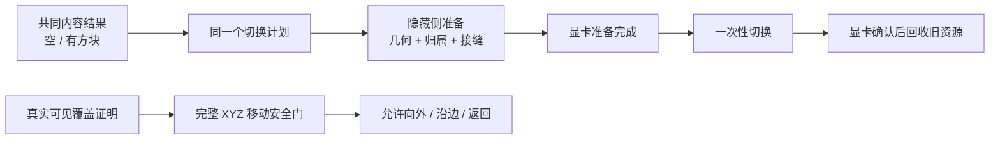

# Voxia 无空洞 Near/Far 呈现 Implementation Plan

> **For agentic workers:** REQUIRED SUB-SKILL: Use superpowers:subagent-driven-development (recommended) or superpowers:executing-plans to implement this plan task-by-task. Steps use checkbox (`- [ ]`) syntax for tracking.

**Goal:** 让 Voxia 在玩家沿完整 XYZ 任意方向移动、换 tile、快速折返或从高空下降时，始终先把接管区域完整准备到显卡可安全切换，再移除旧画面；同时补全 Near/Far 接缝向内缺失的真实墙面，并把玩家最多离开最后一个完整 Near 窗口 3 chunks 的规则接入实际移动。

**Architecture:** 所有 Near/Far Patch 都走同一条“构建候选内容 → 在隐藏侧准备几何、归属与接缝 → 等待真实 render fence → 一次性切换可见归属 → fence 后回收旧资源”的管线。`VerifiedEmpty` 只是这条管线中“内容已经确认、三角形数量为零”的合法结果，绝不拥有空气专用入口。不可变 Far 目标清单描述精确版本与覆盖；纯计划器决定一次切换要读写什么；`UVoxiaVoxelPresentationSceneHost` 继续作为唯一 live 呈现事实；独立移动门只读取最后一个完整 Near 窗口与候选位置，不反向操纵流送。

**Tech Stack:** Unreal Engine 5.8、C++20、UE Automation Framework、DynamicMesh、Render/RHI fence、Voxia stdio CLI/JSON observe、Node.js smoke runner、PowerShell。

**Status:** 已完成设计评审，待按本计划实施。对应决策稿见 [`2026-07-26-voxia-hole-free-near-far-presentation-design.md`](2026-07-26-voxia-hole-free-near-far-presentation-design.md)。

## Global Constraints

- 正式代码只在 Voxia 活跃 worktree
  `C:\Users\DYZ\Documents\dev\hemifuture\ex_mmo_cluster\.worktrees\voxia-phase2-macro-interaction`
  实施；以下 `Source/...`、`scripts/...`、`README.md` 均相对此目录。外层仓库只提交 `docs/...`。
- Voxia 实施基线固定为 commit `0830b76`；开始 Task 1 前先确认 worktree clean，
  若基线已变化则先重放本计划的接口与测试假设，不能把旧行号或旧调用关系硬套到新代码。
- 两个 Git 仓库必须分别暂存、提交和验证，禁止从外层仓库把 Voxia worktree 内容一起加入提交。
- 唯一正式组合根仍是 `AVoxiaUnifiedVoxelWorldActor`；不得增加并列 production root、空气专用 actor、遮洞层或 whole-generation 正式路径。
- 空间、覆盖、距离、边界与路线一律使用完整 XYZ。Near 固定为
  `3×3×3 tiles = 21×21×21 chunks = 9261 chunks`；移动安全带使用 XYZ/L∞，阈值为 3 chunks。
- `Waiting` / `Fatal` 不能进入 live；`VerifiedEmpty` / `GeometryReady` 都能进入 live，而且必须使用相同的 TargetKey、版本、BuildIndex、计划器、ownership、boundary、fence、可见切换、coverage proof 和回收流程。
- 禁止以“网格为空”“组件数为 0”或“Near 全是空气”为条件走第二条运行时分支。唯一允许的差异是不可变几何载荷的三角形数量可以为零。
- Near 退出只能依赖目标清单中的精确 `FVoxiaFarPatchVersion` 与真实 renderer receipt；同名 Far PatchId、CPU mesh 完成或 ledger 中存在记录都不足以放行。
- 新 owner 在隐藏侧完成前旧 owner 始终保留；staging fence 前不得隐藏旧资源，post-visibility fence 前不得回收旧资源。
- 可见提交开始后不得再执行可能失败的构建、分配、上传或版本计算；失败和 stale 都保留旧画面并给出结构化原因。
- 现有渐进式 Far first-patch、固定预算、取消、confirmed voxel edit、材质族、阴影策略、source-bound cache 与服务端权威语义不得回退。
- 不修改服务端 wire codec，不读取或修改归档 Web / Bevy 客户端。
- 所有新增代码注释与公共 API 文档使用中文；稳定目录 README 与 current-truth 同步更新。

## 白话验收口径

```text
新区域还没准备好：旧区域继续显示。
新区域已经在后台准备好：同一帧完成接管。
显卡确认不再使用旧区域：此时才回收旧资源。
高空全是空气：仍按以上三步执行，只是没有方块三角形。
流送落后：玩家最多继续走出最后一个完整 Near 3 chunks；
继续向外才被挡住，返回或沿边界移动始终允许。
```



---

### Task 1: 统一“已确认为空”和“已有几何”的内容契约

**Files:**
- Modify: `Source/Voxia/Presentation/VoxiaPatchStreamingContract.h`
- Modify: `Source/Voxia/Presentation/VoxiaPatchStreamingContract.cpp`
- Modify: `Source/Voxia/Presentation/VoxiaPatchStreamingContractAutomationTest.cpp`
- Modify: `Source/Voxia/Presentation/VoxiaPresentationCommitLedger.h`
- Modify: `Source/Voxia/Presentation/VoxiaPresentationCommitLedger.cpp`
- Modify: `Source/Voxia/Presentation/VoxiaPresentationCommitLedgerAutomationTest.cpp`
- Modify: `Source/Voxia/Gameplay/VoxiaNearPatchAssembler.h`
- Modify: `Source/Voxia/Gameplay/VoxiaNearPatchAssembler.cpp`
- Modify: `Source/Voxia/Gameplay/VoxiaNearPatchAssemblerAutomationTest.cpp`
- Modify: `Source/Voxia/Gameplay/VoxiaNearPatchBuildIndex.h`
- Modify: `Source/Voxia/Gameplay/VoxiaNearPatchBuildIndex.cpp`
- Modify: `Source/Voxia/Gameplay/VoxiaNearPatchBuildIndexAutomationTest.cpp`
- Modify: `Source/Voxia/FarField/VoxiaFarPatchBuildIndex.h`
- Modify: `Source/Voxia/FarField/VoxiaFarPatchBuildIndex.cpp`
- Modify: `Source/Voxia/FarField/VoxiaFarPatchBuildIndexAutomationTest.cpp`

**Interfaces:**
- Add: `EVoxiaPatchContentState { Waiting, VerifiedEmpty, GeometryReady, Fatal }`。
- Extend: `FVoxiaNearPatchVersion`、`FVoxiaFarPatchVersion` 与 Near/Far after-image 携带内容状态。
- Rule: 完成版本的 `IsValid()` 只接受 `VerifiedEmpty` 或 `GeometryReady`；`Waiting` / `Fatal` 留在候选索引和诊断中，不能提交。
- Rule: `VerifiedEmpty` 要有精确覆盖与全部版本指纹，`GeometryIdentity == 0` 且无组件载荷；`GeometryReady` 必须有非零 geometry identity 和相匹配的几何载荷。

- [ ] **Step 1: 先写完成状态的失败测试**

```cpp
FVoxiaNearPatchVersion Empty = MakeNearVersion();
Empty.ContentState = EVoxiaPatchContentState::VerifiedEmpty;
TestTrue(TEXT("已确认空气是合法完成版本"), Empty.IsValid());

FVoxiaNearPatchVersion Geometry = Empty;
Geometry.ContentState = EVoxiaPatchContentState::GeometryReady;
TestTrue(TEXT("已有几何是合法完成版本"), Geometry.IsValid());

FVoxiaNearPatchVersion Waiting = Empty;
Waiting.ContentState = EVoxiaPatchContentState::Waiting;
TestFalse(TEXT("等待中不能成为提交版本"), Waiting.IsValid());

TestFalse(
	TEXT("内容状态属于版本身份"),
	Empty == Geometry);
```

- [ ] **Step 2: 写 ledger 失败测试**

测试必须覆盖：

```cpp
FVoxiaNearPatchAfterImage EmptyAfterImage;
EmptyAfterImage.bPresent = true;
EmptyAfterImage.Version = Empty;
EmptyAfterImage.ContentState = EVoxiaPatchContentState::VerifiedEmpty;
EmptyAfterImage.GeometryIdentity = 0;
EmptyAfterImage.ExactOwnedChunks = MakeExactOwnedChunks();
TestTrue(TEXT("零组件仍能提交完整空气覆盖"),
	Ledger.CommitNearMove(MakeMoveCommit(EmptyAfterImage)).State ==
		EVoxiaPatchWorkState::Ready);
```

同时断言：

- `VerifiedEmpty + GeometryIdentity != 0` 为 `Fatal`；
- `GeometryReady + GeometryIdentity == 0` 为 `Fatal`；
- `VerifiedEmpty` 缺少 exact owned chunks/page coverage 为 `Fatal`；
- `Waiting`、`Fatal` after-image 一律拒绝；
- Near 与 Far 使用同一组校验函数，不复制一套空气校验。

- [ ] **Step 3: 运行 RED**

```powershell
Set-Location 'C:\Users\DYZ\Documents\dev\hemifuture\ex_mmo_cluster\.worktrees\voxia-phase2-macro-interaction'
& 'C:\Program Files\Epic Games\UE_5.8\Engine\Build\BatchFiles\Build.bat' `
  VoxiaEditor Win64 Development -Project="$((Resolve-Path '.\Voxia.uproject').Path)" `
  -WaitMutex -NoLiveCoding
```

Expected: compile FAIL，指出 `EVoxiaPatchContentState` 或新字段尚不存在。

- [ ] **Step 4: 实现共享状态与共享验证**

在 `VoxiaPatchStreamingContract` 中只实现一份：

```cpp
bool IsCommittedPatchContentState(EVoxiaPatchContentState State);
bool IsGeometryPayloadConsistent(
	EVoxiaPatchContentState State,
	uint64 GeometryIdentity,
	int32 GeometryPayloadCount);
```

Near/Far 版本、assembler、BuildIndex 和 ledger 都调用这两个函数。assembler 即使没有三角形也产出正常 stage 和正常版本；不得返回“跳过发布”。

- [ ] **Step 5: 让 BuildIndex 统计四种状态但只发布两种完成态**

快照追加 Near/Far 各自的 `WaitingCount`、`VerifiedEmptyCount`、
`GeometryReadyCount`、`FatalCount`。`PopReady*` 对两种完成态使用同一队列和同一候选类型。

- [ ] **Step 6: 运行 focused automation**

```powershell
& 'C:\Program Files\Epic Games\UE_5.8\Engine\Binaries\Win64\UnrealEditor-Cmd.exe' `
  "$((Resolve-Path '.\Voxia.uproject').Path)" -unattended -nop4 -nosplash -nullrhi `
  -ExecCmds='Automation RunTests Voxia.Presentation.PatchStreamingContract+Voxia.Presentation.PresentationCommitLedger+Voxia.Gameplay.NearPatchAssembler+Voxia.Gameplay.NearPatchBuildIndex+Voxia.Voxel.FarPatchBuildIndex;Quit' `
  -TestExit='Automation Test Queue Empty' -stdout -FullStdOutLogOutput
```

Expected: 新旧测试全部 `Success`；日志中不存在“空 mesh 因没有 component 而 Waiting”的路径。

- [ ] **Step 7: 提交共同内容契约**

```powershell
git add Source/Voxia/Presentation/VoxiaPatchStreamingContract.* `
  Source/Voxia/Presentation/VoxiaPresentationCommitLedger.* `
  Source/Voxia/Gameplay/VoxiaNearPatchAssembler.* `
  Source/Voxia/Gameplay/VoxiaNearPatchBuildIndex.* `
  Source/Voxia/FarField/VoxiaFarPatchBuildIndex.*
git commit -m "refactor(presentation): unify empty and geometry patch states"
```

---

### Task 2: 用不可变清单固定本次 Far 要交付的精确内容

**Files:**
- Create: `Source/Voxia/FarField/VoxiaFarTargetManifest.h`
- Create: `Source/Voxia/FarField/VoxiaFarTargetManifest.cpp`
- Create: `Source/Voxia/FarField/VoxiaFarTargetManifestAutomationTest.cpp`
- Modify: `Source/Voxia/Gameplay/VoxiaFarPatchBuildStream.h`
- Modify: `Source/Voxia/Gameplay/VoxiaFarPatchBuildStream.cpp`
- Modify: `Source/Voxia/Gameplay/VoxiaFarPatchBuildStreamAutomationTest.cpp`
- Modify: `Source/Voxia/Gameplay/VoxiaWorldGenVoxelShellBuilder.h`
- Modify: `Source/Voxia/Gameplay/VoxiaWorldGenVoxelShellBuilder.cpp`
- Modify: `Source/Voxia/Gameplay/VoxiaWorldGenVoxelShellBuilderAutomationTest.cpp`
- Modify: `Source/Voxia/Gameplay/VoxiaCanonicalVoxelShellSceneBuilder.h`
- Modify: `Source/Voxia/Gameplay/VoxiaCanonicalVoxelShellSceneBuilder.cpp`
- Modify: `Source/Voxia/Gameplay/VoxiaCanonicalVoxelShellSceneBuilderAutomationTest.cpp`

**Interfaces:**

```cpp
struct FVoxiaFarTargetPatchCoverage
{
	FVoxiaFarPatchId PatchId;
	TStaticArray<uint64, 8> ExactTileBits;
	TArray<Voxia::Voxel::FVoxiaVoxelBrickId> ExactPageIds;
	uint64 CoverageFingerprint = 0;
};

struct FVoxiaFarTargetManifestEntry
{
	FVoxiaFarPatchVersion Version;
	FVoxiaFarTargetPatchCoverage Coverage;
	FVoxiaFarPatchBoundaryProfile BoundaryProfile;
};

struct FVoxiaFarTargetManifest
{
	FVoxiaPatchTargetKey TargetKey;
	uint64 BuildGeneration = 0;
	TMap<FVoxiaFarPatchId, FVoxiaFarTargetManifestEntry> Entries;

	bool IsValid(FString& OutError) const;
	bool CollectPatchesCoveringChunks(
		const TSet<FIntVector>& Chunks,
		TSet<FVoxiaFarPatchId>& OutPatchIds,
		FString& OutError) const;
};
```

- [ ] **Step 1: 写精确 XYZ coverage 的失败测试**

构造跨负坐标、跨 Far Patch 边界的 tile/page 集，断言：

- 512-bit tile mask 每一位都按 XYZ local coordinate 唯一映射；
- exact page ids 排序、去重并参与 fingerprint；
- 退出 Near 的 chunks 映射到最小且完整的 Far PatchId 集合；
- 任意 chunk 找不到精确目标 coverage 时显式失败，不能用包围盒猜测。

```cpp
TSet<FIntVector> OutgoingChunks = {
	FIntVector(-1, 7, 14),
	FIntVector(0, 7, 14)
};
TSet<FVoxiaFarPatchId> Required;
TestTrue(TEXT("负坐标跨界按 XYZ 精确映射"),
	Manifest.CollectPatchesCoveringChunks(
		OutgoingChunks, Required, Error));
TestEqual(TEXT("只返回真正接管这些 chunk 的 patch"),
	Required.Num(), 2);
```

- [ ] **Step 2: 写“清单先于网格”的流测试**

将现有 `PublishPlan/TryConsumePlan` 改成
`PublishManifest/TryConsumeManifest` 的测试口径。未发布 manifest 前
`PublishPatch` 必须失败；manifest 只能发布一次；patch 版本必须与 manifest
对应 entry 完全相等。

- [ ] **Step 3: 运行 RED**

运行 `Voxia.FarField.FarTargetManifest` 与
`Voxia.Gameplay.FarPatchBuildStream`；Expected: 新类型或 API 不存在而失败。

- [ ] **Step 4: 实现不可变 manifest 与固定 512-bit tile mask**

`ExactTileBits` 的 bit index 固定为
`X + 8 * (Y + 8 * Z)`；所有负坐标先用 floor-div 算 patch，再算 `[0,7]`
local coordinate。`IsValid` 校验 TargetKey、BuildGeneration、版本、coverage、
profile、排序与 fingerprint，一处不一致即返回可诊断错误。

- [ ] **Step 5: 把完整 TargetKey 送入后台构建**

`FVoxiaWorldGenVoxelShellBuildRequest` 新增完整
`FVoxiaPatchTargetKey PatchTargetKey`。从 root 请求、排队、in-flight request、
background builder 到 canonical scene builder 全程透传；删除
`BeginFarPatchPublication` 中用 generation/center/source 临时重造 key 的逻辑。

- [ ] **Step 6: 用 manifest 替换平行 TMap**

删除 `FVoxiaFarPatchBuildStreamPlan` 的 content/page/dependency/profile 平行
maps。canonical builder 在生成任何 Far mesh 之前一次性构造
`TSharedRef<const FVoxiaFarTargetManifest, ESPMode::ThreadSafe>` 并发布；后续
stream item 只携带 `PatchId + Stage`，消费者用 manifest entry 校验版本。

- [ ] **Step 7: 运行 focused automation**

```powershell
& 'C:\Program Files\Epic Games\UE_5.8\Engine\Binaries\Win64\UnrealEditor-Cmd.exe' `
  "$((Resolve-Path '.\Voxia.uproject').Path)" -unattended -nop4 -nosplash -nullrhi `
  -ExecCmds='Automation RunTests Voxia.FarField.FarTargetManifest+Voxia.Gameplay.FarPatchBuildStream+Voxia.Gameplay.WorldGenVoxelShellBuilder+Voxia.Gameplay.CanonicalVoxelShellSceneBuilder;Quit' `
  -TestExit='Automation Test Queue Empty' -stdout -FullStdOutLogOutput
```

- [ ] **Step 8: 提交目标清单**

```powershell
git add Source/Voxia/FarField/VoxiaFarTargetManifest.* `
  Source/Voxia/Gameplay/VoxiaFarPatchBuildStream.* `
  Source/Voxia/Gameplay/VoxiaWorldGenVoxelShellBuilder.* `
  Source/Voxia/Gameplay/VoxiaCanonicalVoxelShellSceneBuilder.*
git commit -m "refactor(streaming): publish immutable far target manifest"
```

---

### Task 3: 让接缝账本对应真实可渲染墙面

**Files:**
- Create: `Source/Voxia/Presentation/VoxiaBoundaryGeometryArtifact.h`
- Create: `Source/Voxia/Presentation/VoxiaBoundaryGeometryArtifact.cpp`
- Create: `Source/Voxia/Presentation/VoxiaBoundaryGeometryArtifactAutomationTest.cpp`
- Modify: `Source/Voxia/FarField/VoxiaFarPatchBoundaryShell.h`
- Modify: `Source/Voxia/FarField/VoxiaFarPatchBoundaryShell.cpp`
- Modify: `Source/Voxia/FarField/VoxiaFarPatchBoundaryShellAutomationTest.cpp`
- Modify: `Source/Voxia/Presentation/VoxiaNearFarBoundarySeam.h`
- Modify: `Source/Voxia/Presentation/VoxiaNearFarBoundarySeam.cpp`
- Modify: `Source/Voxia/Presentation/VoxiaNearFarBoundarySeamAutomationTest.cpp`
- Modify: `Source/Voxia/Gameplay/VoxiaCanonicalVoxelShellSceneBuilder.h`
- Modify: `Source/Voxia/Gameplay/VoxiaCanonicalVoxelShellSceneBuilder.cpp`
- Modify: `Source/Voxia/Gameplay/VoxiaCanonicalVoxelShellSceneBuilderAutomationTest.cpp`

**Interfaces:**
- `FVoxiaFarPatchBoundaryProfile` 保留现有 6/12/8 摘要并增加从 canonical
  pages 派生的不可变 face/edge/corner material samples。
- `FVoxiaBoundaryGeometryArtifact` 携带 canonical SlotId、artifact kind、
  geometry identity、material family 与不可变 compact mesh payload。
- `FVoxiaFarPatchBoundaryShell` 的每个 after-image 必须同时给出真实 artifact
  payload，或给出显式 remove；不再只写 kind/fingerprint。

- [ ] **Step 1: 写当前缺墙的回归测试**

构造“Near 内侧为空、Far 边界外侧为实心”的 profile，断言：

```cpp
FVoxiaFarPatchBoundaryShell Shell;
const FVoxiaPatchWorkResult Result =
	FVoxiaFarPatchBoundaryShellBuilder::Build(
		Candidate, TargetPatches, LiveProfiles, SnapshotFingerprint, Shell);

TestEqual(TEXT("固定产生 26 个 slot after-image"),
	Shell.TotalAfterImageCount(), 26);
const FVoxiaBoundaryGeometryArtifact* Wall =
	Shell.FindFaceGeometry(ExpectedInnerVerticalFace);
TestNotNull(TEXT("向内竖墙有真实几何"), Wall);
TestTrue(TEXT("向内竖墙不是零三角形"),
	Wall != nullptr && Wall->TriangleCount > 0);
```

分别覆盖 ±X、±Y、±Z、LOD stitch、provisional wall、permanent wall、
edge cap、corner cap，以及“新状态确实无需几何时输出 remove”。

- [ ] **Step 2: 写 canonical sample 稳定性测试**

同一 canonical page 输入在不同 patch 构建顺序下必须得到相同 sample
fingerprint、材料与顶点；邻接 LOD 不同则双方共同 slot 仍得到同一 geometry
identity。

- [ ] **Step 3: 运行 RED**

运行 `Voxia.Presentation.BoundaryGeometryArtifact`、
`Voxia.FarField.FarPatchBoundaryShell` 与
`Voxia.Presentation.NearFarBoundarySeam`；Expected: shell 没有 mesh payload，
竖墙断言失败。

- [ ] **Step 4: 从 canonical pages 生成边界采样**

face 使用二维材料采样，edge 使用一维采样，corner 使用单点采样。incident
profiles 先提升到受限共同分辨率，单轴采样上限固定为 512；超过上限为
`Fatal`，不得降采样猜测。

- [ ] **Step 5: 统一生成 wall/stitch/cap 几何**

复用 `FVoxiaNearFarBoundarySeamBuilder` 的 quad 与材料语义，把 face depth-2、
edge `2×2×N`、corner `2×2×2` 的 solid/air 交界送入同一个 greedy quad
生成器：

- target 内邻居尚未 live：`ProvisionalWall`；
- target 外没有邻居：`PermanentWall`；
- 两侧都在且 LOD 不同：`Stitch`；
- 精确同 LOD：`Wall` 或显式 remove；
- edge/corner 由所有 incident profile 一起决定，不由最后到达者覆盖。

- [ ] **Step 6: 把 geometry identity 写回 after-image**

identity 必须由 SlotId、kind、source、incident versions、materials 与顶点/
索引 fingerprint 派生。任何有 `bPresent=true` 的 boundary after-image 都必须
找到完全相同 identity 的 mesh payload。

- [ ] **Step 7: 运行 focused automation**

```powershell
& 'C:\Program Files\Epic Games\UE_5.8\Engine\Binaries\Win64\UnrealEditor-Cmd.exe' `
  "$((Resolve-Path '.\Voxia.uproject').Path)" -unattended -nop4 -nosplash -nullrhi `
  -ExecCmds='Automation RunTests Voxia.Presentation.BoundaryGeometryArtifact+Voxia.FarField.FarPatchBoundaryShell+Voxia.Presentation.NearFarBoundarySeam+Voxia.Gameplay.CanonicalVoxelShellSceneBuilder;Quit' `
  -TestExit='Automation Test Queue Empty' -stdout -FullStdOutLogOutput
```

- [ ] **Step 8: 提交真实 boundary 几何**

```powershell
git add Source/Voxia/Presentation/VoxiaBoundaryGeometryArtifact.* `
  Source/Voxia/Presentation/VoxiaNearFarBoundarySeam.* `
  Source/Voxia/FarField/VoxiaFarPatchBoundaryShell.* `
  Source/Voxia/Gameplay/VoxiaCanonicalVoxelShellSceneBuilder.*
git commit -m "fix(presentation): build real near far boundary geometry"
```

---

### Task 4: 建立显卡侧真实覆盖收据与固定边界批次

**Files:**
- Create: `Source/Voxia/Presentation/VoxiaRendererCoverage.h`
- Create: `Source/Voxia/Presentation/VoxiaRendererCoverage.cpp`
- Create: `Source/Voxia/Presentation/VoxiaRendererCoverageAutomationTest.cpp`
- Modify: `Source/Voxia/Presentation/VoxiaPresentationCommitLedger.h`
- Modify: `Source/Voxia/Presentation/VoxiaPresentationCommitLedger.cpp`
- Modify: `Source/Voxia/Presentation/VoxiaPresentationCommitLedgerAutomationTest.cpp`

**Interfaces:**

```cpp
struct FVoxiaRendererComponentReceipt
{
	uint64 HandleId = 0;
	uint64 GeometryIdentity = 0;
	bool bRegistered = false;
	bool bVisible = false;
};

struct FVoxiaNearPatchRendererReceipt
{
	FVoxiaNearPatchVersion Version;
	EVoxiaPatchContentState ContentState =
		EVoxiaPatchContentState::Waiting;
	uint64 ExactCoverageFingerprint = 0;
	uint64 OwnershipTextureIdentity = 0;
	TArray<FVoxiaRendererComponentReceipt> Components;
};

struct FVoxiaFarPatchRendererReceipt
{
	FVoxiaFarPatchVersion Version;
	EVoxiaPatchContentState ContentState =
		EVoxiaPatchContentState::Waiting;
	uint64 ExactCoverageFingerprint = 0;
	uint64 OwnershipTextureIdentity = 0;
	TArray<FVoxiaRendererComponentReceipt> Components;
};

struct FVoxiaBoundaryBatchId
{
	FIntVector OwnerCell = FIntVector::ZeroValue;
	bool operator==(const FVoxiaBoundaryBatchId& Other) const = default;
};

enum class EVoxiaCanonicalBoundarySlotKind : uint8
{
	Face,
	Edge,
	Corner
};

struct FVoxiaCanonicalBoundarySlotId
{
	EVoxiaCanonicalBoundarySlotKind Kind =
		EVoxiaCanonicalBoundarySlotKind::Face;
	uint8 Axis = 0;
	FIntVector Coordinate = FIntVector::ZeroValue;

	bool IsValid() const;
	bool operator==(const FVoxiaCanonicalBoundarySlotId& Other) const = default;
};

uint32 GetTypeHash(const FVoxiaBoundaryBatchId& Id);
uint32 GetTypeHash(const FVoxiaCanonicalBoundarySlotId& Id);

struct FVoxiaBoundarySlotRendererReceipt
{
	FVoxiaBoundaryBatchId BatchId;
	uint64 BatchHandleId = 0;
	int32 FirstTriangle = 0;
	int32 TriangleCount = 0;
	FVoxiaPresentationArtifactIdentity Artifact;
};

struct FVoxiaRendererCoverageSnapshot
{
	uint64 RendererEpoch = 0;
	uint64 LiveOwnershipTextureIdentity = 0;
	uint64 StagingFenceEpoch = 0;
	uint64 PostVisibilityFenceEpoch = 0;
	TMap<FVoxiaNearPatchId, FVoxiaNearPatchRendererReceipt> Near;
	TMap<FVoxiaFarPatchId, FVoxiaFarPatchRendererReceipt> Far;
	TMap<FVoxiaCanonicalBoundarySlotId, FVoxiaBoundarySlotRendererReceipt>
		Boundary;
};
```

- [ ] **Step 1: 写“账本不能自证”的失败测试**

用合法 ledger after-image 但空 renderer receipt 运行 auditor：

```cpp
const FVoxiaRendererCoverageAudit Audit =
	FVoxiaRendererCoverageAuditor::Audit(LedgerSnapshot, RendererSnapshot);
TestEqual(TEXT("账本有几何但 renderer 无 handle 是 gap"),
	Audit.GapCount, 1);
```

再覆盖：

- geometry identity 不同；
- component 未注册或不可见；
- ownership texture identity stale；
- boundary slot 有账无 handle；
- renderer 有 boundary handle 但 ledger 无 slot，记为 orphan；
- 同一 chunk 同时有 Near/Far owner，记为 overlap；
- `VerifiedEmpty` 没有 component 但版本、ownership、coverage、fence 都匹配时
  gap 为 0。

- [ ] **Step 2: 写稳定批次归属测试**

每个 face/edge/corner SlotId 都由“incident patch 坐标的字典序最小值”派生唯一
`FVoxiaBoundaryBatchId`。构建顺序、正负坐标和邻居到达顺序不得改变 batch id。

- [ ] **Step 3: 运行 RED**

运行 `Voxia.Presentation.RendererCoverage`；Expected: 新类型不存在而失败。

- [ ] **Step 4: 实现纯数据 receipt 与 auditor**

auditor 只比较冻结快照，不访问 UObject。`VerifiedEmpty` 的合法条件是内容状态、
exact coverage、ownership 与 fence 一致；它不伪造透明组件或零面积三角形。

- [ ] **Step 5: 实现 canonical boundary batch 归属**

一个物理 DynamicMesh batch 可承载多个 SlotId，但必须保存精确
`SlotId → batch handle + triangle range + artifact identity`。更新某一 slot 时，
计划必须复制同一固定 batch 中未变化的 slot，隐藏侧重建整个 batch，再整体替换；
不得先隐藏包含其他 live slots 的旧 batch。

- [ ] **Step 6: 运行 focused automation**

Expected: renderer 缺 handle、stale texture、orphan seam 与 overlap 均被独立测试
捕获；verified-empty 为合法零组件覆盖。

- [ ] **Step 7: 提交 renderer 证明契约**

```powershell
git add Source/Voxia/Presentation/VoxiaRendererCoverage.* `
  Source/Voxia/Presentation/VoxiaPresentationCommitLedger.*
git commit -m "feat(presentation): define renderer coverage receipts"
```

---

### Task 5: 用纯计划器决定一次 Near/Far 切换

**Files:**
- Create: `Source/Voxia/Presentation/VoxiaPatchCommitPlanner.h`
- Create: `Source/Voxia/Presentation/VoxiaPatchCommitPlanner.cpp`
- Create: `Source/Voxia/Presentation/VoxiaPatchCommitPlannerAutomationTest.cpp`
- Modify: `Source/Voxia/Presentation/README.md`

**Interfaces:**

```cpp
enum class EVoxiaPatchPresentationKind : uint8
{
	NearMove,
	NearEdit,
	NearRemoveForFarHandoff,
	FarCommit,
	FarRemove
};

struct FVoxiaPatchPresentationReadSet
{
	FVoxiaPatchTargetKey TargetKey;
	TMap<FVoxiaNearPatchId, FVoxiaNearPatchVersion> NearVersions;
	TMap<FVoxiaFarPatchId, FVoxiaFarPatchVersion> FarVersions;
	TMap<FVoxiaCanonicalBoundarySlotId, FVoxiaPresentationArtifactIdentity>
		BoundaryArtifacts;
	uint64 OwnershipTextureIdentity = 0;
	bool IsValid(FString& OutError) const;
};

struct FVoxiaPatchPresentationWriteSet
{
	TSet<FVoxiaNearPatchId> NearPatches;
	TSet<FVoxiaFarPatchId> FarPatches;
	TSet<FVoxiaCanonicalBoundarySlotId> BoundarySlots;
	TSet<FVoxiaBoundaryBatchId> BoundaryBatches;
	bool bWritesOwnership = false;

	bool ConflictsWith(const FVoxiaPatchPresentationWriteSet& Other) const;
	bool operator==(const FVoxiaPatchPresentationWriteSet& Other) const = default;
};

struct FVoxiaImmutableGeometryPayload
{
	uint64 GeometryIdentity = 0;
	FVector WorldOriginCm = FVector::ZeroVector;
	bool bCastShadow = false;
	TArray<UE::Geometry::FDynamicMesh3> MeshShards;

	bool IsValidFor(EVoxiaPatchContentState ContentState) const;
};

struct FVoxiaPatchPresentationPlan
{
	EVoxiaPatchPresentationKind Kind;
	FVoxiaPatchTargetKey TargetKey;
	FVoxiaPatchPresentationReadSet ReadSet;
	FVoxiaPatchPresentationWriteSet WriteSet;
	TOptional<FVoxiaNearMoveCommit> NearMove;
	TOptional<FVoxiaNearEditCommit> NearEdit;
	TOptional<FVoxiaFarPatchCommit> FarPatch;
	FVoxiaNearOwnershipMask OwnershipAfterImage;
	TArray<FVoxiaBoundaryGeometryArtifact> BoundaryAfterImages;
	TArray<FVoxiaImmutableGeometryPayload> GeometryPayloads;

	bool IsValid(FString& OutError) const;
};
```

`FVoxiaPatchCommitPlanner` 只消费 immutable candidate、manifest、ledger snapshot 与
renderer snapshot，不访问 UObject、不启动 fence、不持有流送状态。

- [ ] **Step 1: 写精确 Near→Far 交接失败测试**

```cpp
const FVoxiaPatchWorkResult OldVersionResult =
	FVoxiaPatchCommitPlanner::PlanNearRemoval(
		TargetKey,
		OutgoingNearPatch,
		Manifest,
		LedgerWithSameFarIdButOldVersion,
		RendererWithOldVersion,
		OutPlan);
TestEqual(TEXT("同名旧 Far 版本不能接管"),
	OldVersionResult.State, EVoxiaPatchWorkState::Waiting);
```

再断言：

- manifest 所需少量 Far versions 全部精确 ready 时为 `Ready`；
- 不要求无关的其余 6859 个 Far patches 完成；
- 缺 renderer handle、boundary handle、ownership 或 staging epoch 时 `Waiting`；
- manifest 找不到 outgoing exact chunk 为 `Fatal`；
- stale TargetKey 为 `Cancelled`。

- [ ] **Step 2: 写共同管线测试**

对相同 TargetKey/coverage 分别构造 `VerifiedEmpty` 与 `GeometryReady`：

```cpp
TestEqual(TEXT("空气与几何使用同一种计划类型"),
	EmptyPlan.Kind, GeometryPlan.Kind);
TestEqual(TEXT("同一空间位置拥有相同写目标集合"),
	EmptyPlan.WriteSet, GeometryPlan.WriteSet);
TestEqual(TEXT("空气只少了三角形载荷"),
	EmptyPlan.GeometryPayloads.Num(), 0);
TestTrue(TEXT("几何版本携带正常载荷"),
	GeometryPlan.GeometryPayloads.Num() > 0);
```

禁止测试或实现 `PlanEmptyNear`、`PlanAirPatch` 一类 API。

- [ ] **Step 3: 写固定读写集与冲突测试**

计划生成后，目标版本、confirmed edit、ownership after-image、所有受影响
boundary slots 与 batch ids 必须固定。两个计划写同一 patch/slot/batch 时必须
返回明确冲突；无关 patch 提交不能仅因全局 serial 改变而误判 stale。

- [ ] **Step 4: 运行 RED**

运行 `Voxia.Presentation.PatchCommitPlanner`；Expected: 计划器尚不存在而失败。

- [ ] **Step 5: 实现五种操作的共同计划骨架**

所有入口先调用同一 `BuildCommonPlan`，再附加 Near move/edit/remove 或 Far
after-image。最终 `ValidateReadSet` 只复核计划实际读取的 exact versions、
boundary identities、ownership identity 与 TargetKey。

- [ ] **Step 6: 更新 Presentation README**

用 Mermaid 标明 BuildIndex 只拥有候选、planner 只决定读写集合、SceneHost
唯一拥有 live truth；明确写出 `VerifiedEmpty` 不是另一条管线。

- [ ] **Step 7: 运行 focused automation 并提交**

```powershell
& 'C:\Program Files\Epic Games\UE_5.8\Engine\Binaries\Win64\UnrealEditor-Cmd.exe' `
  "$((Resolve-Path '.\Voxia.uproject').Path)" -unattended -nop4 -nosplash -nullrhi `
  -ExecCmds='Automation RunTests Voxia.Presentation.PatchCommitPlanner;Quit' `
  -TestExit='Automation Test Queue Empty' -stdout -FullStdOutLogOutput
git add Source/Voxia/Presentation/VoxiaPatchCommitPlanner.* `
  Source/Voxia/Presentation/README.md
git commit -m "feat(presentation): plan exact patch handoff transactions"
```

---

### Task 6: 在 SceneHost 中建立隐藏准备、双份归属与 fence 生命周期

**Files:**
- Modify: `Source/Voxia/Gameplay/VoxiaVoxelPresentationSceneHost.h`
- Modify: `Source/Voxia/Gameplay/VoxiaVoxelPresentationSceneHost.cpp`
- Create: `Source/Voxia/Gameplay/VoxiaVoxelPresentationSceneHostTransactionAutomationTest.cpp`
- Modify: `Source/Voxia/Gameplay/VoxiaVoxelPresentationResourceSet.h`
- Modify: `Source/Voxia/Gameplay/VoxiaVoxelPresentationResourceSet.cpp`
- Modify: `Source/Voxia/Gameplay/VoxiaVoxelPresentationResourceSetAutomationTest.cpp`
- Modify: `Source/Voxia/Gameplay/VoxiaVoxelPresentationMaterialBindingAutomationTest.cpp`

**Interfaces:**

```cpp
struct FVoxiaPatchPresentationTicket
{
	uint64 Value = 0;
	bool IsValid() const { return Value != 0; }
};

enum class EVoxiaPatchPresentationPhase : uint8
{
	HiddenStaging,
	WaitingForStagingFence,
	ReadyToCommit,
	WaitingForPostVisibilityFence,
	Committed,
	Cancelled,
	Fatal
};

FVoxiaPatchWorkResult BeginPatchPresentation(
	FVoxiaPatchPresentationPlan&& Plan,
	FVoxiaPatchPresentationTicket& OutTicket);
FVoxiaPatchWorkResult PollPatchPresentation(
	const FVoxiaPatchPresentationTicket& Ticket);
```

- [ ] **Step 1: 写旧 owner 保留测试**

开始 Near move、Far commit、Near remove 三类 transaction 后，分别在 component
创建前、注册后、ownership upload 前和 staging fence 未完成时轮询，断言：

- 旧 component 仍 visible；
- live ownership texture identity 不变；
- live ledger serial 不变；
- 新 component 全部 hidden；
- `PollPatchPresentation` 返回 `Busy`。

- [ ] **Step 2: 写真正双缓冲测试**

```cpp
TestNotEqual(
	TEXT("candidate ownership 不能原地改 live texture"),
	Host.LiveOwnershipTextureForTest(),
	Host.CandidateOwnershipTextureForTest());
```

连续提交时最多维护每种 atlas dimension 的 live/candidate 两份纹理；旧 candidate
转为 retiring 后，下一 transaction 必须等待 post fence，不得复用仍被显卡读取
的纹理。

- [ ] **Step 3: 写资源失败与回收测试**

注入 component 创建、注册、材料绑定、ownership texture 创建/upload、staging
fence validation 失败。每种失败都必须：

- 保留原 live；
- transaction 变为 `Fatal`；
- 输出具体阶段与 identity；
- 清理 hidden 资源；
- 不增加 live ledger serial。

另断言旧组件、旧 boundary batch、旧 ownership texture 只有在 post fence 完成后
进入复用池。

- [ ] **Step 4: 运行 RED**

运行 `Voxia.Gameplay.VoxelPresentationSceneHost.Transaction`；Expected: ticket
和双缓冲生命周期尚不存在而失败。

- [ ] **Step 5: 实现统一 transaction state machine**

一个 transaction 固定拥有 plan、hidden components、candidate ownership texture、
candidate boundary batches、staging fence、post fence 与 retirement list。
`TickComponent` 只推进显式阶段，不使用固定延时、猜测帧数或吞错重试。

- [ ] **Step 6: 把真实 component 注册映射为稳定 HandleId**

SceneHost 私有 registry 保存 `HandleId → TWeakObjectPtr<UDynamicMeshComponent>`；
冻结 renderer snapshot 时验证对象存在、已注册、可见性与 geometry identity。
纯 planner/auditor 只看 receipt，不持有 UObject。

- [ ] **Step 7: 实现固定 boundary batch 的隐藏侧 copy-forward**

同一 batch 中未变化 slots 从 live immutable payload 复制到 candidate batch；
变化 slots 使用 plan after-image；candidate batch 完成前旧 batch 整体保留。更新
`SlotId → handle/range/identity` 必须与 visible swap 同步。

- [ ] **Step 8: 扩展静默判定**

`ArePatchResourcesQuiescent()` 同时检查：

- 无 active/retiring patch transaction；
- 无 pending component create/register；
- 无 staging/post fence；
- 无 retiring ownership texture、component、boundary batch；
- 所有池计数在固定上限内。

- [ ] **Step 9: 运行 focused automation 并提交**

```powershell
& 'C:\Program Files\Epic Games\UE_5.8\Engine\Binaries\Win64\UnrealEditor-Cmd.exe' `
  "$((Resolve-Path '.\Voxia.uproject').Path)" -unattended -nop4 -nosplash -nullrhi `
  -ExecCmds='Automation RunTests Voxia.Gameplay.VoxelPresentation.Transaction+Voxia.Gameplay.VoxelPresentationResourceSet+Voxia.Gameplay.VoxelPresentation.MaterialBinding;Quit' `
  -TestExit='Automation Test Queue Empty' -stdout -FullStdOutLogOutput
git add Source/Voxia/Gameplay/VoxiaVoxelPresentationSceneHost.* `
  Source/Voxia/Gameplay/VoxiaVoxelPresentationSceneHostTransactionAutomationTest.cpp `
  Source/Voxia/Gameplay/VoxiaVoxelPresentationResourceSet.* `
  Source/Voxia/Gameplay/VoxiaVoxelPresentationMaterialBindingAutomationTest.cpp
git commit -m "refactor(presentation): stage patch resources behind render fences"
```

---

### Task 7: 只在最终复核成功后一次性切换 live 画面

**Files:**
- Modify: `Source/Voxia/Gameplay/VoxiaVoxelPresentationSceneHost.h`
- Modify: `Source/Voxia/Gameplay/VoxiaVoxelPresentationSceneHost.cpp`
- Modify: `Source/Voxia/Gameplay/VoxiaVoxelPresentationSceneHostTransactionAutomationTest.cpp`
- Modify: `Source/Voxia/Gameplay/VoxiaVoxelPresentationSceneHostLedgerAutomationTest.cpp`

**Interfaces:**
- `ReadyToCommit` 阶段调用 planner 的 exact read-set validation。
- 非失败 visible commit 同时更新 geometry、ownership、boundary bindings 与 ledger。
- public direct `CommitNearMove`、`CommitNearEdit`、`CommitFarPatch` 不再允许绕过
  transaction；完成接线后移为 SceneHost 私有实现。

- [ ] **Step 1: 写 stale 最终复核测试**

在 staging fence 完成后、visible commit 前改变目标版本、confirmed edit identity
或一个 incident boundary identity。断言 transaction 为 `Cancelled`、旧画面/
ownership/ledger 完全不变，hidden 资源进入安全回收。

- [ ] **Step 2: 写同帧切换测试**

记录一个 game tick 前后快照。commit 后必须同时成立：

- 新组件 visible；
- 旧组件不再 visible；
- 新 ownership texture identity live；
- boundary slot bindings 指向新 batch；
- ledger after-images 已更新；
- renderer audit gap/overlap/orphan 都为 0。

不允许观察到“Near 已移除但 Far 尚未获得 ownership”的中间 live snapshot。

- [ ] **Step 3: 写 post-fence 生命周期测试**

visible commit 后立即检查旧资源仍存在且不可复用；完成 post-visibility fence 后
才允许销毁或归池。取消/失败 transaction 不得错误回收原 live。

- [ ] **Step 4: 实现最终复核与无失败提交段**

所有会失败的资源工作放在 `ReadyToCommit` 之前。visible commit 段只执行：

```text
切 component 可见性
切 live ownership texture 指针
切 boundary slot binding 表
提交 ledger after-image
递增 renderer epoch
启动 post-visibility fence
```

该段不得分配 mesh/texture、调用 builder 或重算版本。

- [ ] **Step 5: 删除直接提交旁路**

搜索并消除 SceneHost 外部对 `CommitNearMove`、`CommitNearEdit`、
`CommitFarPatch`、原地 `ActivatePatchRendererOwnership` 的调用。保留的低层函数
必须为 private，且只由 state machine 的 visible commit 阶段调用。

- [ ] **Step 6: 运行 focused automation 并提交**

```powershell
rg -n 'CommitNearMove|CommitNearEdit|CommitFarPatch|ActivatePatchRendererOwnership' Source/Voxia
& 'C:\Program Files\Epic Games\UE_5.8\Engine\Binaries\Win64\UnrealEditor-Cmd.exe' `
  "$((Resolve-Path '.\Voxia.uproject').Path)" -unattended -nop4 -nosplash -nullrhi `
  -ExecCmds='Automation RunTests Voxia.Gameplay.VoxelPresentation.Transaction+Voxia.Gameplay.VoxelPresentation.SceneHostLedger;Quit' `
  -TestExit='Automation Test Queue Empty' -stdout -FullStdOutLogOutput
git add Source/Voxia/Gameplay/VoxiaVoxelPresentationSceneHost.*
git commit -m "fix(presentation): swap patch ownership atomically"
```

Expected: `rg` 只命中 private 实现与测试，不存在 actor 旁路。

---

### Task 8: 把 Near 移动、编辑与退出接入同一 transaction

**Files:**
- Modify: `Source/Voxia/Gameplay/VoxiaWorldActor.h`
- Modify: `Source/Voxia/Gameplay/VoxiaWorldActor.cpp`
- Modify: `Source/Voxia/Gameplay/VoxiaWorldActorAutomationTest.cpp`
- Modify: `Source/Voxia/Gameplay/VoxiaNearConfirmedPresentationAutomationTest.cpp`
- Modify: `Source/Voxia/Gameplay/VoxiaNearPatchBuildIndex.h`
- Modify: `Source/Voxia/Gameplay/VoxiaNearPatchBuildIndex.cpp`
- Modify: `Source/Voxia/Gameplay/VoxiaNearPatchBuildIndexAutomationTest.cpp`

**Interfaces:**
- WorldActor 保存 `NearPatchId/EditKey → FVoxiaPatchPresentationTicket`，只推进票据。
- `MarkMovePublished` / `MarkEditPublished` 只能在票据返回 `Ready/Committed` 后调用。
- Near remove 必须调用 `PlanNearRemoval`，不能再调用
  `SceneHost->IsLiveFarPatch(PatchId)`。

- [ ] **Step 1: 写 Near 退出版本回归测试**

保留同名旧 Far patch，推进 `ContinueNearPatchPresentation()`，断言退出 Near
仍 visible。再换成 manifest 精确版本但删掉 renderer receipt，仍 visible。最后
补齐精确 receipt 和 boundary 后，才创建 Near remove ticket。

- [ ] **Step 2: 写渐进提交测试**

新 Near patches 可以逐 patch 开始 transaction，已完成 patch 不等待整个 Near
target；但退出旧 Near 只等待实际接管它的 Far patches。测试同时断言无关 Far
patch 未完成不会阻止这一小块交接。

- [ ] **Step 3: 写 confirmed edit 测试**

一次 edit 影响的 1..8 Near patches 与 seam/ownership 属于同一 plan/ticket。
stale receipt 取消整笔 transaction；服务端新 receipt 重建新计划。`VerifiedEmpty
→ GeometryReady` 与 `GeometryReady → VerifiedEmpty` 都走相同 edit API。

- [ ] **Step 4: 运行 RED**

Expected: 旧逻辑仅按 `IsLiveFarPatch` 放行，版本回归测试失败。

- [ ] **Step 5: 接入 planner、ticket 与完成回执**

`ContinueNearPatchPresentation` 只做：

```text
从 BuildIndex 取得候选
冻结 SceneHost ledger/renderer snapshot
调用纯 planner
Ready 时 BeginPatchPresentation
后续 tick PollPatchPresentation
Committed 后通知 BuildIndex
Waiting/Busy 保留候选与旧 live
Cancelled 重新从新快照规划
Fatal 上报且停止危险交接
```

- [ ] **Step 6: 删除旧 Near remove gate**

删除 `IsLiveFarPatch` 作为退出条件及“所有 PendingMovePatchCount 归零后再一起
移除”的耦合。保留逐 Patch 渐进交接，不恢复 whole-generation 等待。

- [ ] **Step 7: 运行 focused automation 并提交**

```powershell
& 'C:\Program Files\Epic Games\UE_5.8\Engine\Binaries\Win64\UnrealEditor-Cmd.exe' `
  "$((Resolve-Path '.\Voxia.uproject').Path)" -unattended -nop4 -nosplash -nullrhi `
  -ExecCmds='Automation RunTests Voxia.Gameplay.WorldActor+Voxia.Gameplay.NearConfirmedPresentation+Voxia.Gameplay.NearPatchBuildIndex;Quit' `
  -TestExit='Automation Test Queue Empty' -stdout -FullStdOutLogOutput
git add Source/Voxia/Gameplay/VoxiaWorldActor.* `
  Source/Voxia/Gameplay/VoxiaWorldActorAutomationTest.cpp `
  Source/Voxia/Gameplay/VoxiaNearConfirmedPresentationAutomationTest.cpp `
  Source/Voxia/Gameplay/VoxiaNearPatchBuildIndex.*
git commit -m "fix(streaming): retire near only after exact far handoff"
```

---

### Task 9: 把渐进 Far 发布、边界替换与优先级接入 transaction

**Files:**
- Modify: `Source/Voxia/Gameplay/VoxiaPure3DVoxelWorldActor.h`
- Modify: `Source/Voxia/Gameplay/VoxiaPure3DVoxelWorldActor.cpp`
- Modify: `Source/Voxia/Gameplay/VoxiaFarConfirmedPresentationAutomationTest.cpp`
- Modify: `Source/Voxia/FarField/VoxiaFarPatchBuildIndex.h`
- Modify: `Source/Voxia/FarField/VoxiaFarPatchBuildIndex.cpp`
- Modify: `Source/Voxia/FarField/VoxiaFarPatchBuildIndexAutomationTest.cpp`
- Modify: `Source/Voxia/Gameplay/VoxiaFarPatchBuildStream.h`
- Modify: `Source/Voxia/Gameplay/VoxiaFarPatchBuildStream.cpp`
- Modify: `Source/Voxia/Gameplay/VoxiaFarPatchBuildStreamAutomationTest.cpp`

**Interfaces:**
- Pure3D actor 保存 immutable manifest ref 与 `FarPatchId → ticket`。
- BuildIndex 的 `Required` 只表示正在接管退出 Near exact chunks 的 patches；
  其他目标 patches 为 `Speculative`。
- Far patch 可先成为 renderer-ready standby；Near remove ticket 在最终切换时
  才赋予可见 ownership，不重新构建 Far。

- [ ] **Step 1: 写 manifest/stream 顺序测试**

Pure3D actor 在 manifest 未消费前不得接收任何 patch item；item version 与
manifest 不等时 `Fatal`；新 TargetKey 到达后旧 stream item 为 `Cancelled`，
不能污染 live。

- [ ] **Step 2: 写 Required 优先级测试**

给出单轴换 tile 的 outgoing Near chunks，BuildIndex 只将 manifest 映射出的
handoff patches 设为 `Required`。先弹出它们，再弹出其余 `Speculative`；
bootstrap 无旧 Near 可保留现有近距离优先策略。

- [ ] **Step 3: 写边界原位替换测试**

邻居未到时 provisional wall 有真实 renderer receipt；邻居到达后 exact/stitch
candidate batch hidden-ready，再同一 transaction 替换同 SlotId。任一采样/fence
未完成时旧 wall 始终 visible，不存在 remove/add 空窗。

- [ ] **Step 4: 写全目标不阻塞 first-patch 测试**

第一个 Required Far patch 完成后可进入 standby/交接；测试明确让剩余几千个
Speculative patches 保持 pending，并断言相关 Near handoff 仍可完成。

- [ ] **Step 5: 运行 RED**

Expected: 旧 actor 直接调用 `StageFarPatchCommit` 且没有 ticket/精确 manifest
校验，测试失败。

- [ ] **Step 6: 接入 manifest、planner 与 ticket**

消费 manifest 时一次性 `SetTarget`；patch item 到达后构造 candidate，调用
planner 与 SceneHost transaction。BuildIndex 只在 `Committed` 后
`MarkPublished`。remove 同样通过 plan/ticket，不直接删组件或 boundary slot。

- [ ] **Step 7: 保留渐进流送与取消边界**

后台生产者继续按 patch 发布；游戏线程每帧消费预算不扩大；TargetKey 变化只
取消旧候选/hidden transaction，旧 live 保留到新 transaction 接管。

- [ ] **Step 8: 运行 focused automation 并提交**

```powershell
& 'C:\Program Files\Epic Games\UE_5.8\Engine\Binaries\Win64\UnrealEditor-Cmd.exe' `
  "$((Resolve-Path '.\Voxia.uproject').Path)" -unattended -nop4 -nosplash -nullrhi `
  -ExecCmds='Automation RunTests Voxia.Gameplay.FarConfirmedPresentation+Voxia.Voxel.FarPatchBuildIndex+Voxia.Gameplay.FarPatchBuildStream+Voxia.Voxel.FarPatchBoundaryShell;Quit' `
  -TestExit='Automation Test Queue Empty' -stdout -FullStdOutLogOutput
git add Source/Voxia/Gameplay/VoxiaPure3DVoxelWorldActor.* `
  Source/Voxia/FarField/VoxiaFarPatchBuildIndex.* `
  Source/Voxia/Gameplay/VoxiaFarPatchBuildStream.*
git commit -m "refactor(streaming): publish far patches through transactions"
```

---

### Task 10: 从真实可见资源派生最后一个完整 Near 窗口

**Files:**
- Modify: `Source/Voxia/Presentation/VoxiaRendererCoverage.h`
- Modify: `Source/Voxia/Presentation/VoxiaRendererCoverage.cpp`
- Modify: `Source/Voxia/Presentation/VoxiaRendererCoverageAutomationTest.cpp`
- Modify: `Source/Voxia/Gameplay/VoxiaVoxelPresentationSceneHost.h`
- Modify: `Source/Voxia/Gameplay/VoxiaVoxelPresentationSceneHost.cpp`
- Modify: `Source/Voxia/Gameplay/VoxiaWorldPresentationProof.h`
- Modify: `Source/Voxia/Gameplay/VoxiaWorldPresentationProof.cpp`
- Modify: `Source/Voxia/Gameplay/VoxiaWorldPresentationProofAutomationTest.cpp`
- Modify: `Source/Voxia/Gameplay/VoxiaUnifiedVoxelWorldActor.h`
- Modify: `Source/Voxia/Gameplay/VoxiaUnifiedVoxelWorldActor.cpp`
- Modify: `Source/Voxia/Gameplay/VoxiaUnifiedWorldRuntimeSnapshot.h`
- Modify: `Source/Voxia/Gameplay/VoxiaUnifiedWorldTransactionPresentationAutomationTest.cpp`

**Interfaces:**

```cpp
struct FVoxiaLastCompleteNearWindow
{
	FVoxiaPatchTargetKey TargetKey;
	FIntVector CenterTile = FIntVector::ZeroValue;
	FIntVector MinChunk = FIntVector::ZeroValue;
	FIntVector MaxChunk = FIntVector::ZeroValue;
	int32 VerifiedEmptyPatchCount = 0;
	int32 GeometryReadyPatchCount = 0;
	uint64 CoverageFingerprint = 0;
	uint64 RendererEpoch = 0;

	bool IsValid() const;
};
```

- [ ] **Step 1: 写完整 9261 chunks 的失败测试**

生成 exact `21³` chunk cube，一半由 `VerifiedEmpty` patches、另一半由
`GeometryReady` patches 覆盖，且 renderer receipts 合法，断言形成完整窗口。
删除任意一个 chunk、破坏任意 handle/ownership/fence，断言不能更新窗口。

- [ ] **Step 2: 写锚点单调保留测试**

发布新 TargetKey 但只完成部分 patches，旧
`FVoxiaLastCompleteNearWindow` 必须保持不变。只有新目标 9261 chunks 全部由
合法 live Near after-images 精确覆盖后才整体替换；旧目标外额外保留的 patches
不妨碍新窗口成立。

- [ ] **Step 3: 写逐帧真实 audit 测试**

对 transition 最大 `28³ = 21952 chunks` 范围逐 chunk 检查恰好一个合法
Near/Far owner；boundary slot 单独检查 orphan。测试注入 ledger 自证场景，确认
`RequiredSeamFaces == LiveSeamFaces` 的同源计数不再能通过。

- [ ] **Step 4: 运行 RED**

Expected: 当前 root 从 ledger target count 推导 coverage，且 seam required/live
同源，测试失败。

- [ ] **Step 5: 由 SceneHost 冻结真实 renderer snapshot**

每次 visible commit 后更新 receipt 与 renderer epoch；每帧 audit 累积：

```text
audited_frame_count
renderer_gap_count
renderer_overlap_count
renderer_orphan_seam_count
```

计数来自 ledger、实际组件 registry、live ownership texture、boundary binding
与 fence epoch 交叉验证。

- [ ] **Step 6: 更新 proof 与 root**

删除 `CaptureStreamingCoordinates` 中“ledger owned count == 9261 即完整”的
推断，以及 `RequiredSeamFaces/LiveSeamFaces` 同值赋值。root 只消费 SceneHost
提供的 renderer coverage snapshot 和 last complete Near window。

- [ ] **Step 7: 更新 runtime snapshot**

追加：

```text
last_complete_near_window
near_verified_empty_patches
near_geometry_ready_patches
far_verified_empty_patches
far_geometry_ready_patches
far_required_handoff_versions_waiting
boundary_renderer_components
staging_fence_epoch
post_visibility_fence_epoch
old_owner_retained_regions
renderer_gap_count
renderer_overlap_count
renderer_orphan_seam_count
resources_quiescent
```

- [ ] **Step 8: 运行 focused automation 并提交**

```powershell
& 'C:\Program Files\Epic Games\UE_5.8\Engine\Binaries\Win64\UnrealEditor-Cmd.exe' `
  "$((Resolve-Path '.\Voxia.uproject').Path)" -unattended -nop4 -nosplash -nullrhi `
  -ExecCmds='Automation RunTests Voxia.Presentation.RendererCoverage+Voxia.Gameplay.WorldPresentationProof+Voxia.Gameplay.UnifiedWorld.TransactionPresentationRoot;Quit' `
  -TestExit='Automation Test Queue Empty' -stdout -FullStdOutLogOutput
git add Source/Voxia/Presentation/VoxiaRendererCoverage.* `
  Source/Voxia/Gameplay/VoxiaVoxelPresentationSceneHost.* `
  Source/Voxia/Gameplay/VoxiaWorldPresentationProof.* `
  Source/Voxia/Gameplay/VoxiaUnifiedVoxelWorldActor.* `
  Source/Voxia/Gameplay/VoxiaUnifiedWorldRuntimeSnapshot.h `
  Source/Voxia/Gameplay/VoxiaUnifiedWorldTransactionPresentationAutomationTest.cpp
git commit -m "fix(presentation): prove coverage from live renderer resources"
```

---

### Task 11: 用独立完整 XYZ 安全门限制“继续向外”的移动

**Files:**
- Create: `Source/Voxia/Movement/VoxiaMovementCoverageGuard.h`
- Create: `Source/Voxia/Movement/VoxiaMovementCoverageGuard.cpp`
- Create: `Source/Voxia/Movement/VoxiaMovementCoverageGuardAutomationTest.cpp`
- Modify: `Source/Voxia/Movement/VoxiaCharacterMovement.h`
- Modify: `Source/Voxia/Movement/VoxiaCharacterMovement.cpp`
- Modify: `Source/Voxia/Movement/VoxiaCharacterMovementAutomationTest.cpp`
- Modify: `Source/Voxia/Gameplay/VoxiaPawn.h`
- Modify: `Source/Voxia/Gameplay/VoxiaPawn.cpp`
- Modify: `Source/Voxia/Gameplay/VoxiaPawnControllerOwnershipAutomationTest.cpp`
- Modify: `Source/Voxia/Gameplay/VoxiaUnifiedVoxelWorldActor.h`
- Modify: `Source/Voxia/Gameplay/VoxiaUnifiedVoxelWorldActor.cpp`

**Interfaces:**

```cpp
enum class EVoxiaMovementCoverageDecision : uint8
{
	Allow,
	AllowReturn,
	AllowBoundaryMotion,
	BlockOutward,
	BlockUncovered
};

struct FVoxiaMovementCoverageInput
{
	FVoxiaLastCompleteNearWindow CompleteNearWindow;
	FIntVector CurrentChunk = FIntVector::ZeroValue;
	FIntVector CandidateChunk = FIntVector::ZeroValue;
	bool bCandidateHasCommittedCoverage = false;
	int32 MaxOutsideDistanceChunks = 3;
};

class FVoxiaMovementCoverageGuard
{
public:
	static FVoxiaMovementCoverageResult Evaluate(
		const FVoxiaMovementCoverageInput& Input);
};
```

- [ ] **Step 1: 写完整 XYZ/L∞ 决策表**

覆盖 ±X/±Y/±Z、XY/XZ/YZ、XYZ 角向、负坐标：

```cpp
TestEqual(TEXT("完整 Near 外第三格仍可进入"),
	Evaluate(CurrentAtDepth2, CandidateAtDepth3).Decision,
	EVoxiaMovementCoverageDecision::Allow);
TestEqual(TEXT("第三格外继续增距被挡"),
	Evaluate(CurrentAtDepth3, CandidateAtDepth4).Decision,
	EVoxiaMovementCoverageDecision::BlockOutward);
TestEqual(TEXT("沿边界移动允许"),
	Evaluate(CurrentAtDepth3, CandidateAtSameDepth).Decision,
	EVoxiaMovementCoverageDecision::AllowBoundaryMotion);
TestEqual(TEXT("返回允许"),
	Evaluate(CurrentAtDepth3, CandidateAtDepth2).Decision,
	EVoxiaMovementCoverageDecision::AllowReturn);
```

候选位置没有任何合法 committed Near/Far/empty coverage 时立即
`BlockUncovered`；`VerifiedEmpty` coverage 必须视为合法。

- [ ] **Step 2: 运行 guard RED**

Expected: 新 guard 不存在而失败。

- [ ] **Step 3: 实现无状态纯函数**

每轴 outside depth：

```cpp
Outside.X = FMath::Max3(
	Window.MinChunk.X - Chunk.X, 0, Chunk.X - Window.MaxChunk.X);
```

Y/Z 同理，总距离取三轴最大值。guard 不持有 timer、不启动流送、不修改
SceneHost，也不缓存上次决定。

- [ ] **Step 4: 写 movement per-axis substep 测试**

`UVoxiaCharacterMovement::Move` 返回 `FVoxiaMoveResult`，其中记录实际接受的
world delta、collision block 与 coverage block。每个 `MoveAxis` substep 在应用
候选位置前调用 coverage predicate；一个轴被 coverage 挡住时，其他合法轴仍可
移动，确保沿边界和返回方向不被整帧冻结。

- [ ] **Step 5: 接入 Pawn 的同一真实输入路径**

Pawn 先形成包含 ascend/descend 的完整三维 intent，再由 movement component
应用 guard。网络移动仍只发送现有 wire 支持的“实际接受水平输入”；被挡住时
发送 stop，禁止发送已经被本地 guard 拒绝的方向。垂直保持当前本地语义，不
扩展 wire。

- [ ] **Step 6: 保留 Relocate 的全局阻断**

`IsPatchMovementBlocked()` 只保留 Relocate/初始不可玩/Fatal 等全局条件；
正常换 tile 不再冻结所有移动。普通流送落后由 candidate guard 决定向外/
沿边/返回。更新头文件中“只有 Relocate 会全局阻断”的准确注释。

- [ ] **Step 7: 运行 focused automation 并提交**

```powershell
& 'C:\Program Files\Epic Games\UE_5.8\Engine\Binaries\Win64\UnrealEditor-Cmd.exe' `
  "$((Resolve-Path '.\Voxia.uproject').Path)" -unattended -nop4 -nosplash -nullrhi `
  -ExecCmds='Automation RunTests Voxia.Movement.MovementCoverageGuard+Voxia.Movement.VoxelCollision+Voxia.Gameplay.PawnControllerOwnership;Quit' `
  -TestExit='Automation Test Queue Empty' -stdout -FullStdOutLogOutput
git add Source/Voxia/Movement/VoxiaMovementCoverageGuard.* `
  Source/Voxia/Movement/VoxiaCharacterMovement.* `
  Source/Voxia/Gameplay/VoxiaPawn.* `
  Source/Voxia/Gameplay/VoxiaPawnControllerOwnershipAutomationTest.cpp `
  Source/Voxia/Gameplay/VoxiaUnifiedVoxelWorldActor.*
git commit -m "feat(movement): gate outward travel by complete xyz coverage"
```

---

### Task 12: 给同一生产路径补齐 CLI、结构化日志与可控延迟

**Files:**
- Modify: `Source/Voxia/Debug/VoxiaDebugCliSubsystem.h`
- Modify: `Source/Voxia/Debug/VoxiaDebugCliSubsystem.cpp`
- Modify: `Source/Voxia/Debug/VoxiaPawnDebugScenarioDriver.h`
- Modify: `Source/Voxia/Debug/VoxiaPawnDebugScenarioDriver.cpp`
- Modify: `Source/Voxia/Debug/README.md`
- Modify: `Source/Voxia/Debug/VoxiaDebugCommandContractAutomationTest.cpp`
- Modify: `Source/Voxia/Debug/VoxiaDebugCommandRouterAutomationTest.cpp`
- Modify: `Source/Voxia/Debug/VoxiaWorldDebugDiagnosticsAutomationTest.cpp`
- Modify: `Source/Voxia/Gameplay/VoxiaPawn.h`
- Modify: `Source/Voxia/Gameplay/VoxiaPawn.cpp`
- Modify: `Source/Voxia/Gameplay/VoxiaUnifiedWorldRuntimeSnapshot.h`
- Modify: `scripts/voxia_stdio_cli.js`
- Modify: `scripts/run_phase1_world_lifecycle_smoke.js`
- Modify: `scripts/run_phase1_world_lifecycle_smoke.test.js`

**Interfaces:**
- Add CLI reads: `presentation_coverage`、`movement_coverage_guard`。
- Add automated input: `move_continuous x y z distance_cm`，它必须逐帧向 Pawn
  注入与真实按键相同的 intent，禁止调用 `DebugTeleportWorld`。
- Add test-only delay gate for `near_stage`、`far_stage`、`boundary_stage`、
  `staging_fence`；它只暂停对应显式阶段，不修改生产时序、不自动超时放行。

- [ ] **Step 1: 写 Node 命令与输出 schema 失败测试**

断言命令路由、必填 XYZ 参数、数值范围、JSON 字段和错误码。`move_continuous`
测试必须验证 driver 使用 Pawn 的 intent API，不能命中
`DebugMoveWorldDelta → DebugTeleportWorld`。

- [ ] **Step 2: 写状态变化日志测试**

只在 guard decision、TargetKey、ticket phase 或 Fatal reason 变化时输出结构化
日志，字段至少包括：

```text
player_chunk_xyz
candidate_chunk_xyz
complete_near_min_xyz
complete_near_max_xyz
outside_depth_xyz
outside_distance
max_outside_distance
decision
reason
renderer_epoch
ticket
transaction_phase
```

禁止逐帧重复刷同一决定。

- [ ] **Step 3: 运行 Node RED**

```powershell
node --test scripts/*.test.js
```

Expected: 新命令/schema 尚不存在，相关测试失败。

- [ ] **Step 4: 实现只读 CLI 投影**

`presentation_coverage` 从唯一 root snapshot 投影 renderer audit 与 last complete
Near；`movement_coverage_guard` 投影 guard 最近一次输入/决定。CLI 不直接读取
SceneHost 私有 maps，不复制第二份 live truth。

- [ ] **Step 5: 实现连续三维自动输入**

scenario driver 按目标方向和距离跨多帧提交同一 `FVoxiaMoveIntent`，每帧读取
`FVoxiaMoveResult`；遇 collision/coverage block 时按真实输入语义停下并报告。
现有 teleport 命令保留为明确的 relocate/probe，不用于移动验收。

- [ ] **Step 6: 实现显式测试延迟**

延迟 gate 只在 automation/debug 配置打开时生效，并在 observe JSON 中报告
`injected_delay_stage`。release/默认配置关闭；任何 transaction 都仍只能由真实
资源/fence 事件推进，不能因延迟时间结束而伪装 ready。

- [ ] **Step 7: 运行 Node 与 focused CLI automation**

```powershell
node --test scripts/*.test.js
& 'C:\Program Files\Epic Games\UE_5.8\Engine\Binaries\Win64\UnrealEditor-Cmd.exe' `
  "$((Resolve-Path '.\Voxia.uproject').Path)" -unattended -nop4 -nosplash -nullrhi `
  -ExecCmds='Automation RunTests Voxia.Debug+Voxia.Gameplay.UnifiedWorldRuntimeContract+Voxia.Gameplay.UnifiedWorldRuntimePresenter;Quit' `
  -TestExit='Automation Test Queue Empty' -stdout -FullStdOutLogOutput
```

- [ ] **Step 8: 提交可观测入口**

```powershell
git add Source/Voxia/Debug Source/Voxia/Gameplay/VoxiaPawn.* `
  Source/Voxia/Gameplay/VoxiaUnifiedWorldRuntimeSnapshot.h scripts
git commit -m "feat(debug): observe patch coverage and continuous xyz movement"
```

---

### Task 13: 用同一管线跑完整三维路线与长程回归

**Files:**
- Modify: `scripts/run_phase1_world_lifecycle_smoke.js`
- Modify: `scripts/run_phase1_world_lifecycle_smoke.test.js`
- Modify: `Source/Voxia/Gameplay/VoxiaUnifiedWorldTransactionPresentationAutomationTest.cpp`
- Modify: `Source/Voxia/Gameplay/VoxiaWorldPresentationProofAutomationTest.cpp`

**说明:** 本任务中的“高空全空气”只是整套三维路线的一个内容取值，不是单独
运行时功能。它使用与地面完全相同的 target、builder、planner、SceneHost、
fence、proof 与 movement guard。

- [ ] **Step 1: 先扩展 runner 的失败断言**

runner 在每个过渡帧采样并要求：

```javascript
assert.equal(sample.renderer_gap_count, 0);
assert.equal(sample.renderer_overlap_count, 0);
assert.equal(sample.renderer_orphan_seam_count, 0);
assert.ok(sample.old_owner_retained_regions >= 0);
```

同时要求 `audited_frame_count > 0`，防止“没有采样所以零错误”。

- [ ] **Step 2: 加入水平与完整 XYZ 路线**

全部通过 `move_continuous`：

- 单轴 `±X/±Y/±Z`；
- `XY/XZ/YZ` 斜向；
- `XYZ` 角向；
- 跨负坐标；
- 连续至少 10 tiles；
- 快速折返、连续改变 TargetKey；
- relocate 后恢复正常移动；
- 过渡期间 confirmed break/place。

- [ ] **Step 3: 把高空与下降放进同一条连续路线**

同一次进程中依次：

1. 从地面持续上升，直到整个 Near 的完成态都是 `VerifiedEmpty`；
2. 确认下方、但不属于 Near exact XYZ cube 的 Far 地面仍可见；
3. 在高空继续跨多个垂直 tiles；
4. 向地面下降，Far 地面保持兜底，Near 地形按 patch 接管；
5. 快速上下折返；
6. 一边下降一边水平移动；
7. 分别延迟 Near、Far、boundary 与 staging fence；
8. 证明 depth 3 可进入、depth 4 outward 被挡、沿边界与返回允许。

验收不得依赖截图；以逐帧 renderer audit、内容状态、guard decision 和资源收据
为准。

- [ ] **Step 4: 运行 Development build 与全部 Node tests**

```powershell
& 'C:\Program Files\Epic Games\UE_5.8\Engine\Build\BatchFiles\Build.bat' `
  VoxiaEditor Win64 Development -Project="$((Resolve-Path '.\Voxia.uproject').Path)" `
  -WaitMutex -NoLiveCoding
node --test scripts/*.test.js
```

- [ ] **Step 5: 运行全部 Voxia automation**

```powershell
& 'C:\Program Files\Epic Games\UE_5.8\Engine\Binaries\Win64\UnrealEditor-Cmd.exe' `
  "$((Resolve-Path '.\Voxia.uproject').Path)" -unattended -nop4 -nosplash -nullrhi `
  -ExecCmds='Automation RunTests Voxia;Quit' `
  -TestExit='Automation Test Queue Empty' -stdout -FullStdOutLogOutput
```

- [ ] **Step 6: 运行 Null-RHI smoke**

```powershell
node scripts/run_phase1_world_lifecycle_smoke.js --nullrhi --res 1280x720
```

Expected: 全部路线完成；observe 产物写入 `.demo/observe/`；逐帧 gap/overlap/
orphan 为 0。

- [ ] **Step 7: 运行 Real-RHI smoke**

```powershell
node scripts/run_phase1_world_lifecycle_smoke.js --real-rhi --res 1280x720
```

Expected: 同一生产根、同一三维路线与同一逐帧断言通过；真实 staging/post fence
epoch 单调推进。

- [ ] **Step 8: 运行 5 分钟长程并检查资源平台**

```powershell
node scripts/run_phase1_world_lifecycle_smoke.js `
  --real-rhi --performance-only --soak-minutes 5 --res 1280x720
```

比较预热后与末尾：

- live/candidate ownership textures 不超过每种 atlas dimension 各两份；
- component/boundary batch/retirement pool 回到固定平台；
- retained component identity 在不受影响区保持不变；
- Far first-patch 仍早于完整 target settle；
- 没有固定延时放行、whole-generation fallback 或资源持续增长。

- [ ] **Step 9: 提交三维回归路线**

```powershell
git add scripts/run_phase1_world_lifecycle_smoke.* `
  Source/Voxia/Gameplay/VoxiaUnifiedWorldTransactionPresentationAutomationTest.cpp `
  Source/Voxia/Gameplay/VoxiaWorldPresentationProofAutomationTest.cpp
git commit -m "test(streaming): prove hole free xyz patch handoff"
```

---

### Task 14: 做架构回退扫描、同步文档并完成双仓验证

**Voxia files:**
- Modify: `README.md`
- Modify: `Source/Voxia/Presentation/README.md`
- Modify: `Source/Voxia/FarField/README.md`
- Modify: `Source/Voxia/Gameplay/README.md`
- Create: `Source/Voxia/Movement/README.md`

**Outer repository files:**
- Modify: `docs/10-active/voxel-far-field/2026-07-26-voxia-hole-free-near-far-presentation-design.md`
- Modify: `docs/10-active/voxel-far-field/2026-07-12-pure-3d-voxel-shell-migration.md`
- Modify: `docs/00-current-truth/design/client/streaming-lod.md`
- Modify: `docs/00-current-truth/impl/README.md`
- Modify: `docs/10-active/cross-cutting/_session-handoff.md`

- [ ] **Step 1: 执行架构回退扫描**

```powershell
Set-Location 'C:\Users\DYZ\Documents\dev\hemifuture\ex_mmo_cluster\.worktrees\voxia-phase2-macro-interaction'
rg -n 'PlanEmpty|AirPatch|EmptyNearActor|HoleMask|OccluderFallback|Sleep\\(|IsLiveFarPatch\\(' Source scripts
rg -n 'DebugTeleportWorld|DebugMoveWorldDelta' scripts/run_phase1_world_lifecycle_smoke.js Source/Voxia/Debug
rg -n 'RequiredSeamFaces\\s*=|LiveSeamFaces\\s*=' Source/Voxia/Gameplay
```

Expected:

- 无空气专用计划器/actor/遮洞 fallback/固定 sleep；
- `IsLiveFarPatch` 不再作为 Near 退出条件；
- 连续路线不使用 teleport；
- required/live seam 不再由同一 ledger count 赋值。

- [ ] **Step 2: 更新 Voxia 目录说明**

用 Mermaid 记录：

- manifest、BuildIndex、planner、SceneHost、proof、movement guard 的单向关系；
- SceneHost 是唯一 live owner；
- `VerifiedEmpty` 与 `GeometryReady` 是共同管线的两种 payload；
- boundary canonical SlotId 与物理 batch 的映射和回收；
- CLI 与 Real-RHI 复现命令。

- [ ] **Step 3: 提交 Voxia 文档**

```powershell
git add README.md Source/Voxia/Presentation/README.md `
  Source/Voxia/FarField/README.md Source/Voxia/Gameplay/README.md `
  Source/Voxia/Movement/README.md
git commit -m "docs(streaming): document hole free presentation pipeline"
```

- [ ] **Step 4: 在 Voxia worktree 做最终验证**

```powershell
git status --short
git diff --check 0830b76..HEAD
& 'C:\Program Files\Epic Games\UE_5.8\Engine\Build\BatchFiles\Build.bat' `
  VoxiaEditor Win64 Development -Project="$((Resolve-Path '.\Voxia.uproject').Path)" `
  -WaitMutex -NoLiveCoding
node --test scripts/*.test.js
node scripts/run_phase1_world_lifecycle_smoke.js --nullrhi --res 1280x720
node scripts/run_phase1_world_lifecycle_smoke.js --real-rhi --res 1280x720
```

Expected: worktree clean；compile、全部 Node tests、Null-RHI 与 Real-RHI 均 exit
0；最新 `.demo/observe/` 产物有非零 audited frames 且 gap/overlap/orphan 全程为
0。

- [ ] **Step 5: 更新外层 current-truth 与进度**

回到外层仓库：

```powershell
Set-Location 'C:\Users\DYZ\Documents\dev\hemifuture\ex_mmo_cluster'
```

仅在所有验证确实通过后：

- 把本设计稿状态改为“已完成”，写入 Voxia commit 范围与 observe 产物；
- 更新 streaming/LOD 当前真值、实现索引和 pure-3D 主线；
- session handoff 记录精确测试命令、结果、残余风险与下一步；
- 不把 Web/Bevy、服务端协议或未执行路线写成已验证。

- [ ] **Step 6: 验证并提交外层文档**

```powershell
git diff --check
git status --short
git add docs/10-active/voxel-far-field/2026-07-26-voxia-hole-free-near-far-presentation-design.md `
  docs/10-active/voxel-far-field/2026-07-12-pure-3d-voxel-shell-migration.md `
  docs/00-current-truth/design/client/streaming-lod.md `
  docs/00-current-truth/impl/README.md `
  docs/10-active/cross-cutting/_session-handoff.md
git commit -m "docs(voxia): close hole free patch presentation"
git status --short
```

Expected: 外层仓库 clean，文档只陈述实际取得的证据。

## 完成定义

只有以下条件全部成立，才能宣布修复完成：

1. Near/Far 向内竖墙、LOD stitch、provisional/permanent wall、edge/corner cap
   都有真实 renderer geometry 与精确 handle。
2. Near 退出只接受 manifest 中精确目标 Far version 和真实 renderer receipts，
   不接受同名旧 PatchId。
3. 所有 Patch 提交都走 hidden staging、staging fence、visible swap、
   post-visibility fence；不存在 actor 直提旁路。
4. `VerifiedEmpty` 与 `GeometryReady` 走完全相同的运行时管线，前者只是在
   immutable geometry payload 中有零个三角形。
5. last complete Near 只由 9261 chunks 的真实 live coverage 派生，新 target
   未完整时不会抹掉旧锚点。
6. 玩家沿完整 XYZ 可走到旧完整 Near 外 3 chunks；只阻止继续增距，返回和沿
   边界始终允许。
7. 水平、垂直、斜向、角向、负坐标、快速折返、confirmed edit、高空上升与
   下降路线逐帧 gap/overlap/orphan 都为 0。
8. Development build、全部 automation、Node、Null-RHI、Real-RHI 与长程资源
   平台验证通过。
9. 渐进 Far first-patch、取消、材质、阴影、fixed budget 与唯一 production root
   没有回退。
10. Voxia 代码仓与外层文档仓分别形成可审查提交且最终 clean。
