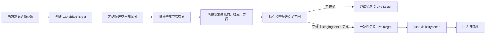

# Voxia 真实壳层交界与目标原子发布设计

- **日期**：2026-07-27
- **状态**：架构决策稿；取代 2026-07-26 设计中“Far Patch 固定 26 个边界槽即可代表
  Near/Far 与 Far/Far 接缝”以及“先推进 live TargetKey、再等待新覆盖补齐”的部分
- **范围**：现役 Voxia 唯一生产组合根中的 Near/Far、不同 Far LOD、临时缺邻居封口、
  相邻窗口交接、完整 XYZ 移动安全与 renderer 覆盖证明
- **不改变**：服务端权威、baseline 硬校验、Near `3×3×3 tiles`、Near Patch
  `4³ chunks`、Far Patch `8³ tiles`、渐进构建、confirmed edit、材质语义、唯一生产组合根
- **前置文档**：
  - [无空洞 Near/Far 呈现设计](2026-07-26-voxia-hole-free-near-far-presentation-design.md)
  - [Patch-diff 流送设计](2026-07-25-voxia-patch-diff-streaming-design.md)
  - [当前客户端流送与 LOD 真值](../../00-current-truth/design/client/streaming-lod.md)
  - [系统正交设计纲领](../../30-reference/overview/2026-06-27-架构设计指导思想-系统正交.md)

## 1. 大白话结论

现有实现把两件不同的事混在了一起：

1. `Far Patch` 是为了分批加载而切出的 `8×8×8 tiles` 大盒子；
2. Near、Far 以及不同 Far LOD 的交界，是画面中真正需要补齐的壳层分界。

大盒子的边缘不等于壳层分界。当前补墙只检查每个大盒子的六个面、十二条边和八个角，
所以只会碰巧覆盖落在大盒子边缘上的接缝。大量真实接缝位于同一个大盒子内部，根本没有
进入补墙流程。这就是用户仍能看到竖向空隙的根因。

移动时还有第二个边界混淆：代码把“正在准备的新位置”提前写成“已经显示的位置”。
覆盖检查于是立刻按新位置要求画面完整，但显卡侧的新 Near、Far 和接缝还没一起准备好，
便出现先缺一条、随后补齐的短暂空洞。

本设计把两组概念彻底分开：

- Patch 只负责“如何分批装载和提交”；
- 相邻空间实际由谁显示、使用什么 LOD，决定“哪里必须有接缝”；
- 新位置只是候选，只有新 Near、保护范围内的 Far、所有接缝和显卡资源全部通过检查后，
  才一次性成为当前画面；
- 旧画面继续保留到切换完成后的显卡 fence 结束。

## 2. 已确认根因

### 2.1 静止时的竖缝

现役 `FVoxiaFarPatchBoundaryShellBuilder` 以 Far Patch 为单位固定生成：

```text
6 faces + 12 edges + 8 corners = 26 after-images
```

它只知道 Far Patch 外框，不知道完整空间中每个 Tile 当前是 Near、Far LOD0、Far LOD1
还是其他 LOD。`FVoxiaNearFarBoundarySeamBuilder` 虽然能够生成实体/空气墙和不同分辨率
之间的 stitch，但生产调用点只在相邻 Far Patch 外框上。

另一方面，canonical scene builder 已经生成逐 Tile 的 `FarBoundaryFaces`，SceneHost 也会
保存和索引这些数据；现役 Patch-diff 路径没有消费它们。也就是说，正确的数据存在，
但没有接入真正的可见提交。

因此当前机制只在真实壳层边界恰好与 `8-tile` Patch 网格重合时可能奏效。Near/Far
和各 Far LOD 的大多数边界位于 Patch 内部，必然漏掉。

### 2.2 移动时先缺后补

当前 Root 在调用 `EnsureFarTargetRequested()` 时，先让 SceneHost ledger
`AdvancePatchTarget()`，然后 Near、Far 再围绕这个已发布的 TargetKey 渐进补齐。
相邻移动的保护范围又通过 `NearRadius + 1 tile` 间接猜测，没有直接从候选 Near
和三格 chunk 安全带推导。

现场的典型缺口为 `2187 = 3×27×27 chunks`，正好是一块三 chunk 厚的完整 XYZ slab。
这不是随机渲染闪烁，而是新目标已成为审计基准、对应保护 slab 尚未被新旧画面共同覆盖。

### 2.3 现有 `gap=0` 为什么会假绿

当前覆盖检查从 ledger 中已经登记的 boundary artifact 反推“应该存在什么”。
如果某个真实壳层交界从未被登记，检查器也不会期待它，因此能在肉眼可见空隙时仍报告
`gap=0`。

正确做法必须有两份相互独立的事实：

- 根据 Near/Far owner 与 LOD 相邻关系推导的“应当存在”；
- renderer 真实绑定和可见的“实际存在”。

两者不能来自同一张登记表。

## 3. 不变量

实现必须由 SceneHost 自己持续维护以下不变量：

1. 完整 XYZ 中，每个受保护 chunk 恰好有一个可见 owner；
2. 每个 Near/Far 相邻面都进入统一接缝解析；
3. 每个不同 Far LOD 相邻面都进入同一解析，与是否跨 Far Patch 无关；
4. 同 owner、同 LOD 的内部面不生成额外接缝；
5. 两侧都为空气时没有几何；一侧实体一侧空气时生成正常实体外露面；
6. Near 为空气不走特殊管线；如果 Far 一侧为实体，仍生成朝 Near 的 Far 内壁；
7. 临时缺少相邻 Patch 时可以有临时封口；相邻内容就绪后必须由真实相邻关系替换；
8. face 是接缝语义来源，edge/corner 只由相邻 face 的交汇关系派生；
9. 候选目标未完整前不得替换当前目标，也不得让审计基准提前跳到候选目标；
10. 旧资源只能在新资源可见且 post-visibility fence 完成后回收；
11. 空间、版本、owner、LOD、材质或 renderer receipt 不完整时显式等待或失败，不猜测；
12. 移动安全距离始终使用 XYZ/L∞，不得退化成水平面规则。

## 4. 三个正交模块

### 4.1 空间归属图：回答“这里由谁画”

新增 renderer-neutral 的不可变空间归属图。它不保存组件，只保存每个相关 Tile 的：

- Near 或 Far；
- Far LOD；
- canonical page / tile 身份；
- source、content、generation fingerprint；
- 六个面的 occupancy、owner 与精确 surface material snapshot。

Near 的 LOD 记为自身固定精度，但 Near/Far 仍以不同 owner 判断为真实交界。
Far 的实际 owner/LOD 必须复用 cube-shell planner 的唯一解析结果，不能在接缝模块中
重新猜 ring 或距离。

空间归属图只描述候选或 live 快照，不读取可变 actor/component 状态。

### 4.2 统一交界解析器：回答“这里需要什么封口”

所有相邻 Tile 面使用一个稳定键：

```text
LayerFaceKey = axis + negative_side_tile
```

它表示 `negative_side_tile` 与沿该轴正方向相邻 Tile 之间的唯一空间面，避免同一个面以
`A.PosX` 和 `B.NegX` 重复登记。

解析规则如下：

| 负侧 | 正侧 | 结果 |
|---|---|---|
| 同 owner、同 LOD、双方就绪 | 不论内容 | 不生成额外接缝 |
| Near | Far | 使用双方真实 face snapshot 生成 wall/stitch |
| Far LOD A | Far LOD B，且 A≠B | 使用同一 builder 生成 LOD stitch |
| 一侧已 live，另一侧属于目标但尚未就绪 | 生成 provisional closure |
| 一侧已 live，另一侧在世界/目标永久边界外 | 生成 permanent closure |
| 双方已确认空气 | 空几何 receipt，仍保留闭合证明 |
| 输入版本、材质或 owner 不完整 | Waiting/Fatal，禁止默认墙或默认材质 |

现有 `FVoxiaNearFarBoundarySeamBuilder` 的几何算法可复用，但类型和调用点必须泛化为
layer interface；不能继续让名称和 API 暗示它只服务 Near/Far。

固定 Far Patch boundary shell 不再决定 Near/Far 或 Far/Far LOD 接缝。它只提供
“邻居尚未装入或目标到此结束”的可用性输入。统一解析器对同一空间面只产生一个有效
after-image，从源头禁止临时封口与真实接缝重叠。

### 4.3 目标发布器：回答“什么时候换成新画面”

Root 和 SceneHost 明确区分：

- `LiveTarget`：当前已经显示并由覆盖检查使用的目标；
- `CandidateTarget`：正在后台准备的目标；
- `DesiredTarget`：玩家最新需要的位置，可在允许阶段替换尚未可见的候选。

`AdvancePatchTarget()` 不再直接改变 live ledger。它只创建候选计划。

候选计划直接从以下精确 chunk 集合推导 `CandidateProtectedDomain`，不再使用
`NearRadius + 常数 Tile` 猜测：

- 新 Near 的完整 `21³` chunk 盒；
- 该盒向完整 XYZ 各扩三 chunks 的移动安全带；
- 当前 live Near 中将失去 Near owner 的全部 outgoing chunks；
- 当前 live 保护范围与上述集合之间为保持连续覆盖所需的并集。

因此三格安全带只决定玩家能走多远，不会被误用成“旧 Near 只需替换三格”。一个完整
outgoing Tile 有七 chunks 厚，在 Far 精确接管其全部空间前仍由旧 Near 保留。

候选发布凭证必须同时证明：

- 新 Near `21³ = 9261 chunks` 已全部确认完成；其中可以全部是空气；
- 保护范围内每个非 Near chunk 有精确 Far owner/version；
- 所有 Near/Far 与 Far/Far LOD 交界均有确定 after-image；
- ownership texture、geometry component、boundary binding 已在隐藏侧准备；
- 独立 after-state 覆盖检查为零 gap、零 overlap、零 orphan；
- staging fence 已完成。

只有以上条件同时成立，SceneHost 才在一个不可失败的可见提交中更新：

- live Near/Far 几何；
- ownership；
- 统一交界绑定；
- `LiveTarget`；
- last-complete Near；
- renderer epoch 与 commit serial。

旧几何、旧 ownership 和旧交界继续保留到 post-visibility fence 完成。
候选保护范围之外的远景仍可按 Patch 渐进更新；这些局部提交必须各自保持当前 live owner
和统一交界不变量，但不阻塞新 Near 窗口成为 last-complete。



## 5. Patch 仍然存在，但不再决定接缝

Near Patch 和 Far Patch 继续作为构建、缓存、取消、预算和物理 batch 的单位。统一交界
after-image 可以按稳定空间坐标分到 physical boundary batch，以限制组件数量。

关键约束是：

- 逻辑 SlotId 由真实空间位置决定；
- physical batch 只决定“这些三角形放进哪个组件”；
- 某个面是否需要墙，由相邻 owner/LOD 决定；
- 不能从 physical batch 或 Patch 外框反推语义。

Far Patch 提交时重算：

- Patch 内部所有实际 LOD 变化面；
- Patch 外框上受该 Patch 影响的相邻面；
- 与 Near owner 改变相交的面；
- 由这些 face 交汇派生的 edge/corner closure。

Near 提交时只重算 changed Near tiles 及其六邻域。所有写集合在计划阶段冻结，并沿用
现有 commit planner 的冲突检测、hidden stage、visible swap 与 fence。

## 6. 单一边界账本

现有 ledger 将 face/edge/corner 分成只适用于 Far Patch 外框的三张表，导致真实层级交界
没有统一的 live truth。迁移后 ledger 使用一张 canonical boundary artifact 表：

```text
CanonicalBoundarySlotId
  = spatial kind(face/edge/corner)
  + tile-scale coordinate
  + axis/incidence
```

每个 live artifact 额外记录：

- 原因：真实 owner 变化、真实 LOD 变化、临时缺邻居、永久外边界；
- 两侧 owner/LOD/content fingerprint；
- geometry fingerprint 与非零 quad/triangle count；
- material coverage fingerprint；
- physical batch id；
- renderer component handle 与 registration epoch；
- staging/post-visibility fence epoch。

同一 canonical slot 同时只能有一个 after-image。Patch availability closure 和真实 layer
interface 都必须先经过统一解析器，不能各自向 renderer 写一份墙。

## 7. 独立覆盖证明

覆盖检查分成两层：

### 7.1 空间 owner 检查

从 `LiveTarget`、精确 Near owned chunks 与 live Far manifest 独立重建受保护范围：

- 每个 chunk 恰好一个 owner；
- 不以 ledger 已登记项作为 expected 输入；
- 候选检查读取不可变 candidate after-state，live 检查读取可见 renderer snapshot。

### 7.2 交界检查

从空间归属图逐相邻面重新推导 expected interface：

- Near/Far 六向交界；
- 所有 Far LOD 对；
- provisional/permanent closure；
- face 派生的 edge/corner junction。

再与 renderer snapshot 对照：

- expected non-empty artifact 必须有非零 geometry；
- slot、朝向、两侧 fingerprint、材质、batch binding、component handle 必须一致；
- expected empty receipt 不得残留可见组件；
- renderer 多出的 slot 记为 orphan；
- ledger 中有 slot 但 renderer handle 不存在也必须失败。

这样“根本没登记接缝”会成为明确缺口，不再得到假 `gap=0`。

## 8. 移动安全

玩家位置仍可在最后一个完整 Near 窗口外继续移动三 chunks。安全门只读取：

- last-complete Near 的精确 chunk 盒；
- 玩家当前位置；
- 候选移动后的位置。

三轴使用同一 L∞ 距离：

- 离开距离 `≤3 chunks`：允许；
- 已在边界上并沿边界移动：允许；
- 向完整范围返回：允许；
- 候选移动会让任一轴的最大离开距离从 `3` 增至 `4`：阻止该次移动；
- 新候选完整发布后，last-complete Near 一次性推进，安全盒随之移动。

安全门不操纵流送队列，也不通过超时自动放行。

## 9. 全空气 Near

不新增“高空模式”或空气专用提交：

- Near 全空气仍有完整的 9261-chunk confirmed receipt；
- geometry 可以是零三角形；
- owner、交界、coverage、fence 与普通地面窗口走同一管线；
- 从高空下降时，候选 Near 的实体几何与全部交界准备完成后才替换全空气 Near；
- Far 地面在整个过程中按同一 owner/LOD 规则保底。

## 10. 与材质覆盖缺口的边界

2026-07-27 已记录的“跨 LOD ownership cut 新增外露面没有精确材质”是独立的 canonical
输入缺口。统一交界解析器必须消费同一 resolved 邻居/owner/material 事实，并在材质缺失时
显式失败；本设计不会使用默认材质、双面材质、shader 染色或临时墙绕过它。

该材质问题会阻止对应候选发布，但不会改变本设计的接缝应用点和新旧目标时序。

## 11. 可观测性

CLI、结构化日志和 stdio snapshot 至少增加：

```text
live_target
candidate_target
candidate_protected_chunk_count
candidate_owner_ready_count
candidate_interface_expected_count
candidate_interface_ready_count
live_interface_expected_count
live_interface_visible_count
interface_missing_geometry_count
interface_missing_material_count
interface_orientation_mismatch_count
interface_orphan_count
first_interface_gap.axis
first_interface_gap.negative_tile
first_interface_gap.negative_owner/lod
first_interface_gap.positive_owner/lod
first_interface_gap.reason
target_publication_phase
```

候选未完成时必须能直接回答“缺的是 Near、Far、哪一个交界、材质、组件还是 fence”，
不得只输出泛化的 `not_ready`。

## 12. 被拒绝方案

### 12.1 扩大固定 Patch 外框或多加几层裙边

无法覆盖位于同一个 Far Patch 内的 Near/Far 和 Far LOD 交界；还会制造重叠墙。

### 12.2 把 `NearRadius + 1` 改成 `+2` 或增加等待毫秒数

只会改变复现位置，仍然让候选目标过早冒充 live；快速折返、对角移动和不同 Patch 对齐下
仍会失效。

### 12.3 Near/Far、Far/Far、临时封口各维护一套 renderer registry

同一空间面可能被多套系统同时写入，难以证明无重叠、无 orphan，也无法原子切换。

### 12.4 从现有 ledger 项反推 expected seam

遗漏项永远不会被期待，继续产生假绿。

### 12.5 全空气 Near 单独走零几何快捷路径

会把同一套 owner、交界与 fence 合同拆成两条路径，下降到地面时重新暴露交接空洞。

## 13. 迁移顺序

1. 先写纯数据测试，锁定真实 owner/LOD 相邻关系与 canonical face key；
2. 泛化 seam builder，证明 Near/Far、Far/Far LOD、六向、负坐标和空气语义；
3. 建立单一 boundary intent resolver，先生成 after-image，不接 renderer；
4. 将 ledger、commit planner 和 physical batch 改为统一 canonical boundary slot；
5. 接入 Far Patch 内部 LOD 面、跨 Patch 面与 Near 六邻域；
6. 将 SceneHost 拆分 live/candidate target，候选完整后原子发布；
7. 改造独立 coverage/interface auditor，删除 ledger 自证；
8. 接入 CLI/日志，刷新 current truth 与目录 README；
9. 完成自动化、Null-RHI、Real-RHI 和人工可见验收后，才移除旧固定语义路径。

迁移期允许旧 `FVoxiaFarPatchBoundaryShell` 作为兼容输入存在，但它只能描述 Patch
可用性，不能继续成为 Near/Far 或 Far/Far LOD 的语义真值。新旧路径不得同时向同一
canonical slot 发布。

## 14. 测试矩阵

### 14.1 纯算法

- Near/Far 位于 Far Patch 内部；
- Near/Far 正好位于 Far Patch 外框；
- Far LOD0/1、1/2、2/3、3/4，正反两侧互换；
- X/Y/Z 六个方向、负坐标、Patch 非对齐中心；
- 两侧空气、Near 空气/Far 实体、Near 实体/Far 空气、两侧实体；
- face 交汇生成 edge/corner，删除 face 后 junction 同步消失；
- provisional closure 被真实接口替换且同一 slot 始终只有一个 after-image。

### 14.2 事务

- 缺一个 Near、Far、interface、material、component 或 fence 时，`LiveTarget` 均保持旧值；
- candidate 完整时 geometry、ownership、interfaces 与 `LiveTarget` 同一次 visible commit；
- post fence 前旧资源仍在，完成后才回收；
- 快速折返只允许 latest-wins 替换尚未可见的 candidate；
- confirmed edit 与移动交错时写集合冲突显式 Busy/重计划，不出现双 owner。

### 14.3 路线

- 水平 X、Y、Z 单轴往返；
- XY、XZ、YZ 与 XYZ 对角；
- Patch 对齐与非对齐起点；
- 连续至少 10 Tiles；
- 向上进入 Near 全空气，再下降到地面；
- 分别延迟 Near、Far、interface stage、staging fence 和 post fence；
- 在最后完整 Near 外第 1、2、3 chunks 继续移动，第 4 chunk 被阻止；
- 上述每个受保护帧均要求 gap/overlap/interface-gap/orphan=`0`。

## 15. 完成定义

只有同时满足以下条件，才能称本问题完成：

1. 用户指出的 Near/Far 朝内竖墙在真实窗口中可见；
2. 每一组实际 Far LOD 分界均由同一机制处理，包括位于同一 Far Patch 内的边界；
3. 自动化能故意删除一个未登记的真实接口并让独立 auditor 报错；
4. 相邻移动所有受保护帧没有先消失后补全；
5. 全空气 Near 与下降路线不使用特殊分支；
6. 完整 XYZ 安全门保持前三格、阻止第四格、允许沿边界和返回；
7. Development build、完整 Voxia Automation、Node、Null-RHI、Real-RHI 与用户可见验收通过；
8. current truth、Voxia README、Presentation/FarField/Gameplay README、阶段稿与 session handoff
   同步，旧的“26 个 Patch 外框槽代表全部壳层接缝”表述被明确撤回。
