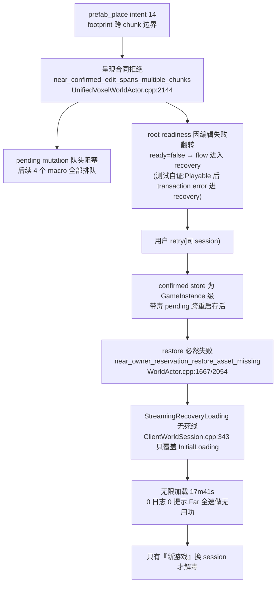
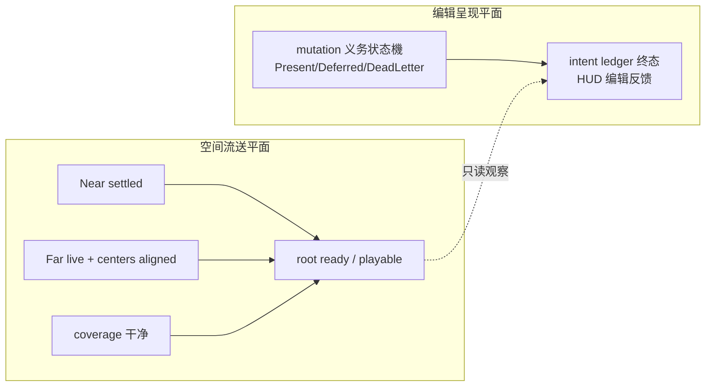

# Voxia 流送活性(liveness)与首载性能架构修复

- **日期**:2026-08-07
- **状态**:决策稿(取证已完成、根因已实锤,实施未开始)
- **范围**:唯一生产组合根内的呈现义务合同、root readiness、恢复(retry)语义、
  活性可观测面、覆盖证明增量路径、Bootstrap 首载分层与 worker 并发
- **前置文档**:
  - [Patch-diff 流送设计](2026-07-25-voxia-patch-diff-streaming-design.md)
  - [真实壳层交界与目标原子发布设计](2026-07-27-voxia-unified-layer-interface-and-target-publication-design.md)
  - [当前客户端流送与 LOD 真值](../../00-current-truth/design/client/streaming-lod.md)
  - [系统正交设计纲领](../../30-reference/overview/2026-06-27-架构设计指导思想-系统正交.md)
  - Voxia 工程笔记:`clients/Voxia/docs/engineering-notes/2026-08-03-near-source-lease-and-continuous-streaming.md`
- **不改变**:服务端权威、confirmed truth 来源、baseline 硬校验、完整 XYZ、
  Near `4³ chunks` / Far `8³ tiles` Patch、唯一 TargetKey、SceneHost 唯一账本、
  fail-closed + 禁自动重试哲学、固定形状事务(不引入运行时依赖扩散)

## 0. 大白话结论

用户报告的两个症状——「莫名其妙卡住世界」与「首载很慢」——本轮已在
2026-08-06 真实游玩日志中**完整抓到现场**并在代码中钉死机制:

1. **卡住不是死锁,是"等一个永远不会来的事件"**:放一个跨 chunk 边界的 prefab,
   confirmed mutation 撞上 Phase 2 时代的「单 chunk 呈现合同」被永久拒绝;这个失败
   又被升级成**整个世界**的 recovery;而 retry 恢复路径对这个故障是**结构性无效**的
   (带毒状态跨重启存活 + restore 必然失败 + recovery 阶段没有死线)——用户于是在
   零日志、零提示下盯了 18 分钟无限加载。
2. 这不是孤例,是**一类**:07-23 起至少 5 次已修复的活性事故、known_gaps 第 8 条
   (封闭地下口袋 `obligated=0` 停滞)与本次,全部同构——**管线的"总是前进或显式失败"
   不是任何系统自维护的不变量**,每个新门/租约/证明都可能造出新的静默等待死角。
3. **首载慢的大头不在 WorldGen 数据**(9261 chunks 数据 2.5s 就绪),而在固定小并发的
   网格化、3.3 万远景页 artifact、GT 分帧提交,以及一个**从未生效过的"增量"覆盖证明**
   (实测 1018/1018 全部回退全量重建,单次 5.7–13.4ms 全打在 GameThread 上)。

修复方向不是再打一个点补丁,而是补上三个缺失的架构承诺:
**呈现义务全射(不允许隐式永远等待)、readiness 正交(编辑失败不摧毁世界)、
活性哨兵(每个等待都能回答"在等谁、谁负责叫醒我")**。

## 1. 取证:2026-08-06 真实会话事故链

证据:`.worktrees/voxia-phase3-prefab-runtime/Saved/Logs/run_voxia_3d_world.log`
(2026-08-06 23:43 本地启动,通宵至 08-07 10:44,共三次世界根生命周期)。

| 时刻(UTC) | 事件 | 证据 |
| --- | --- | --- |
| 15:44:31 | World #1 启动 | `voxel_world_root_started` |
| 15:45:00 | World #1 ready(**29s 首载**) | `voxel_world_root_ready` |
| 15:46:10.952 | 用户放置 prefab(intent 14,prefab_id=3) | `world edit action=prefab_place ... reason=intent_submitted:14` |
| 15:46:11.127 | **呈现永久拒绝**:`near_confirmed_edit_spans_multiple_chunks`,`ready=false`,1 个 mutation 后排 4 个 macro | `voxel_transaction_presentation_blocked` |
| 15:46:31 | 用户 retry → World #2(同 session `cddcfe91`,无 `client_flow_session_prepared`) | `client_flow_root_bound` generation=2 |
| 15:46:31.401 | 新增错误 `near_owner_reservation_restore_asset_missing`,毒状态跨重启存活 | 同名 blocked 事件 |
| 15:47:10 | World #2 的 **Far 自己到达 playable** 并持续全速构建(17 分钟内 3900 次 boundary staging、169 次可见提交、283 次覆盖全量重建) | `voxel_pure3d_stream_phase_changed` |
| 15:46:31–16:04:11 | **World #2 root 始终未 ready,无限加载 17m41s,全程 0 Error/0 Warning、无任何原因输出** | 无 `voxel_world_root_ready` |
| 16:04:12 | 用户新游戏 → World #3(新 session `e4730959`,毒状态随旧 session 消失) | `client_flow_session_prepared` |
| 16:04:46 | World #3 ready(34s) | `voxel_world_root_ready` |



### 1.1 四层缺陷(每层都违反了本仓已有明文原则)

| 层 | 缺陷 | 违反的原则 |
| --- | --- | --- |
| ① 合同缺口 | 跨 chunk confirmed mutation 无呈现路径,被拒后**没有终结语义**(不死信、不回退、不上报),永久 pending。同类:known_gaps #8 封闭口袋 `obligated=0`(义务推导把非 Near/Far-resident 宏格记为 `DeferredNonResident`,`VoxiaWorldTransactionPresentation.cpp:113-126`,但**没有任何系统负责在 residency 变化时叫醒它**) | 07-25 设计 §5.1 明文「跨 Chunk 原子事务必须在对应阶段单独定义 presentation atomicity」——Phase 3 落了 mutation-group receipt 却没落 presentation 合同 |
| ② 爆炸半径 | 编辑呈现错误直接进入 `bModulesReady` 合取(`UnifiedVoxelWorldActor.cpp:3756-3773`),一个编辑失败把整个世界打回 loading | AGENTS.md §2.1 系统正交:编辑呈现与空间流送是两个系统,改 A 不得弄坏概念上无关的 B |
| ③ 恢复无效 | retry 保留 session(不清毒)+ restore fail-closed(注释自述「失败状态只能由显式 retry 清除」,而 retry 恰恰清不掉)+ `CheckInitialLoadingDeadline` 只对 `InitialLoading` 生效、`StreamingRecoveryLoading` **无死线** | AGENTS.md §2 铁律 8「显式失败,不静默降级」;recovery 路径对它所服务的故障必须有效 |
| ④ 可观测性 | root not-ready 没有 reason 输出;18 分钟静默。07-27 设计 §11 已要求候选发布「必须能直接回答缺什么,不得只输出泛化 not_ready」,但 root readiness 与 mutation 呈现没有等价物 | 工程方法约束 1/2:可观测面先行 |

### 1.2 这是一类,不是一个

| 事故 | 日期 | 同构点 |
| --- | --- | --- |
| target supersede 活性 + 确定性失败热重试 | 2026-07-23 | 等待被替代 candidate,无人负责推进 |
| settled-source 反向阻塞(循环等待) | 2026-07-24 | 两个门互相引用对方进度 |
| candidate refresh latch 只处理 `0→非零` | 2026-07-24 | 状态機对新事实不完备 |
| Far mailbox 全清空等待环 + source 抢跑 Root | 2026-08-03 | 跨系统时序无 owner |
| 封闭口袋 `obligated=0` 停滞(known_gaps #8,仍开放) | 2026-08-06 | Deferred 无唤醒键 |
| **跨 chunk prefab 呈现中毒 + retry 无效**(本稿,新确认) | 2026-08-06 | 拒绝无终结语义、恢复路径失效 |

六起事故一个病根:**活性不是任何系统的自维护不变量**。每次修复都是在事后给某一个
等待补一个唤醒者;架构上没有任何机制阻止下一个静默死角诞生。

## 2. 首载与流畅度取证

- **WorldGen 数据不是瓶颈**:9261 chunks 的 tile window 从请求到 loaded 仅 ~2.5s
  (相邻步 3087 chunks 约 1.5s)。
- **近场网格化并发固定为小值**:`VoxiaNearActiveChunkMeshWorkQueue.cpp:95-96`
  `WorkerCount = Clamp(cfg,1,8)`(现役配置 4)、`MaxInFlight ≤ 32`,与硬件核数无关。
- **覆盖证明"增量路径"从未生效**:`SceneHost.cpp:4025-4034` 要求
  `commit serial 精确衔接 && renderer epoch 恰好 +1 && far manifest revision 相同`,
  任一不满足即 `renderer_coverage_delta_baseline_not_clean` 全量重建。实测全会话
  **1018/1018 次全部回退**(`delta_applied=false`),单次 p50=5.65ms、p95=10.7ms、
  max=13.4ms,全部发生在 GameThread 的 post-fence 阶段——流送高峰期每次远景提交都
  附赠一发 6–13ms 的 GT 尖峰,这是「流送不顺畅」的直接成本项;Bootstrap 期间
  316 次 ≈ 1.8s 纯 GT 损耗。
- 其他 GT 常驻成本:boundary batch staging p50=1.36ms ×8587 次(game_thread_sliced)、
  far target publish 8–11ms/次。
- 首载 29–42s 的构成:近场网格化(小并发)+ 3.3 万远景页 provider/surface artifact +
  GT 分帧提交 + 覆盖全量重建,数据生成占比很小。

## 3. 架构决策

> 总纲:**不推翻** Patch-diff/固定形状/fail-closed 架构,而是补上它缺失的三个承诺。
> 每一条都是「承诺方强制维护契约」——不是给依赖方加自愈补丁。

### D1 呈现义务全射(obligation totality)——修 ①类

任何被 authority 接受的 confirmed mutation,呈现义务推导必须**全射**到三态之一,
禁止第四态(隐式永远等待):

```text
Present(固定 Patch 集)     — 立即进入固定事务
Deferred(唤醒键)           — 显式登记:等待哪个 key(chunk residency / window / fence);
                              key 的 owner 系统在 key 变化时必须重扫 deferred 表(自维护活性)
DeadLetter(终结)           — 不可呈现:从 pending 队列移除、写 intent ledger 失败终态、
                              用户可见编辑失败反馈;绝不阻塞后续 mutation
```

- **多 chunk mutation-group 成为一等公民**:`NearEditCommit` 泛化为
  mutation-group commit = ⋃(每个受影响 chunk 的固定 stencil → 1..8 Patch)。
  上限仍是**静态合同**:由 prefab catalog 冻结的最大 footprint 推导
  (基于 `FVoxiaPatchStreamingSpatialContract`,不是运行时扩散,与 07-25「固定形状」
  哲学一致)。跨 chunk 组的原子性沿用既有「同帧 batch 原子切换 + receipt 匹配全部
  PatchVersion」,只是 batch 形状由单 chunk stencil 换成组内并集。
- `DeferredNonResident`(known_gaps #8 路径)必须携带唤醒键并登记;残留无唤醒键的
  Deferred 是合同 bug,直接 Fatal(见 D4)。

### D2 恢复语义修复——修 ③类

- **retry 必须真的能恢复**:session retry 在重建 root 前,对 confirmed store 中全部
  pending mutation **重新推导呈现义务**(按 D1);推导为 DeadLetter 的当场终结并反馈,
  不得把毒带进新 root。
- **restore 失败不是世界失败**:`near_owner_reservation_restore_*` 失败降级为该
  mutation-group 的 DeadLetter(编辑失败,用户可见),不进入呈现阻塞。
- 跨窗口/跨重启存活的 session 状态,其**可呈现性必须在每次 root bind 时重新证明**——
  「一次性建立、之后没人管」的状态正是 §2.1 点名的反模式。

### D3 readiness 正交化——修 ②类



- `bModulesReady` 只保留空间流送事实(near settled / far live / centers aligned /
  coverage / PatchStreamingError);
- 编辑呈现健康度移入 intent/mutation 生命周期:失败 → intent ledger 终态 + HUD 反馈;
  **世界不因一个编辑回到 loading**;
- 保留的正当性:若呈现账本自身完整性被破坏(账本损坏、fence 错乱),那是空间平面的
  Fatal,照旧走 recovery——区分「编辑无法呈现」与「呈现系统坏了」两种事实。

### D4 活性哨兵(liveness sentinel)——修全类,防未来

流送+呈现平面的每一个 `Waiting / Deferred / Busy` 必须显式登记三元组
**(等待者身份, 唤醒键, 键的 owner 系统)**,由 Root 持有的单一注册表统一可见:

- CLI/observe 新增 `voxel_liveness_state`:当前全部未满足的 readiness 合取项
  (逐项命名,07-27 §11 口径)、每个 pending mutation 的义务状态与唤醒键、
  deferred 总量与最老等待时长;
- **无唤醒键的等待 = 合同 bug = Fatal**(编译期/Development `checkf` + session Fatal);
- 纯观测的 stall 升级:同一唤醒键上无进展超过阈值 → 结构化 stall report
  (HUD 加载页显示具体缺项 + observe JSONL),**不改变任何行为**——保持
  「不用 wall-clock 自动放行」的既有裁决,只消灭「静默」;
- 未来 Online provider 的订阅/租约(known_gaps 服务端 Subscription liveness 同类缺口)
  接入同一合同:每个网络等待也必须有唤醒键与 owner。

### D5 recovery 死线补洞——修 ③的直接洞

- `CheckInitialLoadingDeadline` 同等覆盖 `StreamingRecoveryLoading`
  (`ClientWorldSession.cpp:343` 当前只判 `InitialLoading`;`MarkRootProgress`
  在 329-330 行却接受两态——按后者对齐);
- 死线触发 → `Failed`,携带 D4 的结构化缺项 dump(哪个合取项假、哪个 mutation 阻塞、
  哪个 restore 失败),用户看到可诊断失败而非无限转圈。

### D6 覆盖证明增量路径修复——修流畅度

- 基线衔接条件从「epoch 恰好 +1」改为**从 cached serial 沿 ledger journal 重放 N≥1 步**
  (ledger 已有 commit serial 与逐事务增量,天然支持);或最低限度:每次 fallback 后
  立即以重建结果**刷新基线**,保证连续提交命中增量路径;
- 新增门禁指标:真实路线上 `delta_applied` 命中率必须 >90%,`fallback 累计数`进入
  phase 1 验收(「优化路径存在但从未生效」正是本次暴露的验证盲区);
- 全量重建若仍需保留,评估移出 GT 或分片摊帧。

### D7 首载分层与并发缩放——修首载

- 按 07-25 §8 已冻结口径执行并**用日志证明**:Bootstrap 的 playable 门 =
  「near 覆盖玩家 + required boundary 闭合」,完整 27-tile 目标只负责 settled;
  保护域外的 Far 目标严格排在 playable 之后(当前 World #2 证明 Far 全速构建
  与 root ready 已并行,需要证明的是 playable 不被非必需项拖住);
- worker 并发从硬件推导:`WorkerCount = clamp(cores - 2, 4, 16)` 类合同
  (仍是静态上限,启动时冻结,不是运行时扩容);
- 加载页显示真实进度(近场网格化 x/9261、required Far y/z),消灭「不知道在等什么」。

### D8(后续,不在本轮)跨会话 content-addressed artifact 缓存

以完整 PatchVersion/page identity 为键持久化 canonical page 与 mesh artifact,
二次启动跳过重复物化。依赖 H gate 与 identity 契约,单独立稿。

## 4. 被拒绝方案

| 方案 | 拒绝原因 |
| --- | --- |
| 直接放宽 `near_confirmed_edit_spans_multiple_chunks` 让多 chunk 混进单 chunk 事务 | 破坏 edit batch 原子性与 receipt 语义;正确做法是 D1 的固定形状泛化 |
| 给 recovery/loading 加自动放行超时或降低门槛 | 违反既有裁决(不用 wall-clock 承担正确性);D5 的死线只终结为显式 Failed,不放行 |
| retry 时清空整个 confirmed session store | 把合法 confirmed truth 一起丢掉;只应死信「不可呈现」的 mutation-group |
| 为 sealed-pocket/multi-chunk 各打专用补丁 | 第 7、8 个同类死角还会出现;必须以 D1 全射 + D4 哨兵消灭整类 |
| 保留 readiness 与编辑呈现耦合、仅修 restore | ②层仍在:任何未来编辑呈现缺陷都会再次表现为「世界卡住」 |

## 5. 不变量(新增,均由所属系统自维护)

| 系统 | 新承诺 | 显式失败 |
| --- | --- | --- |
| 呈现义务推导 | 全射:accepted mutation ∈ {Present, Deferred(带唤醒键), DeadLetter};Deferred 的唤醒键 owner 在键变化时重扫 | 无唤醒键的 Deferred → Fatal |
| Intent/mutation 生命周期 | DeadLetter 是终态:出队、ledger 记录、用户反馈;不阻塞后续 mutation | 终态不可逆,重复终结 → Fatal |
| Root readiness | 只由空间流送事实构成;每个为假的合取项可枚举、可命名 | 泛化 not_ready 输出视为实现错误 |
| Flow recovery | `StreamingRecoveryLoading` 有死线;retry 前完成 pending 义务重推导 | 死线到期 → Failed + 缺项 dump |
| 覆盖证明 | 真实路线上增量路径命中率 >90%,fallback 计数进门禁 | 基线衔接失败连续发生 → 结构化告警 |

## 6. 可观测面(先行)

- `voxel_liveness_state`(CLI + observe):readiness 逐合取项、pending mutation 义务态、
  deferred 唤醒键与最老等待、stall report;
- `world intent-status` 增加 DeadLetter 终态与原因;
- HUD 加载页:显示 D4 缺项摘要与 D7 进度,取代匿名转圈;
- `voxia_renderer_coverage_delta_fallback` 保留,新增命中率汇总;
- Phase 1/3 runner 新增断言:全路线 `deferred_without_wake_key=0`、
  `delta_applied_ratio>0.9`、recovery 死线可触发且带缺项 dump。

## 7. 测试矩阵

| 层 | 必测 | 门槛 |
| --- | --- | --- |
| 义务全射 | 单 chunk、跨 chunk 2/4/8 chunk prefab、封闭口袋(复现 known_gaps #8)、非 resident、窗口外 | 三态覆盖,无第四态;sealed pocket 变为 Present 或带唤醒键 Deferred 并最终 presented |
| 多 chunk 事务 | 跨 1/2/3 轴 chunk 边界 place/remove/replace,与移动交错 | 同帧原子、receipt 匹配全部 PatchVersion、gap/overlap=0 |
| 毒状态恢复 | 复现本次事故:place 跨 chunk → blocked → retry | retry 后 ≤1 个加载周期内 ready;毒 mutation 死信并有用户反馈 |
| readiness 正交 | 注入呈现错误于 Playable 后 | 世界不回 loading;intent 失败可见;账本完整性 Fatal 仍走 recovery |
| recovery 死线 | 人为卡死 recovery | 死线触发 Failed + 缺项 dump,无无限加载 |
| 覆盖增量 | 连续 AdjacentStep + 高频 Far 提交 | delta_applied 命中率 >90%,GT post-fence p95 显著下降 |
| 首载 | 冷启动分阶段计时 | playable 不等非必需 Far;worker 缩放后网格化耗时下降;加载页进度真实 |
| 回归 | 既有全量 Automation、Node、Phase 1/2/3、Real-RHI 严格门 | 全绿,阈值不放宽 |

## 8. 迁移顺序

1. **S0 观测先行(低风险,先行合入)**:`voxel_liveness_state`、readiness 逐项 reason、
   D5 recovery 死线 + 缺项 dump——先让下一次卡住变成「几分钟可诊断」;
2. **S1 D3 readiness 正交化**:摘除 `bTransactionPresentationReady` 对 world loading 的
   耦合,编辑失败入 ledger 终态与 HUD;
3. **S2 D1+D2 义务全射与恢复语义**(核心正确性件):多 chunk mutation-group 呈现、
   Deferred 唤醒键登记、DeadLetter、retry 重推导;顺带关闭 known_gaps #8;
4. **S3 D6 覆盖增量修复** + 命中率门禁;
5. **S4 D7 首载分层与 worker 缩放** + 加载进度;
6. **S5 门禁刷新**:全量 Automation/Node/Null-RHI/Real-RHI + 本稿测试矩阵 + 用户实跑
   复验(含复现原事故路线);
7. 收口后本稿归 `docs/20-archive/voxel-far-field/`,current-truth 与 known_gaps 同步。

每步遵循逐 step 纪律:改完即最小相关测试 + 进度日志;S2 前后必须保持唯一生产根、
无第二呈现路径。

## 9. 与服务端的边界

本稿全部改动在 Voxia 客户端(当前流送环路 `network_allowed=false`,服务端不在环内)。
未来 Online provider 接入时,订阅/租约/重连按 D4 同一活性合同实现——known_gaps
「服务端 Subscription liveness」缺口与本稿是同一原则的两端,不得再各造一套。

## 10. 进度日志

- 2026-08-07:完成取证(三世界时间线、四层缺陷、六事故同类归因、覆盖回退量化、
  首载分解),形成 D1–D7 决策与迁移顺序;实施未开始。证据锚点:
  `run_voxia_3d_world.log`(路径见 §1)、`UnifiedVoxelWorldActor.cpp:2144/3756-3773`、
  `WorldActor.cpp:1662-1668/2052-2056`、`ClientWorldSession.cpp:329-355`、
  `VoxiaVoxelPresentationSceneHost.cpp:4025-4034`、
  `VoxiaWorldTransactionPresentation.cpp:113-126`、
  `VoxiaNearActiveChunkMeshWorkQueue.cpp:95-96`。
