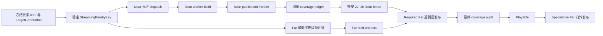
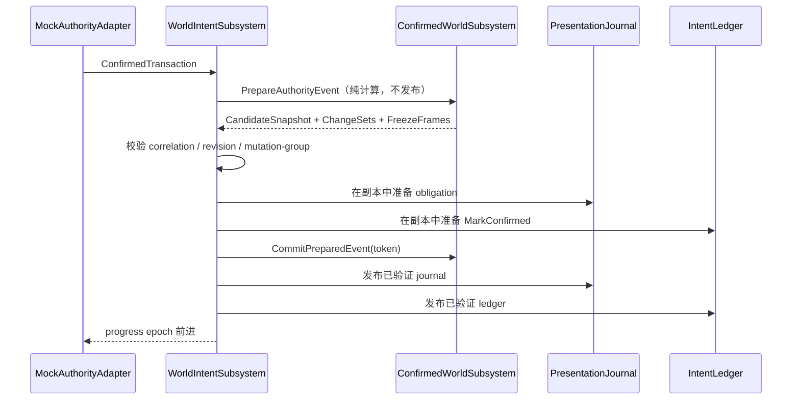

# Voxia 客户端 Mock 流送顺畅度专项设计

## 0. 决策摘要

本专项只处理 `clients/Voxia` 的唯一生产组合根与 Mock authority/worldgen 流程，
不实现服务器、Online provider、Web 或 Bevy 客户端。

本轮冻结以下用户验收口径：

1. 玩家进入可操作状态前，完整三维 Near 必须全部加载：
   `3×3×3 tiles = 27 tiles = 9261 chunks`；
2. Near 与 Far 均以目标建立时冻结的玩家完整 XYZ 为锚点，由近及远调度；
3. Near 未完成时，Far 只能使用不争抢 Near 关键路径的空闲 worker 做后台预计算，
   不得占用 Near 的 Game Thread / RHI 提交预算，也不得提前发布；
4. 完整 Near 可见后，先由近及远发布 Required Far，闭合 Near/Far 边界，再允许玩家操作；
5. 当前验收机器连续 10 次 Real-RHI Mock 冷启动：
   - 完整就绪时间 p95 `<= 20s`；
   - 单次最大值 `<= 25s`；
   - 零失败；
6. 任何等待都必须能回答“在等什么、谁负责推进、什么事实会唤醒、多久没有进展”，
   禁止静默等待和无诊断全量兜底。

本设计延续
[2026-08-07 流送活性与首载性能架构修复](2026-08-07-voxia-streaming-liveness-and-first-load-architecture.md)，
但明确否决其中“缩小初始可玩窗口、其余 Near 后台补齐”的可选方向：
本项目的 `Playable` 只认完整 27-tile Near。

## 1. 当前事实与未收口问题

截至 2026-08-10，S0-S4 修复已解决跨 chunk mutation 毒化 root、retry 无效和
recovery 无死线等主要机制；最新客户端 build、217 项 automation 以及 Phase 1/2/3
smoke 已有通过记录。但是这些证据还不足以宣布流送顺畅：

- 新鲜 Real-RHI 冷启动仍约 `27-41s`，超过本专项 `20/25s` 门禁；
- Near chunk mesh 已按玩家 chunk 排序，但 Near patch 的 ready/publication 队列仍按
  XYZ 字典序，不能证明最终可见提交由近及远；
- Far patch 构建虽已有 Required/Speculative 优先级和距离选择，bootstrap 期间仍可
  与 Near 争用资源，且发布边界没有表达本专项的“完整 Near 先行”硬合同；
- bootstrap 的 coverage audit 把“目标尚未补齐的预期 gap”与“账本结构损坏”都记为
  dirty，导致增量路径在 Near 未完成期间持续退回全量重建；
- 现有 smoke 只要求 `delta_apply_count > 0`，没有落实设计中的增量命中率门禁；
- 密闭坑位证据中，intent 10 已 `accepted`，confirmed overlay 已安装 revision 10，
  但 ledger receipt 仍为 `acknowledged=false / obligated=0`，说明 Mock
  authority -> confirmed -> presentation 的跨系统提交仍可能部分前进；
- 原始跨 chunk prefab 路径虽有单元覆盖，但现役 smoke 没有固定构造真正跨 chunk
  边界的用户操作目标；
- Root 尚无覆盖全部 Waiting/Busy/Deferred 状态的统一活性注册表。

因此，本专项不是单纯调参，而是补齐确定性优先级、关键路径预算、增量覆盖事实、
跨系统原子推进和活性自维护五项合同。

## 2. 范围与非目标

### 2.1 范围内

- Mock worldgen 冷启动、相邻 tile 迁移、显式 relocate、retry/new game；
- Near source、Near patch build/publish、Far patch precompute/publish、SceneHost coverage；
- Mock authority intent 到 confirmed truth，再到 Near/Far presentation receipt 的客户端链路；
- CLI、结构化日志、`.demo/observe/` 产物和自动化门禁；
- 最近目录 README、当前真相、known gaps 与阶段进度同步。

### 2.2 非目标

- 服务器协议、Gate/World/Scene/DataService 修改；
- Online authority/provider 与网络断线重连；
- world pack/baseline 协议变更；
- Web/Bevy 客户端；
- 持久化 artifact cache 或新的内容寻址格式；
- 改变 Near/Far Patch 固定空间形状、完整 XYZ 或服务端权威原则。

## 3. 不变量

### 3.1 Playable 完整性

`Playable` 必须同时满足：

1. 当前 `TargetKey` 与冻结的玩家 XYZ/目标世代一致；
2. 27 个 Near tile、9261 个 Near chunk 被 216 个固定 Near patch 精确拥有；
3. 每个 Near patch 均达到 `GeometryReady` 或 `VerifiedEmpty`；
4. 所有 Near patch 已完成可见提交与 post-visibility fence；
5. renderer coverage 无 gap、overlap、seam gap、orphan seam；
6. Required Far 已在 Near 完成后按距离发布，并闭合 Near/Far 边界；
7. authority coverage、Near center、Far center 与目标世代一致；
8. 不存在空间流送平面的 Fatal。

Speculative Far 全量 settled 不是 `Playable` 条件；它在玩家可操作后继续向外收敛。
编辑呈现失败仍与 root readiness 正交，除非失败证明 SceneHost/账本本身损坏。

### 3.2 近到远

“由近及远”同时约束 dispatch 与 publication：

- 较近距离壳层必须先获得 dispatch 机会；
- 同壳层可并行，避免把 9261 chunks 串行化；
- 较远壳层可以在前一壳层全部派发后预计算，但不能越过 publication frontier；
- `VerifiedEmpty` 是合法发布事实，不因没有几何而阻塞 frontier；
- 相同输入、玩家锚点与目标世代必须产生完全相同的顺序。

### 3.3 自维护活性

所有 `Waiting / Busy / Deferred` 都必须登记：

- `waiter_id`：谁在等待；
- `wake_key`：哪个事实变化会重新评估；
- `owner`：谁负责维护该事实并发出唤醒；
- `progress_epoch`：哪次推进改变了事实；
- `first_wait_at / last_progress_at`；
- `deadline_policy`。

无 `wake_key`、无 owner 或 owner 已销毁的等待属于合同错误，必须显式失败。

## 4. 三维稳定优先级

新增纯值优先级模型，供 Near/Far build index、worker dispatch 与 publication 共用。
优先级只依赖冻结输入，不读取逐帧可变状态。

```text
StreamingPriorityKey =
  TargetGeneration
  + WorkClass
  + DistanceShell
  + MinDistanceSquaredToPatchAabb
  + VerticalDistance
  + PatchCoordXYZ
```

- 玩家锚点使用完整 `player_chunk_xyz`；
- `DistanceShell` 是玩家 chunk 到 patch chunk AABB 的最小 Chebyshev 距离；
- 同壳层再按到 AABB 的最小欧氏距离平方排序；
- 再以垂直距离和 XYZ 作稳定 tie-break；
- 不加入相机朝向偏置，避免视角摆动造成队列重排；
- 玩家跨入新目标或显式 relocate 时建立新锚点；同一目标内不逐帧重排。

工作类别顺序为：

1. 已确认编辑的必要 presentation；
2. 当前目标 Near required；
3. Required Far precompute；
4. Speculative Far precompute。

Far publication 不只依赖优先级，还必须通过第 5 节的 Near fence。

## 5. 调度、预算与数据流



### 5.1 Near 关键路径

- Near worker 数继续按硬件核数推导并限制在 `[2, 8]`；
- 当前距离壳层先填满 worker，再开放下一壳层的预计算；
- ready result 进入按 `StreamingPriorityKey` 排序的 publication buffer；
- publication frontier 只允许当前最小未终结壳层提交；
- Near 使用流送 Game Thread/RHI 预算的全部关键份额；
- 每帧预算由现有 timing telemetry 校准，禁止用一次性长循环换取总时长。

### 5.2 Far 让行合同

Near fence 未满足时：

- Far 不得进入 SceneHost visible commit；
- Far 不得消费 Near 的 Game Thread/RHI 提交预算；
- 只有 Near 当前没有可派发 work，且存在空闲 worker 配额时，才可启动最多一个
  Lowest-priority Far precompute；
- 新 Near 壳层变得可派发时，未开始的 Far work 立即撤销；已运行 work 必须在现有
  cancellation work-unit 边界确认让行；
- Far 产物进入 held cache，按目标世代隔离，stale target 结果不得复用。

Near fence 满足后，Required Far 按相同三维距离模型发布；边界闭合并通过 audit 后进入
`Playable`。此后 Speculative Far 使用受限预算继续发布。

### 5.3 迁移

相邻 tile 迁移沿用 `retained/entered/exited` 完整 XYZ 合同：

- retained 18 tiles 不重建；
- entered 9 tiles 的 3087 chunks 按新玩家锚点由近及远准备；
- outgoing presentation 保留到新目标完整 Near + Required Far 原子 handoff；
- 普通移动不被“推断为 relocate”；只有显式 relocate 才进入阻塞式迁移语义。

## 6. Bootstrap 增量 coverage 账本

当前问题是把两种不同事实混成 `audit dirty`：

1. **预期不完整**：bootstrap 目标尚有 patch 未发布，gap 正在按计划减少；
2. **结构损坏**：重复 owner、非法 seam、未知 contributor、epoch/serial 断裂。

新账本将二者分开：

- target begin 时一次性登记完整 expected ownership；
- 每个 patch commit 只增量替换该 patch 的 ownership/seam contribution；
- `missing_expected_count` 可以大于零，但只要 contributor、serial、epoch 合法，账本仍是
  `structurally_clean`，允许下一次 delta；
- overlap、orphan、未知 patch、serial 不连续立即变为 `structurally_dirty`；
- dirty 时只允许一次显式 full audit/rebase，必须记录原因；禁止每次 commit 静默全扫；
- Near fence 前检查 `missing_expected_count == 0`；
- Playable 前再做一次独立 full audit，证明增量账本与真实 SceneHost 一致。

新增统计：

- `delta_eligible_count`；
- `delta_apply_count`；
- `delta_fallback_count` 及分原因计数；
- `full_audit_count`；
- `incremental_parity_failure_count`。

命中率门禁按 `delta_apply_count / delta_eligible_count >= 90%` 计算；target seed、最终独立
full audit 和显式 fault-injection 不进入 denominator。

## 7. Mock authority 到 confirmed presentation 的原子推进

密闭坑位失败表明 confirmed truth 与 intent ledger/presentation journal 可能部分前进。
`UVoxiaWorldIntentSubsystem` 必须成为这一跨组件提交的唯一协调者：



具体合同：

- `PrepareAuthorityEvent` 不改变 confirmed snapshot；
- 所有 correlation、freeze frame、journal 与 ledger 转换成功后才允许 commit；
- prepared token 绑定 session generation、base/new revision 与 event hash，过期即拒绝；
- commit 后 journal/ledger 发布不得再执行可能失败的校验；
- resident confirmed mutation 必须推导出至少一个固定 patch obligation，是否可见或被遮挡
  不能把 obligation 变成零；
- 真正 non-resident mutation 必须进入带 `chunk_residency_key` 的 Deferred，residency owner
  在 key 变化时主动重扫；
- 无 wake key 的 `obligated=0` 是 Fatal 合同错误；
- 多 chunk prefab 使用受影响 chunk 集合推导固定 patch 并集，保持同一 mutation-group
  的原子 batch 与统一 receipt。

该改动只作用于客户端 Mock authority 流程，不改变服务器 wire codec。

## 8. 活性、错误与期限

Root 持有统一 liveness registry，Near、Far、SceneHost、transport、intent presentation 都通过
稳定 port 注册等待，不允许 Root 猜测子系统内部状态。

### 8.1 期限分层

- `20s p95 / 25s max` 是验收性能门禁；超过即 smoke 失败并保留阶段归因；
- 只要 `progress_epoch` 持续前进，普通运行时不因机器较慢而在 25 秒主动失败；
- 同一 wake key 5 秒无进展输出一次结构化 stall report；
- 同一 wake key 15 秒无进展且 owner 没有可证明的在途工作，进入显式
  `streaming_stalled:<wake_key>`；
- Mock initial/recovery 的绝对正确性 deadline 统一为 60 秒，覆盖旧的 recovery 无期限缺口；
- 不自动 retry；错误页必须给出 retry/new game/exit，并保留完整诊断。

### 8.2 错误分级

- 单个编辑不可呈现：intent DeadLetter + 用户反馈，不摧毁 root readiness；
- stale target/result：显式 Cancelled，不能污染新世代；
- 性能预算超标：验收失败，运行时继续推进并记录 breakdown；
- coverage/ledger/fence/session identity 损坏：空间流送 Fatal，进入有期限 recovery；
- 无 owner、无 wake key、重复 owner：合同 Fatal，禁止静默 fallback。

## 9. 可观测面

新增或扩展 `voxel_liveness_state`、`client_flow_probe` 与 `voxia_observe`，至少输出：

- target/session generation、冻结的 `player_chunk_xyz`；
- Near 当前 dispatch/publication shell；
- 每壳层 pending/in-flight/ready/published/verified-empty 数；
- 27 tile、216 patch、9261 chunk 完成计数；
- Far precomputed/held/required-published/speculative-published 数；
- Far 是否因 Near fence 被 hold，是否消费过被禁止的 GT/RHI 预算；
- coverage 的 expected/missing/overlap/seam/structural state；
- delta eligible/apply/fallback ratio 与 fallback reasons；
- 全部 waiter 的 wake key、owner、age、last progress、deadline；
- intent 的 accepted/confirmed/obligated/presented/deferred/dead-letter；
- `root_started -> near_complete -> required_far_complete -> playable` 分段耗时；
- 最近一次显式错误及所属系统。

所有 smoke 产物继续写入 `.demo/observe/`，并生成机器可读 summary。

## 10. 测试与验收矩阵

### 10.1 C++ automation（TDD）

1. 优先级在正负 XYZ、边界、同距 tie 下确定且严格弱序；
2. Near dispatch/publication shell 单调，较远 patch 不越过 frontier；
3. 27 tile 少任一 patch/chunk/fence 时 `Playable=false`；
4. Far 在 Near fence 前零 visible commit、零 Near GT/RHI 预算消费；
5. Near 新工作出现时 Far queued work 让行，stale artifact 不发布；
6. bootstrap expected gap 不污染 structural clean，delta 可连续应用；
7. overlap/serial/epoch 破坏触发一次显式 rebase 或 Fatal，不形成重复全扫；
8. prepared confirmed event 在任一预校验失败时不改变 snapshot、journal、ledger；
9. 密闭坑位 resident mutation 获得非零 obligation 并 presented；
10. 真正 non-resident mutation 携带 wake key，并在 residency 变化时推进；
11. 真正跨 chunk prefab 形成 patch 并集并原子确认；
12. liveness 无 owner/wake key、无进展和 deadline 的状态转换。

### 10.2 Node runner 单测

- 解析所有新增 uint64/count 字段，不经 JavaScript `Number` 丢精度；
- 近到远 shell trace、Near/Far budget fence、delta ratio、阶段耗时门禁；
- 可编辑目标等待使用 confirmed/readable 契约，不依赖偶然 ray 时序；
- 构造精确跨 chunk anchor 和密闭坑位实际 place，而非只做 preview；
- 失败 summary 包含最老 waiter 与最近 progress evidence。

### 10.3 实跑

1. Null-RHI Phase 1/2/3；
2. Real-RHI Phase 1/2/3；
3. 连续 10 次 Real-RHI 冷启动专项：p95 `<=20s`、max `<=25s`、零失败；
4. 每次运行断言：
   - Playable 时 Near `27/216/9261` 完整；
   - Near publication shell 单调；
   - Near 完成前 Far visible publish 为零；
   - coverage 最终全审计干净；
   - delta eligible 命中率 `>=90%`；
   - 无 `LogVoxia Error`、无未解释 stall、无 pending intent；
5. Phase 3 明确覆盖密闭坑位 place 与真实跨 chunk prefab place；
6. 根级 automation 全量通过，Voxia 模块重新构建后再跑 smoke，禁止使用旧 DLL 证明。

## 11. 实施分段

- **S0 可观测与红测**：先落 priority/liveness/timing/ratio 输出及失败用例；
- **S1 三维优先级**：统一 Near/Far priority key、dispatch 与 publication frontier；
- **S2 双预算与 Far hold**：Near 关键预算、Far 空闲预计算、Required/Speculative 发布门；
- **S3 增量 coverage 账本**：拆分 incomplete/dirty，落实 delta parity 与 `>=90%` 门禁；
- **S4 Mock confirmed 原子泵**：prepare/commit、obligation totality、密闭坑位与跨 chunk；
- **S5 活性注册表**：wake key/owner/progress/deadline 与加载页/CLI；
- **S6 收口**：build、全量 automation、Node、Null/Real-RHI、10 次冷启动和文档同步。

每一段都先写失败测试，再做最小实现；若前一段不能证明绿，不进入下一段。

## 12. 风险控制

- publication frontier 可能产生队头等待：按壳层而非单 patch 建 frontier，同层并行；
- Far 预计算仍可能抢 CPU：只允许 Near 无可派发工作时的一份 Lowest-priority 配额，
  并验证 Near critical 时间线没有 Far work；
- 增量账本可能与 SceneHost 漂移：Playable 前独立 full audit 是最终真值门；
- 两阶段 confirmed 提交扩大 API：prepared token 不暴露 mutable snapshot，只暴露一次性 commit；
- 20/25 秒依赖机器：summary 同时记录硬件、RHI、分阶段时间；门禁只绑定当前验收配置，
  不把慢机器误判为权威数据错误；
- 当前工作区已有未提交修改：实施只增量编辑相关文件，不覆盖或清理既有修改。

## 13. 完成定义

只有以下条件全部满足，才允许写“客户端 Mock 流送已顺畅加载、此前已知客户端问题已收口”：

1. S0-S6 全部完成；
2. 10 次 Real-RHI 性能门禁通过；
3. 密闭坑位与真实跨 chunk 路径均形成完整 intent lifecycle；
4. 无静默等待、无无 owner/wake key 状态、无重复全量 coverage fallback；
5. 当前真相、known gaps、Voxia README 与目录 README 已同步；
6. 验证命令和 `.demo/observe/` 产物路径可复现。

在此之前，必须明确报告“核心机制已改善但专项尚未收口”，不得用单次 smoke 或单模块
automation 冒充完整客户端流程完成。
