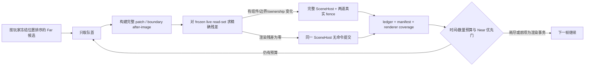

# Full Far 稀疏残差收敛优化设计

日期：2026-08-16  
状态：已批准，进入实现  
范围：`clients/Voxia` 的生产组合根与 mock/worldgen 客户端流程；不涉及服务端

## 1. 问题与证据

当前 Full Far 实跑在 Near 已完整可操作之后仍需约 `912.637s` 才完成后台收敛，总耗时约
`931.139s`。这不是面数本身造成的：

- Full 构建在 `118.907s` 已结束，后续约 `793.730s` 都在排空呈现事务；
- Full 目标共 `6859` 个 Far Patch，其中 `6281` 个为 `VerifiedEmpty`，占 `91.57%`；
- 真正有几何的只有 `578` 个，最终组件 `746` 个；
- 原始面 `692202`、合并 quad `297202`、三角形 `594404`，mesh 阶段只耗时约
  `5.514s`；
- 当前每个 patch 都固定经历 mailbox 让帧、边界批次准备、staging fence、visible commit、
  post-visibility fence，并在一次 commit 后强制让帧；观测结果约为每 patch `15.05` 帧、
  `8.63 patch/s`；
- Full 构建只要携带 frame pacer，provider 与 surface 都被压成单 worker，provider 扫描约
  `1.1122 亿` voxel sample，导致构建阶段也存在可避免的空转。

根因因此分成两个正交问题：

1. 构建调度把“玩家已可操作后的正常空闲期”仍当作只允许一个后台 worker 的关键期；
2. 呈现提交把“版本/覆盖变化”错误等同于“必然存在渲染命令变化”，对无渲染差异的 patch
   也支付完整 RHI 栅栏和逐帧事务成本。

## 2. 不变量

本优化不得改变以下契约：

1. 用户只有在完整 `3×3×3 = 27 tiles = 9261 chunks` Near 已提交、renderer coverage
   证明干净且 post-visibility 条件满足后才可操作；Full Far 不参与放行条件。
2. Near 与 Far 候选仍按冻结的玩家位置从近到远排序。批处理只消费现有有序队列的连续前缀，
   禁止越过前面的几何事务扫描后方空 patch。
3. 每个 Far Patch 仍是独立的固定 `FarPatchCommit`：保留 TargetKey、版本、manifest、完整
   face/edge/corner/layer after-image、read-set 复核、账本 commit serial 与 renderer coverage
   receipt；不引入第二个 live truth。
4. `VerifiedEmpty` 与 `GeometryReady` 仍使用同一个 planner、ledger、SceneHost 和覆盖证明。
   优化依据是“精确渲染残差是否为零”，不是内容类型名称。
5. 旧几何被空 after-image 替换、任一边界身份变化、ownership 变化或存在新几何 payload 时，
   必须执行原有隐藏准备、真实 staging fence、可见切换和 post-visibility fence。
6. 任何 read-set 变化、manifest 不一致、边界身份不一致或 coverage delta 失败都显式取消或
   fatal；不得把残差命中当作静默兜底。

## 3. 方案比较

### 3.1 只提高每帧 patch 数量

改动小，但每个空 patch 仍会创建边界批次并等待两道真实 fence。它只缩短显式让帧，无法消除
占比最大的固定事务成本，而且容易把 RHI 工作堆进单帧。单独采用不足以解决根因。

### 3.2 全代际位图或一次性 generation swap

可以获得最高吞吐，但会把数千 patch 合并为第二种提交语义，破坏逐 patch 近到远可见顺序、
局部失败诊断和固定事务边界，也会扩大回滚与移动抢占范围。本阶段不采用。

### 3.3 精确稀疏残差 + 有界连续前缀批处理（采用）

planner 以冻结 read-set 为基线，精确比较每个 canonical boundary slot 的 before/after
artifact identity，并结合 patch 几何 identity、payload、ownership 计算渲染效果：

- `renderer_mutation`：存在组件创建/替换/移除、边界批次变化或 ownership 写入；
- `render_command_free`：账本、manifest、coverage receipt 需要前进，但组件、边界批次与
  ownership 的物理状态完全不变。

账本仍消费完整 after-image；`WriteSet.BoundarySlots/BoundaryBatches` 只包含发生身份变化的
精确残差。`render_command_free` 事务在 SceneHost 内仍复核 read-set、提交 ledger、更新
manifest 与 renderer coverage，但不创建/注册组件，不提交 RHI 命令，也不伪造等待中的 fence。
其 staging/post epoch 在同一原子提交块内推进到新 renderer epoch，表示“该 epoch 没有待确认的
渲染命令”。

## 4. 调度决策

### 4.1 呈现批处理

- mailbox 只有在实际移交几何 payload 时才强制与呈现阶段分帧；纯元数据 stage 可在本帧继续；
- `render_command_free` commit 可连续消费，但同时受时间预算与最大条数双限；
- 任一 `renderer_mutation` commit 完成后立即让出 SceneHost；
- Held / RequiredOnly / Speculative、Near priority、handoff 与 supersede 规则保持不变；
- 所有循环只处理有序队首，因而批量不会改变 near-to-far 顺序。

初始生产参数：已有 live 画面时稀疏提交预算 `1.0ms/tick`，最多 `32 commits/tick`；几何
提交仍保持一次后让帧。参数必须通过结构化统计验证，不作为硬编码等待时间。

### 4.2 Full 构建并行

`ResolveFarBuildPacingAction` 改为按实时许可而不是按 `Full` 标签固定限速：

- `Blocked`：暂停；
- `OneSpareWorker`：单 worker、逐帧 grant；
- `Normal`：释放为既有配置的 provider/surface 并行度。

Full 目标只在完整 Near 已可操作后获得 `Normal`，因此正常静止场景不再单工扫描。玩家位置变化
仍沿用现有 cancellation/supersede 边界；若运行中重新进入 Near 关键期，必须暂停可暂停的
worker，或显式取消并让新 Near 目标优先，不能继续无界占用。

## 5. 可观测面

生产根 snapshot、CLI 和 observe 至少暴露：

- `far_render_command_free_commit_count`
- `far_renderer_mutation_commit_count`
- `far_sparse_commit_batch_count`
- `far_sparse_commit_max_batch_size`
- `far_sparse_boundary_slot_skip_count`
- `far_sparse_boundary_slot_write_count`
- `far_build_pacing_action`
- provider/surface 实际 worker 数与 foreground rest 时间

Full 完成事件增加同名汇总字段。发生残差判定退化时，日志必须能区分
`geometry_delta`、`boundary_delta`、`ownership_delta` 与 `read_set_changed`。

## 6. 测试矩阵

| 层级 | 场景 | 必须证明 |
|---|---|---|
| planner | 新增空 patch，全部边界 before/after 均 absent | 边界稀疏写集为零，render-command-free |
| planner | 任一边界 artifact 改变 | 只写对应 slot/batch，分类为 renderer mutation |
| planner | 空 patch 替换旧几何 | 不得命中无命令提交 |
| planner | geometry-ready payload | 不得命中无命令提交 |
| lifecycle | 无渲染命令事务 | 不 arm 真实 fence，仍得到 committed ticket 与同 epoch 证明 |
| lifecycle | 有渲染变化事务 | 原两道真实 fence 生命周期不变 |
| scheduler | Normal / OneSpareWorker / Blocked | 分别并行、单工 pacing、暂停 |
| scheduler | 连续稀疏 patch 与几何 patch | 只批连续队首；几何提交后让帧；数量/时间有界 |
| production root | mock startup | 用户放行前完整 27 tiles / 9261 chunks，顺序近到远 |
| production root | mock fullfar | 最终 6859 Far 精确齐套，renderer audit clean，无洞无错 owner |

## 7. 验收目标

安全门禁优先于耗时目标。功能门禁全部通过后：

- 以既有 `912.637s` Full 后台收敛为基线，第一阶段至少缩短到 `≤ 240s`（约 4 倍）；
- 期望目标 `≤ 120s`，若未达到，必须用新增分层计时继续定位剩余瓶颈；
- 27-tile Near 用户放行时间不得回退超过 `10%`；
- 实跑不得出现 renderer audit、coverage、manifest、order、fence 或 ownership 错误；
- 帧时间以现有 smoke 统计比较，p95 不得因批处理出现不可解释的尖峰。

## 8. 非目标

- 不修改服务端协议、服务端 authority 或 baseline 校验边界；
- 不引入概率型稀疏索引、近似跳过或静默容错；
- 不修改 Near 27-tile 门禁；
- 不把 Web / Bevy 归档客户端纳入实现或验证；
- 不在本阶段改成全 generation 原子交换。
