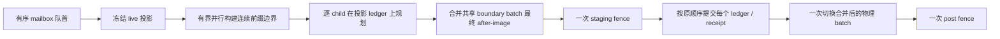

# Full Far 稀疏残差收敛优化设计

日期：2026-08-16
状态：已实现并验收
范围：`clients/Voxia` 的生产组合根与 mock/worldgen 客户端流程；不涉及服务端

## 1. 问题与证据

当前 Full Far 实跑在 Near 已完整可操作之后仍需约 `912.637s` 才完成后台收敛，总耗时约
`931.139s`。这不是面数本身造成的：

- Full 构建在 `118.907s` 已结束，后续约 `793.730s` 都在排空呈现事务；
- Full 目标共 `6859` 个 Far Patch，其中 `6281` 个为 `VerifiedEmpty`，占 `91.57%`；
- 真正有几何的只有 `578` 个，最终组件 `746` 个；
- 原始面 `692202`、合并 quad `297202`、三角形 `594404`，mesh 阶段只耗时约
  `5.514s`；
- 当前每个 patch 都固定经历 mailbox 让帧、边界批次准备、staging fence、visible commit、
  post-visibility fence，并在一次 commit 后强制让帧；观测结果约为每 patch `15.05` 帧、
  `8.63 patch/s`；
- 第一轮稀疏化后，NullRHI Full 已降到 `156.281s`，但 `3698` 个物理边界事务平均只有
  `1.330ms` 的真实游戏线程工作，却平均包含 `7.961` 个 batch；旧 SceneHost 每次 poll
  固定只做一个 batch，因而把约 `1.33ms` 的工作摊成近 `8` 帧，剩余时长主要是空等帧而非面数；
- Full 构建只要携带 frame pacer，provider 与 surface 都被压成单 worker，provider 扫描约
  `1.1122 亿` voxel sample，导致构建阶段也存在可避免的空转。

根因因此分成两个正交问题：

1. 构建调度把“玩家已可操作后的正常空闲期”仍当作只允许一个后台 worker 的关键期；
2. 呈现提交把“版本/覆盖变化”错误等同于“必然存在渲染命令变化”，对无渲染差异的 patch
   也支付完整 RHI 栅栏和逐帧事务成本。

## 2. 不变量

本优化不得改变以下契约：

1. 用户只有在完整 `3×3×3 = 27 tiles = 9261 chunks` Near 已提交、renderer coverage
   证明干净且 post-visibility 条件满足后才可操作；Full Far 不参与放行条件。
2. Near 与 Far 候选仍按冻结的玩家位置从近到远排序。批处理只消费现有有序队列的连续前缀，
   禁止越过前面的几何事务扫描后方空 patch。
3. 每个 Far Patch 仍是独立的固定 `FarPatchCommit`：保留 TargetKey、版本、manifest、完整
   face/edge/corner/layer after-image、read-set 复核、账本 commit serial 与 renderer coverage
   receipt；不引入第二个 live truth。
4. `VerifiedEmpty` 与 `GeometryReady` 仍使用同一个 planner、ledger、SceneHost 和覆盖证明。
   优化依据是“精确渲染残差是否为零”，不是内容类型名称。
5. 旧几何被空 after-image 替换、任一边界身份变化、ownership 变化或存在新几何 payload 时，
   必须执行原有隐藏准备、真实 staging fence、可见切换和 post-visibility fence。
6. 任何 read-set 变化、manifest 不一致、边界身份不一致或 coverage delta 失败都显式取消或
   fatal；不得把残差命中当作静默兜底。

## 3. 方案比较

### 3.1 只提高每帧 patch 数量

改动小，但每个空 patch 仍会创建边界批次并等待两道真实 fence。它只缩短显式让帧，无法消除
占比最大的固定事务成本，而且容易把 RHI 工作堆进单帧。单独采用不足以解决根因。

### 3.2 全代际位图或一次性 generation swap

可以获得最高吞吐，但会把数千 patch 合并为第二种提交语义，破坏逐 patch 近到远可见顺序、
局部失败诊断和固定事务边界，也会扩大回滚与移动抢占范围。本阶段不采用。

### 3.3 精确稀疏残差 + 有界连续前缀批处理（采用）

planner 以冻结 read-set 为基线，分别计算语义残差与物理渲染残差。canonical boundary
slot 的完整 artifact identity 负责账本版本；真实 mesh payload 的 geometry identity 只由
slot、顶点、三角形、材质和灯光等可见效果决定，不得混入 `Wall` / `ProvisionalWall` 这类
生命周期分类或 incident/version 指纹。随后再结合 patch 几何 identity、payload、ownership
计算渲染效果：

- `renderer_mutation`：存在组件创建/替换/移除、边界批次变化或 ownership 写入；
- `render_command_free`：账本、manifest、coverage receipt 需要前进，但组件、边界批次与
  ownership 的物理状态完全不变。

账本仍消费完整 after-image；语义 write-set 记录 artifact 版本变化，独立的 renderer
write-set 只记录几何出现、消失或 geometry identity 变化。若语义从临时封口推进为最终墙、
但真实 mesh effect 完全一致，SceneHost 必须原位更新 payload/binding receipt，复用既有组件，
不得重建物理 batch 或等待 RHI fence。`render_command_free` 事务在 SceneHost 内仍复核
read-set、提交 ledger、更新
manifest 与 renderer coverage，但不创建/注册组件，不提交 RHI 命令，也不伪造等待中的 fence。
其 staging/post epoch 在同一原子提交块内推进到新 renderer epoch，表示“该 epoch 没有待确认的
渲染命令”。

## 4. 调度决策

### 4.1 呈现批处理

- mailbox 只有在实际移交几何 payload 时才强制与呈现阶段分帧；纯元数据 stage 可在本帧继续；
- `render_command_free` commit 可连续消费，但同时受时间预算与最大条数双限；
- `renderer_mutation` 仍必须等自己的 post-visibility fence 完成；确认完成并退休后，可在本 Tick
  剩余预算内衔接下一个有序事务，不再额外空等整帧；
- Held / RequiredOnly / Speculative、Near priority、handoff 与 supersede 规则保持不变；
- 所有循环只处理有序队首，因而批量不会改变 near-to-far 顺序。

初始生产参数：已有 live 画面时稀疏提交预算 `1.0ms/tick`，最多 `32 commits/tick`；任何新
渲染事务仍保留自己的完整 fence 生命周期。参数必须通过结构化统计验证，不作为硬编码等待时间。

单个 `renderer_mutation` 内部的物理 boundary batch 使用另一层有界切片：同一次
GameThread poll 只消费有序 batch 队列的连续前缀，达到 `2.0ms` 软预算或 `8 batch` 硬上限
即让出。该切片不合并 patch、不提前可见提交，也不删除两道 fence；它仅消除“每个轻量
batch 必须空等一帧”的调度气泡。结构化 timing 必须记录 `polls`、`yields`、
`max_batches_per_poll`、软预算与硬上限。

### 4.2 Full 构建并行

`ResolveFarBuildPacingAction` 改为按实时许可而不是按 `Full` 标签固定限速：

- `Blocked`：暂停；
- `OneSpareWorker`：单 worker、逐帧 grant；
- `Normal`：释放为既有配置的 provider/surface 并行度。

Full 目标只在完整 Near 已可操作后获得 `Normal`，因此正常静止场景不再单工扫描。玩家位置变化
仍沿用现有 cancellation/supersede 边界；若运行中重新进入 Near 关键期，必须暂停可暂停的
worker，或显式取消并让新 Near 目标优先，不能继续无界占用。

## 5. 可观测面

生产根 snapshot、CLI 和 observe 至少暴露：

- `far_render_command_free_commit_count`
- `far_renderer_mutation_commit_count`
- `far_sparse_commit_batch_count`
- `far_sparse_commit_max_batch_size`
- `far_sparse_boundary_slot_skip_count`
- `far_sparse_boundary_slot_write_count`
- `far_semantic_boundary_slot_write_count`
- `far_build_pacing_action`
- provider/surface 实际 worker 数与 foreground rest 时间

Full 完成事件增加同名汇总字段。发生残差判定退化时，日志必须能区分
`geometry_delta`、`boundary_delta`、`ownership_delta` 与 `read_set_changed`。

## 6. 测试矩阵

| 层级 | 场景 | 必须证明 |
|---|---|---|
| planner | 新增空 patch，全部边界 before/after 均 absent | 边界稀疏写集为零，render-command-free |
| planner | 任一边界 artifact 改变 | 只写对应 slot/batch，分类为 renderer mutation |
| planner | artifact 版本变化但 geometry identity 相同 | 语义写集前进，renderer 写集为空 |
| geometry | 同一 mesh 从 provisional 改为 final 分类 | version identity 改变，geometry identity 稳定 |
| SceneHost | 仅边界语义变化 | 原位更新 receipt，组件/handle 不变且不 arm fence |
| planner | 空 patch 替换旧几何 | 不得命中无命令提交 |
| planner | geometry-ready payload | 不得命中无命令提交 |
| lifecycle | 无渲染命令事务 | 不 arm 真实 fence，仍得到 committed ticket 与同 epoch 证明 |
| lifecycle | 有渲染变化事务 | 原两道真实 fence 生命周期不变 |
| lifecycle | 单事务含多个轻量 boundary batch | 同 poll 连续推进；达到 2ms 或 8 个后让出；全部完成前不可见 |
| scheduler | Normal / OneSpareWorker / Blocked | 分别并行、单工 pacing、暂停 |
| scheduler | 连续稀疏 patch 与几何 patch | 只批连续队首；post fence 完成后可衔接；数量/时间有界 |
| production root | mock startup | 用户放行前完整 27 tiles / 9261 chunks，顺序近到远 |
| production root | mock fullfar | 最终 6859 Far 精确齐套，renderer audit clean，无洞无错 owner |

## 7. 验收目标

安全门禁优先于耗时目标。功能门禁全部通过后：

- 以既有 `912.637s` Full 后台收敛为基线，第一阶段至少缩短到 `≤ 240s`（约 4 倍）；
- 期望目标 `≤ 120s`，若未达到，必须用新增分层计时继续定位剩余瓶颈；
- 27-tile Near 用户放行时间不得回退超过 `10%`；
- 实跑不得出现 renderer audit、coverage、manifest、order、fence 或 ownership 错误；
- 帧时间以现有 smoke 统计比较，p95 不得因批处理出现不可解释的尖峰。

## 8. 非目标

- 不修改服务端协议、服务端 authority 或 baseline 校验边界；
- 不引入概率型稀疏索引、近似跳过或静默容错；
- 不修改 Near 27-tile 门禁；
- 不把 Web / Bevy 归档客户端纳入实现或验证；
- 不在本阶段改成全 generation 原子交换。

## 9. 实跑证据与剩余边界

- 原始 Real-RHI 基线：Full `912.637s`、总计 `931.139s`；构建在 `118.907s` 完成，随后
  presentation drain `793.730s`。
- 精确语义/物理残差、无命令提交、Full 自适应并行与 boundary 有界排空后：Real-RHI Full
  `201.484s`、总计 `223.130s`。
- 最终复验（含语义/物理写集独立观测）：Real-RHI Full `174.264s`、总计 `195.469s`；
  Full 构建 `31.864s` 完成，presentation drain `142.400s`，相对原 Full 缩短 `80.91%`、
  加速 `5.24x`。
- 最终生产根在 `21.205s` 放行，放行前 Near 为精确 `27 tiles / 216 patches / 9261 chunks`；
  Full 终态 `6859`，`3107` 次无命令提交、`3748` 次 renderer mutation、物理 boundary slot
  写入 `123152`、语义写入 `123534`、精确物理跳过 `85879`；coverage gap/overlap/orphan 均为零，
  parity 为真、资源静止且 clean exit。

当前剩余主成本不是 mesh：真实 RHI 的 boundary mesh 总游戏线程工作约 `4.13s`，`98.2%`
物理事务已在一次 poll 内排空；但仍有约 `3747` 个真实 renderer mutation，各自保留两道 fence。
若继续追求 `≤120s`，应另立“有序投影账本 + 多 patch fence group”阶段，显式定义共享 fence、
组内失败、移动抢占与逐 patch receipt 语义；不能通过放宽帧预算、跳过 fence 或近似稀疏判定实现。

## 10. 2026-08-17：20 秒双阶段门禁下的有序投影组

最新 Null-RHI 诊断中，Near 在 `5.637s` 完整放行；Far 时钟启动后，完整 manifest 于
`8.132s` 发布，但到 `10.000s` 时只提交了 `105/6859` 个 patch，仍有 `6753` 个有序 mailbox
项待排空。已提交组的最大尺寸仅为 `2`，原因不是 `64` 上限失效，而是相邻 patch 会读取并改写
同一 canonical boundary slot / batch：若全部基于同一 live 快照规划，第二个 patch 不能安全进入
同一 fence group。同时，单例 `BoundaryBuildFuture` 又把约 `8–14ms/patch` 的边界构建串行化。

因此 10 秒 Far 门禁采用以下正式边界：

1. 消费端仍只领取由近及远、角度由小到大、XYZ 稳定排序的连续队首；组内顺序就是独立
   `FarPatchCommit` 的提交顺序，禁止越过 mailbox 空洞。
2. 组从 SceneHost 当前 live ledger / renderer receipt 建立唯一投影。第 `N` 个计划只允许读取
   live 基线或 `[0, N)` 已承诺的 after-image；禁止反向依赖。每个 child 仍保留完整 TargetKey、
   read-set、manifest entry、commit serial 与终态 receipt。
3. 同一 boundary batch 的多次有序改写在组内合成为一个最终物理 after-image；所有 child 的
   语义 ledger after-image 仍按序提交。组内中间态不让出 GameThread、不可被外部观察；最后一个
   child 之后才一次切换合并后的 boundary batch。
4. 组内所有候选资源隐藏就绪后只启动一次 staging fence；全部有序 ledger/visibility commit
   完成后只启动一次 post-visibility fence。任何预校验、隐藏准备或 fence 前失败都原子取消整组；
   第一项可见后不得部分回滚。
5. 边界构建使用有界窗口并行。每个任务接收冻结的“live + 本组更早候选 profile”投影，因而
   计算可并行、语义仍等价于逐 patch 顺序执行；只按队首连续前缀收割结果并提交。
6. 不以扩大 10 秒、减少 `33725/6859`、跳过 coverage/parity、删除真实 fence 或制造第二条
   production root 作为性能手段。

## 11. 2026-08-17 收口结果

上述有序投影组已经接入唯一生产根，且 Full Far 不再走 `StartupRequired → Full` 两份目标：
从启动起只准备一份 `33725 pages / 6859 patches` Full manifest，Near 阶段只通过许可控制并发和
可见发布。玩家入场由 TargetKey 绑定的 Near presentation latch 决定；它同时核对 patch coverage、
CPU mesh 异步队列与 settled revalidation，锁存后才启动独立 Far 10 秒时钟。

性能收口中另外删除了两个与语义无关的算法瓶颈：Far pending 消费从“每次弹出后线性删除/重扫”
改为排序数组加游标，终态判断从完整 snapshot 扫描改为 required-work 计数。完整 manifest 串行
校验由约 `485ms` 降到约 `6ms`；provider/surface 使用冻结硬件策略的 `16/16` 并发。最终 group
上限为 `256 children`、renderer mutation 上限为 `256`、玩家入场后发布软预算为 `16ms`；
逐 child 的 TargetKey、版本、read-set、commit serial、coverage receipt 与显式失败语义未合并。

后续跨 tile 验收发现 coarse 全局对齐页原先按名义细层边界剔除，页数会随 XYZ 网格相位从
`33725` 漂移到 `33938`。现役规划器改为读取上一层实际 coverage bounds，并在后两层固定保留
`144/190` 个 overlap guard；五层页数因此恒为 `702/4184/15113/7677/6049`，任意已覆盖的
正负坐标相位均保持总数 `33725`，且最细 owner 规则不变。

1280×720 Real-RHI / RuntimeMock 连续 10 次独立冷启动全部通过：Near 最大 `8240ms`，从入场
起 Far 最大 `9373ms`，总计最大 `17319ms`。每轮均完成精确 `33725/6859`，使用 `28` 个 group，
终态 mailbox/ready/in-flight/fatal/producer queue 均为 `0`，coverage clean、quiescent、settled
均为真。原始证据与汇总位于 `.demo/observe/voxia_near_far_10run_2026-08-18_final/`。

相邻 +Y 的 Real-RHI 增量路线同样通过：Near `3087/3087/6174` 差分耗时 `2962ms`，Far
`6618/241/241` Patch 差分耗时 `7648ms`，平移后目标仍严格为 `33725/6859`。产物为
`.demo/observe/voxia_phase1_2026-08-17T16-44-12-884Z_real_rhi_1280x720/`。

最终门禁：Development build 成功；Node `184/184`；完整 `Automation RunTests Voxia`
`224/224`。此处只收口 RuntimeMock 客户端流水线；Online authority/provider 与更多硬件档仍是
独立后续范围。
