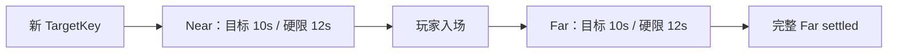

# Near/Far 12 秒硬门限实施计划

> **For agentic workers:** REQUIRED SUB-SKILL: Use superpowers:executing-plans to implement this plan task-by-task. Steps use checkbox (`- [ ]`) syntax for tracking.

**Goal:** 将 Near/Far 从单一 10 秒硬失败改为“10 秒性能目标、12 秒硬上限”，并保证运行时、自动化门禁与当前事实使用同一口径。

**Architecture:** `FVoxiaStreamingDeadline` 继续是唯一单调时限所有者，只把默认硬预算改为 `12000ms`；世界根仍自行逐 Tick 维护超时。Node 验收只校验运行时快照中的 `12000ms`，不增加测试专用兜底或静默放宽。

**Tech Stack:** Unreal Engine 5.8 C++、UE Automation、Node.js `node:test`、Markdown。

## Global Constraints

- Near 与 Far 的性能目标均为约 `10000ms`，硬失败上限均为 `12000ms`。
- Far 仍从对应 TargetKey 的 Near 入场锁存时刻开始计时。
- 时限换代、单调起点、显式失败和完整 XYZ 契约不变。
- 不覆盖或提交当前工作树中的既有用户改动。

---

### Task 1: 冻结默认 12 秒契约

**Files:**
- Modify: `clients/Voxia/Source/Voxia/Gameplay/VoxiaStreamingDeadlineAutomationTest.cpp`
- Modify: `clients/Voxia/Source/Voxia/Gameplay/VoxiaStreamingDeadline.h`

**Interfaces:**
- Consumes: `FVoxiaStreamingDeadline()`、`Observe()`、`Complete()`。
- Produces: 默认 `BudgetMs=12000`；显式传入 `10000` 的通用语义保持不变。

- [x] **Step 1: Write the failing test**

  增加默认构造测试：`10001ms` 仍为 active、恰好 `12000ms` 可完成、`12001ms` 显式 exceeded。

- [x] **Step 2: Run test to verify it fails**

  Run: `Automation RunTests Voxia.Gameplay.StreamingDeadline`

  Expected: 默认预算仍为 `10000`，新增断言失败。

- [x] **Step 3: Write minimal implementation**

  将 snapshot、构造函数默认参数和成员默认值统一改为 `12000`；不改变显式预算构造路径。

- [x] **Step 4: Run test to verify it passes**

  Run: `Automation RunTests Voxia.Gameplay.StreamingDeadline`

  Expected: PASS。

### Task 2: 同步根级门禁与当前事实

**Files:**
- Modify: `clients/Voxia/scripts/run_phase1_world_lifecycle_smoke.test.js`
- Modify: `clients/Voxia/scripts/run_phase1_world_lifecycle_smoke.js`
- Modify: `docs/00-current-truth/design/client/streaming-lod.md`
- Modify: `clients/Voxia/README.md`

**Interfaces:**
- Consumes: `validateDeadlineSnapshot()` 与启动 Near 时间门禁。
- Produces: Node 门禁要求 runtime snapshot 的预算为 `12000ms`，Near 启动硬上限为 `12000ms`。

- [x] **Step 1: Write the failing tests**

  把 deadline snapshot 的有效预算样例改为 `12000`，并增加 `12001ms` 被拒绝、`10001ms` 仍在容差内的启动时间样例。

- [x] **Step 2: Run tests to verify they fail**

  Run: `node --test scripts/run_phase1_world_lifecycle_smoke.test.js`

  Expected: 生产门禁仍只接受 `10000ms`，新增断言失败。

- [x] **Step 3: Write minimal implementation and docs**

  将 deadline snapshot 固定预算和 Near 启动硬上限改为 `12000`；文档明确 `10 秒目标 / 12 秒硬限`，不改 10 秒一轮的 soak 采样节拍。

- [x] **Step 4: Run focused verification**

  Run: `node --test scripts/run_phase1_world_lifecycle_smoke.test.js`

  Expected: PASS。

### Task 3: 用真实跨 Tile 路线验证硬限

**Files:**
- Evidence: `.demo/observe/voxia_far_deadline_12s_*`

**Interfaces:**
- Consumes: 唯一生产地图、RuntimeMock、Real-RHI、结构化 CLI。
- Produces: Near/Far 实际 elapsed、Far patch 终态及失败原因。

- [x] **Step 1: Build Development Editor**

  Run: `Build.bat VoxiaEditor Win64 Development Voxia.uproject -WaitMutex -NoHotReloadFromIDE`

- [x] **Step 2: Run the minimal vertical cross-tile route**

  Run: `node scripts/run_phase1_world_lifecycle_smoke.js --real-rhi --vertical-only --res 1280x720`

  首跑失败：先在跨 Tile 后触发 `far_deadline_exceeded`（发布活锁），修复后又在静止 Full Far
  收敛门禁 `12007ms` 超限。两项根因与修复见
  `2026-08-18-far-publication-liveness-deadlock.md`。最终该路线通过，六代目标 Far 分别为
  `5364/4423/5560/4814/3748/4664ms`。

- [x] **Step 3: Decide from evidence**

  未放宽到 12 秒以上。两项根因都定位并修复：
  1. `LiveLayerFaceArtifactCount` 增量计数在 `AddCanonicalArtifact` 缺失维护，导致读集校验
     恒失败、候选无限重排；
  2. 入场后单组渲染变更上限 `32` 使组数由 `34` 涨到 `120`，按组固定开销被多付近四倍。改回
     `128` 后 Full Far 由 `9844ms` 降到约 `5.2s`。

  2026-08-19 重采基线：1280×720 Real-RHI 连续 5 次冷启动 `5/5`，Near
  min/p50/max=`7619/7718/8192ms`，入场后 Far min/p50/max=`4962/5176/5889ms`，
  每轮 `33725/6859/34 groups`。产物
  `.demo/observe/voxia_rebaseline_2026-08-19/near_far_rebaseline_summary.json`。

  仍开放：`--performance-only` 的帧门禁只剩 hitch ratio 一项超标（由个位数离群帧主导），
  作为独立项跟踪，不阻塞本计划收口。
