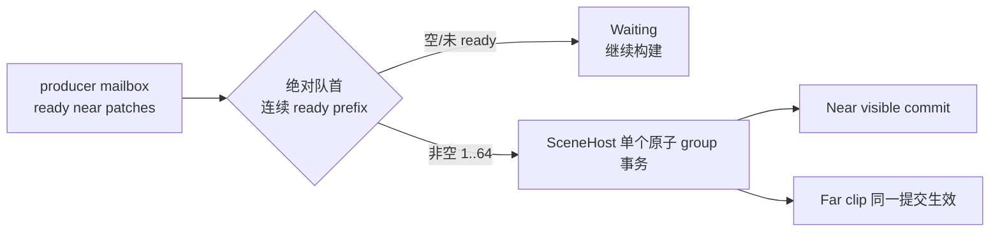

# Near 组提交分帧决策稿

- 日期：2026-08-19
- 状态：已收口（Voxia `7737bb8`）
- 前置：[`2026-08-19-long-haul-streaming-smoothness-plan.md`](2026-08-19-streaming-deadline-tolerance-plan.md) §8
- 目标：消除长程移动中每 tile 一次的 GameThread 尖峰（13–16ms 的 Near 组提交），
  使 `--long-haul-only` 的 hitch 门禁（每段 >16.67ms 帧 ≤1）转绿。

## 1. 现状（代码事实）

每次换区,`AVoxiaWorldActor::ContinueNearPatchPresentation`（每帧推进）走：

```
StageNextReadyNearPatchMove
  ├─ CollectReadyMovePrefix(≤64)            // 有序前缀收集
  ├─ Take ×N                                 // mailbox payload 移入组(MoveTemp)
  └─ SubmitPendingNearPatchPresentationGroup // ↓ 同一帧全部完成
       ├─ PlanNearMove ×N                    // 构建 plan + read-set + after-image 校验
       ├─ CountContinuousPrefix / Rebase     // 组前缀与 ownership 重建
       └─ BeginPatchPresentationGroup        // SceneHost:含 ValidateReadSet ×N、
                                             //   fence/staging 组装、账本 AdvanceGroup
```

实测（12 组统计）`group_prepare_ms ≈ 12.9ms/组`,叠加当帧日常工作后产生
每 tile 1–2 帧 >16.67ms。组大小上限 `MaxNearPatchGroupChildren = 64`
约束的是**组的规模**,不是**单帧 GameThread 时间**。

## 2. 工程约束的落点（用户指定）

| 约束 | 本稿的落点 |
| --- | --- |
| 最小化 | 先细分计时归因,只分帧真正的热点段;不预防性重构无关结构 |
| DRY | 若 Plan 与 Begin 存在重复校验（read-set 构建后整组重校验）,合并为一次,而不是把重复的两遍各自分帧 |
| 唯一事实源 | 组的跨帧状态只存在 `PendingNearPatchPresentationGroup` 一处,不新增平行状态容器 |
| 高内聚低耦合 | 分帧策略进 `FVoxiaWorldRootStreamingSchedulingPolicy`（组预算已在此）,WorldActor 只执行 |
| 模块正交 | 提交的**原子性语义不变**：账本 AdvanceGroup、fence arm、渲染变更仍单帧发生;分帧只作用于其前的纯 CPU 组装段 |

## 3. 待归因（先测后改）

在 `SubmitPendingNearPatchPresentationGroup` 加常驻细分计时
（与 `voxia_near_world_tick_timing` 同模式：超阈值才打）：
`take_ms / plan_ms / rebase_ms / begin_ms`,其中 begin 内部再分
`begin_validate_ms / begin_stage_ms / begin_ledger_ms`。

跑 `--long-haul-only --long-haul-tiles 4` 取数据,按占比决定：

- **若 Plan 主导** → Plan 分帧：每帧最多 plan K 个（K 由帧预算常量导出）,
  组保持在 `PendingNearPatchPresentationGroup` 中带进度游标;全部 plan 完成的那一帧
  才进入 Begin（原子段不动）
- **若 Begin.ValidateReadSet 主导** → 先查 DRY：Plan 刚构建过 read-set,Begin 是否
  必须整组重校验;若必须（跨帧后账本可能已变）,则校验只对"账本 serial 自 plan 后变化"
  的场景全量执行,serial 未变时走凭证短路（唯一事实源：账本 serial）
- **若 stage/fence 主导** → 涉及渲染资源,单独评估,不并入本稿

## 4. 验收矩阵

1. 单测：调度策略的分帧预算函数（纯函数）
2. `Automation RunTests Voxia` 221 全绿
3. `--long-haul-only --long-haul-tiles 4`：per-tile 尖峰消失
   （期望每段 >16.67ms GT 帧 = 0,`near_patch_ms` 峰值 < 8ms）
4. `--long-haul-only --long-haul-tiles 12`：hitch 门禁全绿、趋势门禁保持通过
5. `--full-far-only`：Near/Far 收敛时延不回归（对照 2026-08-19 基线）

## 5. 归因结果（实测,4-tile,18 组样本）

`voxia_near_patch_group_submit_timing`：

| 阶段 | 实测 | 占比 |
| --- | --- | --- |
| **plan_ms**（PlanNearMove ×N） | **9.3–17.1ms** | **~80%** |
| rebase_ms | 0.7–1.0ms | ~6% |
| begin_ms（含 ValidateReadSet ×N） | 1.3–2.7ms | ~14% |

Begin 内的 read-set 校验从未超过 2ms 阈值——凭证机制（`bLedgerInvariantAlreadyValidated`）
工作正常,不是热点。

**热点定位**：`PlanNearMoveInternal` 每个 child 内联调用 `ProjectNearOwnership`,
后者**两次遍历 `Ledger.ExactNearOwnedChunks`（9261 chunk）**构建全窗口 ownership mask。
64 child × 2 × 9261 ≈ **每组 120 万次集合迭代**。

而代码事实是这些 mask 在组路径下**全部是死工作**：

- 非尾 child：`bDefersOwnershipToGroupTail` → 消费 live texture,自己的 mask 无人读
- 尾 child：`RebaseNearMoveGroupOwnership` 用**全组 after-image 一次投影**并
  **覆盖**尾 plan 的 mask
- 且 Rebase 被调了**两次**（`SubmitPendingNearPatchPresentationGroup` 一次、
  `BeginPatchPresentationGroupInternal` 的 `bCumulativeNearOwnership` 分支又一次）

## 6. 方案（修订：不做分帧,删死工作）

原计划的"分帧"不再需要——热点不是必要工作太多,是**无人消费的工作在被重复做**。

按约束逐条：

- **唯一事实源**：组的 ownership 唯一由组尾 mask 承载。现状类型上不表达这一点,
  导致每个 child"先造一个假的再被丢弃"。给 `FVoxiaPatchPresentationPlan` 增加
  `bOwnershipDeferredToGroupTail` 一个 bool,把既有的 defer 语义显式化。
- **DRY**：组路径 per-child 投影删除（新组入口 `PlanNearMoveForGroup`,内部跳过
  `ProjectNearOwnership`）;双 Rebase 合一（删 Submit 里那次,保留 Begin 内
  `bCumulativeNearOwnership` 的必经一次）。
- **最小化**：单 child 流（move/edit/trim/removal）完全不动,默认路径零变化;
  不引入分帧状态机、不加新容器。
- **正交**：提交原子性（账本 AdvanceGroup、fence、渲染变更单帧）不动。

一致性强化：`IsValid` 对 deferred plan 放行 mask 要求,但 Begin 组循环交叉校验
"非尾必须 deferred、尾在 Rebase 后必须已承载 mask"——不变量比现状更强而不是更松。

预期：plan_ms 10–12ms → 1–2ms,组提交总耗 13–16ms → ~4–5ms,低于 8.33ms 帧预算,
每 tile 尖峰消失。

## 7. 进度日志

- 2026-08-19：立稿;加 `voxia_near_patch_group_submit_timing` / 
  `voxia_patch_group_begin_read_validate_timing` 常驻细分计时（超阈值才输出）。
- 2026-08-19：4-tile 实测归因完成,方案由"分帧"修订为"删除组内死投影 + 双 Rebase 合一"。
- 2026-08-19：实现完成——`bOwnershipDeferredToGroupTail` 字段 + `PlanNearMoveForGroup`
  组入口(冻结快照/live 凭证双重载) + `IsValid` 对移交计划要求"必须未配置 mask"
  (半配置即非法,不变量不松反紧) + Rebase 组尾承载后清标志 + Submit 删除重复 Rebase
  (Begin 内 `bCumulativeNearOwnership` 为唯一执行点)、单成员组保持完整计划。
  RED(`GroupDeferredOwnership`)→GREEN;Automation 221/221。

## 8. 终验（12-tile / 24 段 / 40,304 帧）

| 指标 | 修复前 | 修复后 |
| --- | --- | --- |
| 组提交耗时（移动段） | 13–16ms | **< 2ms**（低于计时阈值,整轮无输出） |
| 超 hitch 门限的段 | 12/24 | **2/24**（0.00112/0.00124,擦线偶发,不再每 tile 固定） |
| GT max | 17–28ms | 11–25ms |
| 趋势（后半程 GT p99 均值 / 限度） | 5.24/8.41 | 5.20/8.50（通过） |
| 挂段总计 | 15/24 | 7/24 |

剩余 7 个挂段的构成：
- 4 段 GT p95 3.54–3.85ms（限 3.5）——即长程稳态标定问题（前稿 §9.2,选项 B,待用户拍板）
- 2 段 hitch 擦线 + 1 段单帧 >33ms + 1 段 p99 8.44（限 8.33）——偶发残余,
  与组提交无关（GT max 20–25ms 的零星帧另有来源,未随距离累积）

**本稿目标达成**：每 tile 固定的 Near 组提交尖峰消灭。hitch 门禁要全绿还差
偶发残余的归因,与 p95 标定同属后续独立事项。

## 9. 进度日志（续）

- 2026-08-19：实现提交 `7737bb8`;12-tile 终验完成,收口。

## 10. 2026-08-25 ready-prefix 后续修正与证据

- 提交：Voxia `43f0a5b`（`fix(streaming): publish ready near patch prefixes promptly`）。
- 关系：本节修正的是本稿收口后**仍然存在的另一条等待路径**,不推翻 §5–§8 的死投影归因;
  §1/§5/§8 中一切"64 child/组"的量化都是**当时的历史画像**,描述的是修复前凑批语义下的
  组大小分布,不再代表 `43f0a5b` 之后的运行时组大小。历史数字原样保留,不回改。

### 10.1 根因

`StageNextReadyNearPatchMove` 在 `CollectReadyMovePrefix` 返回 Ready 之后,还额外要求
`Candidates.Num() >= MaxNearPatchGroupChildren`（64）**或**前缀已覆盖全部剩余
`PendingMovePatchCount`,否则返回
`Waiting("near_patch_group_collecting_continuous_prefix")`。于是已经连续 ready 的队首前缀
被扣住,只为继续凑批。现场同口径样本：一次 window activation → 首组 submitted 约
**1616ms**,而 submitted → visible commit 只有约 **30ms**——等待发生在**提交之前**,
不在渲染提交内部,因而表现为旧 Far 与新 Near 并存的可见窗口。

### 10.2 最小机制

删掉那一个凑批分支：**非空、有序、连续**的 ready prefix 即刻提交,
`MaxNearPatchGroupChildren = 64` 退回它的原义——**单次提交的条数上限**,不是最小成组门槛。
空前缀 / 尚未 ready / 非连续 / 错误 / 取消 / 代次淘汰语义不变;patch 级事务原子性、
ownership rebase、两道真实 fence、Far clip、完整 XYZ Near 窗口、worker 与 backpressure 均
未改动;`voxia_near_patch_group_submitted`（含 `child_count`）可观测面原样保留。
代码改动面：`VoxiaWorldActor.cpp` 删 8 行、加 2 行注释,`VoxiaWorldActor.h` 加一个
`WITH_DEV_AUTOMATION_TESTS` 测试 friend。



### 10.3 自动化证据

- RED→GREEN：新增 `Voxia.Gameplay.NearPatchGroupPromptSubmission`——ready prefix = 3
  （< 64）且窗口内仍有 pending patch 时必须进入提交路径;修复前红,修复后绿。
- Development build 成功;Unreal Automation `223/223`、Node `198/198` 全绿。

### 10.4 真实 D3D12 长程复测

唯一生产组合根,命令：

```
node scripts/run_phase1_world_lifecycle_smoke.js --real-rhi --long-haul-only \
  --long-haul-tiles 12 --resolution 1280x720
```

产物分两条路径,复算下表数字时必须分别取用：

- **run 目录**（本次 run 专属产物）：
  `.demo/observe/voxia_phase1_2026-08-25T09-30-53-415Z_real_rhi_1280x720/`,内含
  `index.json`、`frame_summaries.json`、`events.jsonl`、`engine.log`、`runner.log` 等。
  规模、parity、gap/overlap/orphan/fatal、段级 hitch 门禁、帧时,以及 27 条
  `voxia_near_patch_target_activated`,都在这里复算。
- **共享滚动文件**（组级事件的唯一落点）：`.demo/observe/voxia-transport.jsonl`。
  `voxia_near_patch_group_submitted` 与 `voxia_near_patch_committed` 走
  `FVoxiaObserve::EmitFileOnly`,只写 observe 根下这一份文件,**不进 run 目录**;它跨 run
  混写,并按 `ObserveRotationMaxBytes = 256MB` / 4 份 previous 轮转。复算组级数字必须先按
  本次 run 的时间窗 `2026-08-25T09:30:53.426Z` – `2026-08-25T09:38:30.707Z`（或等价字节
  窗口）切片,否则会混入其他运行;该证据不受 run 目录保管,会随轮转被覆盖。

| 维度 | 实测 |
| --- | --- |
| 规模 | 24 段 / 37992 帧 / 457.281s wall-clock（`finished_at - started_at`;24 段采样窗口合计 294.08s）,最终 Near/Far/coverage 均 ready |
| 正确性 | 25/25 renderer parity verified;gap/overlap/orphan/fatal 全为 0 |
| 日志 | 0 条 `LogVoxia Error`,clean exit |
| 组大小 | 1247 组 / 2579 children;`child_count` min=1、p50=2、max=58,**=64 出现 0 次** |
| 入场首组 | 27/27 window activation 的首组 `child_count` = 1 |
| activation → 首组 submitted | p50=213ms、max=514ms（修复前同口径样本 1616ms） |
| submitted → 首次可见提交 | 1247/1247 可关联,p50=23ms、max=28ms（修复前样本约 30ms）;来源是无门控的 `voxia_near_patch_committed`（2579 条）按组配对,**不是** `voxia_near_patch_group_visible_commit` |
| Near 组提交计时 | `voxia_near_patch_group_submit_timing` 与 `voxia_near_patch_group_visible_commit` 都受 `>=8ms` 慢路径门控,本轮各 0 条,即 0/1247 触达阈值 |
| 帧时 | GT p95 各段 2.58–4.24ms,平均 129.18 FPS |

组大小分布本身即证据：p50=2、64 次数为 0,说明"凑满 64 才提交"的等待门槛已不存在,
组大小回到由 ready 节律自然决定。

### 10.5 残余风险与边界

- **smoke 整体仍是 `exit=1` / `passed=false`,不得写成性能门禁通过。** 长程 hitch 门禁
  24/24 段失败,但失败项必须分开看：24/24 段都命中**整帧**口径的
  `frame hitch count over 33.33ms`（每段 1–2 帧,`back_12` 4 帧）;其中 19 段**另外**命中
  `GameThread max exceeds 33.33ms`——18 段 GT max 落在 34.0–39.0ms,`back_12` 为
  43.128ms。剩下 5 段（`out_12`、`back_01`、`back_04`、`back_05`、`back_11`）GT max 仅
  9.130 / 9.068 / 8.221 / 8.743 / 32.864ms,根本没到门限,超阈**只出现在整帧时间上**;其中
  4 段 GT max < 10ms,可确定尖峰不在 GameThread 上。现有 Voxia GT 阶段插桩**未关联到**这些
  尖峰。它既不能归因给本修复,也不能据此排除本修复,属于**尚待独立归因**的残余风险。
- Far dispatch 出现 22 次 blocked 区间,全部恢复;required Far 1775–1820ms **仅指排除启动
  异常样本后的 25 次普通移动段**——窗口内 27 个非零 `required_far_complete_elapsed_ms` 还
  包含冷启动首次 19596ms（09:31:26）与首次 recenter 2662ms（09:32:49）。未见活性故障。
  本轮**没有修复前的同 run 基线**,因此不对 Far 时延做优劣结论。
- 结构化证据支持"等待门槛消失",但本轮**没有肉眼视觉验收**,不能写成"视觉问题已完全消失"。
