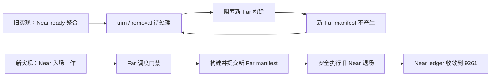

# Phase 2 relocate 停滞回归（已修复；含 8/25 handoff 回归收口）

- 日期：2026-08-20
- 状态：**已修复**——8/20 陈旧 coverage audit 与 8/25 Near/Far handoff 循环等待均已收口
- 发现途径：新准则一致性批次对光照收敛改动做 Phase 2 端到端验证时暴露

## 1. 现象

`node scripts/run_phase2_macro_interaction_smoke.js`（Null-RHI）确定性失败（3/3）：
编辑闭环、X 轴 80-tile 远行/卸载/回载全部通过；随后**第二轴 relocate（serial-4，
center [11,0,35]）永不收敛**。三次运行的即时卡点漂移（同一循环等待的不同侧面）：

| 运行 | 即时卡点 |
| --- | --- |
| A | 旧 near 窗口 216-patch 组卡 `patch_presentation_group_waiting_for_post_visibility_fence`；relocate 瞬间 staging/post-vis fence gap 0→**216** 并永久冻结 |
| B | `patch_presentation_boundary_mesh_batch_pending` |
| HEAD 基线 | 同一停滞 60s 后被（当时的）会话死线击杀，`recovery_loading_deadline_exceeded`，根销毁 |

near gen4 `exact_owned_chunks=0` 持续 89s；liveness 报告 2 waiter stalled 88.8s 但
`fatal=0`——owner 持续声称有在途工作，owner-idle 判定永不触发（忙等 livelock）。

## 2. Bisect 结论（隔离 worktree，good=733d843 8/13 绿证据树，bad=be3c734）

```
good 28230c9 fix(presentation): keep layer face count self maintaining
skip 18c89e8 feat(farfield): rebuild far manifest build index and boundary shell（不可独立编译）
bad  4cb3e5e feat(streaming): rework unified root far patch publication   ← first bad
bad  64f9005 / be3c734（其上均败）
```

**罪魁 = `18c89e8`+`4cb3e5e` far manifest/publication 重构对**（2026-08-19，共约 1.1 万行；
18c89e8 引用 4cb3e5e 才有的类型，属同一逻辑批次）。引入时签名：X 轴首段 relocate 的
far 由 <12s 劣化为 >12s（当时被 12s 死线击杀）；observe-not-kill（be3c734）落地后
表现为第二轴 relocate 无限停滞。

排除项（红鲱鱼）：2026-08-20 一致性批次的全部改动——A/B 证实 HEAD（be3c734）同败；
一致性批次的 `apply_rejected` 新事件零触发。

## 3. 已落的护栏（本批次）

- liveness 新增**忙等 livelock 击杀**：progress epoch 连续 60s 无推进即
  `streaming_wait_stalled_timeout` fatal（按进展计时，慢而有进展者不受罚；owner-idle
  15s 继续负责空闲死锁）→ 该停滞今后会被 liveness 击杀并回报 flow 走恢复，
  不再无限挂起；已配 Automation 场景。
- 注意：恢复只是重启流送，**根因未除时可能循环**；Phase 2 冒烟在根因修复前保持红。

## 4. 修复线索

- fence gap 恰为 216 = 出窗 near 窗口整批 hide/trim 的 epoch 数；组在 relocate 边界
  arm post-visibility fence 后 render 命令疑似未被提交/被 held（`publication_mode=held`、
  `dispatch_permission=blocked`），与新目标的 handoff 形成循环等待——从 `4cb3e5e` 对
  publication hold/handoff 顺序的改动入手。
- 复现：任一 Null-RHI phase2 运行；观测面齐备（fence epoch 序列、liveness、
  patch_streaming 快照）。

## 5. 手玩移动冻结取证（2026-08-20 晚，同一回归家族的第三种表现）

用户手玩报告「无法移动」。经带 CLI 的实时会话逐层判别，键盘移动链路上叠着三层堵点：

1. **角色初始化循环依赖（自 2026-06-30 `0dd16c6` 存在，已修复）**：`bRuntimeReady`
   门禁要求 `IsCharacterInitialized()`，而唯一的自动初始化在门禁内的 `DriveCharacter`
   里，且离线 worldgen 的 wire 预测位恒为零使在线初始化分支永假——真实键盘入口死锁。
   harness 冒烟全靠 `DebugTeleportWorld` 旁路置位，两个月无人发现（三入口纪律失守：
   自动化入口与真实入口走了不同初始化路径）。修复：门禁去掉初始化条件 + 新增离线
   worldgen 以作者态 PlayerStart 自举的初始化分支。
2. **订阅活性锁死（已修复）**：跟随重订阅失败会把 `bSubscribed` 翻假 → `bRuntimeReady`
   塌 → 负责重试订阅的 `MaintainRuntime`（自述「续租检查始终执行」）恰在同一门禁内
   → 永不再运行。实证：`subscribe_current` 手动重订阅后移动驱动立即从「永久零」恢复到
   正常的 `waiting_for_coverage`。修复：`MaintainRuntime` 挪出门禁无条件执行
   （与 2026-06-27 lease 静默过期同类，自维护活性不变量正式落位）。
3. **移动 guard 的已提交覆盖源为空（未修复，归本回归家族）**：恢复后 guard 以
   `candidate_committed_coverage_missing` 拒绝——candidate 在窗口内（outside_depth 0）
   但 committed 精确覆盖缺失；GUI 会话 proof 同证 `exact_live_chunk_count: 0`，而
   SceneHost 侧 `exact_owned_chunks: 9261`。即 d1d7638 重构后 guard 消费的
   「候选位置已有真实可见画面」数据源在 8/19 publication 重构后不再被喂养
   （或仅 harness 流程喂养）。**在该源修复前，离线手玩的键盘移动仍会被 guard
   正当地 fail-closed。**

## 6. 进度日志

- 2026-08-20：定位 + 复现 + 护栏落地 + 本稿。根因修复待接力。
- 2026-08-20（晚）：手玩移动冻结三层取证（见 §5）；第 1、2 层结构修复落地并过全量
  Automation；第 3 层（committed coverage 喂养断裂）并入本回归待修清单——它使离线
  手玩在根因修复前不可移动，**优先级升至最高**。

## 7. 第 3 层根因与修复（2026-08-20 深夜）：陈旧全量审计被运行时消费

带诊断命令 `Voxia.Voxel.CoverageAuditDump` 的活体会话给出决定性矛盾：

- `LastRendererCoverageAudit`：gap=19683（=27³ 全审计域进 InvalidChunks），其余分类计数全零；
- 同一时刻账本/快照/回执全部健康：`exact_near_owned=9261 + exact_far_owned=10422 = 19683`
  （满域精确覆盖）、回执身份与内容态全部匹配、`full_rebuild_count=2`、`delta_apply=38`。

矛盾的解释就写在 SceneHost 增量合并点的注释里：**`LastRendererCoverageAudit` 语义 =
「最近一次全量审计」，增量提交有意不更新它；全量只发生在重建路径与验收 CLI
`renderer_coverage_parity`（“验收脚本在断言前显式触发”）**。而增量提交路径会把
`CachedRendererCoverageCommitSerial` 推平到最新提交序列，使 `RefreshRendererCoverage`
永远缓存命中、再也走不到重建分支的全量审计——于是启动期两次缓存未命中时
（所有权尚未提交）冻结的全 gap 审计成为运行时的永久事实。

**三条运行时链全部终点在这个陈旧工件上**：

1. 移动 guard：`IsRendererChunkCommittedCovered` 要求 `!InvalidChunks.Contains(chunk)` → 永拒；
2. 世界呈现 Observation：`Observation.GapCount = Audit.GapCount` → readiness 的
   `coverage_complete` 判定与同名 liveness waiter 喂的都是它（GUI 会话 60s busy-livelock
   fatal 的直接来源）；
3. settled 判定（`Audit.GapCount==0` 等）→ far publication 静止判据。

relocate 后能动的原因：目标变更会失效缓存 → 下一次 Refresh 走重建分支 → 全量审计刷新。
harness 冒烟全绿的原因：验收脚本断言前显式跑 parity（强制重建）。**这是纲领 §2
「自维护不变量」的教科书反例：运行时消费者依赖一个只有验收工具会刷新的工件**（与
§5 第 1 层的 teleport 旁路同构——三入口/验收面与生产面走了不同的维护路径）。

**修复（SceneHost 一处维护规则，消费者语义零改动）**：新增
`MaintainRendererCoverageAuditCurrency()`，挂在 `RefreshRendererCoverage` 的缓存命中
路径上——当「审计不干净 && 提交序列已推进（`LastFullRendererCoverageAuditCommitSerial !=
CachedRendererCoverageCommitSerial`）&& 补丁资源静止（`ArePatchResourcesQuiescent`）」时，
用增量维护的缓存快照补跑一次全量审计（同重建分支收尾：结构态、complete-near-window、
continuity 武装），并发 `voxia_renderer_coverage_audit_refreshed` 观测事件。要点：

- **干净审计不重跑**：干净态的失效由增量事务显式失败（fatal）负责——挖/放等高频提交
  在稳态零成本，不引入 20ms 级逐帧审计；
- 流送中（非静止）保持保守的旧审计——「未完成」语义在流送中本来正确；
- fence 未收的续签分支不做维护（不能用半切换态污染基线）；
- 验收 CLI parity 不动，仍是独立全量对账面。

### §7 验证记录（同日深夜）

- 全新 null-RHI 会话、**不做任何 teleport/relocate**：`until_voxel_world_root_ready` →
  `move_continuous 1 0 0 400` → guard `decision:allow`，位移 `accepted_distance_cm:400.185,
  reason:distance_reached`；`presentation_coverage` `gap_count:0`；
  `CoverageAuditDump` `gap=0 audited=19683 invalid_chunks=0`。
- 维护机制按设计触发：Voxia.log 中 5 次 `voxia_renderer_coverage_audit_refreshed`
  （bootstrap 流送的静止间隙各补跑一次，随流送推进收敛到干净）。
- 排障插曲：第一次验证跑在旧 DLL 上——链接被残留 `UnrealEditor-Cmd.exe` 锁死
  （LNK1104），而构建命令管道接 `tail` 吞掉了非零退出码。**教训：构建后必须核对
  `Result: Succeeded` 与 DLL mtime，别信管道退出码**；这也解释了「修复后现象不变」
  的第一轮假阴性。
- `Voxia.Voxel.CoverageAuditDump` 由临时排障面转为常驻观测面（两轮取证均靠它定案）。

## 8. 回归收口：Phase 2 冒烟转绿（2026-08-20 深夜）

§7 修复后 Phase 2 macro interaction smoke **全绿**（`passed:true`，2m43s，
run_id `2026-08-20T12-27-14-495Z_null_rhi_1280x720`）：place/break 意图四态闭环 +
x/y/z 三轴 80-tile 远行卸载回载全部通过——此前在第二轴 relocate 上确定性停滞超时。
定性：relocate 停滞与手玩移动冻结、GUI liveness fatal 同根——settled 判定与
`coverage_complete` waiter 消费陈旧全量审计，使 far publication 被永久 hold；
审计跟上提交序列后停滞消失。**8/19 回归家族（移动冻结 / liveness fatal / relocate
停滞）全部由 §7 单点修复解决**。终验合集：Automation 221/221、Node 196/196、
Phase 2 绿、bootstrap 无 teleport 移动 400cm 实证。待用户手玩确认后本稿可归档。

## 9. 8/25 新回归：Near 退场反向阻塞 Far manifest

### 9.1 现场与根因

用户在唯一 `production_all_features` 根中真实移动跨 tile 后观察到三件事：远处 LOD 不转为
Near、流送中心不再推进、继续走会被 coverage guard 挡成“空气墙”。活体 CLI 与结构化日志把
故障冻结在同一状态：新 Near 目标已达到精确 `9261` chunks，但 ledger 为 `12348 = 9261 +
3087`，恰好多出单轴换窗时应退场的 `9 tiles = 3087 chunks`；Far 仍提交在旧中心，最终触发
streaming liveness fatal，之后移动 guard 在 `outside_depth=4` 时正确 fail-closed。

根因位于 Near owner 暴露给统一组合根的工作快照：`bReadyPublication` 同时聚合了 Near 入场所需的
mesh/move/edit 与依赖新 `FarTargetManifest` 的 trim/removal。Far 调度门禁要求该聚合值清空，
trim/removal 又必须等待新 Far manifest 才能安全退场，因此形成循环等待：



### 9.2 边界修复

`FVoxiaNearStreamingCriticalWorkSnapshot` 现在由 Near owner 一次性分类两类语义：

- `bEntryReadyPublication` / `bEntryCriticalWorkInFlight`：Near mesh、move、edit 等新窗口入场关键工作；
- `bFarDependentRetirementPending` / `bFarDependentRetirementInFlight`：依赖精确 Far manifest 的
  trim/removal 退场工作。

统一根的 Far 调度门禁只消费第一类；streaming liveness 继续观察两类，故没有隐藏未完成工作，
也没有引入重试、超时绕过、第二份 manifest 或客户端猜测。精确 Far manifest 仍是退场判定的唯一
事实源，只是依赖顺序恢复为 `Near entry → Far manifest → Near retirement`。

决策依据：经典 deadlock 条件把 circular wait 列为死锁必要条件；SEI CERT
[CON53-CPP](https://cmu-sei.github.io/secure-coding-standards/sei-cert-cpp-coding-standard/rules/concurrency-con/con53-cpp/)
建议以预定义顺序阻止循环等待。本项目映射为显式的 handoff 依赖序，而非增加 retry。原始理论来源为
Coffman 等人的
[System Deadlocks](https://doi.org/10.1145/356586.356588)。回归入口采用 Epic 官方
[Automation Test Framework](https://dev.epicgames.com/documentation/unreal-engine/automation-test-framework-in-unreal-engine?lang=en-US)
与[命令行运行方式](https://dev.epicgames.com/documentation/unreal-engine/run-automation-tests-in-unreal-engine)，
再用唯一生产根 CLI 验证真实时序。

### 9.3 验证证据

- TDD 回归先在旧接口上编译失败，再由语义分类实现转绿；focused Automation `2/2`：
  `Voxia.Gameplay.WorldActor`、`Voxia.Gameplay.WorldCoverageScheduler`。报告：
  `.demo/observe/voxia_near_far_handoff_final_focused_20260825/index.json`。
- `VoxiaEditor Win64 Development` 最终编译 `Result: Succeeded`；Voxia 全量 Automation
  `221/221`（208 clean + 13 success-with-warning，0 failed/not-run）。报告：
  `.demo/observe/voxia_near_far_handoff_final_full_20260825/index.json`。
- 唯一生产根 Null-RHI 真实连续移动跨一整个 tile：中心从 `[11,0,-51]` 提交到
  `[11,1,-51]`。日志命中原死锁过渡态（Near entry 已闭合、ledger 暂为 `12348`），但新目标 Far
  plan/build 随即启动并提交；最终 Near target/ledger 均为 `9261`，Far target/committed 均为
  `64` patches，required published=`2`，Near/Far 中心对齐，pending move/trim/edit=`0`。
- 最终 coverage：gap/overlap/orphan seam=`0/0/0`，old owner retained=`0`，资源静止，
  protected bad frame=`0`，`voxia_voxel_stream_liveness_fatal` 零次。运行证据：
  `.demo/observe/voxia_near_far_handoff_final_runtime_20260825/runtime.log`。
- 运行中唯一一次 `voxel_pure3d_build_dispatch_deferred` 属于被替换的旧中心 Full 后台扩展
  （center `[11,0,-51]`、generation 2）；新目标 required Far 在目标流送开始后未被该门禁延迟。

## 10. 8/25 可见后像：逻辑 ownership 已切换但 Far shader 未消费

### 10.1 根因

§9 修复后流送流程与账本已正确收敛，但用户继续观察到同一区块约 1–2 秒同时存在 Near/Far 网格。
这不是第二个 handoff 时序 bug：SceneHost 已在 Near 提交帧原子切换精确 ownership atlas；生产 Far
却仍绑定不读取 atlas 的 opaque `M_VoxelWorldAligned` 等外观材质。因此 renderer-neutral 账本已把
chunk 交给 Near，GPU 仍会绘制旧 Far，直到该组件沿 post-visibility fence 与有界退休队列被物理移除。
肉眼看到的 1–2 秒正是“逻辑可见权已切换”和“旧组件资源回收完成”被错误绑定在一起的后像窗口。

### 10.2 最小边界修复

SceneHost 的 ownership、atlas、fence 与退休算法均不改；只给 Far 三材质族注入从现役外观事实源
确定性派生的 ownership-aware 父材质：

- opaque/emissive 以 Masked 模式消费同一 R8 atlas，Near-owned chunk 的像素在 ownership 提交帧
  二值裁掉；translucent 把同一结果乘进既有 Opacity；
- atlas 映射继续使用完整 server XYZ（UE `X,Z,Y`）与现有 anchor/dimensions，Near 不增加采样；
- 旧 Far 组件仍按原 fence 安全退休，但资源生命周期不再决定可见 ownership；
- `VoxiaFarOwnershipClipV1` 是唯一材质能力契约，缺失时正式根显式拒绝；CLI 通过
  `patch_ownership.ownership_clip_capable` 直接回读，不引入第二份真值或静默回退；
- 不复用 Archive 的 `M_VoxelFarDither`，避免恢复屏幕噪声、时域 dither 与已淘汰外观。

Epic 官方把 Masked 定义为基于 Opacity Mask Clip Value 的二值像素丢弃，正适合将精确 chunk
ownership 变成同帧可见门；Translucent 则保留连续 Opacity 语义。因此方案只改变 Far 的可见派生，
不改变确认态、网格身份或组件安全回收：
[Material Blend Modes](https://dev.epicgames.com/documentation/en-us/unreal-engine/material-blend-modes-in-unreal-engine)、
[Material Inputs](https://dev.epicgames.com/documentation/en-us/unreal-engine/material-inputs-in-unreal-engine)。

### 10.3 验证记录

- TDD 资产合同先因三个 `*FarOwned` 资产不存在而失败，生成后转绿；绑定测试先因 SceneHost 没有
  ownership 父材质入口而编译失败，实现后转绿。
- `Voxia.Rendering.FarOwnershipMaterialContract` 与
  `Voxia.Gameplay.VoxelPresentation.MaterialBinding` focused Automation `2/2` 成功；真实事务夹具
  初次因缺生产 ownership 依赖而失败，补齐同一注入入口后
  `Voxia.Gameplay.VoxelPresentation.Transaction` 成功。
- Development build `Result: Succeeded`；全量 Automation `222/222`（209 clean + 13
  success-with-warning，0 failed/not-run）。1280×720 D3D12 offscreen 正式根 `ready=true`、
  atlas=`21³`、exact owned=`9261`、三个 ownership MID 全部 capability/installed=true，
  shader/material/Voxia Error=`0`，clean exit。证据：
  `.demo/observe/voxia_far_ownership_full_20260825/index.json` 与
  `.demo/observe/voxia_far_ownership_real_rhi_20260825/stdio.log`。
