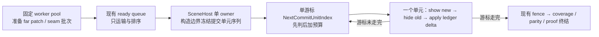

# Near/Far 自然数据流收口决策稿

- 日期：2026-08-26
- 状态：方案已由用户批准，待实现（Voxia 基线 `1c15eb9`）
- 前置证据：`.superpowers/sdd/implementation-plan/task-5-efficiency-root-cause.md`（Task 5 只读根因诊断）及其只读校核（Task 6）
- 范围：Voxia far patch 有序组的提交切片器；`ResolveInitialRuntimeScope` 供给侧判据
- 不改变：服务端权威、confirmed truth 来源、逐 far patch 原子交权、唯一生产组合根、既有 fence 与 ledger 所有权

本稿只把已批准的方案定稿，不重新发明方案，也不复述 Task 5/6 的完整证据链。

## 1. 问题与证据

两项未收口指标，各有唯一根因，都不是“节流不够”：

| 现象 | 根因（已逐行核对） |
| --- | --- |
| `EOFU` max `16.354 ms` / 26 帧 > 8 ms | `MergeOrderedProjectedFarPhysicalPlans` 把全组 seam 并入不可分割的**组尾 child**，而 `ShouldYieldAfterFarPatchGroupCommitSlice` 是**事后**谓词；尾片在真正驱动 `SendAllEndOfFrameUpdates` 的单位上无界（组尾片 toggles p50 `217` / max `581`，占全部 toggles `92.5 %`） |
| 单 tile `AdjacentStep` 后 Full Far `39.276 s` | `AdjacentStep` 仍被解析成冷启动专用的 `StartupRequired` 64-patch scope，把 live 19³ 壳整体拆掉重建（`8.0 s` 拆 + `10.3 s` 重建 + `19.4 s` 上屏），而该步真实几何增量 ≤ `5.3 %`；可见 far patch `744 → 32` 持续约 11 s |

Task 6 校核补充两条硬事实，是本稿与 Task 5 §A.5 / §D 的差异来源：

1. **中间片本就已破 32**（实测 max `159`）。由事后谓词语义可反推出存在 **≥ 128 toggle 的单个不可分割 child**。只给组尾加第二个游标给不出 hard 32。
2. 因此「`slice_component_toggles` hard max ≤ 32」与「逐 far patch 原子交权」在当前组件形态下**不可同时成立**。切开一个 far patch 的组件集等于把一个 chunk 的几何半换，直接破坏零重叠不变量。

## 2. 唯一方案

一处呈现侧、一处供给侧，都是把现有结构改回自然流，不新增子系统：

- **P（呈现侧）**：把「child 序列 + 事后预算 + 组尾特殊事务」换成「**冻结的提交单元序列 + 单游标 + 先判后加预算**」。
- **Q（供给侧）**：`AdjacentStep` 且已有 live Full 壳时，初始 scope 直接返回 `Full`，让既有 `SelectReusableFarPatchVersions` 的相邻步复用（19³ 重叠约 `94.7 %`）重新生效。

两处都不引入第二真值、第二队列、第二本 ledger、重试或降级路径。

## 3. 自然数据流

本节是 AGENTS §2.2-9「自然数据流」在本子系统的落地。



### 3.1 单元是唯一自然粒度（构造边界一次冻结）

在**现有** staging 聚合点、`MergeOrderedProjectedFarPhysicalPlans` 之后、任何 mutation 之前，由 SceneHost 一次性冻结 `Group.CommitUnits`：

| 单元 | 组成 | 成本 |
| --- | --- | --- |
| `FarPatch` | 该 patch 的全部候选组件 + 该 patch 的退场组件（一次 show-before-hide 原子交权） | 冻结时算出，与现有切片计数同源 |
| `BoundaryBatch` | 该 BatchId 的 1 个候选组件 + 同 BatchId 的 live 退场组件 | ≤ 2 toggle |

顺序 = child 原序；尾 child 内先自身 `FarPatch` 单元、再 boundary 批次单元，批次序复用 Merge 中已有的排序规则，**不新增排序规则**。冻结即构造边界：单元写集是合并写集的一份不相交划分，冻结时做一次「不相交并集 == 合并写集」等式校验并具名失败（AGENTS §2.2-6），此后消费侧不再复核。

### 3.2 单游标 + 先判后加预算

`Group.NextCommitUnitIndex` 是**唯一**游标；`NextVisibleCommitChildIndex` 降级为派生只读量（`= CommitUnits[cursor].ChildIndex`），不是第二真值。让帧判据仍只有 `ShouldYieldAfterFarPatchGroupCommitSlice` 一个，语义由「事后判」改为「预判下一单元」：

```text
SliceEnd = SliceBegin; Toggles = 0;
while (SliceEnd < Units.Num()) {
  Next = Units[SliceEnd].ToggleCost;
  if (SliceEnd > SliceBegin && Toggles + Next > Budget) break;   // 先判后加
  Toggles += Next; ++SliceEnd;
}
```

`SliceEnd > SliceBegin` 是活锁逃逸：首单元无条件入片，即使它自身超预算。`PatchRendererEpoch` 与 commit serial 同步改为**每单元一次**，`CoverageRendererEpochAdvanceCount` 初值由 `Plans.Num()` 改为冻结单元数；`RecordVisibleCommit` 只在 child 尾单元触发，保持一票一收据。

### 3.3 batch 只运输，没有组尾特殊事务

组（batch）此后只承担运输与调度：决定哪些单元一起入队、按什么顺序到达。它不决定原子性、不决定可见性、不携带第二份 ledger 或队列。**组尾不再是一个被合并放大的特殊不可分割事务**——尾 child 的 seam 批次就是序列里普通的 `BoundaryBatch` 单元。片内顺序保持既有形状、只是粒度变细：逐单元 ledger delta → show 本片全部候选 → hide 本片全部退场 → `ApplyDelta`。每个单元的新组件必然先于它自己的旧组件被隐藏，逐 chunk / 逐 slot 的 show-before-hide 因此比现状更强。

### 3.4 deferred / coverage / proof 全部派生

`BuildOrderedFarBoundaryDeferral` 的非空条件由 `0 < NextVisibleCommitChildIndex < Children.Num()` 改为 `0 < NextCommitUnitIndex < CommitUnits.Num()`；`Deferral.Slots` 由「尾 child 全部 boundary slot」收窄为「**尚未被已提交单元覆盖的 slot**」，仍从同一份合并写集派生。`FinalizePatchPresentationCoverage` 与 post-visibility fence 仍只在游标走完时发生，因此任何 seam 仍旧时 `coverage_complete` / parity / proof 依旧被阻断。唯一 SceneHost owner、唯一活动组槽、既有 Busy 让帧状态全部不变——**没有新增可写状态**。

### 3.5 供给侧：AdjacentStep + live Full 直接走 Full

两个事实都已在原地，无需跨层穿线：`EnsureFarTargetRequested` 自己就构建了 `TransitionPlan`（把 `Kind` 作为参数传给 `RequestPatchTarget` 即可），live Full 壳是 `AVoxiaPure3DVoxelWorldActor` 自己的私有状态。判据变为：

```text
bLiveFullShellRetained = (StepKind == AdjacentStep)
                      && PublishedFarTargetManifest.IsValid()
                      && PublishedFarTargetManifestScope == Full;
InitialScope = (Default && !bSameTargetAlreadyFull && !bLiveFullShellRetained)
             ? StartupRequired : Full;
```

`StepKind` 那一项不可省：它是挡住 `Relocate`（即使此刻有 live Full 壳也必须回 `StartupRequired`）的唯一条件。禁止用 `TransitionNearTiles` 非空当代理——那是隐式假设（AGENTS §2.2-3）。`Bootstrap` / `Relocate` / 冷启动快路径不变，required Far 的来源不变。

## 4. 生产与验收的边界

**生产代码不内置任何验收门禁。** `8 ms`、`2.5 s`、`6 s`、`90 %`、零重叠都不是运行时可据以杀会话、降级或改道的常量，它们只由自动化测试与验收脚本判定——与 [`2026-08-20-deadline-observe-not-kill.md`](2026-08-20-deadline-observe-not-kill.md) 同一条纪律。生产侧只做两件事：按契约推进自然流；在真实信任边界（冻结等式校验、identity / fence 失败）显式返回可诊断失败。

新增观测量 `far_group_commit_max_atomic_unit_toggles`（组快照与切片事件各一份）只是**归因用的观测面**，不参与任何运行时分支。

## 5. 最小充分测试

只改既有 suite，不新建；不重复 planner / auditor / spatial contract 已有覆盖，不跑全量 Automation。

| # | 测试 | 抓什么破坏 |
| --- | --- | --- |
| R1 | 改现有超预算组 fixture，child 规格换成非整除（如 6 × 7 toggle）：断言任何含 ≥ 2 单元的片 `slice_component_toggles ≤ 32`（今日事后谓词给 35，红） | 预算退回事后判定 |
| R2 | 改现有 `{40, 8}` 单 child 用例：期望由「片 = 40」改为「该片恰含 1 个原子单元且 toggles == 该单元成本」，并断言 `far_group_commit_max_atomic_unit_toggles == 40` | 有人为凑 32 切开原子 far patch（会同时破坏逐 chunk 交权） |
| R3 | 同 suite 新增「合并尾片 boundary 超预算」fixture：尾片跨 ≥ 2 次轮询；每个含 ≥ 2 单元的轮询 ≤ 32；每个中间轮询 `deferred_boundary_count > 0` 且同刻 `coverage_complete=false`、不提交 proof，走完后恰为 0；中间轮询 gap / overlap / orphan / protected 全 0；serial 推进量 == 单元数 | 尾片退回不可分割；或切了尾片却没让延迟集合保持武装 |
| R4 | 改现有 `ResolveInitialRuntimeScope` 纯函数用例，随新 bool 追加 3 条：`AdjacentStep` + live Full → `Full`；`Bootstrap` 无 live 壳 → `StartupRequired`；`Relocate` + live Full → `StartupRequired` | 缺陷本体复发；或矫枉过正让冷启动丢掉 required Far 快路径 |
| R5 | 在既有 `voxel_near_far_target_prepare_requested` 事件补 `step_kind` / `live_full_retained` / `initial_scope` 三个字段，由验收脚本断言 | 纯函数改对了但调用点恒传 `false`（R4 抓不到这一层） |

## 6. 一次 D3D12 验收门槛

同一受控真实场景**复跑一次**判完全部门槛：`1280×720`、`t.MaxFPS 130`、`r.VSync 0`、同一 +Z 走廊与相机，复用未改的 `eofu_gate.py` / `slice_structure.py`，含无抓屏子窗口复核。

| # | 门槛 |
| --- | --- |
| 1 | `Exclusive/GameThread/EndOfFrameUpdates` hard max ≤ `8 ms`，`eofu_over_8ms_frames = 0` |
| 2a | 所有含 ≥ 2 个原子单元的片 `slice_component_toggles ≤ 32`（结构性，单测已证） |
| 2b | `far_group_commit_max_slice_component_toggles ≤ max(32, far_group_commit_max_atomic_unit_toggles)`：任何越过 32 都必须可归因到恰好一个原子单元 |
| 2c | `far_group_commit_max_atomic_unit_toggles ≤ 42`（推导：baseline 实测最差 `0.374 ms`/新增实例，按 add : remove ≈ 1 : 1 折 `0.187 ms`/toggle，`8 / 0.187 ≈ 42.8` 取 42） |
| 3 | `protected_overlap / gap / orphan_seam_frame_count = 0`、`delta_fallback_count = 0`、最大连续共存帧 = 0 |
| 4 | ≥ 1 条 `deferred_boundary_count > 0` 且同刻 `coverage_complete=false`、`coverage_parity_verified=false`、`observation_epoch` 冻结 |
| 5 | required Far pending→complete ≤ `2.5 s`（产品 tracker 与闩锁相减两种口径都要过） |
| 6 | 单 tile `AdjacentStep` 后 Full Far ≤ `6 s` |
| 7 | 跨 tile 全程 `far_geometry_visible_patches` 不低于跨越前的 `90 %` |
| 8 | 同轮报出 `far_group_commit_slice_count` 与 Full Far 收敛墙钟，相对既有基线回退 ≤ `10 %` |

## 7. 退出条件与残余风险

- **若复跑显示 `far_group_commit_max_atomic_unit_toggles > 42`，或 EOFU 因单个原子单元越过 8 ms**：修复点在 **producer 侧 far patch 的组件划分**（build / mesh 侧每 patch 组件数上限），作为独立任务另行取证。**禁止在消费侧（切片器）加兜底、二次扫描、备用路径，或把原子单元切开。**
- 首要残余风险：按本次 `30237` 总 toggle / 32 估算，切片数将由 `186` 增至 ≥ `945`（约 5.1×），每个中间片要在下一帧多付一次全量覆盖审计（19683 格），该成本不在 `slice_ms` 内、现有产物无法给出量级。它与门槛 6、门槛 8 是本方案最可能失败的地方，**不得预先声称通过**。
- 门槛 3 的零重叠是硬不变量：任何为压低单片成本而放宽逐 far patch 原子交权的改法，一律视为方案失败而非折中。

## 8. 进度日志

- 2026-08-26：Task 5 只读根因诊断完成，定位两项唯一根因。
- 2026-08-26：Task 6 只读校核推翻「hard max 32 可达」，给出单游标 + 先判后加的最小状态机与结构化替代门槛。
- 2026-08-26：用户批准本方案；本稿定稿。实现、测试与 D3D12 验收均未开始。
- 2026-08-26：Task 1 / 2 / 3 已实现并审查通过；Task 4 单次 D3D12 实测门槛 3/4/7/8/9 过，1/2c/5/6 未过。
- 2026-08-26：Task 5A（producer 侧 far patch 组件划分）已实现并收口，门槛 1 待复跑判定。
- 2026-08-26：Task 5B 只读根因证实门槛 5/6 的 owner 是**供给侧的宽度冻结**，不是「far 被 near-first 挂起」：
  `FVoxiaFarBuildParallelism::Resolve` 把 `OneSpareWorker` 折成宽度 1，provider 与 resolved-surface
  又各自在阶段入口把逐帧门快照成宽度 1，`ReleaseUnpaced()` 之后无人恢复——一次真实 run 里
  1128 页 provider 用单线程跑了 13.757 s，而 16 线程专用 far 池有 15 条空转。
- 2026-08-26：用户裁定采用根因报告 §9.2（**固定配置宽度 + 既有逐单元让权**），不采用 §9.1 的
  「入口快照后动态加宽」。Task 5B 据此实现：许可只决定能否派工，宽度恒为配置值；near 优先只由
  `TPri_Lowest` / `EQueuedWorkPriority::Lowest` / `BackgroundPriority` 叠加 `FVoxiaVoxelShellBackgroundFramePacer`
  在**每个自然页 / 表面单元边界**的让权表达；provider 通过一个微型稳定契约 `PaceWorkUnit(uint64&)`
  取得同一让权语义，游标由各 drain worker 局部持有。未新增线程池、队列、调度抽象或产品埋点。
- 2026-08-26：门槛 5（`2.5 s`）与门槛 6（`6 s`）在新语义下的实测值由 Task 5A + Task 5B 收口后的
  **一次合并 D3D12 复跑**判定，本稿不预先声称通过；根因报告 §10-1 指出的「门槛 5 是否仍然可达 /
  仍然合理」在拿到该实测前保持未决。
