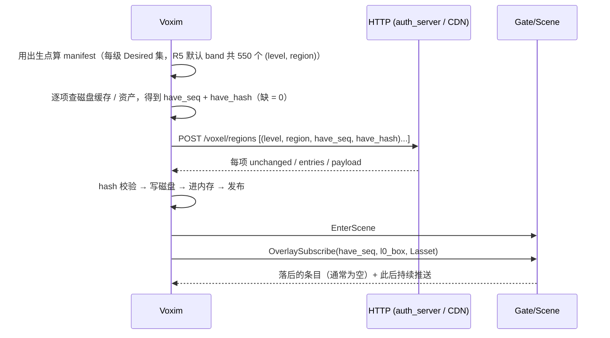
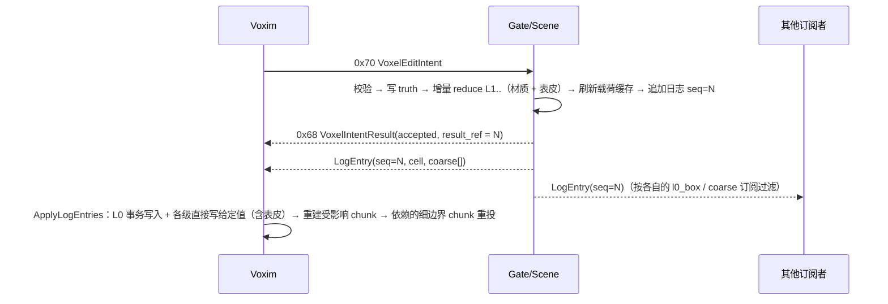

# Voxim 体素数据链路：Region 载荷 + Overlay 日志 + 客户端分层缓存 — 决策稿

- **日期**：2026-09-02 成稿；**2026-09-03 第一次修订**（R6 前置研究：实测数字 + D-1..D-8 推荐 + 新增 D-9..D-13）
- **状态**：`active` 决策稿。**2026-09-03 用户拍板：D-1..D-13 全部按推荐值**（Lasset = 4、服务端 WorldGen 换成 Voxim kernel、材质表用 Voxim 调色板、不预测、zlib、字节规则、不周期重发、`result_ref` = seq）。尚未实施，从 `Voxim/Docs/R6-Eval.md` §5 的 S1 开始
- **服务对象**：`../../../../Voxim`（UE 5.8 第二代客户端，`starter.md` 的 R6 "MMO Authority Integration" 阶段）。Voxia 的现役链路不受影响，本稿新增的 opcode / endpoint 按"只追加不破坏"铁律并列存在
- **上位裁决**：沿用 [`2026-07-06 投影路线终态裁决`](../../30-reference/contracts/2026-07-06-projection-route-final-decision.md)——truth 只在服务端，客户端对 WorldGen 零知识、snapshot-only。本稿**不改变路线**，只修订三处具体形状（§1.2）
- **影响范围**：scene_server / world_server 的 mip 维护与载荷缓存、gate_server 新 opcode、auth_server 新 HTTP endpoint、DataService 的 overlay 日志持久化、Voxim 客户端 R6 的数据源与磁盘缓存
- **客户端侧契约草案**：`Voxim/Docs/R6-Eval.md`（数据链路图、接口草案、Intent 生命周期落点、垂直切片计划）

### 2026-09-03 修订要点（先读这一段）

1. **载荷不只是 66³ u16**。R5.10 起 L1+ 的 region 载荷还带一个稀疏**表皮场**（每个非平凡 cell 六向表皮 id + 4×4 texel 贴图，`FVoxelSkinField`），远景材质全靠它。实测它压缩后是 cells 的 **25–60 倍**：含地表的 L3 region cells 压缩后 6.7 KB，表皮场 290 KB。原稿 §4.1 / §6.2 / §8 的所有体积估算都只算了 cells，全部重算（§8）。
2. **L3+ 全世界随资产 ≈ 1.9 GB（现有序列化格式）或 ≈ 1.0 GB（精简线格式），不是 150 MB。** D-1 的推荐改为 **Lasset = 4**（≈ 0.5 / 0.26 GB），见 §6.2。
3. **压缩选 zlib，不做 RLE。** cells 只占载荷 2%，RLE 对表皮场无用；zlib（Erlang `:zlib` 内建、UE `FCompression` 内建、`.vxr` 现用）与 zstd-3 体积相同，zstd-19 只再省 12–15%。
4. **`cell` 条目的 coarse[] 必须带表皮**（材质没翻、表皮翻了是常态），并且"某级未翻即停止"要同时看材质与表皮。
5. **订阅不需要周期重发、不需要 seq 跳跃检测**：条目按 box 过滤后 seq 本来就不连续；TCP 有序可靠，丢失只发生在断线，重连 = 重发声明。D-4 改为 0。
6. **服务端没有 Voxim 的 WorldGen**。服务端现役 `worldgen_density_v2@1`（Rust NIF；`max_height 1600`、材质 catalog dirt=1 / stone=2）与 Voxim 的 kernel（列画像 / 岩带 / 矿脉 / 洞口 / 表皮，24 色调色板 grass=1 / dirt=7 / stone=11）是两套不同的世界。谁是真值、材质 id 怎么统一、粗层 kernel（带限剪枝 + 表皮）由谁移植到 Rust，是本次新增的 **D-10 / D-11**，必须先拍板。
7. `0x70` 的 `expected_chunk_version` 不据此判 stale 要填 **`0xFFFF_FFFF_FFFF_FFFF`**（`chunk_process.ex` 的 `@expected_chunk_version_unspecified`），不是 0。

---

## 1. 背景与定位

### 1.1 为什么需要这份稿

对 Voxim 与现有协议的对照评估（2026-09-02 会话）得出三个结论：

1. 近场协议（`0x60`–`0x70`）语义上与 Voxim 的 `Source ⊕ Overlay` 世界层对得上，但 `0x62 ChunkSnapshot` 每 chunk 固定 4096 × 19 B header、无压缩，对只需要 4096 × u16 材质的 Voxim 是 18 倍以上的浪费。
2. 线上**没有任何粗粒度表示**。Voxim R4/R5 的 L1–L5 全靠 `2^L` 尺度的 mip region，而 glossary 里规划的 7 m source page 既无 opcode 也无服务端 writer，且 7 不是 2 的幂，与 Voxim 的 lattice 不兼容。`SceneServer.Voxel.LodProjection` 只是离线 XZ heightmap 迁移产物，不在线上。
3. baseline 分发（world pack / manifest / diff chain）改过两次设计，服务端 `world_pack_index_v1` 未完成；`GET /voxel/world_manifest|world_pack|world_diff` 三个端点都只在 `dev_auto_login` 下开放。

用户给出的路线：**服务端生成 L0 到 Lmax 的全部数据，客户端只取；玩家改动不频繁，所以运行时只流 overlay；远景不大，随客户端资产分发；身边区域现拉。** 本稿把这条路线写成可实施的契约。

### 1.2 对既有裁决的修订（三处，均为形状修订，不改路线）

| 既有口径 | 本稿修订 | 理由 |
| --- | --- | --- |
| 远区投影 = 7 m source page，客户端再整数规约 14/28/56 m（glossary §1） | 远区投影 = `2^L` 米的 mip region，L1 到 Lmax，reducer 固定为 ReduceBlockV1 + ReduceSkinsV1（§2.3） | Voxim 的 LOD lattice、closure、handoff 全部建立在 `2^L` 上；7 m 无法对齐 |
| 近窗投影 = `0x62 ChunkSnapshot` + `0x63 ChunkDelta` | 近窗 = 与远区**同一种** region 载荷（L0）+ overlay 日志条目 | 一种载荷形状贯穿全部 level；ChunkSnapshot 的 per-cell version/hash/env 对 Voxim 无用 |
| 远区修改由 page 重发布 + dirty 通知承载 | 远区修改由日志条目自带的各级 reduce 结果承载；稠密改动才整 region 替换 | 严格多数规则下多数单格编辑连 L1 都不翻，逐条目远比重发 region 便宜 |

不变的事项：缺源硬失败、hash 不匹配硬失败、不 fallback、客户端不跑 WorldGen、客户端不做乐观预测（点击只发 intent）。

与 [`2026-06-29 baseline 与流送边界`](../../30-reference/protocol/2026-06-29-voxel-baseline-streaming-boundary.md) 的关系：那份稿的 D-1/D-3/D-4（"客户端拿配方本地重算 baseline"）已被 07-06 投影路线裁决覆盖；本稿沿用 07-06。那份稿的 D-2（服务端只存 committed events）、D-13（compact）与本稿的 "truth = WorldGen ⊕ D ⊕ 日志" 一致。

---

## 2. 术语与常量

### 2.1 空间

| 名称 | 定义 | 来源 |
| --- | --- | --- |
| macro cell | 1 m 立方，canonical 最小单位，材质 `u16`（值域 ≤ 255，表皮 texel 是 u8），0 = 空气 | 两端一致 |
| chunk | 16³ macro | `SceneServer.Voxel.Types` / `Voxim::VoxelChunkSizeInMacro` |
| level L | cell 边长 `2^L` m；L0 = canonical | Voxim `VoxelLodCoords.h` |
| region (L, c) | level-L 上 64³ 个 cell 的立方，坐标 `c = floor(cell / 64)`；L0 的 region 就是 Voxim 的 Tile（4³ chunk） | Voxim `VoxelLodRegionOfCell` |
| region 载荷 | 66³ 个 `u16`（64³ 自有 cell + 四周各 1 cell 的 ring，x 最快，原点 `c × 64 − 1`，level 单位）**+ 66³ 的稀疏表皮场**（L0 恒为空场） | Voxim `FVoxelTile` / `FVoxelLodPayload` / `FVoxelSkinField` |
| 表皮（skin） | coarse cell 六个方向各一个"沿该方向看进去第一个击中的材质"，L ≥ 2 时每面还有 `min(2^L, 4)²` 个 texel 的贴图；空气格也有表皮。它保住被严格多数占用规则蚀掉的表层材质，远景材质全靠它（Voxim `Docs/R5.md` §R5.10） | Voxim `VoxelSkin.h` |
| Lmax | 当前 5（R5 默认 `MaxLevel = 5`，L5 region 边长 2048 m） | Voxim `FVoxelLodWorldConfig` |
| 轴向 | canonical **Y-up**，X/Z 水平；到 UE Z-up 的换轴只在 Voxim render backend | Voxim `AGENTS.md` |

> 注意：本仓 AGENTS.md 里的 "tile = 7³ chunk" 是 Voxia 近场窗口的单位，与本稿的 region 无关。本稿只用 region。

### 2.2 版本

| 名称 | 定义 |
| --- | --- |
| `seq` (u64) | overlay 日志的全局单调序号，每条日志条目一个。**唯一的运行时版本轴**，取代 per-chunk `chunk_version` 与 Voxim 的 `WorldVersion` 在这条链路中的作用 |
| `content_version` (u64) | `WorldGen` 内核、seed、控制图、材质表、reducer 任一变化时递增。变化即全部客户端缓存与远景资产作废。Voxim 侧现成的等价物是 `WorldGen::Bake::WorldFingerprint`（Config 字段 + kernel 形状常量表 + 格式版本的 CityHash64） |
| 载荷的 `seq` | 该 region 载荷已包含 `seq ≤ S` 的全部日志条目效果 |

### 2.3 Reducer（跨端逐格相等的唯一规则）

`ReduceBlockV1(children[8]) -> u16`：

- occupancy：solid child ≥ 5 才 solid（严格多数；4:4 → 空气）
- material：只在 solid children 里取众数；平局取最小 material id

`ReduceSkinsV1(children[8], Level) -> 六向表皮`（Voxim `VoxelLodReduce.h` / `Docs/R5.md` §R5.10）：与占用正交，空气子格也参与；每个方向 d，8 个子格沿 d 轴分外层 / 内层，面内 2×2 子格的 n×n 贴图拼成 2n×2n（同一列外层 texel 非零取外层，否则内层），2n > 4 时 2×2 众数 mip 到 4×4；Id = 非零 texel 众数（平局最小 id），全零 → 0。L0 的表皮恒为 Uniform(material)。

level-L cell 的值 = 对 canonical 递归应用两条规则 L 次。服务端实现必须与 Voxim `Voxel/Lod/VoxelLodReduce.cpp` 逐 bit 相等，golden 测试用 Voxim `EvaluateLodCell` 的参考实现生成。glossary 里 "any-solid" 算子**不采用**。

**粗层不能靠"物化 L0 再 reduce"得到**：32 km 世界只算地表 3 层 L0 也有 50 万个含地表 region（§8.2）；L5 一个 region 递归到 L0 是 66³ × 32³ ≈ 94 亿次采样。Voxim 的 kernel 用带限剪枝（整盒同质即不下钻）把 L5 压到 7–11 s / region（`Docs/R5.md` §R5.11）。所以服务端的粗层生成器不是"generic reducer"，而是 **Voxim `GenerateLodRegion`（kernel + 剪枝 + 表皮）的移植**，只有被编辑过的 region 才走"从 L0 增量 reduce"。见 D-10。

已知语义限制（Voxim R4 记录）：薄墙、桥、塔在 L2 以上按多数规则消失。玩家地标在远景不可见，属于未来新版 reducer 或独立地标表示，本稿不解决（D-8）。

---

## 3. 真值与派生

```mermaid
flowchart LR
  subgraph server[服务端]
    WG[WorldGen seed] --> T
    D[D 压实前缀] --> T
    LOG[(overlay 日志\nseq 单调)] --> T
    T{{truth = WorldGen ⊕ D ⊕ 日志}}
    T --> MIP[mip 链 L1..Lmax\n处女地：kernel 剪枝直出\n编辑区：ReduceBlockV1 + ReduceSkinsV1 增量]
    T --> PC[(region 载荷缓存\n(level, region) → cells + skins @ seq)]
    MIP --> PC
  end
  subgraph client[Voxim 客户端]
    PC -- HTTP 拉取 --> DISK[(磁盘缓存 / 远景资产\n载荷副本 @ seq)]
    LOG -- TCP 推送条目 --> MEM
    DISK --> MEM[FVoxelResidentWorld / FVoxelLodLevel\n载荷 ⊕ 已收到的条目]
    MEM --> SURF[Surface → Patch → Nanite ISM]
  end
```

- **truth 只有一份**，在服务端，形态是配方 `WorldGen ⊕ D ⊕ 日志`。L0 不物化整个世界（32 km 世界 L0 按 u16 是 TB 级）。
- **region 载荷缓存**是服务端的派生物，按需物化、LRU；L3 以上可以整世界常驻（实测估算 1.0–1.9 GB，§8.2）。
- **客户端磁盘缓存**是派生物的副本，可丢弃可重拉；**客户端内存**里的 Voxim 世界层是"载荷 ⊕ 本地已收到的日志条目"，与服务端 truth 在同一个 seq 上逐格相等。
- Voxim 的 `ReduceBlockV1 / ReduceSkinsV1 / ReduceOwned`、R4-B contribution 链、R5.12 的 reduce worker、`FVoxelLodProvider.SampleAt`、R3 的 session overlay 桶在生产路径上**不再被调用**；前三者作为测试 oracle 保留，用来断言服务端载荷与本地递归结果逐格相等（哪些删、哪些留见 `Voxim/Docs/R6-Eval.md` §3）。

---

## 4. 传什么

### 4.1 Region 载荷（唯一的 source 形状，所有 level 共用）

```text
RegionPayload
  level            u8
  region           i32 × 3
  seq              u64        ← 一致到的日志序号
  content_version  u64
  hash             u64        ← 对解压后 body（cells + skins）的 MD5 前 8 字节（LE）；两端都内建（Erlang :crypto / UE FMD5），只做一致性核对
  encoding         u8         ← 0 = raw, 1 = zlib ; 枚举预留给 zstd / Oodle
  raw_len          u32        ← 解压后 body 字节数（UE 的 zlib 解压要先知道）
  body_len         u32
  body             bytes      ← Body 的序列化（下）。头共 54 B，全部 little-endian（含 magic "VXR3" + 版本 u32 = 3 在最前）
Body
  cells            u16 × 66³  （x 最快）
  skins            稀疏表皮场：Extent、MapExtent、RowStart[]、ColX[]、Records[]、FaceMapIndex[]、Maps[]   ← L0 为空场
```

- `.vxr`（Voxim `WorldGen::Bake::SerializePayload`）的 body 就是这个 Body 的现有序列化（多一份可重算的 `MapHashes[]`）。垂直切片第一步直接用它当线上 body，`.vxr` 文件 = 一个 `RegionPayload`（身份在路径里，seq = 0）。
- 精简线格式（D-9）：去掉 `MapHashes`（8 B / 张，可重算）与 `FaceMapBase`（记录内 mask popcount 的前缀和，可重算），Records 按平面排列（六个 face id 各一列、mask 一列），face id 用 u8。实测 zlib/zstd-3 后 L3 含地表 region 从 297 KB 到 161 KB（§8.1）。
- 实测单 region 体积见 §8.1：**cells 压缩后任何 level 都只有 4–7 KB；含地表的 L1–L6 region 载荷 58–420 KB，96% 以上是表皮场**；纯空气 / 纯岩石 region 0.6 KB。

### 4.2 Overlay 日志条目（两种 kind）

```text
LogEntry
  seq        u64
  kind       u8
  ---- kind = 0 cell ----
  coord      i32 × 3         ← canonical
  material   u16
  levels     u8              ← 后面跟几级 reduce 结果（0 = L1 材质与表皮都没翻，到此为止）
  coarse[]   { level u8, cell i32 × 3, material u16, skins FVoxelCellSkins } × levels
             skins = MapExtent u8 + 6 × { Id u16, Texels u8 × MapExtent² }（MapExtent 1 时无 texel；≤ 6 × 18 + 1 = 109 B）
  ---- kind = 1 region ----
  payload    RegionPayload   ← 整 region 替换，含 level
```

- `cell` 条目由服务端算好每一级的 reduce 结果（材质 **与表皮**），**从 L1 起逐级向上，某一级材质与表皮都未变即停止**。客户端不做 reduce，直接写值。
- **表皮不是可选项**：把地表草换成石头，L1 cell 的材质众数不变但 +Y 表皮从 grass 变成 stone；不带表皮的条目会让远景永远停在旧材质，而且这类错误看不出来（近处对、远处错）。T-3 必须覆盖表皮。
- `region` 条目**取代**同一 `(level, region)` 更早的全部条目；日志据此压实。
- 服务端按**字节数**选 kind（D-2）：`Σ cell 条目字节 > 该 region 当前载荷字节` 就发 `region`。两个数服务端都精确知道（载荷缓存里就有），不需要百分比魔数。
- 一次事务的全部条目（各 level 的 cell / region）同属一个 seq 段（或一个 seq 带多条 payload），客户端按事务边界一次应用（见 Voxim `ApplyEdit` 的"cells 全部推完再统一投 chunk"纪律）。
- 可预留 `kind = 2 box`（盒填充）给参数化批量操作，本稿不实现（D-7）。

### 4.3 Intent（沿用现有）

`0x70 VoxelEditIntent`（91 B 定长：request_id、client_intent_seq、logical_scene_id、action、target_granularity、target_world_micro i64×3、face_normal、material_id、blueprint_ref、object_ref、part_ref、attribute_patch_ref、expected_chunk_version、expected_cell_hash、client_hint_hash）与 `0x68 VoxelIntentResult`（result_code accepted / deferred / rejected / stale、result_ref u64、authoritative[]、reason）原样沿用。

- Voxim 会话 `expected_chunk_version` 填 `0xFFFF_FFFF_FFFF_FFFF`（服务端 `@expected_chunk_version_unspecified`，跳过 stale 校验），`expected_cell_hash` 填 0；stale 判定改由日志 seq 承担（§5.3）。
- **建议 `result_ref` = 该事务提交时的日志 seq**（D-12）：客户端只要看到 `applied_seq ≥ result_ref` 就知道这条 intent 已 Confirmed，不必按坐标反查。现役语义里 result_ref 是 command / result id，对 Voxia 会话不变。
- `authoritative[]` 对 Voxim 会话为空：`IntentResult` 不改世界，只有日志条目改世界。

---

## 5. 怎么传

### 5.1 三条通道

| 通道 | 方向 | 内容 | 传输 |
| --- | --- | --- | --- |
| Region 拉取 | C → S 请求，S → C 载荷 | 批量 `(level, region, have_seq, have_hash)` → 每项回 `unchanged` / `entries[]` / `RegionPayload` | HTTP（可 CDN 缓存；`have_seq = 0` 的请求是纯静态资源） |
| Overlay 订阅 | C → S 声明，S → C 推送 | L0 窗口盒 + 世界级 coarse（L ≥ Lasset）；推送 `LogEntry` | TCP 游戏连接，新 opcode |
| Intent | C → S，S → C | 现有 `0x70` / `0x68` | TCP，不变 |

Region 拉取的应答对每一项只有三种：

1. `unchanged`：`have_seq` 之后该 region 没有条目，**且** `have_hash` 等于服务端当前载荷 hash（客户端在本地重放过条目的 region 靠这一项免费核对，不会静默分叉）。
2. `entries[]`：`have_seq` 之后只有 `cell` 条目，直接给条目。
3. `RegionPayload`：`have_seq = 0`，或 hash 不等，或 `have_seq` 之后发生过 `region` 替换，或条目字节数超过载荷字节数。

首次拉取就是第 3 种的特例。"进场景前核对"与"运行时补 region"是同一个请求，**不存在单独的进场校验协议**。

### 5.2 订阅声明与活性

```text
OverlaySubscribe (C → S)
  have_seq      u64            ← 客户端见过的最大 seq
  l0_box        i32 × 6        ← L0 region 盒 [min, max]，= Voxim L0 Keep 集的包围盒
  coarse_min_level u8          ← 从这一级起订阅全世界（= Lasset，见 §6.2）
```

- 服务端回 `have_seq` 之后、落在 `l0_box` 内或 level ≥ `coarse_min_level` 的全部条目，随后持续推送新条目。
- **没有 lease，也没有周期重发**（D-4 = 0）：声明的生命周期就是 TCP 连接；服务端每连接只保留最后一次声明，连接断开即忘。客户端在 `l0_box` 变化时重发；重连 = 重发。
- **不做 seq 跳跃检测**：条目按 box / level 过滤后客户端看到的 seq 本来就不连续；TCP 有序可靠，丢失只发生在断线，而断线必然重连重发。
- 落在 box 内但客户端未驻留、也没在拉的 region（box 是 Keep 集的包围盒，角上有几个这样的 region）的条目**直接丢**：它下次被拉时带的是磁盘副本的 `have_seq`，服务端会补齐。

### 5.3 时序

**登录 / 预下载（选人界面）**



**运行时移动**：`UpdateView` 算出新 region → 同样的 `POST /voxel/regions`（清单只有几项，每帧一批）→ `l0_box` 变化时重发 `OverlaySubscribe`。

**编辑**



客户端在 intent 返回前**不改任何东西**；`IntentResult` 本身也不改世界，只有日志条目改世界。两者到达顺序无关。

**载荷与条目的交错**：一个 region 拉取在飞时收到它的条目 → 条目暂存在该请求上；载荷到达后只重放 `seq > payload.seq` 的暂存条目。这是 Voxim 现有 `MarkEdited`（在飞请求作废重发）的替代：不重发，重放。

### 5.4 与现有 opcode 的关系

| 现有 | Voxim 会话 | Voxia 会话 |
| --- | --- | --- |
| `0x60/0x61` ChunkSubscribe/Unsubscribe | 不用 | 不变 |
| `0x62/0x63/0x69` Snapshot/Delta/Invalidate | 不用 | 不变 |
| `0x6A/0x6B` heightmap | 不用（已废弃） | 不变 |
| `0x70/0x68` Intent/Result | 用 | 不变 |
| 新 `0x76 OverlaySubscribe`（C→S）/ `0x77 VoxelLogEntry`（S→C） | 用 | 不用 |
| 新 HTTP `POST /voxel/regions` | 用 | 不用 |

opcode 号按 `docs/30-reference/protocol/2026-04-10-线协议规范.md` 的体素段 `0x60..0x7F` 顺延（`0x75` 是现役最后一个），实施时再在协议规范登记。`0x6D/0x6E/0x71/0x72`（catalog / 环境）与 `0x6C`（object state）与本稿正交，Voxim R6 不消费。

---

## 6. 客户端缓存什么

### 6.1 磁盘上只有一种东西：region 载荷的原样副本

```text
<Saved>/VoxelCache/<content_version 16 hex>/
  L0/<x>_<y>_<z>.bin
  L1/...
每个 .bin = RegionPayload 头 + 压缩体，与服务端发来的一字不差
```

- 日志条目**不单独落盘**。条目到达后改内存 cells；region 从内存卸载时，**只有收到过条目的（dirty）region** 把当前 cells + skins + 最新 seq 重新序列化写回（worker 上压缩，几 ms）；没收过条目的 region 磁盘上已经是对的，不写。
- 表面、quad、instance、Patch 不落盘：它们是派生物，Voxim 重建一个 chunk 表面约 0.15 ms。
- 缓存从客户端**第一次向服务端要 region 那一刻**开始写；预下载只是把出生点清单提前拉一遍，此后运行时走同一条路。跨会话保留。
- 取用顺序永远是：内存 → 磁盘缓存 → 远景资产 → 网络（缓存目录里的副本优先于资产：资产是某个 seq 的快照，缓存里的是收到过条目的更新副本）。

### 6.2 远景资产：L ≥ Lasset 全世界随客户端分发（D-1）

| 项 | 决定 |
| --- | --- |
| Lasset | **推荐 4**（16 m cell）。备选 3。理由见下 |
| 内容 | `WorldGen ⊕ D` 在某个 seq 的 L4..Lmax 全世界 region 载荷，与 §6.1 同格式，放在客户端资产目录（`<Content>/VoxelWorld/<content_version>/L4/…`），随安装包与补丁分发 |
| 运行时变化 | 登录后与运行时收到的 coarse 条目写进内存；region 卸载时 dirty 副本写进 §6.1 的缓存目录（缓存优先于资产），不改资产 |
| 多分服 | WorldGen 相同、玩家改动不同 → 资产共享一份，缓存目录按分服 id 分子目录（D-6） |

实测体积（§8.2，32 km × 32 km，Demo 地形剖面）：

| Lasset | 资产体积（现有格式 / 精简格式） | 传送一次要拉的 L0..(Lasset−1) | 走路 6 m/s 每小时拉取 |
| --- | --- | --- | --- |
| 3 | **1.9 GB / 1.0 GB** | 8.6 MB / 6 MB | ≈ 200 MB / 130 MB |
| 4 | **0.5 GB / 0.26 GB** | 17.5 MB / 11 MB | ≈ 280 MB / 180 MB |
| 5 | 0.11 GB / 0.06 GB | 28 MB / 16 MB | ≈ 320 MB / 200 MB |

为什么从 3 改成 4：原稿的 "L3+ 约 150 MB" 只算了 cells；表皮场把 L3 一级就顶到 1.4 GB。L3 一层按需拉只多 12 region/km（3.5 MB/km），传送多 9 MB；而资产每次 `content_version` 变化（改一个 kernel 常量）都要整包重发，1 GB 与 0.26 GB 的补丁体积差 4 倍。L4（16 m）band 外径 5 km，够画地平线；L3 的 2.5 km 内本来就是按需拉的 L0–L2 的邻域。

为什么不是 L1 / L2：L1 全世界 5.3 GB、L2 3.8 GB（§8.2），且 2–4 m 分辨率把全世界洞穴、矿脉（表皮里直接写着 ore id）摊给每个客户端，违反投影路线裁决 §3.3 的信息不对称原则。

### 6.3 L0 到 L(asset−1)：按需拉、LRU（D-3）

- 总量上限初值 **2 GB**，按最后访问时间淘汰。实测每 km 新地形拉取 L0–L3 合计 ≈ 12.6 MB（现有格式），2 GB ≈ 160 km 的足迹，即十几小时的连续新地形行走；淘汰掉的区域再回去时重拉，每 region 6–400 KB，与运行时正常流送同量级。
- L ≥ Lasset 不参与淘汰（它在资产里；dirty 副本很少）。

### 6.4 作废规则（只有两条）

1. 单个载荷 hash 不匹配 → 重拉这一个。
2. `content_version` 不等 → 整个缓存目录删除，资产按补丁更新。

---

## 7. 世界级事件

### 7.1 原则

改动稠密时按 region 传，稀疏时按格传，两者在同一条日志里，由服务端按字节数选。不需要新架构。

### 7.2 数字（100 m 直径的坑；cell 条目按 §4.2 的 25 B + 各级 coarse ≈ 110 B / 级估）

| 表示 | 数量 | 体积 |
| --- | --- | --- |
| 逐格 `cell` 条目 | 约 50 万条 | 13–60 MB（取决于各级翻动数） |
| L0 `region` 替换 | 约 27 个 | 27 × 6.5 KB ≈ 0.2 MB |
| L1–L2 `region` 替换 | 约 10 个 | 4 × 58 + 6 × 172 KB ≈ 1.3 MB |
| L3 以上 | 几十个 `cell` 条目（含表皮） | 几 KB |

### 7.3 服务端流程

一次事务、一个 seq。执行运算 → 增量重算 mip（只算 children 变了的 cell，材质与表皮一起，到 L5 只剩几十个）→ 刷新受影响 region 的载荷缓存 → 按 §4.2 字节规则生成条目 → 按订阅分发：附近玩家（订阅了那些 L0 region）收到约 1.5 MB；远处在线玩家只收到 coarse 条目；离线玩家下次登录靠 `have_seq` 追上。远景资产不动。

### 7.4 客户端流程（Voxim 需新增"原地替换"）

现在 `UnloadTile + AddTile` 会先删 Patch 再建，出洞。需要一条原地替换路径：换掉驻留 region 的 cells + skins → 把新的 64³ owned 盒 **Place 进所有相交的驻留 region**（自己的核心 + 邻居的 ring；`FVoxelLodLevel::Place` 已经是这个语义，只是输入从 32³ contribution 变成同级 64³）→ 变了的 chunk GeometryRevision +1 → 重投表面 → 旧 Patch 撑到新表面就绪再交接（R2 的 `PendingPatches` + `CanCommit(ChunkRevisions)`）。各级 `region` 条目同属一个 seq，近远两侧在同一事务内一致，不会出缝。27 个 region = 1728 个 chunk 表面，worker 上不到 1 s，呈现层按 instance 预算分几帧提交。

### 7.5 玩法层面

- **先演出，后提交**：服务端先广播事件位置与时间，客户端播特效；到时间点服务端提交一次事务，客户端收到 `region` 条目后换地形。客户端不预测坑的形状。
- **策划的地形改动走同一条日志**：剧情火山以 `region` 条目提交，D 就是压实后的日志前缀。`content_version` 只在 WorldGen 内核 / seed / 材质表 / reducer 变化时才动，远景资产不因剧情事件重发。
- **持续变化的东西不在这里**：岩浆流、水体是每帧改拓扑的局部现象，Voxim `starter.md` 放在 R7 单独表示，不用 region 替换每秒刷几次硬扛。

---

## 8. 数字汇总（2026-09-03 实测；脚本与原始 JSON 见 Voxim 会话 scratchpad，方法见 `Voxim/Docs/R6-Eval.md` §1）

数据源：Voxim `WorldBake/`（Demo 世界 seed 1337，出生点 + 相机预设 + walk 路径沿线按距离带烘的 4516 个 L1–L6 region，+ 本次 headless 烘的出生点周围 729 个 L0 region）。"含地表" = 空气占比在 1%–99% 之间。

### 8.1 单 region 载荷（均值；zlib = 现有 `.vxr`；"精简" = §4.1 的 D-9 线格式经 zstd-3）

| level | 含地表 region 占比 | cells 原始 | cells zstd-3 / zstd-19 | cells RLE(u16 run) | 表皮场原始 | **整载荷 zlib（现有格式）** | 整载荷 zstd-19 | **整载荷 精简格式** |
| --- | --- | --- | --- | --- | --- | --- | --- | --- |
| L0 | 164 / 729（每列 2.0 个） | 562 KB | 7.0 / 3.5 KB | 22 KB | 0 | **6.5 KB**（p95 12.6，max 16） | 3.5 KB | = zlib |
| L1 | 211 / 1323（每列 1.47） | 562 | 6.7 / 3.5 | 21 | 267 KB | **58 KB** | 43 | 41 KB |
| L2 | 170 / 980（1.43） | 562 | 6.4 / 3.2 | 21 | 522 | **172 KB** | 147 | 102 KB |
| L3 | 148 / 799（1.21） | 562 | 6.7 / 3.7 | 20 | 835 | **297 KB** | 261 | 161 KB |
| L4 | 78 / 546（1.00） | 562 | 7.0 / 3.5 | 20 | 1129 | **412 KB** | 365 | 215 KB |
| L5 | 68 / 476（1.00） | 562 | 4.9 / 2.5 | 15 | 968 | **358 KB** | 321 | 185 KB |
| L6 | 56 / 392（1.00） | 562 | 4.1 / 2.5 | 12 | 943 | **350 KB** | 312 | 178 KB |
| 纯空气 / 纯岩石（任何 level） | | 562 | 0.1 | 0 | 0 | **0.6 KB** | | |

L3 含地表 region 的表皮场构成（原始 → zstd-3）：16.9 k 条记录（占 66³ 的 5.9%）、72.8 k 个非均匀面、13.3 k 张不同的 4×4 贴图；RowStart 17 KB、ColX 33 KB、Records 330 → 60 KB、FaceMapIndex 142 → 64 KB、Maps 208 → 56 KB、MapHashes 104 KB（可重算，线上不传）。

结论：**RLE 无意义**（cells 只占 2%），**zlib 够用**（与 zstd-3 同体积；zstd-19 只再省 12–15%，Erlang / UE 都要新依赖），**表皮场是唯一的大头**（精简线格式省 40–46%，再往下要改表皮表示本身——D-9）。

### 8.2 全世界体积（32 km × 32 km，Demo 地形剖面 −400…+520 m；"含地表 region / 列"用 8.1 实测值外推）

| level | 列数 | 含地表 region 数 | 现有格式 | 精简格式 | 其中 cells 部分 |
| --- | --- | --- | --- | --- | --- |
| L0 | 250 000 | 50 万 | 3.3 GB | 3.3 GB | 3.3 GB |
| L1 | 62 500 | 9.2 万 | 5.3 GB | 3.8 GB | 0.6 GB |
| L2 | 15 625 | 2.2 万 | 3.8 GB | 2.3 GB | 0.14 GB |
| L3 | 3 906 | 4 700 | **1.4 GB** | **0.76 GB** | 32 MB |
| L4 | 977 | 977 | **0.41 GB** | **0.21 GB** | 7 MB |
| L5 | 244 | 244 | 87 MB | 45 MB | 1.2 MB |
| L6 | 64 | 64 | 22 MB | 11 MB | 0.3 MB |

原稿的 "L3+ < 150 MB" 对应的是最右一列（cells）。服务端 L3+ 整世界常驻载荷缓存 = 1.0–1.9 GB 内存，可接受。

### 8.3 运行时带宽（R5 默认 band：XZ 半径 2、Y 半径 L0–L1 = 2、L2+ = 1；每 km 新地形的 region 数 = 每轴步数 × 截面）

| level | region / km（模型） | 含地表比例 | 载荷 / km（现有 / 精简） | R5.14 sprint6 实测（900 m @ 24 m/s，冷启动后新增） |
| --- | --- | --- | --- | --- |
| L0 | 390 | 0.40 | 1.0 MB | 400 个 |
| L1 | 195 | 0.29 | 3.3 / 2.4 MB | 200 个 |
| L2 | 59 | 0.48 | 4.8 / 2.8 MB | 103 个（模型低估 ~1.7×：走路时 Y 带也在换） |
| L3 | 29 | 0.40 | 3.5 / 1.9 MB | 52 个 |
| L4 | 15 | 0.33 | 2.0 / 1.0 MB | 18 个 |
| L5 | 7 | 0.33 | 0.9 / 0.5 MB | 0（还在冷启动） |

| 场景 | 拉取量（现有格式，Lasset = 4） |
| --- | --- |
| 冷启动 / 传送（L0 125 + L1 125 + L2 75 + L3 75 个 region） | ≈ 17.5 MB（其中 L3 8.9、L2 6.2、L1 2.1、L0 0.3） |
| 走路 6 m/s（21.6 km/h）持续进新地形 | ≈ 12.6 MB/km → **≈ 270 MB/h、75 KB/s** |
| 冲刺 24 m/s（86 km/h） | ≈ 1.1 GB/h、300 KB/s（此速度下 L0 只停留 2–3 s，band 策略应收窄 L0） |
| 一个玩家一小时（走路 + 常见的原地活动，按 30% 时间在新地形） | **≈ 80 MB** |

---

## 9. 服务端需要做的

1. **overlay 日志**：append-only，全局 seq，DataService 持久化（新表 `voxel_overlay_log(seq, kind, level, region, payload)`；现有 `Outbox` 是 per-chunk `chunk_version` 口径，不复用）；按 `(level, region)` 建索引以支持盒查询；`region` 条目压实规则。
2. **粗层生成器**：处女地 = Voxim `GenerateLodRegion`（kernel + 带限剪枝 + `ReduceSkinsV1` 表皮）的 Rust NIF 移植（D-10；C++ 原文约 2.7 k 行：`VoxelWorldGen.cpp` 1057、`VoxelSkin.cpp` 499、`VoxelLodReduce.cpp` 215 及头文件）；编辑区 = 从 L0 起 `ReduceBlockV1 + ReduceSkinsV1` 增量维护 L1..Lmax（材质与表皮）。golden fixture 由 Voxim `EvaluateLodCell` 生成。
3. **region 载荷缓存**：`(level, region) → cells + skins @ seq`，含 ring；L0–L3 按需 + LRU，L4+ 常驻（1.0–1.9 GB）；事务后刷新受影响项；每项带 hash。
4. **HTTP `POST /voxel/regions`**：批量 `(level, region, have_seq, have_hash)`，三种应答；`have_seq = 0` 走静态路径可 CDN。放在 auth_server（现有 `/voxel/*` 端点旁），垂直切片第一步用文件目录当后端（`Voxim/Docs/R6-Eval.md` §5）。
5. **Gate 新 opcode**：`0x76 OverlaySubscribe` / `0x77 VoxelLogEntry`；订阅按 `l0_box` 与 `coarse_min_level` 过滤；无 lease、无周期重发，连接即生命周期。现有 per-connection `SubscriptionWorker` 的"单 owner、串行、subscriber = connection pid"结构可直接改造成 box 订阅。
6. **字节规则**：事务内每 region `Σ cell 条目字节 > 载荷字节` 发 `region` 条目。
7. **远景资产打包**：L4..Lmax 全世界载荷 + `content_version`，接入现有安装 / 补丁流程（`WorldPackArtifactBuilder` 的 footer-table random access 可复用，内容换成 RegionPayload）。
8. **Intent 对 Voxim 会话**：`expected_chunk_version = 0xFFFF…` 不判 stale；`result_ref` = 提交 seq（D-12）；`authoritative[]` 为空。
9. **材质表统一**（D-11）：服务端 `MaterialCatalog`（dirt=1、stone=2、glowstone=19…）与 Voxim 调色板（grass=1、dirt=7、stone=11…，24 项，id ≤ 255）二选一或映射。

现有 `SceneServer.Voxel.WorldGen`（`worldgen_density_v2@1`，Rust NIF、cheese cave、`max_height 1600`）是**另一个世界**；第 2 项不是在它之上加 mip，而是换 kernel（D-10）。

## 10. 客户端（Voxim R6）需要做的

详见 `Voxim/Docs/R6-Eval.md` §2–§5。摘要：

1. `FVoxelRegionFetcher`（renderer-neutral，传输注入）：`FVoxelWorldPipeline::RequestTile` 与 `FVoxelLodLevel::SubmitRequest` 改为向它登记 `(level, coord, generation, have_seq, have_hash)`，每帧一批 `POST /voxel/regions`；载荷在 worker 上解压反序列化后按 `RequestGeneration` 进现有 `TryPublishTile` / `Ingest`。`FVoxelTileSource` / `FVoxelLodProvider` 从生产路径退出。
2. 磁盘缓存（§6.1）与 `have_seq / have_hash` 核对；资产目录 + 分服子目录（§6.2）。
3. 日志条目摄入：`cell` → L0 事务 + 各级 `WriteCells`（材质 + 表皮）；`region` → 原地替换（§7.4）。
4. `OverlaySubscribe` 的声明（box 变化 / 重连时）。
5. Intent 客户端：`0x70` 编码、`0x68` 处理、intent 账本（Intent → Accepted → Confirmed → Presented 统计）；本地编辑入口改为只发 intent。
6. 传输层：TCP `{packet, 4}` + 1 字节 opcode，R6 需要的约 10 条消息（0x05 auth、0x02 enter、0x04 heartbeat、0x84/0x86 回包、0x70/0x68、0x76/0x77、0x80）手写 codec；HTTP 走 UE `HTTP` 模块。
7. 生产路径移除本地 reduce / WorldGen / session overlay 桶；`ReduceBlockV1 / ReduceSkinsV1 / EvaluateLodCell / GenerateLodRegion` 保留为测试 oracle 与离线烘焙工具。

估算合计 2.5–4 k 行新代码，世界层的 chunk / 表面 / 呈现不动。

---

## 11. 决策项（待用户确认；推荐值有实测依据的标 ★）

| # | 决策 | 推荐 | 依据 | 备选 |
| --- | --- | --- | --- | --- |
| D-1 | Lasset | **4** ★ | L3+ 资产 1.9 / 1.0 GB，L4+ 0.5 / 0.26 GB（§8.2）；L3 按需只多 3.5 MB/km、传送多 9 MB；资产随 `content_version` 整包重发 | 3（接受 ≥ 1 GB 资产与补丁） |
| D-2 | `region` 条目阈值 | **按字节比较**：Σ cell 条目字节 > 载荷字节 ★ | L0 载荷才 6.5 KB（≈ 250 条 cell 条目），粗层 300 KB；一个百分比同时对不上两头 | 5% 魔数 |
| D-3 | 客户端 LRU 上限 | 2 GB | ≈ 160 km 新地形足迹（§6.3） | 按平台配置 |
| D-4 | 订阅重发周期 | **0（不重发）** ★ | 连接即生命周期；seq 过滤后不连续，跳跃检测无意义（§5.2） | 30 s |
| D-5 | 载荷压缩 | **zlib，整载荷；不做 RLE** ★ | cells 占 2%；zlib == zstd-3；zstd-19 只再省 12–15% 且两端都要新依赖（§8.1） | zstd（预留 encoding 枚举） |
| D-6 | 多分服 overlay | 缓存目录按分服子目录；资产共享 | 与 §6.1 同格式，无新文件类型 | 单服则无此项 |
| D-7 | `box` 批量条目 | 暂不做 | 字节规则已覆盖稠密改动（§7.2） | 首个参数化需求出现时加 |
| D-8 | 薄结构远景可见性 | 本稿不解决 | 与表皮正交，是占用规则的语义 | 新版 reducer / 地标表示（另立稿） |
| **D-9** | 表皮场线格式 | **精简格式**（去 MapHashes / FaceMapBase、平面排列、u8 face id）★ | 省 40–46%（§8.1）；只是序列化，不改语义 | 直接用 `.vxr` 序列化（切片第一步先用它） |
| **D-10** | 粗层 kernel 归属 | **Voxim `GenerateLodRegion`（kernel + 剪枝 + 表皮）移植为服务端 Rust NIF，成为新的 `content_version` 世界**；`worldgen_density_v2` 退役或并存 | 服务端现役 kernel 没有列画像 / 岩带 / 矿脉 / 洞口 / 表皮，也没有粗层剪枝；粗层不能靠物化 L0 再 reduce（§2.3） | 反向：Voxim 换成服务端 kernel（丢掉 R5.11 的全部材质工作） |
| **D-11** | 材质 id 表 | **服务端 catalog 采用 Voxim 24 项调色板**（id 稳定、≤ 255） | 表皮 texel 是 u8；Voxim 材质 / 贴图 / 颜色全按这套 id | 服务端保留自己的 id，线上加映射表 |
| **D-12** | `0x68.result_ref` 语义 | = 提交事务的日志 seq | Confirmed 判定变成一次整数比较（§4.3） | 客户端按坐标 + 材质匹配条目 |
| **D-13** | Confirmed 之前客户端是否预测 | **不预测**（沿用 1.2 不变事项；Voxia 的 intent 账本也没有预测态） | 本地 RTT 级延迟可接受；R5 的 closure / handoff 只认 truth 变化 | 只做非世界层的表现预览（特效 / decal），不改 cells |

---

## 12. 测试矩阵（最小充分）

| 编号 | 断言 | 位置 |
| --- | --- | --- |
| T-1 | 服务端 `ReduceBlockV1` **与 `ReduceSkinsV1`** 与 Voxim `EvaluateLodCell` 对 golden fixture 逐格相等（含 4:4 平局、材质平局、表皮外层 / 内层取舍、2n > 4 的 mip） | 服务端 NIF 测试 + Voxim Automation |
| T-2 | 任一 `(level, region)` 的服务端载荷（cells + skins）== 对 canonical truth 递归 reduce 的结果（含 ring） | 服务端 |
| T-3 | `cell` 条目的 `coarse[]`（材质 **与表皮**）与事务后重算的 mip 一致，且在第一个材质与表皮都未变的 level 停止 | 服务端 |
| T-4 | `region` 条目压实后，`have_seq` 任意取值的三种应答与"从零重放全部日志"得到相同 cells + skins | 服务端 |
| T-5 | 客户端：磁盘载荷 @ S + 条目 (S, S'] 重放 == 服务端载荷 @ S'（cells + skins，含 ring 与邻 region 的 ring） | Voxim Automation |
| T-6 | 客户端：原地替换期间无洞（旧 Patch 存活到新表面就绪） | Voxim Automation |
| T-7 | 订阅：重连后条目不丢不重；在飞请求上暂存的条目只重放 `seq > payload.seq` 的 | 双端 smoke |
| T-8 | hash 不匹配 → 单载荷重拉；`content_version` 不等 → 目录清空；两者都不发布任何数据 | Voxim |
| T-9 | Intent → Accepted → Confirmed（`applied_seq ≥ result_ref`）→ Presented（受影响 chunk 的表面 live）四个时间戳齐全，rejected 不改世界 | Voxim |

---

## 13. 进度日志

- 2026-09-02：会话中对照评估 Voxim 与现有协议，用户拍板路线；本稿成文。未实施。
- 2026-09-03：R6 前置研究。实测 4516 + 729 个烘焙 region 的载荷体积（§8），发现表皮场是体积主体、原稿全部体积估算作废；D-1 推荐改 4、D-2 改字节规则、D-4 改 0、D-5 改 zlib；新增 D-9..D-13；发现服务端 kernel 与 Voxim kernel 是两套世界（D-10 / D-11）。客户端契约草案与切片计划写在 `Voxim/Docs/R6-Eval.md`。未实施。
- 2026-09-03（晚）：用户拍板 D-1..D-13 全部按推荐值；实施从 S1（`POST /voxel/regions` 文件后端 + Voxim 网络 provider）开始。
