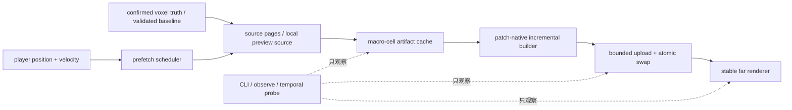

# 决策稿：Voxia 远景时序稳定与无缝流送

- **日期**：2026-07-10
- **状态**：换机暂停检查点（Phase 0/1 与 Phase 2 前三切片已落地；严格不用 raymarch；后续从预测预取、GameThread 解耦和生产 pack 继续）
- **触发**：第一人称零参数入口实跑暴露两项生产阻塞：远景体素明显闪烁；冷启动与跨 tile 更新无法支撑无缝游戏体验。
- **边界**：本阶段只改客户端派生远景与本地 WorldGen preview 的加载/呈现编排，不改变 confirmed voxel truth、H gate、服务端 authority 或 wire codec。

## 1. 已确认基线

### 1.1 视觉

1. 稳态远景存在高频 shimmer。当前 `r.ScreenPercentage=77` + TSR；项目配置已记录“高频方块棱/薄远景 quad 反复跨采样格，TSR history 接受/拒绝跳变”。
2. 玩家移动导致 LOD ring 重分配时，patch 使用 `DitherTemporalAA` 做 0.35 秒交叉淡变；它主动引入逐帧噪声。稳态完成后材质回到 Opaque，因此“静止超过 fade 窗仍闪”与“只在换环窗口闪”必须分开验收。
3. 远景 `CastShadow=true` + VSM 可能放大远处 shadow crawling，但目前只列为待 A/B 因素，不能未经实测写成主因。
4. 当前 SVO `seam_status=pass`，patch 原子换入已保留旧覆盖到新上传完成；不得把 TSR/dither 问题误诊成几何缺口。

### 1.2 吞吐

2026-07-10 直接编辑器 PIE 跨一个水平 tile 的证据：

| 阶段 | 增量工作量 | 实跑耗时 |
| --- | ---: | ---: |
| near window | entered 3087 / retained 6174 / exited 3087 chunks | 11.8s |
| SVO build | built 782 / reused 20234 macro-cells | 45.5s |
| SVO upload | uploaded 82 / reused 279 patches | 7.46s |

绝对 wall time 会受编辑器后台 3 FPS 节流污染，但结构性工作量与固定预算不受该因素影响。下列诊断描述是 Phase 2 实施前的基线：

- near window 是完整 `3x3x3 tile = 9261 chunks`；水平跨 tile 必然新增 `1x3x3 tile = 3087 chunks`；
- near generation 默认 128 chunks/batch，apply 预算 1ms，并在发布后固定等待 160ms；
- WorldGen SVO 持久 artifact cache 默认关闭；
- macro-cell 命中复用后仍重新拼接全量 aggregate mesh、全量 seam scan、全量 split-by-patch；
- SVO uploader 默认 3ms / 8 patches per frame，首次 dirty patch >=64 时 bulk-hide 到全部上传完成。

Phase 2 第一切片完成后的真实 RHI 8km 同构对比为：首次 21024-cell 冷构建仍需 `247042.761ms`；跨一个水平 tile 时只重建 `776` 个 macro-cell、复用 `20248` 个，SVO build 为 `8334.940ms`，相对“已取消 aggregate/full seam、但仍隐式构建全量 runtime SVDAG”的 `135948.497ms` 降低约 `93.9%`。patch cache 只读取 `776` 个 dirty cell 的 `139906` quads，重建 `82/361` patches、复用 `279` patches，patch 聚合为 `135.586ms`；dirty-boundary seam 扫描 `270944` 个面，missing/duplicate/mismatch 均为 0。结论是隐藏的全量后处理已消除，但 8.3 秒增量 build 和 247 秒冷 build 仍不满足无缝体验。

Phase 2 第二切片把 patch-native 路径的 dirty macro-cell artifact 生成改为独立 per-cell cache 的并行任务，完整 aggregate/offline validation 仍保持原串行覆盖顺序。8km 冷 build 降到 `32358.644ms`（21024 tasks 的并行段 `30511.110ms`）；跨 tile build 降到 `2015.912ms`（776 tasks 的并行段 `1166.957ms`），相对第一切片再降约 `75.8%`，相对原始 `135948.497ms` 累计降低约 `98.5%`。patch 聚合为 `113.545ms`。这已移除最主要的 CPU 浪费，但 2.0 秒增量与 32.4 秒冷生成仍不是生产级无缝流送。

Phase 2 第三切片把受影响 patch 的 compact mesh 聚合拆成 82 个独立 `ParallelFor` 任务，随后仍以稳定 patch key 顺序提交 cache/live/removed 统计。8km 跨 tile patch update 从 `113.545ms` 降到 `72.751ms`（约 `-35.9%`），其中 aggregation 为 `43.941ms`；coverage、dirty/reused cell、rebuilt/reused patch 与 dirty seam 样本完全保持，missing/duplicate/mismatch 仍为 `0/0/0`。该切片缩短了同步聚合，但调用方仍等待整个批次完成，不等于已经移出 GameThread。

## 2. 目标与非目标

### 2.1 目标

- 稳态相机静止时，远景不出现可见周期性白点/边缘闪烁。
- 跨 LOD ring 时不出现 temporal noise 爆发、共面 z-fighting、洞或双显。
- 玩家跨 tile 时旧覆盖持续可见，新覆盖在进入前完成预取并原子换入。
- 增量更新成本与 dirty patch 数成比例，不再与全量 21016 macro-cells / 1.33M quads 成比例。
- 冷启动生产入口只读取已验证 pack/source-pages/artifact，不在入场后现算整幅 8km WorldGen SVO。

### 2.2 非目标

- 不把调大 GameThread budget 当成最终优化；它只能把等待转成卡顿。
- 不用降低 confirmed coverage、把 missing chunk 当空气或绕过 H gate 换速度。
- 不把 dev-only WorldGen preview 的冷生成耗时伪装成生产 streaming 已完成。
- raymarch 严格不用：不作为默认、调试、A/B 或 L4 候选，不运行任何 `VoxiaSvoRaymarch*` profile；不引入 Nanite runtime bake。

## 3. 系统边界

所有权约束：

- Transport 决定 source/config/build revision，不拥有 render component；
- FarField builder 维护 artifact/patch 纯数据，不访问玩家输入或 authority；
- WorldActor 只消费 patch delta 并维护组件生命周期；
- Prefetch scheduler 只提前请求，不改变 confirmed truth 与当前 active coverage；
- Renderer 的 fade/shadow/TSR 策略不能反向改变 voxel source。

## 4. 分阶段实施

### Phase 0：可重复 A/B 与预算面

- 增加 `svo_visual_stability` CLI：输出 AA method、screen percentage、TSR flicker 配置、VSM、far shadow、fade mode、fade in-flight/started、ring reassigned、renderer backend。
- 增加自动化脚本矩阵：current / screen-percentage-100 / no-fade / VSM-off。
- 同一机位分别采集 stationary 与 one-tile-move；产物写 `.demo/observe/`。
- 增加 near/SVO 阶段耗时摘要：source generation、artifact reuse/append、seam check、patch split、mesh conversion、game-thread submit。

### Phase 1：时序稳定远景

- 将换环 mask 从依赖 `TemporalSampleIndex` 的 `DitherTemporalAA` 改为固定屏幕空间的帧稳定互补 mask；同一屏幕像素上的新旧集合互补，任一帧不留洞、不双写。
- fade 完成后继续回到 Opaque 稳态材质。
- VSM/far shadow 只按 A/B 结果决定；若为放大器，外环使用明确的 shadow distance/tier policy，不影响近场阴影。
- 若 100% screen percentage 能显著改善稳态 shimmer，只作为诊断证据；最终优先减少远环亚像素高频信号，不默认用 69% 像素成本增长兜底。

### Phase 2：patch-native 真增量

- [x] build result 以 `macro-cell artifact map + dirty/removed set` 为主；默认 mesh renderer 不再为运行时复用路径构造全量 `Out.Mesh`。
- [x] 维护持久 cell-to-patch 索引与 patch compact mesh/fingerprint；只重新聚合受 dirty/removed cell 影响的 patch，且索引不复制第二份全量几何。
- [x] 全量 seam hash scan 移入 automation/offline；运行时只验证 dirty/new cell 及其 X/Z 邻接边界与计数不变量。
- [x] 默认 mesh renderer 不再构建只供 raymarch 使用的 runtime SVDAG root/node payload；当前路线严格不用显式 raymarch profile。
- [x] patch-native 路径把 dirty macro-cell artifact 生成拆成独立 per-cell cache 的 `ParallelFor` 任务；完整 aggregate/offline validation 保持串行确定性。`macro_cell_build` 暴露 tasks/parallel/build_ms。
- [x] 受影响 compact patch 聚合改为独立 `ParallelFor` 任务，稳定顺序提交统计；`patch_build` 暴露 aggregation_tasks/parallel/ms，8km patch update 为 `72.751ms`。
- [ ] 将 compact patch 聚合的同步等待与 DynamicMesh CPU 构建真正移出 GameThread；GameThread 只做 bounded component submit。当前 8km patch update 仍约 73ms，仍可能造成可见卡顿。

### Phase 3：预测预取与中心解耦

- near window 依据位置/速度预取即将进入的 3087-chunk slab，未 ready 不切 active coverage。
- near collar center 继续精确跟随玩家；外层 LOD coverage center 引入 hysteresis，减少每 tile 的大规模 ring reassignment。
- 旧 patch 保留到新 patch ready，提交后原子退役；连续移动采用 latest-wins 但每个已完成 revision 仍先发布，避免 publish starvation。

### Phase 4：生产 pack/cache

- launcher/cook 生成 validated source-pages 与 sharded patch artifact pack；避免 21016 个松散文件和首次运行现算。
- 场景入场 H gate 校验 pack/manifest/hash/diff chain；通过后用 mmap/批量解压 hydrate。
- WorldGen preview 可保留 opt-in loose cache 做开发回归，但不作为生产流送实现。

## 5. 验收矩阵

| 类别 | 验收项 | 门槛 |
| --- | --- | --- |
| 静态视觉 | stationary far temporal probe | 排除云/动态 UI 后，远景 ROI 不出现周期性高亮跳变 |
| 移动视觉 | one-tile ring transition | 无洞、无双显、无 temporal noise 爆发；fade 完成后 `fade_in_flight=0` |
| 几何 | dirty-boundary seam | `seam_status=pass`，missing/duplicate 不回归 |
| near streaming | one-tile slab | active coverage 切换前预取 ready；游戏中无 post-cross 空窗 |
| SVO build | one-tile recenter | cost 与 dirty patch 成比例；不得重新 split 全量 1.33M quads |
| upload | dirty patch submit | 每帧 submit 不超过预算，旧覆盖持续可见，`upload_queue` 收敛到 0 |
| 冷启动 | validated pack path | 入场后不启动 21016-cell WorldGen 冷 build |
| 权威边界 | baseline/H gate | 缺包/hash 错/diff 断裂继续硬失败，不用运行时自愈绕过 |

## 6. 进度日志

- 2026-07-10：立稿。完成现场证据回填与阶段拆分；Phase 0/1 开工。首轮实施范围锁定为：结构化视觉稳定性快照、A/B 启动矩阵、帧稳定互补 fade 材质及 automation/真实 RHI 验证。
- 2026-07-10：Phase 0 首个观测面落地。新增 `svo_visual_stability`，NullRHI 实跑返回 `aa_method=4`、`screen_percentage=77`、`tsr_flickering_period=6`、`tsr_history_samples=32`、`vsm_enabled=true`、`vsm_lod_bias=-1`、`far_cast_shadow=true`、`fade_mode=stable_screen_noise_v1`、`fade_seconds=0.35`。这使稳态 TSR/VSM 因素与移动换环 fade 能在同一份 JSON 证据里分开诊断。
- 2026-07-10：Phase 1 首轮落地。`M_VoxelFarDither` 不再调用 `DitherTemporalAA`；换环 mask 改为固定屏幕空间噪声阈值，新旧 patch 使用同一阈值的互补半空间，fade 完成后仍回到 Opaque 材质。`Voxia.Voxel.FarDitherMaterialContract` 已验证 ScreenPosition/Noise 存在、`DitherTemporalAA` 缺席、`FadePatternScale=512` 以及材质继承契约。该改动只消除 0.35 秒移动窗口的人为逐帧噪声，尚不能宣称已解决 77% TSR 下的稳态亚像素 shimmer。
- 2026-07-10：编辑器 Development 构建通过；`Automation RunTests Voxia.Voxel.Far` 共 10 个用例全部 Success，`TEST COMPLETE. EXIT CODE: 0`。材质专项可复现日志为 `clients/Voxia/Saved/Logs/voxia_stable_dither_test.log`。
- 2026-07-10：真实 RHI 小窗口跨 tile 验证通过。首个 revision 为 `macro_cell_count=288`、`quad_count=239787`、`seam_status=pass`；跨 tile 后 revision 2 为 built/reused/removed/dirty=`60/228/18/60`、`ring_reassigned_cells=18`、`upload_queue=0`。过渡中 `fade_in_flight=4`、`fades_started_total=4`，等待 31 秒后 `fade_in_flight=0` 且 revision/组件数保持稳定；三张 1920×1080 PNG 均通过非黑与颜色数审计。过渡帧与收敛帧肉眼无洞/双显，SSIM=`0.992810`。产物：`clients/Voxia/Saved/voxia_temporal_stationary_real_rhi.png`、`voxia_temporal_transition_real_rhi.png`、`voxia_temporal_settled_real_rhi.png`，结构化日志在 `clients/Voxia/Saved/Logs/Voxia.log`。
- 2026-07-10：Phase 2 第一切片落地。新增 `FVoxiaFarFieldCompactPatchCache`，用 cell-to-patch 索引对 dirty/new/removed cell 做局部重索引并只重建受影响 patch；WorldActor 直接消费 macro-cell artifact view，默认运行时不再生成全量 aggregate mesh。`svo.patch_build` 新增 mode、input cell/quad、rebuilt/reused/total patch、rebuilt/total quad 与 update time；`seam_check` 新增 `mode`、`full_mesh_checked`、`dirty_boundary_checked`。`-VoxiaSvoFullAggregateValidation` 保留完整 aggregate + 全量 seam 的离线逃生门。
- 2026-07-10：定位并移除默认 mesh renderer 的隐藏全量工作。此前即使 raymarch 默认关闭，builder 仍对 21024 个 cell 重建 runtime SVDAG root/node payload；现在只有显式 raymarch/composite/probe profile 才设置 `bBuildRuntimeResource=true`。小窗口跨 tile build 从 `4399.539ms` 降到 `876.457ms`；8km 跨 tile 从 `135948.497ms` 降到 `8334.940ms`（约 `-93.9%`），且 `runtime_resource_ready=false` / root/node=`0/0` 符合默认 mesh 路径预期。
- 2026-07-10：8km 真实 RHI revision 2 为 built/reused/removed/dirty=`776/20248/146/776`、cache hit=`0.963`、patch rebuilt/reused=`82/279`、patch update=`135.586ms`、dirty seam sample=`270944` 且 missing/duplicate/mismatch=`0/0/0`、`upload_queue=0`；1920×1080 截图 `clients/Voxia/Saved/voxia_phase2_mesh_only_8km_real_rhi.png` 通过像素审计并人工检查无洞。完整 `Automation RunTests Voxia.Voxel.Far` 共 12 个用例全部 Success，日志 `clients/Voxia/Saved/Logs/voxia_phase2_far_tests.log`，`TEST COMPLETE. EXIT CODE: 0`。
- 2026-07-10：Phase 2 第二切片落地。patch-native 路径把 dirty macro-cell artifact 生成改为 `ParallelFor`，每个任务拥有独立 `ColumnCache`，artifact cache 文件写入、统计和结果提交仍回到单线程按 CoveragePlan 顺序执行；full aggregate/offline 路径保持串行。新增 `macro_cell_build.tasks/parallel/build_ms`，automation 断言 task count 与 dirty count 一致。
- 2026-07-10：第二切片真实 RHI：小窗口跨 tile build 从 `876.457ms` 降到 `334.915ms`，其中 60-task 并行段 `177.869ms`；8km 冷 build 从 `247042.761ms` 降到 `32358.644ms`，其中 21024-task 并行段 `30511.110ms`；8km 跨 tile 从 `8334.940ms` 降到 `2015.912ms`，其中 776-task 并行段 `1166.957ms`，patch update=`113.545ms`。最终截图 `clients/Voxia/Saved/voxia_phase2_parallel_mesh_only_8km_real_rhi.png` 为 1920×1080、`unique_colors=35413`、`non_black_ratio=1`、审计通过且人工检查无洞；dirty seam 仍为 `270944` samples / 0 errors / pass。
- 2026-07-10：最终 Development 构建退出 0；聚焦 `FarFieldPatchNativeBuild` Success；完整 `Automation RunTests Voxia.Voxel.Far` 12/12 Success，日志 `clients/Voxia/Saved/Logs/voxia_phase2_parallel_far_tests.log`；综合 `Automation RunTests Voxia.Voxel.SvoPreview` Success，覆盖持久 cache、SVDAG、snapshot JSON 与多次 8km full aggregate，日志 `clients/Voxia/Saved/Logs/voxia_phase2_parallel_svo_preview_tests.log`；两者均为 `TEST COMPLETE. EXIT CODE: 0`。残余瓶颈重新排序为：2.0 秒 dirty build、约 114ms GameThread patch 聚合、near 3087-chunk slab，以及 32.4 秒冷生成。下一切片优先预测预取 + coverage hysteresis，并把 patch/DynamicMesh 构建移出 GameThread；冷启动仍必须由 validated sharded artifact pack + 批量 hydrate 解决，不得用提高 GameThread budget 伪装无缝。
- 2026-07-10：Phase 2 第三切片落地。受影响 patch 聚合改为 82-task `ParallelFor`，8km patch update=`72.751ms`、aggregation=`43.941ms`，相对第二切片 `113.545ms` 降约 `35.9%`；revision 2 保持 built/reused cells=`776/20248`、patch rebuilt/reused=`82/279`、dirty seam=`270944` samples、0 errors、`upload_queue=0`。截图 `clients/Voxia/Saved/voxia_phase2_parallel_patch_8km_real_rhi.png` 为 1920×1080，像素审计及人工检查通过。
- 2026-07-10：第三切片 Development 构建退出 0；聚焦 `Voxia.Voxel.FarFieldPatchCache` Success；完整 `Automation RunTests Voxia.Voxel.Far` 12/12 Success，日志 `clients/Voxia/Saved/Logs/voxia_phase2_parallel_patch_far_tests.log`；完整 `Automation RunTests Voxia.Voxel.SvoPreview` Success，日志 `clients/Voxia/Saved/Logs/voxia_phase2_parallel_patch_svo_preview_tests.log`。三条验证均未使用 raymarch，默认 mesh snapshot 的 runtime root/node 保持 0。
- 2026-07-10：换机前现场冻结。一次显式 raymarch real-RHI 小网格诊断虽完成 16/16 sample readback、root lookup 且 invalid=0，随后 D3D12 3D/Compute 队列均超时并挂住 CLI；已终止残留 UE 进程，GPU 恢复。该现象与旧跨队列竞态一致，不是 patch 优化回归。用户最终拍板 raymarch 严格不用，后续恢复不得再运行相关 profile。下一步按顺序处理预测 slab 预取 + coverage hysteresis、patch/DynamicMesh 真正离开 GameThread、validated sharded artifact pack，并继续稳态 77% TSR shimmer 的无 raymarch A/B。
