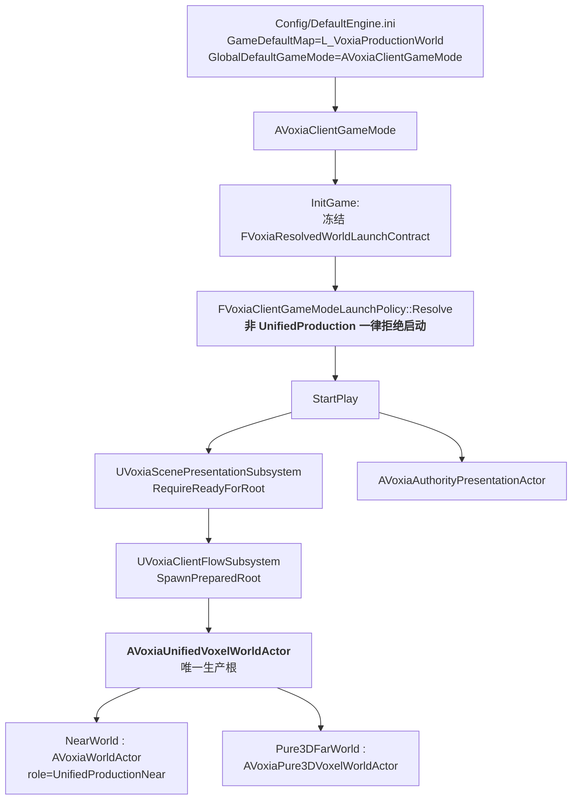
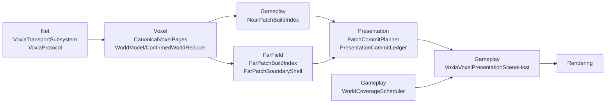

# Voxia 主路径梳理与精简决策稿

- 日期：2026-08-19
- 状态：进行中
- 范围：`clients/Voxia`（UE5.8 客户端，独立 git 仓）
- 目标：**先确立唯一主路径**，再按"极简哲学"删除主路径之外的附加物与不必要的检测代码；调试用日志/观测能力保留。
- 口径来源：用户在 `clients/Voxia/AGENTS.md` 新增的第 7/8/9 条（本稿写作时尚未提交）：
  1. 遵循极简原则，以实现功能正常路径为目标，**不把各类门禁放入正常流程**；确需保留的放到测试/调试专有路径。
  2. 遵循 DRY。
  3. 功能模块划分合理、降低耦合、尽量正交。

  据此，本次删除的判定标准是**"是否是正常流程上的门禁"**，而不是"是否叫 Validate/Audit"。

## 1. 现状量化

| 项 | 文件 | 行数 | 说明 |
| --- | ---: | ---: | --- |
| 全部 `Source/` | 653 | ~223,000 | 平均 **28.9 字符/行**（80 列硬折行），实际逻辑量约为行数的 1/2~1/3 |
| 非测试代码 | 481 | 160,924 | |
| Automation 测试 | 172 | 55,653 | 占 26% |
| UE 模板残留 `Variant_*` | 76 | 6,240 | 与体素客户端零关系 |

按目录（不含测试）：

| 目录 | 实码行 |
| --- | ---: |
| Gameplay | 66,616 |
| Voxel | 26,560 |
| Net | 13,185 |
| Presentation | 10,912 |
| FarField | 10,930 |
| Debug | 8,993 |
| Authority | 4,516 |
| Interest / Movement / Rendering / Core | ~6,000 |

## 2. 主路径（唯一生产链路）

数据面（Near/Far 流式）：

**关键事实**：`FVoxiaClientGameModeLaunchPolicy::Resolve` 只接受 `UnifiedProduction`，
且硬编码 `bSpawnStandaloneRoot = false`。所以 `AVoxiaWorldActor` 与
`AVoxiaPure3DVoxelWorldActor` 都**只能**作为统一根的子对象存在，不是并列的第二/第三条路径。
关卡作者态另有 `VoxiaSceneCompositionActor` / `VoxiaVoxelWorldPreviewActor` /
`VoxiaVoxelLodPreviewActor` / `VoxiaVoxelFillLightRig` 由 `L_VoxiaProductionWorld.umap` 直接引用，属主路径。

## 3. 附加项与可删清单

### Tier 1 — 零引用死代码（可直接删）

| 项 | 行数 | 证据 |
| --- | ---: | --- |
| `Source/Voxia/Variant_Combat`/`Variant_Platforming`/`Variant_SideScrolling` | 6,240 | 76 文件，全是 UE 模板（CombatEnemy/JumpPad/LifeBar/LavaFloor…）。仅 `Voxia.Build.cs` 的 `PublicIncludePaths` 提到目录名，无任何代码引用 |
| `Voxel/VoxiaVhiImpostor` | 881 | 代码/Config/Content 三处零引用 |
| `Gameplay/VoxiaSvoRaymarchComposite` | 461 | 同上 |
| `FarField/VoxiaFarFieldPatchUploader` | 415 | 同上 |
| `Voxel/VoxiaNearRetirementRegistry` | 392 | 同上 |
| `Voxel/VoxiaHeightmapMesher` | 215 | 同上 |
| `FarField/VoxiaFarFieldBuildPipeline` | 142 | 同上 |
| `FarField/VoxiaFarFieldFadeController` | 114 | 同上 |
| `FarField/VoxiaFarFieldHismInstance` | 108 | 同上 |
| `VoxiaCharacter` / `VoxiaPlayerController` / `VoxiaGameMode` | ~380 | UE 模板根类，仅 `DefaultEngine.ini` 的 `ActiveClassRedirects` 残留提到 |
| **合计** | **~9,350** | |

### Tier 2 — 策略层已封死的不可达分支

| 项 | 行数 | 说明 |
| --- | ---: | --- |
| `AVoxiaClientGameMode::StartPlay` 第二条 probe 路径 | ~145 | `Resolve` 已拒绝非 UnifiedProduction，此分支重复实现了一遍 spawn |
| `EVoxiaVoxelWorldCompositionMode::Pure3DProbe` / `OnlineCompatibility` | ~120 | 同上，含 `VoxiaVoxelWorldComposition` 的命令行解析 |
| `EVoxiaWorldActorRole::OnlineCompatibilityNear` / `LegacyProbe` | ~60 | 角色枚举里两个不可达取值 |

### Tier 3 — 检测代码（用户要求删，需定口径）

| 项 | 量 | 备注 |
| --- | ---: | --- |
| Debug CLI 命令 | 约 100/140 个未被任何脚本引用 | `VoxiaDebugCliSubsystem.cpp` 6,113 行；27 个命令被冒烟脚本实际调用 |
| 生产类里的测试注入钩子 `ForDebug`/`ForTest`/`Inject` | 68 处（30 处在 SceneHost） | 如 `SetPatchPresentationDelayForDebug` 之类的人为延迟注入 |
| `FVoxiaValidated*` 包装类型 4 个 | 205 处引用 | 类型级"证明校验跑过"的仪式 |
| `Validate*` / `Audit*` / `Probe*` / `IsStructurallyValid` | 约 1,300 处 | 运行时自校验 |

**保留**：`UE_LOG`（203 处）、`FVoxiaObserve::Emit`（368 处）、`SnapshotJson`（85 个类型）——
这三者是冒烟脚本与线上诊断的读取面，属"调试用日志能力"。

### Tier 4 — 测试（55,653 行 / 26%）

需要单独定口径，见 §4 待决问题。

## 4. 待决问题

1. **Tier 3 的检测代码删到什么程度？** 一个真实反例：`docs/10-active/voxel-far-field/2026-08-18-far-publication-liveness-deadlock.md`
   记录的 livelock，根因是 `LiveLayerFaceArtifactCount` 与 canonical 表被分开维护；
   而 `IsStructurallyValid` 把这个不一致变成了**永久静默重排队**而不是显式失败。
   即：**那条检测本身不存在的话，这个 bug 根本不会以 livelock 形式出现**。
   这支持"删检测、让不变量由类型自维护"的方向，但需要用户拍板范围。
2. **Content/ 模板资产**（`Variant_*` 共 61 文件 / 4.0M，`ThirdPerson` 140K）是否一并删？
   生产地图 `L_VoxiaProductionWorld.umap` 对它们零引用。删 C++ 不删资产会留下父类缺失的蓝图。
3. **测试是否精简？** 172 个文件 55,653 行，其中部分覆盖的是 Tier 1/2 的死代码。

## 5. 已执行

### Tier 1（已完成，编译通过）

- 删 `Source/Voxia/Variant_Combat` / `Variant_Platforming` / `Variant_SideScrolling`（76 文件）
- 删 8 个零引用孤儿模块及其专属测试
- 删 UE 模板根类 `VoxiaCharacter` / `VoxiaPlayerController` / `VoxiaGameMode`
- 清 `Voxia.Build.cs` 的 13 条 Variant include 路径、`DefaultEngine.ini` 的 3 条 `ActiveClassRedirects`

### Tier 2（已完成，编译通过）

- `EVoxiaVoxelWorldCompositionMode` 从 4 值收敛为 `UnifiedProduction` / `Invalid`；
  撤销的 selector（`-VoxiaPure3DProbe` / `-VoxiaPure3DWorld` 等）改为**显式硬失败**，不再静默降级
- `AVoxiaClientGameMode::StartPlay` 的 `switch` 收敛为单一 `if`，删掉两个不可达 spawn 分支
- 删 `FVoxiaWorldActorRoleBinding` + `EVoxiaWorldActorRole`（4 值枚举实际只有 1 个可达），
  折叠为 `AVoxiaWorldActor::BindProductionNearRole()` 一个 bool 守卫；
  顺带删掉零调用者的 `GetRole()` / `GetRoleLabel()`

### 结果

| | 前 | 后 |
| --- | ---: | ---: |
| 源文件 | 653 | 547 |
| 行数 | ~223,560 | 212,882 |

`Build.bat VoxiaEditor Win64 Development` → `Result: Succeeded`（350/350）。

## 6. 调查结论：哪些"检测代码"**不该**删

- `FVoxiaValidatedFarTargetManifest` 一类 `Validated*` 包装**不是仪式**：它们是
  "一次校验 + 冻结 + 跨线程共享不可变索引"，删掉会让主线程反复扫描整份清单，
  属性能与正确性双重回归。判定标准应是"是否是正常流程上的门禁"，不是名字里有没有 Validate。
- `UE_LOG` / `FVoxiaObserve::Emit` / `SnapshotJson` 是冒烟脚本与线上诊断的读取面，保留。

## 7. 新发现的过度设计（待定，未动）

- **测试断言生产代码的源码文本**：`VoxiaUnifiedWorldTransactionPresentationAutomationTest.cpp`
  用 `FFileHelper::LoadFileToString` 读 `VoxiaWorldActor.cpp` / `VoxiaPure3DVoxelWorldActor.cpp`，
  再 `Find()` 精确子串（含 `
		` 缩进）来断言实现结构，例如
  `"bool AVoxiaWorldActor::BindRole("`、`"!RequestedPatchTargetKey.IsSet()"`。
  后果：任何重命名/重排版都会让测试失败，且失败信息与真实语义无关。这是典型的
  "把门禁放进正常流程"的镜像版本——把实现细节焊死进测试。
- **standalone Pure3D probe 路径**：`AVoxiaPure3DVoxelWorldActor` 里 25 处 `bUnifiedRootChild`
  分支。现已无任何关卡放置该 Actor，也无 GameMode 分支生成它，`bUnifiedRootChild` 恒为 true，
  整个 `else` 分支（含 `EVoxiaPresentationHostComposition::StandalonePure3DProbe`）不可达。
- **Debug CLI**：132 个命令中 89 个未被任何脚本引用（`VoxiaDebugCliSubsystem.cpp` 6,113 行）。

## 8. 第二轮：内容资产、测试脆断言、Far actor 归一

### 已完成

| 项 | 结果 |
| --- | --- |
| Content 模板资产 | 删 `Variant_*` / `ThirdPerson` / `Characters`（Manny/Quinn）/ `Input` / `LevelPrototyping` 及其 `__ExternalActors__`、`__ExternalObjects__`，共 752 文件。用**资产注册表**核实（不是 grep 压缩 uasset）：生产地图与全部预览地图零模板引用，`/Game/Characters` 128 个包、`/Game/Input` 9 个包均无外部引用者 |
| HUD 关卡 | 两个 HUD 关卡各有一处 `BP_ThirdPersonGameMode` 默认值，已改为 `AVoxiaClientGameMode`（`capture_hud.ps1` 本来就在 URL 上传这个）。`create_hud_test_level.py` / `create_uidesign_level.py` 是一次性 bootstrap，关卡存在后恒为 no-op，已删 |
| 源码文本断言 | 10 个测试用 `FFileHelper` 读生产 `.cpp/.h` 并匹配精确子串，删除全部此类断言（−1,731 行），保留同函数内的行为断言与对**测试产物**的读取（observe JSONL、manifest fixture、prefix meta）。`VoxiaTransportFacadeOwnershipAutomationTest` 全文即此类断言，整文件删除 |
| Far actor 归一 | `AVoxiaPure3DVoxelWorldActor` 的 standalone probe 路径（22 处 `bUnifiedRootChild` 分支）删除；BeginPlay 改为**硬要求**统一根 owner，否则 `far_world_requires_unified_root_owner` 显式失败。连带删 `EVoxiaPresentationHostComposition::StandalonePure3DProbe` 与忽略参数恒返回 `Full` 的 `FVoxiaWorldGenVoxelShellBuildScopePolicy` |

### 结论修正：Debug CLI **不删**

初稿写"132 个命令中 89 个未被脚本引用"。这个口径错了——其中 76 个在
`Source/Voxia/Debug/README.md` 有文档，属**有意维护的调试面**。脚本与文档都未提及的只有 13 个
（`uds_*` 天空系统内省、`tune_*` 调参、`safe_view_state` 等），各只有一个分发点，合计约 200 行，
且 `uds_*` 服务于仍在使用的 UltraDynamicSky。

按 `AGENTS.md` 第 7 条"确需保留的放到测试、调试等专有路径中"，CLI 正是该路径本身。
CLI 中也不存在指向已删功能的悬空命令。**建议保留。**

## 9. 总计

| | 前 | 后 |
| --- | ---: | ---: |
| 源文件 | 653 | 546 |
| 源码行 | ~223,560 | 211,044 |
| 其中测试行 | 55,653 | 52,744 |
| Content 文件 | — | −752 |

累计 `890 files changed, 87 insertions(+), 12717 deletions(-)`。

验证（每一轮均执行）：

- `Build.bat VoxiaEditor Win64 Development` → `Result: Succeeded`
- `Automation RunTests Voxia` → **221 通过 / 0 失败**（改动前为 221 通过 / 1 失败，
  那个失败正是被删掉的源码文本断言）
- `run_phase1_world_lifecycle_smoke --real-rhi --full-far-only` → **3/3 通过**，
  near 7665/7998ms、far 4986/5335ms、total 12651/13333ms，落在 2026-08-19 基线区间内
  （near 7619–8192、far 4962–5889、total 12615–13723）

首次冒烟曾在退出阶段超时，原因是删内容 + 重建导致 DDC 冷启动
（`Waited 25s for Derived Data Cache to finish 379 tasks`），引擎本身 `LogExit: Exiting`、
`child exit code=0`；DDC 转热后连续三次通过。

## 10. 进度日志

- 2026-08-19：完成主路径梳理与全量可达性分析，产出本稿。
- 2026-08-19：执行 Tier 1 + Tier 2，编译通过，源文件 653 → 547。
- 2026-08-19：第二轮完成 Content 资产、源码文本断言、Far actor 归一；Debug CLI 经复核后保留。
