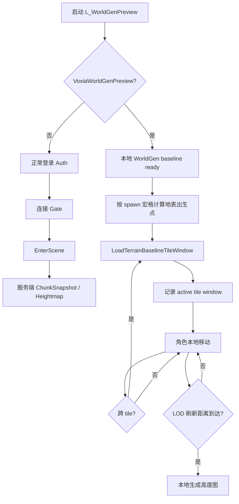

# Voxia WorldGen 预览关卡与滑动窗口实施计划

## 目标

让 Voxia 在不叠加 ThirdPerson 样例关卡的前提下，启动到一个干净的 WorldGen 预览关卡，并在 `-VoxiaWorldGenPreview` 下：

1. 本地生成当前位置窗口内的完整体素 chunk。
2. 角色移动跨 tile 后，体素滑动窗口跟随刷新并裁剪窗口外 tile。
3. LOD 高度图随移动刷新，窗口外按既定远景优化策略显示。
4. 正式服务端权威路径不被弱化，dev-only 本地预览只用于生成算法和客户端渲染联调。

## 阶段

### 阶段 1：新关卡入口

- 新增 Unreal Python 脚本创建 `/Game/Voxia/Maps/L_WorldGenPreview`。
- 该关卡从空世界创建，不从 `/Game/ThirdPerson/Lvl_ThirdPerson` 复制。
- 更新 Voxia 默认地图与 stdio CLI 默认地图到新关卡。
- 保留 CLI `--map` 参数，方便回归旧关卡或指定测试地图。

### 阶段 2：本地 WorldGen 运行时门控

- 在 `UVoxiaTransportSubsystem` 暴露只读方法判断是否启用本地 WorldGen 预览。
- `RequestTerrainBaseline` 在预览模式下不要求登录凭证，直接把 baseline 标记为 dev-only ready。
- `SubscribeChunk` 在预览模式下不要求 `InScene`，只记录 active window。
- `RequestHeightmap` 在预览模式下不要求 `InScene`，直接用 `FVoxiaWorldGenV1` 生成高度图。
- 正常服务端路径继续要求认证、入场、服务端订阅和服务端高度图。

### 阶段 3：Pawn 接入移动与滑动窗口

- `AVoxiaPawn::DriveBootstrap` 在 WorldGen 预览下跳过 auto-login、Gate 连接和 EnterScene。
- 使用确定性出生点命令行参数：
  - `-VoxiaWorldGenSpawnMacroX=1234`
  - `-VoxiaWorldGenSpawnMacroZ=-5678`
  - `-VoxiaWorldGenSpawnClearanceCm=260`
- 出生点根据 `ColumnHeight(x,z)` 落到地表上方，不再出生在原点附近的体素盒子里。
- Tick 运行时条件从“必须 `InScene`”扩展为“`InScene` 或 dev-only WorldGen 预览 ready”。
- 网络移动输入只在 `InScene` 发送；本地预览只使用 `UVoxiaCharacterMovement` 驱动角色。
- 接入 tile 级滑动窗口：跨 tile 时重新 `LoadTerrainBaselineTileWindow`，并由 `PruneOutsideTileWindow` 裁剪窗口外 chunk。
- 默认 `-VoxiaTileWindowRadius=1` 加载完整 3×3×3 tile（9261 chunk），匹配实战窗口；`-VoxiaTileWindowRadius=0` 只作为显式调试降档。
- raycast/edit 判定、debug overlay、transport active window 统一使用同一个 tile window，不再让 preview 的交互范围按旧 chunk 半径解释。
- 复用现有 `MaybeRefreshHeightmap`：远景 LOD 按移动距离重新请求本地 WorldGen 高度图。

### 阶段 4：验证闭环

- 新增 automation test 覆盖 WorldGen 预览出生点坐标和初始 chunk。
- 编译 Voxia C++。
- 用 stdio CLI 启动 `-VoxiaWorldGenPreview`：
  - 等待 baseline ready。
  - 等待 tile 窗口完整。
  - 移动超过一个 tile。
  - 等待 `current_stream_tile == last_subscribed_tile` 且 `tile_window.missing == 0`。
- 运行新关卡生成脚本，确认默认启动不再进入 ThirdPerson 样例关卡。

## 运行时流程

## 非目标

- 不把本地 WorldGen 预览作为 confirmed voxel truth 的生产来源。
- 不绕过正式 world-pack / manifest / diff chain 的硬校验。
- 不在这一步实现洞穴、水体或结构生成。
