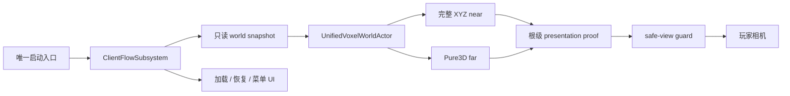

# Voxia 阶段 1 收口：世界渲染与场景生命周期

## 产品结果

Voxia 现在可以从唯一正式入口自动创建只读 Mock 会话，加载一个共享 world snapshot，并在完整
XYZ 空间持续呈现 near 与 Pure3D far。玩家可以经历首次加载、连续移动、短时 safe-view、恢复
加载、主动重试、返回菜单和开始新游戏；任一时刻只有一个生产 world root。阶段 2 的体素编辑
继续隐藏并硬门禁，在线服务端接入没有被阶段 1 的本地实现替代。

## 实现内容

- 会话快照冻结 `session_id`、source identity、world snapshot id、authority kind 与
  `confirmed_revision=0`；同一 session 重试不能改变世界事实，新游戏才创建新 session。
- `AVoxiaUnifiedVoxelWorldActor` 是唯一生产组合根；near/far 都报告
  `source_consumption=root_world_snapshot`，中心、generation、gap、overlap 与 stale commit
  由根级 proof 联合判断。
- near coverage 固定为 `3×3×3=27 tiles=9261 chunks`；单轴换窗为
  `entered/exited=9 tiles=3087 chunks`、`retained=18 tiles=6174 chunks`。
- safe-view 保留最后一次已提交视图，不移动 pawn 或几何；超时进入恢复加载，可自动恢复、主动
  retry 或返回菜单。
- far 保留 immutable residency、增量计划、cooperative cancellation、材质/表面复用与 stable XYZ
  patch；near 以完整 XYZ tile × material family 合批。后台任务使用受限/低优先级线程池，UObject
  创建、注册、可见切换、fence 与退役按帧预算推进。
- opaque/translucent/emissive 三类材质 slot 贯穿 artifact、DynamicMesh、scene host 与预算指纹。
  默认 WorldGen 内容主要是 opaque；这不影响材质族契约，但不等于内容资产已完成美术丰富化。
- CLI 新增轻量 `client_flow_probe` 与 `move_quiet`，避免高频等待或性能窗口同步展开完整大快照。
  observe 日志改为阶段 checkpoint，仍保留完整错误原因和可复现产物。

## 验证证据

| 门禁 | 结果 | 产物 |
|---|---|---|
| Development build | `VoxiaEditor Win64 Development`，exit 0 | UnrealBuildTool 2026-07-16 最终运行 |
| 全量 automation | `68/68` success，0 warning / failed / not-run | `.demo/observe/voxia_phase1_automation_2026-07-16T00-17-07/index.json` |
| Null-RHI 全路线 | 25 条路线，pass | `.demo/observe/voxia_phase1_2026-07-15T14-55-37-788Z_null_rhi_1280x720/index.json` |
| 1280×720 Real-RHI 全路线 | 25 条路线，pass；正负 XYZ、斜向、多 tile、A→B→A、高低空、teleport、恢复、菜单/新游戏 | `.demo/observe/voxia_phase1_2026-07-15T15-30-59-504Z_real_rhi_1280x720/index.json` |
| 1600×900 Real-RHI 长稳态 | 30 分钟，96 条 route completion、93 个资源样本、无单调增长 | `.demo/observe/voxia_phase1_2026-07-15T15-44-42-482Z_real_rhi_1600x900/index.json` |

GameThread 性能证据：

| 场景 | p50 | p95 | p99 | max | `>16.67ms` |
|---|---:|---:|---:|---:|---:|
| 1280×720 move | 2.68 | 4.70 | 6.12 | 12.44 | 0 |
| 1280×720 return | 2.74 | 4.56 | 6.16 | 14.52 | 0 |
| 1600×900 move | 2.58 | 4.46 | 8.31 | 16.01 | 0 |
| 1600×900 return | 2.71 | 4.60 | 5.80 | 13.66 | 0 |

所有数值单位均为毫秒。`frame_perf` 同时保留 raw frame delta；长稳态第二段 raw max 为
`65.41ms`，但 GameThread max 为 `13.66ms`。因此它作为默认 GC / 渲染环境长帧保留，不被错误
归因为 streaming GameThread CPU。短性能门禁隔离 UE 周期性 pending-kill purge；30 分钟长稳态
保留默认 GC，并对资源集合、队列与覆盖不变量做独立门禁。

## 三入口覆盖

- 真实用户入口：唯一生产根、键鼠移动/飞行、加载/恢复 UI、Retry、Return to Menu、New Game。
- 自动化入口：会话、flow、snapshot binding、scheduler、safe-view、材质族、预算、full oracle、
  scene host、near batch 与 production-root acceptance。
- CLI / 日志入口：`client_flow_state`、`client_flow_probe`、`safe_view_state`、
  `voxel_streaming_profile`、`voxel_world_root_state`、`frame_perf`、`render_perf` 与 JSONL observe。

## 未越界与后续边界

- 未修改 `apps/**`、wire opcode、HTTP API、服务端 authority、Web 或 Bevy。
- 阶段 2：挖掘/放置、pending UI、confirmed overlay 与会话 HUD。
- 后续 Online：服务端 bootstrap、H-gated production pages、snapshot/delta、续租、重连与 source
  revision 失效。客户端不得用 WorldGen、runtime snapshot 或缺页即空气兜底。
- 默认 WorldGen 画面仍以浅色 opaque terrain 为主；后续内容/美术丰富化不能破坏阶段 1 已冻结的
  material-family、world snapshot 与原子 presentation 契约。

## 手动确认

自动化与文档收口完成后，以可见 `UnrealEditor.exe -game` 启动同一 `Lvl_NearWindow` +
`VoxiaClientGameMode` + `-VoxiaWorldGenPreview` 正式组合根，保持程序运行，等待用户手动确认画面与
交互效果。

## 2026-07-17 完成后审查硬化附记

> 本节不改写 2026-07-16 阶段 1 已完成的历史结论；它记录后续硬化候选
> `clients/Voxia@500248e` 的实施、新鲜复验与尚未解决的外部环境门禁。

本轮将 reusable canonical batch 的唯一 owner 义务补齐到 plan/residency/build 的
stale/cancel/fail 分支，并将 publish 成功/失败与 EndPlay 遗留的大纯数据统一移交到
单条 `TPri_Lowest` far worker。由于 UE 5.8 线程池 `Destroy()` 会 abandon 未开始任务，
EndPlay 显式 drain 后才销毁线程池。观测面新增 `far_release.queued/completed/pending`，
owner 冲突与无 worker 回退均显式记录错误。

| 硬化复验 | 结果 | 产物 |
|---|---|---|
| Development build | pass，exit 0 | UE 5.8 UBT |
| 全量 automation | `69/69` pass | `.demo/observe/voxia_phase1_hardening_closeout_20260717_2324/automation_all_voxia.log` |
| Null-RHI 全路线 | 25/25 pass | `.demo/observe/voxia_phase1_2026-07-17T15-49-41-681Z_null_rhi_1280x720/` |
| 1280×720 Real-RHI 全路线 | 25/25 pass；GT p95=`1.505/1.506ms`；`>16.67ms=0/0`；release=`6/6/0` | `.demo/observe/voxia_phase1_2026-07-17T15-52-34-671Z_real_rhi_1280x720/` |
| 1600×900 Real-RHI soak | 30 分钟；104 route completion；101 样本；无单调增长；release 最终=`208/208/0` | `.demo/observe/voxia_phase1_2026-07-17T15-59-31-501Z_real_rhi_1600x900/` |

两次独立 1280×720 D3D12 performance-only 均在 RHI 初始化约 58–60 秒后捕获同一
`423–425ms` 尖峰，因此不能写为连续两次通过。定向 `stat dumphitches` 显示 RHI
关键路径为 `RHITaskPipe -> STAT_D3DUpdateVideoMemoryStats -> QueryVideoMemoryInfo`，其中
显存统计更新占 `423.086ms`；同帧 Voxia world tick 约 `1.4ms`。该归因只说明本轮
客户端流送实现不是尖峰的执行者，不等于门禁通过。正式 runner 保持原始严格
断言，没有新增 ignore/exemption；当前不执行 Task 7 Step 3–5，不启动可见人工
确认窗口。

## 2026-07-17 最终审查补充

> 本节继续保留阶段 1 历史完成结论，只更新完成后 hardening 候选的最终审查与复验状态。

候选追加 `97d5002` 后，coverage retirement、失败/替换 artifact cache、EndPlay drain 终态和
runner clean-close 关联也纳入唯一 far worker 所有权。最终审查 Critical / Important / Minor
均为 0；Development build、Voxia `69/69`、Null-RHI 25 routes 和 1600×900/30 分钟 soak 通过。
soak 完成 120 条路线、95 个资源样本，`growing_keys=[]`，release 样本 queued/completed 从
`14/14` 到 `390/390`、pending 全程为 0，quit 后最终=`391/391/0` 且 clean exit。

当前候选仍不能成为新的最终验收点：最新两次 1280×720 performance-only 一红一绿，失败轮
回程 GameThread max=`424.536ms`；另一次完整 Real-RHI 复验在首个性能窗捕获一个
`16.98ms` GT 帧。正式 runner 保持严格断言，不新增 ignore/exemption；Task 7 Step 3–5 和
可见人工确认继续保持未执行。
