# 2026-06-29 体素世界同步 · chunk 版本管理 · 滑动窗口与客户端渲染设计（v3，评审加固 + 整合 sliding-window 文档）

> **基线规范（不可静默推翻，本稿一切设计在其约束下展开）**：
> - [`2026-06-29-voxel-baseline-streaming-boundary.md`](2026-06-29-voxel-baseline-streaming-boundary.md) —— D-1~D-14、存储/流送/计算三边界、垂直分层、H 凭证。
> - [`docs/30-reference/overview/2026-06-27-架构设计指导思想-系统正交.md`](../overview/2026-06-27-架构设计指导思想-系统正交.md) —— 正交分解 / 自维护不变量（含时间性不变量）/ 显式契约。
> - [`docs/00-current-truth/design/voxel/README.md`](../../00-current-truth/design/voxel/README.md) —— 体素真值、三阶段边界、tile 预算口径、baseline 硬校验铁律。
>
> **本稿定位**：6-29 决策稿拍板了 **WHAT**（baseline 形态 = 算法基底 + delta + 轻量 H）。本稿是其下游 **HOW 设计稿**——把这套边界落到「运行时 chunk 同步、chunk 版本管理、客户端滑动窗口与三层渲染」。它**不新增可推翻约束**，只把已定约束落到窗口/版本/渲染层；本稿决策用 `W-` 前缀，引用决策稿用 `D-`。
>
> **v2 加固**：v1 经 5 视角对抗评审（决策稿一致性 / 系统正交 / 可行性性能 / 代码契合 / 完整性）。本版闭合 6 个 must_fix（M1 远景订阅面无 owner、M2 content_version 运行时无维护、M3 baseline 内容维度未锁定、M4 浮点 bit-exact 杀手、M5 瘦身切断远景写路径、M6 动态层不适用∝修改量）+ 若干 medium。加固记录见 §15。
>
> **v3 整合**：整合用户提供的 [`docs/90-obsolete/voxel-far-field/voxel_mmo_sliding_window_architecture.md`](../../90-obsolete/voxel-far-field/voxel_mmo_sliding_window_architecture.md)，补客户端运行时工程层（§6.7：L0/L2 双层无 L1、collision 资源解耦、Hot/Warm/Cold tile 生命周期、预测加载、mesh page、失败处理；W-14~16）。该文档与本稿三态一致，其架构正确性短板（远景编辑可见性无 owner / 无 content_version 运维 / 无浮点 bit-exact / 无垂直维度 / 无动态层）由本稿 W-8~W-13 补。
>
> **工作纪律**：决策稿/设计稿先行 → 逐 step commit（`mix format` / 测试）→ 进度日志 → 不 push → 全新系统不留兼容。

---

## 0. 术语映射（用户词汇 ↔ 决策稿/代码 ↔ 本稿统一）

| 用户词汇 | 决策稿/代码对应 | 本稿统一口径 |
|---|---|---|
| 算法基底 | `WorldGen(seed, control_maps, coord)` 确定性纯函数（D-1/D-4），Rust NIF `world_gen_noise` | **算法基底 = WorldGen**。**现状仅 2.5D 列高度**（无 control_maps 入参、非 3D coord，见 §5.5 W-10） |
| offset 快照 | committed events `D`（设计师）+ `P`（玩家），相对算法基底的 delta（D-2） | **offset(committed delta)**：每 chunk 相对 WorldGen 基底的 committed 修改。**D-layer（冻结、随 launcher 包下载）⊥ P-layer（运行时服务端流送、客户端不持久存）**，见 §3.1 |
| 以 chunk 为单位版本管理 | 运行时 `chunk_version`（已实现）+ baseline 凭证 `H`（D-14） | **正交两层**：运行时 `chunk_version`（同步/CAS）⊥ baseline `H`（完整性）。`∝修改量` 是 Step4 瘦身后目标态，非现状（§4） |
| 3×3×3 tile 滑动窗口 | 冻结 27 tiles = 9261 chunk | 玩家随身 **336m 全分辨率可编辑切片**（非全高度，见 W-6/S3） |
| 窗口内真实体素 | 近场 confirmed chunk → `VoxiaGreedyMesher` | 一致 |
| 窗口外「合并 + 高度图」 | 远景 LOD（`AuthoritativeHeightmap` / `LodProjection`） | **terrain（高度 mip 金字塔）+ proxy mesh**，见 §6（W-5） |
| 地下 8km | 决策稿 -12km（D-8） | **物理 -12km / WorldGen 异质材料到 -12km / 设计师 D 雕到 -8km**（W-4） |
| （无快照处）算法推导 | 客户端本地 WorldGen 重算（D-3，H 通过为前提） | W-3，硬校验铁律下的本地推导（**仅静态地形**，动态层见 §9 W-12） |
| L0 / L2（sliding-window 文档术语） | — | **L0 = ① 滑动窗口真实体素；L2 = ②窗外 terrain mip+proxy ＋ ③远景（统称远景表现层）；v1 无 L1 中间可碰撞体素层**（§6.7 W-14） |

> **术语红线**：「offset」**不是** D-2 明令不存的「全量合成 snapshot」。本稿避免用「offset 快照」与之撞词，统一称 **offset(committed delta)**。其精确存储语义（事件日志 vs 物化 checkpoint）见 §10 W-Q1，未拍板前不假定。

---

## 1. 三句话总览

1. **静态地形真相 = 算法基底 ⊕ 每 chunk 的 offset(committed delta)**。`world(chunk) = WorldGen(seed, maps, coord) ⊕ offset(chunk)`。未修改 chunk 的 offset 为空，靠 WorldGen 本地重算恢复，零存储；修改过的 chunk 存 committed offset（`D+P`）。这是 D-1/D-2 落到 chunk 粒度。
2. **「以 chunk 为单位版本管理」拆成两个正交层**：运行时 `chunk_version`（已落地的同步/CAS 机制）⊥ baseline 完整性凭证 `H`（D-14，∝ WorldGen 异质性，KB-MB）。**绝不**把 chunk 版本扩成「覆盖全 ~294 亿 chunk 的静态 hash 数组」（D-14 §6.3 判废的 58GB~470GB 冗余）。
3. **「本地算基底 + offset 修正、带宽 ∝ 修改量」只对静态确定性地形成立**（§6.2 统一链）。**field/涌现/fluid/entity 是 P 驱动连续动态态，客户端无法 bit-exact 本地重算，必须服务端流送，其 LOD 带宽 ∝ 活跃源数量，不在本稿三态覆盖**（§9 W-12，M6 加固）。

---

## 2. 本轮已拍板决策（W-1 ~ W-13）

| # | 议题 | 决策 | 来源 |
|---|---|---|---|
| **W-1** | 静态地形真相模型 | `world(chunk) = WorldGen ⊕ offset(chunk)`；canonical 只存 committed offset（D+P）+ 轻量 H；未修改 chunk 重算恢复。落实 D-2/D-14。 | 用户拍板（Q3） |
| **W-2** | chunk 版本管理边界 | 正交两层：运行时 `chunk_version`（∝ 已修改，**Step4 瘦身后**）⊥ baseline `H`（∝ 异质性）。两者不互相冗余、不互相替代。 | 用户拍板（Q3）+ D-14 |
| **W-3** | 客户端 fallback | 无 offset 区用一致 WorldGen **本地推导**（H 通过为前提）；H 校验失败=**硬拒入场 + 诊断错误**，不软兜底。 | 用户拍板（Q2） |
| **W-4** | 垂直范围 | **物理世界 -12km..+100km**（7000 chunk）；**WorldGen 异质材料分层覆盖到 -12km**（fixture 抽样零存储，保 D-9 地心有内容）；**设计师 delta D 手工雕刻 v1 限到 -8km**。 | 用户拍板（Q4）+ M3 修订 |
| **W-5** | 客户端渲染三态 | (1) 滑动窗口内 = 真实体素 greedy mesh；(2) 窗口外 = **terrain（高度 mip 金字塔）+ proxy mesh**（proxy 按距离分流，§6.3）；(3) 远景 = 范围声明区/天空。 | Q1 用户反问 → 本稿设计 |
| **W-6** | 窗口内不分体素分辨率 | 窗口内统一 full-res、不做体素 LOD 分层，只做 mesh 调度/剔除。理由：**窗口内任意格随时可被编辑、需即时一致**（非"窗口=全高度"，S3 修订）。本决策是把跨分辨率耦合从多边界**收敛到单一窗口边界**，该边界一致性由 §6.2 dirty 契约维护（非"消除耦合"）。 | 本稿设计 + S3 修订 |
| **W-7** | 性能 = observe 驱动 | 不预设 9261 chunk 扛得住；**扛得住前提 = 窗口内大面积同质（2.5D 现状）+ 未修改 chunk 本地推导降带宽**。先 343 chunk 跑通，observe 量化（含有效 mesh chunk 数 / 常驻内存 MB / 顶点缓冲 MB）再扩窗。 | 本稿设计 + S9 修订 |
| **W-8** | 远景 LOD 订阅面（**M1**） | 远景区是**有 owner、自维护活性的订阅面**（LOD-tile 粒度 lease + offset commit fan-out 粗粒度 dirty 通知，或客户端周期 known_version 对账），不是无主 dirty。只覆盖窗外 **P**（D 已随包本地）。见 §7。 | M1 加固 |
| **W-9** | content_version 运行时维护（**M2**） | 0x62/0x63 wire 头部携带 `content_version` + 权威 `chunk_version`；客户端对账不上即**硬 resync**（复用 `ResyncChunk`）；WorldGen 升级/compact 由 World 层 region owner 广播失效、要求重过 H gate；`chunk_version` 跨 compact 全局单调不重置。见 §7/§8。 | M2 加固 |
| **W-10** | baseline 内容维度锁定（**M3**） | **v1 baseline = 2.5D 高度场 + 材料分层**（确定性 WorldGen 能产的）；**洞穴/悬空/天空岛/巨构/水全归 delta（D/P）**；深地异质=材料/硬度分层（fixture 抽样零存储到 -12km），**非 3D 空腔**。显式签收：这是 D-9/D-11 在本稿的落地口径——"材料/高度异质 by WorldGen，3D 结构 by delta"。见 §5.5。 | M3 加固 |
| **W-11** | WorldGen 跨端确定性规范（**M4**） | H fixture 哈希对象 = **离散整数输出**（`column_height` i64 / 量化 chunk 内容），不哈希 raw f64 中间值；规范强制 f64、禁 FMA 合并（`-ffp-contract=off`）、禁 x87；消除 `powf(2.2)` 改可移植有理多项式/定点；fixture 覆盖 `round` 边界坐标；留 `worldgen_impl_version` 协商缝。见 §8.5。 | M4 加固 |
| **W-12** | 动态层边界（**M6**） | field/涌现/fluid/entity **不在本稿三态覆盖**：P 驱动连续态、客户端无法 bit-exact 本地重算、必须服务端流送、LOD 带宽 ∝ 活跃源数量。指向后续 field-LOD / entity-AOI 设计。见 §9。 | M6 加固 |
| **W-13** | 三个正交半径 | **体素窗口 ⊥ 实体 AOI ⊥ 编辑影响域**：实体走独立 AOI 半径（`scene_server/aoi/`，≠336m）；结构性后果（应力/坍塌/电热传导）按**结构连通域**加载、窗外也临时实例化 `ChunkProcess` 参与裁决。见 §9。 | 完整性评审加固 |
| **W-14** | L0/L2 双层，v1 无 L1 | 采纳 sliding-window 文档：L0=真实体素窗口、L2=远景表现层；**v1 不引入可碰撞中间体素 LOD 层**（避免 L0/L1 collision/mesh 不一致地狱）。分辨率分层只在 L2（纯视觉）。见 §6.7.1。 | 整合 sliding-window 文档 |
| **W-15** | Collision 资源解耦（补 v1 遗漏） | voxel data / render mesh / collision / gameplay active **四层解耦**；玩家脚下+即将到达 collision **必须提前 ready**、**不放玩家进未完成 collision 区**。客户端 collision 是本地物理代理，**权威碰撞/移动裁决仍在服务端**（`movement_engine`）。见 §6.7.2/§6.7.6。 | 整合 sliding-window 文档 |
| **W-16** | 预测加载 + tile 生命周期 + mesh page | 窗口滑动靠**预测方向提前加载**（不等跨 tile）；Hot/Warm/Cold tile 生命周期；**分阶段异步流水线**（版本→diff→推导→应用→mesh→collision→ready→promote）；**Mesh Page 聚合**（2×2×2~4×4×4 chunk，避免 9261 component）。见 §6.7.3~6.7.5。 | 整合 sliding-window 文档 |

---

## 3. 模型一：chunk = 算法基底 ⊕ offset(committed delta)

### 3.1 单 chunk 真相恢复（D-layer ⊥ P-layer）

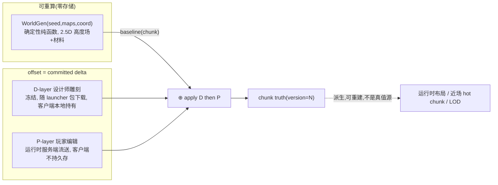

- `baseline(chunk) = WorldGen(seed, maps, coord)`：服务端与客户端 bit-exact 重算（D-3/D-4，规范见 §8.5）。
- `offset(chunk)` 两层职责正交（评审 1#4 加固）：
  - **D-layer**（设计师）：开服前冻结，随 launcher 包下载，**客户端本地持有**，本地可 `baseline ⊕ D` 重算。
  - **P-layer**（玩家）：开服后运行时编辑，**服务端流送，客户端不持久存**，只消费流来的 delta。
- `chunk truth = baseline ⊕ D ⊕ P`：合成视图，运行时可物化进 hot truth / 持久化，但**是派生物，不是不可恢复真值**。

### 3.2 offset 的承载：围栏机制可复用，offset 存储需新建（S7 修订）

服务端**已有**承载 offset 所需的**并发与租约围栏**（survey 核实），但**「按 chunk 存 committed offset/事件日志」这套存储表示在代码里不存在**（现存只全量快照，§10 W-Q1 自认未定）：

| 能力 | 现有实现 | 复用 or 新建 |
|---|---|---|
| 编辑裁决 + 单调版本 | `ChunkProcess.bump_chunk_version()`（`chunk_process.ex:4280`） | ✅ 复用 |
| durable-before-ack | lease 在场先 `persist_snapshot` 再改内存（`commit_surface_element_change`） | ✅ 复用 |
| canonical CAS | `ChunkSnapshotStore` chunk_version 单调 CAS（`FOR UPDATE`） | ✅ 复用 |
| 写栅栏 | `WriteTokenStore` token CAS + `owner_epoch`（跨重启单调） | ✅ 复用 |
| stale 自愈 | `:stale_chunk_version` → reload + retry | ✅ 复用 |
| **committed offset / 事件日志存储** | **无**（现为全量快照；`ChunkPendingTransactionStore` 是幂等审计非可重建 truth） | ❌ **新建 schema + 重算-合并恢复路径（Step4/5，绑 W-Q1）** |

> **修订**：v1 误称「服务端已有承载 offset 所需全部机制，不需重建」。准确口径：**围栏机制（版本/CAS/租约/stale 自愈）不需重建**；把持久化对象从「全量快照」换成「committed offset」是**新增存储表示 + 恢复路径**。

---

## 4. 模型二：chunk 版本管理的正交两层（W-2）

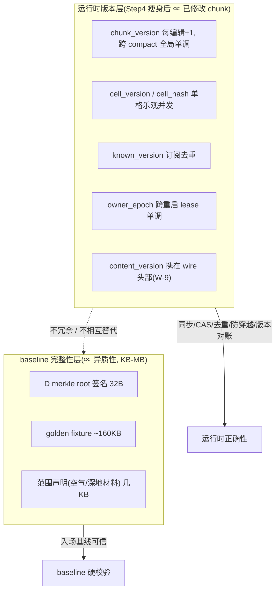

| | 运行时版本层（L1） | baseline 完整性层（L2） |
|---|---|---|
| 覆盖范围 | **Step4 瘦身后** ∝ 已加载/已修改 chunk（现状全量物化下对所有已物化 chunk 都存，正是 71TB 问题，S8 修订） | 整个世界（∝ 异质性，靠范围声明压到 KB-MB） |
| 实现 | `chunk_version`/`cell_version`/`known_version`/`owner_epoch`（已落地）+ `content_version`（W-9 待接 wire） | `H` = D 签名 + fixture + 范围声明（D-14，待落地） |
| 职责 | 同步序号、CAS、订阅去重、防 stale 写、**运行期版本对账（W-9）** | 入场 baseline 可信、跨端 WorldGen 一致性 |

> **撞墙红线**：**绝不**把 `chunk_version` 扩成「覆盖全 ~294 亿 chunk 的静态 version/hash 数组」（D-14 §6.3 的 58GB~470GB 冗余）。chunk 版本管理 = L1，baseline 完整性 = L2，正交、不替代。
>
> **S8 修订**：`chunk_version`「∝修改量 / 只覆盖已修改 chunk」是 **Step4 canonical 瘦身后的目标态**，不是现状。当前 `WorldPackBootstrapper/Materializer` 全量物化，对所有已物化 chunk 都存 chunk_version。版本机制（已落地）与「∝修改量覆盖」（待 Step4）须分清。

---

## 5. 世界尺寸、垂直分层与 bounds（W-4）

### 5.1 chunk 数学（survey 核实）

| 单位 | 定义 |
|---|---|
| macro cell | 1m³ |
| chunk | 16×16×16 macro = 16m 边长 = 4096 cells |
| tile | 7×7×7 chunk = 112m = 343 chunk |
| 滑动窗口 | 3×3×3 tile = 21×21×21 chunk = 336m = **9261 chunk** = 37,933,056 cells |

| | 当前实现 | 目标（W-4） |
|---|---|---|
| 水平 X/Z | -1024..1023 = 2048 chunk = **32km** ✅ | 不变 |
| 垂直 Y | -3..102 = 106 chunk ≈ **1.7km** | 物理 **-12km..+100km** = 7000 chunk（y chunk_min **-750**） |
| 全量 chunk（物理） | 4.45×10⁸ | **~2.94×10¹⁰**（约 66×，全部来自垂直） |
| WorldGen 异质材料深度 | — | 到 **-12km**（fixture 抽样零存储） |
| 设计师 D 雕刻深度 v1 | — | 到 **-8km**（手工内容）；-12km..-8km 仅 WorldGen 材料分层 |

### 5.2 垂直分层（可编辑性 ⊥ hash 分层，承接 D-6）

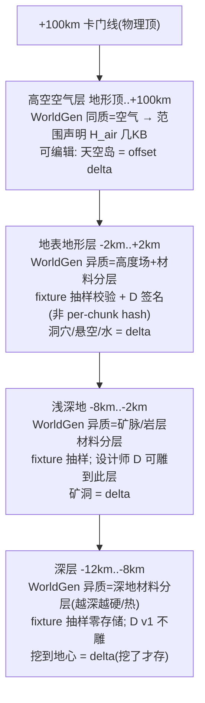

- **可编辑性 = 整个物理世界全高度**（-12km..+100km），不内缩（D-6/D-8）。任何高度编辑产生 offset（∝ 修改量）。
- **hash 分层由 WorldGen 异质性决定**：空气层 = 同质 → 范围声明；地表/深地 = **异质材料分层 → fixture 抽样校验 + D 签名（非 per-chunk hash，S1 修订）**。
- **W-4 修订（M3）**：深地 -12km..-8km **不是「同质基岩范围声明」**（那会丢掉 D-9 地心内容）。WorldGen 的**材料异质性**（越深越硬/热的岩层/矿脉分层）**覆盖到 -12km**，靠 fixture 抽样校验、零存储；只是**设计师手工 delta D 雕刻 v1 限到 -8km**。地心有内容（D-9），难度靠材料物性（Phase 8）。

### 5.3 shard 重新分片

当前 `shard_chunk_shape {16,106,16}`（Y 整包 106 层）在 7000 层下不可用，需按 Y 重新分片。粒度归决策稿 D-12「从头设计 hash 长度 + 分区粒度」，本稿只标依赖。`MmoContracts.WorldPackIndex` footer-table / shard summary 机制复用（D-7）。

## 5.5 baseline 内容维度锁定（W-10，M3 核心加固）

**代码核实**：`world_gen_noise` 严格 2.5D——逐列 `column_height`（两层分形值噪声：lowland 150m + mountain 1400m），**无 `control_maps` 入参、非 3D coord、只产 dirt/stone**，海平面以下填 stone 无水体。它**产不出洞穴/悬空/矿脉空腔/水**。

v1 锁定（显式签收，避免 §6 渲染廉价性悬在错误前提上）：

| 内容 | 由谁产 | 维度 |
|---|---|---|
| 地表高度起伏 | **WorldGen** | 2.5D 高度场 |
| 材料分层（表土/岩石/矿脉硬度/深地越深越硬） | **WorldGen** | 2.5D + 深度材料函数（异质，fixture 抽样） |
| 洞穴 / 矿洞空腔 | **delta（D/P）** | 3D |
| 悬空结构 / 天空岛 / 巨构 / 大型建筑 | **delta（D/P）** | 3D |
| 水体 / 流体 | **见 §9 / W-Q5**（v1 暂 scope-out，不隐式塞进 terrain） | — |

> **对 D-9/D-11 的落地口径签收**：D-9/D-11 要"3D 异质"。本稿 v1 把它落为「**材料/高度异质 by WorldGen，3D 空腔/结构 by delta**」。这是对"WorldGen 直接产 3D 空腔"的**显式收窄**（非静默漂移）。代价：玩家挖之前深地是实心材料分层（有硬度/温度差异但无天然洞穴），天然洞穴需后续 WorldGen 3D 化（选项 B，见 §10 W-Q7）。
>
> **若未来选 B（WorldGen 3D 化）**：§6 远景须补 **3D 密度派生 mip（min/max 占据率金字塔）**，并重估 W-7 预算——届时"本地推导廉价"与"远景 terrain 轻量"两条假设都要重审。

---

## 6. 模型三：客户端三态渲染分层（W-5/W-6/W-7）

### 6.1 三态总览

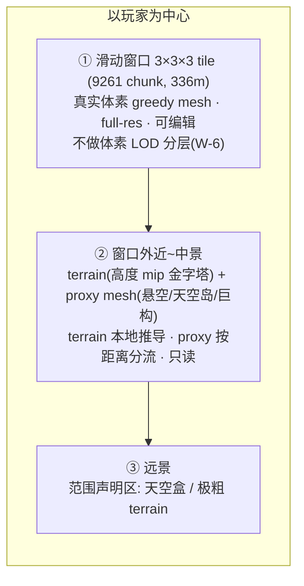

### 6.2 统一链：本地算基底 + offset 修正（**仅静态地形**，M6 收窄）

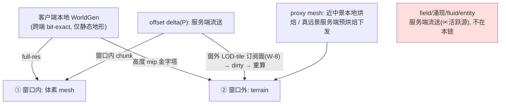

**洞察（收窄后）**：因算法基底跨端确定性，**静态地形**的窗外 terrain 可客户端本地推导（本地算 WorldGen 高度 mip）。但严格区分三类带宽：

| 数据 | 带宽 | 通道 |
|---|---|---|
| 窗外 terrain（WorldGen 静态高度） | **零下载**（本地派生） | 本地 |
| 窗外 **P** 修正（他人建的天空岛/挖的洞） | ∝ 窗外修改量 | **远景 LOD 订阅面（W-8）** |
| 窗外 proxy（远景 3D 巨构） | 近中景本地烘焙（要全 delta）/ **真远景服务端预烘焙下发（∝ proxy 复杂度，KB 级）**（S6） | 混合 |
| field/涌现/fluid/entity | **∝ 活跃源数量，服务端流送** | 不在本链（W-12） |

- **过渡期仲裁（S4）**：bit-exact 未建立（golden fixture parity CI 未绿）期间，**远景一律以服务端 0x6A/0x6B 下发为唯一真值源**，本地派生只在 parity gate 通过后接管，**二者不得同时驱动渲染**（否则两套远景几何抖动）。
- **terrain = 高度 mip 金字塔（S5）**：不是对 `column_height` 按 stride 点采（会混叠/popping），而是每级保 avg/min/max 轮廓；生成成本 ∝ 细分辨率评估，dirty 维护（offset 改 → 标记覆盖的各级 mip cell dirty → 重算）纳入 W-7 observe（mip 重建 ms）。

### 6.3 terrain + proxy mesh 的分工

| 内容类型 | 表达 | 承接 / 带宽 |
|---|---|---|
| 地表高度起伏 | **terrain** 高度 mip 金字塔 | `VoxiaHeightmapMesher` 演进；本地派生零下载 |
| 悬空 / 天空岛 / 巨构 | **proxy mesh** HLOD 风格简化代理 | **近中景**（将进窗口，反正要全 delta）本地烘焙；**真远景**服务端预烘焙简化 proxy 下发（∝ proxy 复杂度，一次 CPU 多端复用，S6） |
| 洞穴 / 深井 | terrain 表达不了内部 → 走近进窗口看真实体素；远景洞口 proxy 近似 | 妥协（§10 W-Q5） |
| 水体 / 流体 | **v1 scope-out**（§5.5 / §9 / W-Q5），不塞进 terrain | — |

> **proxy 的两个豁免（W-Q2 拍板）**：proxy 是 visual-only / 无碰撞 / 不可编辑，故**豁免 M4 浮点 bit-exact**（单源字节或同源本地烘焙，不参与跨端 H 校验）+ **豁免 M5 远景 LOD 写路径雷**（proxy 只存在于带 delta 已落库的 chunk，不依赖未修改 chunk 的 LOD 持久化）。这让 proxy 路线显著减负。

### 6.4 窗口内不分体素分辨率（W-6，S3 修订）

- 窗口 = 玩家附近 **336m 全分辨率可编辑切片**（**非全高度**；可编辑性延伸到全高度是靠**窗口跟随覆盖**，不是窗口本身全高，S3 修正事实混淆）。
- full-res 的真正理由：**窗口内任意格随时可被编辑，需即时一致**——降分辨率会让"编辑只在最细层有效 / 跨分辨率同步"，引入隐藏耦合。
- W-6 **不是"消除耦合"，而是把跨分辨率耦合从多边界收敛到单一窗口边界**。该边界（① ↔ ②）一致性正是 §6.2 的 offset→LOD dirty 契约要维护的（指回 W-8/M1），不是消失了。
- 窗口内只做 **mesh 调度分层**（视锥剔除、距离优先级、occlusion、异步线程池）。**退路**（实测扛不住）：窗口内同心分层（核心 full-res 可编辑、外环降采样只读），非默认。

### 6.5 性能能不能扛（W-7，S9 修订）

- **扛得住前提（显式）**：(1) 窗口内**大面积同质**（all-air/all-solid，2.5D 现状下成立；一旦 W-10 选 B 的 3D 洞穴落地，内部 chunk 变异质、greedy 面数暴涨，9261 全非平凡）；(2) 未修改 chunk **本地推导降带宽**（∝ 修改量）。
- **带宽**：9261 chunk 全量下载 = 50-90MB/窗口（扛不住）；本地推导后 ∝ 修改量（KB/s 级，可行）。
- **observe 量化矩阵（扩充）**：`bytes / encode_ms / mesh_ms / vertex_count / send_queue_bytes` + **有效 mesh chunk 数（非 all-air/all-solid）** + **常驻体素内存 MB**（38M 格 ≈ 38-76MB + 顶点缓冲）+ **顶点缓冲 MB** + **mip 重建 ms**。
- **落地节奏**：先 343 chunk（1 tile）跑通整链，observe 后再决定扩窗节奏。与 W-10 内容维度决策联动。

### 6.6 近/远拼接

- 窗口边界（① ↔ ②）：现有 inner-boundary **skirt**（`VoxiaHeightmapMesher` skirt pass）复用；proxy 锚定 terrain 顶/底避免穿插；skirt 缝隙修复**刚落未实跑验证**（known_gaps），属本稿验证项。
- **过渡迟滞（O1）**：升降级加迟滞带（升级半径 < 降级半径）避免边界 thrash；lease 续租/交接与边界移动显式时序。

### 6.7 客户端运行时工程（整合 sliding-window 文档）

> 整合用户提供的 [`docs/90-obsolete/voxel-far-field/voxel_mmo_sliding_window_architecture.md`](../../90-obsolete/voxel-far-field/voxel_mmo_sliding_window_architecture.md)，补本稿在客户端运行时工程上的空白（尤其 **collision**——v1/v2 完全遗漏）。该文档「L0 真实体素窗口 + L2 远景代理、v1 无 L1」与本稿三态一致；其架构正确性短板（远景编辑可见性无 owner、无 content_version 运维、无浮点 bit-exact、无垂直维度、无动态层）由本稿 W-8~W-13 补齐。

#### 6.7.1 L0 / L2 双层，v1 无 L1（W-14）

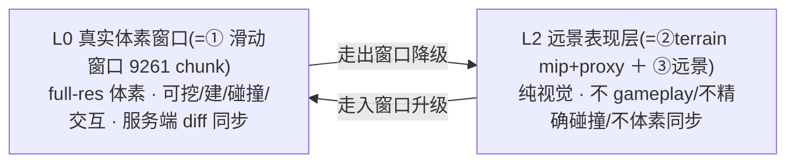

- **采纳「v1 无 L1」**：不引入「L0 与 L2 之间的可碰撞中间体素 LOD 层」。理由（文档 §5）：避免 L0/L1 collision 不一致、L1 mesh 与 L0 voxel 状态不一致、额外 tile 状态机。与 W-6（窗口内不分体素分辨率）一脉相承——分辨率分层只在 L2（纯视觉、不碰撞）。
- L2 的 terrain mip / proxy / impostor 是**纯视觉代理**（§6.3），不承载 gameplay/碰撞。

#### 6.7.2 Collision 与资源四层解耦（W-15，补 v1/v2 遗漏）

v1/v2 只讲渲染、**完全没讲碰撞**。gameplay 需要碰撞，且本项目**服务端权威移动/碰撞是铁律**（AGENTS.md §2）。采纳文档 §12 资源解耦：

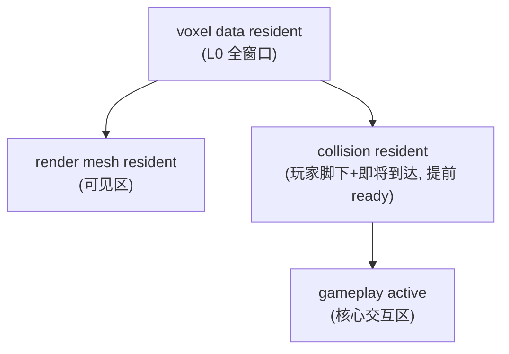

| 区域 | voxel 数据 | 渲染 mesh | 碰撞 | 交互 |
|---|---|---|---|---|
| 脚下+核心区 | ✓ | ✓ | 精确 | ✓ |
| 窗口外圈 | ✓ | ✓ | 预生成/简化 | 通常否 |
| 即将进入方向 | ✓ | 预生成 | **优先生成** | 即将启用 |
| 窗口外（L2） | ✗ | L2 | 无 | ✗ |

- **铁律对齐**：客户端 collision 是**本地物理代理**（本地预测/手感/防穿模），**移动/碰撞权威裁决仍在服务端**（`movement_engine`）；客户端 collision 不可信为真值。
- **核心规则**：玩家脚下与即将到达区域 collision **必须提前 ready**；**不允许玩家进入未完成 collision 的区域**（失败处理见 §6.7.6）。

#### 6.7.3 Tile 生命周期 Hot / Warm / Cold（W-16）

采纳文档 §8，给 W-8 远景订阅面 / S2 窗外缓存一个清晰生命周期：

| 态 | 范围 | 数据 | 订阅/活性 |
|---|---|---|---|
| **Hot** | L0 窗口内 | 完整 voxel + mesh + collision，高频 diff | 近场订阅（`SubscriptionWorker`，known_version 去重） |
| **Warm** | 即将进入/刚离开（grace period） | 保留 voxel/mesh cache，延迟卸载，后台更新 | 远景 LOD-tile 订阅（W-8）保活；缓存带 `chunk_version` watermark（S2） |
| **Cold** | 远离玩家 | 只留 snapshot/diff/L2 proxy，不驻留完整 voxel | 退订；再进入按 W-9 对账权威 `chunk_version` 后加载 |

> Warm 态正是 S2 说的「走出窗口的 offset 缓存」——它必须仍在有续租的远景作用域（W-8）内才允许相信其 offset，否则降级纯 WorldGen 推导并标 stale。

#### 6.7.4 预测加载 + 分阶段异步流水线（W-16）

采纳文档 §6/§10：**不要等跨 tile 才加载**（否则卡顿/掉落/空气墙/rubber-band）。

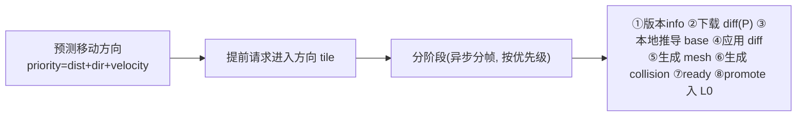

- 加载优先级：前进方向 > 侧向 > 身后 > L2 远景。
- 滑动只新增一片 slab（沿 X 移动 1 tile = 新增 `1×3×3 = 9 tile = 3087 chunk`），异步分帧、按优先级，**不在一帧内完成**。
- 与 §6.6 迟滞带（升级半径 < 降级半径）+ grace period 卸载呼应；与 W-7 observe（`mesh_ms`/`vertex_count`）联动。

#### 6.7.5 Mesh Page 聚合（W-16）

采纳文档 §11：避免「每 chunk 一个 UE component」（9261 component 不可接受）。

```text
Chunk(16³) → Mesh Page(2×2×2 或 4×4×4 chunks) → Tile(7³ chunks)
```

- greedy meshing 在 mesh page 粒度聚合；mesh 生成与 RHI 上传**分帧**。
- mesh page 粒度纳入 W-7 observe（`mesh_ms`/`vertex_count`/component 数）。

#### 6.7.6 失败处理（W-15）

采纳文档 §17：L0 未 ready 时**不放玩家进未完成 collision 区**——临时减速 / 软空气墙 / 雾墙遮挡 / 等 collision ready / **服务端位置纠正**（权威）。网络延迟时：优先前进方向、降远景优先级、保留旧 tile、旧 snapshot 临时显示但**禁止交互**。

> **垂直维度提醒（本稿 §5 保留，文档未覆盖）**：sliding-window 文档的窗口是各向同性 3×3×3，未处理垂直（地下 8km/地上 100km）。预测加载/collision/tile 生命周期须考虑垂直移动（挖竖井下深地、飞天空岛）——加载优先级的「方向」含垂直分量，深地/高空进入也走同一流水线。

---

## 7. 服务端同步链路 + 远景 LOD 订阅面（W-8/M1）+ content_version wire（W-9/M2）

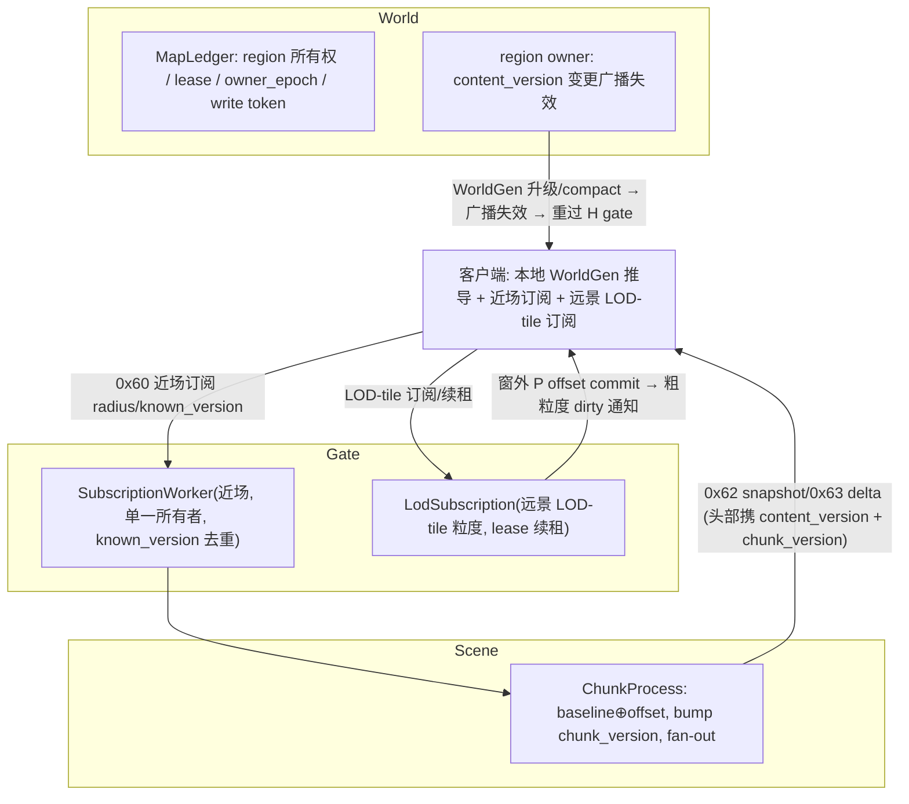

### 7.1 远景 LOD 订阅面（W-8，M1：远景编辑可见性的 owner 与通道）

v1 把「编辑 → 标记 LOD cell dirty → 重算」当作无主动词，**没有契约把"窗外某 chunk 被别人编辑了"送达未订阅它的客户端**——远景区根本没订阅，玩家 A 改了 B 正以远景渲染的 chunk，B 永不刷新（血泪案例反模式被搬到更大面）。M1 加固：

- **远景区 = 有 owner、自维护活性的订阅面**，粒度 LOD-tile（粗于近场 chunk）。两条路线择一（待 §10 实现细化）：
  - **承诺方维护**：服务端按连接活性维护「该客户端正远景渲染哪些 LOD-tile」的 lease，对这些 tile 的 offset commit **fan-out 粗粒度 dirty 通知**（新协议消息）。
  - **依赖方自愈**：客户端对远景 tile 做**周期性 known_version 对账**（拉模式），漏收自愈。
- **只覆盖窗外 P**（D 已随 launcher 包本地，无需流送）。这是 baseline §4.B「窗口平移」行的**扩展**（显式回链），不是新真值通道。
- 走出窗口降级产生的**窗外 offset 缓存**纳入此订阅面（S2）：缓存的 chunk 须仍在有续租的远景作用域内才允许相信其 offset；否则降级为纯 WorldGen 推导并标记「远景 offset 可能 stale」。降级走一次版本对账（记退订时 `chunk_version` 作 watermark，重升级/收带版本 dirty 时去重补差，避免在途 delta 在切换缝隙丢失）。

### 7.2 content_version 运行时维护（W-9，M2：时间性不变量指派 owner）

v1 只在 §12 点名 content_version 是「时间性不变量债」却不指派维护者。M2 加固——写死机制与 owner：

- **wire 携版本**：`0x62 snapshot` / `0x63 delta` 头部增加 `content_version` + 权威 `chunk_version`（只追加不破坏 wire layout，AGENTS.md §2.7）。
- **运行期对账（依赖方自愈）**：客户端本地推导新 chunk 后，对账权威 `chunk_version`（=0 信任本地推导 / >0 拉 snapshot 再渲染）；对不上即触发**硬 resync**（复用现有 `ResyncChunk`，纳入本稿自愈通道）。解决「进场后逐 chunk 本地派生从不再对 H = 零下载零校验」的最坏第三种（依赖方默默假设契约成立、承诺方没维护）。
- **WorldGen 升级/compact（承诺方强制维护）**：服务端切 `content_version` 时，由 **World 层 region owner** 对所有在场会话广播失效、要求重过 H gate（解决「在场会话不重新入场 → 本地基底静默与新真值分叉」）。
- `chunk_version` 跨 compact **全局单调不重置**，避免 `known_version` 回绕。

---

## 8. 客户端三阶段边界（W-3，M2 对账加固）

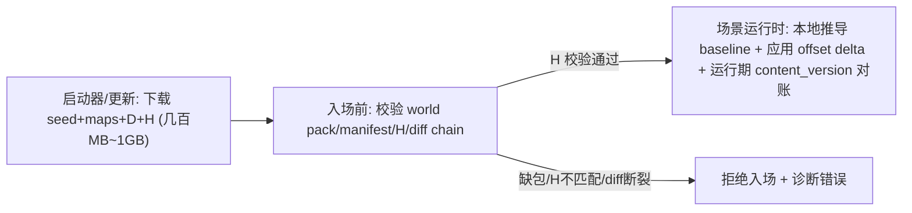

入场/运行时单 chunk 决策（三态拆分，1#4/O1 修订）：

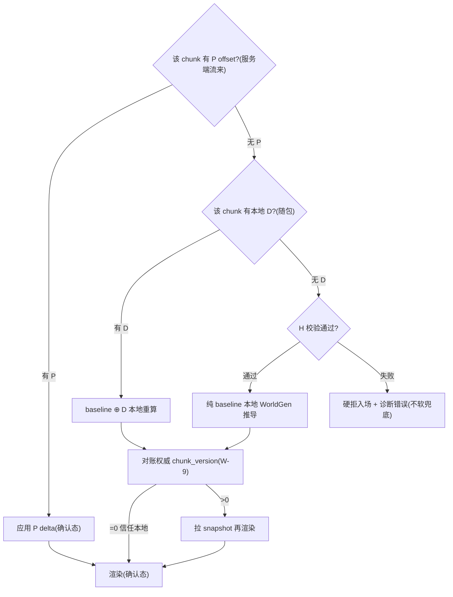

- **W-3**：H 校验失败 = 硬拒，**不允许 untrusted 软兜底**（守 baseline 硬校验铁律）。
- **三态拆分（1#4）**：「有/无 offset」二元拆成「无修改→本地重算 / 有 D→本地 D 重算 / 有 P→服务端流送」三态，区分 D 本地、P 流送。
- 客户端 WorldGen 实现**当前为零**（UE/web/bevy 都没有）——这是 W-1/W-3 最大工作量与最高风险（§8.5）。

## 8.5 WorldGen 跨端确定性规范（W-11，M4：浮点 bit-exact 杀手）

**代码核实**：`world_gen_noise/src/lib.rs` 有三处浮点确定性杀手——`:159 powf(2.2)`（非整数指数，libm/MSVC CRT 不保证末位一致）、`:82/112/125 a+(b-a)*t`（会被 FMA 合并改变舍入）、`:162 round` 到 i64（x.5 边界翻转）。设计把「最难的浮点确定性」绑「最不容错的硬拒入场」——**一个 fixture 样本末位漂移翻转 round 边界，客户端整局进不去（灾难性 brick 而非降级）**。

规范（动手 Step 1 前必须钉死）：

1. **H fixture 哈希对象 = 离散整数输出**（`column_height` 的 i64 / 量化后 chunk 内容），**绝不哈希 raw f64 中间值**——让 `round` 吸收 sub-ULP 漂移。
2. **消除 `powf(2.2)`** 改可移植有理多项式 / 定点近似，并钉进规范。
3. WorldGen 规范**强制 f64、禁 FMA 合并（`-ffp-contract=off`）、禁 x87**；golden fixture **覆盖 `round` 边界附近坐标**。
4. 留 `content_version` + **`worldgen_impl_version` 协商缝**，避免实现微差 = 全员锁门。

> 不解决则 W-1/W-3/§6.2 全链塌。这是把"高风险"升级为"必处理项"（§13）。

---

## 9. 动态层边界与正交半径（W-12/W-13，M6 + 完整性加固）

### 9.1 动态层不在本稿三态覆盖（W-12，M6）

`§6.2` 的「本地算基底 + offset 修正、带宽 ∝ 修改量」**只对静态确定性地形成立**。以下层**必须服务端流送**，不能本地 bit-exact 重算：

| 层 | 性质 | LOD 带宽 | 后续设计 |
|---|---|---|---|
| field / 涌现（黑体发光/烟/电弧/辉光/昼夜光照） | P 驱动连续 derived 态 | ∝ 活跃源数量 | field-LOD（远处熔炉辉光/火山/城市灯火/电网弧光在窗外的表达） |
| fluid / 水体 | 连续 sim | ∝ 活跃水体 | W-Q5 流体分类 |
| 实体 / 其他玩家 / 敌人 | 运行时态 | ∝ 实体数 | entity-AOI（远处玩家/大型敌人 impostor/名牌/简模） |

> 否则窗口边界处远处熔炉辉光、城市灯火、远处玩家与大型敌人全在 336m 硬切消失。本稿三态只管**静态地形**；动态层 LOD 是后续正交设计。

### 9.2 三个正交半径（W-13）

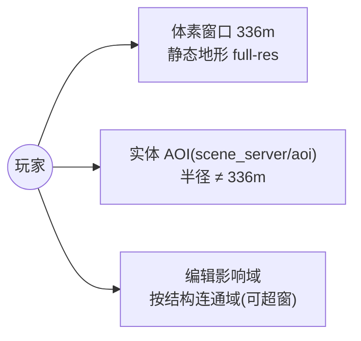

- **体素窗口 ⊥ 实体 AOI**：实体走独立 AOI 半径（`scene_server/aoi/`），几乎必然 ≠336m。实体落脚/碰撞依赖的体素必须随**实体 AOI** 加载（而非体素窗口），避免「远处玩家站在我没加载的地块上」。
- **编辑影响域 ≠ 订阅窗口**：横跨多 tile 的巨构/天空岛只有窗内部分可编辑，但窗内一处编辑对窗外部分有后果（`structural_stress`/`structural_support` 内核需整座结构上下文）。结构性后果按**结构连通域**而非窗口加载相关 chunk（哪怕窗外也临时实例化 `ChunkProcess` 参与裁决）；跨窗大型编辑/prefab 放置鉴权口径：intent 目标可超出当前窗口，按连通域处理。

---

## 10. 迁移顺序（对齐决策稿 §8 七步，M5 修订）

> **W-Q8 拍板（2026-06-30）**：立即**冻结/重定位全量物化管线**（`WorldPackBootstrapper`/shard → 部署期 bulk-seed + 设计师 D 区物化工具）+ **授权 Step1 现在开工**（零架构稿阻塞、最高风险先消）。0x6A/0x6B 服务端流送显式定位为"parity 未绿期过渡唯一真值源"。Step4 瘦身设双闸：须 Step1 bit-exact + Step3 H gate 就位才反转 canonical-only（W-Q1）。

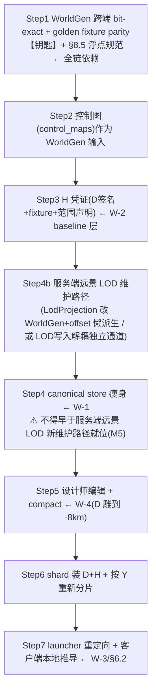

**M5 加固**：W-1 让未修改 chunk 不落 snapshot，会**移除这些 chunk 的 LOD cell 唯一写路径**——代码核实 `lod_projection_cells` 搭车 chunk snapshot 持久化（`chunk_process.ex:4182`），且 `AuthoritativeHeightmap` 缺 cell **报错不兜底**（"missing projection cells are explicit errors, 不得 silently regenerate from noise"）。于是「过渡期保留服务端 0x6A/0x6B 兜底」恰在最被需要时（bit-exact 未建立、客户端本地派生不可信）对原生地形**无数据可发**。

→ **Step4 瘦身不得早于 Step4b（服务端远景 LOD 新维护路径就位）**：`LodProjection` 改为可由 `WorldGen + offset` 懒派生（缺 cell 按需算而非报错，需先 bit-exact），或把 LOD cell 写入从「搭车 snapshot」解耦成「对未修改 chunk 也维护的独立派生通道」。

**Step 1 是一切的根**：没有跨端 bit-exact（含 §8.5 浮点规范），W-1/W-3/§6.2/§7.1 全部塌掉。

---

## 11. W-Q1~W-Q8 拍板结论（2026-06-30 第二轮，9-agent 深挖 + 用户拍板）

> 9 agent 深挖 W-Q1~W-Q8 并揪出**元决策**（两份决策稿对 WorldGen 终局地位结论相反）。用户 2026-06-30 全部拍板。方向已定、参数待 observe/审计的项标注前置。

| # | 拍板结论 | 状态 |
|---|---|---|
| **元决策** | WorldGen 终局地位：**本世界=程序化确定性真值（D-4）+ 未来世界=可插拔/authored（6-28 §C）各管一段**。消解两稿张力——D-4 的 bit-exact 重算/零下载对本图成立；6-28 §C 的"换真实地图"对下一张图成立。 | 已签收 |
| **W-Q6** | **A：v1 锁 2.5D 高度场+材料分层，洞穴/悬空/天空岛/水全归 delta**。否决 in-place B（逐 ULP brick + 9261 同质前提坍塌 + 五项返工）；天然洞穴走 **C**（服务端 genesis 雕刻成冻结 D-delta，客户端契约永远 2.5D）。← 根决策，解锁全部。 | 已拍板 |
| **W-Q8** | **立即冻结/重定位全量物化管线 + Step1 now**：`WorldPackBootstrapper`/shard 重定位为"部署期 bulk-seed + 设计师 D 区物化工具"；0x6A/0x6B 显式定位"parity 未绿期过渡唯一真值源"；Step1（2.5D bit-exact + §8.5 浮点规范 + golden fixture）今天开工（零架构稿阻塞、最高风险先消）；Step4 瘦身设双闸（须 Step1 bit-exact + Step3 H gate 就位才反转 canonical-only）。 | 已拍板·最紧迫 |
| W-Q4 | **control_maps 最小集**（heightmap 形状标量 + material 选择 mask，v1 只 dirt/stone，带版本自描述容器只追加）；**排除材料物性图**（电导/热容/硬度从 material_id 查 MaterialCatalog，不复制成空间图=反正交双真值）。v0 先冻现有 Rust const 作 Step1 起步。 | 已拍板 |
| W-Q5 | **水 v1 scope-out + 预承诺分解**：静态水位=offset 占据 + 活跃流动=后续独立稀疏 sim（settle 回 offset）+ 相变留反应层；**否决 field**（标量扩散≠质量守恒占据输运）。现在钉死窗口/区域边界（ghost-cell 持 settled 水位作 Dirichlet 边界）+ **修基线稿"山川河流"误导措辞**（已落实）。 | 已拍板 |
| W-Q1 | **方向：offset 双层并存** — durable committed events(D+P) 作权威恢复源 + 定期 checkpoint 压实 + ChunkProcess 内存物化视图。分两阶段：先把 durable 真值权威从 snapshot 反转到 event 层（`voxel_outbox` 升格 truth / 或新建 committed_events 表）+ 补受维护 compact（指派 owner+活性，否则重蹈 lease 静默失效），再做 Step4 瘦身。**参数前置：replay 完整性审计**（outbox payload 顺序重放能否 bit-exact 重建 Storage；相对算子/env 派生 delta 是否污染日志）+ compact 阈值 observe。Step1 未绿前 checkpoint 强制作 replay root。 | 方向已拍·参数待审计 |
| W-Q3 | **方向：可配分级半径 + 起点强制 343**。9261 = 受 W-Q6=A 制约的 prod 上限（非既成，Step1/4 落地前 ~1.45GB/窗口物理不可达）；三端半径统一 config + 服务端 cap per-deployment。**参数前置：先打满 343 闭环 §6.5 observe 矩阵**（mesh_ms p99/常驻 MB/有效 mesh chunk 线性度）再逐级 ratchet 3→5→7→10。 | 方向已拍·闸门待 observe |
| W-Q7 | **方向：混合** — commit 驱动 `:pg` push 粗粒度 dirty（承诺方维护）+ 复用 0x6A/0x6B pull 数据 + 15-30s 慢 watermark 对账（依赖方自愈）；成员活性用 process monitor + 移动 reconcile（不引入近场重 lease 续租）；新增 **0x6D 订阅 / 0x6E tile 失效**，0x6B 追加 per-tile content_version。**前置：W-9 watermark 语义先定（与 W-Q1 共设计）+ Step4b 数据腿先落地**（不得早于 Step4b）。 | 方向已拍·依赖 W-9+Step4b |
| W-Q2 | **方向：距离分流，边界锚"窗口预取半径"（非魔法米数）**：窗口=真网格无 proxy；预取/中景环=客户端 `VoxiaGreedyMesher` 对预取 delta 出 visual-only 网格（与进窗口真体素同源，交接无缝）；真远景=服务端预烘 KB 级 proxy 经 W-Q7 订阅面下发，dirty owner=W-Q7 owner。**proxy 豁免 M4 浮点 bit-exact（单源/同源本地烘）+ 豁免 M5 写路径雷（只存在于带 delta 已落库 chunk）**。**参数前置：用远景巨构 fixture 量化"本地烘全 delta 字节 vs 服务端 proxy 字节"交叉点**；wire 下游于 W-Q7。 | 方向已拍·阈值待量化·wire 待 W-Q7 |

### 11.1 共享上游（必须尽早接线）
- **Step1 跨端 bit-exact**：W-Q1 replay 根 / W-Q3 扩窗带宽前提 / W-Q7 远景兴趣集塌缩开关 / W-Q4 fixture 哈希对象 的共同钥匙。零架构稿阻塞，已授权 now（W-Q8）。
- **W-9 content_version（跨 compact 单调）**：W-Q1（版本单调）与 W-Q7（dirty/pull/对账三方 watermark）共享，必须统一一套版本语义（per-tile vs per-region 聚合），与 W-Q1/W-Q7 共设计，否则 `known_version` 回绕/分叉。

---

## 12. 测试矩阵

| 测试 | 验证目标 | 入口 |
|---|---|---|
| WorldGen 跨端 bit-exact parity | Rust NIF vs UE C++ 同 `(seed,maps,coord)` 离散整数输出字节级一致；**覆盖 round 边界坐标**（M4） | golden fixture（`apps/scene_server/priv/fixtures/voxel/*.golden`，仅埋桩） |
| 浮点确定性 | 禁 FMA/x87、消 powf(2.2) 后 fixture 全过；`worldgen_impl_version` 协商 | parity CI |
| 单 chunk offset 恢复 | `baseline ⊕ D ⊕ P = truth`；删 snapshot 重算+H 恢复 | `ChunkProcess` 重算路径 |
| chunk_version ⊥ H 边界 | **瘦身后** chunk_version 只存已修改 chunk；baseline 走 H 不逐 chunk hash | `ChunkSnapshotStore` 覆盖统计（注：Step4 后验收项，S8） |
| content_version 运行期对账 | wire 携 content_version+chunk_version；对不上硬 resync；升级广播失效 | `ResyncChunk` + region owner 广播（W-9） |
| 远景 LOD 订阅面 | 窗外他人 P 编辑 → dirty 送达 → proxy/terrain 刷新；窗外缓存 stale 标记 | LOD-tile 订阅 + observe（W-8） |
| 垂直 7000 chunk bounds | y=-750..+6249 紧凑覆盖（不枚举 294 亿） | `WorldPackAuthorityCoverage` 扩展 |
| 深地材料异质零存储 | -12km..-8km WorldGen 材料分层 fixture 抽样、零 delta；挖后摘出 | H 体积/offset 数 |
| 客户端本地推导入场 | 三态（无修改/有 D/有 P）+ H 失败硬拒 | `LoadTerrainBaselineWindow` + 入场 gate |
| 窗口内 full-res mesh | 343 chunk greedy mesh + observe（含有效 mesh chunk 数/内存 MB/顶点 MB） | Voxia stdio CLI + observe（S9） |
| 窗外 terrain mip + proxy | 高度 mip 金字塔（avg/min/max）；proxy 近中景本地/真远景下发；offset dirty 重算 | Voxia LOD rebuild + observe |
| 过渡期远景单真值源 | parity CI 未绿期间只用服务端下发，本地派生不并存 | parity gate（S4） |
| 动态层不在三态 | field/entity 远景表达走独立通道（非本稿） | 标记 scope（W-12） |
| 近/远 skirt 缝隙 | 窗口边界无破洞 | UE Automation + debug overlay |

---

## 13. 风险与纪律

### 13.1 必守纪律
1. **chunk_version 不得扩成全世界静态 hash 数组**（W-2 红线）。
2. **窗口内不引入体素分辨率分层**（W-6）。
3. **H 校验失败硬拒、不软兜底**（W-3）。
4. **content_version 跨端一致性必须有 owner + 机制**（W-9），不止点名（M2）。
5. **远景 LOD 编辑可见性必须有 owner + 传输通道**（W-8），不停在无主"标记 dirty"（M1）。
6. **「本地推导∝修改量」只对静态地形**（W-12），动态层服务端流送（M6）。
7. **Step4 瘦身不得早于服务端远景 LOD 新维护路径**（M5）。
8. **不预设性能、observe 驱动扩窗**（W-7）。

### 13.2 主要风险
| 风险 | 等级 | 缓解 |
|---|---|---|
| **浮点 bit-exact 翻转 round 边界 → 灾难性 brick 入场** | **高（必处理）** | §8.5 W-11：哈希离散整数、消 powf、禁 FMA/x87、impl_version 协商缝 |
| 客户端 WorldGen 从零实现（UE C++） | 高 | 移植 + 跨端 CI parity gate |
| WorldGen 2.5D vs D-9/D-11 3D 矛盾 | 高 | W-10 锁定 v1=2.5D+材料分层，3D 归 delta，显式签收收窄 |
| 远景 LOD 订阅面 owner 缺位 → 远景编辑不可见 | 高 | W-8 显式订阅面 + dirty 通道 |
| content_version 运行期分叉 | 高 | W-9 wire 携版本 + 硬 resync + 广播失效 |
| W-1 瘦身切断远景 LOD 写路径 | 中 | M5 迁移顺序 Step4b 前置 |
| 9261 chunk 性能（3D 化后） | 中 | W-7 observe + 内存/顶点量化 |
| proxy 本地烘焙远景带宽反例 | 中 | S6 按距离分流 |
| 窗外 offset 缓存 stale + 降级竞态 | 中 | S2 纳入订阅面 + 版本对账 watermark |

---

## 14. 评审加固记录（v1 → v2）

| 评审项 | 加固 |
|---|---|
| M1 远景 LOD 订阅面无 owner/通道 | → §7.1 W-8：LOD-tile 订阅面 + lease + dirty 通道，回链 §4.B 只覆盖窗外 P |
| M2 content_version 运行时无维护 | → §7.2 W-9：wire 携版本 + 硬 resync + region owner 广播失效；chunk_version 跨 compact 单调 |
| M3 baseline 内容维度未锁定（2.5D vs 3D） | → §5.5 W-10：v1 锁 2.5D+材料分层，3D 归 delta，显式签收 D-9/D-11 收窄；§5.2 深地材料异质保留 -12km、删"基岩范围声明"与"单位调和"措辞 |
| M4 浮点 bit-exact 杀手 | → §8.5 W-11：哈希离散整数、消 powf(2.2)、禁 FMA/x87、impl_version 协商；§13 升级为必处理 |
| M5 瘦身切断远景 LOD 写路径 | → §10 Step4b 前置于 Step4 |
| M6 ∝修改量误当普适律 | → §1.3/§6.2 收窄；§9.1 W-12 动态层边界 |
| S1 §5.2 "逐 chunk hash" | → 改"fixture 抽样校验 + D 签名（非 per-chunk hash）" |
| S2 窗外缓存 stale + 降级竞态 | → §7.1 纳入订阅面 + watermark 对账 |
| S3 W-6 窗口≠全高度 / 消除耦合 | → §6.4 改"336m 切片 + 收敛边界数" |
| S4 过渡期双真值源无仲裁 | → §6.2 parity 未绿期只用服务端下发 |
| S5/S6 mip 混叠 / proxy 带宽反例 | → §6.2/§6.3 高度 mip 金字塔 + proxy 距离分流 |
| S7/S8 offset 存储/版本现状 vs 目标态 | → §3.2/§4 围栏复用+offset 新建；∝修改量标 Step4 目标态 |
| S9 性能前提 + 内存 | → §6.5 同质前提 + observe 加内存/顶点/有效 mesh 数 |
| 实体/结构/水 | → §9.2 W-13 三正交半径；§5.5/W-Q5 水体 scope-out |

---

## 15. 进度日志

- `2026-06-29`（v1）：设计稿落档。承接 6-29 baseline 边界决策稿。拍板 W-1~W-7（用户 4 问）。
- `2026-06-30`（v2）：5 视角对抗评审加固。闭合 6 must_fix（M1 远景订阅面 owner / M2 content_version 运行时维护 / M3 baseline 内容维度锁定 2.5D+材料分层、3D 归 delta / M4 浮点 bit-exact 规范 / M5 瘦身-远景写路径迁移顺序 / M6 动态层边界）+ 13 medium。新增 W-8~W-13。关键修正：① WorldGen 现状是 2.5D 列高度（非 3D），洞穴/悬空/水归 delta，显式签收 D-9/D-11 落地口径收窄；② 远景与 content_version 是两块「点名未维护」的时间性不变量债，已指派 owner+机制；③ ∝修改量只对静态地形，动态层（field/entity/fluid）服务端流送、不在三态。下一步：Step 1 WorldGen 跨端 bit-exact parity（含 §8.5 浮点规范）+ 343 chunk 窗口 observe 量化。
- `2026-06-30`（v3）：整合用户提供的 sliding-window 文档，补客户端运行时工程层（§6.7 + W-14~16）：L0/L2 双层 v1 无 L1、**collision 资源四层解耦（补 v1/v2 渲染-only 遗漏）**、Hot/Warm/Cold tile 生命周期、预测加载+分阶段流水线、mesh page 聚合、失败处理。文档架构正确性短板（远景编辑可见性无 owner、无 content_version 运维、无浮点 bit-exact、无垂直维度、无动态层）由本稿 W-8~W-13 覆盖；并补「垂直维度」提醒（文档窗口各向同性未处理地下8km/地上100km）。
- `2026-06-30`（第二轮拍板）：9-agent 深挖 W-Q1~W-Q8 + 揪出元决策（D-4 程序化 vs 6-28 §C authored 两稿相反），用户全部拍板（见 §11）。元决策签收「本世界程序化 + 未来 authored 各管一段」；**W-Q6=A**（2.5D 锁定、3D 归 delta、否决 in-place B、天然洞穴走 C）解锁全局；**W-Q8 立即冻结全量物化 + Step1 now**（最紧迫）；W-Q4 最小集排物性图、W-Q5 水 scope-out、W-Q1 offset 双层、W-Q3 起点 343 可配、W-Q7 远景混合订阅面（新增 0x6D/0x6E）、W-Q2 proxy 距离分流豁免 M4/M5。下一步：Step1（WorldGen 2.5D 跨端 bit-exact + §8.5 浮点规范 + golden fixture）开工 + 冻结全量物化管线。

---

## 16. 证据源

- [`docs/30-reference/protocol/2026-06-29-voxel-baseline-streaming-boundary.md`](2026-06-29-voxel-baseline-streaming-boundary.md) — baseline 形态/三边界/H 凭证（D-1~D-14）
- [`docs/00-current-truth/design/voxel/README.md`](../../00-current-truth/design/voxel/README.md) — 体素真值/三阶段边界/tile 预算
- [`docs/00-current-truth/design/client/streaming-lod.md`](../../00-current-truth/design/client/streaming-lod.md) — 近/远渲染、heightmap LOD
- [`apps/scene_server/lib/scene_server/voxel/chunk_process.ex`](../../../apps/scene_server/lib/scene_server/voxel/chunk_process.ex) — chunk truth、`bump_chunk_version`（:4280）、durable-before-ack、`lod_projection_cells` 搭车（:4182）
- [`apps/data_service/lib/data_service/voxel/chunk_snapshot_store.ex`](../../../apps/data_service/lib/data_service/voxel/chunk_snapshot_store.ex) — canonical CAS（chunk_version 单调）
- [`apps/gate_server/lib/gate_server/voxel/subscription_worker.ex`](../../../apps/gate_server/lib/gate_server/voxel/subscription_worker.ex) — 近场订阅单一所有者、known_version 去重
- [`apps/scene_server/native/world_gen_noise/src/lib.rs`](../../../apps/scene_server/native/world_gen_noise/src/lib.rs) — WorldGen 噪声（2.5D 列高度；浮点杀手 :159/:82/:112/:125/:162，待 §8.5 规范化）
- [`apps/scene_server/lib/scene_server/voxel/authoritative_heightmap.ex`](../../../apps/scene_server/lib/scene_server/voxel/authoritative_heightmap.ex) — 远景 LOD 从权威体素派生（缺 cell 报错不兜底）
- [`apps/scene_server/lib/scene_server/aoi/`](../../../apps/scene_server/lib/scene_server/aoi) — 实体 AOI（W-13 正交半径）
- [`apps/mmo_contracts/lib/mmo_contracts/world_pack_index.ex`](../../../apps/mmo_contracts/lib/mmo_contracts/world_pack_index.ex) — shard grid / footer-table（重新定位装 D+H）
- `clients/Voxia/Source/Voxia/Voxel/VoxiaGreedyMesher.cpp` — 近场体素 greedy mesh
- `clients/Voxia/Source/Voxia/Voxel/VoxiaHeightmapMesher.cpp` — 远景 2.5D heightmap + skirt（演进为 terrain mip + proxy）
- [`docs/90-obsolete/voxel-far-field/voxel_mmo_sliding_window_architecture.md`](../../90-obsolete/voxel-far-field/voxel_mmo_sliding_window_architecture.md) — 用户提供的滑动窗口最小可行设计（L0/L2 双层、Hot/Warm/Cold、预测加载、mesh page、collision 分层、失败处理）；客户端工程层整合进 §6.7
- `apps/scene_server/native/movement_engine/` — 服务端权威移动/碰撞（W-15：客户端 collision 仅本地代理）
