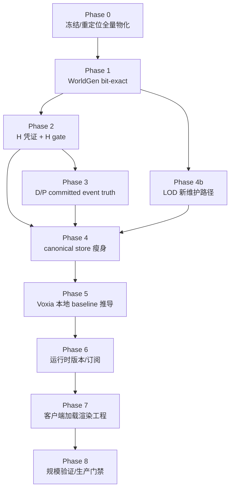

# 2026-06-30 体素生成、流送与客户端加载渲染实施计划（历史）

> ⚠️ **本文已失效**：其“客户端通过 H gate 后本地推导 confirmed baseline / 跨端 bit-exact WorldGen”核心路线已被 snapshot-only 投影路线关闭；H、H gate、canonical、checkpoint 等术语定义仍可作历史参考。现行数据源裁决见 [`2026-07-06-projection-route-final-decision.md`](../../30-reference/contracts/2026-07-06-projection-route-final-decision.md)，当前 Voxia 实施见 [`2026-07-12-pure-3d-voxel-shell-migration.md`](../../10-active/voxel-far-field/2026-07-12-pure-3d-voxel-shell-migration.md)。

> 本文是 `2026-06-29-voxel-baseline-streaming-boundary.md` 与
> `2026-06-29-voxel-sync-window-and-render-design.md` 的执行计划。它把已经拍板的
> “确定性 WorldGen + 设计师 delta D + 玩家 delta P + 轻量 H” 拆成可验收阶段。
> 当前目标不是继续跑完整 32km 全量 chunk payload，而是把全量物化过渡路线收束到
> “部署期 bulk-seed / 设计师 D 区工具”，并逐步迁移到 storage 与 bandwidth 都按修改量增长的架构。

## 目标

把体素世界从当前“WorldPackBootstrapper/shard 装全量 chunk payload”的过渡形态，迁移为：

```text
world_current = deterministic WorldGen(seed, control_maps, coord)
              + D 设计师 committed delta
              + P 玩家 committed delta
              + checkpoint / compact 高水位
```

客户端 Voxia 在通过 H gate 后本地推导静态 baseline，只消费服务端权威 P delta、snapshot/resync
和动态层流送；服务端 canonical truth 只保存不可重算的 committed events、checkpoint 和凭证。

## 非目标

- 不在本计划里把 field / fluid / entity 动态层改成本地推导。动态层必须继续服务端流送。
- 不把真实 32km 全量 `.vxpack` chunk payload 作为最终交付目标。
- 不在 H gate / WorldGen bit-exact 未完成前开启 canonical store 瘦身。
- 不把 runtime `ChunkSnapshot`、resync 或客户端缓存作为 baseline 缺失兜底。

## 名词解释

| 名词 | 含义 | 边界 |
| --- | --- | --- |
| WorldGen | 由 `seed + control_maps + coord` 决定的确定性世界生成函数。v1 锁定为 2.5D 高度场 + 材料分层，洞穴、天空岛、巨构、水体归 delta。 | 必须跨 Rust NIF 与 Voxia C++ bit-exact；否则客户端不能本地推导 confirmed baseline。 |
| control_maps | WorldGen 的控制图输入，例如高度形状标量、biome/material mask。 | v1 最小集不复制材料物性图；电导、热容、硬度等从 MaterialCatalog 查，不建第二真值。 |
| D | Designer delta。开服前设计师通过同一条服务端权威 commit 路径产生的已提交体素事件，冻结进 baseline 包。 | 客户端随 launcher 包持有；可参与本地 baseline 重算。 |
| P | Player delta。开服后玩家产生的已提交体素事件。 | 服务端 canonical truth；客户端只消费流送来的确认结果，不长期持久化为权威。 |
| offset | 本计划里指 committed delta（D 或 P）相对 WorldGen baseline 的修正，不是文件 byte offset。 | `baseline ⊕ D ⊕ P` 才是 chunk 当前确认态。 |
| H | Hash credential / baseline 凭证。当前拍板形态是 D merkle root 签名 + golden fixture + 范围声明，不是 per chunk hash 数组。 | 用来证明 D 完整、WorldGen 实现一致、同质范围声明可信；目标体积是 KB-MB，不是几十 GB。 |
| H gate | baseline 入场门禁。客户端本地包、content_version、WorldGen fixture、D 签名、范围声明和 diff chain 都通过后，才允许进入 Gate/Scene。 | 失败必须硬拒并返回诊断错误；禁止用 runtime snapshot/resync 兜底。 |
| golden fixture | 服务端发布的一组 `(coord, expected_hash/output)` 样本，用于验证客户端 WorldGen 与服务端 bit-exact。 | 哈希对象必须是离散整数输出或量化 chunk 内容，不哈希 raw float 中间值。 |
| 范围声明 | 对高空空气、同质材料层等大范围同质区域的压缩声明，例如“这个范围的 baseline hash 都等于 empty chunk”。 | 发生 D/P 修改后，被修改区域从范围声明中摘出，走 delta。 |
| content_version | baseline 内容版本，覆盖 seed、control_maps、D、H、WorldGen 实现版本和 compact 高水位。 | 在场会话遇到服务端 content_version 变化必须重新过 H gate 或硬 resync。 |
| worldgen_impl_version | WorldGen 实现版本，用来避免 Rust/C++ 算法微差导致 H gate 静默分叉。 | 应进入 manifest / fixture / 本地校验报告。 |
| canonical | “服务端权威持久事实”的形容词。canonical store / canonical event log / canonical checkpoint 都表示 DataService 或等价持久层里的权威数据。 | 客户端缓存、运行时 hot cache、LOD projection 都不是 canonical truth。 |
| canonical chunk snapshot | 当前过渡实现中的全量 chunk 持久快照。长期只保留为 checkpoint、兼容 materialized view 或迁移工具输出，不再要求未修改 chunk 全量落库。 | 不能和 committed event log 混淆；snapshot 损坏如果无 event/checkpoint 可重建链，就是权威数据损坏。 |
| committed voxel event | 服务端裁决并 durable 后的体素事实事件，不是客户端原始 intent。 | ACK 给玩家前必须持久化 event、事务结果或等价 checkpoint。 |
| checkpoint / compact | 把旧 snapshot + 多个 committed events 压成新的 world snapshot，并记录 event high-watermark。 | 用于控制 replay 成本；checkpoint 验证完成前不能丢弃被覆盖 events。 |
| runtime materialized view | 从 checkpoint + events 或 WorldGen + D/P 派生出的运行时读布局，例如 ChunkProcess hot truth。 | 可删除重建；不能成为唯一不可恢复事实。 |
| LOD projection | 从权威体素 truth 派生的远景 height/material projection，当前由 `LodHeightmapStore` 保存。 | 是 derived store；缺权威 projection cell 要显式失败，不能临时重跑噪声伪造。 |
| WorldPackIndex | 当前已有的 compact index / coverage 契约工具，可证明范围、count、shard grid 和窗口规划。 | 目标态复用机制，但校验对象从全量 payload 改为 D/H/合成 hash。 |
| `.vxpack` | 当前过渡路线中的随机访问 shard 文件，footer table 支持按 local coord 读取 payload。 | 目标态可复用 footer-table 机制装 D 分区、H 分区或 proxy payload，不再装全世界合成 chunk。 |
| active/editable window | 客户端当前完整可编辑近场窗口。当前 debug 是 radius=3 chunks，即 `7x7x7=343` chunks；生产预算目标是 `3x3x3 tiles=9261` chunks。 | 运行时只加载玩家附近窗口，不把完整 32km 世界一次性加载进客户端。 |
| L0 / L2 | L0 是真实体素窗口，full-res、可编辑、有碰撞；L2 是窗外 terrain mip + proxy + 远景，纯视觉。 | v1 不引入可碰撞中间体素 LOD 层。 |
| 0x62 / 0x63 / 0x68 / 0x69 | `ChunkSnapshot` / `ChunkDelta` / `VoxelIntentResult` / `ChunkInvalidate`。 | Voxia confirmed voxel store 只吃这些服务端权威消息和本地 H gate 后的 baseline seed。 |
| 0x6A / 0x6B | 远景 heightmap request / response。 | parity 未绿期间仍是远景过渡唯一真值源；长期改为 WorldGen+offset 派生或远景订阅面。 |

## 总体依赖



硬依赖：

- Phase 4 不得早于 Phase 1、Phase 2、Phase 3、Phase 4b。
- Phase 5 可以先做 reader / CLI / debug shell，但 confirmed rendering 接管必须等 Phase 1 + Phase 2 通过。
- 0x6A/0x6B 在 Phase 1 未绿前继续是远景过渡真值源，不能和客户端本地远景同时驱动渲染。

## 执行待办列表

当前按以下顺序推进；`2026-06-30` 本轮只执行第 1 项，并停在第 2 项之前等待世界生成算法输入。

| 顺序 | 阶段 | 状态 | 停止条件 |
| --- | --- | --- | --- |
| 1 | Phase 0：冻结并重定位全量物化管线 | 已执行本轮门禁补强 | partial release、缺 shard、缺 coverage、world_diff fallback 都不得变成 ready / scene entry。 |
| 2 | Phase 1：WorldGen 跨端 bit-exact | 设计已拍板，待实现 | 按 WorldGen v1 设计先做 fixed-point / fixture / parity；未通过前不新增 H gate 或客户端本地 baseline 推导。 |
| 3 | Phase 2：H 凭证与 H gate | 未开始 | 依赖 Phase 1 fixture 与 `worldgen_impl_version`。 |
| 4 | Phase 3：D/P committed event truth 与 checkpoint | 未开始 | 需要先审计现有 edit/outbox/snapshot 事件链。 |
| 5 | Phase 4b：远景 LOD 新维护路径 | 未开始 | 需要明确从 WorldGen+D/P 派生还是独立 projection 通道。 |
| 6 | Phase 4：canonical store 瘦身与懒物化 | 未开始 | 依赖 Phase 1/2/3/4b。 |
| 7 | Phase 5：Voxia 本地 baseline 推导与窗口 seed | 未开始 | H gate 通过前只能做 reader/CLI/debug shell。 |
| 8 | Phase 6：运行时版本、订阅与 resync | 未开始 | 需要协议追加字段和 parity 验收。 |
| 9 | Phase 7：Voxia 加载渲染工程 | 未开始 | 需要窗口 seed 与运行时订阅版本对齐。 |
| 10 | Phase 8：规模验证与生产门禁 | 未开始 | 需要 Phase 1-7 的结构化 observe 产物。 |

## Phase 0：冻结并重定位全量物化管线

**目标**：阻止旧的 full payload 思路继续扩大，同时保留已有 verifier、coverage、footer random access 的价值。

**功能**

- 将 `WorldPackBootstrapper` / `WorldPackMaterializer` / `.vxpack` release 路线明确标注为：
  - dev / bounded probe；
  - 部署期 bulk-seed；
  - 设计师 D 区物化工具；
  - verifier / coverage 机制复用对象。
- 强化 “partial 不可 ready” 规则：bounded batch、缺 shard、缺 canonical coverage、空 DB page 都不能发布 `scene_entry_allowed=true`。
- 将 world_diff 的完整 baseline fallback 保持关闭：`world_pack_index_v1` 场景下只允许 world_diff 表示 baseline 后的 runtime diff。

**主要文件**

- `apps/world_server/lib/world_server/voxel/world_pack_bootstrapper.ex`
- `apps/world_server/lib/world_server/voxel/world_pack_materializer.ex`
- `apps/world_server/lib/world_server/voxel/world_pack_release_verifier.ex`
- `apps/world_server/lib/world_server/voxel/world_pack_authority_coverage.ex`
- `apps/auth_server/test/auth_server_web/controllers/voxel_world_manifest_controller_test.exs`
- `docs/00-current-truth/impl/2026-06-29-world-pack-streaming-handoff.md`

**验收**

- `MIX_ENV=test mix test apps/world_server/test/world_server/voxel/world_pack_release_verifier_test.exs --no-start`
- `MIX_ENV=test mix test apps/world_server/test/world_server/voxel/world_pack_authority_coverage_test.exs --no-start`
- `MIX_ENV=test mix test apps/world_server/test/world_server/voxel/world_pack_artifact_builder_test.exs --no-start`
- `MIX_ENV=test mix test apps/auth_server/test/auth_server_web/controllers/voxel_world_manifest_controller_test.exs --no-start`
- 缺完整 full pack 时 `scripts/world_pack_release_verify.exs` 返回非零，且 observe 写明 `missing_shard_count`。

**2026-06-30 执行记录**

- 已核对 `WorldPackBootstrapper.materialize_once/1`：默认仍是部署期/启动期批量物化入口，且 32km 全范围会先被 `max_chunks` 拦截，不进入逐 chunk 写入。
- 已核对 `WorldPackArtifactBuilder.build_release/2`：完整 shard grid 才构建 manifest 并返回 `status: :ready`；`max_shards` 或显式 `shard_coords` 的局部构建只能返回 `status: :partial`。
- 已补测试 `explicit release shard selection stays partial until the full grid is built`，防止后续把显式 shard 子集误发布成 ready manifest。
- 本阶段只固定旧全量物化的边界与可验证证据，不开始 Phase 1 的 WorldGen 算法设计。

## Phase 1：WorldGen 跨端 bit-exact

**目标**：让服务端和 Voxia 对同一 `(seed, control_maps, coord, worldgen_impl_version)` 生成同一离散结果。

**功能**

- 固化 v1 WorldGen 输出：2.5D `column_height` + material/depth 分层 + 稀疏矿脉 replacement + 量化 chunk 内容。
- 天然洞穴、水体、aquifer、天空岛、巨构、遗迹不进入 WorldGen v1 纯函数，先由 genesis pass 或设计师流程生成 committed D-delta。
- 移除或规范浮点不稳定点：FMA、x87、`powf`、round 边界、不同平台 libm 行为。
- 新增 golden fixture 生成器与 fixture 校验器。
- Voxia 增加 C++ WorldGen v1 实现或绑定层，用 AutomationTest 对服务端 fixture。
- manifest / baseline snapshot 暴露 `worldgen_impl_version`。

**主要文件**

- [`2026-06-30-worldgen-v1-deterministic-terrain-design.md`](2026-06-30-worldgen-v1-deterministic-terrain-design.md)
- `apps/scene_server/native/world_gen_noise/src/lib.rs`
- `apps/scene_server/priv/fixtures/voxel/`
- `apps/scene_server/test/scene_server/voxel/world_gen_*_test.exs`
- `clients/Voxia/Source/Voxia/Voxel/`
- `clients/Voxia/Source/Voxia/Net/VoxiaTerrainBaselinePackIndexAutomationTest.cpp`
- `apps/mmo_contracts/lib/mmo_contracts/`

**验收**

- 服务端 fixture 生成和读取测试通过。
- UE Automation `Voxia.Net.TerrainBaselinePackIndex` 或新增 `Voxia.Voxel.WorldGenParity` 通过。
- fixture 覆盖 round 边界、高低海拔、深地材料层、空区和 chunk 边界。
- 任何 worldgen version 不匹配都返回明确错误，不进入后续 baseline ready。

## Phase 2：H 凭证与 H gate

**目标**：把入场前 baseline 校验从“完整 chunk payload 是否存在”迁移为“配方 + D + H 是否可信”。

**功能**

- 定义 `baseline_manifest_v2`：
  - `content_version`
  - `worldgen_impl_version`
  - `seed`
  - `control_maps` 摘要
  - `D` merkle root / 签名 / 分区描述
  - golden fixture
  - range declarations
  - checkpoint high-watermark
- 服务端 auth manifest 输出 H gate 所需字段和失败原因。
- Voxia `RequestTerrainBaseline()` 增加 H gate 状态机：
  - `downloading_recipe`
  - `verifying_h`
  - `h_gate_ready`
  - `h_gate_failed`
- CLI / observe 输出 H gate 细节：哪个 fixture 失败、签名失败、范围声明失败、版本不匹配。

**主要文件**

- `apps/mmo_contracts/lib/mmo_contracts/world_pack_index.ex`
- `apps/mmo_contracts/lib/mmo_contracts/` 下新增 baseline credential 模块
- `apps/auth_server/lib/auth_server_web/controllers/voxel_world_manifest_controller.ex`
- `clients/Voxia/Source/Voxia/Net/VoxiaTransportSubsystem.*`
- `clients/Voxia/Source/Voxia/Net/VoxiaTerrainBaselinePackIndex.*`
- `clients/Voxia/Source/Voxia/Debug/VoxiaDebugCliSubsystem.*`

**验收**

- 本地 D 被篡改时 H gate 失败，且不会连接 Gate / 进入 Scene。
- WorldGen fixture mismatch 时 H gate 失败。
- content_version 只相等但 H 不通过时仍失败。
- `TerrainBaselineSnapshot()` 能报告 H gate 的完整状态和 reject reason。

## Phase 3：D/P committed event truth 与 checkpoint

**目标**：把 durable truth 从“全量 chunk snapshot”反转为“committed voxel events + checkpoint”。

**功能**

- 审计现有 `voxel_outbox` / command log / snapshot 路径，确认哪些事件可 replay 成 `Storage`。
- 新建或升格 `committed_voxel_events`：
  - `logical_scene_id`
  - `chunk_coord`
  - `event_seq`
  - `content_version`
  - `event_kind`
  - canonical payload
  - actor / transaction / lease metadata
  - payload_hash
- `ChunkProcess` ACK 前必须先 durable event 或等价 checkpoint。
- 实现 replay 工具：从 checkpoint + events 生成 chunk materialized storage，并校验 replay root。
- 实现 periodic compact：
  - 产生 checkpoint snapshot；
  - 记录 high-watermark；
  - checkpoint 验证完成后才允许归档旧 events。

**主要文件**

- `apps/data_service/priv/repo/migrations/`
- `apps/data_service/lib/data_service/voxel/`
- `apps/scene_server/lib/scene_server/voxel/chunk_process.ex`
- `apps/scene_server/lib/scene_server/voxel/storage.ex`
- `apps/world_server/lib/world_server/voxel/`
- `scripts/` 下新增 replay / compact probe

**验收**

- 删除 runtime materialized layout 后，可从 checkpoint + events 重建同一 chunk hash。
- ACK 已返回的 voxel edit 在进程崩溃后仍可 replay 出来。
- replay 工具输出 `.demo/observe/voxel-event-replay/`，包含 event count、checkpoint seq、root hash。
- compact 前后 `chunk_version` / `content_version` 不回绕，客户端 known_version 不分叉。

## Phase 4b：远景 LOD 新维护路径

**目标**：在 canonical store 瘦身前，保证未修改 chunk 不落 snapshot 后远景仍有权威数据来源。

**功能**

二选一或分阶段组合：

- 路线 A：`LodProjection` 从 `WorldGen + D/P offset` 懒派生，缺 projection cell 时按权威配方生成并持久化 derived row。
- 路线 B：把 LOD row 写入从 `ChunkSnapshotStore.put_snapshot` 解耦，建立独立派生通道，对未修改 chunk 也能维护 projection。

共同要求：

- 0x6A 缺 projection 时仍不能回到运行时噪声兜底。
- projection row 带 `content_version` / source high-watermark。
- P offset commit 标记覆盖的 mip / LOD-tile dirty。

**主要文件**

- `apps/scene_server/lib/scene_server/voxel/lod_projection.ex`
- `apps/scene_server/lib/scene_server/voxel/lod_projection/rebuilder.ex`
- `apps/scene_server/lib/scene_server/voxel/authoritative_heightmap.ex`
- `apps/data_service/lib/data_service/voxel/lod_heightmap_store.ex`
- `scripts/voxia_server_stdio_cli.exs`

**验收**

- 未修改 chunk 没有 canonical snapshot 时，0x6A 仍能从权威 WorldGen+offset 或独立 projection 路径返回。
- projection stale 时返回可诊断错误或触发显式 rebuild，不静默伪造。
- 编辑后 `lod_dirty_revision` / 服务端 dirty observe 能证明远景刷新。

## Phase 4：canonical store 瘦身与懒物化

**目标**：未修改 chunk 不再要求全量 snapshot 持久化，服务端按 WorldGen + D/P + H 恢复。

**功能**

- `ChunkProcess` 启动 / ensure chunk 时：
  - 先查 checkpoint / modified snapshot；
  - 无修改则用 WorldGen + D 重算；
  - 有 P 则 replay P；
  - H gate / fixture / content_version 不满足则显式失败。
- `DataService.Voxel.ChunkSnapshotStore` 从“所有 chunk 必须存在”改为“checkpoint / modified chunk / compatibility materialized view”。
- `WorldPackAuthorityCoverage` 增加目标态覆盖语义：检查 H/D/checkpoint/event coverage，而不是只查全量 `voxel_chunks` count。

**主要文件**

- `apps/scene_server/lib/scene_server/voxel/chunk_process.ex`
- `apps/scene_server/lib/scene_server/voxel/chunk_directory.ex`
- `apps/data_service/lib/data_service/voxel/chunk_snapshot_store.ex`
- `apps/world_server/lib/world_server/voxel/world_pack_authority_coverage.ex`
- `apps/world_server/test/world_server/voxel/world_pack_authority_coverage_test.exs`

**验收**

- 删掉一个未修改 chunk snapshot 后，服务端能用 WorldGen + H 重建并提供 snapshot。
- 删掉一个已修改 chunk 的 materialized view 后，服务端能用 checkpoint + committed events 重建。
- 损坏 checkpoint / event log 时明确报 authoritative data damage，不调用 runtime repair。

## Phase 5：Voxia 本地 baseline 推导与窗口 seed

**目标**：Voxia 通过 H gate 后，不再依赖全量本地 0x62 chunk payload seed 当前窗口，而是本地推导 baseline。

**功能**

- Voxia 本地保存 `seed + control_maps + D + H`。
- `LoadTerrainBaselineWindow(center, radius)`：
  - 对无 P chunk 本地推导 `WorldGen + D`；
  - 对已有 P 的 chunk 等待服务端流送或拉 snapshot；
  - 对每个 chunk 做 content_version / chunk_version 对账。
- `VoxelStore` 标记 seed 来源：
  - `baseline_worldgen`
  - `baseline_d`
  - `runtime_p`
  - `snapshot_resync`
- CLI `baseline_load` / `snapshot` 输出各来源数量。

**主要文件**

- `clients/Voxia/Source/Voxia/Net/VoxiaTransportSubsystem.*`
- `clients/Voxia/Source/Voxia/Net/VoxiaTerrainBaselinePackIndex.*`
- `clients/Voxia/Source/Voxia/Voxel/VoxiaVoxelStore.*`
- `clients/Voxia/Source/Voxia/Debug/VoxiaDebugCliSubsystem.*`
- `clients/Voxia/scripts/voxia_stdio_cli.js`

**验收**

- 无本地 `.vcsnap` / `.vxpack` payload 时，只要 H gate 通过，radius=3 窗口可由本地推导 seed。
- H gate 失败时 `baseline_load` 失败并给出原因。
- `until_baseline_ready; baseline_load 3; snapshot` 能看到 near confirmed / missing 统计。

## Phase 6：运行时版本、订阅与 resync

**目标**：让本地推导 baseline 与服务端运行时 P truth 在版本层正交协作。

**功能**

- 0x62 / 0x63 追加 `content_version` 与权威 `chunk_version`，保持旧字段顺序只追加。
- `ChunkSubscribe 0x60` 的 known[] 语义升级：known baseline 版本 + runtime chunk_version。
- World 层 region owner 在 content_version 变化时广播失效，要求客户端重过 H gate。
- 远景 LOD-tile 订阅面：
  - 新增 0x6D subscribe / 0x6E invalidate 或等价消息；
  - commit 驱动 dirty push；
  - 15-30s watermark pull 对账。

**主要文件**

- `apps/gate_server/lib/gate_server/codec.ex`
- `apps/gate_server/lib/gate_server/voxel/subscription_worker.ex`
- `apps/scene_server/lib/scene_server/voxel/codec.ex`
- `apps/world_server/lib/world_server/voxel/map_ledger.ex`
- `clients/Voxia/Source/Voxia/Net/VoxiaProtocol.*`
- `clients/web_client/src/infrastructure/net/voxelProtocol.ts`（若协议 parity 需要）

**验收**

- content_version 不一致时客户端硬 resync 或退出 scene，不继续渲染旧 baseline。
- 近场窗口 resync 保留 active window，不退化成 radius=0。
- 窗外 P 修改能通过 LOD dirty / invalidate 让正在远景观察的客户端刷新。

## Phase 7：Voxia 加载渲染工程

**目标**：把 L0/L2 窗口加载、mesh、collision、proxy 做成可玩的客户端运行时。

**功能**

- L0：真实体素窗口 full-res，可编辑、有 collision、本地预测使用但不作为权威。
- L2：terrain mip + proxy mesh，纯视觉、无 gameplay、不可编辑。
- Hot / Warm / Cold tile 生命周期：
  - Hot：完整 voxel + mesh + collision + 近场订阅；
  - Warm：刚离开或即将进入，保留缓存并维持远景订阅；
  - Cold：只保留 L2 / proxy / checkpoint 信息。
- 预测加载：
  - 移动方向优先；
  - 垂直方向也参与优先级；
  - mesh / collision 分阶段异步完成。
- Mesh Page 聚合：2x2x2 或 4x4x4 chunks 为一个 mesh page，避免每 chunk 一个 UE component。
- 失败处理：collision 未 ready 时减速、软边界、雾墙或等待；服务端位置仍最终裁决。

**主要文件**

- `clients/Voxia/Source/Voxia/Gameplay/VoxiaWorldActor.*`
- `clients/Voxia/Source/Voxia/Gameplay/VoxiaPawn.*`
- `clients/Voxia/Source/Voxia/Voxel/VoxiaGreedyMesher.*`
- `clients/Voxia/Source/Voxia/Voxel/VoxiaHeightmapMesher.*`
- `clients/Voxia/Source/Voxia/Voxel/VoxiaVoxelStore.*`
- `clients/Voxia/Source/Voxia/Debug/VoxiaObserve.*`

**验收**

- radius=3 窗口可稳定加载、移动、编辑、resync。
- observe 输出 `bytes / encode_ms / mesh_ms / vertex_count / component_count / collision_ready_ms / memory_mb / mip_rebuild_ms`。
- 玩家不能进入 collision 未 ready 区；如果触发，CLI 能说明阻塞原因。

## Phase 8：规模验证与生产门禁

**目标**：用指标驱动从 343 chunks 扩到生产窗口，不靠主观截图判断。

**功能**

- 建立窗口等级：
  - Level 0：单 chunk / small fixture；
  - Level 1：radius=1，27 chunks；
  - Level 2：radius=3，343 chunks；
  - Level 3：多 tile 预取；
  - Level 4：生产目标 9261 chunks。
- 每级必须有：
  - server CLI observe；
  - Voxia stdio CLI；
  - edit roundtrip；
  - LOD dirty refresh；
  - movement-follow；
  - memory / mesh / collision 指标。
- release gate：
  - H gate 通过；
  - event replay 通过；
  - LOD projection 覆盖通过；
  - client window seed 通过；
  - runtime edit / resync 通过。

**主要文件**

- `scripts/voxia_server_stdio_cli.exs`
- `clients/Voxia/scripts/voxia_stdio_cli.js`
- `scripts/world_pack_authority_coverage.exs`
- `scripts/world_pack_release_verify.exs`（过渡 verifier）
- `.demo/observe/` 产物规范
- `docs/00-current-truth/impl/known_gaps.md`

**验收**

- 每级窗口都有可复现命令和 observe JSON。
- 343 chunk 稳定后才允许扩到更大窗口。
- 完成阶段时更新 `docs/00-current-truth/**`，把实现状态和剩余缺口同步成当前事实。

## 并行工作建议

| 工作线 | 可并行性 | 说明 |
| --- | --- | --- |
| Phase 1 WorldGen parity | 最高优先级 | 所有本地推导、H gate、store 瘦身都依赖它。 |
| Phase 2 H manifest / Voxia H gate UI | 可与 Phase 1 后半并行 | 可先实现状态机和失败诊断，fixture 校验等 Phase 1 输出。 |
| Phase 3 event log / replay 审计 | 可与 Phase 1 并行 | 不依赖 C++ WorldGen，但最终 replay root 要接 H/content_version。 |
| Phase 4b LOD 新路径 | 可与 Phase 3 并行 | 但懒派生路线需要 Phase 1 的 bit-exact 输出。 |
| Phase 7 客户端 mesh/collision 工程 | 可先做观测和 resource split | confirmed baseline 接管必须等 Phase 5。 |

## 总体验证矩阵

| 层 | 命令 / 入口 | 通过标准 |
| --- | --- | --- |
| Elixir compile | `mix compile` | 退出 0；新增 warning 需要解释。 |
| WorldGen fixture | `MIX_ENV=test mix test apps/scene_server/test/scene_server/voxel/world_gen*_test.exs --no-start` | fixture 生成、读取、边界样本通过。 |
| mmo_contracts H/manifest | `MIX_ENV=test mix test apps/mmo_contracts/test --no-start` | H credential encode/decode、range declaration、fixture schema 通过。 |
| Auth H gate | `MIX_ENV=test mix test apps/auth_server/test/auth_server_web/controllers/voxel_world_manifest_controller_test.exs --no-start` | 缺包、H mismatch、version mismatch 都拒绝入场。 |
| Event replay | `MIX_ENV=test mix test apps/data_service/test/data_service/voxel/*event*_test.exs apps/scene_server/test/scene_server/voxel/*replay*_test.exs --no-start` | checkpoint + events 可重建同一 truth。 |
| LOD authority | `elixir --sname voxia_server_cli --cookie mmo scripts/voxia_server_stdio_cli.exs --cmd "lod_status 1; lod_sample 1 0 0 16 4 4"` | 缺失显式失败，存在时数据来自权威 projection。 |
| Voxia compile | `Build.bat VoxiaEditor Win64 Development -Project="...\clients\Voxia\Voxia.uproject" -WaitMutex` | 退出 0。 |
| Voxia automation | `UnrealEditor-Cmd.exe "...\Voxia.uproject" -ExecCmds="Automation RunTests Voxia.Voxel.Store+Voxia.Voxel.WorldGenV1; Quit" -unattended -nullrhi -nosound` | Store window prune、WorldGen parity、chunk snapshot、heightmap、window seed 通过。 |
| Voxia dev-only local preview | `node clients/Voxia/scripts/voxia_stdio_cli.js --ue-arg "-VoxiaWorldGenPreview" --cmd "until_in_scene 120000; until_near_full 120000; request_lod; until_lod 60000 1; snapshot"` | 近场窗口由本地 WorldGen 完整生成；窗口外由本地 WorldGen heightmap/LOD 显示；不作为 H gate/authority 验收。 |
| Voxia stdio smoke | `node clients/Voxia/scripts/voxia_stdio_cli.js --cmd "until_baseline_ready 120000; baseline_load 3; snapshot"` | H gate ready、near window seed 成功、missing 可解释。 |
| Full flow smoke | `node clients/Voxia/scripts/voxia_stdio_cli.js --cmd "until_in_scene 120000; until_near_full 120000; request_lod; until_lod 60000 1; snapshot"` | 近场、远景、订阅、LOD 全链路有结构化证据。 |

## 进度日志

- `2026-06-30`：WorldGen v1 设计算法拍板并落档到 [`2026-06-30-worldgen-v1-deterministic-terrain-design.md`](2026-06-30-worldgen-v1-deterministic-terrain-design.md)。v1 采用 2.5D 高度场 + 材料分层 + 稀疏矿脉 replacement；天然洞穴、水体、遗迹等复杂结构先走 genesis D-delta，不作为 Phase 1 bit-exact 的首批门槛。
- `2026-06-30`：实施计划落档。补名词解释、阶段依赖、Phase 0-8 功能拆分、主要文件、验收矩阵。本文不改变已拍板架构，只把 baseline / streaming / Voxia loading-rendering 迁移拆成执行顺序。
- `2026-06-30`：Voxia 侧完成 dev-only `-VoxiaWorldGenPreview` 本地预览切片：`FVoxiaWorldGenV1` 移植当前 `SceneServer.Voxel.WorldGen`/Rust NIF 的高度函数样本，生成 16^3 chunk snapshot 与 heightmap region；`UVoxiaTransportSubsystem` 在 flag 下跳过 HTTP world-pack manifest、按当前 L∞ window 本地生成近场、裁剪窗口外 chunk，并让 heightmap/LOD 使用同一 WorldGen config。该切片不替代生产 H gate；默认路径仍走 world pack / server-authoritative stream。
