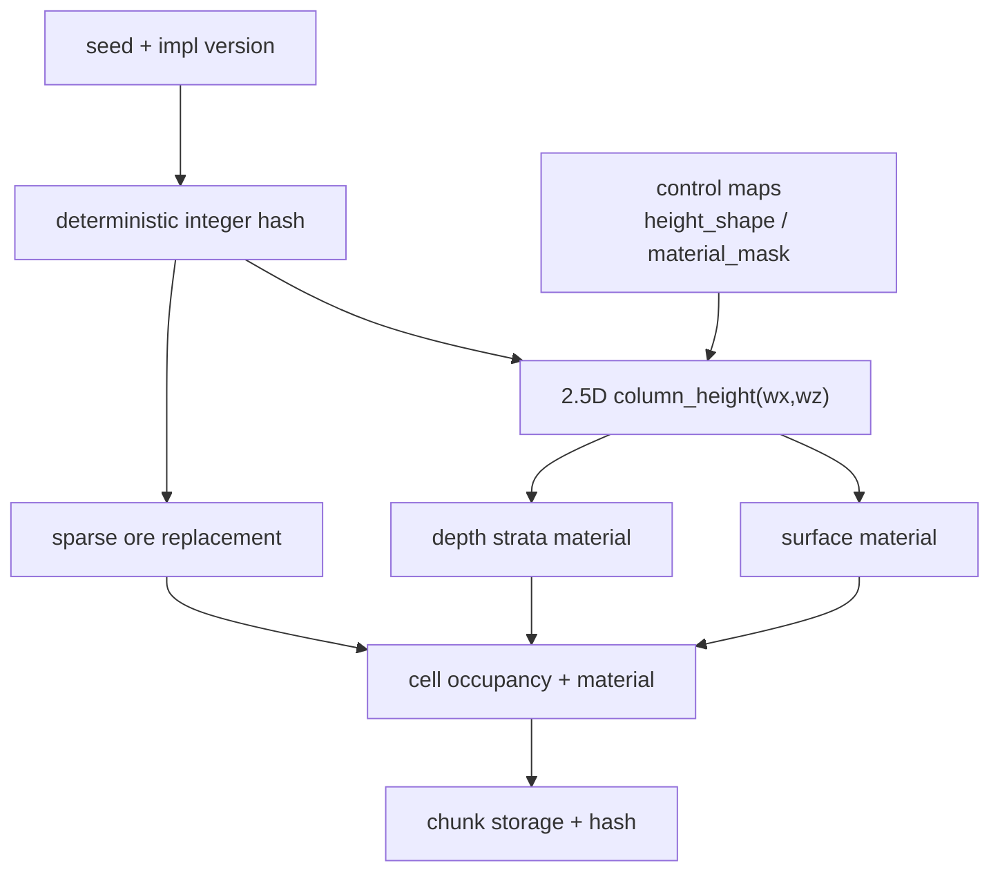
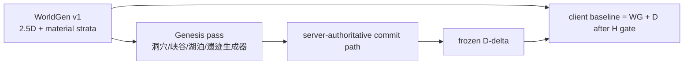

# 2026-06-30 WorldGen v1 确定性地形生成设计（历史 2.5D 算法稿）

> ⚠️ **本文已失效**：2.5D heightmap/column 不再是 WorldGen、streaming、LOD 或 cache 的公共契约；现行边界是 `chunk_xyz -> canonical 3D material volume/page`，列缓存只能留在生成器内部。现行计划见 [`2026-07-12-pure-3d-voxel-shell-migration.md`](../../10-active/voxel-far-field/2026-07-12-pure-3d-voxel-shell-migration.md)。

> 本文承接 [`2026-06-29-voxel-baseline-streaming-boundary.md`](../../30-reference/protocol/2026-06-29-voxel-baseline-streaming-boundary.md)、
> [`2026-06-29-voxel-sync-window-and-render-design.md`](../../30-reference/protocol/2026-06-29-voxel-sync-window-and-render-design.md)
> 与 [`2026-06-30-voxel-generation-streaming-client-plan.md`](2026-06-30-voxel-generation-streaming-client-plan.md)。
> 它回答 Phase 1 的核心问题：用于任意区域自动生成 baseline 的确定性地形算法应是什么。

## 结论

WorldGen v1 采用 **Minecraft-inspired 但不照搬 Minecraft** 的分层确定性算法：

```text
WorldGenV1(seed, control_maps, coord)
  = 2.5D column height
  + surface biome/material mask
  + depth strata material
  + sparse ore/material replacement
```

v1 明确不把天然洞穴、水体、aquifer、悬空结构、天空岛、巨构放进 WorldGen 纯函数。这些内容先由
genesis 工具或设计师流程产生 committed D-delta，之后与玩家 P-delta 走同一套服务端权威 commit / replay / checkpoint 路径。

这个取舍的目标是先建立跨 Rust NIF 与 Voxia C++ bit-exact 的最小可信 baseline，解锁 H gate、客户端本地 baseline 推导和 canonical store 瘦身。

## 2026-06-30 当前实现状态

仓库当前已经存在 `SceneServer.Voxel.WorldGen` 与 Rust NIF
`apps/scene_server/native/world_gen_noise`，其实现是 dev/materialization 用的
2.5D 高度场：

- `seed=1337`、`sea_level=64`、`max_height=1600`。
- 高度函数为 lowland value-noise + sparse ridged mountain mask。
- chunk 生成只写 `dirt` surface 与 `stone` subsurface，`chunk_version=0`。
- runtime LOD 主路径仍应来自 authoritative projection；该 WorldGen 模块不是运行时真值 fallback。

Voxia 本地 `-VoxiaWorldGenPreview` 预览已按这个现有服务端口径移植核心高度函数和若干样本，而不是另启一套新算法。本文后续的 fixed-point、ore replacement、control maps 是 Phase 1 收敛到可长期 H gate 的目标约束；在现有服务端实现升级前，不应把这些目标约束误读为当前客户端已经具备的 confirmed baseline 功能。

## 为什么参考 Minecraft，但不照搬

Minecraft 1.18 的可借鉴点：

- 地形形状、biome、矿物分布、洞穴/水体按层组合，而不是一张全量地图资产。
- biome 与地形高度可以解耦，让同一地貌系统支持更大组合空间。
- ore/vein 分布按高度、稀有度和噪声 mask 组合。
- 洞穴和 aquifer 属于更高复杂度的 3D density / fluid-like 结构。

本项目的差异：

- 这是服务端权威 MMO，baseline 失败必须拒绝入场，不能由客户端自由接受本地结果。
- WorldGen 输出要跨 Rust 和 UE C++ bit-exact，并进入 H gate golden fixture。
- 远景 LOD 当前主路径仍是 heightmap / material projection；完整 3D cave/aquifer 会把 LOD 立刻推到 occupancy mip / proxy mesh。
- 动态水、流体、field、entity 仍是服务端运行时 truth，不能混入本地可重算静态 baseline。

因此 v1 只借鉴 Minecraft 的“分层程序生成思想”，不把 Minecraft 的 noise caves / aquifers 作为 v1 入场门槛。

## v1 范围

### 生成内容

| 内容 | v1 归属 | 说明 |
| --- | --- | --- |
| 地表高度 | WorldGen | 2.5D `column_height(wx, wz)`，输出第一个 air world-y。 |
| 地表材料 | WorldGen | 由高度、坡度、biome/material mask 决定表层材料。 |
| 深度材料分层 | WorldGen | `wy` 越深，材料可变硬、变热或进入不同岩层；材料物性仍从 `MaterialCatalog` 查。 |
| 稀疏矿脉 | WorldGen | 只做 solid material replacement，不挖空，不引入洞穴。 |
| 高空空气 | 范围声明 | 高于 v1 最大地形高度的同质空气区进入 H range declaration。 |

### 非 v1 内容

| 内容 | v1 处理 | 原因 |
| --- | --- | --- |
| 天然洞穴 / 矿洞空腔 | genesis D-delta | 3D density 会放大 bit-exact、LOD 和 fixture 风险。 |
| 河流 / 湖泊 / aquifer | genesis D-delta 或后续 fluid 设计 | 水一旦可被挖开/加热/流动，就进入服务端动态 truth。 |
| 天空岛 / 巨构 / 遗迹 | D-delta | 它们是 authored/生成后提交的结构，不是 v1 纯地形函数。 |
| 水体流动 / 蒸发 / 结冰 | field/fluid/reaction 后续设计 | 动态层必须服务端流送，不能本地重算 confirmed truth。 |

## 输入输出契约

### 输入

```text
worldgen_impl_version
seed
control_maps_version
control_maps_digest
coord = {wx, wy, wz} 或 chunk_coord = {cx, cy, cz}
material_catalog_version
```

v1 `control_maps` 最小集：

| 名称 | 维度 | 作用 |
| --- | --- | --- |
| `height_shape` | 2D | 调制大陆、山脉、盆地和地表高度。 |
| `surface_material_mask` | 2D | 调制表层材料或 biome-like 区域。 |
| `ore_mask` | 3D 或参数化 2D+depth | 控制矿脉稀有度和空间聚类。v1 可先由 seed 派生，不必下发大图。 |

v1 不把电导、热容、硬度等材料物性做成空间 control map。材料物性只从 `MaterialCatalog` 通过 `material_id` 查询，避免 WorldGen 和材料系统形成双真值。

### 输出

单列输出：

```text
column_height_i32
surface_material_id_u16
```

单 cell 输出：

```text
occupancy: air | solid
material_id_u16
```

单 chunk 输出：

```text
canonical chunk storage bytes
chunk_hash
range_declaration_kind?   # empty / full_solid / ordinary, only for H optimization
```

H fixture 只哈希离散输出：`column_height_i32`、`material_id_u16`、canonical chunk bytes 或 chunk hash。禁止哈希 raw float / raw fixed-point 中间值。

## 算法分层



### Layer 1：确定性整数 hash

保留 SquirrelNoise 风格的整数 hash 思路，但 v1 需要把它升格成规范：

- 明确使用 `u64` 或 `u32` wrapping 语义。
- 明确 seed mixing、坐标 folding、负坐标处理。
- 每个 noise stream 使用命名 salt：`height_lowland`、`height_mountain_mask`、`surface_material`、`ore_iron` 等。
- Rust 与 UE C++ 逐字节实现同一规范。

### Layer 2：2.5D 高度

高度函数建议由三部分相加：

```text
height = sea_level
       + lowland(wx,wz)
       + mountain_mask(wx,wz) * ridged_mountain(wx,wz)
       + local_detail(wx,wz)
```

实现约束：

- v1 不使用 `powf`、平台 libm 或 FMA 敏感表达。
- fade/lerp/ridge 用 fixed-point 或整数多项式。
- 输出最终 clamp 到 v1 高度范围，并量化为 `i32`。

### Layer 3：地表材料

地表材料只决定 top soil / rock / exposed slope 这类低风险内容。

建议 v1 起步：

- `dirt`：地表若干米。
- `stone`：地下主体。
- 后续可追加 `sand` / `gravel` / `snow` 等，但必须 append-only material catalog。

### Layer 4：深度材料分层

深地不是空洞，而是 material strata：

```text
depth = column_height - wy
material = strata(depth, wx, wz, seed)
```

可表达：

- 浅层土壤。
- 普通岩层。
- 深层高硬度岩层。
- 接近地心的高温/高硬材料。

材料带来的硬度、热容、电导等效果由 `MaterialCatalog` 派生，不在 WorldGen 中复制物性表。

### Layer 5：矿脉 replacement

矿脉只替换 solid cell 的 material，不改变 occupancy：

```text
if solid? and ore_mask(wx, wy, wz, ore_kind) > threshold(depth):
  material = ore_material
```

这样可以参考 Minecraft 的高度分布和稀有矿脉思路，同时不引入 cave/aquifer 的 3D 拓扑复杂度。

## 天然洞穴和水体的 v1 位置

用户已拍板：v1 接受“WorldGen 不直接生成天然洞穴/水体，先走 D-delta”。

推荐做法：



这意味着“天然洞穴”仍然可以自动生成，只是不属于 WorldGen 纯函数。它由离线 genesis pass 生成编辑 intent 或 committed voxel event，经过服务端权威 commit 后冻结成 D。客户端最终看到的 baseline 仍包含这些洞穴，只是校验路径变成 `WorldGen + D merkle root`，而不是把洞穴拓扑塞进 v1 fixture。

好处：

- WorldGen v1 保持小而可证明。
- 复杂结构可以频繁迭代，不必每次改 cave 算法都导致 `worldgen_impl_version` 全量升级。
- 水体可以在后续 fluid/reaction 设计成熟后再决定静态 settle 和运行时 active fluid 的边界。

## H gate 与 fixture 设计

WorldGen v1 的 fixture 至少覆盖：

| 类型 | 样本 |
| --- | --- |
| 负坐标 | `(-1,-1)`、大负坐标、跨 0 边界。 |
| chunk 边界 | `x/z = 15/16/17`、`-1/0/1`、tile 边界。 |
| 高度边界 | 海平面附近、最大山高附近、clamp 附近。 |
| 材料边界 | 土壤厚度上下界、深度 strata 切换点。 |
| 矿脉命中 | 命中、未命中、threshold 附近。 |
| range declaration | 全空气 chunk、全实心 chunk、普通混合 chunk。 |

fixture 输出建议：

```json
{
  "schema_version": 1,
  "worldgen_impl_version": "worldgen_v1_fixed_2p5d@1",
  "seed": "hex-or-u64",
  "material_catalog_version": "material_catalog@N",
  "cases": [
    {
      "coord": [0, 0, 0],
      "column_height": 73,
      "surface_material_id": 1,
      "chunk_hash": "sha256:..."
    }
  ]
}
```

客户端 H gate 必须在以下情况硬失败：

- `worldgen_impl_version` 不匹配。
- `control_maps_digest` 不匹配。
- fixture 任一样本不匹配。
- D merkle root / 签名不匹配。
- range declaration 与本地合成结果不一致。

禁止用 runtime `ChunkSnapshot` 或 resync 补过 baseline gate。

## 与现有代码的关系

| 现有位置 | 当前状态 | v1 调整 |
| --- | --- | --- |
| `apps/scene_server/native/world_gen_noise/src/lib.rs` | Rust NIF，已有 2.5D 高度与 `powf` 等浮点路径 | 改为规范化 fixed-point / integer reference，暴露 fixture 入口。 |
| `apps/scene_server/lib/scene_server/voxel/world_gen.ex` | Elixir wrapper，生成 dirt/stone chunk storage | 保持 wrapper，但输入升级为 `worldgen_impl_version` / control maps / material catalog version。 |
| `clients/Voxia/Source/Voxia/Voxel/` | 暂无本地 WorldGen baseline 生成主路径 | 新增 C++ WorldGen v1 或共享 reference 绑定，用 UE Automation 对 fixture。 |
| `clients/Voxia/Source/Voxia/Net/VoxiaTerrainBaselinePackIndex.*` | 当前以 world pack index / local payload 为 baseline | 后续迁移到 H gate 通过后本地生成 `WorldGen + D`。 |
| `apps/mmo_contracts/lib/mmo_contracts/` | 有 world pack index 契约 | 新增 baseline manifest / fixture / H credential schema。 |

## v2 候选

WorldGen v2 可以在 v1 稳定后引入：

- 3D density cave。
- aquifer / 静态水位。
- river network。
- 多 biome 气候系统。
- occupancy mip / 3D proxy LOD。

但 v2 必须作为新的 `worldgen_impl_version` 和 `content_version` 进入 H gate，不能静默替换 v1。

## 验收标准

- Rust reference 单测覆盖确定性、负坐标、chunk 边界、材料分层、矿脉命中。
- UE Automation 读取服务端 fixture 并逐项通过。
- 同一 `(seed, control_maps, coord, impl_version)` 的 Rust / UE 输出 bit-exact。
- 去掉本地 `.vxpack` payload 后，客户端能在 H gate 通过时生成 radius=3 baseline window。
- fixture mismatch、version mismatch、D root mismatch 都硬拒入场并输出诊断字段。
- 远景 LOD 在 Phase 4b 前仍走服务端权威 projection；本地派生只能在 parity 通过后启用。

## 参考资料

- Minecraft Caves & Cliffs Part II 官方说明：地形高度扩展、noise caves、aquifers、矿物分布。
  <https://www.minecraft.net/en-us/article/caves---cliffs--part-ii-out-today-java>
- Minecraft Snapshot 21w37a 官方说明：noise caves、aquifers、ore veins、矿物高度分布调整。
  <https://www.minecraft.net/en-us/article/minecraft-snapshot-21w37a>
- Ken Perlin improved noise reference：可作为 noise 规范化参考，但本项目 v1 仍应固定自己的整数/定点契约。
  <https://cs.nyu.edu/~perlin/noise/>
- GPU Gems 第 5 章：说明 improved Perlin noise 的标准化动机和实现形态。
  <https://developer.nvidia.com/gpugems/gpugems/part-i-natural-effects/chapter-5-implementing-improved-perlin-noise>

## 进度日志

- `2026-06-30`：设计稿落档。拍板 v1 不直接生成天然洞穴/水体；WorldGen v1 聚焦 2.5D 高度、材料分层和矿脉 replacement；洞穴、水体、遗迹等自动生成内容先通过 genesis D-delta 冻结进 baseline。
