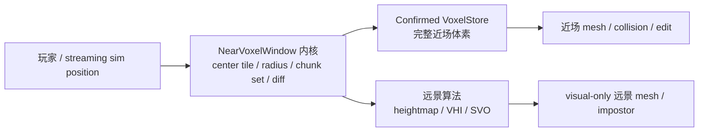
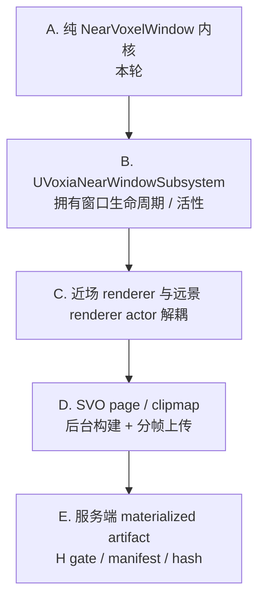

# Voxia 近场窗口内核正交化与 SVO 后续路线

> 当前决策稿。目标是先把 `3x3x3 tile` 近场窗口剥离成稳定内核，再让 heightmap / VHI / SVO 等远景算法只通过契约读取近场排除区，避免后续远景路线反复改动近场代码。

## 背景

当前 Voxia 已有完整 `3x3x3 tile` WorldGen preview 近场窗口、heightmap LOD、VHI 实验和 SVO preview。问题是 near-window 生命周期仍散在 pawn / transport / store / 远景请求里：

- `AVoxiaPawn` 负责移动后判断 tile 是否变化。
- `UVoxiaTransportSubsystem` 负责 baseline 装载、窗口裁剪、active tile window 状态和 VHI/SVO 构建分派。
- VHI/SVO 各自读取 `ActiveTileWindowRadius` 推导 skip 半径。
- `AVoxiaWorldActor` 同时管理近场 mesh、heightmap、VHI、SVO 上传。

这让“外围远景算法优化”容易碰到近场窗口语义。按系统正交原则，近场窗口应该先成为稳定内核。

## 正交边界

约束：

- 近场窗口只负责窗口语义：tile 坐标、chunk 集合、跨 tile 差分、可观测 snapshot。
- confirmed voxel truth 仍只来自 baseline / 服务端 snapshot / delta / intent result。
- 远景算法只能读取近场窗口的 exclusion contract，不能修改近场窗口。
- 远景算法之间互换时，近场窗口测试不应变化。

## 本轮范围：方案 A

新增 `FVoxiaNearVoxelWindow` 纯 C++ 模块，落在 Voxia `Voxel/` 层：

- 输入：sim position、requested tile radius、可选旧窗口。
- 输出：稳定的 near-window snapshot。
- 输出：跨窗口 diff，含 entered / exited / retained chunk。
- 输出：JSON 观测字段。
- 继续保留现有 `VoxiaTileWindow` 作为底层坐标工具。

接入方式：

- `UVoxiaTransportSubsystem::LoadTerrainBaselineTileWindowFromWorldGen` 使用 near-window snapshot 构造窗口，不再手写 radius / center / chunk count。
- `UVoxiaTransportSubsystem::Snapshot()` 暴露 `near_window`。
- VHI/SVO 从 near-window contract 读取 `center_tile` 与 `radius_tiles`，不再各自推导近场 skip 区。
- `AVoxiaPawn` 暂时仍触发 SubscribeAround / MaybeRefreshSubscription；本轮不拆 UE subsystem，避免扩大风险。

## 本轮整合状态

- `FVoxiaNearVoxelWindow` 增加 `TileWindowJson` 兼容输出，`active_tile_window` 观测字段由同一 near-window snapshot 派生。
- `UVoxiaTransportSubsystem::GetActiveTileWindow` 变为兼容 shim：有 `ActiveNearWindow` 时返回 near-window 的 `center_tile/radius_tiles`，无 near-window 时才回退旧字段。
- `AVoxiaPawn::SubscribeAround` 成功装载 WorldGen tile window 后，从 transport 的 near-window snapshot 回填 `LastSubscribedTile/LastTileWindowRadius/LastSubscribedChunk`。
- `AVoxiaPawn` 的 debug snapshot、raycast/editable 判定和 stream debug overlay 优先读取 `Transport->GetNearVoxelWindow()`；旧 `LastSubscribedTile` 只作为无 near-window 时的 fallback。
- VHI/SVO 继续只读取 near-window contract 的 center/radius 来确定远景中心和近场排除区。

## 后续升级目标

最终形态：

- 近场窗口是独立生命周期系统，持续维护“玩家位于窗口中心、跨 tile 增量加载/卸载、窗口内完整体素”的不变量。
- 近场 renderer 只消费 confirmed store 和 near-window dirty set。
- 远景 renderer 只消费 near-window exclusion contract 与派生 artifact。
- SVO/VHI/heightmap 可以替换而不改近场窗口语义。
- SVO 最终应从当前 macro-cell mesh proxy 升级为 page / clipmap / hierarchical voxel impostor：后台构建、缓存命中、分帧上传，目标 8km 可见距离和 120 FPS。
- 生产路径中远景 artifact 来自权威 voxel store materialization，并进入 manifest / H gate 校验；客户端本地 WorldGen preview 仍只是 dev-only 实验入口。

## 验收口径

- `FVoxiaNearVoxelWindow` automation 覆盖默认 `3x3x3 tile = 27 tiles = 9261 chunks`。
- 跨一个 tile 时 diff 应是 `entered=3087 / exited=3087 / retained=6174`。
- `snapshot` 暴露 `near_window`，字段包含 `has`、`center_tile`、`center_chunk`、`radius_tiles`、`tile_count`、`chunk_count`。
- VHI/SVO 远景构建使用 near-window contract，仍保持 `tile_window.missing=0` 和约 8km 远景。
- SVO 后续至少先去掉同步整块构建：请求时后台构建、coalesce pending、完成后再发布 revision。

## 2026-06-30 验证记录

- 红灯：新增 `FVoxiaNearVoxelWindow::TileWindowJson` automation 断言后，`Build.bat VoxiaEditor Win64 Development ... -NoLiveCoding` 因缺少 `TileWindowJson` 编译失败。
- 绿灯：实现 `TileWindowJson` 并整合 transport / pawn 后，`Build.bat VoxiaEditor Win64 Development ... -NoLiveCoding` 退出 0。
- 回归：`UnrealEditor-Cmd.exe ... -ExecCmds="Automation RunTests Voxia.Voxel; Quit" -TestExit="Automation Test Queue Empty" -unattended -nop4 -nosound -nullrhi` 退出 0；日志显示 `Voxia.Voxel` 12 个测试全部 `Result={Success}`，包含 `NearVoxelWindow`、`SvoPreview`、`VhiImpostor`。
