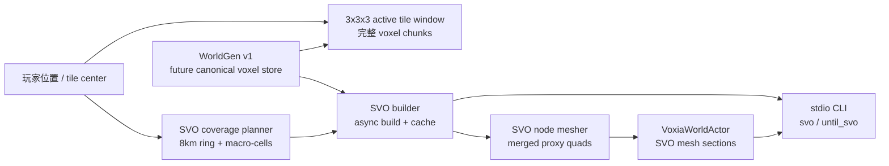
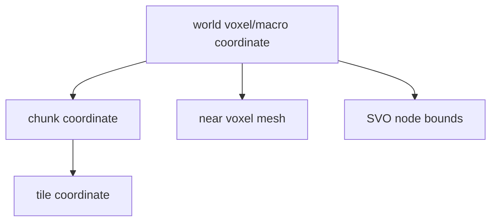

# Voxia SVO 远景预览设计

> 目标：在保留 `L_WorldGenPreview`、`L_WorldGenVhiPreview`、heightmap LOD 和现有 VHI 路线的前提下，新建独立 SVO 预览关卡，验证“窗口边缘连续 + 约 8km 远景 + 120 FPS 预算”的远景体素显示路线。

## 目标与边界

### 必须达成

1. **独立关卡与独立开关**
   - 新关卡：`/Game/Voxia/Maps/L_WorldGenSvoPreview`
   - 新启动开关：`-VoxiaSvoPreview`
   - 新启动脚本：`clients/Voxia/scripts/launch_worldgen_svo_preview.js`
   - 旧 `WorldGenPreview`、VHI 关卡、heightmap LOD 关卡和脚本不替换、不删除。

2. **近场仍为完整 `3x3x3 tile`**
   - 玩家始终位于 active tile window 中心。
   - 窗口内仍加载完整 voxel chunk，保留碰撞、raycast、编辑目标和 confirmed voxel store。
   - SVO 只从窗口外开始接管 visual-only 远景，不降低窗口内精度。

3. **窗口边缘连续**
   - 近场 voxel mesh 与远景 SVO mesh 使用同一套 canonical voxel/sample 坐标。
   - 边界采用确定性闭开区间规则，避免重复面、漏面和 z-fighting。
   - 第一版允许用 underlap / seam skirt 作为可见裂缝保护层，但必须有 CLI seam check 证明边界取样一致。

4. **约 8km 远景覆盖**
   - 默认远景半径按 tile 计算，目标覆盖约 ±8km，和当前 VHI/旧 heightmap 远景可见范围对齐。
   - SVO coverage 以 XZ 范围为主，同时保留 Y 方向体积层级，使它能表达未来洞穴、水体、悬崖背面和悬空结构外轮廓。

5. **120 FPS 预算目标**
   - 运行目标是预览关卡在常规视角下达到 120 FPS 级别的客户端帧率。
   - 工程预算按 8.3ms/frame 反推：SVO 构建不得阻塞 game thread；mesh 上传必须分帧预算；debug overlay 不允许绘制海量 node/chunk box。
   - CLI 必须暴露 build time、upload queue、cache hit、quad/node 规模和估算可见范围，避免只靠目测判断。

### 非目标

- 不把 SVO 接入生产协议。
- 不把 SVO 作为 confirmed voxel truth。
- 不让 SVO 参与碰撞、点击、编辑、H gate 或服务端权威判断。
- 第一版不做 GPU raymarch SVO。
- 第一版不做 SVDAG 去重压缩。
- 第一版不解决所有未来动态 delta merge；只保留清晰接口。

## 名词解释

| 名词 | 含义 |
| --- | --- |
| SVO | Sparse Voxel Octree，稀疏体素八叉树。每个节点代表一个 3D 立方体空间，只有非空或混合区域继续细分，适合大范围体素远景的层级表达。 |
| SVDAG | Sparse Voxel Directed Acyclic Graph，把重复的 SVO 子树合并成有向无环图以进一步压缩。它更复杂，第一版不采用。 |
| macro-cell | SVO 预览中的构建与缓存单元。建议对齐 tile 或 tile 的固定子范围，让跨 tile 移动时只增量生成新进入的远景 ring。 |
| tile | Voxia 当前流送窗口单元。生产口径中 `1 tile = 7x7x7 chunks`，当前实战窗口是 `3x3x3 tiles`。 |
| active tile window | 玩家周围完整加载的体素窗口，半径为 1 tile 时即 `3x3x3 tiles`。 |
| near field | 窗口内完整体素区域，参与碰撞、raycast 和编辑。 |
| far proxy | 窗口外视觉代理，不参与权威逻辑，只用于显示远景。SVO mesh 属于 far proxy。 |
| canonical voxel/sample 坐标 | 由同一套 world voxel 坐标、chunk/tile 坐标和确定性 WorldGen/canonical store 推导出的采样坐标。近场与远景必须共用它，不能各自四舍五入。 |
| 闭开区间 | 空间归属规则，例如一个节点覆盖 `[min, max)`。相邻节点共享边界时只由一侧拥有边界面，避免重复绘制和漏绘。 |
| seam check | 自动化边界检查：验证 near/SVO 在窗口边界上的采样高度、占用、材质和面归属一致。 |
| underlap | 远景代理略微伸入近场边界下方或后方，用于遮蔽过渡缝。它只能降低可见问题，不能替代 seam check。 |
| H / H gate | H 是 baseline / delta / manifest 的 hash 凭证；H gate 是入场前的完整性校验。SVO 是可重建远景派生物，不进入 H gate 第一版。 |
| materialized view | 从权威数据或确定性 WorldGen 派生、可丢弃重建的数据。SVO 远景 mesh 属于这种视图。 |

## 推荐路线

采用 **Occupancy SVO Leaf Surface Proxy**：

1. 窗口外以 macro-cell 为 root 构建 3D occupancy octree。
2. SVO 节点根据 WorldGen/canonical source 的 3D 占用状态分为 empty / solid / mixed。
3. empty 节点不渲染。
4. solid 节点在足够远或足够小的误差范围内作为叶子体积块，只在外侧邻接 air 时输出叶子表面。
5. mixed 节点继续细分，直到达到最大深度或屏幕误差阈值。
6. mixed 叶子同样只从 occupancy face 导出可见表面；最终把 leaf surface 转换为 UE procedural/static mesh section，而不是第一版做 GPU raymarch。

这条路线和现有 Voxia 最匹配：VHI 已经证明了独立关卡、preview flag、CLI snapshot、visual-only mesh 的工程路径；SVO 可以复用这些入口，但把远景表示从 XZ top/riser impostor 升级为 3D occupancy tree。当前 WorldGen v1 仍是高度场 source，所以可见内容主要还是地表体积壳；一旦 source 换成 canonical voxel store 或 genesis D-delta，SVO 路径可以表达洞穴、水体、悬空结构和内部体积边界。

## 数据流



## 组件设计

### `FVoxiaSvoPreview`

职责：

- 根据 center tile、远景半径、near skip 半径和 WorldGen 配置生成 SVO artifact。
- 维护 node 统计、leaf 统计、quad 统计、seam check 结果和构建耗时。
- 输出 `FVoxiaVoxelMeshData` 或等价 mesh 数据，交给现有渲染 actor 上传。

它不依赖网络、服务端连接或 confirmed store 的运行时副作用。第一版输入可以是本地 `FVoxiaWorldGenV1`；后续切到 canonical voxel store 时保持接口不变。

### `FVoxiaSvoBuildConfig`

关键字段：

- `CenterTile`
- `RadiusTiles`
- `NearSkipRadiusTiles`
- `MacroCellTiles`
- `SamplesPerTileAxis`
- `MaxDepth`（当前由 `SamplesPerTileAxis` 派生，snapshot 暴露；后续可提升为显式 LOD config）
- `WorldGen`
- `SinkCm`
- `TargetFps`

默认参数应保守：

- `RadiusTiles=72`，对齐约 8km 远景。
- `NearSkipRadiusTiles=1`，跳过完整 `3x3x3 tile` 近场窗口。
- `SamplesPerTileAxis=2` 时派生 `MaxDepth=1`，用于 8km 远景粗树预算；更高 samples 可派生更深树用于近距离验证。
- `SinkCm=0`，SVO 通过 occupancy face 拼接，不默认依赖 underlap。

### `FVoxiaSvoArtifact`

保存单次构建结果：

- coverage bounds
- max depth
- root node count
- leaf count
- empty leaf count
- solid leaf count
- mixed leaf count
- top quad count
- side quad count
- emitted quad count
- material sample count
- build elapsed ms
- seam check summary
- cache key

### `UVoxiaTransportSubsystem` 接入

新增：

- `IsSvoPreviewRuntime()`
- `RequestSvoAround(FVector Sim)`
- `SvoSnapshot()`

`AVoxiaPawn::RequestHeightmapAround` 当前在 VHI 模式下转发到 `RequestVhiImpostorsAround`。SVO 应按同样模式分支到 `RequestSvoAround`，并且只在 `-VoxiaWorldGenPreview -VoxiaSvoPreview` 下启用。

### CLI

新增命令：

- `svo`
- `until_svo [timeout_ms] [min_tiles_or_nodes]`

`svo` 返回 JSON 字段：

- `enabled`
- `revision`
- `build_in_flight`
- `has_pending_build`
- `center_tile`
- `radius_tiles`
- `near_skip_radius_tiles`
- `macro_cell_tiles`
- `samples_per_tile_axis`
- `max_depth`
- `estimated_visible_range_m`
- `macro_cell_count`
- `node_count`
- `leaf_count`
- `empty_leaf_count`
- `solid_leaf_count`
- `mixed_leaf_count`
- `top_quad_count`
- `side_quad_count`
- `boundary_side_quad_count`
- `quad_count`
- `build_ms`
- `upload_queue`
- `cache_hit_rate`
- `seam_check`
- `target_fps`
- `frame_budget_ms`

## 无缝策略

### 一套坐标

近场与 SVO 都使用 world macro voxel 坐标作为唯一采样坐标：



禁止 near mesh 和 SVO mesh 各自用浮点世界坐标反推采样点。所有边界先在整数 voxel/tile 坐标中确定，再转换成 UE world cm 坐标。

### 闭开区间

每个 SVO 节点覆盖 `[min_x, max_x) x [min_y, max_y) x [min_z, max_z)`。相邻节点只允许一个节点拥有共享边界面。near/SVO 边界也采用同一规则：

- near window 内部面由 near mesh 拥有。
- SVO 只生成 near window 外侧可见面。
- 如果启用 seam skirt，skirt 是独立过渡面，不能和 near/SVO 主面重复。

### Seam Check

第一版至少实现三个检查：

1. **边界采样一致**：near window 外壳相邻的 SVO 采样占用来自同一 WorldGen/canonical source。
2. **面归属一致**：near/SVO 交界没有同位置双面，也没有本应存在却缺失的边界面。
3. **高度/材质一致**：对地表列，near 外边界和 SVO 第一圈节点的 top material / height 不出现坐标偏移。

CLI 中 `seam_check` 至少返回：

```json
{
  "checked": true,
  "sample_count": 0,
  "mismatch_count": 0,
  "duplicate_face_count": 0,
  "missing_face_count": 0,
  "status": "pass"
}
```

## 性能策略

### 构建不阻塞主线程

SVO artifact 构建在后台任务执行。game thread 只做：

- 接收完成 artifact。
- 按预算上传 mesh section。
- 切换 revision。

跨 tile 时不允许同步重建完整 8km SVO。

### macro-cell 缓存

cache key：

```text
content_version + worldgen_config_hash + voxel_revision + macro_cell_coord + svo_lod_config
```

本地 preview 第一版可只做内存缓存。玩家跨 tile 后：

- 保留仍在 coverage 内的 macro-cell。
- 只构建新进入 ring。
- 延迟回收远离 coverage 的旧 artifact。

### 节点级合并

SVO 的主要收益来自“远处大块区域不再展开成细 voxel 面”：

- 全空节点直接跳过。
- 全实节点按节点外表面输出最多 6 个面。
- 混合节点只在需要表达轮廓时细分。
- 屏幕误差足够小时，允许以较粗节点代表更细体素。

### 调试预算

`-VoxiaStreamDebug` 在 SVO 模式下默认只画：

- active tile window 外框。
- SVO coverage 外框。
- 当前 chunk/tile 指示。

逐 node 线框必须额外开关，例如 `-VoxiaSvoDebugNodes`，默认关闭。

## 120 FPS 验收口径

120 FPS 是工程目标，不是数据结构自动保证。第一版用三层验收：

1. **结构验收**
   - SVO 覆盖约 8km。
   - SVO node/leaf/quad 数量显著低于等价全分辨率远景 mesh。
   - 跨 tile 更新只构建新增 ring。

2. **线程验收**
   - 跨 tile 不出现秒级 game thread 卡顿。
   - SVO build time 记录为后台耗时。
   - mesh upload queue 分帧清空。

3. **运行验收**
   - visible preview 在目标机器常规视角下达到 120 FPS 级别。
   - 如果达不到，CLI 必须能指出瓶颈是 node build、mesh upload、quad count、debug draw 还是 near mesh。

## 测试矩阵

| 层级 | 验证 |
| --- | --- |
| Automation | `Voxia.Voxel.SvoPreview`：确定性、coverage、near skip、node stats、seam check、mesh 非空。 |
| CLI smoke | `until_tile_window_full` + `until_svo`，确认 3x3x3 tile 近场和 SVO 远景同时 ready。 |
| 跨 tile smoke | 移动跨 tile 后，确认 held/loaded/pruned 正常，SVO 只构建新增 ring。 |
| 性能 smoke | 输出 `build_ms`、`upload_queue`、`quad_count`、`cache_hit_rate`，确认无同步秒级卡顿。 |
| 视觉验收 | 可见 8km 远景、窗口边缘无明显断裂、无大面积闪烁。视觉验收只作为 CLI/日志证据的补充。 |

## 与 VHI 的关系

| 维度 | VHI | SVO preview |
| --- | --- | --- |
| 表达 | XZ tile top/riser impostor | 3D 稀疏层级体素代理 |
| 优势 | 实现简单，快速覆盖 8km | 更适合无缝、洞穴轮廓、悬崖背面和体积遮挡 |
| 风险 | 仍像地表代理 | 构建、缓存、mesh 上传复杂度更高 |
| 当前地位 | 已有独立实验关卡 | 新增独立实验关卡 |

SVO 不删除 VHI。VHI 可继续作为简单远景 baseline；SVO 用于验证更接近生产远景体素的路径。

## 实施切片建议

1. **文档与入口**
   - 写设计稿。
   - 更新索引。
   - 新建空关卡脚本和启动脚本。

2. **SVO core**
   - 新增 `FVoxiaSvoPreview` 数据结构、构建配置、artifact 和 automation test。
   - 第一版从 `FVoxiaWorldGenV1` 取样。

3. **Mesh proxy**
   - 把 solid/mixed leaves 转成合并 mesh。
   - 接到 `VoxiaWorldActor` 的独立 SVO mesh section。

4. **CLI / observe**
   - 加 `svo`、`until_svo`。
   - 输出 coverage、node、quad、seam、build/upload 统计。

5. **增量与性能**
   - macro-cell cache。
   - 跨 tile 只构建新增 ring。
   - mesh upload 分帧预算。

6. **无缝加固**
   - seam check。
   - 必要时加 seam skirt / underlap。
   - 对重复面、漏面、z-fighting 形成 automation 断言。

## 当前结论

SVO 是当前问题的合适试验方向，但不是自动胜利条件。它能把 8km 远景从“铺满高度面片”转成“按体积层级选择细节”，从而同时服务无缝、三维表达和帧率目标。第一版必须坚持独立关卡、visual-only、CLI 可观测和异步增量构建四条边界，避免把实验复杂度带进生产权威路径。

## 进度日志

- 2026-06-30：落地第一版 `FVoxiaSvoPreview` / `-VoxiaSvoPreview` / `L_WorldGenSvoPreview`。MVP 已从最初 CPU top/riser proxy 升级为 3D occupancy octree leaf surface；不是 GPU raymarch 或 SVDAG。已接入 `svo` / `until_svo` CLI、seam check JSON、独立 `SvoPreviewMesh` 和 visible launch 脚本。当前仍需通过 visible client profiling 验证 120 FPS，后续若有尖峰优先拆 macro-cell section cache 与分帧上传。
- 2026-06-30：按系统正交先抽 `FVoxiaNearVoxelWindow` 近场窗口契约，SVO/VHI 只读取 `near_window` 的 `center_tile/radius_tiles` 排除区；SVO 构建改为 ThreadPool 后台任务，in-flight 请求合并为最新 pending，完成后才发布 `svo_revision`。当前仍是单 section procedural mesh，下一步是 macro-cell section cache / page 化和分帧上传。
- 2026-06-30：修正 SVO 远景“只有顶面面片”的实现缺口。`FVoxiaSvoPreview` 现在除每个 built macro-cell 的 top face 外，还会在相邻 built macro-cell 高度不一致时生成 X/Z 方向竖向 side face，并通过 `top_quad_count` / `side_quad_count` 暴露可观测计数。
- 2026-06-30：修正 SVO 第一圈外环和 `3x3x3 tile` 近场窗口之间没有边界侧面的缺口。边界规则改为：SVO built macro-cell 的相邻 tile 如果被 near skip 抑制，则 shared edge 上的可见高度差由 SVO 远景拥有，计入 `boundary_side_quad_count`；覆盖外部仍不生成临时竖墙。
- 2026-06-30：实现真正的 occupancy SVO traversal：每个 root macro-cell 递归分类为 empty / solid / mixed，mixed 节点按八叉树细分，终止叶子按 3D occupancy face 导出 surface mesh。自动化 `Voxia.Voxel.SvoPreview` 已断言 `node_count > macro_cell_count`、`empty_leaf_count > 0`、`mixed_leaf_count > 0` 和 leaf 分类守恒。8km CLI smoke 当前为 `max_depth=1`、`macro_cell_count=21016`、`node_count=189144`、`leaf_count=168128`、`empty_leaf_count=74062`、`solid_leaf_count=1383`、`mixed_leaf_count=92683`、`top_quad_count=88419`、`side_quad_count=66980`、`boundary_side_quad_count=1`、`quad_count=155399`、`build_ms=1153.611`、`estimated_visible_range_m=8064.0`、`seam_check.status=pass`。当前仍是 CPU 生成 + 单 section procedural mesh 上传，不是 GPU raymarch / SVDAG / 生产 H gate artifact。
