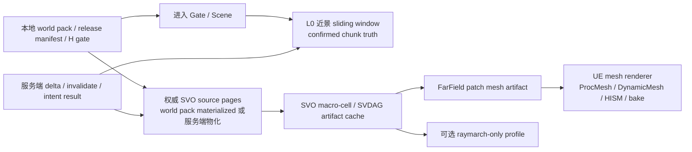

# Voxia 体素管理管线生产路线决策稿

> 日期：2026-07-05  
> 状态：历史生产路线输入；现行里程碑与 renderer 裁决以 2026-07-06 设计稿 v2.13 为准
> 范围：在“客户端数据管理采用 SVO、加载策略采用滑动窗口”已经确定的前提下，确定 Voxia 近景 / 远景划分、远景数据来源和远景渲染技术路线。本文只记录路线决策，不代表代码已经全部完成。
> **2026-07-13 现行覆盖**：A 已扩展为完整 3D near/far LOD + 客户端流送生产化，当前仍在 A10；B/C 均未开始。A10 已落唯一 `production_all_features` 根；Pure3D far 已完成 WorldGen/H-gated local request page diff/residency、cooperative cancellation、source-bound shared artifact、parallel resolved surface、worker plan、预算化 lease release 与 absolute XYZ stable-patch transaction 首轮实跑。默认本地包也已完成冷启动和相邻差集读取，错误 H 根级硬失败且无 fallback；相邻 Real-RHI worker 约 `0.91-0.95s`。剩余是 near/far 共享 source/residency/generation、反向依赖/full oracle、离群帧与完整三轴 route。服务器/HTTP/在线 authority provider 后置。raymarch 因真实 RHI 3D/Compute 队列超时退出当前路线。详见 [`2026-07-06-voxia-lod-layering-and-technology-design.md`](2026-07-06-voxia-lod-layering-and-technology-design.md) v2.13 与 [`纯 3D active 计划`](../../10-active/voxel-far-field/2026-07-12-pure-3d-voxel-shell-migration.md)。本文后续 raymarch/S6 文字只按历史决策理解。

## 1. 结论

Voxia 生产路线采用三层结构：

1. **近景 L0**：服务端权威 3D chunk window，目标窗口为玩家中心 `3x3x3 tiles`。这一层负责 confirmed voxel truth、碰撞、raycast、编辑命中、object / field 交互和高保真近场渲染。
2. **远景 L1-L3**：SVO / SVDAG 作为窗口外 3D 远景主数据结构，远景只做 visual-only 派生物。默认渲染路线采用 **SVO leaf-surface mesh artifact + FarField patch 分帧上传**，先走现有 UE mesh 管线，后续择优切到 `UDynamicMeshComponent`、HISM 或离线 StaticMesh / Nanite bake。
3. **超远景 L4**：仅保留需求触发器，不排期、不绑定 renderer；raymarch 已退出当前路线。若未来确需 >8km，必须另立阶段重新评估 source coverage、renderer 与预算。

一句话：**生产主线不是 VHI 或 raymarch；生产主线是权威投影驱动的完整 3D near/far 数据流 + UE DynamicMesh presentation。**

## 2. 基础单位和近远划分

当前项目口径里：

- `1 chunk = 16m`。
- `1 tile = 7 chunks = 112m`。
- 当前 debug `SubscribeRadius=3 chunks` 覆盖 `7x7x7 = 343 chunks`，正好等于 `1 tile`。
- 生产近场目标里的 `3x3x3 tiles` 不是 27 个 chunk，而是 27 个 tile，也就是 `9261 chunks` 的预算口径。

生产分层建议如下，距离按玩家中心 tile 的 Chebyshev tile 距离表达：

| 层级 | Tile 范围 | 约距离 | 数据来源 | 渲染 | 交互能力 |
| --- | --- | --- | --- | --- | --- |
| L0 近景 | `d <= 1`，即 `3x3x3 tiles` | 中心约 336m 边长 | verified world pack + 服务端 `ChunkSnapshot` / `ChunkDelta` / intent result | 高保真 chunk mesh，增量构建 | 碰撞、raycast、编辑、object / field |
| L1 近远过渡 | `2 <= d <= 8` | 约 224m 到 896m | 权威 3D voxel / SVO source artifact | SVO leaf-surface mesh，高 LOD，叶约 7m | visual-only |
| L2 中远景 | `9 <= d <= 24` | 约 1.0km 到 2.7km | 权威 SVO source artifact | SVO mesh，中 LOD，叶约 14m | visual-only |
| L3 远景 | `25 <= d <= 72` | 约 2.8km 到 8.064km | 权威 SVO source artifact | SVO mesh，粗 LOD，叶约 56m | visual-only |
| L4 超远景 | `73 <= d <= 96` | 约 8.2km 到 10.752km | 未选型；仅需求触发 | 未选型；raymarch 已退出 | visual-only |

L0 和 L1-L4 的边界必须是半开空间所有权：L0 拥有 confirmed truth 和交互，远景只拥有视觉表达。远景可以 underlap / skirt 来遮缝，但不能把 far visual 当作可编辑、可碰撞或 confirmed truth。

## 3. 数据管线

生产数据流按以下顺序收敛：



关键约束：

- 入场前必须通过本地 world pack / release manifest / H gate；缺包、hash 不一致或 diff chain 断裂必须硬失败。
- 运行时 `ChunkSnapshot` / `ChunkDelta` 只能更新已验证基线之上的 confirmed truth，不能替代 world pack。
- 生产远景不能依赖 `-VoxiaWorldGenPreview` 的本地 WorldGen，也不能把 missing chunk 当空气。
- 8km 级别的 confirmed-store 运行时全量预加载不可行；已有证据显示该路径会要求数百万 chunk coverage。生产应走预物化 SVO source pages、launcher/update 包、服务端 bounded materialization 和持久化 artifact。
- 运行时 delta 只标记受影响 macro-cell / patch dirty，后台重建并分帧上传；不能因为一次编辑重建整个 8km 远景。

SVO artifact cache key 至少应包含：

```text
content_version
logical_scene_id
source_revision 或 diff_chain_hash
macro_cell_coord
lod_config
material_palette_or_schema_version
renderer_artifact_version
```

## 4. 远景渲染路线

### 4.1 默认生产路线：SVO mesh artifact

默认生产 renderer 采用 SVO leaf-surface mesh artifact，原因是：

- SVO 已经是 3D occupancy 数据结构，可以表达浮空岛、洞穴、悬崖背面和多段体素列。
- mesh artifact 可以复用 UE 的材质、深度、剔除、可视化调试、backend 切换和 profiling 工具。
- 当前 FarField 公共层已经围绕 coverage、异步 build、patch 切分、fingerprint 复用和上传统计建立了稳定边界。
- mesh 路线更容易做生产验收：`quad_count`、patch 数、upload queue、fingerprint reuse、render backend、帧率和截图审计都能直接观测。

落地优先级：

1. **P0**：继续保留 ProcMesh patch section 作为 correctness / observability baseline。
2. **P1**：把默认候选推进到 `UDynamicMeshComponent` / RuntimeMesh backend，减少 ProcMesh section 管理和上传尖峰。
3. **P2**：HISM 只用于“多数面片可实例化为规则 plane”的专门 profile，不作为通用默认。
4. **P3**：稳定远景页支持 StaticMesh / Nanite bake，作为长期优化，不阻塞 P0/P1 生产化。

### 4.2 Raymarching 的定位

raymarching 当前不作为默认生产路线，理由是：

- 它需要维护自定义 global shader、root lookup、深度遮挡、材质映射、相机空间到 SVO 空间的转换、平台 permutation 和 SceneColor composite，工程风险集中在手写 shader 上。
- UE 原生渲染管线已有材质、可见性、统计、渲染后端和 asset bake 生态；默认绕开这些能力，会提高生产调试成本。
- 当前 raymarch 证据已经能证明大范围可见、payload 小、超远距性能有潜力，但仍被文档定位为 debug-gated / observability path，不等于最终 production camera-correct renderer。
- raymarch 路径只解决视觉，不解决碰撞、编辑或 confirmed truth，因此不能替代近景 chunk mesh，也不能替代 source / H gate。

raymarching 的正确使用方式：

- 作为 `L4` 超远景 profile，服务 72-96 tiles 这类传统 mesh quad 压力明显上升的场景。
- 作为 renderer A/B 测试路线，对比 mesh artifact 的帧率、内存和视觉稳定性。
- 作为未来“极远距 SVDAG renderer”候选，但必须通过生产门槛后再升格。

raymarching 升格为生产默认的前置条件：

- camera-correct world-space root lookup 和 traversal 在移动、旋转、不同 FOV、不同分辨率下稳定。
- scene depth occlusion、透明 / 不透明排序、材质、雾效和后处理接入策略明确。
- CLI 可观测字段覆盖 dispatch、hit/miss/invalid、root lookup、SceneColor write、depth occlusion、payload revision 和 frame perf。
- 所有目标 RHI / 平台 permutation 通过自动化和真实 RHI smoke。
- source pages、persistent artifact、H gate、launcher/update 和 delta dirty invalidation 已完成。
- mesh 路线仍保留可回退能力，避免 shader path 出问题时远景全黑。

## 5. VHI 和 heightmap 的定位

VHI 不再作为 3D 远景生产主线。它可以继续保留为过渡 baseline 或故障回退，但停止新增能力投入。

原因：

- VHI 本质是 2.5D 高度场 impostor，表达不了列内多段、内部空腔、浮空岛和真正 3D 遮挡。
- 将 VHI 改造成 3D 等于重新发明另一个体素表达结构，与 SVO 职责重叠。
- 当前 SVO 已具备更适合 3D 远景的结构，远景投入应集中到 SVO source、artifact 和 renderer 生产化。

heightmap LOD 保留为旧 projection / 极低成本地表 fallback，不承担 3D 远景职责。

## 6. 近远边界契约

近远边界必须满足：

- `FVoxiaNearVoxelWindow` 是近场唯一契约来源；VHI / SVO / heightmap 只能读取它来排除近场区域，不能反向拥有近场语义。
- L0 内所有可交互判定只看 confirmed chunk truth；far visual 和 hydrating focus 不允许放行编辑 intent。
- far visual 与 focus / near interactive coverage 重叠时，far visual 必须 suppression，避免双显示和误点击。
- seam 处理只能是视觉策略，包括 underlap、skirt、sink、边界法线和 patch overlap；不能改变 truth 边界。
- 缺远景 source 时必须暴露 diagnostic，不允许 fallback 到本地噪声、空气或旧 preview。

## 7. 阶段路线

### S1：锁定生产契约

- 把本文作为后续 SVO 生产化的路线真值。
- 在 CLI / observe 中保持 `svo`、`until_svo_uploaded`、`until_svo_composited`、`client_network_ready.rendering_ready`、`render_perf` 可用。
- 新增或收敛 `farfield_source_ready` / `artifact_cache_ready` / `renderer_backend` 这类生产 readiness 字段。

### S2：权威 SVO source 生产化

- world pack / launcher/update 生成 SVO source pages 或能按 bounded materialization 生成。
- H gate 检查 source coverage，不完整硬失败。
- runtime delta 只 dirty 受影响 macro-cell。

### S3：持久化 macro-cell artifact

- SVO macro-cell artifact 持久化到客户端 cache 或包内。
- cache key 覆盖 content version、scene、source revision、LOD config 和 material schema。
- 移动和编辑后只增量重建 dirty artifact。

### S4：默认 mesh renderer 生产化

- 默认路径从实验 ProcMesh section 收敛到稳定 mesh backend。
- `UDynamicMeshComponent` 优先作为生产候选；HISM 作为专用 profile；ProcMesh 保留为 debug baseline。
- 真实 RHI smoke 要覆盖移动、近远边界、focus suppression、编辑后 dirty rebuild、长时间巡航和低端机器预算。

### S5：Nanite / StaticMesh bake

- 对长期稳定远景页生成 bake artifact。
- Nanite 只用于稳定 mesh asset / baked page，不作为热更新 SVO 页的第一阶段默认。

### S6：raymarch 生产门槛（已取消，仅保留历史）

- 不再运行 L4 或 A/B raymarch profile；真实 RHI 队列超时已经关闭该路线。
- 若未来重新研究，必须作为全新阶段重新授权，不能从本文恢复执行。

## 8. 验收门槛

每个可发布阶段至少需要这些结构化证据：

- baseline / world pack gate：缺包、hash mismatch、diff chain 断裂全部硬失败并有错误码。
- near window：`3x3x3 tiles` 契约、center tile、entered / exited / retained diff 可观测。
- far source：expected / present / missing source chunks 或 source pages 可观测，缺 coverage 不构建。
- SVO artifact：macro-cell count、dirty / reused / removed、cache hit rate、SVDAG stats、payload bytes 可观测。
- renderer：backend、patch count、uploaded / reused patches、upload queue、presentation revision、SceneColor 或 mesh consumed 状态可观测。
- 性能：真实 RHI `render_perf`，包含 average / min FPS、max frame ms、截图审计和移动后 revision 验证。
- 边界：near/far seam、focus suppression、编辑 dirty rebuild、远景缺源硬失败都有 CLI 或 automation 覆盖。

## 9. 2026-07-05 客户端推进记录

本轮客户端已完成 S1-S3 的第一片：

- 新增 `source_pages` SVO source kind：`-VoxiaSvoSourcePages` 读取 `svo_source_pages_v1` manifest，校验 scene/content/source/diff/material/renderer artifact version、source page 存在性和 SHA1；失败时硬诊断，不 fallback 到 WorldGen。
- 新增持久化 macro-cell mesh artifact cache：cache key 覆盖 content/source/diff/material 版本、scene、macro-cell/LOD/sample 配置、renderer artifact version 和 source kind；`source_pages` 路径只加载预物化 artifact，缺 artifact 时 `mesh_artifact_ready=false`。
- 默认 mesh renderer readiness 已从 raymarch runtime resource 中拆出：`svo` / observe / `client_network_ready.rendering_ready` 可分别暴露 `farfield_source_ready`、`mesh_artifact_ready`、`artifact_cache_ready`、`renderer_backend` 和 raymarch readiness。
- `until_svo_uploaded` 接受 mesh artifact ready 或 runtime resource ready；`until_svo_composited` 仍只代表 raymarch composite 路径。
- 自动化覆盖 `source_pages` manifest + persistent artifact cache 的正向闭环，并补齐缺 manifest、source page hash mismatch、macro-cell artifact missing 的负向 gate；缺文件读取前会先显式 `FileExists`，避免把预期诊断污染成 `LogStreaming` warning。FarField patch uploader / WorldActor backend smoke 保持通过。
- stdio CLI 新增 `svo_source_pages_probe`：命令会在临时目录内构造 source page manifest、dummy source page 和 persistent macro-cell artifact，覆盖 source_pages 正向加载、缺 manifest、source page hash mismatch、缺 macro-cell artifact 四条路径，并返回 `checks.positive` / `checks.missing_manifest` / `checks.hash_mismatch` / `checks.missing_artifact`。当前复跑产物为 `clients/Voxia/Saved/svo_source_pages_cli_probe_rootdir.log`，`ok=true` 且无预期缺文件导致的 `LogStreaming` warning。
- 默认 mesh renderer 生产化推进第一片：`-VoxiaSvoSourcePages` 路径或 `SourceKind=source_pages` build result 在未显式指定 `-VoxiaSvoRenderBackend=...` 时默认选择 RuntimeMesh / `UDynamicMeshComponent`；WorldGen / confirmed-store 预览路径仍默认 ProcMesh，`-VoxiaSvoRenderBackend=ProcMesh` 可显式保留调试基线。`Voxia.Gameplay.WorldActor` automation 已覆盖默认策略、显式 ProcMesh、HISM、RuntimeMesh / DynamicMesh alias 和 source_pages 未知 backend fallback；`svo_source_pages_probe` 进一步验证 source_pages artifact 可生成 renderable RuntimeMesh 输入，当前为 `runtime_mesh.vertices=3604` / `triangles=1802` / `quads=901`。
- source page manifest 与 payload root 已解耦：显式 `-VoxiaSvoSourcePageRoot=...` 时，manifest 内相对 page path 相对 source page root 解析；未配置时回退 manifest 目录。`Voxia.Voxel.SvoPreview` 已覆盖 manifest/root 分离正向路径，以及错误 root 会报告 `source_pages_missing=1` 并阻断 far-field source。
- stdio CLI 新增 `svo_source_pages_fixture [tile_x tile_y tile_z]`：命令会生成保留型本地包，目录内分开保存 `manifests/`、`source_pages/` 和 `artifacts/`，返回可直接复用的 `launch_args`。它用于真实 RHI / 重启后 smoke，不接触服务端，也不写 confirmed voxel truth。
- `svo_source_pages_fixture` 已扩展可选 `[radius_tiles] [vertical_radius_tiles] [near_skip_radius_tiles]`：多 y fixture 会为上下 y 层额外写入 page / artifact，并用 `vertical_checks` 逐层验证同一个 package 在 SVO center y 改变后仍可命中；这只扩大离线包覆盖，不扩大单次 SVO runtime coverage。
- 多页 / 多 y fixture CLI 已验证：`clients/Voxia/Saved/svo_source_pages_fixture_multiy_radius1.log` 中 `svo_source_pages_fixture 11 0 -51 1 1 -1` 生成 `stored_source_page_count=27`、`stored_artifact_count=27`，`vertical_checks.ok=true` / `checked_layers=3` / `ready_layers=3`，正向 source_pages build 为 `expected_pages=9`、`present_pages=9`、`artifact_loaded_macro_cells=9`、`quad_count=7435`、`default_renderer_backend=runtime_mesh`。
- source_pages 默认 RuntimeMesh 真实 RHI 第一片已跑通：y=2 fixture 的上传 smoke `clients/Voxia/Saved/svo_source_pages_runtime_mesh_y2_upload_smoke.log` 退出 0，最终 `source_kind=source_pages`、`renderer_backend=runtime_mesh`、`source_complete=true`、`farfield_source_ready=true`、`source_pages_present=1` / `missing=0`、`mesh_artifact_ready=true`、`artifact_cache_ready=true`、`quad_count=958`、`presentation_consumed=true`、`upload_complete=true`、`upload_queue=0`、`seam_check.status=pass`。
- 3x3x3 source_pages 保留包的真实 RHI RuntimeMesh 上传已跑通：`clients/Voxia/Saved/svo_source_pages_multiy_radius1_real_rhi_upload_worldgenpreview_retry.log` 退出 0，最终 `center_tile=[11,0,-51]`、`source_pages_expected=9`、`source_pages_present=9`、`source_pages_missing=0`、`artifact_cache_loaded_macro_cells=9`、`mesh_artifact_ready=true`、`quad_count=7435`、`presentation_revision=2`、`presentation_consumed=true`、`upload_complete=true`、`upload_queue=0`、`seam_check.status=pass`。该 smoke 使用 `-VoxiaWorldGenPreview` 启动本地 baseline，只验证客户端 mesh renderer 与 source_pages 包消费，不代表服务端生产 source 调度已完成。
- source_pages 回归入口已脚本化：`until_svo_source_pages_uploaded [timeout_ms] [expected_pages] [min_revision]` 严格检查 source kind、RuntimeMesh backend、source/page/hash/artifact readiness、presentation consumed、upload complete、upload queue 和 seam pass；`node clients/Voxia/scripts/run_svo_source_pages_fixture_smoke.js` 会先生成保留型 fixture，再用返回的 `launch_args` 重启真实 RHI 客户端。当前 runner 产物 `clients/Voxia/Saved/svo_source_pages_fixture_runner_real_rhi.log` 退出 0，记录 `expected_pages=9`、`source_pages_present=9`、`source_pages_missing=0`、`source_pages_hash_mismatch=0`、`artifact_cache_loaded_macro_cells=9`、`quad_count=7435`、`presentation_revision=2`、`upload_complete=true`、`upload_queue=0`、`seam_check.status=pass`。
- source_pages retained package 已补相邻 tile 移动回归：`svo_source_pages_fixture` 第 7 个可选参数 `[movement_radius_tiles]` 会保存邻近 X/Z center 所需的 source page 与 macro-cell artifact key 变体。`clients/Voxia/Saved/svo_source_pages_fixture_move_radius1.log` 记录 `stored_source_page_count=75`、`stored_artifact_count=75`、`movement_checks.ok=true`、`checked_centers=27`、`ready_centers=27`；真实 RHI runner `clients/Voxia/Saved/svo_source_pages_fixture_runner_move_real_rhi.log` 退出 0，最终 `center_tile=[12,0,-51]`、`revision=4`、`source_pages_expected=9`、`source_pages_present=9`、`source_pages_missing=0`、`artifact_cache_loaded_macro_cells=9`、`quad_count=7606`、`presentation_revision=4`、`presentation_consumed=true`、`upload_complete=true`、`upload_queue=0`、`seam_check.status=pass`。
- source_pages RuntimeMesh 路径已补 focus suppression 结构化回归：`svo` / observe 暴露 `suppressed_macro_cells` 与 `suppression_serial`，stdio helper 新增 `until_svo_source_pages_suppressed [timeout_ms] [expected_pages] [min_revision] [min_suppressed]`，`run_svo_source_pages_fixture_smoke.js --focus-suppress --no-move` 会创建 confirmed debug focus 覆盖 fixture tile 并验证远景 macro-cell 被裁掉。真实 RHI 产物 `clients/Voxia/Saved/svo_source_pages_fixture_runner_focus_suppression_real_rhi.log` 退出 0，最终 `center_tile=[11,0,-51]`、`revision=2`、`source_pages_expected=9`、`source_pages_present=9`、`source_pages_missing=0`、`artifact_cache_loaded_macro_cells=9`、`suppressed_macro_cells=9`、`suppression_serial=1`、`quad_count=7435`、`presentation_consumed=true`、`upload_complete=true`、`upload_queue=0`、`seam_check.status=pass`。这只验证低保真 far visual suppression，不把远景提升为 confirmed truth。
- 真实 RHI 截图审计已有可见地形证据：`clients/Voxia/Saved/voxia_svo_sourcepages_runtime_mesh_y2.png` 由 source_pages + RuntimeMesh 路径生成，PNG 审计 `unique_colors=6901`、`non_black_ratio=1`、`passed=true`；人工复核能看到 voxel side wall，不再是空灰屏。y=0 fixture 在低相机高度移动到 y=2 时正确因缺 vertical source page 硬失败，这证明 H gate 没有被 WorldGen fallback 绕开。

仍未完成的生产项：

- launcher/update 或离线工具生成真实 source pages 和包内 artifact。
- 服务端 bounded materialization、远景 source 发布、delta dirty invalidation 与 artifact 重建调度。
- 多 tile / 多 y 层真实 source package 的 launcher/offline 端到端 smoke、更长移动巡航和真实包 focus suppression 回归。
- RuntimeMesh 默认策略的长期帧时间、低端预算、遮挡/材质/光照表现验证；Nanite / StaticMesh bake 仍是后续候选。

## 10. 后续执行提示词

```text
请按 docs/docs/30-reference/overview/2026-07-06-voxia-lod-layering-and-technology-design.md（下游细化设计稿）推进 Voxia 体素远景生产化，路线拍板真值仍是 docs/docs/30-reference/overview/2026-07-05-voxia-voxel-lod-production-route.md。

约束：
1. 不改变服务端权威边界：confirmed voxel truth 只能来自 ChunkSnapshot / ChunkDelta / VoxelIntentResult / ChunkInvalidate；客户端本地 WorldGen 只允许 preview。
2. 保持滑动窗口：L0 近景目标为玩家中心 3x3x3 tiles，负责碰撞、raycast、编辑和高保真 chunk mesh。
3. 远景主线采用 canonical XYZ pages + coverage-resolved surface；L1-L3 renderer 走 DynamicMesh presentation，不运行 raymarch。
4. L4 只保留需求触发器，renderer 未选型；raymarch 不属于 defer/backlog。
5. VHI 冻结为 2.5D 过渡 baseline，不再投入 3D 能力；heightmap LOD 只保留为低成本地表 fallback。
6. 执行顺序按设计稿 v2.13：当前继续扩展里程碑 A（A10 唯一根、Pure3D far S2-S5 增量/并行链与 S2L H-gated 本地 request provider 已落地，继续统一 near/far transaction、补反向依赖/full oracle、离群帧、三轴长巡航与材质族）；服务器/HTTP/在线 authority provider 后置。A 退出后才开始 B 的 1m/7m 投影契约与 fixture oracle，最后 C 才做服务端 writer/dirty/分发。

请先阅读 AGENTS.md、docs/00-current-truth/design/client/streaming-lod.md、clients/Voxia/Source/Voxia/FarField/README.md 与 2026-07-06 设计稿 v2.13。当前从里程碑 A10 的 resume 继续，不得重做 A1，也不得提前启动 B/C。
```

## 11. 证据源

- [`docs/00-current-truth/design/client/streaming-lod.md`](../../00-current-truth/design/client/streaming-lod.md)
- [`docs/90-obsolete/voxel-far-field/2026-06-30-voxia-farfield-common-components-and-vhi-baseline.md`](../../90-obsolete/voxel-far-field/2026-06-30-voxia-farfield-common-components-and-vhi-baseline.md)
- [`docs/20-archive/voxel-far-field/2026-07-01-voxia-svo-3d-farfield.md`](../../20-archive/voxel-far-field/2026-07-01-voxia-svo-3d-farfield.md)
- [`docs/20-archive/voxel-far-field/2026-06-30-voxia-svo-preview-design.md`](../../20-archive/voxel-far-field/2026-06-30-voxia-svo-preview-design.md)
- [`clients/Voxia/Source/Voxia/FarField/README.md`](../../../clients/Voxia/Source/Voxia/FarField/README.md)
- [`clients/Voxia/Source/Voxia/Debug/README.md`](../../../clients/Voxia/Source/Voxia/Debug/README.md)
- [`clients/Voxia/Source/Voxia/Voxel/VoxiaSvoPreview.h`](../../../clients/Voxia/Source/Voxia/Voxel/VoxiaSvoPreview.h)
- [`2026-07-06-voxia-lod-layering-and-technology-design.md`](2026-07-06-voxia-lod-layering-and-technology-design.md)（下游细化：分层/技术/契约/里程碑）
- [`2026-07-06-gpt55-lod23-proposal-review.md`](../../20-archive/voxel-far-field/2026-07-06-gpt55-lod23-proposal-review.md)（GPT-5.5 方案对抗评审）
- [`../design/20260706ue58_voxel_lod2_lod3_architecture.md`](../../90-obsolete/voxel-far-field/20260706ue58_voxel_lod2_lod3_architecture.md)（外部方案 v1，仅参考）
- [`../design/ue58_voxel_lod0_lod3_complete_plan.md`](../../90-obsolete/voxel-far-field/ue58_voxel_lod0_lod3_complete_plan.md)（外部方案 v2，仅参考）
