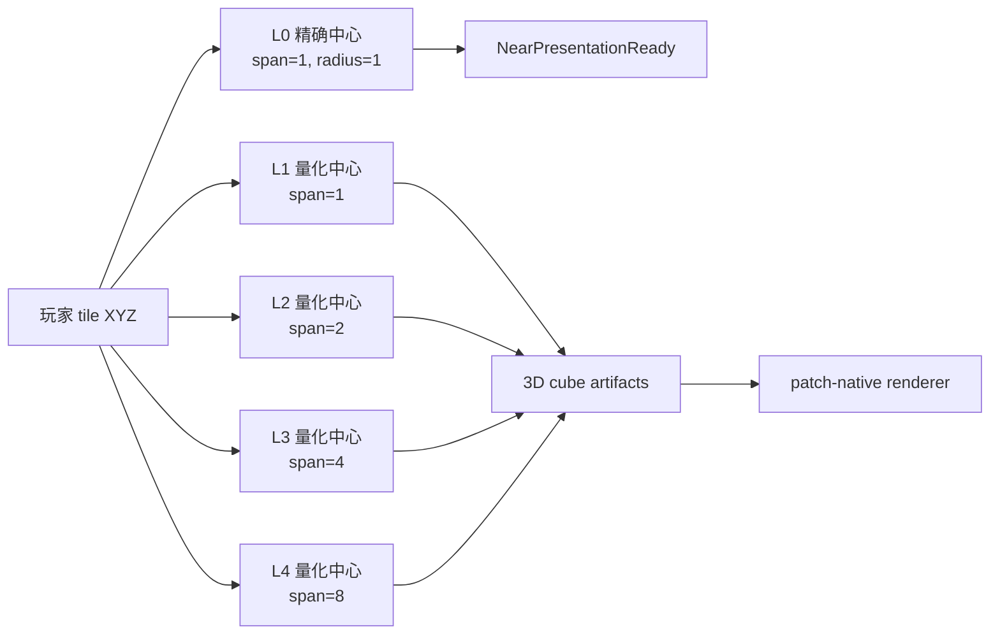

# 历史设计输入：Voxia 三维 LOD 滑动窗口

> ⚠️ **本文已失效**：其预算与 cube-shell 空间推演可作历史输入，但保留 2.5D WorldGen/全高度列的迁移前提已被推翻。现行路线见 [`2026-07-12-pure-3d-voxel-shell-migration.md`](../../10-active/voxel-far-field/2026-07-12-pure-3d-voxel-shell-migration.md)。

- **日期**：2026-07-11
- **状态**：已被 [`2026-07-12-pure-3d-voxel-shell-migration.md`](../../10-active/voxel-far-field/2026-07-12-pure-3d-voxel-shell-migration.md) 取代；保留为预算与空间规划历史输入
- **取代说明**：新阶段不再接受 2.5D WorldGen、heightmap、全高度列作为内容前提或迁移终态，并把 canonical source、逐面材质和 GPU 原子 presentation 纳入同一阶段契约
- **替代事实**：SVO 远景不再以 `CenterTile.Y=0` 的 2.5D 全高度列作为终态；该约束只保留为迁移期兼容路径
- **边界**：改变客户端 far visual coverage、source-page/artifact 坐标与缓存版本，不改变 confirmed truth、编辑、碰撞或服务端 authority

## 1. 目标

所有空间精度层使用同一个三维距离口径：

- L0 near 是玩家中心 `3×3×3 tiles` 的立方体。
- L1-L3/L4 是三维 Chebyshev 距离定义的立方壳，而不是 X/Z 平面环带加全高度列。
- 玩家沿 X/Y/Z 任一轴移动时，各层都维护自己的三维滑动 coverage。
- 外层低精度窗口不能每移动 1 tile 就整体换代；其中心按该层 root span 量化。



## 2. 为什么不能直接扩展旧平面 planner

旧 SVO coverage 是半径 72 的 `145×145` X/Z tile 列，约 21,016 个 macro-cell。每个 artifact 内部再扫描全高度 Y slab。若只把 `VerticalRadiusTiles` 改为 72：

1. 会产生约 `145³ - 3³ ≈ 304.8 万` 个坐标；
2. 每个坐标仍构建全高度列，Y 层互相重复；
3. cache、patch 和 ring identity 都会失真；
4. 冷构建、内存与上传远超现有预算。

因此 3D 化必须同时改变 **coverage cell 形状** 与 **外环 root span**。

## 3. 三维 coverage 契约

### 3.1 Cell

每个 far cell 是轴对齐立方体：

```text
origin_tile_xyz
span_tiles
ring_index
leaf_depth
coverage_center_tile_xyz
```

artifact 只构建 `[origin, origin + span)` 的三维体积，不再扫描同 X/Z 下的全高度列。cache key 必须包含 `origin_tile_xyz + span_tiles + leaf_depth + source identity`。

### 3.2 Ring 与预算

现有叶尺寸合同保持 `3.5/7/14/28/56m`，root span 按外环放大：

| 外半径 | 叶尺寸 | root span | 说明 |
| ---: | ---: | ---: | --- |
| 4 | 3.5m | 1 tile | near collar |
| 8 | 7m | 1 tile | 高频近远过渡 |
| 24 | 14m | 2 tiles | 中距立方壳 |
| 40 | 28m | 4 tiles | 远距立方壳 |
| 72 | 56m | 8 tiles | 8km 立方壳 |

root span 增大时，octree build depth 同步增加 `log2(span)`，以保持物理叶尺寸不变。按半开立方体估算，总 root cell 约 2.8-3.3 万，和当前 2.1 万列同量级，而不是 300 万。

### 3.3 独立中心与无洞优先

- L0 center 精确跟随 active near window。
- 每个 far ring center 在 XYZ 三轴按自己的 `span_tiles` 对齐，只有跨越该网格边界时才移动。
- 相邻精度中心可能不同。coarse cell 只有在**完全落入** finer coverage 时才被排除；边界 partial cell 保留为 underlap，配合 sink/fade，优先保证无洞。
- near/far 交接仍由 `NearPresentationReady` 控制；far 不能从 voxel 内容反推 near readiness。

## 4. 所有权

- `FVoxiaFarFieldCoveragePlanner`：纯空间规划，输出 3D cube cell，不读 source/render/player actor。
- `FVoxiaSvoPreview`：消费 cell plan，构建 cube occupancy artifact；不拥有窗口活性。
- Transport：从 active near center 生成请求，维护各 ring coverage center 的最新配置。
- WorldActor：消费 patch delta 与 near readiness，维护呈现生命周期。
- source pages / cache：按 3D cell identity 提供已验证数据；缺页或旧 artifact version 硬失败。

## 5. 分阶段实施

1. **P1 planner**：增加 3D Chebyshev、cube-shell cell/span、独立量化中心、预算与无洞覆盖测试。
2. **P2 artifact**：artifact 增加 span/ring/build-depth；WorldGen preview 与 confirmed source 只构建 cell 的 Y slab；cache version bump。
3. **P3 runtime**：Transport 默认请求 3D plan，移除列源 `CenterTile.Y==0` 默认化；snapshot 输出 per-ring center/span/cell count。
4. **P4 source pages**：manifest expected set、materializer 与 launcher artifact 迁移为 3D cell key；旧 2.5D 包显式版本不兼容。
5. **P5 renderer/handoff**：3D patch bounds、六方向 seam、上下移动与跨环 fade；完整 Real-RHI 长巡航。

## 6. 验收

| 类别 | 门槛 |
| --- | --- |
| coverage | 每个 cell 是立方体；near exclusion 使用 XYZ；各 ring 覆盖为立方壳 |
| budget | radius72 默认计划 root cell 保持 5 万以下，并记录各环 count/span |
| movement | X/Y/Z 单轴移动均产生有界 entered/exited/retained；外环不随每个 tile 重心变化 |
| source | expected/present/missing 按 3D cell；缺 Y page 硬失败 |
| seam | ±X/±Y/±Z 六方向无洞；不同 span 边界有覆盖断言 |
| performance | 完整 near+far 3D 场景报告 p50/p95/p99/max 与负载尖峰，不用降低范围伪装达标 |

## 7. 迁移风险

- 当前 WorldGen v1 内容本身仍是 2.5D 高度场，但 3D cube artifact 可正确表达其 occupancy；生产洞穴/浮空岛来自 verified baseline/delta/source pages，不能由 WorldGen 高度场伪造。
- 旧 source pages 与持久 artifact 是列语义，必须 bump renderer/source artifact version，禁止静默复用。
- 当前 FarField patch 只按 X/Z 分组。P2 可先允许一个 patch 聚合多个 Y cell，但正式 3D 剔除需要把 patch identity 扩展到 XYZ 或增加 vertical layer，避免高空/地下几何共同放大 bounds。

## 8. 暂停点

本轮只提交设计与预算口径，不修改 `FVoxiaFarFieldCoveragePlanner`、SVO build config、artifact/cache 格式、source pages 或 renderer。此前已经完成的近景队列重入、有限垂直带活性维护、near/far presentation handoff、远景 patch 异步构建与稳定 fade 优化继续保留，并按原完整 2.5D WorldGen preview 场景验收。
