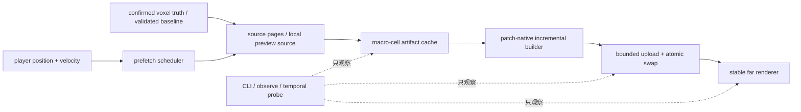

# 决策稿：Voxia 远景时序稳定与无缝流送

> ✅ **本文已归档**：patch-native 增量、near 热路径、预测预取、后台 mesh prepare 与联合 near/far 性能证据已经收口。stash 中“推进中”是本文形成时的历史截面；当时尚未完成的可取消构建、重叠 page/artifact 复用和三轴长巡航后来并入 A10，现役实现状态以 A10 / S1b-1 与完整 XYZ 契约为准。在线 authority cutover 仍未完成，当前主线见 [`2026-07-12-pure-3d-voxel-shell-migration.md`](../../10-active/voxel-far-field/2026-07-12-pure-3d-voxel-shell-migration.md)。

- **日期**：2026-07-10
- **状态**：已完成并归档（正文保留 2026-07-10 推进期记录；Phase 0/1、Phase 2 前三切片、Phase 3 预测 near slab、近景冷加载热路径与完整 near+far 综合实跑已收口；未完成的增量构建项迁入 A10；严格不用 raymarch）
- **触发**：第一人称零参数入口实跑暴露两项生产阻塞：远景体素明显闪烁；冷启动与跨 tile 更新无法支撑无缝游戏体验。
- **边界**：本阶段只改客户端派生远景与本地 WorldGen preview 的加载/呈现编排，不改变 confirmed voxel truth、H gate、服务端 authority 或 wire codec。

## 1. 已确认基线

### 1.1 视觉

1. 稳态远景存在高频 shimmer。当前 `r.ScreenPercentage=77` + TSR；项目配置已记录“高频方块棱/薄远景 quad 反复跨采样格，TSR history 接受/拒绝跳变”。
2. 玩家移动导致 LOD ring 重分配时，patch 使用 `DitherTemporalAA` 做 0.35 秒交叉淡变；它主动引入逐帧噪声。稳态完成后材质回到 Opaque，因此“静止超过 fade 窗仍闪”与“只在换环窗口闪”必须分开验收。
3. 远景 `CastShadow=true` + VSM 可能放大远处 shadow crawling，但目前只列为待 A/B 因素，不能未经实测写成主因。
4. 当前 SVO `seam_status=pass`，patch 原子换入已保留旧覆盖到新上传完成；不得把 TSR/dither 问题误诊成几何缺口。

### 1.2 吞吐

2026-07-10 直接编辑器 PIE 跨一个水平 tile 的证据：

| 阶段 | 增量工作量 | 实跑耗时 |
| --- | ---: | ---: |
| near window | entered 3087 / retained 6174 / exited 3087 chunks | 11.8s |
| SVO build | built 782 / reused 20234 macro-cells | 45.5s |
| SVO upload | uploaded 82 / reused 279 patches | 7.46s |

绝对 wall time 会受编辑器后台 3 FPS 节流污染，但结构性工作量与固定预算不受该因素影响。下列诊断描述是 Phase 2 实施前的基线：

- near window 是完整 `3x3x3 tile = 9261 chunks`；水平跨 tile 必然新增 `1x3x3 tile = 3087 chunks`；
- near generation 默认 128 chunks/batch，apply 预算 1ms，并在发布后固定等待 160ms；
- WorldGen SVO 持久 artifact cache 默认关闭；
- macro-cell 命中复用后仍重新拼接全量 aggregate mesh、全量 seam scan、全量 split-by-patch；
- SVO uploader 默认 3ms / 8 patches per frame，首次 dirty patch >=64 时 bulk-hide 到全部上传完成。

Phase 2 第一切片完成后的真实 RHI 8km 同构对比为：首次 21024-cell 冷构建仍需 `247042.761ms`；跨一个水平 tile 时只重建 `776` 个 macro-cell、复用 `20248` 个，SVO build 为 `8334.940ms`，相对“已取消 aggregate/full seam、但仍隐式构建全量 runtime SVDAG”的 `135948.497ms` 降低约 `93.9%`。patch cache 只读取 `776` 个 dirty cell 的 `139906` quads，重建 `82/361` patches、复用 `279` patches，patch 聚合为 `135.586ms`；dirty-boundary seam 扫描 `270944` 个面，missing/duplicate/mismatch 均为 0。结论是隐藏的全量后处理已消除，但 8.3 秒增量 build 和 247 秒冷 build 仍不满足无缝体验。

Phase 2 第二切片把 patch-native 路径的 dirty macro-cell artifact 生成改为独立 per-cell cache 的并行任务，完整 aggregate/offline validation 仍保持原串行覆盖顺序。8km 冷 build 降到 `32358.644ms`（21024 tasks 的并行段 `30511.110ms`）；跨 tile build 降到 `2015.912ms`（776 tasks 的并行段 `1166.957ms`），相对第一切片再降约 `75.8%`，相对原始 `135948.497ms` 累计降低约 `98.5%`。patch 聚合为 `113.545ms`。这已移除最主要的 CPU 浪费，但 2.0 秒增量与 32.4 秒冷生成仍不是生产级无缝流送。

Phase 2 第三切片把受影响 patch 的 compact mesh 聚合拆成 82 个独立 `ParallelFor` 任务，随后仍以稳定 patch key 顺序提交 cache/live/removed 统计。8km 跨 tile patch update 从 `113.545ms` 降到 `72.751ms`（约 `-35.9%`），其中 aggregation 为 `43.941ms`；coverage、dirty/reused cell、rebuilt/reused patch 与 dirty seam 样本完全保持，missing/duplicate/mismatch 仍为 `0/0/0`。该切片缩短了同步聚合，但调用方仍等待整个批次完成，不等于已经移出 GameThread。

2026-07-11 对同一 1600×900、VSync/帧率上限关闭、默认 mesh renderer 的近景冷加载做了逐阶段剖析。优化前 9261 chunks 数据 ready 为 `28423.7ms`，3087 个候选 chunk 收敛成 855 sections / 78451 quads 需要 `35400.4ms`，加载尾段常见 `52-70ms` 帧。根因不是单一“流送速度”：Transport 串行 batch + 固定 reveal 延时、相同 X/Z column 跨垂直 chunk 重算、整块实心快照展开成约 1700 万个 `TMap` cell，以及单一 `UProceduralMeshComponent` 每加 section 都触发全组件 bounds/render-state 更新，共同放大了吞吐和 GameThread 尖峰。

近景热路径优化后，两次干净 Real-RHI 复测把 9261 chunks 数据 ready 降至 `1779.9-1862.4ms`（约 `15.3-16.0x`），最终几何均为 855 sections / 78451 quads。加载至完整 near mesh 的平均为 `131.230-135.272 FPS`，p95=`9.907-10.208ms`，`>16.67ms` 均为 4 帧；收敛后 10 秒平均 `136.012-138.634 FPS`，p95=`9.743-9.969ms`，没有 `>16.67ms` 帧。该结果证明平均与稳态已超过 120 FPS，但不能表述成“每帧 120+”：加载 p95 仍高于 8.33ms。此 profile 使用 `-VoxiaNearWindowOnly`，最终复测 near mesh max tick/single-chunk 仅为 `6.823/6.352ms`，因此约 `64ms` 单次极值尚不能归因于 SVO 或 near mesh，下一轮必须用 Unreal Insights/CSV 单独定位。

相邻 `[12,0,-51]` slab 的 3087 chunks 预取在 `429.7ms` ready，期间 active coverage 仍保持 `[11,0,-51]`；实际跨界后才 activation，并以 pruned=`3087` 收敛。near 组件池复用 `256` 个组件，最终新中心为 898 sections / 82454 quads；跨界窗口平均 `134.279 FPS`，p95/p99/max=`10.211/11.545/15.257ms`，没有 `>16.67ms` 帧。这补齐了首窗之外的真实流送入口验证。

同日完整 `L_WorldGenSvoPreview` 可见实跑取消 near-only 隔离，同时启用 confirmed near、72-tile SVO、默认分组件 DynamicMesh、Lumen/UDS 与硬件光追，且日志保持 `raymarch_mode=none`。首窗 near data ready=`2778.2ms`，near mesh=`855 sections / 78451 quads`；远景 cold build=`9157.1ms`，生成 21016 macro-cells / 1329713 quads、`estimated_visible_range_m=8064`、`seam_status=pass`，361-patch 上传=`3504.9ms`。收敛后 12 个连续 FPS 日志样本平均 `106.0`、范围 `98.3-109.9`；首次上传出现 `113.69ms / 8.8 FPS`，相邻 tile 的 82-patch 增量更新附近仍出现 `30.15ms / 33.2 FPS`。这证明 near/far 的呈现并未割裂，也证明 near-only 120+ 不能外推为综合完成：Phase 2 的 GameThread 提交残余和完整环境像素成本仍是 120 FPS 的真实阻塞。

## 2. 目标与非目标

### 2.1 目标

- 稳态相机静止时，远景不出现可见周期性白点/边缘闪烁。
- 跨 LOD ring 时不出现 temporal noise 爆发、共面 z-fighting、洞或双显。
- 玩家跨 tile 时旧覆盖持续可见，新覆盖在进入前完成预取并原子换入。
- 增量更新成本与 dirty patch 数成比例，不再与全量 21016 macro-cells / 1.33M quads 成比例。
- 冷启动生产入口只读取已验证 pack/source-pages/artifact，不在入场后现算整幅 8km WorldGen SVO。

### 2.2 非目标

- 不把调大 GameThread budget 当成最终优化；它只能把等待转成卡顿。
- 不用降低 confirmed coverage、把 missing chunk 当空气或绕过 H gate 换速度。
- 不把 dev-only WorldGen preview 的冷生成耗时伪装成生产 streaming 已完成。
- raymarch 严格不用：不作为默认、调试、A/B 或 L4 候选，不运行任何 `VoxiaSvoRaymarch*` profile；不引入 Nanite runtime bake。

## 3. 系统边界

所有权约束：

- Transport 决定 source/config/build revision，不拥有 render component；
- FarField builder 维护 artifact/patch 纯数据，不访问玩家输入或 authority；
- WorldActor 只消费 patch delta 并维护组件生命周期；
- Prefetch scheduler 只提前请求，不改变 confirmed truth 与当前 active coverage；
- Renderer 的 fade/shadow/TSR 策略不能反向改变 voxel source。

## 4. 分阶段实施

### Phase 0：可重复 A/B 与预算面

- 增加 `svo_visual_stability` CLI：输出 AA method、screen percentage、TSR flicker 配置、VSM、far shadow、fade mode、fade in-flight/started、ring reassigned、renderer backend。
- 增加自动化脚本矩阵：current / screen-percentage-100 / no-fade / VSM-off。
- 同一机位分别采集 stationary 与 one-tile-move；产物写 `.demo/observe/`。
- 增加 near/SVO 阶段耗时摘要：source generation、artifact reuse/append、seam check、patch split、mesh conversion、game-thread submit。

### Phase 1：时序稳定远景

- 将换环 mask 从依赖 `TemporalSampleIndex` 的 `DitherTemporalAA` 改为固定屏幕空间的帧稳定互补 mask；同一屏幕像素上的新旧集合互补，任一帧不留洞、不双写。
- fade 完成后继续回到 Opaque 稳态材质。
- VSM/far shadow 只按 A/B 结果决定；若为放大器，外环使用明确的 shadow distance/tier policy，不影响近场阴影。
- 若 100% screen percentage 能显著改善稳态 shimmer，只作为诊断证据；最终优先减少远环亚像素高频信号，不默认用 69% 像素成本增长兜底。

### Phase 2：patch-native 真增量

- [x] build result 以 `macro-cell artifact map + dirty/removed set` 为主；默认 mesh renderer 不再为运行时复用路径构造全量 `Out.Mesh`。
- [x] 维护持久 cell-to-patch 索引与 patch compact mesh/fingerprint；只重新聚合受 dirty/removed cell 影响的 patch，且索引不复制第二份全量几何。
- [x] 全量 seam hash scan 移入 automation/offline；运行时只验证 dirty/new cell 及其 X/Z 邻接边界与计数不变量。
- [x] 默认 mesh renderer 不再构建只供 raymarch 使用的 runtime SVDAG root/node payload；当前路线严格不用显式 raymarch profile。
- [x] patch-native 路径把 dirty macro-cell artifact 生成拆成独立 per-cell cache 的 `ParallelFor` 任务；完整 aggregate/offline validation 保持串行确定性。`macro_cell_build` 暴露 tasks/parallel/build_ms。
- [x] 受影响 compact patch 聚合改为独立 `ParallelFor` 任务，稳定顺序提交统计；`patch_build` 暴露 aggregation_tasks/parallel/ms，8km patch update 为 `72.751ms`。
- [x] compact patch cache 更新/聚合整体移入 ThreadPool；每个 dirty patch 的 DynamicMesh CPU build 也在后台完成，GameThread 只消费已完成 mesh 并做 bounded UObject/material/fade/register/SetMesh submit。默认单 worker + 每帧提交 1 个，完整场景跨区 p99=`10.942ms`，仅 1 帧超过 `16.67ms`。

### Phase 3：预测预取与中心解耦

- [x] WorldGen preview near window 依据位置/速度预取即将进入的
  3087-chunk 水平 slab；Transport 分离 active/loading/ready/cleanup，未 ready
  不切 active/editable coverage。
- [x] 近景冷加载热路径改为流水化 producer/apply、请求级 column cache、整块实心
  confirmed chunk 紧凑存储，以及每 chunk 独立可复用 ProcMesh；最终 settled revision
  仍按预算重校验，不降低 confirmed coverage 或几何完整性。
- [ ] near collar center 继续精确跟随玩家；外层 LOD coverage center 引入
  hysteresis，减少每 tile 的大规模 ring reassignment。
- [x] 旧 far patch 保留到新 patch ready，提交后原子退役；near recenter 进一步
  以 `new near hole - old near hole` 的 presentation-ready tile 集合为门控，
  相邻移动通常只等待 3 个进入 tile，避免远景先挖洞。连续移动始终评估最新
  Transport revision，不发布已过时中心。

### Phase 4：生产 pack/cache

- launcher/cook 生成 validated source-pages 与 sharded patch artifact pack；避免 21016 个松散文件和首次运行现算。
- 场景入场 H gate 校验 pack/manifest/hash/diff chain；通过后用 mmap/批量解压 hydrate。
- WorldGen preview 可保留 opt-in loose cache 做开发回归，但不作为生产流送实现。

## 5. 验收矩阵

| 类别 | 验收项 | 门槛 |
| --- | --- | --- |
| 静态视觉 | stationary far temporal probe | 排除云/动态 UI 后，远景 ROI 不出现周期性高亮跳变 |
| 移动视觉 | one-tile ring transition | 无洞、无双显、无 temporal noise 爆发；fade 完成后 `fade_in_flight=0` |
| 几何 | dirty-boundary seam | `seam_status=pass`，missing/duplicate 不回归 |
| near streaming | one-tile slab | active coverage 切换前预取 ready；游戏中无 post-cross 空窗 |
| near frame time | cold load + 10s steady | 报告 p50/p95/p99/max；平均达到 120 FPS 时仍需单列 `>8.33/16.67/33.33/50ms` 帧数，禁止只报平均值 |
| SVO build | one-tile recenter | cost 与 dirty patch 成比例；不得重新 split 全量 1.33M quads |
| upload | dirty patch submit | 每帧 submit 不超过预算，旧覆盖持续可见，`upload_queue` 收敛到 0 |
| 冷启动 | validated pack path | 入场后不启动 21016-cell WorldGen 冷 build |
| 权威边界 | baseline/H gate | 缺包/hash 错/diff 断裂继续硬失败，不用运行时自愈绕过 |

## 6. 进度日志

- 2026-07-10：立稿。完成现场证据回填与阶段拆分；Phase 0/1 开工。首轮实施范围锁定为：结构化视觉稳定性快照、A/B 启动矩阵、帧稳定互补 fade 材质及 automation/真实 RHI 验证。
- 2026-07-10：Phase 0 首个观测面落地。新增 `svo_visual_stability`，NullRHI 实跑返回 `aa_method=4`、`screen_percentage=77`、`tsr_flickering_period=6`、`tsr_history_samples=32`、`vsm_enabled=true`、`vsm_lod_bias=-1`、`far_cast_shadow=true`、`fade_mode=stable_screen_noise_v1`、`fade_seconds=0.35`。这使稳态 TSR/VSM 因素与移动换环 fade 能在同一份 JSON 证据里分开诊断。
- 2026-07-10：Phase 1 首轮落地。`M_VoxelFarDither` 不再调用 `DitherTemporalAA`；换环 mask 改为固定屏幕空间噪声阈值，新旧 patch 使用同一阈值的互补半空间，fade 完成后仍回到 Opaque 材质。`Voxia.Voxel.FarDitherMaterialContract` 已验证 ScreenPosition/Noise 存在、`DitherTemporalAA` 缺席、`FadePatternScale=512` 以及材质继承契约。该改动只消除 0.35 秒移动窗口的人为逐帧噪声，尚不能宣称已解决 77% TSR 下的稳态亚像素 shimmer。
- 2026-07-10：编辑器 Development 构建通过；`Automation RunTests Voxia.Voxel.Far` 共 10 个用例全部 Success，`TEST COMPLETE. EXIT CODE: 0`。材质专项可复现日志为 `clients/Voxia/Saved/Logs/voxia_stable_dither_test.log`。
- 2026-07-10：真实 RHI 小窗口跨 tile 验证通过。首个 revision 为 `macro_cell_count=288`、`quad_count=239787`、`seam_status=pass`；跨 tile 后 revision 2 为 built/reused/removed/dirty=`60/228/18/60`、`ring_reassigned_cells=18`、`upload_queue=0`。过渡中 `fade_in_flight=4`、`fades_started_total=4`，等待 31 秒后 `fade_in_flight=0` 且 revision/组件数保持稳定；三张 1920×1080 PNG 均通过非黑与颜色数审计。过渡帧与收敛帧肉眼无洞/双显，SSIM=`0.992810`。产物：`clients/Voxia/Saved/voxia_temporal_stationary_real_rhi.png`、`voxia_temporal_transition_real_rhi.png`、`voxia_temporal_settled_real_rhi.png`，结构化日志在 `clients/Voxia/Saved/Logs/Voxia.log`。
- 2026-07-10：Phase 2 第一切片落地。新增 `FVoxiaFarFieldCompactPatchCache`，用 cell-to-patch 索引对 dirty/new/removed cell 做局部重索引并只重建受影响 patch；WorldActor 直接消费 macro-cell artifact view，默认运行时不再生成全量 aggregate mesh。`svo.patch_build` 新增 mode、input cell/quad、rebuilt/reused/total patch、rebuilt/total quad 与 update time；`seam_check` 新增 `mode`、`full_mesh_checked`、`dirty_boundary_checked`。`-VoxiaSvoFullAggregateValidation` 保留完整 aggregate + 全量 seam 的离线逃生门。
- 2026-07-10：定位并移除默认 mesh renderer 的隐藏全量工作。此前即使 raymarch 默认关闭，builder 仍对 21024 个 cell 重建 runtime SVDAG root/node payload；现在只有显式 raymarch/composite/probe profile 才设置 `bBuildRuntimeResource=true`。小窗口跨 tile build 从 `4399.539ms` 降到 `876.457ms`；8km 跨 tile 从 `135948.497ms` 降到 `8334.940ms`（约 `-93.9%`），且 `runtime_resource_ready=false` / root/node=`0/0` 符合默认 mesh 路径预期。
- 2026-07-10：8km 真实 RHI revision 2 为 built/reused/removed/dirty=`776/20248/146/776`、cache hit=`0.963`、patch rebuilt/reused=`82/279`、patch update=`135.586ms`、dirty seam sample=`270944` 且 missing/duplicate/mismatch=`0/0/0`、`upload_queue=0`；1920×1080 截图 `clients/Voxia/Saved/voxia_phase2_mesh_only_8km_real_rhi.png` 通过像素审计并人工检查无洞。完整 `Automation RunTests Voxia.Voxel.Far` 共 12 个用例全部 Success，日志 `clients/Voxia/Saved/Logs/voxia_phase2_far_tests.log`，`TEST COMPLETE. EXIT CODE: 0`。
- 2026-07-10：Phase 2 第二切片落地。patch-native 路径把 dirty macro-cell artifact 生成改为 `ParallelFor`，每个任务拥有独立 `ColumnCache`，artifact cache 文件写入、统计和结果提交仍回到单线程按 CoveragePlan 顺序执行；full aggregate/offline 路径保持串行。新增 `macro_cell_build.tasks/parallel/build_ms`，automation 断言 task count 与 dirty count 一致。
- 2026-07-10：第二切片真实 RHI：小窗口跨 tile build 从 `876.457ms` 降到 `334.915ms`，其中 60-task 并行段 `177.869ms`；8km 冷 build 从 `247042.761ms` 降到 `32358.644ms`，其中 21024-task 并行段 `30511.110ms`；8km 跨 tile 从 `8334.940ms` 降到 `2015.912ms`，其中 776-task 并行段 `1166.957ms`，patch update=`113.545ms`。最终截图 `clients/Voxia/Saved/voxia_phase2_parallel_mesh_only_8km_real_rhi.png` 为 1920×1080、`unique_colors=35413`、`non_black_ratio=1`、审计通过且人工检查无洞；dirty seam 仍为 `270944` samples / 0 errors / pass。
- 2026-07-10：最终 Development 构建退出 0；聚焦 `FarFieldPatchNativeBuild` Success；完整 `Automation RunTests Voxia.Voxel.Far` 12/12 Success，日志 `clients/Voxia/Saved/Logs/voxia_phase2_parallel_far_tests.log`；综合 `Automation RunTests Voxia.Voxel.SvoPreview` Success，覆盖持久 cache、SVDAG、snapshot JSON 与多次 8km full aggregate，日志 `clients/Voxia/Saved/Logs/voxia_phase2_parallel_svo_preview_tests.log`；两者均为 `TEST COMPLETE. EXIT CODE: 0`。残余瓶颈重新排序为：2.0 秒 dirty build、约 114ms GameThread patch 聚合、near 3087-chunk slab，以及 32.4 秒冷生成。下一切片优先预测预取 + coverage hysteresis，并把 patch/DynamicMesh 构建移出 GameThread；冷启动仍必须由 validated sharded artifact pack + 批量 hydrate 解决，不得用提高 GameThread budget 伪装无缝。
- 2026-07-10：Phase 2 第三切片落地。受影响 patch 聚合改为 82-task `ParallelFor`，8km patch update=`72.751ms`、aggregation=`43.941ms`，相对第二切片 `113.545ms` 降约 `35.9%`；revision 2 保持 built/reused cells=`776/20248`、patch rebuilt/reused=`82/279`、dirty seam=`270944` samples、0 errors、`upload_queue=0`。截图 `clients/Voxia/Saved/voxia_phase2_parallel_patch_8km_real_rhi.png` 为 1920×1080，像素审计及人工检查通过。
- 2026-07-10：第三切片 Development 构建退出 0；聚焦 `Voxia.Voxel.FarFieldPatchCache` Success；完整 `Automation RunTests Voxia.Voxel.Far` 12/12 Success，日志 `clients/Voxia/Saved/Logs/voxia_phase2_parallel_patch_far_tests.log`；完整 `Automation RunTests Voxia.Voxel.SvoPreview` Success，日志 `clients/Voxia/Saved/Logs/voxia_phase2_parallel_patch_svo_preview_tests.log`。三条验证均未使用 raymarch，默认 mesh snapshot 的 runtime root/node 保持 0。
- 2026-07-11：完成近景冷加载剖析与可观测面。新增无分配固定环形缓冲 `frame_perf [snapshot|reset]`，直接输出 p50/p95/p99/max 和四档超预算计数；Transport 输出 generate/apply/queue/cache/throughput，near mesh 输出 active/free/created/reused component 与 tick/single-chunk 峰值。observe JSONL 改为 8 MiB/4096 行有界专用 writer，模块退出前排空并无条件 join；调用线程仍即时写 UE 结构化日志。
- 2026-07-11：完成近景热路径优化。WorldGen producer 与 apply 消费流水化，批量/高水位默认调整为 `256/512`，移除固定 reveal 等待，并以请求级 `(chunk_x,chunk_z)` column cache 消除 21 个垂直 chunk 的重复高度计算；整块同材质实心 confirmed chunk 使用基底 + 稀疏例外，不再展开约 1700 万个 cell；near renderer 改为每 chunk 独立可复用 ProcMesh，更新不再使 855 个 section 反复重建同一组件代理。`Pump`、near upload 与 SVO upload 均增加每帧只执行一次的门禁。
- 2026-07-11：真实 RHI 1600×900 两次干净验证保持 855 sections / 78451 quads，data ready 从 `28423.7ms` 降至 `1779.9-1862.4ms`。加载窗口平均 `131.230-135.272 FPS`、p95=`9.907-10.208ms`、`>16.67ms=4`；稳态 10 秒平均 `136.012-138.634 FPS`、p95=`9.743-9.969ms`、`>16.67ms=0`。相邻 slab 预取=`429.7ms`，跨界组件复用=`256`，跨界平均 `134.279 FPS`、p95/p99/max=`10.211/11.545/15.257ms`、`>16.67ms=0`。Development build 通过；最终 WorldActor/ClientNetworkReadiness/Observe/Protocol/NearVoxelWindow/Store/SvoArtifactStore/WorldGenV1 共 8 项聚焦 automation 全部 Success；脚本语法与 diff check 通过。安全/架构终审还补齐显式/自动 Pump 语义、observe join、artifact COW，以及所有 voxel macro index/snapshot 上限硬拒绝。near-only 的约 `64ms` 极值尚未归因，需用 Insights/CSV 补 trace；独立已知的全管线残余是把 SVO compact patch 聚合和 DynamicMesh CPU build 真正移出 GameThread，再做 outer coverage hysteresis 与多硬件长巡航。不以降低 H gate、confirmed coverage 或几何完整性换取数字。
- 2026-07-11：补齐完整 near+far 可见联合验收。`L_WorldGenSvoPreview` 同时运行 9261-chunk confirmed near、72-tile SVO、`PartitionedDynamicMesh`、Lumen/UDS 与硬件光追，`raymarch_mode=none`。首窗 near ready=`2778.2ms`，SVO build=`9157.1ms`、21016 macro-cells / 1329713 quads / 8064m / seam pass，361-patch upload=`3504.9ms`；near 最终仍为 855 sections / 78451 quads。更新收敛后 12 个样本平均 `106.0 FPS`、范围 `98.3-109.9`；首次上传 `113.69ms / 8.8 FPS`，82-patch 增量更新附近 `30.15ms / 33.2 FPS`。进程按 `RequestExit(0)` 正常关闭，无 device removal。结论改为：近景优化已成立、near/far 画面不割裂，但完整环境尚未达到 120+；后续完成门槛必须使用联合 profile。
- 2026-07-10：换机前现场冻结。一次显式 raymarch real-RHI 小网格诊断虽完成 16/16 sample readback、root lookup 且 invalid=0，随后 D3D12 3D/Compute 队列均超时并挂住 CLI；已终止残留 UE 进程，GPU 恢复。该现象与旧跨队列竞态一致，不是 patch 优化回归。用户最终拍板 raymarch 严格不用，后续恢复不得再运行相关 profile。下一步按顺序处理预测 slab 预取 + coverage hysteresis、patch/DynamicMesh 真正离开 GameThread、validated sharded artifact pack，并继续稳态 77% TSR shimmer 的无 raymarch A/B。
- 2026-07-10：换机恢复后完成 Phase 3 预测 near slab 第一切片。新增纯
  `FVoxiaNearWindowPrefetchPolicy`，默认按 12 秒 lookahead 选择最先到达的
  X/Z 边界且一次只预取相邻 slab；Transport 维护 active/loading/
  ready-to-activate/cleanup，自身保证旧 active 持续到目标整窗 ready。
  `terrain_baseline.tile_window_stream`、observe、`near_prefetch` 与
  `until_tile_window_prefetch_ready` 组成非 GUI 验收面。NullRHI 从
  `[11,0,-51]` 预取 `[12,0,-51]`：entered/exited/retained=
  `3087/3087/6174`，ready 时 active 仍为旧中心；跨界后才 activation，
  `cleanup_chunks=3087` 并收敛到 0。Development build 通过，
  `Voxia.Voxel.TileWindow`、`Voxia.Voxel.NearVoxelWindow`、
  `Voxia.Gameplay.WorldActor` 均为 Success。下一切片是把 SVO 的 near/collar
  center 与 outer coverage center 拆开并加入 hysteresis。
- 2026-07-11：完成可见编辑器 PIE 与独立客户端性能复核。PIE 在 SVO/near
  收敛后长期精确为 `60.0 FPS / 16.67ms`，但项目/用户配置均未启用 VSync、
  FrameRateLimit 或 smooth frame rate，因此不能把该值当作客户端性能上限。
  1600x900 可见独立 `-game` 窗口显式设置 `t.MaxFPS=0`、`r.VSync=0` 后，
  稳态连续样本为 `116.4-129.9 FPS`（`7.70-8.59ms`），达到当前 120 FPS
  目标。未收口的是流送尖峰：首次 9261-chunk near 开发冷生成耗时
  `24854.0ms` 且曾降至约 `12-15 FPS`；跨 tile revision 2 的 SVO
  built/reused=`782/20234`、build=`392.295ms`，82-patch 提交附近出现
  `20.4-53.4 FPS` 低谷。证据在 Voxia 本地
  `Saved/Logs/Voxia_2.log`（不入库），摘要已写入客户端工程笔记。下一性能
  验收必须采集 p50/p95/p99，并优先移出 GameThread 上的 patch/DynamicMesh
  CPU 工作。
- 2026-07-11：完整 near+far 性能切片收口。patch cache 聚合、bounds/fingerprint
  与 per-patch DynamicMesh CPU build 均移出 GameThread；默认 build concurrency
  降为 1、prepared submit 为 1。完整场景稳态为 `136.817 FPS`，p50/p95/p99/max=
  `7.238/8.386/8.836/10.602ms`，没有 `>16.67ms`；跨 tile 完整加载为
  `124.170 FPS`，p50/p95/p99/max=`7.936/9.190/10.942/22.312ms`，仅 1 帧
  `>16.67ms`。换环稳定 fade 覆盖 `80/82` replacement patches。
- 2026-07-11：近远景交接与长距离停滞根因修复。near pending 只以未消费后缀
  去重，presentation-ready 在逐 chunk 决策点维护；SVO 新中心只等待
  `new near hole - old near hole`，相邻移动 required tiles 从 9 降为 3，旧远景
  live sections 在门控期间保持非零。长距离实跑进一步把稳定残留的 147 pending
  定位为“玩家 Y chunk 层变化但 voxel revision 不变”，现由 near pipeline
  自维护有限垂直带，不再等待下一次 tile/revision 偶然恢复。Development build、
  `Voxia.Voxel.TileWindow` 与 `Voxia.Gameplay.WorldActor` automation 均通过。
  最终 visible Real-RHI 在 voxel revision `103` 不变时，玩家 Y priority center
  `3→5→6→5` 自动触发 441-chunk catch-up，已完成轮次为 `93.8/145.9ms`；
  后续水平连续中心 `10→9→8→7` 的 SVO revisions 2-5 均让 3-tile pending
  持续归零并发布，没有再停在 147。证据：
  `.demo/observe/near_vertical_liveness_full_scene_20260711.log`。
- 2026-07-11：三维 LOD 滑动窗口仅完成设计稿
  `2026-07-11-3d-lod-sliding-window.md`。经评估它会同时改变 coverage、artifact、
  source pages、cache version、六方向 seam 与 renderer bounds，用户要求暂停运行时
  实施；当前代码仍保持 2.5D WorldGen SVO，不能把设计稿表述成已完成能力。
- 2026-07-12：在完整 8km near+far Real-RHI 场景完成远景颜色/闪烁 A/B。固定机位
  下 screen percentage 77/100 的 SSIM=`0.878840`，VSM on/off=`0.995360`，mip
  bias 0/2=`0.996242`；五帧静止与 20cm 步进序列均未支持“关闭 VSM”或“全局提高
  分辨率”为主修复。`showflag.Lighting 0` 后灰棕棋盘仍存在，且 settled 状态
  `fade_in_flight=0`，根因收敛为 WorldGen coarse leaf 侧面错误暴露地下 stone，
  以及 near/far 主 UV 按 quad 重置导致 LOD/greedy 重分区时纹理相位跳变。
- 2026-07-12：完成正交修复。`FVoxiaTerrainUv` 统一 near/far 世界轴米制主 UV；
  WorldGen terrain-only 远景所有代理面统一投影地表材质，confirmed/source-pages
  继续逐面保留权威材质；renderer artifact 语义版本升到 v4 并硬拒绝旧缓存。
  Development build 通过；`Voxia.Voxel.FarMeshData` Success；综合
  `Voxia.Voxel.SvoPreview` Success，材质审计 top dirt/stone=`5130/0`、side
  dirt/stone=`30490/0`，cross-depth seam=`pass`。真实 RHI 移动复核与帧时间仍按
  本阶段联合场景门槛执行，不能只凭 NullRHI automation 宣称视觉完全收口。
- 2026-07-12：完整联合 Real-RHI 复核通过。1600x900、8km、真实 mosaic、TSR
  77%、VSM、Lumen 路径报告 21016 macro-cells / 960429 quads、seam pass、
  `primary_uv_mode=world_axis_meters`、`worldgen_material_projection=surface`、
  artifact v4。关 Lighting 截图保留纹理细节且旧灰色 stone 棋盘消失。跨一个 tile
  后 revision 2 的 cell built/reused=`782/20234`、patch rebuilt/reused=`86/279`，
  最终 upload/fade/handoff/ownership pending 均为 0，premature clip/discontinuity
  均为 0。正常第一人称最终 near=`985 sections / 82589 quads`；纯稳态 12.17 秒
  平均 `178.303 FPS`，p50/p95/p99/max=`5.584/6.239/6.551/7.541ms`，无
  `>8.33ms` 帧。带截图和高空诊断恢复的跨界全窗口有 3 个约 194ms 调试帧，不能
  归因为正常游玩提交尖峰，也不能拿纯稳态结果替代后续长距离人工移动观察。
