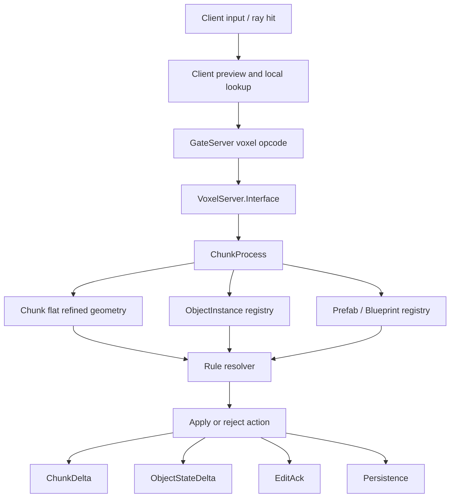

# 体素蓝图组合与场景归属设计 (2026-04-25)

## 1. 背景

现有体素链路已经具备 refined micro occupancy、prefab definition / instance、`microPartIds`
和 socket-free boundary snap 的雏形。前序文档包括：

- `docs/2026-04-20-体素世界服务端规划.md`：服务端 authority、chunk 同步、冲突和持久化方向。
- `docs/2026-04-24-web-client-prefab-microgrid-snapping-design.md`：几何贴合、micro occupancy union 和事务式 overlap check。
- `docs/2026-04-24-web-client-prefab-microgrid-jump-implementation.md`：浏览器端 refined prefab / microgrid 当前实现记录。

本设计补充一个核心问题：大 prefab 需要作为整体放置和编辑，但运行时又必须能按最小物件或 part
被命中、破坏、交互和同步。结论是：

```text
蓝图层级不拍扁。
固化到场景的体素几何拍扁。
拍扁后的每个 occupied micro slot 保留 provenance，用于反查物件和 part。
```

换言之，运行时不应把整个大 prefab 变成一个不可拆的大块，也不应每次命中都递归解析 prefab
树。运行时应从 chunk truth 的 micro slot 直接反查 `ownerObjectId -> part -> tags / affordances`。

## 2. 术语

| 术语 | 含义 |
| --- | --- |
| Blueprint / Composite Prefab | 可编辑的 prefab / assembly 蓝图，保留子物件层级、相对 transform、编辑器选择关系。 |
| AssemblyInstance | 场景中一次“大组合”放置的实例，例如一栋房子。它用于整体选择、归属、权限、批量移动或删除。 |
| ObjectInstance | Assembly 内可独立交互、破坏、修复或持久化状态的最小物件，例如一扇门、一扇窗、一段楼梯、一根梁。 |
| Part | Object 内更细的语义区域，例如门把手、门板、铰链、墙面、支撑点。 |
| Micro slot | 几何占用和 provenance 的最小空间单位。 |
| Chunk truth | 服务端和客户端同步的体素几何真相层。渲染、碰撞、命中和同步都从它派生。 |

## 3. 建造与吸附规则

为了允许用户随意组合 prefab，tag 不参与建造合法性裁决。v1 的硬规则只保留几何条件：

1. prefab anchor 必须落在整数 world micro 坐标上。
2. incoming occupied micro slot 不得与已有 occupied slot 重叠。
3. boundary contact 可作为默认吸附偏好；是否允许无接触自由放置由编辑模式决定。
4. commit 必须是事务式的：任意受影响 macro / chunk 失败，则整次放置失败。

tag 的职责是 post-placement gameplay，而不是 placement gate：

- `roof / wall / stairs / door / support` 等 tag 用于破坏、魔法、AI、互动和修复。
- socket 可以继续作为资产语义兼容层或编辑辅助，但不能阻止几何上合法的组合。
- 组合关系由 geometry 和 provenance 决定，玩法语义由 tag / affordance 决定。

## 4. 组合模型

### 4.1 蓝图层保留层级

蓝图可以是递归的、分层的、可编辑的：

```text
house_blueprint
  wall_north
  wall_south
  roof
  door
    handle
    hinge
  window_01
  stairs
```

蓝图层用于：

1. 编辑器展示、层级选择和局部调整。
2. 保存为可复用的大 prefab。
3. 统一放置时生成 AssemblyInstance 和 ObjectInstance。
4. 重新编辑或导出资产时保留作者意图。

### 4.2 场景层生成实例身份

放置一个 composite prefab 时，不是只生成一个不可拆的 prefab instance，而是生成：

```text
AssemblyInstance
  id
  blueprint_id
  anchor_micro_coord
  rotation
  owner_player_or_guild
  state

ObjectInstance[]
  id
  assembly_id
  source_blueprint_node_id
  source_prefab_id
  local_transform
  world_bounds
  health / state / flags
```

`ObjectInstance` 是运行时最小可聚类对象。玩家命中一块窗户玻璃时，命中的是 micro slot，
但规则结算应聚合到 `window_01` 这个 object；玩家打坏门把手时，结算可以进一步落到 `door.handle`
这个 part。

### 4.3 Chunk 几何拍扁

真正写入 chunk 的几何是 flat refined occupancy。拍扁不等于丢失身份。每个 occupied micro slot
都应能反查来源：

```text
FRefinedCellData
  microOccupancyMask
  microMaterialIds
  microStateFlags
  microPartIds
  microOwnerObjectIds
  microOwnerAssemblyIds?  # 可选；可从 object 反查 assembly 时不必逐槽保存
  prefabInstanceIds       # 可继续作为 cell 级摘要或兼容字段
```

`microPartIds` 单独不足以支持嵌套组合，因为 part id 通常是 prefab / object 局部编号；同一个 macro
中可能存在多个 child object。必须增加 slot provenance，例如 `microOwnerObjectIds`，才能区分：

```text
slot 12 -> object window_01 -> part glass
slot 13 -> object wall_north -> part wall_surface
slot 14 -> object door -> part handle
```

线格式不一定要按数组逐槽传输。服务端可以用压缩形式表达：

```text
owner_layers[] {
  object_id
  part_id
  occupancy_mask
}
```

客户端导入后再展开成方便命中和调试的 per-slot lookup。

## 5. 运行时命中与破坏

运行时 action flow：

```text
raycast / explosion / spell area
-> chunk coord + macro coord + micro coord
-> refined cell lookup
-> ownerObjectId
-> ObjectInstance state
-> partId + partTags + affordances
-> rule resolution
-> chunk delta + object state delta
```

典型玩法：

| 玩法 | 结算方式 |
| --- | --- |
| 打碎窗户 | 命中 `window_01.glass`，清理该 object 或该 part 的 occupied slots。 |
| 破坏门把手 | 命中 `door.handle`，更新 door object state；不必摧毁整扇门。 |
| 开门 | 更新 door state，必要时将 closed occupancy 替换为 open occupancy。 |
| 爆炸 | 收集半径内 micro slots，按 ownerObjectId 聚合伤害，再按 part tag 做倍率。 |
| 火焰 | 命中 `burnable / wood / cloth` tag 后传播到同 object 或邻接 object。 |
| 修复 | 通过 ownerObjectId 找回 blueprint/source prefab，恢复被清除的 slots 或 part state。 |

micro slot 是空间证据，不一定是玩法最小单位。默认建议：

1. 交互最小单位：ObjectInstance。
2. 局部破坏最小单位：Part。
3. 挖掘/凿除类工具才直接操作 micro slot。

## 6. 服务端同步与持久化

服务端仍应以 chunk 为几何 authority，以 object/assembly 为语义 state authority。



建议同步分层：

1. `ChunkSnapshot / ChunkDelta`：同步 flat geometry、material/state、part/provenance payload。
2. `ObjectStateSnapshot / ObjectStateDelta`：同步 object health、destroyed、open/closed、burning 等状态。
3. `AssemblySnapshot / AssemblyDelta`：同步整体归属、权限、移动、删除、蓝图版本。
4. `EditAck`：返回 action seq、结果码、冲突原因和 authoritative cell/object。

冲突判断的 `base_hash` 不应只覆盖 cell mode 和 occupancy，还应覆盖 object / part 相关版本：

```text
base_hash = hash(
  cell_mode,
  micro_occupancy,
  micro_materials,
  micro_state_flags,
  micro_part_ids,
  micro_owner_object_ids,
  object_state_version
)
```

成功时广播 chunk delta + object state delta。失败时返回 conflict，并给 actor authoritative cell/object，
客户端回滚预测。

跨 chunk 的大 prefab 放置或破坏应由 assembly anchor chunk 或专门 coordinator 做事务协调。初版可采用：

1. 计算 affected chunks。
2. 按 chunk coord 固定顺序 validate。
3. 全部 validate 成功后 commit。
4. 任一 chunk 失败则全部拒绝，不留下半个 assembly。

## 7. 真实尺寸建议

建议正式尺度：

```text
1 macro = 1 meter
MicroPerMacro = 8
1 micro = 12.5 cm
1 chunk = 16 macro = 16 meters
```

理由：

1. 第三人称 MMO 角色高度约 1.7-1.9 macro，尺度直观。
2. 门、墙、楼梯、窗户等建筑部件能用 macro 表示主体，用 micro 表示厚度和局部细节。
3. `12.5 cm` 足够表达墙厚、台阶、窗框、圆柱和局部破坏。
4. `16 m` chunk 便于 AOI、服务端 chunk process 和客户端 meshing 分块。

如果继续使用早期服务端 / UE 文档中的 `MicroPerMacro=4`，则 `1 micro = 25 cm`。这适合粗粒度方块，
但会限制曲面、薄墙、楼梯和局部破坏。浏览器端当前已经采用 `8x8x8` refined payload，未来接入服务端
voxel authority 前应统一量化参数或引入显式协议协商；不应默认两端一致。

## 8. 可观测性与验收入口

实现时必须保留非 GUI 调试面。建议 CLI / observe 覆盖：

| 命令 / 事件 | 用途 |
| --- | --- |
| `object_at <world-micro>` | 返回 ownerObjectId、assemblyId、partId、tags、state。 |
| `part_at <world-micro>` | 返回 part tag / affordance 解析结果。 |
| `assembly_snapshot <assembly-id>` | 查看 assembly、child objects、covered chunks。 |
| `object_damage_preview <object-id> <amount>` | 预览会清理哪些 slots、影响哪些 chunks。 |
| `object_destroy <object-id>` | 调试用提交 object destroy，返回 chunk delta 摘要。 |
| `voxel_observe` event | 记录 action kind、actor、target object、part、affected chunks、result_code、conflict reason。 |

验收时不只看画面。至少要能证明：

1. 大 prefab 能作为一个 assembly 一次放置。
2. 命中 micro 后能反查 object 和 part。
3. 删除一个 child object 只清理它拥有的 slots。
4. 同一 macro 内多个 child object 的 provenance 不混淆。
5. 服务端冲突时能返回 authoritative object/cell 并让客户端回滚。

## 9. 已收敛决策

1. 建造合法性由 geometry 决定，不由 tag 决定。
2. 蓝图 / composite prefab 保留层级。
3. 场景 chunk truth 使用 flat refined geometry。
4. flat geometry 必须保留 per-micro provenance。
5. 运行时破坏和交互通过 `ownerObjectId -> part -> tags / affordances` 解析。
6. `microPartIds` 不足以支撑嵌套破坏；需要 `microOwnerObjectIds` 或等价压缩结构。

## 10. 后续开放点

1. `ObjectInstance` 的状态字段需要独立设计：health、damage mask、open/closed、burning、ownership 等。
2. provenance wire format 需要在易调试数组和高效 bitmask layer 之间取平衡。
3. 保存为新 prefab 时，是否保留完整 child graph，还是同时保存 compiled payload，需要定义资产版本策略。
4. 跨 chunk assembly 的事务协调可以先保守实现，后续再按性能压力优化。
