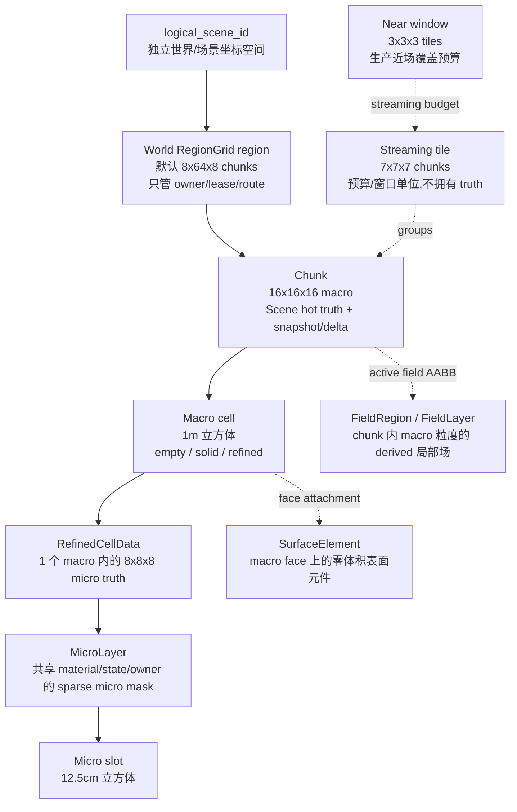

# 体素尺寸定义及名词解释

> 更新日期: 2026-06-28
>
> 本文记录当前仓库已经落地的体素尺度、坐标层级和容易混淆的名词边界。实现真相源以
> `SceneServer.Voxel.Types`、`SceneServer.Voxel.Storage`、
> `WorldServer.Voxel.RegionGrid`、`clients/web_client/src/voxel/core/constants.ts`
> 以及线协议文档为准。

## 尺度总表

| 层级 | 当前名称 | 每轴数量 | 物理边长 | 总格数 | 主要用途 |
| --- | --- | ---: | ---: | ---: | --- |
| 世界单位 | `unit` / cm world unit | - | 1 cm | - | movement、相机、Three.js 渲染尺度 |
| 宏格 | `macro` / `macro cell` | 1 | 100 cm = 1 m | 1 | chunk 内的基础权威 cell、碰撞和大多数场计算粒度 |
| 微格 | `micro` / `micro slot` | 每个 macro 8 | 12.5 cm | 每个 macro 512 | refined cell、prefab raster、局部破坏和 object provenance |
| Chunk | `chunk` | 16 macro | 16 m | 4096 macro | Scene 热真相、快照、delta、AOI 订阅单位 |
| Tile | `tile` / production streaming tile | 7 chunk | 112 m | 343 chunk / 1,404,928 macro | 生产流式预算和近场窗口估算单位, 不是权威存储单位 |
| 近场窗口 | `near window` / `27 tiles` | 3 tile | 336 m | 27 tile / 9,261 chunk / 37,933,056 macro | 生产目标的客户端近场覆盖预算 |
| World region | `RegionGrid` region | 默认 8x64x8 chunk | 默认 128m x 1024m x 128m | 默认 4096 chunk | World 控制面所有权、租约、路由单位 |
| FieldRegion | `FieldRegion` | chunk 内 inclusive AABB | 1m macro 粒度 | 最大 4096 macro | 局部场活跃计算区域, 不是 World region |

当前固定参数:

- `1 unit = 1 cm`。
- `MacroWorldSize = 100.0`, 即客户端渲染里一个 macro 的边长是 100 cm。
- `chunk_size_in_macro = 16`。
- `micro_resolution = 8`。
- 一个 refined macro 的 occupancy 是 `512 bits = u64[8]`。
- 生产流式预算中 `1 tile = 7^3 chunks = 112m`。

## 层级关系



## 世界单位和宏格

`unit` 是厘米单位, 主要用于 movement、角色尺寸、相机和客户端渲染。Phase A2 已经把真实尺度对齐到:

- `1 macro = 100 unit = 100 cm = 1 m`。
- 角色高度 `AvatarConstants.HeightCm = 170`, 半高 `85 cm`。
- 默认服务端 movement profile 使用 cm/s、cm/s^2 这一套单位。

`macro` 是体素世界最基础的权威格子。一个 macro 是边长 1m 的立方体。大多数 chunk header、normal block、field layer、环境增量和 wire 里的 `macro_index` 都以 macro 为粒度。

一个 macro cell 在 chunk storage 中有三种主要形态:

| 形态 | 含义 | 是否占用几何 |
| --- | --- | --- |
| `empty` | 空格 | 否 |
| `solid` | 整个 1m macro 被一个 normal block 占据 | 是 |
| `refined` | 该 macro 内部展开为 8x8x8 micro slots | 由 micro occupancy 决定 |

`MacroCellHeader` 持有 cell 的模式、payload index、`cell_version` 和 `cell_hash`。`RefinedCellData` 本身不重复保存 local macro 坐标和 micro resolution, 这些属于 chunk envelope。

## 微格和 refined cell

`micro` 是 macro 内的细分体素。当前 `micro_resolution = 8`, 所以:

- 一个 macro 每轴 8 个 micro。
- 一个 micro 边长 `100cm / 8 = 12.5cm`。
- 一个 macro 内共有 `8 * 8 * 8 = 512` 个 micro slots。
- 一个 micro slot 用 `micro_index = x + y * 8 + z * 8 * 8` 编码, 范围 `0..511`。

`RefinedCellData` 是一个 refined macro 的权威 micro truth:

- `occupancy_words`: `u64[8]`, 所有 layer mask 的并集。
- `layers`: `MicroLayer[]`, 每个 layer 是一组 sparse micro slots。
- `object_refs`: 从 layer owner 派生出来的 object 覆盖索引。
- `boundary_cache`: refined cell 边界相关缓存。

`MicroLayer` 的关键语义是:同一个 layer 内所有 micro slots 共享
`material_id / state_flags / health / attribute_set_ref / tag_set_ref / owner_object_id / owner_part_id`。
因此 object provenance 是 layer 级别的, 没有独立的 per-slot owner 字段。两个 layer 如果属性签名完全相同, 必须合并;一个 micro slot 不能同时属于多个 layer。

## Chunk

`chunk` 是 Scene 侧热真相和网络同步的核心单位:

- 一个 chunk 每轴 16 个 macro。
- 一个 chunk 物理边长 `16m`。
- 一个 chunk 共有 `16^3 = 4096` 个 macro headers。
- 如果把整个 chunk 都 refined, 等价 micro 网格每轴是 `16 * 8 = 128` 个 micro, 但实现上不保存 dense micro chunk, 只保存被 refined 的 macro payload。

chunk 坐标 `chunk_coord = {cx, cy, cz}` 是有符号整数, wire 上按 i32 边界处理。chunk 的世界 macro 半开范围是:

```text
min_world_macro = chunk_coord * 16
max_world_macro = (chunk_coord + 1) * 16
range           = [min_world_macro, max_world_macro)
```

本仓统一使用 floor division 处理负坐标, 因此 `-1` 号世界 macro 会落在 `chunk_coord = -1` 的本地 `15` 号 macro, 不会向 0 截断。

local macro 坐标范围是 `{0..15, 0..15, 0..15}`。macro index 公式是:

```text
macro_index = x + y * 16 + z * 16 * 16
```

`macro_index` 范围是 `0..4095`。

## Tile 和近场窗口

`tile` 是生产流式预算口径, 不是当前 chunk storage、World lease、DataService persistence 或
FieldRuntime 的新 authority 层。它用于讨论客户端近场窗口、diff 数据量、带宽预算和大范围基线更新。
当前排查与设计先按 `1 tile = 7x7x7 chunks`、`27 tiles = 3x3x3 tiles` 这个口径推进;数据量大的问题后期实际碰到吞吐瓶颈再用 observe/CLI 量化,不作为当前 streaming / editability bug 的默认解释。

当前冻结口径:

- `1 tile = 7 * 7 * 7 chunks = 343 chunks`。
- 一个 tile 每轴 `7 chunks * 16m = 112m`。
- 一个 tile 包含 `343 * 4096 = 1,404,928` 个 macro cells。
- 若每个 macro 都 refined, 理论上对应 `1,404,928 * 512 = 719,323,136` 个 micro slots；这只是上限估算, 实现不会把 tile 保存成 dense micro 体。

生产近场窗口口径:

- `27 tiles = 3 * 3 * 3 tiles`。
- 每轴 `3 tiles * 112m = 336m`。
- 合计 `27 tiles = 9,261 chunks = 37,933,056 macro cells`。
- 玩家按 A2 后服务端跑速 `6m/s` 穿过一个 tile 边长约 `112m / 6m/s = 18.67s`。
- 跨过一个 tile 边界时, 若旧窗口保留并只补新增区域, 新增面是 `3 * 3 = 9 tiles`, 不是整个 `27 tiles`。

阶段边界:

- 大体素包、广域重写、全量 tile 更新不进入 scene runtime 热路径。
- 这类数据属于启动器/更新阶段或入场前 baseline 校验阶段。
- 进入场景后只流送已验证基线之上的 runtime diff、semantic diff、prefab/object/event diff。
- 当前 Voxia debug/interactive 近场 `SubscribeRadius = 3 chunks` 正好是 `7^3 = 343 chunks`, 数量等于 `1 tile`, 但它仍是当前实现的 chunk 订阅窗口, 不能直接等同于生产 `27 tiles` 近场目标。

## 世界 micro 坐标

`world_micro` 是离散的世界微格坐标, 不是厘米单位, 也不是微米单位。它用于 prefab anchor、typed edit intent 和 object persistence。

换算关系:

```text
world_macro = chunk_coord * 16 + local_macro
world_micro = world_macro * 8 + local_micro
```

反向拆分:

```text
world_macro = floor_div(world_micro, 8)
local_micro = floor_mod(world_micro, 8)
chunk_coord = floor_div(world_macro, 16)
local_macro = floor_mod(world_macro, 16)
```

一个 `world_micro` 轴步长对应 `12.5cm`。例如 `anchor_world_micro: {20 * 8 + 3, 84, 164}` 表示 prefab 或对象的锚点落在世界 micro lattice 上, 服务端会再把它 rasterize 成 `{chunk_coord, local_macro, micro_slot}` 写入对应 chunk。

## World RegionGrid region

`WorldServer.Voxel.RegionGrid` 的 region 是 World 控制面单位, 负责:

- 区域 owner 分配。
- Scene lease 签发和续约。
- Gate/World/Scene 路由。
- region 迁移和写入围栏。

它不保存 chunk 内容, 不运行体素 tick, 也不是 field runtime 的 `FieldRegion`。

默认 grid 是:

```text
Sx = 8 chunks
Sy = 64 chunks
Sz = 8 chunks
```

因此默认物理尺寸是:

```text
X/Z: 8 chunks * 16 macro * 1m = 128m
Y:   64 chunks * 16 macro * 1m = 1024m
```

region index 由 chunk 坐标 floor division 得到:

```text
region_index = {
  floor_div(cx, Sx),
  floor_div(cy, Sy),
  floor_div(cz, Sz)
}
```

region bounds 是 chunk 坐标的半开 AABB:

```text
bounds_chunk_min = region_index * {Sx, Sy, Sz}
bounds_chunk_max = (region_index + 1) * {Sx, Sy, Sz}
range            = [bounds_chunk_min, bounds_chunk_max)
```

`region_id` 是全局唯一整数, 会把 `logical_scene_id` 和 signed `region_index` 打包进 63 bit, 用于 ledger、lease、DataService write-token。当前 bit budget 允许:

- `logical_scene_id`: `0..16_777_215`。
- `region_index_x/z`: `-32_768..32_767`。
- `region_index_y`: `-64..63`。

超出 budget 时必须显式失败, 不能把远处 region 静默 alias 到近处 region。

## FieldRegion 和 FieldLayer

`SceneServer.Voxel.Field.FieldRegion` 是绑定在单个 chunk 上的局部场活跃区域。它是 derived runtime state, 不等同于 World 的 ownership region。

FieldRegion 的尺寸语义:

- `chunk_coord`: 它所属的 chunk。
- `aabb`: chunk 内 local macro inclusive AABB, 每轴范围 `0..15`。
- `aabb_cell_count = (max_x - min_x + 1) * (max_y - min_y + 1) * (max_z - min_z + 1)`。
- 最大覆盖整个 chunk, 即 `16^3 = 4096` 个 macro cells。

`FieldLayer` 是 chunk 内 macro 粒度的场层:

- 每层固定有 `4096` 个 macro cell 槽位。
- 内部保存相对 baseline 的 sparse delta。
- temperature baseline 当前是 `20°C`。
- wire 下发 `FieldRegionSnapshot` 时只发送 active macro cells 的稀疏并集。

当前 field 类型包括:

- `temperature`
- `electric_potential`
- `electric_current`
- `ionization`
- `light`
- `light_color`

局部场 kernel 只能演化 `FieldRegion / FieldLayer` 并产出结构化 `FieldEffect`。如果要写回 voxel truth, 必须交给 `ChunkProcess` 作为 chunk authority 执行。

## SurfaceElement

`SurfaceElement` 是 macro 某一个 face 上的零体积表面元件:

- 唯一键是 `{macro_index, face}`。
- `face` 是 `:x_neg / :x_pos / :y_neg / :y_pos / :z_neg / :z_pos` 之一。
- 不进入 occupancy mask。
- 不改变宿主 macro 的邻接、碰撞或面剔除。
- 状态通过 per-face `attribute_set_ref` / `tag_set_ref` 表示。

因此 surface element 不是 micro voxel, 也没有 12.5cm 的体积。它的空间归属是宿主 macro 的一个面。

## Prefab 和 object 尺度

Prefab / object 不是新的体素尺度层级, 而是使用已有 lattice 表达形状:

- prefab blueprint 使用 `micro_resolution = 8` 的局部 micro footprint。
- placement 使用 `anchor_world_micro` 作为 signed i64 世界微格锚点。
- rasterize 后得到多个 `{chunk_coord, local_macro, micro_slot, layer_attrs}` 写入。
- 写入的 `MicroLayer.owner_object_id / owner_part_id` 是 object provenance 的权威来源。
- `ChunkObjectRef` / `ObjectCoverRef` 是从 layer truth 派生出来的覆盖索引。

Prefab 可以跨 macro、跨 chunk、跨 World region。跨边界时由 Gate + World 规划 transaction participants, Scene 只写自己 lease 内的 chunk。

## 容易混淆的名词

| 名词 | 不是 | 正确定义 |
| --- | --- | --- |
| `unit` | 不是 voxel 层级 | 厘米单位, 用于 movement/render 数值 |
| `macro` | 不是 chunk | 1m 立方体, chunk 内基础 cell |
| `micro` | 不是厘米 | macro 内 8 分辨率的离散 slot, 12.5cm |
| `world_micro` | 不是微米 | 世界微格坐标, 1 步 = 12.5cm |
| `chunk` | 不是所有权 region | 16m 立方体, Scene 热真相和网络同步单位 |
| `tile` | 不是 chunk、不是 RegionGrid region、不是贴图 atlas tile | 7x7x7 chunks 的生产流式预算单位 |
| `27 tiles` | 不是 27 chunks | 3x3x3 tile 的生产近场窗口, 共 9,261 chunks |
| `RegionGrid region` | 不是体素数据块 | World 控制面 owner/lease/route 单位 |
| `FieldRegion` | 不是 World region | 单 chunk 内局部场计算 AABB |
| `SurfaceElement` | 不是 refined micro | macro face 上零体积表面层 |

## 代码和协议真相源

- `clients/web_client/src/voxel/core/constants.ts`: `MacroWorldSize`, `VoxelConstants`, `AvatarConstants`。
- `apps/scene_server/lib/scene_server/voxel/types.ex`: chunk/macro/micro 坐标和 index 公式。
- `apps/scene_server/lib/scene_server/voxel/storage.ex`: chunk storage v1 固定参数和 refined mutation 语义。
- `apps/scene_server/lib/scene_server/voxel/refined_cell_data.ex`: refined cell invariants。
- `apps/scene_server/lib/scene_server/voxel/micro_layer.ex`: micro layer mask 和 provenance 语义。
- `apps/scene_server/lib/scene_server/voxel/surface_element.ex`: 表面元件零体积语义。
- `apps/scene_server/lib/scene_server/voxel/field/field_region.ex`: FieldRegion AABB 和 field type。
- `apps/scene_server/lib/scene_server/voxel/field/field_layer.ex`: FieldLayer 4096 macro cell 语义。
- `apps/world_server/lib/world_server/voxel/region_grid.ex`: World region grid 尺寸、bounds 和 `region_id` 编码。
- `docs/2026-04-10-线协议规范.md`: voxel v1 canonical 参数和 field wire layout。
- `docs/2026-06-25-voxel-world-production-architecture.md`: 生产 tile 口径、近场窗口和阶段边界。
- `docs/00-current-truth/design/voxel/README.md`: 当前事实文档中的 tile 预算口径。
- `docs/00-current-truth/design/client/streaming-lod.md`: Voxia 当前 `SubscribeRadius=3 chunks` 近场事实。
