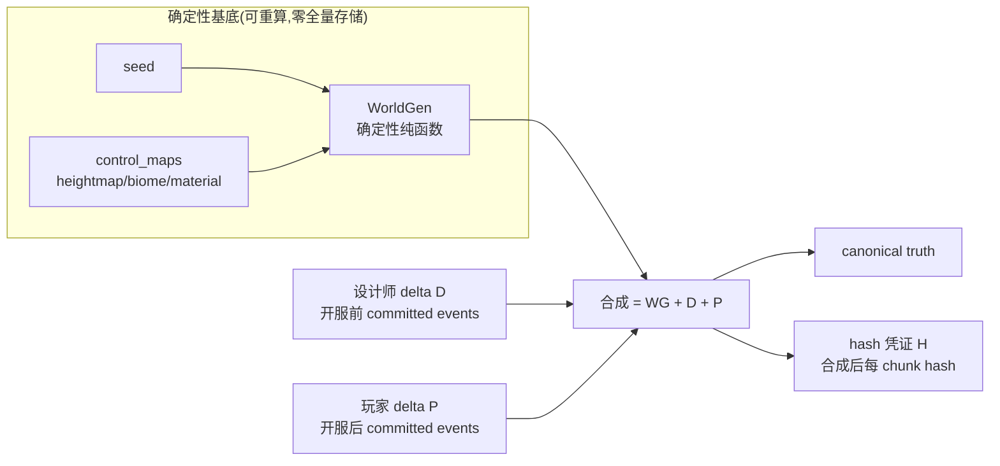
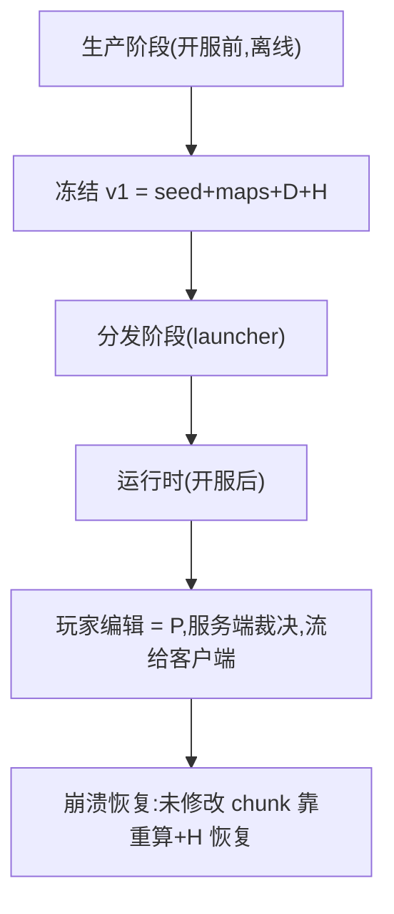
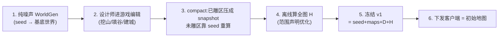
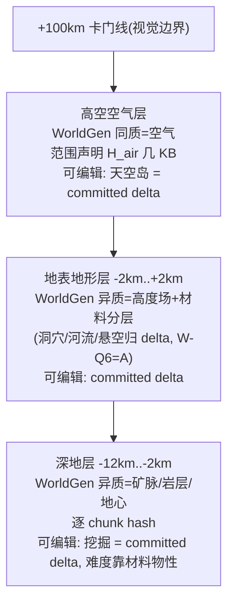
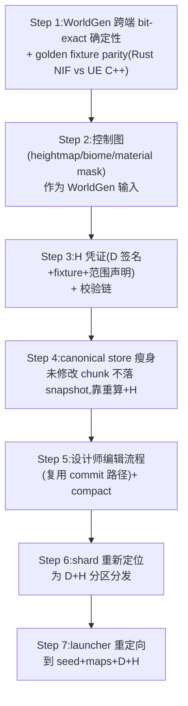

# 2026-06-29 体素 baseline 与流送边界（确定性 WorldGen + committed delta）

> 基线规范:[`docs/30-reference/overview/HEMIFUTURE-MMO-架构设计规范-v2.0.1-冻结稿.md`](../overview/HEMIFUTURE-MMO-架构设计规范-v2.0.1-冻结稿.md)。
> 当前事实入口:[`docs/00-current-truth/design/voxel/README.md`](../../00-current-truth/design/voxel/README.md)、[`docs/00-current-truth/impl/2026-06-29-world-pack-streaming-handoff.md`](../../00-current-truth/impl/2026-06-29-world-pack-streaming-handoff.md)。
> 本文件是"体素世界 baseline 形态与存储/流送边界"的**固化决策稿**。它不否定已有 world-pack/shard 工作，而是把它们从"装全量 chunk payload"重新定位为"装设计师 delta + hash 凭证分区"。
> 工作纪律沿用本目录约定:决策稿先行 → 逐 step commit（`mix format` / 测试）→ 进度日志 → 不 push → 全新系统不留兼容。

---

## 0. 已拍板的定位决策（不可静默推翻；如需变更走附录流程）

| # | 议题 | 决策 | 对实现的含义 |
|---|---|---|---|
| D-1 | baseline 形态 | **确定性 WorldGen + 控制图 + 设计师 delta D + 轻量凭证 H**，不是全量物化 chunk payload | 客户端拿配方本地重算 baseline，对 H 校验；不是下载 4.44 亿 chunk。H = D merkle root 签名 + golden fixture + 范围声明（D-14），非 per chunk hash |
| D-2 | 服务端 canonical store 存什么 | **只存 committed events（D + P）+ H**，不存全量合成 snapshot | storage ∝ 玩家累计修改量，不是 ∝ 世界尺寸；未修改 chunk 靠重算 + H 恢复 |
| D-3 | 客户端本地算是否违反"服务端权威"铁律 | **不违反**:WorldGen 是确定性纯函数，服务端也算同一结果，H 校验保权威 | 客户端本地算 = 零下载 + 快；truth 仍由服务端 H 确认；与"移动预测 + 服务端校正"同模式 |
| D-4 | WorldGen 在生命周期里的地位 | **从一次性 migration 升级为长期可用的确定性真值生成器** | 跨端 bit-exact、content_version 锁定、版本/确定性/控制图一致性是长期不变量 |
| D-5 | 初始地图定义 | **初始地图 v1 = seed + control_maps + D + H**，不是全量 chunk | 下发体积几百 MB ~ 1GB；设计师编辑复用玩家权威 commit 路径 |
| D-6 | 垂直可编辑性与 hash 分层的关系 | **正交解耦**:可编辑区 = 整个世界，无高度限制；hash 分层由 WorldGen 异质性决定，不由可编辑性决定 | 可编辑性走 delta 模型（storage ∝ 修改量）；hash 异质层逐 chunk，同质层范围声明 |
| D-7 | 已有 WorldPackBootstrapper/shard/verifier 的去留 | **重新定位，不废弃**:从"装全量 chunk payload"改为"装 D 分区 + H 分区" | footer-table random access、release verifier、coverage probe 机制复用，校验对象换 D+H+合成 hash |
| D-8 | 可编辑垂直范围 | **全高度可编辑（-12km..+100km）**，与世界区域重合，不内缩 | 玩家在任何高度都能改；深地可挖到地心；高空可建天空岛到卡门线 |
| D-9 | 深地可挖性与难度控制 | **允许挖到地心，不设高度墙**；难度靠材料物性涌现（越深越硬/热/危险） | 深地属 WorldGen 异质层（矿脉/岩层/地心），逐 chunk hash；难度归 Phase 8 材料物性，不是硬性高度限制 |
| D-10 | 设计师雕区占比 | **不工具强制**；靠设计师精力自然约束（开服内容少） | D 天然稀疏；"自然地形靠 seed"保留为指导原则，不做强制 |
| D-11 | WorldGen 控制图格式 | **参考 Minecraft 分层 + 本项目材料物性层 + 跨端确定性** | heightmap/biome/气候/矿脉分布（参考 MC）+ 电导/热容/硬度等材料物性图（服务涌现）+ bit-exact |
| D-12 | hash 长度 + 分区粒度 | **从头设计，以最契合本项目为准** | 不沿用现有 .vxpack shard 粒度；hash 位数/分区/范围声明统一设计（Step 3 输入） |
| D-13 | compact 时机 | **开服前一次 + 运行时定期合并** | 运行时 compact 与 checkpoint 合并，P 累积到一定量后压成新 baseline + high-watermark |
| D-14 | hash 凭证 H 的形态 | **D merkle root 签名 + golden fixture + 范围声明**，非 per chunk hash | 客户端能复算 WorldGen（D-4）+ 有 D（下发），只需校验 D 完整性（签名）+ WorldGen 实现一致性（fixture）；H 从 58GB 降到 KB-MB |

---

## 1. 三句话总览

1. **当前全量物化路线不可持续**:32km full authority = 4.44 亿 chunk，per-chunk ~160KB 裸序列化 → 71TB；上 palette/zstd/空 chunk sentinel 能压到 15-20TB，但仍随世界尺寸立方增长，且丢掉了体素"程序生成"的根本优势。71TB 是 pressure test 的"不能这么干"反证，不是目标态。
2. **正路是 Minecraft 路线的 MMO 适配**:baseline = `WorldGen(seed, maps, coord) + 设计师 delta D`，可重算、零全量存储；只存 D + 玩家 delta P + hash 凭证 H；客户端本地算 baseline + 对 H；storage ∝ 修改量。
3. **关键钥匙是 WorldGen 跨端 bit-exact 确定性**:没有它就不敢不落全量 snapshot，就只能全量物化（这正是当前 handoff 推 16384 shard 的内在逻辑）；建立了它才能让 canonical store 瘦身到只存 delta。

---

## 2. 问题诊断:当前全量物化路线为什么不可持续

证据来自 [`2026-06-29-world-pack-streaming-handoff.md`](../../00-current-truth/impl/2026-06-29-world-pack-streaming-handoff.md) pressure test:

| 项 | 当前路线（全量物化） | 问题 |
|---|---|---|
| baseline 形态 | 4.44 亿 chunk 全落 canonical snapshot + 16384 `.vxpack` shard | 随世界尺寸立方增长 |
| 单 chunk 体积 | ~160KB 裸序列化（`codec.ex` 无 palette/zstd/空 chunk sentinel） | 偏大，但即便压到 30-50KB 仍随尺寸增长 |
| 全量体积 | 71TB（裸）/ 15-20TB（压缩后） | 不可接受 |
| 跑批时间 | pressure test vertical100 = 0.34 chunk/s | 32km 全量跑批数百天级 |
| 稳态存储 | ∝ 世界尺寸 | 玩家走遍全图即趋全量物化 |
| 与体素优势 | 把世界当 mesh 资产分发 | 丢掉程序生成根本优势 |

**根因**:当前 WorldGen 跨端确定性未建立，ChunkProcess 不敢靠重算，只能靠 snapshot 兜底（`缺 authoritative snapshot 即 voxel_chunk_materialization_failed`），于是只能全量物化。71TB 不是"目标态设计"，是"确定性 WorldGen 建立之前的被迫过渡"。

---

## 3. 核心模型:世界 = 确定性基底 + committed delta



世界恢复模型（继承 voxel/README.md）:

```
world(N) = WorldGen(seed, maps, coord) + D + P(1..N)
```

- `WorldGen(seed, maps, coord)`:确定性纯函数，服务端/客户端 bit-exact 重算。
- `D`:开服前设计师编辑冻结的 committed events（稀疏雕刻）。
- `P`:开服后玩家 committed events（服务端持续维护、权威）。
- `H`:轻量 baseline 校验凭证 = D merkle root 签名 + golden fixture + 范围声明（D-14）。非 per chunk hash——客户端能复算 WorldGen + 有 D，只需校验 D 完整性 + WorldGen 实现一致性。
- 合成后 chunk snapshot = 派生视图，**可重算，不持久化**。

---

## 4. 三个边界（存储 / 流送 / 计算）

### 4.A 存储边界

| 数据 | 服务端存 | 客户端存 | 性质 |
|---|---|---|---|
| `seed + control_maps` | ✓（几 MB） | ✓（launcher 下载） | 静态基底配方 |
| `D` 设计师 delta | ✓（committed events） | ✓（launcher 下载） | 静态雕刻，稀疏 |
| `H` 校验凭证 | ✓（KB-MB：D merkle root + fixture + 范围声明） | ✓（launcher 全量下载，KB-MB） | 校验凭证 |
| `P` 玩家 delta | ✓（**主存，持续增长**） | ✗（只消费流来的） | 运行时 truth |
| 合成后 chunk snapshot | ✗（可重算，不存） | ✗（可重算，不存） | 派生视图 |

**核心边界**:服务端 canonical store 只存 `D + P + H`，不存全量合成 snapshot。storage ∝ 修改量（D+P），不是 ∝ 世界尺寸。

### 4.B 流送边界

| 时机 | 服务端 → 客户端 | 体积 |
|---|---|---|
| launcher 首次/更新 | `seed + maps + D`（含 merkle root 签名）+ `H`（fixture + 范围声明） | 几百 MB ~ 1GB |
| 进场 | 无需额外 hash 分区（H 已全量在客户端，KB-MB） | 0 |
| 运行时窗口 | 玩家 delta `P`（committed events） | KB/s 级 |
| 窗口平移 | 新 chunk 的 `H`（若 D/P 涉及） | 小 |
| **绝不传** | 全量 chunk payload | — |

**核心边界**:launcher 只传配方 + 雕刻 + 凭证；运行时只传玩家 delta。永远不传全量合成 chunk。

### 4.C 计算边界

| 计算 | 服务端 | 客户端 |
|---|---|---|
| `WorldGen(seed, maps, coord)` | 懒物化（首次访问算一次） | 进场/平移本地算 |
| 应用 `D`（设计师雕刻） | 懒物化时 | 本地算 |
| 应用 `P`（玩家 delta） | **持续维护（权威）** | 只消费流来的 |
| hash 校验 | 发布 `H` | 本地算后对 `H` |

**核心边界**:基底 + 雕刻双方都算（确定性，bit-exact）；玩家 delta 只服务端算（权威），客户端只消费。



---

## 5. 初始地图定义与生产流程

### 5.1 初始地图 v1 的精确定义

| 组成 | 内容 | 体积 | 性质 |
|---|---|---|---|
| `seed + control_maps` | 纯噪声基底配方 | 几 MB | 可重算，零 chunk 存储 |
| `D`（设计师 delta） | 开服前 committed events | 几十~几百 MB | 稀疏雕刻，不是全量 |
| `H`（hash index） | 合成后每 chunk hash（范围声明优化） | 几十 GB（分 shard） | baseline 校验凭证 |
| **初始地图 v1** | **seed + maps + D + H** | **几百 MB ~ 1GB** | **下发给客户端** |

### 5.2 生产流程



**关键洞察**:设计师编辑和玩家编辑走**同一条权威 commit 路径**（ChunkProcess commit）。设计师只是在"开服前"做了一大批编辑，这批编辑被冻结成初始 baseline 的一部分。**不需要单独的离线地图编辑器**——设计师就用游戏客户端，走权威 commit，产生 committed events。

### 5.3 compact 流程

设计师雕完后做一次 compact:

- 已雕区域:把"纯噪声 + 大量小 events"压成固化 snapshot（不再靠纯噪声重算那部分）。
- 未雕区域:仍靠 seed 重算，零存储。
- 结果:`D` = 相对纯噪声的净 diff，不随设计师编辑次数膨胀。

compact 与运行时 checkpoint 同构——都是"基底 + many events → 新 baseline + high-watermark"。

---

## 6. 垂直分层与范围声明

### 6.1 关键解耦:可编辑性 ≠ hash 分层

这是 Q-1 拍板揭示的正交解耦（CLAUDE.md "系统正交"原则的应用）:

| 维度 | 含义 | 决定什么 |
|---|---|---|
| **可编辑性** | 玩家能不能在这里改 | 全高度可编辑（-12km..+100km），与世界区域重合，不内缩 |
| **hash 分层** | 这一层要不要逐 chunk 存 hash | 由 WorldGen 产出是否异质决定，与可编辑性无关 |

**解耦的后果**:
- 玩家在任何高度改都产生 committed delta（P），存储 ∝ 修改量，与高度无关——这是 D-2 delta 模型天然支持的，不需要"可编辑高度"限制。
- hash index 体积由"WorldGen 异质层"决定:异质层逐 chunk hash，同质层（如高空空气）范围声明。
- 我曾把"可编辑高度"和"逐 chunk hash 层"绑成 -1km..+2km，是设计缺陷——它把"能不能改"和"hash 要不要逐 chunk"两件正交的事耦合了。Q-1 拍板解耦。

### 6.2 hash 分层布局（面积 32×32km，1 chunk = 16m）

| 层 | 高度范围 | WorldGen 产出 | hash 处理 | 可编辑 |
|---|---|---|---|---|
| 高空空气 | 地形顶..+100km（卡门线） | 同质（纯空气） | 范围声明 `H_air` 几 KB | ✓（天空岛 = delta） |
| 地表地形 | -2km..+2km（地形起伏层，待 Step 2 定） | 异质（高度起伏 + 材料分层；**洞穴/河流/悬空归 delta**，WorldGen v1=2.5D，见 sync-window 设计稿 W-Q6=A） | fixture 抽样校验（D-14，非逐 chunk hash） | ✓ |
| 深地 | -12km..-2km（科拉超深） | 异质（矿脉/岩层/地心） | 逐 chunk hash | ✓（可挖到地心，D-9） |



**为什么深地是异质层**:Q-2 拍板玩家可挖到地心，深地必须有内容（矿脉、岩层变化、地心危险），否则挖空气无意义。有内容 = WorldGen 异质产出 = 逐 chunk hash。深地挖掘难度靠材料物性涌现（越深越硬/热/危险），归 Phase 8，不是高度墙。

### 6.3 H 的组成与极限压缩（D-14）

H 不是 per chunk hash，而是三组成:

| 组成 | 体积 | 作用 |
|---|---|---|
| D merkle root 签名 | 32 B | 防 D 篡改；客户端下载 D 全量后用 root 校验完整性 |
| golden fixture | ~160 KB（1 万样本） | 防 WorldGen 实现 bug；服务端发 `(coord, expected_hash)` 样本，客户端算后比对 |
| 范围声明 | 几 KB | 同质区（高空空气）一个 sentinel hash 覆盖全区 |

**为什么不需要 per chunk hash**:baseline = `WorldGen + D`，客户端能复算 WorldGen（D-4 bit-exact）+ 有 D（下发）。只需校验 D 完整性（merkle root 签名）+ WorldGen 实现一致性（fixture），baseline 即可信。per chunk hash 是冗余校验，3.67 亿 chunk × 16B = 58GB 全是冗余。

**范围声明（高空空气）**:

- `H_air = hash(empty_chunk)`，声明 `{y_min, y_max, baseline_hash: H_air, content_version}` 覆盖高空空气层。
- 客户端进高空 chunk:本地算 → 空气 → 对 `H_air` → 通过。
- 一旦某高空 chunk 被建天空岛，它从范围声明摘出，变成独立 committed delta（进 D 或 P）。范围声明随 content_version 收缩。

**深地精细化（Step 2 控制图决定）**:深地若为"基岩 + 稀疏矿脉"，基岩进范围声明，矿脉作为 WorldGen 异质内容由 fixture 抽样校验。无需深地逐 chunk hash。

**hash 凭证体积对比**:

| 方案 | 服务端 H 体积 | 客户端持有 | 校验方式 |
|---|---|---|---|
| per chunk hash 全高（16B） | ~470 GB | 附近 shard | 逐 chunk |
| per chunk hash 异质层（16B） | ~58 GB | 附近 shard | 逐 chunk |
| **D 签名 + fixture + 范围声明（D-14）** | **KB-MB** | **KB-MB（全量）** | 抽样 + 签名 |

D-14 方案降 5 个数量级，代价是抽样校验（fixture）而非逐 chunk——防实现 bug 靠 fixture + 跨端 CI parity，防篡改靠 D 签名 + WorldGen 确定性，truth 仍服务端权威不受影响。

### 6.4 天空岛与深地挖掘的存储账

两者都是"在 baseline 之上做 committed delta"，存储 ∝ 修改量，与所在层的体积无关:

- **天空岛**:高空 baseline 是空气，一个 `H_air` 声明覆盖全区；天空岛是稀疏 committed delta，建了才存，存储 ∝ 天空岛数量。
- **深地挖掘**:深地 baseline 是 WorldGen 矿脉/岩层（fixture 抽样校验，不逐 chunk hash）；玩家挖掘产生 committed delta，存储 ∝ 挖掘量。
- **未改动的层**:高空未建天空岛 = 零 delta 存储；深地未挖 = 零 delta 存储。H 凭证本身是 KB-MB 固定开销。

大气层 100km 和深地 12km 听起来吓人，但可编辑部分的存储只随"改了多少"走；固定开销只有 H 凭证（KB-MB）。

---

## 7. 与现有实现的关系（重新定位，不废弃）

| 现有组件 | 当前职责 | 新边界下的重新定位 |
|---|---|---|
| `WorldGenMaterializer` / `WorldPackBootstrapper` | 启动时按 bounds 全量物化灌库 | 改为懒物化:chunk 首次被访问时算 `WorldGen(seed, maps, coord)`，未修改不落 snapshot |
| `WorldGen` NIF（Rust terrain noise） | 服务端噪声生成 | 升级为跨端 bit-exact 确定性纯函数，加控制图调制输入 |
| `MmoContracts.WorldPackIndex` / `WorldPackShard` / `.vxpack` footer-table | 装全量 chunk payload + footer random access | 重新定位为装 `D` 分区 + `H` 分区；footer-table 机制复用 |
| `WorldPackArtifactBuilder` / `WorldPackReleaseVerifier` | 全量 release 构建 + shard hash 校验 | 复用；校验对象从"全量 payload hash"改为"D + H + 合成 hash" |
| `DataService.Voxel.ChunkSnapshotStore` | 存全量合成 snapshot（canonical 主路径） | 瘦身:未修改 chunk 不落 snapshot，靠重算 + H；只存 D + P + H |
| `ChunkProcess` 缺 snapshot 即失败 | `voxel_chunk_materialization_failed` | 保留铁律；但缺 snapshot 时先尝试 `WorldGen + D` 重算 + 对 H，通过则不落 snapshot |
| auth manifest / `world_pack_index_v1` 端点 | 全量 compact index + bounds/count 校验 | 改为发布 `seed + maps + D + H`；baseline 校验从"payload hash"改为"本地重算结果 hash 对 H" |
| launcher / `LoadTerrainBaselineWindow` | 下载附近 shard payload seed VoxelStore | 改为下载 `seed+maps+D` + 附近 `H` 分区，本地重算 + 对 H 后 seed VoxelStore |
| `LodProjection` / `AuthoritativeHeightmap` | 远景 LOD 派生自 chunk snapshot | 保留；高空视觉高度延伸到卡门线，只影响 LOD，不存 truth |

**关键**:已有 shard/footer-table/verifier/coverage probe 机制不废弃，只是"装的东西"从全量 payload 换成 D + H。这是 D-7 的核心。

---

## 8. 迁移顺序（从全量物化到 delta 边界）

依赖顺序，不能跳:



| Step | 前置 | 产出 | 验证 |
|---|---|---|---|
| 1 WorldGen 跨端确定性 | 无 | bit-exact `WorldGen(seed, maps, coord)` | golden fixture round-trip parity |
| 2 控制图 | Step 1 | WorldGen 接受控制图调制 | 控制图变化 → chunk 确定性变化 |
| 3 H 凭证（D 签名 + fixture + 范围声明） | Step 2 | D merkle root 签名 + golden fixture + 高空范围声明 | 客户端算 baseline 对 fixture 抽样 + D 签名通过 |
| 4 canonical store 瘦身 | Step 3 | 未修改 chunk 不落 snapshot | 崩溃后重算 + H 恢复 |
| 5 设计师编辑 + compact | Step 4 | D 生产流程 + compact | 设计师编辑 → 冻结 v1 |
| 6 shard 装 D+H | Step 3,5 | shard 重新定位 | verifier 校验 D+H+合成 hash |
| 7 launcher 重定向 | Step 6 | 客户端下载 seed+maps+D+H | 客户端本地算 + 对 H 进场 |

**Step 1 是钥匙**:没有跨端 bit-exact 确定性，后面全部不能做。这正好把 CLAUDE.md 提到的"golden-fixture 跨语言 round-trip parity"从可选变成 baseline 校验地基。

---

## 9. 已拍板决策项（2026-06-29 第二轮）

首轮 Q-1..Q-7 已全部拍板，结论编入 §0 的 D-6/D-8..D-13。回执:

| # | 议题 | 拍板结论 | 编入 |
|---|---|---|---|
| Q-1 | 可编辑垂直范围 | 全高度可编辑，与世界区域重合，不内缩；揭示"可编辑性 ≠ hash 分层"正交解耦 | D-6, D-8 |
| Q-2 | 深地可挖性 | 允许挖到地心，不设高度墙；难度靠材料物性涌现 | D-9 |
| Q-3 | 高空可建造上限 | 被 Q-1 吸收:高空可建造 = 高空可编辑，上限 = 世界顶（卡门线 100km） | D-8 |
| Q-4 | D 稀疏纪律 | 不工具强制；靠设计师精力自然约束 | D-10 |
| Q-5 | 控制图格式 | 参考 Minecraft 分层 + 本项目材料物性层 + 跨端确定性 | D-11 |
| Q-6 | hash 长度 + 分区粒度 | 从头设计，以最契合本项目为准 | D-12 |
| Q-7 | compact 时机 | 开服前一次 + 运行时定期合并 | D-13 |

---

## 10. 测试矩阵

| 测试 | 验证目标 | 入口 |
|---|---|---|
| WorldGen 跨端 bit-exact parity | Rust NIF vs UE C++ 同 `(seed, maps, coord)` 字节级一致 | golden fixture（`apps/scene_server/priv/fixtures/voxel/*.golden`） |
| 控制图调制确定性 | 同控制图 → 同 chunk | 控制图变化 → chunk 确定性变化 |
| H 凭证校验 | D merkle root 签名验证 + fixture 抽样比对 | 客户端算 baseline 对 fixture 通过 + D 签名通过 |
| 范围声明校验 | 高空空气区 `H_air` | 客户端进同质区对 sentinel hash |
| 未修改 chunk 重算恢复 | snapshot 丢失 → 重算 + H 恢复 | 删未修改 chunk snapshot，ChunkProcess 重算 |
| 设计师编辑 → compact → 冻结 v1 | D 生产流程完整 | 设计师 commit 一批编辑 → compact → v1 可下发 |
| 客户端进场闭环 | 本地算 + 对 H + 通过/拒绝 | `LoadTerrainBaselineWindow` 本地算对 H |
| baseline 校验铁律 | 缺包/hash 不匹配拒绝进场 | manifest/world_diff/world_pack gate 测试（已有，扩展到 H） |
| 天空岛存储账 | 高空区零 hash + 天空岛 ∝ 数量 | 建天空岛前后 H 凭证体积（范围声明收缩） |
| 崩溃恢复 durable | ACK 前 P 已 durable | 已有 durable-before-ack 测试（扩展到 P 持久化） |

---

## 11. 风险与纪律

### 11.1 必须守的纪律

1. **D 稀疏是指导原则，不是强制（D-10）**:设计师只雕关键区域（主城、地标、副本、关键地形修整），大片自然地形保持纯噪声基底。如果设计师把整个 32km 都手雕一遍，D 退化成全量物化，回到 71TB。但这靠设计师精力自然约束，不做工具层强制——开服内容少，设计师也雕不了那么多。
2. **WorldGen 版本/确定性/控制图一致性是长期不变量**:这是 CLAUDE.md "自维护不变量"原则要警惕的"一次性建立、之后没人管"资源。服务端升级 WorldGen 但客户端没跟上 → hash 对不上 → 进场被拒。必须由 `content_version` 锁定，有持续维护责任归属。与 known_gaps 里 FieldSource owner 活性、subscription liveness 是**同一类时间性不变量债**。
3. **压缩/hash 不影响 canonical hash 和 CAS**:palette/zstd/空 chunk sentinel 等压缩手段加在 `chunk_hash` 计算之后、存储/传输层，不能让压缩影响 canonical hash 和 CAS 语义，否则破坏 baseline 校验铁律。
4. **客户端本地算不是客户端成为 truth**:truth 仍由服务端 H 确认。客户端本地算只是"零下载 + 快"，不是"我说是就是"。与移动预测 + 服务端校正同模式。

### 11.2 主要风险

| 风险 | 等级 | 缓解 |
|---|---|---|
| 跨 Rust/UE bit-exact 确定性难 | 高 | golden fixture parity 机制已埋桩；浮点/噪声/插值逐项锁定；先建 parity 再瘦身 canonical |
| D 膨胀成全量 | 中 | compact 流程 + 设计师精力自然约束（D-10，不工具强制） |
| WorldGen 版本漂移 | 中 | content_version 锁定 + 持续维护责任 |
| 范围声明与实际合成不一致 | 中 | 范围声明进 baseline 校验链；天空岛摘出时同步收缩声明 |
| 深地挖掘 delta 累积 | 低 | 挖掘是 committed delta，storage ∝ 挖掘量；定期 compact 合并（D-13） |
| fixture 抽样漏检边缘 coord bug | 低 | fixture 覆盖各 WorldGen 路径 + 跨端 CI parity；最坏情况客户端局部表现异常，不污染服务端 truth |

---

## 12. 进度日志

- `2026-06-29`:决策稿落档。七项拍板（D-1..D-7）+ 三边界 + 垂直分层 + 范围声明 + 迁移顺序 + 测试矩阵 + 待拍板 Q-1..Q-7。与 `2026-06-29-world-pack-streaming-handoff.md` 的全量物化路线形成对照:handoff 是"确定性 WorldGen 建立之前的过渡"，本稿是"建立之后的目态"。下一步:Step 1 WorldGen 跨端 bit-exact parity 落地。
- `2026-06-29`(第二轮):Q-1..Q-7 全部拍板，编入 D-6/D-8..D-13。关键修正:Q-1 揭示"可编辑性 ≠ hash 分层"正交解耦——可编辑区 = 整个世界（-12km..+100km），不限高度；hash 分层由 WorldGen 异质性决定。§6 垂直分层重写。深地因 Q-2 可挖到地心且有内容，升级为异质层（逐 chunk hash），难度靠材料物性涌现（D-9）。
- `2026-06-29`(第三轮):H 极限压缩拍板（D-14）。H 从 per chunk hash（58GB）改为 D merkle root 签名 + golden fixture + 范围声明（KB-MB），降 5 个数量级。依据:baseline = WorldGen + D，客户端能复算 WorldGen（D-4）+ 有 D（下发），per chunk hash 是冗余校验。代价:抽样校验（fixture）而非逐 chunk，靠 fixture 覆盖 + 跨端 CI parity 缓解。修正 §6.3 量级错误（全高 16B = 470GB 非 2.3TB）。§6.3/§4/§8/§10/§11 同步。
- `2026-06-30`:§6.2 措辞修正（落实下游 sync-window 设计稿 W-Q6=A 拍板）。地表地形层从「异质=山川河流洞穴 / 逐 chunk hash」改为「异质=高度场+材料分层（洞穴/河流/悬空归 delta，WorldGen v1=2.5D）/ fixture 抽样校验」，消解与 W-Q6=A（2.5D baseline、3D 结构归 delta）的矛盾，并与 D-14（fixture 抽样取代 per-chunk hash）一致。元决策签收：本世界 WorldGen 终局地位=「程序化确定性真值（D-4）」，未来世界 authored 可插拔（承接 6-28 §C），二者各管一段。

---

## 13. 证据源

- [`docs/00-current-truth/design/voxel/README.md`](../../00-current-truth/design/voxel/README.md) — 体素真值、基线与运行时 diff 当前事实
- [`docs/00-current-truth/impl/2026-06-29-world-pack-streaming-handoff.md`](../../00-current-truth/impl/2026-06-29-world-pack-streaming-handoff.md) — world-pack/streaming 当前交接（含 71TB pressure test 反证）
- [`docs/00-current-truth/impl/known_gaps.md`](../../00-current-truth/impl/known_gaps.md) — 已知缺口
- [`docs/10-active/cross-cutting/voxel-server-authority-phase-overview.md`](../../10-active/cross-cutting/voxel-server-authority-phase-overview.md) — 体素权威化实施跟踪
- [`docs/20-archive/voxel-authority/2026-06-14-architecture-triage-and-alignment.md`](../../20-archive/voxel-authority/2026-06-14-architecture-triage-and-alignment.md) — 架构分诊与对齐主线
- [`apps/scene_server/lib/scene_server/voxel/storage.ex`](../../../apps/scene_server/lib/scene_server/voxel/storage.ex) — chunk 运行时存储结构（macro header + payload pool + bitmask + intern pool，即 layer+index+bit）
- [`apps/scene_server/lib/scene_server/voxel/field/field_layer.ex`](../../../apps/scene_server/lib/scene_server/voxel/field/field_layer.ex) — FieldLayer 稀疏 delta + Rust 句柄（derived 不落盘）
- [`apps/scene_server/lib/scene_server/voxel/codec.ex`](../../../apps/scene_server/lib/scene_server/voxel/codec.ex) — chunk snapshot codec（当前无 palette/zstd/空 chunk sentinel，压缩空间）
- [`apps/world_server/lib/world_server/voxel/world_pack_bootstrapper.ex`](../../../apps/world_server/lib/world_server/voxel/world_pack_bootstrapper.ex) — `@default_world_macro_extent 32_768`（32km 目标）
- [`docs/30-reference/protocol/2026-06-28-voxel-tile-budget-runtime-diff-decision.md`](2026-06-28-voxel-tile-budget-runtime-diff-decision.md) — tile 预算口径
- [`docs/30-reference/engineering/2026-06-25-voxel-world-production-architecture.md`](../engineering/2026-06-25-voxel-world-production-architecture.md) — region/world/streaming 目标架构
- [`README.md`](../../../README.md) — "transmit the seed and persist only what changed; pristine terrain costs nothing to store"
