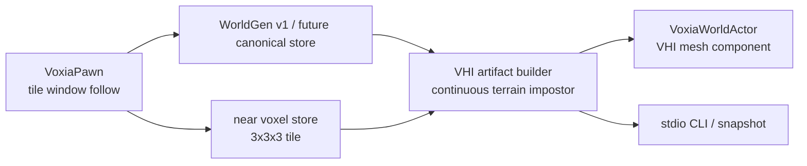

> ⚠️ **本文已失效** — VHI P1/P2 完善已取消；后续“VHI 作为 2.5D baseline”本身又被统一 XYZ cube-shell + canonical near/far 路线取代。现行事实见 [`2026-07-12-pure-3d-voxel-shell-migration.md`](../../10-active/voxel-far-field/2026-07-12-pure-3d-voxel-shell-migration.md)。
> 仅存历史 provenance，**勿作现行依据**。
# Voxia Voxel Hierarchical Impostor 实验计划

> 目标：在保留现有 `L_WorldGenPreview` 与 heightmap LOD 路径的前提下，新建一个独立关卡和启动入口，用 Voxel Hierarchical Impostor（VHI）试验窗口外三维远景显示。

## 决策

1. **新关卡独立**
   - 新关卡：`/Game/Voxia/Maps/L_WorldGenVhiPreview`
   - 新脚本：`clients/Voxia/scripts/create_worldgen_vhi_preview_level.py`
   - 新启动：`clients/Voxia/scripts/launch_worldgen_vhi_preview.js`
   - 旧关卡 `/Game/Voxia/Maps/L_WorldGenPreview`、旧启动脚本和默认 `2.5D heightmap` LOD 保留。

2. **VHI 只做窗口外 visual-only 派生物**
   - 近场仍加载完整 `3x3x3 tile` voxel window。
   - VHI 不参与碰撞、编辑、raycast、confirmed truth 或 H gate。
   - VHI artifact 从 WorldGen / 已确认 voxel store 派生，属于可重建 materialized view。

3. **MVP 算法**
   - 用 XZ tile 作为 impostor 覆盖单元，半径表示窗口外可见远景覆盖，而不是 3D 空/实心 shell 扫描半径。
   - 第一版按 WorldGen voxel occupancy 派生连续 top surface，并在相邻采样高度差处补 riser，避免只看到分离的浮片；未来 canonical voxel VHI 再扩展为真正六向 depth/material envelope。
   - 第一版渲染为远处 tile 的 visual proxy；它比当前只靠几片 sample top plate 更接近连续体素地形，但仍不参与 authority / collision / edit。
   - Artifact 通过 `content_version + worldgen_config + tile_coord + voxel_revision` 形成缓存键；本地 preview 暂以运行时内存缓存替代持久化包。

4. **可观测性**
   - `UVoxiaTransportSubsystem::Snapshot()` 暴露 `vhi` 字段：是否启用、revision、tile count、face count、quad count、中心 tile、半径、inner skip radius。
   - CLI 新增 `vhi` 命令，返回同一份 JSON。
   - observe 事件记录 artifact build：`voxia_vhi_tiles_built`。

## 流程

## 测试矩阵

- `Voxia.Voxel.VhiImpostor`：验证 VHI tile artifact 的确定性、窗口外过滤、XZ 覆盖半径、连续 terrain proxy 和 mesh 非空。
- `Voxia.Gameplay.WorldGenPreviewSpawn`：继续覆盖旧 spawn/tile radius 解析，不改变旧入口。
- headless smoke：
  - 旧入口：`-VoxiaWorldGenPreview` 仍能 `until_tile_window_full` + `until_lod`。
  - 新入口：`-VoxiaWorldGenPreview -VoxiaVhiPreview` 能 `until_tile_window_full` + `until_vhi`。

## 非目标

- 不把 VHI 接入生产协议。
- 不用 VHI 替换 confirmed voxel store。
- 不在第一版实现 GPU raymarch / SVO / SVDAG。
- 不让 VHI 参与点击、碰撞或服务端权威判断。

## 进度日志

- 2026-06-30：创建决策稿；实现入口选择为新关卡 + 命令行 `-VoxiaVhiPreview`，旧关卡和旧 heightmap LOD 不替换。
- 2026-06-30：实现 `FVoxiaVhiImpostor`、`-VoxiaVhiPreview` 传输/渲染分支、VHI debug overlay、`vhi` / `until_vhi` CLI、`L_WorldGenVhiPreview` 创建脚本和启动脚本。
- 2026-06-30：修正 VHI 预览过稀问题：`RadiusTiles` 改为 XZ 远景覆盖半径；builder 补连续 top surface 与高度 riser，不再只生成一圈稀疏 sample plate。
- 2026-06-30：按旧 heightmap 约 ±8 km 目标复核 tile 尺寸，默认启动改为 radius=72 / samples=4；随后为近远边界增加 underlap + sink，默认 `inner_skip_radius=0` / `sink_cm=100`，`Voxia.Voxel.VhiImpostor` automation 锁定 21024 个窗口外 XZ tiles。
- 2026-06-30：性能修正：WorldGen preview 静止时不再用 keepalive 周期性重建 tile window/VHI；stream debug overlay 默认画 27 个 tile box 而不是 9261 个 chunk box；近场 mesh 跳过被六面整实心邻居完全遮挡的整实心 chunk。
- 2026-06-30：修复跨 tile 卡顿主因：旧路径会在窗口 revision 变化后同步重建 9261 chunk near mesh；现改为按帧预算增量构建，默认 4ms / 512 chunks，旧 mesh 保持到新 mesh 完成；并跳过 empty chunks、无 refined chunk 时不再二次遍历整窗。
- 2026-06-30：优化 WorldGen 本地预览物化：空 chunk 输出紧凑 empty snapshot，深层全实心 chunk 复用 normal block，降低跨 tile slab 生成和 Apply 成本。
- 2026-06-30：验证新 VHI smoke：3x3x3 tile window confirmed 9261/9261，VHI 生成 radius=72、21024 tiles、336384 face samples、约 933k quads；跨 tile 时 loaded=3087 / held=6174 / pruned=3087，同步 tile window 装载约 0.31s，near mesh 后台约 3.39s 完成，输出 32566 quads，跳过 4418 empty chunks / 2858 occluded full chunks。
- 2026-06-30：继续修复跨边界面片墙与卡顿：VHI 对近场 skip tile 的边界不再生成 riser，避免 underlap ring 在玩家附近出现 visual-only 竖面；新增 automation 断言 skipped center tile 四边无竖直 quad。`RequestVhiImpostorsAround` 改为 ThreadPool 构建 artifact，GameThread 只在完成后替换结果并递增 `vhi_revision`；构建中收到的新 center tile 请求只保留最新 pending，旧结果完成时若已被 pending 取代则跳过上传，observe 增加 `voxia_vhi_build_started` / `voxia_vhi_build_coalesced` / `voxia_vhi_build_superseded` 与 `build_elapsed_ms`。
- 2026-06-30：按 tile 单元修正 VHI 路线：`center_tile` 负责近场 skip，`coverage_center_tile` 负责约 8km 覆盖并带 recenter hysteresis；玩家跨一个 tile 但仍在覆盖阈值内时，只构建 dirty/upsert tile、移除 obsolete tile、复用其余 tile artifact。`VoxiaWorldActor` 改为 patch section 分帧上传，tile artifact 仍是逻辑缓存单元，默认 `VoxiaVhiPatchTiles=8` 时 21024 个 VHI tiles 合批为 361 个 live sections；上传队列近处优先、同距离按相机朝向优先，避免把完整 8km VHI mesh 一次性提交到 GameThread，也避免 per-tile section 把可见 RHI 拖到 1-2 FPS。最新 smoke 中第二次 VHI 构建 built=4、reused=21020、removed=1、dirty=4、build_elapsed_ms=15.5，最终 `VHI patch update streamed` 为 live_sections=361。
- 2026-06-30：可见预览补充验证：在可见 ProceduralMesh 上逐 patch 创建 section 仍会因为 render-state 反复更新造成长时间掉帧；因此首轮大批量 patch 上传超过 `VoxiaVhiBulkHideThresholdPatches=64` 时先隐藏 VHI component，上传完成后一次显示。独立日志 `VoxiaVhiVisible.log` 中首轮 VHI build 1101.1ms，patch 上传 361 sections / 23675.3ms，上传期间 FPS 约 100+，完成后约 90 FPS。
