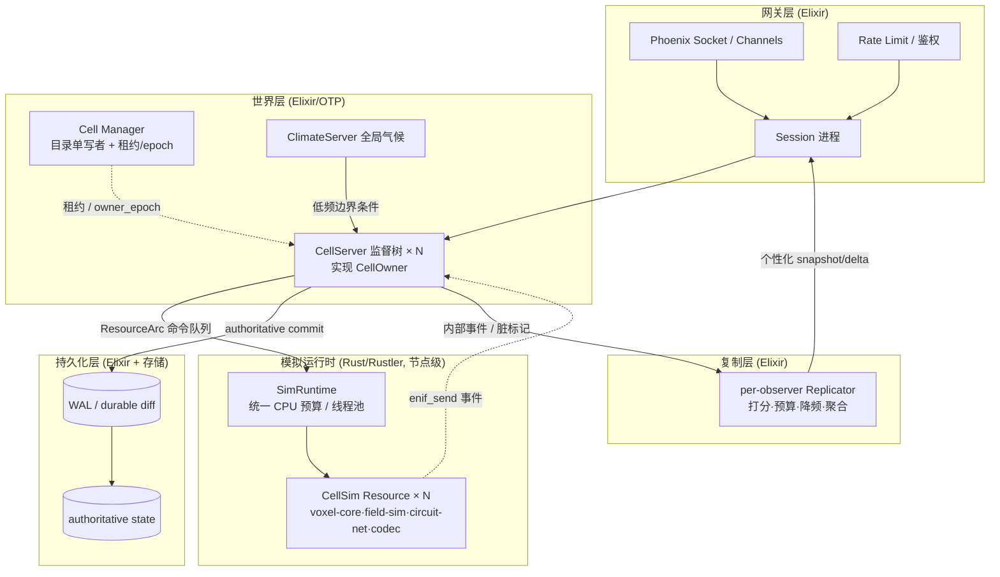

# Hemifuture 体素 MMO 服务端架构设计规范 v2.0.1

> 状态:**规范性约束性文件(Normative)· 架构冻结基线(Frozen Baseline)· v2.0.1 冻结稿**
> 适用范围:Hemifuture MMO 服务端(Elixir/OTP + Rust/Rustler)
> 性质:本文件是模块设计与代码评审的约束基线。任何与本文件冲突的实现,要么修正实现,要么走变更流程修订本文件——**不得在代码中静默偏离**。
> 一句话纲领:**算得少而非算得快;世界空间与服务器解耦;到处是缝,但每条缝都被藏住;客户端只发意图;`durable_authoritative` 只在可恢复提交后确认;`runtime_authoritative` 以服务端裁决与 checkpoint/input log 定义恢复边界;物理是有效层规律的离散实现,玩法从受约束的规则组合中涌现。**
> 版本说明:v2.0.1 是冻结前一致性补丁:不新增架构方向,仅将四分类权威口径、涌现分级口径、冻结信封范围、boundary event 语义、DET-2 验收边界、冷迁移 runtime checkpoint 与条款格式统一传导到主规范。旧版本史见 附录 C,旧 ID→新 ID 见 附录 B。
> **v2.0.2 修订(2026-06-14):** 据现有 voxel-authority 实现的工程证据,经变更流程放宽/澄清 7 条(`CELL-2/3`、`CELL-19`/`AUTH-3`、`MOD-1`、`MOD-4`、`RULE-5`、`REPL-2`、`DET`/反作弊),**架构方向不变**;受影响条款内联标 `[v2.0.2]`,集中记录见 附录 C 与 `docs/voxel-server-authority/2026-06-14-architecture-triage-and-alignment.md` §4。

---

## 0. 文档说明

### 0.1 规范性关键词

等价 RFC 2119 语义:

| 关键词 | 含义 |
|--------|------|
| **必须 / 禁止** | 强制约束。违反即架构缺陷,评审必须拦截。 |
| **应当 / 不应** | 强烈建议。偏离需在设计文档显式记录理由。 |
| **可以** | 可选项。由模块作者按需取舍。 |
| **分级** | 约束级别随 `fidelity_class`、经济/资产/PVP 影响而定;高影响为"必须",纯表现为"应当"。 |

### 0.2 条款编号

- 每条带稳定编号(如 `BND-1`),用于评审、设计文档、commit 引用。
- v2.0 已将各族编号整理为**连续序号**,消除历史遗留的字母后缀(原 `EMG-1A`、`AUTH-8A/11A`、`CELL-Y-1/SIZE-1/2/6A~6F` 等)。**自 v2.0 起编号再次冻结,禁止复用**;废弃条款保留编号标 `[已废弃]`。
- 旧 ID(v1.x)→ 新 ID 的完整映射见 **附录 B**;历史引用(旧响应文档等)请据附录 B 与上下文换算。

### 0.3 架构冻结状态

经六轮迭代,架构层已收敛:不再有方向性分歧。据此:

- 本规范的**架构契约**(原则、职责边界、Cell 模型,AUTH/TIME/REPL/XBOUND/PERS/NIF 根契约,EMG/DET 体系等)**冻结**。对 `必须/禁止` 条款与 §18 `FROZEN-*` 的变更,必须走 附录 C「变更流程」。
- **字段级、协议级、状态机级细节**(信封字段类型、握手状态机实现、merge/flux/DET profile 细则、反作弊与运维细则)**不进入本规范**,而进入 `INTERFACE-SPEC.md` / `SIM-DESIGN.md` / `PERSISTENCE-DESIGN.md` / `SEC-DESIGN.md` / `OPS-RUNBOOK.md` / `TRANSPORT-DESIGN.md`。
- 继续在主规范内无限扩写视为反模式;下一步是实现。

---

## 1. 设计哲学与第一性原则

| 编号 | 原则 | 说明 |
|------|------|------|
| **PRIN-1** | 计算量正比于活跃区域,而非世界大小 | 任何使成本随世界体积增长的设计**禁止**进入热路径。 |
| **PRIN-2** | 数据本体留在 Rust,Elixir 只持引用 | 体素与场数据**禁止**跨 NIF 边界搬运。Elixir 侧只持 `ResourceArc`、发命令、收事件。 |
| **PRIN-3** | 世界空间与服务器解耦 | "某实体属于某固定服务器"的假设**禁止**渗入业务代码。 |
| **PRIN-4** | 空间分区解决"世界大",不解决"人扎堆" | 二者不同问题,不同工具(见 §9)。 |
| **PRIN-5** | 接口先于功能冻结 | 先冻结 §18 契约,再挂功能模块。 |
| **PRIN-6** | 诚实的容量天花板 | 容量目标(§17)写入设计,**禁止**以"以后总有办法"替代。 |
| **PRIN-7** | 持久权威以可恢复提交为准,运行时权威以服务端裁决与恢复边界为准 | `durable_authoritative` 的客户端成功确认**必须**晚于 durable commit / WAL append / 等价机制;`runtime_authoritative` 以服务端单写者裁决、input log、checkpoint 或 snapshot 定义恢复边界。Rust/BEAM 内存状态**禁止**作为 `durable_authoritative` 的唯一来源。 |
| **PRIN-8** | 客户端只发意图,不发事实 | 一切客户端输入均为不可信 command intent。客户端**禁止**直接提交权威事件。 |
| **PRIN-9** | 现实规律以有效层模型实现,游戏规则以内部自洽为准 | 现实物理是**原型与校准来源**,不是线上权威。每个模拟目标必须声明 `fidelity_class`(qualitative / gameplay / quantitative)与适用边界。目标是**可读、可预测、可组合、可运营**,而非盲目追求微观精确。**禁止**为追求精确而引入不必要的微观模拟。 |
| **PRIN-10** | 规则通过共享状态组合,玩法从组合中涌现 | 物理规则与特色玩法规则都应优先建模为作用于共享状态的规则。组合是默认路径;但战斗、权限、表现、经济等语义可以通过已登记的 adapter / injection bypass 接入。**禁止**绕过共享状态重复实现同一物理因果。 |
| **PRIN-11** | 涌现必须有边界、证据和刹车 | 任何涌现系统必须按 `fidelity_class` 与经济/资产/PVP 影响等级,声明模型契约、守恒/资源边界、最大传播/增长范围、确定性等级、可解释/回放方式、调试能力、回归场景与运营安全阀。无边界的涌现视为生产风险,不是设计深度。 |

---

## 2. 涌现式模拟设计契约(EMG)

> 目的:把"涌现"从口号变成可评审、可测试、可运营的架构契约。HEMIFUTURE 追求的是**受控的弱涌现**:宏观行为由底层构件和规则组合产生,但系统必须能解释、回放、限流、隔离和修复。

### 2.1 模型卡(Model Card)

- `EMG-1`(必须):每个模拟系统进入实现前,必须提交**模型卡**,至少声明:基础构件、状态变量、局部/非局部规则、随机源、边界条件、守恒量或资源来源、可观测输出、失败模式、性能预算、状态分类(durable_authoritative/runtime_authoritative/derived/ephemeral)、`fidelity_class`。
  > 形态右尺寸:模型卡的**信息**是必须的,但其**形态可与系统复杂度和 `fidelity_class` 成比例**——简单/`qualitative` 系统可用结构化 doc-comment 或一页清单,不强制独立正式文档;`quantitative` 或影响经济/资产的系统须更完整并附验收脚本。重点是"声明清楚",而非"产出重型流程"。
- `EMG-2`(必须):模型卡是**系统级契约**:描述一个模拟系统的设计意图、玩家心智模型、保真等级、边界条件、失败模式、运营风险和验收证据。它不同于 `RULE-1` 的**规则级契约**;后者描述单条规则读/写哪些字段、在哪个 stage 执行、如何 merge、如何守恒。禁止用重复模板制造形式主义;两者可在同一文件中分节呈现,但语义必须分层。
- `EMG-3`(必须):每个现实模拟目标必须声明 `fidelity_class`:
  - `qualitative`:只要求现象方向可信,例如"热源使周围变热"、"烟倾向上升"。
  - `gameplay`:要求服务玩法并稳定可预测,例如"过载会跳闸/发热/起火"、"湿度影响作物"。
  - `quantitative`:要求数值近似现实或设计标定值,必须给误差范围、基准场景和验收脚本。
- `EMG-4`(必须):任何文档或代码注释**不得把游戏模型表述为真实物理的完整复现**。可以说"以现实规律为原型"或"实现某个有效层因果关系";若宣称定量准确,必须绑定 `fidelity_class=quantitative` 的测试证据。

### 2.2 组合与边界

- `EMG-5`(必须):规则组合的默认机制是**共享状态 + 确定性 stage + 明确 merge operator**(见 §7)。禁止两个模块各自维护互相冲突的隐藏状态来表达同一现象。
- `EMG-6`(必须):非局部效果、表现效果、权限校验、经济结算与任务奖励必须通过已登记的 adapter / injection bypass 接入局部规则层;禁止把这些语义硬塞进邻域更新规则。
- `EMG-7`(必须):所有可扩散、可增长、可复制、可自激的系统必须声明**涌现安全阀**:最大传播半径、最大增长率、最大资源产出、最大跨 Cell 影响范围、队列水位、CPU/网络预算和 quarantine 条件。
- `EMG-8`(必须):任何能产生或销毁 authoritative 资源的规则必须声明资源来源/汇与审计字段。**禁止**通过 derived 或 ephemeral 状态无审计地铸造经济价值。

### 2.3 可解释、可回放、可运营

- `EMG-9`(分级):影响 authoritative 状态、经济、资产、建筑、PVP 或 `fidelity_class=quantitative` 的涌现系统,**必须**提供可视化/追踪工具,至少能回答:"哪个规则、在什么 tick、基于哪些输入、通过什么 merge operator,导致了这个结果"。纯表现性 `qualitative` 系统**应当**提供最小调试开关。
- `EMG-10`(分级):影响 authoritative 状态的涌现系统**必须**提供**语义回放**入口。回放输入至少包含 world seed、rule_version、cell_id、owner_epoch、cell_tick、command/event log、随机种子、边界条件版本。`bit-exact replay` 仅对 `fidelity_class=quantitative`、仲裁/复现需求或显式声明需要的系统强制,并按 `DET-3` 执行。
- `EMG-11`(分级):经济/资产/建筑/PVP/`quantitative` 系统上线前**必须**有回归场景库,覆盖典型宏观模式、边界条件、跨 Cell 传播、过载/安全阀触发、崩溃恢复重放。纯表现性 `qualitative` 系统**应当**有最小 smoke test。
- `EMG-12`(应当):涌现玩法的设计评审必须同时包含**玩家心智模型评审**与**滥用评审**。前者保证玩家能理解与预测,后者保证不会生成无限资源、绕过权限、规避风险或拖垮服务器。

---

## 3. 确定性等级(DET)

> 目的:本架构不是 lockstep,生产正确性不依赖物理逐 tick 位级重放;但 AUTH、Cell 全序、语义回放和调试复现仍需要明确确定性等级。引用"确定性"时必须标明所指等级。

- `DET-1`(必须):**生产正确性确定性**。系统必须保证权威命令排序、`command_id` 幂等、`cell_seq` 单调、`owner_epoch` fencing、提交结果和拒绝旧 epoch 的行为确定。这是 `AUTH/CELL/PERS` 的正确性基础,不得降级。
- `DET-2`(必须):**语义回放确定性**。在相同 snapshot、WAL/outbox、rule_version、boundary condition version、world seed 与输入序列下,系统必须复现**同一已提交 authoritative 历史**与**同类宏观结果**。允许浮点 epsilon、并行归约顺序或 warm-up 细节造成的低阶差异。**注**:对混沌/敏感依赖的涌现系统(火、生态等"计算不可压缩"类),`DET-2` **不承诺逐事件相同的前向轨迹**——它保证的是"已提交历史一致(因其落日志)+ 统计同类宏观行为";若确需逐事件相同,须启用 `DET-3`。
- `DET-3`(分级):**位级回放确定性(bit-exact replay)**。仅当模型卡声明 `fidelity_class=quantitative`、竞争性仲裁、线上争议复现、回归测试或明确需要 bit-exact replay 时才必须启用。此模式可使用固定点、量化整数、固定归约顺序、确定性浮点封装或关闭非确定性并行优化;它是 replay/debug profile,不是生产热路径默认。
- `DET-4`(必须):任何文档或实现引用"确定性"时必须标明所指等级。禁止把 `DET-3` 当成 `DET-1` 的前提,也禁止用 `DET-3` 非默认来削弱 `DET-1/2`。
  > **[v2.0.2 补充]** 已天然达到 `DET-3` 位级可复现的纯函数核(如固定步长积分器)**可直接登记为反作弊 replay 基准**;纯 `runtime_authoritative` 高频态允许最小恢复声明形态(checkpoint = last AOI snapshot / spawn、回滚窗口 = 0、重连 = re-anchor),不强制重型 input WAL(配合 `AUTH-15`/`PERS-12`)。

---

## 4. 系统分层总览

### 4.1 运行时分层

> 关键点:① 客户端下行**只**经 Replicator 产出(见 §13);② Rust 侧用**节点级 SimRuntime** 统一调度(见 `NIF-1`);③ `durable_authoritative` 命令显式走 **WAL/durable commit** 后才向客户端确认,`runtime_authoritative` 按 checkpoint/input log 恢复边界处理(见 §11/§16)。

### 4.2 物理模拟三分辨率层

| 层 | 频率 | 粒度 | 计算位置 | 内容 |
|----|------|------|----------|------|
| 宏观气候层 | ~0.1 Hz | 区域一格,全服数千格 | 单进程 (ClimateServer) | 气压、风向、季节、降水带。可半参数化。 |
| 中观层 | ~1 Hz | 每 chunk 一标量 | Rust,Cell 内 | 温湿度均值;扩散 + 半拉格朗日平流。 |
| 微观层 | 10–20 Hz | 体素级 | Rust,**仅活跃集内** | 3D stencil 扩散;SoA + 双缓冲 + rayon。 |

- `SIM-1`(必须):微观层只在活跃集内运行。**禁止**对休眠区域执行体素级模拟。

### 4.3 宏观气候状态契约(CLIM)

- `CLIM-1`(必须):ClimateServer 发布的是**低频边界条件**,不应成为不可恢复的权威黑盒。宏观气候必须可由 `world_seed + sim_time + climate_event_log + climate_model_version` 重建,或以等价 snapshot+event log 恢复。
- `CLIM-2`(必须):Cell 消费气候输入时必须记录 `climate_tick` 与 `climate_model_version`;由气候输入触发的 authoritative 后果必须通过 `AUTH-11` 的 system actor 路径提交。
- `CLIM-3`(应当):ClimateServer fanout 失败不得导致 Cell 使用无版本的隐式气候。Cell 应使用最后已确认的边界条件,并暴露 stale age metric。
- `CLIM-4`(应当):区域天气事件、季节变更、雷暴等宏观事件必须进入事件日志,以便休眠解析快进(`SIM-7`)按时间分段积分。
- `CLIM-5`(可以):MVP 可使用单 ClimateServer,但其状态恢复与 failover 演练必须进入 §24 清单。

---

## 5. 职责边界:Elixir 与 Rust

### 5.1 划分

| 归属 | 职责 |
|------|------|
| **Elixir / OTP** | 连接与会话、Cell 编排与跨节点分布、事件路由、**玩法规则裁决**、持久化协调、Cell 目录与迁移调度、复制层。 |
| **Rust / Rustler** | 体素数据本体、所有场计算、电网图解算、编解码量化、**高吞吐空间/数值查询**。 |

### 5.2 约束

- `BND-1`(禁止):体素数组或物理场缓冲跨 NIF 边界传递。Elixir 侧只允许持有 `ResourceArc<CellSim>`。
- `BND-2`(必须):所有"数学"批量留在 Rust,单次 NIF 调用处理一批,而非逐元素/逐 tick 往返。
- `BND-3`(必须):边界按**"事实生成" vs "规则裁决"**划分,而非按"是否涉及空间"划分。
  - **Rust 负责**:高吞吐空间/数值查询与**物理事实**生成。
  - **Elixir 负责**:规则裁决、权限校验、经济结算、任务/奖励、建筑归属及一切**权威副作用提交**。
  - Rust **禁止**裁决"玩家是否有权攻击/掉什么奖励/建筑归谁/经济如何结算"。
- `BND-4`(应当):GenServer 管理 Cell/chunk 的**元数据与所有权**,不承载逐 tick 数值计算。
- `BND-5`(可以):Rust 提供以下批量查询供 Elixir 裁决使用——`query_los_batch`、`query_collision_batch`、`query_reachable_batch`、`query_explosion_mask`、`query_nearby_entities`、`query_build_support`。这些是"事实查询",其结果如何影响玩法由 Elixir 决定。

> 澄清:`BND-3` 禁止"规则下沉 Rust",**不**意味着"Rust 不能做空间查询"。把碰撞、射线、可达性、爆炸 mask、邻域、LOS 留在 Elixir 反而会违反 `BND-2`。两者通过"事实/裁决"二分共存。

---

## 6. 物理模拟子系统

### 6.1 休眠区解析快进

- `SIM-2`(必须):休眠 chunk **不运行微观体素级模拟**;但**具有世界影响的过程必须在中观层、事件层或离线解析器中继续推进**,不得简单"暂停"。
- `SIM-3`(应当):唤醒后可运行数个 warm-up tick 重建体素级梯度,再交付玩家可见区。
- `SIM-6`(必须):解析快进**只适用于"可由低维状态近似恢复"的物理量**(如温湿度向中观均衡值的指数弛豫 `T(t)=T_eq+(T₀−T_eq)·e^(−k·Δt)`)。火灾、流体、机器生产、生态演化、经济状态等**必须各自单独声明**离线推进模型,**禁止**套用指数弛豫。
- `SIM-7`(必须):`T_eq` **必须支持按时间分段积分**。天气、季节、昼夜、源项变化**禁止**假定整个休眠期内常量不变。
- `SIM-8`(应当):唤醒前执行边界一致性检查。若休眠状态存在火灾、流体、跨 Cell 网络或其他危险/不可逆过程,**应**进入 warm-up / quarantine,不得直接交付玩家可见区。

> 设计动因:"完全不模拟 + O(1) 弛豫补完"对温湿度成立,但不可过度推广——其风险有二:① 分段边界条件下单一 `T_eq` 失真;② **可被玩家利用**(离开区域以规避火灾/逃避资产损毁)。`SIM-6/7/8` 把解析快进收窄为"温湿度类物理量的专用优化",其余过程走显式离线模型。这不削弱 `PRIN-1`:离线模型同样按低频/事件推进,成本仍正比于"有影响的过程"而非世界体积。
>
> 理论依据:`SIM-2`/`SIM-6` 的界线判据是**计算可压缩性**。有闭式/粗粒度宏观描述的过程(温度向均衡弛豫→指数衰减)可压缩,可直接实现宏观式并解析快进;**计算不可压缩**的过程(玩家自建机器、火、生态,即弱涌现)必须逐 tick 模拟。工程旁证:格子玻尔兹曼史表明,即使元胞规则能算出流体,最终仍"往上爬"到相关变量所在层以换取效率——与本架构三分辨率同构。

### 6.2 各物理量建模方式

- `SIM-4`(必须):**禁止**对电、磁、流体在体素级求解偏微分方程或铺设求解网格。

| 物理量 | 建模方式 | 要点 |
|--------|----------|------|
| 温度 / 湿度 | 体素 stencil 扩散 | 主战场。温度+湿度→露点→凝结/降水;水体按温度蒸发。 |
| 风 / 气候 | 仅宏观 + 中观层 | 体素级禁止解流体。 |
| 电 | 电路网络图(Factorio 式) | 节点挂网络,每 tick 按网络聚合解供需;图增量维护后近 O(1)。禁止解麦克斯韦。跨 Cell 见 §14。 |
| 磁 | 解析偶极场叠加 | 登记磁源,查询点按空间索引求值。无网格。 |
| 雷电 | 气候层电荷标量 + 阈值触发 | 区域电荷累积触发离散事件。 |

> 抽象层澄清(呼应 `PRIN-9`):本表各项都是**直接实现已涌现的宏观/有效层定律**,而非自底向上重新涌现。温湿度 stencil 是热传导方程的离散形式;"电用电路网络图、磁用解析偶极、不解麦克斯韦"也是同一思路。这与 `PRIN-1`(算得少)同源。

### 6.3 耦合关系

- `SIM-5`(应当):跨物理量耦合只在必要处建立。已确认链:`温度+湿度→露点→凝结/降水`、`温度→蒸发→湿度`、`气候层电荷→雷电`。新增耦合需评估对活跃集成本的影响。

### 6.4 性能预算参考

单 Cell 100 活跃 chunk 微观层:`100 × 32768 × 2 × 10 ≈ 6500 万 cell 更新/秒`,SIMD stencil 下 2–3 核可承受。

> 结论:瓶颈不在物理,在网格化与网络同步。容量验收见 §17。
>
> 性能与确定性的关系:本节的 SIMD stencil + rayon 并行是微观层吞吐的立足点,它与"位级数值确定性"存在张力(并行浮点归约不保证逐位一致)。本架构的恢复模型(权威日志 + warm-up,见 `AUTH-10/11`、`PERS-1/3`)**不要求**物理位级可复现,故默认保留并行性能;位级确定性按 `RULE-9` 作为**可选 replay 模式**单独提供,不占用生产热路径。

---

## 7. 统一局部更新规则层(涌现引擎)

> 设计定位:本层是"局部因果"的统一执行框架。物理规则、环境规则、机器规则、部分玩法规则可以通过共享状态自动组合,生成未显式编写的宏观行为。但组合不是无约束相互污染,而是**有模型卡、有状态分类、有确定性数值、有冲突合并、有安全阀、有回放证据**的受控涌现。
>
> 现实规律在本架构中不是被逐粒子复刻,而是以**有效层模型**实现。`fidelity_class` 是一个**谱**,不是"一切皆定性":扩散类局部规则(温差传热)在连续极限下**就是**热传导方程的离散形式,可达 `quantitative`;火势蔓延、生态等通常落在 `gameplay`。声明保真等级是为了诚实标定误差与适用边界。

### 7.1 规则本体与模型契约

- `RULE-1`(必须):基础规则统一建模为**规则契约(rule contract)**,至少声明:读取字段、写入字段、邻域半径、执行频率、所属 stage、状态分类、守恒量/资源来源、随机源、`fidelity_class`、确定性等级(`DET-*`)、可观测输出、失败模式与安全阀。物理规则与特色玩法规则在此框架中互为平级。`RULE-1` 是规则级契约,`EMG-2` 是系统级模型卡;二者不得混用。
- `RULE-2`(必须):规则之间**默认**通过共享状态组合。若某效果可由共享状态自然表达,禁止绕过它重复实现同一物理因果。例:火焰法术应向目标格注入热量/燃烧倾向,由传热/燃烧规则接管;但它造成的法术伤害、仇恨、成就、权限校验可以走 Domain Module / adapter,不得塞进体素传热规则。

### 7.2 正确性、守恒与确定性

> 本节是权威 MMO 模拟的硬约束。它同时服务于物理稳定性、崩溃恢复、WAL replay、迁移重放、反作弊审计与客户端纠错。

- `RULE-3`(必须):局部更新规则**必须采用"读旧写新"(双缓冲)语义**。同一 tick 内统一读取上一帧状态,写入下一帧或 delta buffer。禁止原地逐格更新;原地更新会使结果依赖遍历顺序,破坏守恒、确定性与重放一致性。
- `RULE-4`(必须):涉及守恒量或准守恒量(热量、质量、流体、电荷近似、资源库存)时,必须采用**flux ledger / delta accumulation**:先基于旧状态计算所有候选通量,再按源格预算、热容/容量、边界条件统一缩放与结算。仅保证"每对邻居单次不超过均衡量"不足以守恒,因为一个格可能同时向多个邻居传出并超出自身可用量。
- `RULE-5`(必须):同一 tick 多条规则写同一字段时,必须有确定性执行契约:stage 顺序固定且版本化;stage 内写入使用声明的 merge operator(sum/min/max/replace-by-priority/append-event 等)。并行执行时 merge operator 必须可交换/可结合,否则必须固定归约顺序。 **[v2.0.2 澄清]** 仅"**同字段多写**"需 merge operator;"**分字段单写**"(各 kernel 各写各自 layer)只需固定 stage 顺序,无需声明式 merge。
- `RULE-6`(必须):**规则身份**与**执行频率**是正交的两个轴,禁止混淆。
  - 规则本体可以统一在本层:物理、环境、机器、部分玩法规则都读写共享状态。
  - 执行仍按三分辨率分频:传热/燃烧 10-20 Hz,湿度均值约 1 Hz,气候约 0.1 Hz,机器/生态按各自模型卡声明。
  - 禁止把所有规则塞进同一 tick rate;也禁止用"低频"为由绕过确定性与状态分类。
- `RULE-7`(必须):`RULE-1~6` 只适用于局部或近局部规则。范围伤害、传送、召唤、权限、交易、任务、叙事触发等非局部/语义效果,必须作为**注入式旁路(injection bypass)** 或 **语义 adapter** 接入:在目标位置或目标实体注入状态变化,随后由局部规则接管物理演化。注入本身仍受 `AUTH`、`TIME`、`PERS`、`RULE-3` 约束。
- `RULE-8`(应当):新增特色规则应优先设计为局部更新规则或状态注入,以自动获得与物理基底的组合能力;仅当效果本质非局部、非物理或涉及权限/经济/叙事语义时,才使用 `RULE-7` 的注入式旁路或 adapter。
- `RULE-9`(分级):随机源、语义回放与位级数值确定性**分开**要求。
  - **(必须)确定性随机源**:任何规则的随机数必须由 `world_seed + cell_id + tick_id + rule_id + seq` 或等价输入派生;**禁止**进程全局/墙钟/不可复现随机源。
  - **(必须)语义回放确定性**:影响 authoritative 状态的规则必须满足 `DET-2`;同一输入序列应复现**同一已提交历史与同类宏观结果**(混沌系统不承诺逐事件前向轨迹,见 `DET-2`)。
  - **(分级)位级数值确定性**:浮点、SIMD、rayon 并行归约的位级 replay 一致性按 `DET-3` 执行,仅在 replay/debug/quantitative/仲裁场景中强制,可作为可切换 profile。
- `RULE-10`(必须):规则版本、stage 版本、merge operator 版本、重建算法版本必须进入 snapshot / event / replay metadata。规则变更不得让旧日志在无迁移说明的情况下产生不同 authoritative 结果。

### 7.3 从 derived 结果进入 authoritative 世界

- `RULE-11`(必须):局部规则可以产生 `candidate_effect`(例如"温度超过燃点,木块可燃"、"机器输出达到产物阈值"),但只要该结果会改变 authoritative 状态(方块删除/创建、库存、归属、经济、战斗结算),就必须通过 `AUTH-11` 的 system actor 命令提交。禁止 Rust 规则直接无提交地修改 authoritative 资产。
- `RULE-12`(必须):derived 或 ephemeral 结果可以直接驱动表现层和预测层,但不得被 Replicator 作为 committed authoritative 事实下发,除非其 `cell_seq` 已不高于 `visibility_watermark`(见 `AUTH-8`)。
- `RULE-15`(必须):**阈值类 `derived→authoritative` 事件必须使用防抖、滞回或锁存机制**。例如 ignition threshold 与 extinguish threshold 分离、连续 N tick 满足条件才生成 `candidate_effect`、candidate 一旦生成即 durable pending/latch、数值输入进入权威判定前按稳定精度量化。禁止让浮点 epsilon 在阈值附近直接翻转火灾、机器爆炸、作物死亡、电网损坏、污染变异等 durable 后果。
- `RULE-16`(必须):`candidate_effect_id` 必须由稳定输入派生,例如 `cell_id + rule_id + rule_version + affected_object_id + quantized_condition_bucket + source_seq/tick_range`。禁止使用浮点原值、进程局部随机数或 wall clock 作为幂等键。

### 7.4 涌现安全阀与调试

- `RULE-13`(必须):每个可传播/增长/自激规则必须声明上限与熔断策略。触发上限时,Cell 必须进入降级、冻结、quarantine 或人工审核路径,并产生 `OPS-2` 结构化事件。
- `RULE-14`(应当):规则层应提供调试视图:状态场、源项、通量、候选效果、merge 冲突、安全阀触发原因、跨 Cell boundary event。该视图是涌现系统可运营性的组成部分,不是开发辅助品。

> 注:`RULE-11~16` 按编号集中于本节族内呈现;实现时 `RULE-15/16`(阈值锁存)与 `RULE-11/12`(derived→authoritative)配套使用。`RULE-5` 的 stage 调度与 `MOD-4`(服务端 Bevy plugin / ECS system)是同一机制。

---

## 8. 无缝大世界与 Cell 模型

### 8.1 Cell 定义与几何

- `CELL-1`(必须):世界为统一全局坐标系,切成 **cell**(基准尺寸 16×16 chunk)。cell 是所有权、迁移、兴趣管理的最小单位,粒度大于 chunk。
- `CELL-2`(必须):`cell_id = (level, morton)` 四叉树路径。该编码上线即支持静态异构尺寸,并为表示层保留再分能力(动态再分受 `LOAD-7` 约束)。 **[v2.0.2 修订]** `(level, morton)` 降为**可选编码之一**;允许以 `region_id`(连续 chunk 矩形 bounds)作等价所有权单位,但**必须**提供 `region_id ↔ morton` 等价/迁移说明(见 §附录 C v2.0.2、D-2)。
- `CELL-3`(必须):四叉树 `cell_id` 表示 **XZ 平面上的 column ownership**,**Y 轴不参与 Cell ownership**。地下、天空、高层建筑均归属其 XZ 所在 Cell;Y 轴作为 Cell 内局部 chunk index。若未来需要 3D 归属,必须改用 3D Morton/Octree 并提供迁移路径。 **[v2.0.2 修订]** 允许 **3D 归属**:region 可含 Y bounds(垂直分片,将地下/地表/天空/高层分给不同 owner),此时 Y 参与所有权**不视为违背**;XZ-column 降为**推荐默认**而非强制(见 D-2)。
- `CELL-4`(必须):16×16 chunk 为 **base cell(level 0)**。`level` 上升表示更大 cell(冷区/无人区合并),`level` 下降的动态分裂被 `LOAD-7` 禁止。异构尺寸**仅用于静态分配**(启动/扩容)。
- `CELL-5`(应当):异构相邻时,halo 交换以**较细一侧粒度**对齐;AOI 的 N×N 按 base cell 当量计算,大 cell 视作其覆盖的多个 base 当量。静态异构尺寸**可以**在停服维护窗口变更,**不应**在线变更。

### 8.2 三条寻址契约(冻结项,见 §18)

- `CELL-6`(必须):**路由按 cell**。`cell_id → owner` 目录由单写者 manager 持权威,各节点持 ETS 副本;**ETS 副本仅为 routing hint,权威性由 owner_epoch 校验保证**(见 §8.5)。命令寻址到 cell,owner 运行时解析。
- `CELL-7`(必须):**AOI 与所有权分离**。Cell 的 `Phoenix.PubSub` topic **只承载服务端内部事件/脏标记/低频聚合**,**禁止**作为客户端直接下行通道——客户端可见状态一律经 Replicator(见 §13)。
- `CELL-8`(必须):**连接不迁移,仅权威迁移**。socket/session 固定在 gateway 节点;跨界移动的只是模拟权威。

### 8.3 跨界交接(handoff)

- `CELL-9`(必须):**实体跨 Cell handoff 与 Cell ownership migration 必须区分**。玩家/实体从 Cell A 移动到 Cell B 时,采用两阶段 entity handoff:① 目标侧建 ghost 预热;② 在 `handoff_tick` 生成 `entity_transfer_id` 并翻转该实体的模拟权威;③ 源 Cell 停止处理该实体的新权威命令并转发在途命令。**实体 handoff 不得递增 Cell 的 `owner_epoch`**;消息携带源/目标 Cell 各自当前 `owner_epoch` 仅用于 fencing 校验。
- `CELL-10`(必须):只有当**某个 Cell 本身迁移到新的 CellServer/节点**时,才递增该 Cell 的 `owner_epoch`。Cell ownership migration 必须绑定 `migration_tick`、`old_owner_epoch`、`new_owner_epoch`、snapshot/commit watermark;旧 owner 在迁移 tick 后禁止再产生该 Cell 的权威事件或写入。
- `CELL-11`(必须):文档和代码中必须使用不同术语:`entity_handoff` 表示实体跨 Cell 移动;`cell_migration` 表示 Cell owner 迁移;`owner_epoch` 只属于 `cell_migration/ownership` 语义。
- `CELL-12`(必须):`entity_handoff` 必须是**幂等协议**。重复 `prepare/accept/commit/abort` 不得复制实体、丢失实体、重复结算或生成幽灵实体。
- `CELL-13`(必须):source Cell 在 `source_final_tick`/`handoff_tick` 后不得处理该实体的新权威命令,但必须按 `command_forward_from_seq` 转发、拒绝或标记在途命令。拒绝语义必须对客户端可恢复。
- `CELL-14`(必须):target Cell 只有在校验 `target_owner_epoch` 仍有效、`entity_state_digest` 匹配、`transfer_id` 未完成、deadline 未过期后,才能 commit handoff。
- `CELL-15`(必须):Replicator 必须有 `visibility_cutover_snapshot_seq` 或等价规则,禁止客户端在同一可见 tick 同时看到同一实体的两个权威副本,也禁止 cutover 后继续从旧 Cell 下发该实体 committed 状态。
- `CELL-16`(必须):体素**物理场**禁止跨 Cell 耦合,Cell 间只交换中观 halo(低频低精度)。**但跨 Cell 的权威对象与拓扑结构(电网、管道、铁路、建筑、火势、爆炸、projectile)不属于本条覆盖范围,必须按 §14 处理**——`CELL-16` 仅约束"场",不约束"对象/网络"。

### 8.4 关于"无缝"的诚实声明

- `CELL-17`(禁止):追求真正连续的单一全局模拟(SpatialOS 式)。服务端"无缝"实质是"缝被 cell 权威切换与跨 cell AOI 藏住"。

### 8.5 租约与 Fencing(防双主)

> 动因:分布式系统中"有 lease ≠ 不会双主"。仅靠租约,网络分区时旧 owner 的延迟写入仍可能落库。必须引入单调 fencing token。

- `CELL-18`(必须):每个 Cell ownership **必须含单调递增 `owner_epoch`**。所有命令、事件、持久化写入、复制消息**必须携带 `owner_epoch`**。
- `CELL-19`(必须):DB 写入**必须以 `(cell_id, owner_epoch, cell_seq)` 或等价 fencing 条件执行**(条件写)。旧 epoch owner 的写入**必须失败**。 **[v2.0.2 澄清]** `chunk_id` 可作 `cell_id` 的**聚合等价**、`chunk_version` 可作 `cell_seq` 的**聚合等价**;`pg_advisory_xact_lock + SELECT FOR UPDATE + chunk_version` CAS 的每 chunk 线性化条件写属合规 fencing 路径(见 D-1 变更②)。
- `CELL-20`(必须):owner 无法确认 lease 仍有效时,**必须进入 read-only / frozen / draining 状态**,禁止继续接受权威写命令。
- `CELL-21`(必须):Gateway 与各节点 ETS 中的 owner 缓存**只可作 routing hint**,权威性由 `owner_epoch` 校验保证(与 `CELL-6` 一致)。
- `CELL-22`(应当):Cell Manager failover、网络分区、续租超时**必须进入故障演练清单**(见 §24),并有明确停写策略。
- `CELL-23`(必须):Cell Manager 的 owner 目录、lease 状态与 `owner_epoch` 分配必须建立在线性化/共识基础上(例如单主 + 持久化条件写、Raft/etcd、数据库事务锁或等价机制)。**禁止**仅凭内存单进程状态保证 epoch 单调性。
- `CELL-24`(必须):lease 过期判断必须以单调时钟和保守 TTL 为基础;任何无法证明 lease 仍有效的 owner 必须按 `CELL-20` 停写。跨节点墙钟时间不得作为权威顺序来源。

> 设计协同:`owner_epoch` 是贯穿 AUTH(§11)、TIME(§12)、REPL(§13)、XBOUND(§14)的统一 fencing 维度。**单写者(`CELL-6`)是 `cell_seq` 全序得以成立的根本前提**——一个 Cell 仅一个 owner,故其命令可形成单调全序。

---

## 9. 动态负载与热点治理

### 9.1 两类问题、两套工具

| 问题 | 成因 | 工具 |
|------|------|------|
| 世界大 | 面积 | 空间分区 / cell 迁移(§9.2) |
| 人扎堆 | 实体密度,O(N²) 可见性 | 复制层 + 降级(§9.3) |

- `LOAD-1`(禁止):用 cell 细分治理实体密度热点。

### 9.2 动态负载均衡 = Cell 迁移(三档)

| 档 | 对象 | 难度 | 做法 | 优先级 |
|----|------|------|------|--------|
| 静态分配 | 启动/扩容 | 平凡 | 直接分配 | 先做 |
| 冷迁移 | 休眠 cell | 几乎免费 | 序列化"源+方块变更+中观标量+durable_authoritative state";若存在 runtime_authoritative,同时携带 checkpoint/snapshot 或先冻结/结算/降级;目标解析重建,走持久化同一路径 | 次做 |
| 热迁移 | 有玩家 cell | 最难 | 暂停-缓冲-快照-重放 | **可永不实现** |

- `LOAD-2`(必须):节点过载时**优先迁走冷 cell**,给热 cell 腾整机,而非搬热 cell。
- `LOAD-3`(必须):迁移决策**必须配滞回阈值**防抖动。
- `LOAD-4`(应当):热迁移排最末,且在冷迁移 + 垂直腾挪被验证不足前不应投入。

> 注:冷迁移序列化对象**扩充**为含 `durable_authoritative` 状态(见 §16 PERS 分类),不再只是物理重建数据。若冷 cell 中仍存在 `runtime_authoritative` 状态,必须随迁移载荷携带其最近 checkpoint/snapshot,或在迁移前将其冻结、结算或降级为可重建状态;禁止静默丢弃。

### 9.3 单 Cell 内压力工具箱(按动用顺序)

| 序 | 工具 | 机制 | 杠杆 |
|----|------|------|------|
| 1 | 垂直腾挪 | 冷 cell 迁走,热 cell 独占整机,rayon 吃满多核 | 第一阀门 |
| 2 | **优先级复制** | per-observer 出口预算,按距离/相关性打分,最近 K 全频、其余降频、远处聚合。O(N²)→O(N×K) | 最高杠杆 |
| 3 | 负载降级 | cell tick 参数运行时可调 + 负载监视器 | 平滑兜底 |
| 4 | 时间膨胀 | 放慢单 cell sim_time(见 `TIME-4`) | 极端兜底 |
| 5 | 设计阀门 | 见 §9.4 | 策划手段 |

- `LOAD-5`(必须):复制层第一天就走"打分 + 出口预算"接口(初版打分函数可为纯距离)。**禁止**全量广播渗入玩法代码。
- `LOAD-6`(必须):每个 Cell 的 sim tick 参数运行时可调,且**必须绑定统一时间模型(§12)与复制层策略(§13)**——降频不得破坏 `cell_seq` 全序与客户端纠错基准。
- `LOAD-7`(禁止):cell 动态分裂。静态异构尺寸(`CELL-4`)可以做。
- `LOAD-8`(可以):依赖 Erlang 全互联 distribution(数十节点规模)。

### 9.4 产品层阀门

> 动因:"热迁移可不做"务实,但必须给产品层硬约束,否则玩法会设计出通用架构无法承接的会战。

- `LOAD-9`(必须):任何设计为 **300+ 同屏强交互**的玩法,**必须单独提交容量设计**,不得默认继承通用 Cell 架构。
- `LOAD-10`(必须):若不实现热迁移,**必须提供产品层阀门**:区域软上限、排队、分线(sharding)、实例化(instancing)、动态禁入、传送成本或时间膨胀提示——至少其一。
- `LOAD-11`(必须):时间膨胀触发**必须对玩家可见**,且设**最小可玩阈值**;低于阈值时**应拒绝继续加人**而非无限降级。

---

## 10. NIF 边界协议

> 动因:Rust NIF 与 BEAM 同 OS 进程,panic/死锁/内存暴涨/线程泄漏可拖垮整个 VM;每 Cell 无界线程池会 CPU 过订阅。

- `NIF-1`(必须):`CellSim` 可实现为 NIF Resource,但 **tick 执行必须挂接到节点级 `SimRuntime`**;**禁止**每个 Cell/CellSim 无界创建独立线程池。`SimRuntime` 统一管理 CPU 预算,Cell/CellSim 仅为任务与状态单位。
- `NIF-2`(必须):Elixir → Rust 走命令队列,命令入队后立即返回。**注:入队 ≠ 提交成功,提交语义见 §11。**
- `NIF-3`(必须):Rust → Elixir 用 `OwnedEnv::send` 异步发回事件;事件队列**必须有水位线、背压、合并(coalesce)、溢出策略**(见 `NIF-8`)。
- `NIF-4`(必须):偶发同步调用标 `DirtyCpu`,`OwnedBinary` 零拷贝返回,量化 u8/u16。
- `NIF-5`(禁止):每 tick 逐个调 NIF;每 chunk 一个 GenServer 再逐个驱动 NIF。
- `NIF-6`(必须):所有 Rust tick、命令处理、事件生成**必须在 FFI 边界内隔离 panic**(如 `catch_unwind`);panic **禁止**穿透 NIF 边界杀死 BEAM VM。
- `NIF-7`(必须):`CellSim` **必须绑定 `cell_id` 与 `owner_epoch`**。CellServer terminate、迁移、租约失效或 epoch 失效时,Rust tick loop **必须停止**并拒绝旧 epoch 命令。
- `NIF-8`(必须):命令队列与事件队列**必须有水位线、背压策略、合并策略、溢出策略**。**禁止无限队列。**
- `NIF-9`(应当):native memory、Rust worker 数、tick 耗时、队列深度**必须暴露为节点级 metrics**(见 §24)。
- `NIF-10`(**可以,带强约束**):**仅当**在进程内 `catch_unwind` 隔离 + 队列水位 + 资源配额被验证仍不足以保证可靠性时,**才可**将 Rust 模拟外化为独立 OS 进程(IPC/共享内存)。
  > **限定**:此选项与 `PRIN-2`/`BND-1` 的零拷贝 `ResourceArc` 前提**直接冲突**——外化会重新引入被本架构刻意消除的边界序列化,牺牲微观层的核心性能假设。因此 `NIF-10` **是最后的逃生通道,不是默认方案**。采用前必须在设计文档中量化论证"进程内隔离不足"的具体证据,并评估其对 §6.4 性能预算的冲击。
- `NIF-11`(必须):`catch_unwind` 只能隔离 Rust unwind panic;**不能**隔离 `panic=abort`、segfault、UB、OOM、数据竞争、FFI 误用或 native 死锁。架构评审不得把 `NIF-6` 理解为完整故障隔离。
- `NIF-12`(必须):NIF crate 必须执行 native safety gate:默认 safe Rust;`unsafe` 仅允许出现在小型审计模块;所有 unsafe 边界必须有不变量说明、fuzz/property test、Miri/sanitizer 可运行脚本或等价证明。
- `NIF-13`(必须):native 崩溃的 blast radius 是整个 BEAM 节点。多节点部署必须能通过 `AUTH`/`CELL-23`/`OPS-4` 将崩溃 Cell 重新分配与恢复;不得把单 Cell 监督树重启视为 native 崩溃恢复方案。
- `NIF-14`(应当):高风险模拟规则、第三方 native 依赖或仍在实验期的规则,应先在隔离 profile / canary Cell / 独立节点运行,通过崩溃预算和 replay 验证后再进入默认 NIF 路径。
- `NIF-15`(必须):默认 NIF crate 必须以可 unwind 的 panic 策略构建,并在 FFI 边界执行 `catch_unwind`。若某 native 组件必须 `panic=abort`,则该组件不得进入默认 BEAM 同进程 NIF 路径,只能运行于隔离 profile、独立节点或外部进程,并按 `NIF-13` 视为节点级故障。

---

## 11. 权威命令与持久化提交协议

> 动因:`NIF-2`(命令入队即返回)是**性能接口**,不能替代**提交语义**。"放置方块→Rust 内存已改→客户端已见→节点崩溃→方块消失"在涉及材料消耗、机器状态、经济资产时会导致回滚、丢物、复制奖励、重复结算。

- `AUTH-1`(必须):所有改变**权威**世界状态的命令**必须携带** `command_id`(全局唯一)、`actor_id`、`cell_id`、`owner_epoch`、`client_seq`、`target_tick` 或 `server_received_tick`。
- `AUTH-2`(必须):对改变 **`durable_authoritative`** 状态的命令,CellServer 在**对客户端确认成功之前**,**必须**使该命令或其结果达到**可恢复状态**(WAL append / durable diff commit / 等价机制)。`runtime_authoritative` 状态的恢复按 `AUTH-15` 走 input WAL/checkpoint,不受本条每次落盘约束。
- `AUTH-3`(必须):Cell 内权威命令**必须形成单调递增 `cell_seq`**;由命令产生的权威事件**必须携带 `causation_id` 与 `cell_seq`**。 **[v2.0.2 澄清]** 单写者下 per-chunk `chunk_version` 单调可作 `cell_seq` 聚合等价全序;跨 chunk 顺序由事务 `decision_version` 补足(见 `CELL-19` [v2.0.2])。
- `AUTH-4`(必须):权威命令**必须可幂等处理**。重复 `command_id` **禁止**重复产生经济、资产、建筑或战斗副作用。
- `AUTH-5`(必须):客户端可见的 committed 事件**必须携带 `cell_seq`、`tick_id`、`owner_epoch`**;接收方必须能去重、拒绝旧 epoch、必要时请求 snapshot 修复。
- `AUTH-6`(应当):低价值可丢失状态**可以**异步提交,但**必须显式标记 `ephemeral`**,且不得影响经济、资产、建筑所有权或战斗最终裁决。
- `AUTH-7`(必须):崩溃恢复**必须明确选择** WAL replay / snapshot+diff / 等价机制;**禁止**依赖 Rust 内存状态作为唯一权威来源(呼应 `PRIN-7`)。
- `AUTH-8`(必须):每个 Cell 必须维护 `commit_watermark` 与 `visibility_watermark`。Replicator **禁止**向客户端发布高于对应 `visibility_watermark` 的 authoritative 结果;Rust 内存中的未提交变化只能作为 speculative/derived 状态,不得伪装成 committed 事实。
- `AUTH-9`(必须):当一个 Cell 内存在多个提交域或复制流时,`visibility_watermark` 必须声明作用域。MVP 可使用 Cell 全局标量;规模化可采用 per-state-partition、per-replication-stream 或 vector watermark。Replicator 判断可见性时必须使用对应 state partition / stream 的 watermark,不得无条件使用粗糙全局值。
- `AUTH-10`(必须):权威状态提交与对外事件发布必须采用 durable outbox 或等价机制,保证"状态已提交但事件丢失"和"事件已发布但状态未提交"均可恢复/去重。
- `AUTH-11`(必须):模拟系统自动产生的 durable 后果(例如火烧毁方块、机器产物入库、生态繁殖生成实体)必须以 `system_actor` command/event 形式进入 AUTH 路径,携带 `causation_id`、`rule_version`、`candidate_effect_id` 与幂等键。禁止规则层直接绕过 AUTH 改写 authoritative 状态。
- `AUTH-12`(必须):涉及多个权威域的命令(例如消耗背包物品并放置方块、交易并更新经济账本、跨 Cell 建筑修改)必须定义原子提交边界:同事务、outbox+saga、两阶段提交或补偿机制。禁止出现玩家资产已扣但世界状态未变、或世界状态已变但资产未扣的半提交。
- `AUTH-13`(必须):多域命令必须声明 `atomicity_class`: `hard_atomic`(玩家不可见半提交)、`reserved_commit`(先冻结资源/对象再提交世界变化)、`saga_compensatable`(允许补偿但补偿事件必须玩家可解释)、`eventual_noncritical`(仅限低价值状态)。禁止把所有跨域问题无差别丢给 saga。
- `AUTH-14`(必须):若 derived 结果已经对客户端以"即将提交"或强表现形式可见,必须声明其回滚语义:① speculative 效果可消失;② durable pending/latch 后再展示;③ 允许崩溃后消失但明确标记为非权威表现。
- `AUTH-15`(必须):高频 `runtime_authoritative` 状态(例如玩家位置、速度、姿态、短时 combat movement、AI 临时状态)可以采用轻量 input WAL、ring buffer 或周期 checkpoint,不要求每 tick durable DB commit。但其模型卡必须声明 checkpoint 频率、可回滚窗口、断线重连语义、战斗裁决边界;任何进入经济、资产、建筑或 PVP 最终结算的结果仍必须通过 AUTH 提交。
- `AUTH-16`(必须):`system_actor` 必须具备 capability scope。每个 system actor 只能提交登记过的 `effect_type`,例如 `fire_system` 可提交 `ignite_block/burn_block/smoke_effect`,`machine_system` 可提交 `produce_item/consume_fuel`。禁止通用 system_actor 任意修改 authoritative state。
- `AUTH-17`(必须):`system_actor` command 必须经过 policy registry 校验,至少校验 `effect_type`、目标对象类型、资源来源/汇、最大频率、最大数量、跨 Cell 范围、`rule_version`、`fidelity_class` 与审计字段。高价值 system_actor effect 必须进入审计与 anomaly detector(呼应 `SEC-9`)。

> **维护方关键协同(性能保护)**:`AUTH-2` 的"落盘后才确认"**只施加于 `durable_authoritative` 命令**(见 §16 PERS 四分类)。`runtime_authoritative`(玩家位置/姿态/短时战斗,走 `AUTH-15` checkpoint)、`derived`(温湿度等物理场)与 `ephemeral`(粒子、短命 projectile)**都不在 durable-commit 路径上**——因此 10–60 Hz 的高频移动与物理事件**不付落盘代价**,`AUTH-2` 开销集中在低频的"放置/破坏/交易/结算"类命令上。
>
> 另一协同:`cell_seq` 全序之所以可行,正因 `CELL-6` 的**单写者**设计(一 Cell 一 owner)。AUTH 与 Cell 模型互为支撑。

---

## 12. Cell 时间模型

- `TIME-1`(必须):每个 Cell **必须维护单调递增 `cell_tick` 与 `sim_time`**;所有权变更**禁止**重置 `cell_tick`。
- `TIME-2`(必须):所有权威命令**必须绑定 `target_tick` 或 `server_received_tick`**;Cell 内命令处理顺序**必须确定**。
- `TIME-3`(必须):跨 Cell 事件**必须携带 `source_cell_id`、`target_cell_id`、`source_cell_tick`、`source_sim_time`、`source_owner_epoch`、`target_owner_epoch` 或 `target_epoch_observed`、`source_seq`**,并由目标 Cell **按确定性规则映射到本地 tick**。
- `TIME-4`(必须):time dilation **只改变 `sim_time` 推进速率**,**禁止**破坏权威事件的全序语义。
- `TIME-5`(必须):复制消息**必须携带 `snapshot_tick` 或 `snapshot_seq`**;客户端**只基于 `snapshot_tick`** 做插值、预测、纠错。
- `TIME-6`(应当):`entity_handoff` **必须声明 `handoff_tick`**;源 Cell 在 `handoff_tick` 之后不得再处理该实体的新权威命令。`cell_migration` **必须声明 `migration_tick`**;旧 Cell owner 在 `migration_tick` 之后不得再产生该 Cell 权威事件(与 `CELL-9/10`、`CELL-20` 一致)。

---

## 13. 复制层与网络协议

> 动因(一处真实隐藏冲突):`CELL-7`(per-cell PubSub topic,广播语义)与 `LOAD-5`(per-observer 打分预算,单播语义)直接矛盾——若 owner 把实体事件发到 cell topic,所有订阅者收到同一批,**无法 per-observer 限流**,热点 Cell 退化为全量广播。必须三层分离:① Cell owner 产生的**服务端内部权威事件**;② Replicator 按每观察者预算生成的**个性化 snapshot/delta**;③ Gateway 下发的**网络消息**。

### 13.1 复制层(REPL)

- `REPL-1`(必须):Cell PubSub topic **只承载服务端内部事件/脏标记/低频聚合**,**禁止**作为客户端直接下行通道。
- `REPL-2`(必须):所有客户端可见状态**必须经 per-observer Replicator**,执行出口预算、优先级排序、降频、聚合、裁剪。 **[v2.0.2 分级]** 强制出口预算仅适用于**高频连续流**(移动/快照);**低频离散事件**(chat/skill/combat/object_destroyed)可走全量 / affected-chunk 扇出 + AOI 裁剪。
- `REPL-3`(必须):玩法模块**禁止**直接向客户端广播原始 Cell 事件;客户端下行**只能**由复制层产物生成(强化 `LOAD-5`)。
- `REPL-4`(必须):复制层消息**必须区分** reliable-ordered / reliable-unordered / unreliable-snapshot / bulk-stream,**不同类别不得共享同一背压策略**。
- `REPL-5`(必须):delta 消息**必须携带 `delta_base` 或 `snapshot_seq`**;客户端丢失 delta 后**必须**能由下一次 snapshot 恢复。
- `REPL-6`(应当):chunk/voxel 大数据流与移动/战斗实时流**隔离预算**,**禁止** chunk streaming 挤占战斗同步。
- `REPL-7`(应当):复制层**必须暴露** per-player bytes/sec、entities/sec、dropped/coalesced、AOI 实体数、预算命中率(见 §24)。

### 13.2 客户端网络协议(NET)

- `NET-1`(必须):客户端下行**必须分类**为 reliable-ordered / reliable-unordered / unreliable-snapshot / bulk-chunk-stream。
- `NET-2`(必须):移动、战斗、实体同步**必须用 snapshot + delta**;delta 丢失可由后续 snapshot 恢复。
- `NET-3`(必须):chunk/voxel 大流与实时流**必须隔离预算**,禁止大流造成实时消息队头阻塞。
- `NET-4`(应当):Gateway **必须将连接级背压传导给 Replicator**,而非无界缓存下行消息。
- `NET-5`(必须):MVP 若使用单 WebSocket 承载所有消息,`unreliable-snapshot` 仅表示**入队前**可丢弃/合并,不保证传输层无队头阻塞。`bulk-chunk-stream` 与 realtime stream 至少应使用独立发送队列;规模化阶段应评估独立 WebSocket、WebTransport/QUIC stream 或 UDP 旁路。

> **传输层澄清**:Phoenix Channels 运行于单条 WebSocket(TCP),**原生不提供 unreliable 投递**。`NET-1`/`REPL-4` 的"unreliable-snapshot"是**逻辑投递类**——含义是"该消息可在 Replicator 处被丢弃/合并、无需重传",其**线路传输方式是独立的传输层决策**:MVP 全部经 TCP,unreliable 类以"只发最新、不重传、允许覆盖"在应用层近似;规模化阶段可引入 WebTransport/QUIC 或 UDP 旁路。**禁止**默认"Phoenix Channels 自动给到 UDP 级语义"。

---

## 14. 跨 Cell 拓扑对象与边界事件

> 动因:`CELL-16` 的"只交换中观 halo"约束的是**场**;但电缆/管道/铁路/传送带跨界、大型建筑/领地跨界、火势/水/熔岩/污染跨界、projectile/爆炸跨界、边界处放置/破坏、边界两侧互相攻击——这些是**权威归属/顺序/一致性**问题,不是"轻微不连续"。

- `XBOUND-1`(必须):任何跨 Cell 结构**必须拆成 Cell-local segment + boundary connector**;**禁止**单个权威对象同时被多个 Cell owner 直接修改。
- `XBOUND-2`(必须):跨 Cell 网络(电网、管道、铁路、传送带)**必须有明确的网络 owner 或分层求解协议**:Cell 内求解局部子图,边界 connector 交换低频聚合量(与 §6.2 电网"图聚合"模型一致地扩展到跨界)。
- `XBOUND-3`(必须):跨 Cell 影响范围事件(爆炸、攻击、火势传播、projectile 迁移)**必须通过 boundary event 传递**,并至少携带 `source_cell_id`、`target_cell_id`、`source_owner_epoch`、`target_owner_epoch` 或 `target_epoch_observed`、`source_cell_tick`、`tick_id`、`source_seq`、`event_id`、`idempotency_key`、`delivery_class`、`boundary_payload_version`,并定义重复、延迟、拒绝策略(与 `TIME-3` 一致)。
- `XBOUND-4`(必须):边界附近写操作**必须有确定性归属规则**(例:按 block 坐标归属 Cell,或由主 Cell 发起两阶段提交)。
- `XBOUND-5`(应当):跨 Cell 结构**必须进入压测脚本**,至少覆盖跨界建筑、跨界网络、跨界战斗、跨界迁移(见 §17、§24)。

---

## 15. 模块化与代码组织

### 15.1 Elixir 侧

- `MOD-1`(必须):umbrella 多 OTP app:`gateway` / `replicator` / `world` / `persistence` / 各玩法模块。 **[v2.0.2 放宽]** 上述为**逻辑层职责清单**,不强制独立 OTP app 数量(persistence 可并入数据服务、replicator 可寄居玩法层);但 `LOAD-5` 的 per-observer 出口预算接口**必须第一天存在**。
- `MOD-2`(必须):模块间**只**通过 behaviour 契约 + 事件总线通信——命令进、事件出,禁止互摸内部状态。

### 15.2 Rust 侧

- `MOD-3`(必须):cargo workspace 按域拆 crate:`voxel-core` / `field-sim` / `circuit-net` / `codec`,由单个 NIF facade 统一出口。
- `MOD-4`(应当):模拟模块做成 plugin trait,向 tick 各 stage 注册 system(服务端版 Bevy plugin 模型)——这与 `RULE-5` 的层内确定性执行契约是同一机制。 **[v2.0.2 变体]** 允许 **stage 调度在 Elixir(behaviour + 监督树)、Rust 仅提供无状态计算单元/事实查询**作为合规变体(享受 BEAM 故障隔离)。

### 15.3 渐进式前提

- `MOD-5`(必须):新增任何模块**只允许**挂接 §18 冻结接口,不得为单个模块改动冻结契约。

### 15.4 事件信封(EVENT)

- `EVENT-1`(必须):所有服务端内部事件**必须用统一 event envelope**。
- `EVENT-2`(必须):envelope **至少含** `event_id`、`event_type`、`schema_version`、`cell_id`、`owner_epoch`、`cell_seq`、`tick_id`、`causation_id`、`correlation_id`、`actor_id`、`delivery_class`、`created_at`、`payload`。普通 Cell-local event 中,`cell_id/owner_epoch` 表示事件归属 Cell。对 `boundary_event`,该字段可视为 `primary_cell_id` 或 `source_cell_id`;boundary event extension **必须**显式携带 `source_cell_id`、`target_cell_id`、`source_owner_epoch` 与 `target_owner_epoch`/`target_epoch_observed`(见 `XBOUND-3` 与 `FROZEN-5`)。
- `EVENT-3`(必须):消费者**必须按 `event_id` 或 `(cell_id, owner_epoch, cell_seq)` 支持幂等**。
- `EVENT-4`(必须):事件总线**必须定义** `delivery_class`、retry policy、dead-letter policy、慢消费者背压。
- `EVENT-5`(禁止):玩法模块订阅无边界 wildcard 事件并在热路径做重计算。

---

## 16. 持久化策略

### 16.1 状态分类(核心)

> 动因:"不存场,只存源+方块变更+中观标量"**对物理场正确,但不可过度推广**为全 MMO 的持久化策略。生产 MMO 还需:玩家位置/背包/装备/任务、建筑归属、领地权限、机器库存、生产队列、电网储能、经济账本、交易、AI/NPC、作物生态、定时器、buff/debuff、跨 Cell 网络等。

| 状态类别 | 含义 | 示例 | 要求 |
|---|---|---|---|
| **durable_authoritative** | 持久权威,成功确认前必须可恢复 | 玩家资产、方块变更、机器库存、建筑归属、经济账本、交易、永久机器状态 | 必须持久化或可由 WAL/outbox 重放恢复;走 `AUTH-2` 提交路径 |
| **runtime_authoritative** | 运行时权威,服务端裁决为准,但不要求每 tick durable DB commit | 玩家位置、速度、姿态、短时 combat movement、AI 临时状态 | 必须声明 input WAL / ring buffer / checkpoint / snapshot 恢复策略;进入最终结算时必须转 durable AUTH |
| **derived** | 派生,可重建 | 温湿度微观场、缓存索引、部分网格化结果 | 重建算法必须版本化;**不**走 durable-commit |
| **ephemeral** | 临时,可丢失 | 视觉粒子、纯表现烟雾、非关键 AI 中间态 | 必须声明可丢失边界;禁止影响最终结算 |

- `PERS-1`(必须):物理**场**属 `derived`,**不持久化**,由解析弛豫(`SIM-2`/`SIM-6`)+ warm-up 重建。
- `PERS-2`(必须):"源 + 方块变更 + 中观标量"**仅是物理场重建所需的持久化子集**,**不**作为全部 MMO 权威状态的持久化策略。
- `PERS-3`(必须):`derived` 加载时通过解析弛豫 + warm-up 重建。
- `PERS-4`(应当):冷迁移(`LOAD-2`)复用持久化序列化路径,其载荷含 `durable_authoritative` 状态;若涉及 `runtime_authoritative` 状态,必须携带最近 checkpoint/snapshot,或在迁移前冻结、结算、降级为 `derived`/`ephemeral` 的可接受状态。
- `PERS-5`(必须):任何状态进入系统前**必须声明为 `durable_authoritative` / `runtime_authoritative` / `derived` / `ephemeral`**(四分类,见上表);**未分类状态禁止进入生产代码**。
- `PERS-6`(必须):**`durable_authoritative`** 的客户端成功确认**必须晚于** durable commit / WAL append / 等价机制(呼应 `AUTH-2`、`PRIN-7`)。`runtime_authoritative` 不受此约束,按 `AUTH-15`/`PERS-12` 的 checkpoint/恢复边界处理。
- `PERS-7`(必须):`derived` 重建算法**必须版本化**;算法变更必须说明旧数据兼容与重建策略。
- `PERS-8`(必须):`ephemeral` **禁止**影响经济、资产、建筑所有权、任务进度、战斗最终结算。
- `PERS-9`(必须):`derived` 状态若触发 authoritative 后果,必须通过 `AUTH-11` 的 system actor 提交,并记录触发原因:rule_version、rebuild_algorithm_version、cell_tick、输入摘要、candidate_effect_id。禁止由 derived 状态直接无审计改写 durable state。
- `PERS-10`(必须):规则或重建算法升级不得回溯改写已经 committed 的 authoritative 后果。若需要修正,必须走显式 migration/compensation event。
- `PERS-11`(应当):对会影响资产/建筑/经济的涌现规则,应优先将"候选判断"保留为 derived,将"落地后果"作为 authoritative event,以便审计、回滚和运营干预。
- `PERS-12`(必须):任何状态若被声明为 `runtime_authoritative`,必须在模型卡或模块设计中声明:恢复来源(input log/checkpoint/snapshot)、checkpoint 频率、允许回滚窗口、断线重连位置、与 durable 结算的切换点、迁移载荷策略。未声明者不得用于战斗、移动或实体权威;冷迁移中不得静默丢弃 `runtime_authoritative`。

> 收益:`derived` 不落盘使写入量较"存全场"砍数个数量级;`durable_authoritative` 走显式提交保证不丢物不复制;`runtime_authoritative` 走 checkpoint 兼顾高频与可恢复。通过四分类清晰分流。

---

## 17. 容量目标与性能预算

- `CAP-1`(必须):以下容量数字写入设计基线,**禁止**以"以后总有办法"替代。

| 场景 | 单 cell 同时人数 | 状态 |
|------|------------------|------|
| 常规战斗 | 100–200 | 舒适区 |
| 高密度战斗 | ~300 | 降级后可玩(依赖 §9.3 工具 2/3) |
| 大规模近战 | 500+ | PlanetSide/EVE 级专项工程,通用架构不提供 |

- `CAP-2`(必须):物理性能预算见 §6.4。
- `CAP-3`(应当):新模块上线前评估对"活跃集成本"与"网络出口"的影响。
- `CAP-4`(必须):所有容量声明**必须绑定**硬件规格、场景脚本、实体数量、事件频率、网络预算、p95/p99 tick 延迟。
- `CAP-5`(必须):每版本**必须提供标准 load test scenario**,至少含:常规战斗、高密度战斗、跨 Cell 边界、冷迁移、断线重连、节点过载。
- `CAP-6`(必须):**禁止**用"cell 更新数/秒"单指标证明容量;必须同时报告 BEAM mailbox、Rust 队列、水位、复制层下行、DB 写延迟。
- `CAP-7`(应当):容量指标**必须区分** sim cost / replication cost / gateway cost / DB commit cost。

---

## 18. 冻结接口清单(本规范约束核心)

> "第一天冻结"**不应**理解为字段永不可扩展,否则会成为维护负担。**冻结 envelope 与兼容规则,payload 走版本化演进。**

- `FROZEN-1`(必须):**Cell 寻址**——`(level, morton)` `cell_id`(XZ column,见 `CELL-3`);`cell_id → owner` 目录 + 租约 + `owner_epoch`;命令按 cell 寻址。
- `FROZEN-2`(必须):**事件信封**——`EVENT-2` 的**最小字段与兼容性规则冻结**;payload schema 通过 **versioned registry** 演进。
- `FROZEN-3`(必须):**NIF facade**——**envelope 与 ABI 兼容策略冻结**;具体 command set 可按版本扩展,**禁止破坏已发布命令语义**。
- `FROZEN-4`(必须):所有冻结接口**必须支持 `schema_version` 或 capability negotiation**;破坏性变更**必须提供迁移计划**。
- `FROZEN-5`(必须):以下信封纳入冻结集,规则同 `FROZEN-2`/`FROZEN-4`:
  - **权威命令信封**(AUTH):`command_id`、`actor_id`、`cell_id`、`owner_epoch`、`client_seq`、`target_tick`/`server_received_tick`、`precondition`、`payload_type`、`payload_version`、`payload`。
  - **系统命令信封**(`AUTH-11` system_actor):在权威命令信封基础上增加 `system_actor`、`rule_version`、`candidate_effect_id`、`idempotency_key`、`causation_id`。
  - **权威事件信封**(EVENT,见 `EVENT-2`)。
  - **Cell 时间字段**(TIME):`cell_tick`、`sim_time`、`dilation_ratio`、`snapshot_tick`、`snapshot_seq`。
  - **复制层输出契约**(REPL):`observer_id`、`cell_id`、`snapshot_seq`、`delta_base`、`budget_class`、`priority_score`、`reliability_class`、`visibility_watermark`、`payload`。
  - **持久化分类标记**(PERS):`state_class`、`schema_version`、`commit_watermark`、`visibility_watermark`、`replay_source`、`rebuild_algorithm_version`。
  - **跨 Cell 边界事件信封**(`boundary_event`):`source_cell_id`、`target_cell_id`、`source_owner_epoch`、`target_owner_epoch` 或 `target_epoch_observed`、`source_cell_tick`、`tick_id`、`source_seq`、`event_id`、`idempotency_key`、`delivery_class`、`boundary_payload_version`、`payload`。它是 EVENT 的冻结 subtype/extension,兼容规则同 `FROZEN-2`。
  - **候选效果信封**(`candidate_effect`):`candidate_effect_id`、`rule_id`、`rule_version`、`affected_object_id`、`quantized_condition_bucket`、`source_seq` 或 `tick_range`、`threshold_profile`、`latch_status`、`causation_id`、`state_class`、`payload_version`、`payload`。它是 `derived→authoritative` 阈值提交的冻结 subtype,进入 AUTH 前必须满足 `RULE-15/16` 与 `AUTH-11`。
  - **实体跨 Cell 信封**(`entity_handoff`):`entity_transfer_id`、`entity_id`、`source_cell_id`、`target_cell_id`、`source_owner_epoch`、`target_owner_epoch`、`source_final_tick`、`target_start_tick`、`handoff_tick`、`source_cell_seq` 或 `transfer_seq`、`target_accept_seq`、`entity_state_ref` 或 `entity_state_digest`、`transfer_payload_version`、`transfer_status`(`prepare/accept/commit/abort/timeout`)、`command_forward_from_seq`、`visibility_cutover_snapshot_seq`、`idempotency_key`、`deadline_tick`。**不含、也不递增 Cell `owner_epoch`**(见 `CELL-9`/`CELL-11~15`)。
  - **Cell 迁移信封**(`cell_migration`):`cell_id`、`old_owner_epoch`、`new_owner_epoch`、`migration_tick`、`snapshot_ref`、`commit_watermark`。**`owner_epoch` 仅在此处递增**(见 `CELL-10`/`CELL-11`)。

---

## 19. 渐进式实施路线图

> 落地顺序。每步在前一步验证通过后进入。根契约的"骨架"前置,但不要求一次写到实现细节。

1. **契约骨架先行**:冻结 `FROZEN-1~5` 的最小信封(命令/事件/时间/复制/持久化分类);确立 `PRIN-7/8` 信任与提交边界;补入 `owner_epoch`、`commit_watermark`、`visibility_watermark`、durable outbox 字段。
2. gateway + session + 鉴权 + rate limit(`SEC-1~2/5`)。
3. **单节点 · 一 Cell 一 CellServer 一 CellSim**;打通 AUTH 最小路径(`command_id` + WAL + ack)。
4. 持久化(状态分类 `PERS-5` + authoritative WAL + derived 重建)。
5. 物理场与局部规则层(三分辨率 + 解析快进 `SIM-2/6/7` + **局部更新规则层 §7**:模型卡、读旧写新、flux ledger、确定性数值、merge operator、derived→authoritative 过渡)。
6. 复制层(per-observer Replicator + snapshot/delta + 预算)。
7. 同节点多 Cell(AOI 跨 Cell、PubSub 仅内部、Replicator 产出下行)。
8. 多节点静态分配(distribution + 目录 + 租约 + `owner_epoch` fencing)。
9. 冷迁移(复用持久化路径,含 `durable_authoritative` 状态;涉及 `runtime_authoritative` 时携带 checkpoint/snapshot 或先冻结/结算/降级)。
10. 跨 Cell 拓扑对象(segment + connector + boundary event)。
11. 时间膨胀 + 产品层阀门(`LOAD-9~11`)。
12. (大概率不需要的)热迁移。

- `ROADMAP-1`(应当):复制层"打分+预算"接口(`LOAD-5`)、cell 参数运行时可调(`LOAD-6`)、`owner_epoch` 字段在第 1 步即引入骨架。

- `ROADMAP-2`(应当):局部更新规则的"读旧写新 + 确定性 stage 顺序"(`RULE-3`/`RULE-5`)必须在第 5 步规则层落地时即建立。`AUTH` 幂等、崩溃恢复与迁移依赖的是权威命令排序、幂等键、`cell_seq`、`owner_epoch`、snapshot/diff 和提交结果的确定性;局部规则层必须提供语义级确定性(`DET-2`)。位级数值确定性仅在 replay 模式、`quantitative` 系统或仲裁需求中强制(`DET-3`)。

- `ROADMAP-3`(应当):任何进入第 5 步的涌现系统必须先有 `EMG-1/2` 模型卡(形态按 `fidelity_class` 右尺寸)、`RULE-1` 规则契约、`RULE-9` 确定性随机源与 `DET-*` 等级说明、`RULE-13` 安全阀;影响 authoritative 状态的系统必须有 `RULE-15/16` 阈值提交与幂等键设计。`EMG-11` 回归场景与 bit-exact replay 模式按 `fidelity_class`/经济影响分级。缺核心项的系统只能进入实验 Cell,不得进入生产 Cell。

---

## 20. 涌现系统验证与回放(SIMQA)

> 右尺寸说明:SIMQA 的**意图**(涌现系统须可测、可回放、可解释)正确且重要,但其**装置**按 `fidelity_class` 与经济影响分级,细则落 `SIM-DESIGN.md`,不作为 MVP 的一刀切硬门禁。

- `SIMQA-1`(应当):局部规则层应提供 headless replay runner,可从 snapshot + WAL/outbox + climate log + rule_version 重放指定 Cell 的 tick 区间。默认目标是 `DET-2` 语义回放与因果追踪;`DET-3` 位级可复现性仅在 replay/debug/quantitative/仲裁 profile 中要求。`DET-2` 的 `semantic_digest` 与"同类宏观结果"验收不变量由 `SIM-DESIGN.md` 按系统定义,例如火灾的关键烧毁集合/最大传播半径/资源消耗区间,电网的过载 latch/跳闸集合/供需平衡。
- `SIMQA-2`(分级):影响**经济/资产/建筑/PVP 结算**或声明 `fidelity_class=quantitative` 的系统**必须**有 property/scenario 测试,至少覆盖守恒、边界传播、跨 Cell connector、规则顺序、崩溃后恢复、规则升级兼容;纯表现/`qualitative` 系统**应当**具备最小回归场景。
- `SIMQA-3`(应当):容量测试除 §17 指标外,应记录 emergent counters:传播深度、candidate_effect 数量、system_actor command 数量、被安全阀裁剪的事件数、derived→authoritative 提交延迟。
- `SIMQA-4`(应当):为策划/运营提供可读 replay 摘要,用因果链解释玩家可见结果,避免涌现行为变成无法申诉的黑箱。

---

## 21. 反模式登记

| 编号 | 反模式 | 后果 | 正确做法 |
|------|--------|------|----------|
| `ANTI-1` | 每 chunk 一个 GenServer | 进程爆炸 + 逐个驱动 | 元数据 GenServer,数学留 Rust(`BND-4`) |
| `ANTI-2` | 每 tick 逐个调 NIF | 边界开销吞收益 | 命令队列批处理(`NIF-2`) |
| `ANTI-3` | 体素数组跨 NIF 搬运 | 拷贝 + 违反所有权 | 只传 ResourceArc(`BND-1`) |
| `ANTI-4` | 用 cell 细分治人群热点 | 进程内交互变跨节点流量 | 复制层 + 降级(§9.3) |
| `ANTI-5` | 实体硬绑定固定服务器 | 无缝/迁移改不动 | 按世界坐标寻址(`PRIN-3`、`CELL-6`) |
| `ANTI-6` | 全量 AOI 广播写入玩法代码 | O(N²) 锁死 | 第一天走打分+预算(`LOAD-5`) |
| `ANTI-7` | 体素级求解电/磁/流体 | 成本随世界体积爆炸 | 图/解析/分层(`SIM-4`) |
| `ANTI-8` | 持久化存场 / 把"只存源"套到全状态 | 写入暴涨 / 权威状态丢失 | 状态分类(`PERS-5`) |
| `ANTI-9` | 追求连续单一全局模拟 | 成本不可控 | 接受缝被藏住(`CELL-17`) |
| `ANTI-10` | durable 命令入队即向客户端确认成功 | 崩溃后回滚/丢物/复制奖励 | `durable_authoritative` 必须可恢复提交后才 ack(`AUTH-2`、`PRIN-7`);`runtime_authoritative` 走 checkpoint/input log(`AUTH-15`) |
| `ANTI-11` | Cell PubSub topic 直连客户端下行 | 热点退化为全量广播 | 经 per-observer Replicator(`REPL-1~3`) |
| `ANTI-12` | 只有 lease 而无 owner_epoch/fencing | 网络分区时双主写入 | 单调 epoch + 条件写(`CELL-18/19`) |
| `ANTI-13` | Rust panic 穿透 FFI | 整个 BEAM VM 崩溃 | FFI 边界 catch_unwind(`NIF-6`) |
| `ANTI-14` | 无限命令/事件队列 | 内存暴涨拖垮节点 | 水位 + 背压 + 溢出(`NIF-8`) |
| `ANTI-15` | 每 Cell 自带独立线程池 | CPU 过订阅 | 节点级 SimRuntime(`NIF-1`) |
| `ANTI-16` | 把指数弛豫套到火灾/流体/生产 | 离线规避危险、状态失真 | 各自声明离线模型(`SIM-6`) |
| `ANTI-17` | 跨 Cell 权威对象被多 owner 直接改 | 一致性破坏 | segment+connector(`XBOUND-1`) |
| `ANTI-18` | 客户端直接提交事件 | 反作弊崩溃 | 客户端只发意图(`PRIN-8`、`SEC-1`) |
| `ANTI-19` | 默认 Phoenix Channels = UDP 语义 | 实时流被 TCP 队头阻塞 | 显式传输层决策(§13 澄清) |
| `ANTI-20` | 局部规则原地逐格更新 | 顺序依赖、破坏守恒与确定性、振荡发散 | 读旧写新双缓冲(`RULE-3`) |
| `ANTI-21` | 为可组合的效果硬编特判(如单独写"点燃") | 规则爆炸、组合涌现丧失 | 通过共享状态组合(`RULE-2`) |
| `ANTI-22` | 把非局部效果塞进局部更新模型 | 邻域模型被扭曲、性能与正确性双失 | 注入式旁路(`RULE-7`) |
| `ANTI-23` | 混淆"规则身份"与"执行频率"两轴(所有规则同一 tick rate) | 高频拖垮、或低频失真 | 拉平身份、分频执行(`RULE-6`) |
| `ANTI-24` | 实体 handoff 时递增 Cell `owner_epoch` | epoch 语义污染、旧消息拒绝错乱、目录抖动 | entity_handoff 与 cell_migration 分离(`CELL-9/10/11`) |
| `ANTI-25` | 用进程全局/墙钟随机源;或把物理位级一致当成崩溃恢复前提 | 不可复现 / 过度约束并与 §6.4 并行性能冲突 | 确定性 RNG 派生(必须);恢复靠权威日志+warm-up;位级一致仅作可选 replay 模式(`RULE-9`) |
| `ANTI-26` | derived 状态直接烧毁/生成 durable 资产 | 无审计资产损失或复制 | system_actor + AUTH 提交(`AUTH-11`、`PERS-9`) |
| `ANTI-27` | 涌现系统无模型卡/保真等级 | 无法验收、无法解释、无法维护 | `EMG-1/3` |
| `ANTI-28` | 可复制资源无来源/汇/上限 | 经济漏洞、无限产出 | `EMG-7/8`、`SEC-7` |
| `ANTI-29` | 认为 `catch_unwind` 可以隔离所有 native 崩溃 | 低估 BEAM 节点级风险 | `NIF-11~14` |
| `ANTI-30` | 只做 pairwise 均衡而无源格总预算 | 多邻居传输时破坏守恒 | flux ledger / delta accumulation(`RULE-4`) |
| `ANTI-31` | Replicator 下发未提交模拟结果 | 客户端看到回滚世界 | visibility_watermark + outbox(`AUTH-8/10`) |
| `ANTI-32` | Cell Manager 只靠内存单主分配 epoch | failover 后 epoch 回退或双主 | 线性化/共识基础(`CELL-23`) |
| `ANTI-33` | 把位级 replay 当成生产正确性前提,或反过来用位级非默认削弱 AUTH/CELL 全序 | 性能被无谓牺牲,或正确性被误读 | DET-1/2/3 分级(§3、`RULE-9`) |
| `ANTI-34` | 阈值类 derived 结果直接提交 durable 后果 | epsilon 差异导致火灾/爆炸/死亡等结果翻转 | 防抖、滞回、锁存、稳定 candidate_effect_id(`RULE-15/16`) |
| `ANTI-35` | 每个移动 tick 都要求 durable DB commit | 移动/战斗热路径不可用 | runtime_authoritative + input WAL/checkpoint(`AUTH-15`、`PERS-12`) |
| `ANTI-36` | entity_handoff 无幂等状态机 | 复制人、丢人、幽灵人、重复结算 | `CELL-12~15` + `FROZEN-5` 扩展信封 |
| `ANTI-37` | 跨 Cell boundary event 只有单个 owner_epoch | 目标 Cell 迁移时旧事件误接收/误拒绝 | source/target 双 epoch(`XBOUND-3`、`TIME-3`) |
| `ANTI-38` | 通用 system_actor 可任意改权威状态 | 规则 bug 合法烧资产/造资源 | capability scope + policy registry(`AUTH-16/17`、`SEC-9`) |
| `ANTI-39` | 把应用层 unreliable 误认为解决了 TCP 队头阻塞 | 大 chunk 流阻塞实时战斗/移动 | 独立发送队列/传输层规划(`NET-5`) |

---

## 22. 术语表

| 术语 | 含义 |
|------|------|
| **Chunk** | 体素存储/网格化单位(如 32³),物理微观层计算块。 |
| **Cell** | 所有权/迁移/AOI 的**逻辑单位**(base 16×16 chunk,XZ column)。 |
| **CellOwner** | 持有某 Cell 权威的**角色/behaviour**。 |
| **CellServer** | 实现 CellOwner 的 **OTP 进程**,可拥有 ≥1 个 Cell(**MVP 规定:恰好 1 个**)。 |
| **CellSim** | 某 CellServer 内部的 **Rust 模拟 Resource**。 |
| **SimRuntime** | **节点级** Rust 模拟运行时,统一管理 CPU 预算与线程池。 |
| **ClimateServer** | 全局宏观气候单控制进程(发布低频边界条件;恢复与 failover 要求见 §4.3 / §24)。 |
| **Replicator** | per-observer 复制器,产出客户端个性化 snapshot/delta。 |
| **owner_epoch** | 每次 Cell ownership 变更递增的单调 fencing token(仅 `cell_migration` 递增)。 |
| **cell_seq** | Cell 内权威命令/事件的单调全序号(单写者保证)。 |
| **活跃集** | 当前需跑微观层的 chunk 集合。 |
| **AOI** | 兴趣范围,玩家订阅的周围 cell 范围。 |
| **Halo** | cell 边界用于跨界交换的薄层(本架构仅中观层场)。 |
| **boundary connector** | 跨 Cell 拓扑结构在边界处的连接对象(见 §14)。 |
| **解析快进** | 休眠区温湿度类物理量的 O(1) 弛豫补完(仅限可低维恢复者)。 |
| **time dilation** | 极端负载下放慢单 cell sim_time(不破坏全序)。 |
| **durable_authoritative** | 持久权威状态;成功确认前必须可恢复,例如资产、方块、建筑、经济账本(见 §16.1)。 |
| **runtime_authoritative** | 运行时权威状态;服务端裁决为准,但通过 input log/checkpoint/snapshot 恢复,不要求每 tick DB commit(见 §16.1)。 |
| **derived / ephemeral** | 派生可重建 / 临时可丢失状态(见 §16.1)。 |
| **局部更新规则** | 读取方块及邻域、产出新状态的规则;物理与玩法规则在此层平级(见 §7)。 |
| **规则组合 (composition)** | 多条规则通过共享方块状态自动咬合,涌现未显式编写的玩法。 |
| **读旧写新 / 双缓冲** | 同 tick 读上一帧、写下一帧;本架构中是**正确性 + 确定性**约束,非仅性能(`RULE-3`)。 |
| **注入式旁路 (injection bypass)** | 非局部效果在目标位置注入状态变化,再交由局部规则接管(`RULE-7`)。 |
| **计算可压缩性** | 过程是否有闭式/粗粒度捷径;决定其可解析快进(可压缩)还是必须逐 tick 模拟(不可压缩)。 |
| **模型卡(Model Card)** | 涌现/模拟系统的系统级评审契约(`EMG-1/2`),声明状态、规则、保真等级、边界、随机源、守恒、测试与安全阀。 |
| **fidelity_class** | 模拟目标保真等级:qualitative / gameplay / quantitative。 |
| **flux ledger** | 先计算候选通量、再按源预算统一结算的守恒更新机制(`RULE-4`)。 |
| **visibility_watermark** | 复制层可对客户端发布的最高 committed 序号(`AUTH-8/9`)。 |
| **system_actor** | 服务端模拟系统作为命令发起者提交 durable 后果的虚拟 actor(`AUTH-11/16/17`)。 |
| **DET-1/2/3** | 确定性等级:生产正确性 / 语义回放 / 位级回放(§3)。 |
| **candidate_effect latch** | 阈值类 derived→authoritative 结果的锁存/防抖机制,避免 epsilon 差异翻转 durable 后果(`RULE-15/16`)。 |
| **entity_handoff** | 单个实体跨 Cell 的权威转移,不改变 Cell `owner_epoch`,采用幂等 transfer 协议(`CELL-9`、`CELL-12~15`)。 |
| **cell_migration** | Cell 本身 owner/节点迁移,会递增 Cell `owner_epoch`(`CELL-10`)。 |

---

## 23. 安全与反作弊(原则级)

> 本章冻结**信任边界与最小防护原则**;**完整反作弊设计(行为检测模型、风控规则库、审计管线)拆为独立文档** `SEC-DESIGN.md`,以保持本规范可维护。

- `SEC-1`(必须):所有客户端输入均为**不可信 command intent**;客户端**禁止**直接提交事件(呼应 `PRIN-8`)。
- `SEC-2`(必须):Gateway 负责连接鉴权、session token 校验、基础格式校验、输入频率限制。
- `SEC-3`(必须):CellServer 或 Domain Module 负责权限、规则、状态前置条件校验(呼应 `BND-3`)。
- `SEC-4`(必须):所有改变经济/资产/建筑/交易/战斗结果的命令**必须具备 replay protection 与 audit log**(呼应 `AUTH-4`)。
- `SEC-5`(必须):移动、攻击、建造、交易、聊天**必须设独立 rate limit 与异常行为记录**。
- `SEC-6`(应当):NIF facade **必须对所有外部输入做边界检查**,防畸形参数致 native 崩溃或 DoS(呼应 `NIF-6`/`NIF-8`)。
- `SEC-7`(必须):**能产生或销毁权威经济价值**(资源、伤害结算、建筑、可交易物)的涌现系统必须有审计字段与速率/总量限制,并经 `AUTH-11` 落地。安全评审必须覆盖"通过规则组合制造无限资源/规避损失/放大伤害"的滥用路径。纯表现性涌现不在此列;具体检测与风控规则落 `SEC-DESIGN.md`。
- `SEC-8`(应当):对高价值系统(经济、建筑、PVP、稀有资源),应建立规则级 anomaly detector,监控单位时间产出、销毁、转移、candidate_effect 通过率与玩家分布异常。
- `SEC-9`(必须):高价值 `system_actor` effect 必须进入审计与异常检测,至少记录 `system_actor`、`capability`、`effect_type`、`rule_version`、`candidate_effect_id`、资源来源/汇、数量、目标对象、Cell、tick 与 causation chain。

---

## 24. 运维、观测与灾备(原则级)

> 本章冻结**可观测性与演练的最低要求**;**具体仪表盘、告警阈值、灾备手册拆为独立文档** `OPS-RUNBOOK.md`。

每个 Cell 应暴露指标(至少):tick p50/p95/p99、Rust command/event queue depth、BEAM mailbox length、owner lease age、handoff latency、cold migration duration、DB commit latency、replication bytes/player/sec、dropped/coalesced、AOI entity count、active chunk count、native memory、time dilation ratio、degradation state、Cell freeze/quarantine count。

- `OPS-1`(必须):每个 Cell **必须暴露统一 runtime metrics**;**缺 metrics 的模块禁止进入多节点环境**。
- `OPS-2`(必须):所有降级、迁移、租约失效、队列溢出、time dilation、quarantine **必须产生结构化事件与告警**。
- `OPS-3`(必须):**必须支持按 Cell / 玩法模块 / schema version 的灰度与回滚**。
- `OPS-4`(必须):**必须有故障演练清单**:CellServer 崩溃、Rust panic、节点宕机、DB 慢写、网络分区、Gateway 断连(呼应 `CELL-22`)。
- `OPS-5`(应当):**压测报告随版本发布**,且能与 `CAP-*` 对应。
- `OPS-6`(分级):涌现规则层必须暴露规则级 metrics:rule tick cost、candidate_effect 数、merge 冲突数、flux 裁剪量、安全阀触发、system_actor 提交延迟。replay hash 分为 `semantic_digest` 与 `bit_exact_digest`:生产默认暴露 semantic digest;bit-exact digest 仅在 `DET-3` replay 模式或 `quantitative` 系统中要求。`semantic_digest` 的组成字段与宏观同类判据必须由 `SIM-DESIGN.md` 按系统登记,禁止使用未定义 digest 宣称回放一致。

---

## 附录 A. 条款索引

| 族 | 编号范围 | 主要章节 |
|----|----------|----------|
| PRIN | 1–11 | §1 |
| EMG | 1–12 | §2 |
| DET | 1–4 | §3 |
| SIM | 1–8 | §4.2(SIM-1)、§6 |
| CLIM | 1–5 | §4.3 |
| BND | 1–5 | §5 |
| RULE | 1–16 | §7 |
| CELL | 1–24 | §8 |
| LOAD | 1–11 | §9 |
| NIF | 1–15 | §10 |
| AUTH | 1–17 | §11 |
| TIME | 1–6 | §12 |
| REPL | 1–7 | §13 |
| NET | 1–5 | §13 |
| XBOUND | 1–5 | §14 |
| MOD | 1–5 | §15 |
| EVENT | 1–5 | §15 |
| PERS | 1–12 | §16 |
| CAP | 1–7 | §17 |
| FROZEN | 1–5 | §18 |
| ROADMAP | 1–3 | §19 |
| SIMQA | 1–4 | §20 |
| ANTI | 1–39 | §21 |
| SEC | 1–9 | §23 |
| OPS | 1–6 | §24 |

---

## 附录 B. 旧 ID → 新 ID 映射(v1.x → v2.0/v2.0.1)

> v2.0 整理结构与编号;v2.0.1 仅做冻结前一致性补丁,不新增或复用条款编号。历史引用请据下表换算。**未列入下表的族(PRIN/DET/SIM/CLIM/BND/LOAD/NIF/TIME/REPL/NET/XBOUND/MOD/EVENT/PERS/CAP/FROZEN/ROADMAP/SIMQA/ANTI/SEC/OPS)编号不变。** `RULE` 编号不变,仅在 §7 内按数字顺序重排呈现。

### B.1 章节号

| v1.x | v2.0 | | v1.x | v2.0 |
|------|------|---|------|------|
| §1A EMG | §2 | | §7B TIME | §12 |
| §1B DET | §3 | | §7C REPL/NET | §13 |
| §2 分层 | §4 | | §7D XBOUND | §14 |
| §3 职责边界 | §5 | | §8 模块化 | §15 |
| §4 物理模拟 | §6 | | §9 持久化 | §16 |
| §4A 规则层 | §7 | | §10 容量 | §17 |
| §5 Cell | §8 | | §11 冻结接口 | §18 |
| §6 负载 | §9 | | §12 路线图 | §19 |
| §7 NIF | §10 | | §12A SIMQA | §20 |
| §7A AUTH | §11 | | §13 反模式 | §21 |
| | | | §14 术语 | §22 |
| | | | §15 SEC | §23 |
| | | | §16 OPS | §24 |

### B.2 EMG

| v1.x | v2.0 |
|------|------|
| EMG-1 | EMG-1 |
| EMG-1A | EMG-2 |
| EMG-2 | EMG-3 |
| EMG-3 | EMG-4 |
| EMG-4 | EMG-5 |
| EMG-5 | EMG-6 |
| EMG-6 | EMG-7 |
| EMG-7 | EMG-8 |
| EMG-8 | EMG-9 |
| EMG-9 | EMG-10 |
| EMG-10 | EMG-11 |
| EMG-11 | EMG-12 |

### B.3 CELL

| v1.x | v2.0 | | v1.x | v2.0 |
|------|------|---|------|------|
| CELL-1 | CELL-1 | | CELL-6E | CELL-14 |
| CELL-2 | CELL-2 | | CELL-6F | CELL-15 |
| CELL-Y-1 | CELL-3 | | CELL-7 | CELL-16 |
| CELL-SIZE-1 | CELL-4 | | CELL-8 | CELL-17 |
| CELL-SIZE-2 | CELL-5 | | CELL-9 | CELL-18 |
| CELL-3 | CELL-6 | | CELL-10 | CELL-19 |
| CELL-4 | CELL-7 | | CELL-11 | CELL-20 |
| CELL-5 | CELL-8 | | CELL-12 | CELL-21 |
| CELL-6 | CELL-9 | | CELL-13 | CELL-22 |
| CELL-6A | CELL-10 | | CELL-14 | CELL-23 |
| CELL-6B | CELL-11 | | CELL-15 | CELL-24 |
| CELL-6C | CELL-12 | | | |
| CELL-6D | CELL-13 | | | |

### B.4 AUTH

| v1.x | v2.0 | | v1.x | v2.0 |
|------|------|---|------|------|
| AUTH-1…8 | AUTH-1…8 | | AUTH-11 | AUTH-12 |
| AUTH-8A | AUTH-9 | | AUTH-11A | AUTH-13 |
| AUTH-9 | AUTH-10 | | AUTH-12 | AUTH-14 |
| AUTH-10 | AUTH-11 | | AUTH-13 | AUTH-15 |
| | | | AUTH-14 | AUTH-16 |
| | | | AUTH-15 | AUTH-17 |

---

## 附录 C. 版本变更史(精简)

| 版本 | 要点 |
|------|------|
| v1.0 | 初始基线:物理经济性(三分辨率 + 解析快进)、Cell 大世界、负载治理骨架。冻结 FROZEN-1/2/3。 |
| v1.1 | 采纳外部评审,补齐六组生产级根契约(AUTH/TIME/REPL+NET/XBOUND/PERS 扩展/NIF 扩展 + LEASE fencing)+ SEC/OPS 原则;术语统一 Cell/CellServer/CellSim(退役 Zone*)。 |
| v1.2 | 融入涌现设计:新增 PRIN-9/10 与统一局部更新规则层(RULE);双缓冲提升为正确性 + 确定性约束。 |
| v1.3 | 二次评审工程化:涌现模型契约(EMG)+ fidelity_class;修正 entity_handoff 与 cell_migration 混用 owner_epoch 的 P0 缺陷;flux ledger、merge、确定性数值;commit/visibility watermark、durable outbox、system_actor;NIF native 风险;Cell Manager 线性化;CLIM;SIMQA。 |
| v1.4 | 维护方两处回调:RULE-9 位级确定性降为可选 replay 模式(server-authoritative + 日志恢复,避免与 §6.4 并行性能冲突),确定性 RNG 保留必须;EMG/SIMQA/反作弊装置按 fidelity_class 右尺寸。补 FROZEN 信封与一致性修正。 |
| v1.5 | 一致性加固:新增 DET 确定性三档;阈值类 derived→authoritative 防抖/滞回/锁存(RULE-15/16);权威状态细分 durable/runtime;entity_handoff 升级为幂等协议(CELL-6C~6F);boundary event 双 epoch;system_actor capability/policy;NIF-15、NET-5、AUTH-8A/11A、OPS-6 分级。 |
| v1.6 | 收尾/冻结:修复四分类未传导的不一致(PERS-5/6、AUTH-2 限定 durable_authoritative,消除与 runtime 的冲突);收紧 DET-2 措辞(混沌系统不承诺逐事件前向轨迹);宣布架构冻结。 |
| v2.0 | 结构性整理:扁平化章节为 §1–§24、连续重编号消除字母后缀(EMG/CELL/AUTH)、RULE 按号顺排、归并文件头与变更史、新增条款索引(附录 A)与 ID 映射(附录 B)。规范内容与 v1.6 等价,无功能性增删。 |
| **v2.0.1** | **冻结前一致性补丁:修正一句话纲领与 `PRIN-7` 的 durable/runtime 权威口径;`PRIN-11` 与 EMG 分级口径对齐;`FROZEN-5` 显式纳入 `boundary_event` 与 `candidate_effect`;澄清 `EVENT-2` 与 boundary event source/target cell 关系;统一 `CAP-1`/`ROADMAP-*` 条款格式;补充 `DET-2 semantic_digest` 验收归属;补充冷迁移涉及 `runtime_authoritative` 的 checkpoint/snapshot 或冻结/结算/降级要求。架构方向不变,本版作为冻结稿。** |
| **v2.0.2** | **代码对齐反哺补丁(2026-06-14):据现有 voxel-authority 实现的工程证据,经变更流程放宽/澄清 7 条——`CELL-2/3` 纳入 region + 垂直分片(morton 改可选、允许 Y 参与所有权);`CELL-19`/`AUTH-3` 承认 `chunk_id`/`chunk_version` 作 `cell_id`/`cell_seq` 聚合等价;`MOD-1` 放宽为逻辑层职责清单(仅强制 `LOAD-5` 接口);`MOD-4` 允许 stage 调度在 Elixir;`RULE-5` 区分同字段多写 vs 分字段单写;`REPL-2` 出口预算分级(高频强制 / 低频可豁免);`DET`/反作弊纳入纯函数核 replay 基准 + runtime 高频态最小恢复声明。受影响条款内联标 `[v2.0.2]`;架构方向不变。详见 `docs/voxel-server-authority/2026-06-14-architecture-triage-and-alignment.md` §4。** |

### 变更流程

对 `FROZEN-*` 与任何 `必须/禁止` 条款的修订,需评估全量下游影响并记录于本表。`应当/可以` 条款偏离在对应模块设计文档记录即可。架构层已冻结;字段级/协议级细节进入子文档(`INTERFACE-SPEC.md` / `SIM-DESIGN.md` / `PERSISTENCE-DESIGN.md` / `SEC-DESIGN.md` / `OPS-RUNBOOK.md` / `TRANSPORT-DESIGN.md`)。
