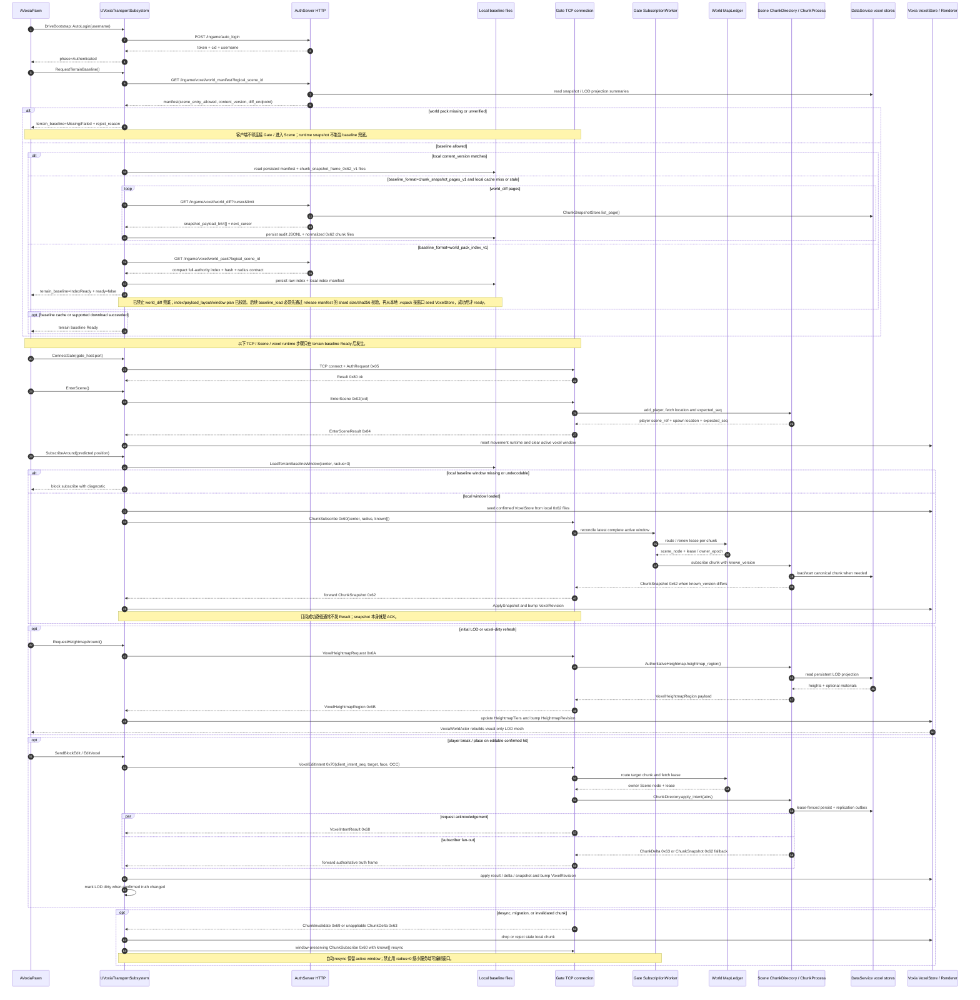
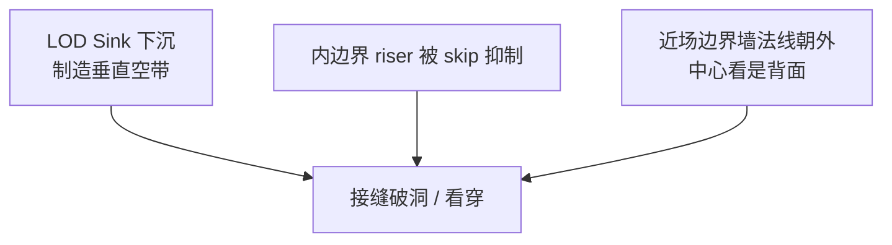

# 客户端流式与远景渲染当前事实
> 当前唯一事实文档。Voxia 是当前客户端主线和 streaming / baseline / LOD 实跑验收对象；`clients/web_client` 保留为仓库级 parity / oracle 参考；`clients/bevy_client` 是 Rust 参考实现。
> 本文档是合并态 snapshot,不含改动记录;演进过程与逐日证据见原始日期文档(docs/current_status/source_index.md 索引)。
## 客户端地位
| 客户端 | 当前定位 |
| --- | --- |
| `clients/Voxia` | UE5.8 native / 当前真实联调焦点，近远景渲染、baseline、streaming window、debug overlay、stdio CLI 的实跑验收对象 |
| `clients/web_client` | 仓库级默认 parity / oracle 参考，协议字节序与 decoder parity 默认以它验收 |
| `clients/bevy_client` | Rust/Bevy 参考实现，不作为当前 streaming / baseline 主线验收目标 |
Voxia 负责当前 native 产品化与客户端主线验收；web_client 只在协议 parity、字节序或旧 web 回归明确需要时进入验收矩阵。wire codec 真值仍以 `apps/gate_server/lib/gate_server/codec.ex` 为准。
## 当前拍板与实现边界
- 数据源投影路线为终态（2026-07-06 拍板，见 [`2026-07-06-projection-route-final-decision.md`](../../../voxel-server-authority/2026-07-06-projection-route-final-decision.md)）：客户端 snapshot-only，近窗 1m 只吃 `0x62/0x63`，远区只吃 7m source pages；配方 `base ⊕ overlay` 不跨 wire；客户端 WorldGen 永久定位为 `-VoxiaWorldGenPreview` / fixture 数据源；同构路线（客户端本地推导）降格为特定负载画像下的定向优化选项。
- 生产远景分带为 L0（`3×3×3 tiles` 1m 真值）+ L1-L3 四环 7/14/28/56m + 3.5m collar（T-2 已拍板）+ 天空层；派生环全链 2× 跳变，入带角尺寸 `<=20px`，预算无 merge `1.34M quads`（对当前默认 `3.70M` 为 `-64%`）。L4（d73-96 SVDAG raymarch）defer，三条触发条件写死，raymarch 保温限 `d<=72` AB profile。
- 术语口径以 [`glossary.md`](../../../voxel-server-authority/glossary.md) 为准：`base` / `delta` / `overlay` / `truth` / `snapshot` 已统一，source page 即“远区 7m snapshot”。
- 实施排期是三列里程碑：A 客户端渲染正确（显式 tier 契约 + 分组件 DynamicMesh StaticDraw + per-cell greedy merge + 覆盖性 seam 断言/collar + 顶点瘦身，零服务端依赖）-> B 接口冻结 + fixture 真消费（T-4 page payload/规约算子、T-11 分发通道、coverage radius 为 manifest 一等字段；客户端成为服务端接入 oracle）-> C 服务端接入（pages writer / dirty 聚合 + mip 基准 / 失效 opcode + HTTP 分发 / launcher 真实包）。设计全文见 [`2026-07-06-voxia-lod-layering-and-technology-design.md`](../../../voxel-server-authority/2026-07-06-voxia-lod-layering-and-technology-design.md)（v2.5，主体已拍板）。
- 分发范围契约（T-12，方向已拍板，字段随 B1 冻结）：pack/pages 的 expected 集合由服务端 manifest 声明，`required_shard_set = f(scene, 角色位置, 窗口契约)` 由服务端确定性计算；1m pack 三段式范围（保底段范围静态内容动态 / 热度段由运行时热度统计滚动维护、全沙盒兼容 / 窗口段差集下载 + 冷区传送 gate 补拉）；pages 以 7m 单档全图预下发并在 launcher 阶段差集拉平，14/28/56m 客户端整数规约不下发；pack = checkpoint 的分发形态，pack 新鲜度只是效率参数，正确性由 `known[]` 对账保证。
- 实现现状必须和拍板事实分开：当前仍是 `samples=4` 默认分级，source page 仍是 hash-gate-only dummy payload，无 greedy merge，里程碑 A 未开工。已有 source_pages 证据只证明客户端 retained fixture / artifact 契约、RuntimeMesh 上传、移动与 suppression 回归可用，不代表 launcher/offline 真实生产包、服务端 pages writer 或生产分带 renderer 已完成。
## Voxia 启动到体素交互时序
当前实现以 `AVoxiaPawn::DriveBootstrap` 和 `UVoxiaTransportSubsystem` 为客户端主轴：先完成 HTTP dev login 与本地 baseline/world-pack gate，再连接 Gate TCP、进入 Scene，最后才打开 active/editable voxel window 并消费服务端权威体素流。

关键约束：
- 本地 baseline 未 Ready 时，Voxia 不能进入正常 Gate/Scene streaming；`ChunkSnapshot` 只能是已验证基线之上的运行时权威同步，不能修补缺失 world pack。
- Voxia 支持 `world_pack_index_v1` compact index 下载与落盘，并在 `TerrainBaselineSnapshot()` 暴露 `baseline_format` / `baseline_endpoint` / `entry_gate_ready` / `pack_index_*` / `pack_payload_*` 字段；该状态先为 `index_ready` 且 `ready=false`，不会继续请求 `world_diff` 伪装下载完整 baseline。`LoadTerrainBaselineWindow` 要求本地 `scene_<id>_world_pack_release_manifest.json`，对窗口涉及的每个 `.vxpack` shard 执行 manifest `size_bytes` / `sha256` 校验后，才读取 footer-table `0x62` payload 并应用到 confirmed `VoxelStore`；缺 manifest、缺 shard entry、size/hash 不匹配或 payload 解码/scene/chunk mismatch 都会阻止进入正常 Gate/Scene streaming。`ConnectGate` / `EnterScene` 在 `entry_gate_ready=false` 时直接拒绝并写 `tcp_connect_rejected` / `enter_scene_rejected`，不会进入 socket bootstrap。验证证据：`Build.bat VoxiaEditor Win64 Development ... -NoLiveCoding` 退出 0、`Automation RunTests Voxia.Net.TerrainBaselineGate` 日志 `Test Completed. Result={Success}`，observe 只有 `tcp_connect_rejected`。
- `-VoxiaWorldGenPreview` / `-VoxiaWorldGenLocalBaseline` 是 dev-only 例外：Voxia 可跳过 HTTP world-pack manifest，按当前 L∞ window 本地生成 `FVoxiaWorldGenV1` chunk snapshot，并在窗口外裁剪 full voxel chunk、改由本地 WorldGen heightmap/LOD 显示。该模式只用于“运行后可见自动生成世界”的本地预览，不作为 H gate、decoder parity、编辑或服务端权威验收。
- 进入 Scene 后，`ChunkSubscribe 0x60` 表示完整 active/editable window；自动重订和 resync 必须保留该窗口语义。
- 客户端不乐观写 confirmed voxel truth；当前 Voxia 几何 confirmed store 只应用 `ChunkSnapshot 0x62`、`ChunkDelta 0x63`、`VoxelIntentResult 0x68` 的 authoritative cells 和 `ChunkInvalidate 0x69`，field store 应用 `0x73/0x74`，object state store 应用 `ObjectStateDelta 0x6C`。
- LOD 远景只读服务端派生 projection：`0x6A` 请求缺 projection cell 时应显式失败，客户端不运行本地噪声兜底。
## Voxia 近场
- 近场是服务端权威 3D chunk 流式。当前 debug/interactive near window 是 `SubscribeRadius = 3` chunks，即 `7×7×7 = 343` chunks；这个 `343 chunks` 正好是生产预算口径里的 `1 tile`，而生产近场 L0 目标的 `27 tiles` 指 `3×3×3` 个这样的 tile，不能把数字 27 当作 chunk 数。
- `-VoxiaWorldGenPreview` 下，近场窗口由客户端本地 WorldGen 生成完整 `16^3` chunk snapshot；`ChunkSubscribe` 只记录 active window，不向 server 请求 chunk snapshot，以免本地预览被空 server chunk 覆盖。默认/生产路径不走此分支。
- `FVoxiaNearVoxelWindow` 是当前近场窗口契约，负责 `center_tile` / `center_chunk` / `radius_tiles` / `chunk_count` 与跨 tile `entered/exited/retained` diff；`UVoxiaTransportSubsystem` 的 `active_tile_window` 是兼容字段，VHI/SVO 远景排除区、pawn debug snapshot、raycast editable 判定和 stream debug overlay 均优先读取同一个 near-window snapshot，旧 `LastSubscribedTile` 只作为无 near-window 时的 fallback。
- 近场带 collision、raycast、hit box、edit target。移动后 streaming center 用 post-movement player position，`GetStreamingWorldPosition()` 是 streaming、debug 和 editability 的统一位置源。
- `VoxiaWorldActor` 已从窗口变化后的同步整窗 mesh 改为按帧预算的增量 near mesh build，默认 `VoxiaNearMeshBuildBudgetMs=4` / `VoxiaNearMeshBuildMaxChunks=512`，并跳过空 chunk 与六面整实心邻居完全遮挡的整实心 chunk。VHI smoke 中跨 tile 后同步 tile window 装载约 `0.31s`，near mesh 后台完成约 `3.39s`，输出 `32566 quads`，跳过 `4418 empty chunks` / `2858 occluded full chunks`。
- 近场 fill bridge 已接入：首个 near mesh 还未产生可渲染 section 前，LOD inner skip 临时解析为 0 以闭合中心洞；near mesh 完成后强制 LOD 重建并恢复配置 skip。真实 RHI smoke `clients/Voxia/Saved/lod_near_fill_bridge_16x11.log` 显示 LOD 先输出 `326 quads`，near mesh 完成 `72765 quads` 后 LOD 回到 `197 quads`。最终形态仍应演进到按 dirty chunk/tile cache 的增量上传，避免每次 revision 都重组整窗 mesh buffer。
## Voxia 远景 LOD
- 远景仅视觉，无碰撞，不可编辑。当前协议仍是 `0x6A` heightmap request 与 `0x6B` heightmap region response；服务端 `0x6A` 读取 `SceneServer.Voxel.AuthoritativeHeightmap` 和 `DataService.Voxel.LodHeightmapStore` 的持久化 projection，缺 projection cell 显式失败，不再运行时重跑噪声兜底。
- `SceneServer.Voxel.LodProjection` 从权威 chunk storage/snapshot 派生 stride cells；projection row 当前包含 height 与 top material；`ChunkSnapshotStore.put_snapshot` 支持在同一 DB transaction 内写 chunk snapshot 与 projection rows。`SceneServer.Voxel.LodProjection.Rebuilder` 可显式从 canonical snapshots backfill projection，是 materialization / repair 工具，不是 runtime heightmap fallback。
- `0x6B` 固定头与 `heights:u16[]` 之后可追加 typed sections；section `0x01` 是 `materials:u16[]`，与 height 同顺序。Voxia decoder 会跳过未知 section，并把 material 样本暴露到 `lod` / `HeightmapSnapshot()`。
- 当前 heightmap tier 级联配置是 `{2,256},{4,256},{8,256},{16,1000}`。Voxia transport 在权威 `ChunkDelta` 应用成功或 `VoxelIntentResult` authoritative cell point-correction 改变本地 confirmed store 时递增 `lod_dirty_revision`；pawn 用 `VoxiaLodDirtyRefreshSeconds` 去抖后按当前 streaming 位置重发所有 `0x6A` tier 请求。订阅填充用的 `ChunkSnapshot` 不标记 LOD dirty，避免 `343 chunk` 初始填充造成远景请求风暴。
- `-VoxiaWorldGenPreview` 下，`RequestHeightmap` 本地生成 heightmap tier 并触发现有 `FVoxiaHeightmapMesher`；这是显式预览分支，不改变默认“远景只读服务端 projection”的约束。`/Game/Voxia/Maps/L_WorldGenPreview` 与 2.5D heightmap LOD 仍保留。
- inner-boundary skirt 已在 `FVoxiaHeightmapMesher` 实现并有 AutomationTest 断言。真实 RHI 证据：`Voxia.Voxel.HeightmapMesher` automation 退出 0；`/Game/Voxia/Maps/L_WorldGenPreview -VoxiaWorldGenPreview -VoxiaHeightmapLod=16x11 -VoxiaShot` 生成 `clients/Voxia/Saved/voxia_lod_skirt_16x11.png`（1280×720，888637 bytes，采样 `760+ unique colors`），日志 `clients/Voxia/Saved/lod_skirt_shot_16x11.log` 记录 `VoxiaWorldActor LOD terrain (async): 1 sections, 197 quads` 与 `requested screenshot`。
- 多 tier 默认级联已有真实 RHI smoke：`clients/Voxia/Saved/lod_multitier_default.log` 记录四个 tier 请求 `2x256`、`4x256`、`8x256`、`16x1000`，随后 `VoxiaWorldActor LOD terrain (async): 4 sections, 3030140 quads`；截图 `clients/Voxia/Saved/voxia_lod_multitier_default.png` 为 1280×720 / 679940 bytes / `213 sampled unique colors`。稳定性复跑 `clients/Voxia/Saved/lod_multitier_default_stability.log` 显示首轮 ProcMesh 上传阶段有 `1-3 FPS` 尖峰，上传完成后连续样本回到约 `112-134 FPS`。若产品要求入场过程也无尖峰，后续应把 LOD section 上传改为分帧或替换 runtime mesh。
## VHI 过渡形态
- VHI 是 Voxia 本地实验分支，入口为 `/Game/Voxia/Maps/L_WorldGenVhiPreview -VoxiaVhiPreview`；它只在新关卡/新 flag 下把窗口外 XZ tile 生成为连续 visual-only impostor mesh。生产路径尚未定义 VHI artifact 持久化格式、服务端 materialization、协议订阅面或 H gate 集成，且按最新拍板冻结为 2.5D 过渡 baseline。
- 默认参数为 `-VoxiaVhiTileRadius=72` / `-VoxiaVhiSamples=4` / `-VoxiaVhiInnerSkipRadius=0` / `-VoxiaVhiSinkCm=100`，按 7 chunk/tile、16 m/chunk 折算覆盖约 `±8.064 km`，并让 VHI 与近场 `3x3x3 tile` 窗口有一圈 underlap；VHI 顶面下沉 `100cm` 以降低近远边界 z-fighting / 裂缝可见性。VHI riser 只在相邻 built tile / 外缘之间补高度差，邻居是近场 skip tile 时不再生成竖面。
- VHI mesh 从同一 WorldGen 配置生成 2.5D top surface + 高差 riser，可作为廉价地表 baseline，但结构上不表达列内多段、内部空腔、浮空岛或真正 3D 远景。它不参与碰撞、编辑、raycast、confirmed truth 或 H gate。
- 当前本地 8km VHI smoke 为 `21024 tiles` / `336384 samples` / 约 `933k quads`；VHI tile-to-tile 高度来自同一确定性 WorldGen，所以一般不会出现随机错位，但它仍是非焊接 visual proxy，近远边界通过 underlap + sink 掩盖，不等于生产级几何连续性证明。
- VHI artifact 在 ThreadPool 后台生成，构建中收到的后续 center tile 请求会合并，旧后台结果完成时若已有更新 pending 则跳过旧结果，避免同一边界双上传。builder 按 tile 粒度输出 dirty / removed / built / reused 计数；`VoxiaWorldActor` 保持 tile artifact 为逻辑缓存单元，但渲染提交合批为 patch section，默认 `VoxiaVhiPatchTiles=8`。上传队列按离当前 tile 的 XZ 距离优先，同距离再按相机朝向优先；`VoxiaVhiUploadMaxPatchesPerFrame` 可限制每帧 patch 数，旧 `VoxiaVhiUploadMaxTilesPerFrame` 会按 patch 面积折算。首轮批量上传超过 `VoxiaVhiBulkHideThresholdPatches=64` 时先隐藏 VHI component，上传完成后一次显示；实测首轮 `361 sections` 上传期间可见 FPS 维持约 `100+`，完成后稳定约 `90 FPS`。
- PatchUploader / MeshComponentDesc 接入后的 CLI smoke 为 `build_elapsed_ms=889.7`、`uploaded_patches=361`、`live_sections=361`、`elapsed_ms=11355.1`。跨一个 tile 的 smoke 中第二次构建为 `built=4`、`reused=21020`、`removed=1`、`dirty=4`、`build_elapsed_ms=15.5`，最终 VHI 渲染为 `live_sections=361`，而不是 `21024` 个 tile section。剩余风险是首轮远景会等批量上传结束后出现；若可见客户端仍有尖峰，下一步优先把近场 tile window 的 load/unload 也改为后台 slab 流送，并把 VHI patch section 进一步替换为更稳定的 runtime mesh / HISM / Nanite-ready artifact。
## SVO 与 raymarch
- SVO preview 入口为 `/Game/Voxia/Maps/L_WorldGenSvoPreview -VoxiaSvoPreview`，保持近场完整 `3x3x3 tile`，窗口外约 8km 远景 visual-only，暴露 `svo` / `until_svo` CLI、`max_depth`、node/leaf/empty/solid/mixed、top/side/boundary quad、`build_ms` 统计和 seam check。SVO 构建在 ThreadPool 后台执行，构建中收到的新请求只保留最新 pending，完成后才发布 `svo_revision`；`svo` snapshot 暴露 `build_in_flight` / `has_pending_build`。
- SVO 远景已经从旧 top/riser proxy 升级为 3D occupancy octree leaf surface：每个 root macro-cell 递归分类为 empty / solid / mixed，mixed 节点按八叉树细分，终止叶子只在邻接 air 的 3D face 上导出 surface mesh。`FVoxiaFarFieldPatchGrid` 按默认 `VoxiaSvoPatchTiles=8` 把 mesh 拆成 `19×19 patch`，`AVoxiaWorldActor` 按 `VoxiaSvoUploadBudgetMs` / `VoxiaSvoUploadMaxPatchesPerFrame` 分帧上传。
- FarField 公共层已经收敛：`FVoxiaFarFieldCoveragePlanner` 统一 VHI/SVO 远景覆盖枚举，`FVoxiaFarFieldBuildPipeline` 收编 transport revision / serial / in-flight / pending coalesce/supersede 状态机，`FVoxiaFarFieldPatchUploader` 收编 VHI/SVO patch section 池、bulk-hide、pending queue、section fingerprint 复用和上传统计，`FVoxiaFarFieldMeshComponentDesc` 收敛远景 ProcMesh 属性。
- SVO builder 按 macro-cell 输出 artifact，并在相同 worldgen/几何配置下复用重叠 macro-cell；snapshot / observe 暴露 `built_macro_cell_count`、`reused_macro_cell_count`、`removed_macro_cell_count`、`dirty_macro_cell_count`、`cache_hit_rate`。CPU SVDAG 统计暴露 `svdag_node_count`、`svdag_unique_node_count`、`svdag_merged_node_count`、`svdag_compression_ratio`。runtime SVDAG resource 输出 CPU 侧 root table + 去重 node buffer，并暴露 `runtime_resource_ready`、`runtime_root_count`、`runtime_node_count`、`runtime_child_ref_count`、`runtime_gpu_bytes`、`runtime_compression_ratio`、`runtime_node_word_count`、`runtime_root_word_count`、`runtime_payload_bytes`；node payload 为 `16 uint32 / 64B`，root payload 为 `12 uint32 / 48B`。
- runtime payload 8km smoke 为 `runtime_node_word_count=58032` / `runtime_root_word_count=252192` / `runtime_payload_bytes=1240896`，payload byte size 与 `runtime_gpu_bytes` 一致；`FVoxiaSvoRuntimeGpuBuffers` 已把该 payload 上传为 ByteAddress buffer，8km smoke 日志为 `rhi_ready=1` / `rhi_bytes=1240896`。
- 首轮 null RHI CLI smoke 记录 `center_tile=[11,0,-51]`、`max_depth=1`、`macro_cell_count=21016`、`node_count=189144`、`leaf_count=168128`、`empty_leaf_count=74062`、`solid_leaf_count=1383`、`mixed_leaf_count=92683`、`top_quad_count=88419`、`side_quad_count=66980`、`boundary_side_quad_count=1`、`quad_count=155399`、`estimated_visible_range_m=8064.0`、`seam_check.status=pass`，上传日志为 `uploaded_patches=361` / `live_sections=361` / `total_quads=155399` / `elapsed_ms=537.6`。同日 real RHI smoke 的 SVO build 为 `build_ms=571.910`、分片上传 `elapsed_ms=1365.0`，上传完成后 FPS 样本约 `104-115`。PatchUploader / MeshComponentDesc 接入后的 null RHI smoke 仍为 `macro_cell_count=21016` / `quad_count=155399` / `seam_check.status=pass`，上传日志为 `uploaded_patches=361` / `live_sections=361` / `elapsed_ms=266.5`。
- macro-cell artifact/cache 移动 CLI smoke：首次 build `built_macro_cell_count=21016` / `reused_macro_cell_count=0` / `cache_hit_rate=0.000` / `build_ms=436.436`；移动到 `center_tile=[17,0,-51]` 后第二次 build `built_macro_cell_count=879` / `reused_macro_cell_count=20137` / `removed_macro_cell_count=879` / `dirty_macro_cell_count=879` / `cache_hit_rate=0.958` / `build_ms=87.482`，`seam_check.status=pass`。upload-level section 复用 smoke：跨 1 tile 时首次为 `uploaded_patches=361` / `reused_patches=0`，第二次为 `uploaded_patches=39` / `reused_patches=322` / `live_sections=361`，SVO snapshot 为 `built_macro_cell_count=148` / `reused_macro_cell_count=20868` / `cache_hit_rate=0.993` / `seam_check.status=pass`。
- confirmed-store source 已接入为客户端已有 confirmed store 的覆盖门槛、构建入口和 dev-only 小范围 preload 预算门禁。默认 WorldGen 8km 路径仍为 `source_kind=worldgen` / `source_complete=true` / `macro_cell_count=21016` / `quad_count=155399` / `seam_check.status=pass`；`-VoxiaSvoConfirmedSource -VoxiaSvoTileRadius=0 -VoxiaSvoNearSkipRadius=-1` 在完整 1-tile coverage 下为 `source_kind=confirmed_voxel_store` / `source_complete=true` / `missing_source_chunk_count=0` / `macro_cell_count=1` / `quad_count=28` / `seam_check.status=pass`；同 flag 下只加载 1 tile 却请求 radius=1 时硬失败为 `source_complete=false` / `missing_source_chunk_count=2744` / `quad_count=0` / `build_error="missing confirmed voxel chunk coverage for SVO source: 2744 chunks"`。radius=1 / `-VoxiaSvoConfirmedSourceMaxChunks=3000` smoke 为 `expected_source_chunk_count=3087` / `present_source_chunk_count=3087` / `missing_source_chunk_count=0` / `quad_count=174` / `seam_check.status=pass`；8km confirmed-source 同预算在 build 前拒绝为 `expected_source_chunk_count=7208488` / `missing_source_chunk_count=7208488` / `quad_count=0` / `build_error="SVO confirmed source requires 7208488 missing chunks, above preload budget 3000"`。
- `FVoxiaSvoRaymarchCS` 已有 compute dispatch probe 与 preview grid 读回：真实 RHI 下绑定 runtime SRV + dispatch output UAV，默认提交 `1×1` global shader dispatch，并可用 `-VoxiaSvoRaymarchPreviewGrid=N` 触发有界 GPU preview grid readback；`-nullrhi` 路径保留 CPU/RHI buffer 参数验证并显式跳过 dispatch/readback 断言。`Voxia.Voxel.SvoPreview` automation 在真实 D3D12 / `PCD3D_SM6` 下验证 `FVoxiaSvoRaymarchCS` permutation 可用、提交 `1×1` dispatch 和 `4×4` preview grid dispatch，并读回 `64 uint32`；同一 automation 断言 `4×4` readback 会生成 `16` 个非空 `FColor` 预览像素，并断言 `SnapshotJson` 暴露 `raymarch_visual_pixels` / `raymarch_readback`。
- raymarch traversal 现状：`VoxiaSvoRaymarch.usf` 用同一套 shader helper 选择 root-atlas cell，读取 root/node ByteAddress payload，按 child mask / occupancy / material id top-down 走到首个非空 leaf；preview-grid readback 第 4 word 固定编码 hit/miss，`CompositePS` 只在命中 leaf 时按 material color 与 hit depth 衰减 alpha 写回 SceneColor。该路径仍是 debug-gated 客户端可视化，不等于生产 camera-correct world-space ray renderer，也不参与协议、碰撞、编辑或 H gate。
- scene-depth occlusion 已接入 debug composite：`FVoxiaSvoRaymarchCompositePS` 绑定 `SceneTextures`，默认启用 `bDepthOcclusionEnabled`，用 `SvoNearDeviceDepth` / `SvoFarDeviceDepth` / `DepthOcclusionBias` 把 SVO 命中深度映射到 device depth 后与 scene depth 比较；`-VoxiaSvoRaymarchNoDepthOcclusion` 可显式关闭。`Voxia.Voxel.SvoPreview` automation 断言 composite 参数面暴露上述参数，`Voxia.Gameplay.WorldActor` automation 断言默认启用且可用 flag 关闭。真实 RHI smoke `clients/Voxia/Saved/svo_raymarch_depth_occlusion_composite.log` 记录 `depth_occlusion=1` 与 `scene color written output=[1920,1080] nodes=72 max_depth=4 alpha=0.25`。
- world-space root selection 与 root lookup DDA 已接入 debug composite：`-VoxiaSvoRaymarchWorldSpace` 会让 composite pass 上传当前 view origin / forward / right / up / FOV 到 SVO macro 空间；runtime payload 为规则 coverage 生成 root lookup grid 并上传 `VoxiaSvoRuntimeRootLookup` ByteAddress buffer；shader 侧优先按 camera ray 做 XZ DDA 查 root，命中 root 后复用 top-down leaf traversal；`-VoxiaSvoRaymarchNoRootLookup` 可回退旧的 `-VoxiaSvoRaymarchWorldRootScanLimit=N` 线性扫描。真实 RHI `Voxia.Voxel.SvoPreview` 覆盖 raymarch CS / composite PS 编译和 preview-grid dispatch/readback；`clients/Voxia/Saved/svo_raymarch_root_lookup_composite.log` 记录 `scene color written output=[1707,1067] nodes=589 max_depth=4 ... world_space=1 root_lookup=1 root_lookup_cells=9 root_scan_limit=512`。
- world-space raymarch preview-grid 可观测性：`FVoxiaSvoRaymarchCS::DispatchPreviewGridProbe` 可接收 world-space/root-lookup probe config，`svo` / `snapshot` 暴露 `raymarch_world_space`、`raymarch_root_lookup`、`raymarch_root_lookup_grid`、`raymarch_hit_samples`、`raymarch_miss_samples`、`raymarch_invalid_samples`；`AVoxiaWorldActor` 在 `-VoxiaSvoRaymarchWorldSpace` + preview-grid/screen-probe 下使用同一套 camera-ray 参数。真实 RHI `Voxia.Voxel.SvoPreview` automation 验证默认 atlas readback 为 `hit_samples=12` / `miss_samples=4` / `invalid_samples=0`，确定性 world-space + root lookup readback 为 `hit_samples=16` / `miss_samples=0` / `invalid_samples=0` / `root_lookup=[5,5]`。真实 RHI offscreen 小半径 smoke 记录 `raymarch_readback=true` / `raymarch_visual_pixels=16` / `raymarch_world_space=true` / `raymarch_root_lookup=true` / `raymarch_hit_samples=16` / `raymarch_invalid_samples=0`。
- 8km real-RHI smoke 的当前通过条件是 `until_svo_uploaded`：`svo.presentation_revision == svo.revision`、`svo.presentation_consumed=true`、`svo.upload_complete=true`、`svo.upload_queue=0`，并同时要求 seam pass、raymarch world-space/root-lookup 可观测、`raymarch_invalid_samples=0` 和 `client_network_ready.rendering_ready.ready=true`。`until_svo_composited` 进一步要求 debug-gated SVO screen pass 已 observed post-process pass 并写回 SceneColor；8km real-RHI composite smoke 记录 `raymarch_composite_scene_color_written=true`、`raymarch_composite_output=[1423,889]`、`raymarch_composite_nodes=96712`、`raymarch_composite_root_lookup=true`。该证据只描述客户端渲染链路，不代表服务端远景权威源、opcode/AOI 规则、持久化 artifact 或 launcher/update 完成。
- `capture_screenshot` / `audit_png` 可在同一次 real-RHI smoke 内完成截图落盘和 PNG 像素审计。8km overview smoke 在 `until_svo_composited` 后把相机移到高空远景视角，生成 `clients/Voxia/Saved/voxia_svo_8km_overview.png`（1423×889，1303373 bytes），像素审计为 `non_black_ratio=0.578711`、`unique_colors=51970`、`passed=true`。跨 tile 8km real-RHI smoke 执行 `move 12000 0 0` 后等待 revision 2，最终记录 `center_tile=[12,0,-51]`、`presentation_revision=2`、`presentation_consumed=true`、`upload_complete=true`、`upload_queue=0`、`reused_macro_cell_count=20760`、`cache_hit_rate=0.988`、`raymarch_composite_scene_color_written=true`、`rendering_ready.raymarch.composite.ready=true`。
- `render_perf` / `sample_render_perf` 是真实 RHI 帧率结构化验收入口。8km overview perf smoke 在高空视角触发 revision 2 后等待 `until_svo_uploaded 240000 1000 2` / `until_svo_composited 240000 1000 2`，再运行 `sample_render_perf 10000 1000 30 5`；产物 `clients/Voxia/Saved/svo_8km_perf_smoke.log` 记录 `sample_count=10`、`average_fps=69.014`、`min_fps=42.790`、`max_frame_ms=23.370`、`passed=true`，最终 `render_perf.average_fps=85.843`，且 `client_network_ready.rendering_ready.ready=true` / `svo.upload_complete=true` / `svo.upload_queue=0`。
- 超大地形 raymarch profile 使用 `-VoxiaSvoRaymarchOnly` / `-VoxiaSvoSkipProxyMesh`，保留 runtime SVDAG GPU payload 与 composite pass，但跳过传统 SVO proxy mesh section / HISM / RuntimeMesh 上传，避免数百万 quad debug proxy 把显存压力误算进 screen renderer。最大半径 smoke 请求 `-VoxiaSvoTileRadius=108`，被 `FVoxiaSvoPreview::MaxRadiusTiles` clamp 到 `96`（约 `10.752km`）；`clients/Voxia/Saved/svo_max_raymarch_only_smoke.log` 记录 `macro_cell_count=37240`、`quad_count=4779271`、`runtime_payload_bytes=9322308`、`upload_queue=0`、`raymarch_composite_scene_color_written=true`、`rendering_ready.raymarch.composite.ready=true`，`sample_render_perf` 为 `average_fps=120.807` / `min_fps=96.753` / `max_frame_ms=10.336` / `passed=true`。截图 `clients/Voxia/Saved/voxia_svo_max_raymarch_overview.png` 为 1423×889，PNG 审计 `non_black_ratio=0.875069`、`unique_colors=3390`、`passed=true`；UE 原始日志记录 `SVO proxy mesh skipped ... source_quads=4779271 rhi_bytes=9322308`。
- 其他 raymarch / backend 证据：`clients/Voxia/Saved/svo_raymarch_snapshot_metrics.log` 记录 `raymarch_dispatched=1` / `raymarch_grid=[4,4]` / `raymarch_readback=1` / `raymarch_visual_pixels=16` / `raymarch_nodes=1088` / `raymarch_roots=16`；`clients/Voxia/Saved/svo_raymarch_screen_probe.log` 记录 `raymarch_mode=screen_probe` / `raymarch_grid=[240,135]` / `raymarch_samples=32400` / `raymarch_readback=1` / `raymarch_visual_pixels=32400`；`clients/Voxia/Saved/svo_raymarch_composite_pass.log` 记录 `VoxiaSvoRaymarchComposite: postprocess pass observed output=[1920,1080] nodes=1088 max_depth=4 alpha=0.25`；`clients/Voxia/Saved/svo_raymarch_composite_write.log` 记录 `VoxiaSvoRaymarchComposite: scene color written output=[1920,1080] nodes=1088 max_depth=4 alpha=0.25`；`clients/Voxia/Saved/svo_raymarch_traversal_composite.log` 同时记录 `raymarch_readback=1` 与 `VoxiaSvoRaymarchComposite: scene color written output=[1920,1080] nodes=1088 max_depth=4 alpha=0.25`。`clients/Voxia/Saved/svo_hism_backend_smoke.log` 记录 `render_backend=hism` / `hism_instances=905`；`clients/Voxia/Saved/svo_runtime_mesh_backend_smoke.log` 记录 `render_backend=runtime_mesh` / `runtime_mesh_vertices=3620` / `runtime_mesh_triangles=1810`。
- SVO far-field 已有 backend-neutral render artifact 契约。`FVoxiaFarFieldRenderArtifactDesc` 记录 live patch 的 fingerprint、vertex/index/quad 计数、bounds、normal/color/UV 输入就绪、collision 标记、当前 render backend 以及 static / Nanite bake ready 标记；`FVoxiaFarFieldPatchUploader` 在 patch 上传成功时生成 artifact，删除 patch 时同步移除，且只在 fingerprint、backend、collision 设置一致时复用 live patch。`Voxia.Voxel.FarField` 覆盖 artifact 生成/删除/复用，`Voxia.Voxel.FarFieldPatchUploader`、`Voxia.Gameplay.WorldActor`、`Voxia.Voxel.FarField` 与真实 RHI smoke 覆盖 HISM instance descriptor、SVO HISM backend、DynamicMesh builder 和 SVO RuntimeMesh backend。HISM 是专用 profile，不作为 source_pages 通用默认；RuntimeMesh / DynamicMesh 后端是 UE 内置 DynamicMesh 视觉路径，不等于 Nanite bake、runtime distance field、Lumen 生产照明路径、碰撞、编辑或 H gate。Nanite bake 后端仍未接入。
## source_pages 生产路径
- `-VoxiaSvoSourcePages` 选择 `source_pages` source kind，先校验 `svo_source_pages_v1` manifest 的 scene/content/source/diff/material/renderer artifact version、source page 存在性和 SHA1；校验失败时只暴露诊断，不 fallback 到 WorldGen 或把 missing 当空气。
- SVO macro-cell mesh artifact 支持持久化 cache，key 混入 content/source/diff/material 版本、scene、macro-cell/LOD/sample 配置、renderer artifact version 和 source kind；`source_pages` 路径只加载预物化 artifact，缺 cache 时 `mesh_artifact_ready=false`。
- `svo` / observe / `client_network_ready.rendering_ready` 区分 mesh renderer readiness 与 raymarch runtime readiness：默认 mesh renderer 看 `farfield_source_ready`、`mesh_artifact_ready`、presentation consumed、upload complete、upload queue 和 seam pass；raymarch-only 仍单独要求 runtime SVDAG / composite readiness。
- `Voxia.Voxel.SvoPreview` automation 覆盖 source_pages 正向闭环，以及缺 manifest、source page hash mismatch、macro-cell artifact missing 的负向 gate；缺文件路径会先显式 `FileExists`，避免预期诊断污染 `LogStreaming` warning。`svo_source_pages_probe` 在临时 fixture 中验证 source_pages 正向加载和三条负向 gate，复跑日志 `clients/Voxia/Saved/svo_source_pages_cli_probe_rootdir.log` 为 `ok=true`。
- source_pages 路径默认选择 RuntimeMesh / `UDynamicMeshComponent`，判定同时绑定 `-VoxiaSvoSourcePages` 和 `SourceKind=source_pages` build result；ProcMesh 退为显式 `-VoxiaSvoRenderBackend=ProcMesh` 调试基线；WorldGen / confirmed-store 预览路径仍默认 ProceduralMesh section，避免破坏既有小范围 correctness smoke。`Voxia.Gameplay.WorldActor` automation 覆盖该默认策略，CLI probe 也验证 source_pages artifact 可生成 renderable RuntimeMesh 输入（`3604 vertices` / `1802 triangles` / `901 quads`）。
- source page manifest 与 payload root 已解耦：`-VoxiaSvoSourcePageRoot=...` 显式指定时，manifest 内相对 page path 相对该 root 解析；root 配错会报告 `source_pages_missing` 并阻断 far-field source。`svo_source_pages_fixture [tile_x tile_y tile_z]` 生成 `manifests/`、`source_pages/`、`artifacts/` 分离的本地 retained package 并返回可复用 `launch_args`。
- source_pages + 默认 RuntimeMesh 的真实 RHI 单页证据：`clients/Voxia/Saved/svo_source_pages_runtime_mesh_y2_upload_smoke.log` 退出 0，最终 `source_kind=source_pages`、`renderer_backend=runtime_mesh`、`source_complete=true`、`farfield_source_ready=true`、`source_pages_present=1` / `missing=0`、`mesh_artifact_ready=true`、`quad_count=958`、`presentation_consumed=true`、`upload_complete=true`、`upload_queue=0`、`seam_check.status=pass`。截图 `clients/Voxia/Saved/voxia_svo_sourcepages_runtime_mesh_y2.png` 审计 `unique_colors=6901`、`non_black_ratio=1`、`passed=true`，人工复核可见 voxel side wall；y=0 包在低相机高度切到 y=2 时按预期因缺 vertical page 硬失败，说明没有 WorldGen fallback。
- `svo_source_pages_fixture [tile_x tile_y tile_z] [radius_tiles] [vertical_radius_tiles] [near_skip_radius_tiles]` 在 `vertical_radius_tiles>0` 时额外写入上下 y 层 source page 与 persistent artifact，并在返回 JSON 的 `vertical_checks` 中逐层跑 `BuildSourcePagesMacroCellUpdate`；该能力只扩大本地包覆盖，不改变当前 SVO build 的运行时 coverage 语义。CLI 证据 `clients/Voxia/Saved/svo_source_pages_fixture_multiy_radius1.log`：`svo_source_pages_fixture 11 0 -51 1 1 -1` 生成 `stored_source_page_count=27`、`stored_artifact_count=27`，`vertical_checks.ok=true` / `checked_layers=3` / `ready_layers=3`，正向 build 为 `expected_pages=9` / `present_pages=9` / `artifact_loaded_macro_cells=9` / `quad_count=7435` / `default_renderer_backend=runtime_mesh`。
- `3x3x3` source_pages retained package 可驱动默认 RuntimeMesh 真实 RHI 上传。命令使用 `-VoxiaWorldGenPreview -VoxiaSvoPreview -VoxiaSvoSourcePages -VoxiaSvoTileRadius=1 -VoxiaSvoNearSkipRadius=-1`，传入 fixture 的 `manifests/`、`source_pages/`、`artifacts/` 三个根目录，并在传送到 tile `[11,0,-51]` 后等待 `until_svo_uploaded 180000 9 1`。产物 `clients/Voxia/Saved/svo_source_pages_multiy_radius1_real_rhi_upload_worldgenpreview_retry.log` 退出 0，最终 `source_kind=source_pages`、`renderer_backend=runtime_mesh`、`source_complete=true`、`farfield_source_ready=true`、`source_pages_expected=9` / `present=9` / `missing=0`、`artifact_cache_loaded_macro_cells=9`、`quad_count=7435`、`presentation_revision=2`、`presentation_consumed=true`、`upload_complete=true`、`upload_queue=0`、`seam_check.status=pass`。raymarch runtime 未参与该 mesh smoke。
- `until_svo_source_pages_uploaded [timeout_ms] [expected_pages] [min_revision]` 把 source_pages 生产路径的等待条件收紧为 `source_kind=source_pages`、`renderer_backend=runtime_mesh`、`farfield_source_ready=true`、`mesh_artifact_ready=true`、expected/present 页数精确匹配、`source_pages_missing=0`、`source_pages_hash_mismatch=0`、artifact cache 命中、presentation revision 被消费、upload queue 清空和 seam pass。`clients/Voxia/scripts/run_svo_source_pages_fixture_smoke.js` 是两阶段 runner：先生成 retained fixture，再用返回的 `launch_args` 重启真实 RHI 客户端并等待上述严格条件。产物 `clients/Voxia/Saved/svo_source_pages_fixture_runner_real_rhi.log` 退出 0，最终 `expected_pages=9`、`source_pages_present=9`、`source_pages_missing=0`、`source_pages_hash_mismatch=0`、`artifact_cache_loaded_macro_cells=9`、`quad_count=7435`、`presentation_revision=2`、`upload_complete=true`、`upload_queue=0`、`seam_check.status=pass`。
- `svo_source_pages_fixture` 第 7 个可选参数 `[movement_radius_tiles]` 会额外保存邻近 X/Z center 需要的 source page 与 macro-cell artifact key 变体，并用 `movement_checks` 证明同一包移动后仍可命中；`svo_source_pages_fixture 11 0 -51 1 1 -1 1` 产物 `clients/Voxia/Saved/svo_source_pages_fixture_move_radius1.log` 记录 `stored_source_page_count=75`、`stored_artifact_count=75`、`movement_checks.ok=true`、`checked_centers=27`、`ready_centers=27`。`run_svo_source_pages_fixture_smoke.js` 默认先验证初始中心，再移动到 +X 相邻 tile 并等待后续上传 revision；真实 RHI 产物 `clients/Voxia/Saved/svo_source_pages_fixture_runner_move_real_rhi.log` 退出 0，最终 `center_tile=[12,0,-51]`、`revision=4`、`source_pages_expected=9`、`source_pages_present=9`、`source_pages_missing=0`、`artifact_cache_loaded_macro_cells=9`、`quad_count=7606`、`presentation_revision=4`、`presentation_consumed=true`、`upload_complete=true`、`upload_queue=0`、`seam_check.status=pass`。
- source_pages + 默认 RuntimeMesh 路径已覆盖 focus suppression 真实 RHI 回归。`svo` / observe 暴露 `suppressed_macro_cells` 与 `suppression_serial`；`until_svo_source_pages_suppressed [timeout_ms] [expected_pages] [min_revision] [min_suppressed]` 在 source_pages 上传严格条件之外要求被 focus 覆盖的远景 macro-cell 确实被裁掉；`run_svo_source_pages_fixture_smoke.js --focus-suppress --no-move` 创建 confirmed debug focus 并等待该条件。产物 `clients/Voxia/Saved/svo_source_pages_fixture_runner_focus_suppression_real_rhi.log` 退出 0，最终 `center_tile=[11,0,-51]`、`revision=2`、`source_pages_expected=9`、`source_pages_present=9`、`source_pages_missing=0`、`artifact_cache_loaded_macro_cells=9`、`suppressed_macro_cells=9`、`suppression_serial=1`、`quad_count=7435`、`presentation_consumed=true`、`upload_complete=true`、`upload_queue=0`、`seam_check.status=pass`。该 suppression 只裁掉低保真 far visual，不改变 confirmed store、碰撞、raycast、编辑或服务端 truth。
## Interest 与远程交互
- Voxia 客户端 Interest Runtime 由 `UVoxiaClientInterestSubsystem` 和纯 C++ `FClientInterestRuntime` 组成，把玩家周围 high-fidelity `near`、低频 visual map sync `far`、按需 hydration 的 `focus` 区域统一成可观测状态机。SVO/VHI/heightmap 远景从 Transport revision 注册为 `far_*` visual layer；`interest_focus` 创建 `focus_*` 区域并产出 outbound hydrate request，`interest_focus_ready` / `interest_remote_focus` 可模拟网络确认，重叠 focus 会 suppress far visual 表达。该层是客户端策略面，不是 confirmed truth 来源。
- Interest Runtime 是自维护子系统：`UVoxiaClientInterestSubsystem::Tick` 自动读取 Transport 的 near-window、SVO、VHI、heightmap revision 来维护 `near` / `far` visual 状态，同时推进 focus lease/cooling；快照暴露 `auto_refresh`、`last_refresh_seconds`、`last_refresh_age_seconds`，CLI `interest_raw` 可在不显式 refresh 的情况下验证 Tick 自动刷新。
- 客户端真实 focus 输入入口已接入：`VoxiaPawn` 绑定 `T` 为 telescope/focus 请求，通过 `VoxiaFocusTarget` 从当前 camera ray 和 `-VoxiaFocusDistanceCm` / `-VoxiaFocusRadiusTiles` / `-VoxiaFocusLeaseSeconds` 推导远程 tile，调用 Interest `focus_promote` 并把请求转入 Transport interest outbox。CLI `focus_input` 走同一条 Pawn 路径，`snapshot.last_focus` 暴露 target tile、region id、drained/enqueued、wire flag 与 flush report；该入口只产生 hydrate request，不伪造 confirmed truth。
- Transport interest outbox 支持自动 drain、auto flush、retry、expiry prune 和 ACK。`UVoxiaTransportSubsystem::Pump` 先刷新 `UVoxiaClientInterestSubsystem`，再把 focus / far visual sync runtime pending request 搬到 Transport interest outbox，然后按 `-VoxiaInterestAutoFlushSeconds=N` cadence 自动 flush；默认 `wire_disabled` dry-run，`interest_outbox`、`interest_auto_flush`、`interest_wire_status`、`interest_raw` 暴露 pending/发送/ACK、attempts、retry interval、wire flag、last flush report、`auto_drain.total_drained`、`last_count`、`last_age_seconds`。未进场时显式返回 `cannot send interest focus request before entering scene`，进场后但 opcode 未分配时返回 `interest_focus_wire_opcode_unassigned` 并保留 pending；客户端不会复用 `ChunkSubscribe 0x60`，因为它会改变 active/editable window 语义。
- Interest Sync Scheduler 随 `interest` snapshot 输出，CLI `interest_sync` 可直接观察；scheduler 用 region `sync_hz` 计算 due/next due，用 layer/state 计算 priority，并暴露 `scheduled`、`deferred_by_budget`、`stale`、`suppressed` 和 action。默认语义是 near / focus 高优先级、far 低频 visual map sync 低优先级；focus 覆盖区域会 suppress far，让远程高保真 hydration 不被低保真远景预算竞争。
- far visual map sync 已具备客户端请求和结果接收边界：`FClientInterestRuntime` 在未被 focus 压制的 far region 到期时生成 `far_visual_sync` request，携带 `backend`、`sync_hz`、`known_revision`、`expires_at`，固定 `requires_confirmed_snapshot=false`；Transport outbox 按 `kind + region_id` 合并同类 pending。`-VoxiaInterestFarSyncOpcode=0xNN` 可启用 `far_visual_sync_body_v1` 编码，默认未配置时显式返回 `interest_far_sync_opcode_unassigned`。`-VoxiaInterestFarSyncResultOpcode=0xNN` 让 inbound interest adapter 识别 `far_visual_sync_result_body_v1`，Transport 只接受 visual-only `0x6B VoxelHeightmapRegion` payload，先预解确认合法，再复用现有 `0x6B` consumer 更新 `HeightmapTiers` / `HeightmapRevision` 并 ACK 匹配 pending。CLI `interest_lifecycle_probe` 验证 far sync request queued，`interest_far_sync_loopback` 验证 pending request -> configured result frame -> `0x6B` visual payload apply -> outbox ACK -> `lod` 更新；该 result 不消费 `0x62` / `0x63`，不写 confirmed voxel store，也不让 far coverage 变成 interactive。
- focus hydrate 接收侧 wire adapter 和可配置 opcode 已接入客户端：`FClientInterestWireDecoder::TryDecodeFocusHydrateFrame` 默认因 opcode 未分配不消费现网帧，`DecodeFocusHydrateBody` 固化 `focus_hydrate_body_v1` body contract，CLI `interest_decode_focus_hydrate_body` 无副作用验证 body encoder / decoder。`-VoxiaInterestFocusPromoteOpcode=0xNN` 让 sender 编码 `focus_promote_body_v1` framed packet；`-VoxiaInterestFocusHydrateOpcode=0xNN` 让 inbound adapter 识别对应 frame 并解 `focus_hydrate_body_v1`。`interest_wire_status` 暴露 assigned/valid/opcode/reason，默认未配置是 unassigned，配置为既有协议 opcode 或两者相同会显式 invalid，避免复用 `0x60` / `0x62` / `0x63` 等稳定语义。
- focus hydrate apply 闭环已接入：`ApplyInterestFocusHydratePayloads` / CLI `interest_remote_focus_payloads` 先消费 confirmed `ChunkSnapshot 0x62` / `ObjectStateDelta 0x6C` / `FieldRegionSnapshot 0x73` payload，再打开 focus interactive；`ChunkDelta 0x63` 暂不作为 hydrate seed，避免本地缺 base version 时假确认。`UVoxiaTransportSubsystem::ApplyInterestFocusHydrateFrame` 会把配置 opcode 的 frame 解码后交给该路径，CLI `interest_apply_focus_hydrate_frame` 验证 frame -> confirmed payload apply -> focus interactive -> outbox ACK；`interest_focus_loopback` 在配置 focus promote / hydrate opcode 后可一条命令创建 focus 请求、drain 到 Transport outbox、编码 configured promote / hydrate payload、应用 confirmed hydrate frame，并验证最终 `interactive_focus_count` 与 outbox ACK。
- Interest 高保真覆盖查询已接入：`FClientInterestRuntime::QueryTileCoverage` / `QueryChunkCoverage` 会在 near、far visual、focus hydrating / interactive 之间选出当前 tile/chunk 的客户端策略覆盖，并返回 `interactive`、`visual_only`、`confirmed_truth_applied`、`region_id`、`layer/state/fidelity`。Voxia Pawn 的编辑命中 gating 复用该契约，只有 confirmed chunk 且处在 near 或 confirmed focus interactive 覆盖下才放行 intent；far visual 和 hydrating focus 不会被误当成可交互。
- Focus 生命周期约束：`FClientInterestRuntime` 默认最多保留 `4` 个 hydrating / interactive focus，可用 `-VoxiaInterestMaxActiveFocus=N` 调整；超额时按最旧 last-touched focus 进入 cooling，移除本地待发送请求并解除 far visual suppression。`interest` snapshot 暴露 `active_focus_count`、`max_active_focus`、`focus_eviction_count`、`last_focus_evicted_region`、`last_focus_eviction_reason`，observe 记录 `voxia_interest_focus_budget_evicted`。`FClientInterestNetworkRequest` 暴露 `created_at` / `expires_at`；focus lease 过期时 runtime 让区域进入 cooling、移除同 region pending request，并在 `interest.expired_focus_request_count` / `last_expired_focus_request_region` 与 observe `voxia_interest_focus_request_expired` 可见。已 drain 到 Transport outbox 的请求会在手动 `interest_flush` 和 auto-flush 前按 `expires_at` 剪枝，`interest_outbox.total_expired` 记录数量，flush 返回 `expired_before_flush`。CLI `interest_lifecycle_probe [sync_budget] [max_focus]` 可确定性验证远景低频 sync、预算延后/stale、focus suppression、focus budget eviction、lease 过期清理和 outbox expiry prune。
- 远程交互 facade `VoxiaRemoteInteraction` 统一“远程技能 / 望远镜 / CLI action 是否可执行”的 coverage gate：confirmed near / confirmed focus interactive 返回 `ready=true`，far visual 与 hydrating focus 只返回诊断；`remote_action` CLI 在未 ready 时只创建 focus hydrate request 并进入 Transport outbox，`remote_action_check` 无副作用只检查 gate。`VoxiaPawn` 的 `T` focus 输入走同一个 facade。
- remote action 客户端出站边界和 wire contract 已接入。`VoxiaPawn` 绑定 `R` 键为真实用户入口，CLI 提供 `remote_action_input`、`remote_action_outbox`、`remote_action_flush [wire]`、`remote_action_wire_status`、`remote_action_decode_result`、`remote_action_apply_result`、`remote_action_result`；`snapshot.last_remote_action` 暴露 action、ready、intent id、region、coverage result 与 flush report，`transport.remote_action_result` 暴露服务端 result adapter 的最近 acceptance/rejection。coverage ready 时创建 `FVoxiaRemoteActionIntent` 并进入 Transport remote action outbox；默认 flush 是 `wire_disabled` dry-run，传 `wire` 后只有配置 `-VoxiaRemoteActionRequestOpcode=0xNN` 且已进场才编码 `remote_action_request_body_v1` framed packet。`-VoxiaRemoteActionResultOpcode=0xNN` 让 inbound pump 识别 `remote_action_result_body_v1` 并更新 result snapshot。`remote_action_result_body_v1` 成功应用后用 intent id（无 id 时用 region + action）ACK 并移除匹配 pending，`remote_action_outbox.total_acknowledged` 和 HUD ack 计数同步可见。
- remote action pending 生命周期支持 TTL、expiry、auto flush 和 retry：`FVoxiaRemoteActionIntent` 暴露 `timeout_seconds` / `expires_at`，Transport enqueue 按 `-VoxiaRemoteActionTimeoutSeconds=N` 填默认 TTL；`remote_action_flush` 在 dry-run 或 wire 发送前都会 prune expired intent，返回 `expired_before_flush`，`remote_action_outbox.total_expired` 与 HUD `exp` 计数同步可见。CLI `remote_action_lifecycle_probe` 无副作用验证 timeout/expires、expired prune 和 result ACK。`UVoxiaTransportSubsystem::Pump` 会对 pending remote action intent 做节流 auto-flush；默认 wire 关闭时 dry-run 保留 pending，加 `-VoxiaRemoteActionWire` 后走 feature-gated sender，未进场或 opcode 未分配时显式拒绝并保留 pending。`transport.remote_action_auto_flush` 与 CLI `remote_action_auto_flush` 暴露 attempts、retry interval、wire flag 和 last flush report；`-VoxiaRemoteActionAutoFlushSeconds=N` 可调整 cadence。
- 默认 UMG HUD 与 `-VoxiaDebugCanvasHUD` 有 remote-action/focus compact overlay，直接读取 Transport / Interest typed read-only state，显示 action pending、sent、accepted/rejected result、request/result wire readiness、last result intent/cov/result revision、focus interactive/active/pending，以及 voxel/heightmap/VHI/SVO revision。该 overlay 只是可观测面，不解析 JSON，不改变 confirmed truth 来源；结构化证据仍以 `transport`、`interest`、`remote_action_outbox`、`remote_action_result` CLI snapshot 为准。
- 客户端联网 ready 自动化证据已接入：`Voxia.Net.ClientNetworkReadiness` automation 在无真实 socket 的情况下验证 focus request 会 auto-drain 到 Transport interest outbox，`Pump` 会给 interest outbox 与 remote action outbox 产出 auto-flush retry report；wire disabled / unavailable 时 pending 保留且可观测，不会静默丢弃。`client_network_ready` 聚合 terrain baseline entry gate、Interest runtime/outbox/auto-flush、remote-action outbox/auto-flush/result、focus/far sync/remote action wire status 和 `rendering_ready`，并显式返回 `requires_server_contract=true` 与剩余服务端契约列表；CLI smoke 验证默认启动下该命令返回 `client_runtime_ready=true`，未分配 opcode 保持 `unassigned`，不把服务端缺口伪装成 ready。普通非 SVO 地图不因未启用 SVO preview 失败，启用 SVO 时 `rendering_ready` 要求 revision、runtime resource、macro-cell/quad 和 seam pass 成立。
- 远程实体和对象状态入站可观测面已接入。Transport 通过 `FVoxiaRemoteActorStore` 保留 `PlayerEnter` / `PlayerMove 0x83` / `PlayerLeave` / `ActorIdentity` 的最新 server-authoritative remote actor sample，`transport.remote_actors` 和 CLI `remote_actors` 暴露 count、enter/move/leave totals、cid、position、velocity、server tick、last seen age、update count 与 last kind；断线和成功进场会清空 live view。`Voxia.Net.RemoteActorStore` automation 覆盖 enter/move/identity/leave/reset 生命周期。CLI `remote_actor_apply` / `remote_actor_loopback` 通过 debug-only `DebugApplyServerPayload` 构造服务端 actor 控制面 payload，先走 `FVoxiaProtocol::DecodeServerPayloadSummary`，再走 Transport 入站 apply，最终刷新 `remote_actors`、`authority_presentation` 与 `authority_scene`；`Voxia.Net.RemoteActorInbound` automation 覆盖 decoder -> Transport apply -> store。
- 对象状态客户端留存通过 `FVoxiaObjectStateStore` 保留服务端 `ObjectStateDelta 0x6C` 的最新 per-object confirmed state，`transport.object_state`、CLI `object_state` 和 `client_network_ready.object_state` 暴露 count、total updates、total affected chunks、logical scene id、object id/version、state flags、affected chunks、last seen age 与 per-object update count；初始化、断线、重新请求 terrain baseline 和成功进场都会清空缓存。`interest_remote_focus_payloads` / `interest_focus_loopback` 可带 `0x6C` debug payload 并走真实 Transport hydrate adapter；`object_state_apply` / `object_state_loopback` 可直接构造 `0x6C` server payload 并走 `DebugApplyServerPayload`，用于验证对象状态入站到 `authority_presentation` / `authority_scene` 的客户端闭环。`Voxia.Net.ObjectStateInbound` automation 覆盖 decoder -> Transport apply -> store，`Voxia.Net.ObjectStateStore` automation 覆盖 apply/update/reset 生命周期。属性/tag patch body 仍等待服务端 wire layout 定义，服务端对象 AOI/兴趣分发规则仍未完成。
- 权威状态到表现层的客户端读模型已接入：`VoxiaAuthorityPresentation` 纯 Gameplay helper 从 Transport 的 remote actor store / object state store 构造排序后的 presentation snapshot，导出 actor speed、stale actor/object 计数和对象 `normal` / `damaged` / `part_destroyed` / `destroyed` visual state。CLI `authority_presentation` / `presentation` 和 `client_network_ready.authority_presentation` 读取该模型。`VoxiaClientGameMode` 会生成 `VoxiaAuthorityPresentationActor`，它每帧从 Transport confirmed stores 刷新 presentation snapshot，并用轻量 debug sphere/box 在场景中表达远程 actor 与 object state；CLI `authority_scene` 和 `client_network_ready.authority_scene` 暴露 actor 是否存在、draw 是否启用、rendered actor/object count 与嵌套 presentation snapshot。`-VoxiaNoAuthorityPresentationActor` 可禁用 actor，`-VoxiaNoAuthorityPresentationDraw` 可禁用绘制。
- authority scene component proxy 已接入：`VoxiaAuthorityPresentationActor` 默认创建 sphere/cube 组件，把 remote actor/object presentation snapshot 转为稳定场景代理；debug draw 仍用于颜色诊断。CLI `authority_scene` / `client_network_ready.authority_scene` 暴露 `component_proxy_enabled`、component actor/object count、mesh readiness、actor/object created/updated/removed totals、pulse 配置、active pulsing counts 与 pulse started totals。`-VoxiaNoAuthorityPresentationComponents` 可关闭组件层；remote actor proxy 按 `-VoxiaAuthorityActorProxySmoothingSeconds` 向 confirmed position 平滑跟随，距离超过 `-VoxiaAuthorityActorProxySnapDistanceCm` 时直接吸附。组件 proxy 不启用碰撞，不参与 raycast/edit，也不写 confirmed truth。
- authority scene proxy 的视觉状态数据通道和 HISM 后端已接入。组件 proxy 会把 actor/object 的 confirmed presentation color、state code、proxy kind 和 custom-depth stencil 写入 component custom primitive data / stencil，绑定 `M_VoxelVertexColor` 并用 per-component vertex color override 显示状态色；`authority_scene` / `client_network_ready.authority_scene` 暴露 `component_custom_primitive_data_enabled`、`proxy_visible_material_ready`、`proxy_vertex_color_applied_total`、`proxy_vertex_color_failed_total`、proxy visual update totals、object visual-state counts、last object proxy visual state/color/stencil。`Voxia.Gameplay.AuthorityPresentationActor` automation 覆盖颜色编码、state code、stencil 规则和 proxy 材质资产加载。`-VoxiaAuthorityObjectProxyBackend=HISM` / `-VoxiaAuthorityObjectProxyHism` 会把对象状态 proxy 按视觉状态/Stencil 分组提交到 `UHierarchicalInstancedStaticMeshComponent`，并暴露 `object_proxy_backend`、`object_proxy_hism_enabled`、`object_hism_component_count`、`object_hism_instance_count`、`object_hism_rebuild_total`、`object_hism_submitted_total`。该路径只优化远程对象状态 proxy 的批量渲染提交，不改变 confirmed truth 来源，也不替代 SVO。
## 远景 focus suppression
- heightmap LOD / VHI / SVO 远景 proxy 会监听 interactive focus 覆盖签名变化并重新评估。heightmap LOD 过滤 focus 覆盖 quad，VHI tile 上传前过滤 focus 覆盖 tile，SVO mesh proxy 用 macro-cell artifact 重新汇总 source mesh 并过滤 focus 覆盖 macro-cell；日志暴露 `suppressed_quads`、`suppressed_tiles`、`suppressed_macro_cells` 与 `suppression_serial`。
- suppression 只影响 far visual proxy，不改变 confirmed voxel store、raycast、碰撞或服务端 truth；SVO raymarch debug resource 暂未裁剪，仍属后续生产 renderer 工作。
## 当前缺口
- projection 表、编辑写入事务路径、显式 rebuild 工具、top material 派生、`0x6B` material section、Voxia decode/debug 和 heightmap vertex-color material 消费已落地；开发/demo `DefaultRegionBootstrapper` 可通过 `DevSeed` 写 starter chunk snapshots 并触发 projection rebuild；正式 WorldGen world-pack 生成入口已由 `WorldPackBootstrapper` 接入，可按显式 chunk bounds 写 canonical snapshots 并发布 ready manifest。但 launcher 包管理、完整 dirty 调度和跨 chunk/大 stride rebuild 策略尚未落地。
- 正式 world pack 入场前 materialization 已有服务端生成入口；缺范围或未材化列仍会返回可诊断错误，而不是生成远景。
- source_pages 仍缺 launcher/offline 真实生产包、服务端 bounded materialization、delta dirty 持久化重建、真实服务端 hydrate payload、长巡航、长期性能和服务端生产源调度。当前 retained fixture 能验证客户端 contract，不代表生产 source page payload 已完成。
- 生产 camera-correct world-space SVO renderer、Nanite 渲染/烘焙后端、runtime distance field、Lumen 生产照明路径、服务端远程实体 AOI 规则、兴趣分发、实体/对象表现层正式 mesh，以及 remote action 的服务端技能 authority、租约、长程命中和 confirmed truth 回包仍未完成。
- VHI / SVO / heightmap 的远景 visual-only 层不参与碰撞、raycast、编辑、confirmed truth 或 H gate；`cache_hit_rate` 只是 builder artifact 复用指标。
## 拼接缝隙当前结论

当前修复状态：
- 已增加 inner-boundary skirt pass。
- 顶部锚定未下沉的真实高度，向下封 `Sink + 余量`。
- 法线朝中心，X/Y 两轴按 rendered-cell 与 skipped-cell 邻接触发。
- AutomationTest 已增加“洞边界有朝内竖直 quad / 顶部未下沉 / 底部低于 sunk plateau”断言；`Voxia.Voxel` 自动化已通过，`16x11` 真实 RHI 截图 smoke 已复核单视角边界。
## Debug / CLI
- `-VoxiaDebugCanvasHUD`：轻量 HUD + 3D stream-state wireframe。
- `-VoxiaStreamDebug`：tile-window 模式默认只画 `3x3x3` tile 框与当前 chunk 框；需要逐 chunk 线框时显式加 `-VoxiaStreamDebugChunks`，避免 debug overlay 自身逐帧绘制 `9261` 个 chunk box。
- `-VoxiaStdioCli`：启用 stdio debug subsystem。
- `clients/Voxia/scripts/voxia_stdio_cli.js`：启动 headless / real client 并发送命令；支持 `--real-rhi` / `--visible-rhi` / `--render-offscreen` / `--nullrhi`，默认仍走 `-nullrhi`。
  - `lod`：读取客户端已消费的 server-authoritative heightmap tiers，返回 `revision`、`tier_count`、各 tier 的 `stride/origin/count/cell_count/min_height/max_height/height_sample/material_count/material_sample`，同时返回 `voxel_revision` 和 `lod_dirty_revision`；observe 事件 `voxel_lod_dirty` / `voxel_lod_refresh_requested` 用于验证权威编辑是否触发 LOD 重拉。
  - `request_lod`：按当前玩家/streaming 位置立即重发所有 heightmap tier 请求；用于服务端 `lod_rebuild` 后强制客户端重拉。
  - `until_lod [timeout_ms] [min_tiers]`：等待指定数量的 LOD tiers 到达，用于无截图验证 `0x6B` 消费。
  - `vhi`：仅在 `-VoxiaWorldGenPreview -VoxiaVhiPreview` 下返回 VHI impostor 状态，含 `enabled`、`revision`、`tile_count`、`face_sample_count`、`quad_count`、中心 tile、coverage center tile、半径、inner skip radius，以及 built/reused/removed/dirty tile 计数。
  - `until_vhi [timeout_ms] [min_tiles]`：等待 VHI artifact 生成，用于无截图验证新关卡的窗口外三维远景代理。
  - `svo`：在 `-VoxiaSvoPreview` 下返回 SVO 状态；默认配合 `-VoxiaWorldGenPreview` 使用 WorldGen source，加 `-VoxiaSvoConfirmedSource` 时从 confirmed `FVoxiaVoxelStore` 快照构建，加 `-VoxiaSvoSourcePages` 时从 source pages 构建。返回 `enabled`、`revision`、`build_in_flight`、`has_pending_build`、`source_kind`、`source_complete`、`missing_source_chunk_count`、`build_error`、`radius_tiles`、`samples_per_tile_axis`、`max_depth`、node/leaf/empty/solid/mixed 计数、SVDAG 统计、runtime resource root/node/GPU-byte/word-payload 估算、quad 计数、`build_ms`、seam check、raymarch fields、source_pages fields、`suppressed_macro_cells` 与 `suppression_serial`。
  - `until_svo [timeout_ms] [min_macro_cells]`：等待 SVO artifact 生成，用于无截图验证新关卡的 8km occupancy octree 远景代理。
  - `until_svo_uploaded [timeout_ms] [min_macro_cells] [min_revision]` / `until_svo_composited [timeout_ms] [min_macro_cells] [min_revision]`：等待 SVO 上传和 debug composite SceneColor 写回；`min_revision` 用于移动后等待新 revision。
  - `capture_screenshot` / `audit_png`：在 real-RHI smoke 内截图并做 PNG 像素审计。
  - `render_perf` / `sample_render_perf`：结构化读取真实 RHI 帧率。
  - `svo_source_pages_probe`：在临时 fixture 中验证 source_pages 正向加载和负向 gate。
  - `svo_source_pages_fixture [tile_x tile_y tile_z] [radius_tiles] [vertical_radius_tiles] [near_skip_radius_tiles] [movement_radius_tiles]`：生成 retained source_pages fixture，并返回可复用 `launch_args`。
  - `until_svo_source_pages_uploaded [timeout_ms] [expected_pages] [min_revision]` / `until_svo_source_pages_suppressed [timeout_ms] [expected_pages] [min_revision] [min_suppressed]`：等待 source_pages RuntimeMesh 上传和 focus suppression 条件。
  - `interest_*`、`focus_input`、`remote_action_*`、`remote_actor_*`、`object_state_*`、`authority_presentation`、`authority_scene`、`client_network_ready`：覆盖 Interest、远程交互、远程 actor/object confirmed store 和 authority presentation 可观测面。
- `clients/Voxia/scripts/run_svo_source_pages_fixture_smoke.js`：两阶段 source_pages retained fixture runner，先生成 fixture，再用返回的 `launch_args` 重启真实 RHI 客户端并等待严格上传条件；支持 `--focus-suppress --no-move`。
- `scripts/voxia_server_stdio_cli.exs`：连接 live BEAM node，从 Gate / World / Scene / DataService 同查 chunk 状态。
  - `lod_status <scene_id> [stride]`：读取 `LodHeightmapStore.summary/2`，确认 projection 已材化的 stride、cell 覆盖和高度范围。
  - `lod_sample <scene_id> <origin_x> <origin_z> <stride> <count_x> <count_z>`：走运行时 `AuthoritativeHeightmap.heightmap_region/7` 默认路径抽样，返回 meta 与 u16 高度样本。
  - `lod_rebuild <scene_id> [stride_csv] [batch_size]`：显式调用 `LodProjection.Rebuilder.rebuild_scene/2` backfill projection；这是 materialization / repair 工具，不是 runtime fallback。
## 被取代的旧结论
| 旧结论 | 当前事实 |
| --- | --- |
| Voxia/Web/Bevy 必须只选一个“主线” | Voxia 是当前真实联调焦点，web_client 是仓库级 parity / oracle 参考，bevy_client 是 Rust 参考实现 |
| 客户端 seed 自生成 8km 基线是长期方向 | 被权威 store + LOD mip + snapshot-only source pages 方向取代；客户端 WorldGen 永久定位 preview/fixture |
| 远景 heightmap 重跑噪声是正确最终形态 | 已被判定为缺陷；远景只读服务端派生 projection 或 7m source pages snapshot |
| 面片墙主要由 greedy 合并造成 | 当前结论是 LOD skip/skirt/背剔/streaming 边界 |
| 客户端 WorldGen 3D 分歧是接连接态前需偿还的债务（需重建跨端一致） | 投影路线终态：客户端 WorldGen 永久定位 preview/fixture 源，生产渲染只吃投影（近窗 1m + 远区 7m pages）；同构路线降格为定向优化选项 |
| 远景生产 renderer 与分带尚未拍板（heightmap / VHI / SVO / raymarch 并存试验） | 已拍板：L1-L3 SVO leaf-surface mesh（source pages 驱动、分组件 DynamicMesh StaticDraw）为默认生产渲染，分带 7/14/28/56m + 3.5m collar；VHI 冻结为 2.5D 过渡 baseline；L4 raymarch defer（触发条件写死） |
| source_pages smoke 已等价于生产包完成 | 当前只证明客户端 retained fixture / artifact / RuntimeMesh 上传链路；真实 launcher/offline 包、服务端 pages writer、dirty 聚合和 production payload 仍未完成 |
## 证据源
- [`AGENTS.md`](../../../../AGENTS.md)
- [`clients/web_client/README.md`](../../../../clients/web_client/README.md)
- [`clients/bevy_client/README.md`](../../../../clients/bevy_client/README.md)
- [`clients/Voxia/README.md`](../../../../clients/Voxia/README.md)
- [`clients/Voxia/Source/Voxia/Net/README.md`](../../../../clients/Voxia/Source/Voxia/Net/README.md)
- [`clients/Voxia/Source/Voxia/Gameplay/README.md`](../../../../clients/Voxia/Source/Voxia/Gameplay/README.md)
- [`clients/Voxia/Source/Voxia/Debug/README.md`](../../../../clients/Voxia/Source/Voxia/Debug/README.md)
- [`apps/gate_server/lib/gate_server/worker/README.md`](../../../../apps/gate_server/lib/gate_server/worker/README.md)
- [`apps/scene_server/lib/scene_server/voxel/README.md`](../../../../apps/scene_server/lib/scene_server/voxel/README.md)
- [`clients/Voxia/docs/2026-06-28-streaming-window-follow-fix.md`](../../../../clients/Voxia/docs/2026-06-28-streaming-window-follow-fix.md)
- [`clients/Voxia/docs/2026-06-28-远景LOD-heightmap-设计与拼接缝隙根因.md`](../../../../clients/Voxia/docs/2026-06-28-远景LOD-heightmap-设计与拼接缝隙根因.md)
- [`docs/2026-06-28-体素世界与远景渲染-当前真相(整合).md`](../../../2026-06-28-体素世界与远景渲染-当前真相(整合).md)
- [`docs/voxel-server-authority/2026-06-30-voxia-vhi-experiment-plan.md`](../../../voxel-server-authority/2026-06-30-voxia-vhi-experiment-plan.md)
- [`docs/voxel-server-authority/2026-07-05-voxia-voxel-lod-production-route.md`](../../../voxel-server-authority/2026-07-05-voxia-voxel-lod-production-route.md)
- [`docs/voxel-server-authority/2026-07-06-gpt55-lod23-proposal-review.md`](../../../voxel-server-authority/2026-07-06-gpt55-lod23-proposal-review.md)
- [`docs/voxel-server-authority/2026-07-06-voxia-lod-layering-and-technology-design.md`](../../../voxel-server-authority/2026-07-06-voxia-lod-layering-and-technology-design.md)
- [`docs/voxel-server-authority/2026-07-06-projection-route-final-decision.md`](../../../voxel-server-authority/2026-07-06-projection-route-final-decision.md)
- [`docs/voxel-server-authority/glossary.md`](../../../voxel-server-authority/glossary.md)
