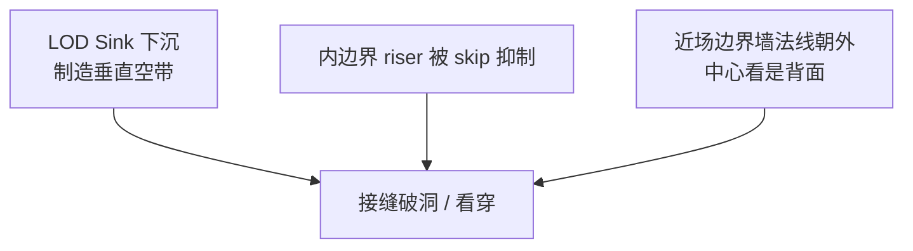

# 客户端流式与远景渲染当前事实

> 当前唯一事实文档。Voxia 是当前 UE 产品化主线；`clients/web_client` 仍是仓库默认端到端验证/parity 主线；`clients/bevy_client` 是参考实现。

## 客户端地位

| 客户端 | 当前定位 |
| --- | --- |
| `clients/web_client` | 仓库级当前主线端到端验证端，默认 parity / npm test 入口 |
| `clients/Voxia` | UE5.8 native / 产品化客户端，当前近远景渲染、streaming window、debug overlay、stdio CLI 的实跑主线 |
| `clients/bevy_client` | Rust/Bevy 参考实现，不作为默认 parity 或主线验收目标 |

该三分法解决了“Voxia flagship”和“web_client 主线验收”之间的表面冲突：两者处在不同维度。

## Voxia 近场

- 近场是服务端权威 3D chunk 流式。
- `SubscribeRadius = 3` chunks，当前 debug/interactive near window 是 `7×7×7 = 343` chunks。
- 注意：这里的 `343 chunks` 正好是生产预算口径里的 `1 tile`。后续生产近场预算里的 `27 tiles` 指 `3×3×3` 个这样的 tile，不能把数字 27 当作 chunk 数。
- 近场带 collision、raycast、hit box、edit target。
- 移动后 streaming center 用 post-movement player position。
- `GetStreamingWorldPosition()` 是 streaming、debug 和 editability 的统一位置源。

## Voxia 远景 LOD

当前形态：

- 协议：`0x6A` heightmap request，`0x6B` heightmap region response。
- 服务端 `0x6A` 已从 `WorldGen.heightmap_region` 切到 `SceneServer.Voxel.AuthoritativeHeightmap`，默认读取 `DataService.Voxel.LodHeightmapStore` 持久化 projection；缺 projection cell 显式失败，不再运行时重跑噪声兜底。
- `SceneServer.Voxel.LodProjection` 会从权威 chunk storage/snapshot 派生 stride cells；projection row 当前包含 height 与 top material；`ChunkSnapshotStore.put_snapshot` 支持在同一 DB transaction 内写 chunk snapshot 与 projection rows。
- `0x6B` 固定头与 `heights:u16[]` 之后可追加 typed sections；section `0x01` 是 `materials:u16[]`，与 height 同顺序。Voxia decoder 会跳过未知 section，并把 material 样本暴露到 `lod` / `HeightmapSnapshot()`。
- `SceneServer.Voxel.LodProjection.Rebuilder` 可显式从 canonical snapshots backfill projection；它是 materialization 工具，不是 runtime heightmap fallback。
- 当前配置已改为对齐 tier 级联：`{2,256},{4,256},{8,256},{16,1000}`。
- Voxia transport 在权威 `ChunkDelta` 应用成功或 `VoxelIntentResult` authoritative cell point-correction 改变本地 confirmed store 时递增 `lod_dirty_revision`；pawn 用 `VoxiaLodDirtyRefreshSeconds` 去抖后按当前 streaming 位置重发所有 0x6A tier 请求。
- 订阅填充用的 `ChunkSnapshot` 不标记 LOD dirty，避免 343 chunk 初始填充造成远景请求风暴。
- 远景仅视觉，无碰撞，不可编辑。
- Heightmap mesh 在离屏线程生成后上传。

当前缺口：

- projection 表、编辑写入事务路径、显式 rebuild 工具、top material 派生、0x6B material section、Voxia decode/debug 和 heightmap vertex-color material 消费已落地；开发/demo `DefaultRegionBootstrapper` 可通过 `DevSeed` 写 starter chunk snapshots 并触发 projection rebuild；正式 WorldGen world-pack 生成入口已由 `WorldPackBootstrapper` 接入，可按显式 chunk bounds 写 canonical snapshots 并发布 ready manifest。但 launcher 包管理、完整 dirty 调度和跨 chunk/大 stride rebuild 策略尚未落地。
- 正式 world pack 入场前 materialization 已有服务端生成入口；缺范围或未材化列仍会返回可诊断错误，而不是生成远景。
- inner-boundary skirt 已在 `FVoxiaHeightmapMesher` 实现并补 AutomationTest 断言，但尚未跑 UE Automation / 实机截图验证。

## 拼接缝隙当前结论

当前修复状态：

- 已增加 inner-boundary skirt pass。
- 顶部锚定未下沉的真实高度，向下封 `Sink + 余量`。
- 法线朝中心，X/Y 两轴按 rendered-cell 与 skipped-cell 邻接触发。
- AutomationTest 已增加“洞边界有朝内竖直 quad / 顶部未下沉 / 底部低于 sunk plateau”断言；仍待 UE 测试执行。

## Debug / CLI

- `-VoxiaDebugCanvasHUD`：轻量 HUD + 3D stream-state wireframe。
- `-VoxiaStreamDebug`：仅 wireframe。
- `-VoxiaStdioCli`：启用 stdio debug subsystem。
- `clients/Voxia/scripts/voxia_stdio_cli.js`：启动 headless / real client 并发送命令。
  - `lod`：读取客户端已消费的 server-authoritative heightmap tiers，返回 `revision`、`tier_count`、各 tier 的 `stride/origin/count/cell_count/min_height/max_height/height_sample/material_count/material_sample`。
    - `lod` 同时返回 `voxel_revision` 和 `lod_dirty_revision`；observe 事件 `voxel_lod_dirty` / `voxel_lod_refresh_requested` 用于验证权威编辑是否触发 LOD 重拉。
  - `request_lod`：按当前玩家/streaming 位置立即重发所有 heightmap tier 请求；用于服务端 `lod_rebuild` 后强制客户端重拉。
  - `until_lod [timeout_ms] [min_tiers]`：脚本等待指定数量的 LOD tiers 到达，用于无截图验证 0x6B 消费。
- `scripts/voxia_server_stdio_cli.exs`：连接 live BEAM node，从 Gate / World / Scene / DataService 同查 chunk 状态。
  - `lod_status <scene_id> [stride]`：读取 `LodHeightmapStore.summary/2`，确认 projection 已材化的 stride、cell 覆盖和高度范围。
  - `lod_sample <scene_id> <origin_x> <origin_z> <stride> <count_x> <count_z>`：走运行时 `AuthoritativeHeightmap.heightmap_region/7` 默认路径抽样，返回 meta 与 u16 高度样本。
  - `lod_rebuild <scene_id> [stride_csv] [batch_size]`：显式调用 `LodProjection.Rebuilder.rebuild_scene/2` backfill projection；这是 materialization / repair 工具，不是 runtime fallback。

## 被取代的旧结论

| 旧结论 | 当前事实 |
| --- | --- |
| Voxia/Web/Bevy 必须只选一个“主线” | Web 是仓库默认验收主线，Voxia 是 native 产品化主线，Bevy 是参考 |
| 客户端 seed 自生成 8km 基线是长期方向 | 被权威 store + LOD mip 方向取代 |
| 远景 heightmap 重跑噪声是正确最终形态 | 已被判定为缺陷 |
| 面片墙主要由 greedy 合并造成 | 当前结论是 LOD skip/skirt/背剔/streaming 边界 |

## 证据源

- [`AGENTS.md`](../../../../AGENTS.md)
- [`clients/web_client/README.md`](../../../../clients/web_client/README.md)
- [`clients/bevy_client/README.md`](../../../../clients/bevy_client/README.md)
- [`clients/Voxia/README.md`](../../../../clients/Voxia/README.md)
- [`clients/Voxia/Source/Voxia/Gameplay/README.md`](../../../../clients/Voxia/Source/Voxia/Gameplay/README.md)
- [`clients/Voxia/Source/Voxia/Debug/README.md`](../../../../clients/Voxia/Source/Voxia/Debug/README.md)
- [`clients/Voxia/docs/2026-06-28-streaming-window-follow-fix.md`](../../../../clients/Voxia/docs/2026-06-28-streaming-window-follow-fix.md)
- [`clients/Voxia/docs/2026-06-28-远景LOD-heightmap-设计与拼接缝隙根因.md`](../../../../clients/Voxia/docs/2026-06-28-远景LOD-heightmap-设计与拼接缝隙根因.md)
- [`docs/2026-06-28-体素世界与远景渲染-当前真相(整合).md`](../../../2026-06-28-体素世界与远景渲染-当前真相(整合).md)
