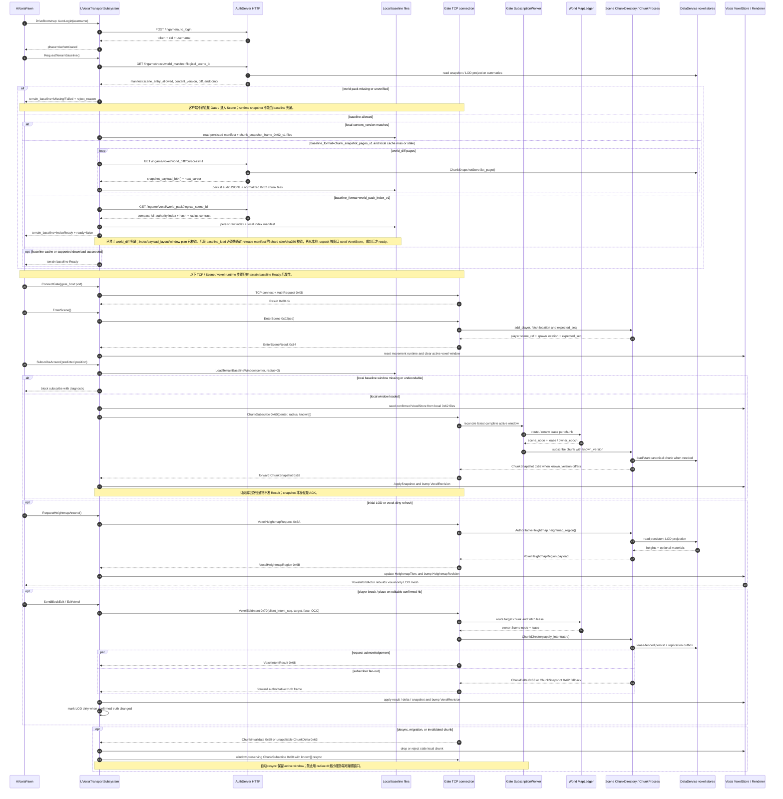
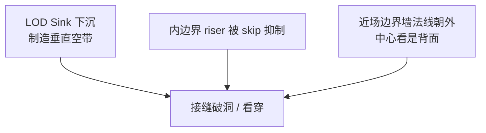

# 客户端流式与远景渲染当前事实

> 当前唯一事实文档。Voxia 是当前客户端主线和 streaming / baseline / LOD 实跑验收对象；`clients/web_client` 保留为历史 web 端与必要回归参考；`clients/bevy_client` 是参考实现。

## 客户端地位

| 客户端 | 当前定位 |
| --- | --- |
| `clients/Voxia` | UE5.8 native / 当前客户端主线，近远景渲染、baseline、streaming window、debug overlay、stdio CLI 的实跑验收对象 |
| `clients/web_client` | 历史 web 端与必要回归参考，不作为本轮 streaming / baseline 主线 |
| `clients/bevy_client` | Rust/Bevy 参考实现，不作为默认 parity 或主线验收目标 |

该三分法的当前解释是：Voxia 负责客户端主线验收；web_client 只在明确要求 web parity 或旧回归时使用。

## Voxia 启动到体素交互时序

当前实现以 `AVoxiaPawn::DriveBootstrap` 和 `UVoxiaTransportSubsystem` 为客户端主轴：先完成 HTTP dev login 与本地 baseline/world-pack gate，再连接 Gate TCP、进入 Scene，最后才打开 active/editable voxel window 并消费服务端权威体素流。

关键约束：

- 本地 baseline 未 Ready 时，Voxia 不能进入正常 Gate/Scene streaming；`ChunkSnapshot` 只能是已验证基线之上的运行时权威同步，不能修补缺失 world pack。
- Voxia 已支持 `world_pack_index_v1` compact index 下载与落盘，并在 `TerrainBaselineSnapshot()` 暴露 `baseline_format` / `baseline_endpoint` / `entry_gate_ready` / `pack_index_*` / `pack_payload_*` 字段；该状态先为 `index_ready` 且 `ready=false`，不会继续请求 `world_diff` 伪装下载完整 baseline。2026-07-01 起，`LoadTerrainBaselineWindow` 还要求本地 `scene_<id>_world_pack_release_manifest.json`，对窗口涉及的每个 `.vxpack` shard 执行 manifest `size_bytes` / `sha256` 校验后，才读取 footer-table 0x62 payload 并应用到 confirmed `VoxelStore`；缺 manifest、缺 shard entry、size/hash 不匹配或 payload 解码/scene/chunk mismatch 都会阻止进入正常 Gate/Scene streaming。同日补齐客户端入场硬 gate：`ConnectGate` / `EnterScene` 在 `entry_gate_ready=false` 时直接拒绝并写 `tcp_connect_rejected` / `enter_scene_rejected`，不会进入 socket bootstrap；验证为 `Build.bat VoxiaEditor Win64 Development ... -NoLiveCoding` 退出 0、`Automation RunTests Voxia.Net.TerrainBaselineGate` 日志 `Test Completed. Result={Success}` 且 observe 只有 `tcp_connect_rejected`。
- 2026-06-30 新增 `-VoxiaWorldGenPreview` / `-VoxiaWorldGenLocalBaseline` dev-only 例外：Voxia 可跳过 HTTP world-pack manifest，按当前 L∞ window 本地生成 `FVoxiaWorldGenV1` chunk snapshot，并在窗口外裁剪 full voxel chunk、改由本地 WorldGen heightmap/LOD 显示。该模式只用于“运行后可见自动生成世界”的本地预览，不作为 H gate、decoder parity、编辑或服务端权威验收。
- 进入 Scene 后，`ChunkSubscribe 0x60` 表示完整 active/editable window；自动重订和 resync 必须保留该窗口语义。
- 客户端不乐观写 confirmed voxel truth；当前 Voxia 几何 confirmed store 只应用 `ChunkSnapshot 0x62`、`ChunkDelta 0x63`、`VoxelIntentResult 0x68` 的 authoritative cells 和 `ChunkInvalidate 0x69`，field store 应用 `0x73/0x74`，`ObjectStateDelta 0x6C` 目前是诊断消费。
- LOD 远景只读服务端派生 projection：`0x6A` 请求缺 projection cell 时应显式失败，客户端不运行本地噪声兜底。

## Voxia 近场

- 近场是服务端权威 3D chunk 流式。
- `SubscribeRadius = 3` chunks，当前 debug/interactive near window 是 `7×7×7 = 343` chunks。
- `-VoxiaWorldGenPreview` 下，近场窗口由客户端本地 WorldGen 生成完整 16^3 chunk snapshot；`ChunkSubscribe` 只记录 active window，不向 server 请求 chunk snapshot，以免本地预览被空 server chunk 覆盖。默认/生产路径不走此分支。
- 注意：这里的 `343 chunks` 正好是生产预算口径里的 `1 tile`。后续生产近场预算里的 `27 tiles` 指 `3×3×3` 个这样的 tile，不能把数字 27 当作 chunk 数。
- 2026-06-30 起，Voxia 客户端把近场窗口契约抽为 `FVoxiaNearVoxelWindow` 纯模块：它负责 `center_tile` / `center_chunk` / `radius_tiles` / `chunk_count` 与跨 tile `entered/exited/retained` diff。`UVoxiaTransportSubsystem` 仍负责 baseline、confirmed store 和网络，但 VHI/SVO 只能读取 `near_window` contract 来排除近场区域，不能反向拥有近场语义。
- 近场带 collision、raycast、hit box、edit target。
- 移动后 streaming center 用 post-movement player position。
- `GetStreamingWorldPosition()` 是 streaming、debug 和 editability 的统一位置源。

## Voxia 远景 LOD

当前形态：

- 协议：`0x6A` heightmap request，`0x6B` heightmap region response。
- 服务端 `0x6A` 已从 `WorldGen.heightmap_region` 切到 `SceneServer.Voxel.AuthoritativeHeightmap`，默认读取 `DataService.Voxel.LodHeightmapStore` 持久化 projection；缺 projection cell 显式失败，不再运行时重跑噪声兜底。
- `-VoxiaWorldGenPreview` 下，`RequestHeightmap` 本地生成 heightmap tier 并触发现有 `FVoxiaHeightmapMesher`；这是显式预览分支，不改变默认“远景只读服务端 projection”的约束。
- 2026-06-30 新增独立实验入口 `/Game/Voxia/Maps/L_WorldGenVhiPreview` + `-VoxiaVhiPreview`：旧 `L_WorldGenPreview` 与 2.5D heightmap LOD 仍保留；VHI 只在新关卡/新 flag 下把窗口外 XZ tile 生成为连续 visual-only impostor mesh。默认 `-VoxiaVhiTileRadius=72` / `-VoxiaVhiSamples=4` / `-VoxiaVhiInnerSkipRadius=0` / `-VoxiaVhiSinkCm=100`，按 7 chunk/tile、16 m/chunk 折算覆盖约 ±8.064 km，并让 VHI 与近场 3x3x3 tile 窗口有一圈 underlap，VHI 顶面下沉 100cm 以降低近远边界 z-fighting / 裂缝可见性。VHI riser 只在相邻 built tile / 外缘之间补高度差；邻居是近场 skip tile 时不再生成竖面，避免 visual-only 面片墙落在玩家近场中间。VHI 的 `coverage_center_tile` 与玩家当前 `center_tile` 分离：玩家在阈值内跨 tile 时不重建整块约 8km 覆盖，只按 tile set 差异构建 dirty/upsert tile、移除 obsolete tile 并复用其余 tile artifact。
- `SceneServer.Voxel.LodProjection` 会从权威 chunk storage/snapshot 派生 stride cells；projection row 当前包含 height 与 top material；`ChunkSnapshotStore.put_snapshot` 支持在同一 DB transaction 内写 chunk snapshot 与 projection rows。
- `0x6B` 固定头与 `heights:u16[]` 之后可追加 typed sections；section `0x01` 是 `materials:u16[]`，与 height 同顺序。Voxia decoder 会跳过未知 section，并把 material 样本暴露到 `lod` / `HeightmapSnapshot()`。
- `SceneServer.Voxel.LodProjection.Rebuilder` 可显式从 canonical snapshots backfill projection；它是 materialization 工具，不是 runtime heightmap fallback。
- 当前配置已改为对齐 tier 级联：`{2,256},{4,256},{8,256},{16,1000}`。
- Voxia transport 在权威 `ChunkDelta` 应用成功或 `VoxelIntentResult` authoritative cell point-correction 改变本地 confirmed store 时递增 `lod_dirty_revision`；pawn 用 `VoxiaLodDirtyRefreshSeconds` 去抖后按当前 streaming 位置重发所有 0x6A tier 请求。
- 订阅填充用的 `ChunkSnapshot` 不标记 LOD dirty，避免 343 chunk 初始填充造成远景请求风暴。
- 远景仅视觉，无碰撞，不可编辑。
- Heightmap mesh 在离屏线程生成后上传。
- VHI mesh 在客户端 preview 中从同一 WorldGen 配置生成 2.5D top surface + 高差 riser；它可作为廉价地表 baseline，但结构上不表达列内多段、内部空腔、浮空岛或真正 3D 远景。3D 远景表达归 SVO，VHI 不参与碰撞、编辑、raycast、confirmed truth 或 H gate。
- 2026-06-30 已新增 SVO preview MVP：独立 `L_WorldGenSvoPreview` / `-VoxiaSvoPreview` 试验 Sparse Voxel Octree。当前第一版保持近场完整 `3x3x3 tile`，窗口外约 8km 远景 visual-only，暴露 `svo` / `until_svo` CLI、max_depth/node/leaf/empty_leaf/solid_leaf/mixed_leaf/top_quad/side_quad/boundary_side_quad/build_ms 统计和 seam check。SVO 构建已从同步整块调用改为 ThreadPool 后台构建，构建中收到的新请求只保留最新 pending，完成后才发布 `svo_revision`；`svo` snapshot 暴露 `build_in_flight` / `has_pending_build`。SVO 远景已从旧 top/riser proxy 升级为 3D occupancy octree leaf surface：每个 root macro-cell 递归分类为 empty / solid / mixed，mixed 节点按八叉树细分，终止叶子只在邻接 air 的 3D face 上导出 surface mesh。2026-07-01 起，SVO 渲染提交不再是单 section：`FVoxiaFarFieldPatchGrid` 会按默认 `VoxiaSvoPatchTiles=8` 把 mesh 拆成 19×19 patch，并由 `AVoxiaWorldActor` 按 `VoxiaSvoUploadBudgetMs` / `VoxiaSvoUploadMaxPatchesPerFrame` 分帧上传；同日补入 FarField 公共层：`FVoxiaFarFieldCoveragePlanner` 统一 VHI/SVO 的远景覆盖枚举，`FVoxiaFarFieldBuildPipeline` 收编 transport revision / serial / in-flight / pending coalesce/supersede 状态机，`FVoxiaFarFieldPatchUploader` 收编 VHI/SVO patch section 池、bulk-hide、pending queue、section fingerprint 复用和上传统计，`FVoxiaFarFieldMeshComponentDesc` 收敛远景 ProcMesh 属性。SVO builder 现在按 macro-cell 输出 artifact，并在相同 worldgen/几何配置下复用重叠 macro-cell；snapshot / observe 新增 `built_macro_cell_count`、`reused_macro_cell_count`、`removed_macro_cell_count`、`dirty_macro_cell_count`、`cache_hit_rate`。CPU SVDAG artifact 统计第一片也已接入 snapshot：`svdag_node_count`、`svdag_unique_node_count`、`svdag_merged_node_count`、`svdag_compression_ratio`。2026-07-01 后续补入 runtime SVDAG resource 数据面第一片：builder 会输出 CPU 侧 root table + 去重 node buffer，snapshot / observe 暴露 `runtime_resource_ready`、`runtime_root_count`、`runtime_node_count`、`runtime_child_ref_count`、`runtime_gpu_bytes`、`runtime_compression_ratio`，供后续 RHI buffer / shader path 消费。2026-07-01 后续补入 `-VoxiaSvoConfirmedSource` 第一片：transport 会复制当前 confirmed `FVoxiaVoxelStore` 快照给后台 SVO builder，snapshot / observe 统一暴露 `source_kind`、`source_complete`、`missing_source_chunk_count`、`build_error`；覆盖完整时可从 confirmed 3D voxel truth 生成 mesh，覆盖不完整时发布诊断状态但 `quad_count=0`，`AVoxiaWorldActor` 不上传该 mesh，且不会 fallback 到 WorldGen 或把 missing chunk 当空气。默认未加该 flag 时仍是 WorldGen SVO preview。VHI 的 dirty/reuse 判定仍留在 VHI tile artifact 逻辑中。它与 VHI 一样属于可重建远景派生物，不参与生产协议、碰撞或编辑；客户端 baseline pack 本地 release-manifest shard size/hash gate 已接入 `world_pack_index_v1` window load，且 `ConnectGate` / `EnterScene` 已接 entry gate 硬拒，SVO upload-level section 复用第一片也已接入。但 SVO 自身当前仍不是 GPU raymarch renderer / RHI buffer / global shader path，也尚未落地持久化 artifact、完整 launcher/update 包下载/安装 UI 或 8km 生产级权威源覆盖/物化。
- 2026-07-01 runtime SVDAG resource 数据面第二片补齐固定 stride payload：node payload 为 16 个 `uint32` / 64B，root payload 为 12 个 `uint32` / 48B；snapshot / observe 新增 `runtime_node_word_count`、`runtime_root_word_count`、`runtime_payload_bytes`，供后续 RHI buffer 创建直接消费。
- `-VoxiaStreamDebug` 在 tile-window 模式默认只画 3x3x3 tile 框与当前 chunk 框；需要逐 chunk 线框时显式加 `-VoxiaStreamDebugChunks`，避免 debug overlay 自身逐帧绘制 9261 个 chunk box。

当前缺口：

- projection 表、编辑写入事务路径、显式 rebuild 工具、top material 派生、0x6B material section、Voxia decode/debug 和 heightmap vertex-color material 消费已落地；开发/demo `DefaultRegionBootstrapper` 可通过 `DevSeed` 写 starter chunk snapshots 并触发 projection rebuild；正式 WorldGen world-pack 生成入口已由 `WorldPackBootstrapper` 接入，可按显式 chunk bounds 写 canonical snapshots 并发布 ready manifest。但 launcher 包管理、完整 dirty 调度和跨 chunk/大 stride rebuild 策略尚未落地。
- 正式 world pack 入场前 materialization 已有服务端生成入口；缺范围或未材化列仍会返回可诊断错误，而不是生成远景。
- inner-boundary skirt 已在 `FVoxiaHeightmapMesher` 实现并补 AutomationTest 断言，但尚未跑 UE Automation / 实机截图验证。
- VHI 仍是 Voxia 本地实验分支；生产路径尚未定义 VHI artifact 持久化格式、服务端 materialization、协议订阅面或 H gate 集成。当前本地 8km VHI smoke 为 21024 tiles / 336384 samples / 约 933k quads，VHI tile-to-tile 高度来自同一确定性 WorldGen，所以一般不会出现随机错位；但它仍是非焊接 visual proxy，近远边界通过 underlap + sink 掩盖，不等于生产级几何连续性证明。2026-06-30 后续优化把 VHI artifact 生成移到 ThreadPool，并合并构建中收到的后续 center tile 请求；若旧后台结果完成时已有更新 pending，则跳过旧结果，避免同一边界双上传。随后按 tile 粒度拆分 VHI artifact：builder 接收旧 tile set 作为 reuse context，输出 dirty tiles / removed tiles / built-reused-removed 计数；`VoxiaWorldActor` 保持 tile artifact 为逻辑缓存单元，但渲染提交合批为 patch section，默认 `VoxiaVhiPatchTiles=8`，上传队列按离当前 tile 的 XZ 距离优先，同距离再按相机朝向优先。`VoxiaVhiUploadMaxPatchesPerFrame` 可直接限制每帧 patch 数；旧 `VoxiaVhiUploadMaxTilesPerFrame` 会按 patch 面积折算，避免把旧 tile 预算误当 patch 预算。首轮批量上传超过 `VoxiaVhiBulkHideThresholdPatches=64` 时先隐藏 VHI component，避免可见 ProceduralMesh section 逐个创建导致长时间掉帧；上传完成后一次显示，实测首轮 361 sections 上传期间可见 FPS 维持约 100+，完成后稳定约 90 FPS。PatchUploader / MeshComponentDesc 接入后的 2026-07-01 CLI smoke 为 `build_elapsed_ms=889.7`、`uploaded_patches=361`、`live_sections=361`、`elapsed_ms=11355.1`。跨一个 tile 的 smoke 中 VHI 第二次构建为 built=4、reused=21020、removed=1、dirty=4、build_elapsed_ms=15.5；最终 VHI 渲染为 live_sections=361，而不是 21024 个 tile section。剩余风险是首轮远景会等批量上传结束后出现；若可见客户端仍有尖峰，下一步优先把近场 tile window 的 load/unload 也改为后台 slab 流送，并把 VHI patch section 进一步替换为更稳定的 runtime mesh / HISM / Nanite-ready artifact。
- SVO preview 已有本地实验入口、CLI 观测和分帧 patch 上传。2026-07-01 首轮 null RHI CLI smoke：`center_tile=[11,0,-51]`、`max_depth=1`、`macro_cell_count=21016`、`node_count=189144`、`leaf_count=168128`、`empty_leaf_count=74062`、`solid_leaf_count=1383`、`mixed_leaf_count=92683`、`top_quad_count=88419`、`side_quad_count=66980`、`boundary_side_quad_count=1`、`quad_count=155399`、`estimated_visible_range_m=8064.0`、`seam_check.status=pass`，随后上传日志为 `uploaded_patches=361` / `live_sections=361` / `total_quads=155399` / `elapsed_ms=537.6`。同日 real RHI smoke 的 SVO build 为 `build_ms=571.910`、分片上传 `elapsed_ms=1365.0`，上传完成后 FPS 样本约 104–115。PatchUploader / MeshComponentDesc 接入后的 null RHI smoke 仍为 `macro_cell_count=21016` / `quad_count=155399` / `seam_check.status=pass`，上传日志为 `uploaded_patches=361` / `live_sections=361` / `elapsed_ms=266.5`。macro-cell artifact/cache 接入后的移动 CLI smoke：首次 build `built_macro_cell_count=21016` / `reused_macro_cell_count=0` / `cache_hit_rate=0.000` / `build_ms=436.436`；移动到 `center_tile=[17,0,-51]` 后第二次 build `built_macro_cell_count=879` / `reused_macro_cell_count=20137` / `removed_macro_cell_count=879` / `dirty_macro_cell_count=879` / `cache_hit_rate=0.958` / `build_ms=87.482`，`seam_check.status=pass`。confirmed-store source 接入后的 CLI smoke：默认 WorldGen 8km 路径仍为 `source_kind=worldgen` / `source_complete=true` / `macro_cell_count=21016` / `quad_count=155399` / `seam_check.status=pass`；`-VoxiaSvoConfirmedSource -VoxiaSvoTileRadius=0 -VoxiaSvoNearSkipRadius=-1` 在完整 1-tile coverage 下为 `source_kind=confirmed_voxel_store` / `source_complete=true` / `missing_source_chunk_count=0` / `macro_cell_count=1` / `quad_count=28` / `seam_check.status=pass`；同 flag 下只加载 1 tile 却请求 radius=1 时硬失败为 `source_complete=false` / `missing_source_chunk_count=2744` / `quad_count=0` / `build_error="missing confirmed voxel chunk coverage for SVO source: 2744 chunks"`。2026-07-01 后续补入 confirmed-source coverage preflight 和 WorldGen-preview 小范围预加载：radius=1 / `-VoxiaSvoConfirmedSourceMaxChunks=3000` smoke 为 `expected_source_chunk_count=3087` / `present_source_chunk_count=3087` / `missing_source_chunk_count=0` / `quad_count=174` / `seam_check.status=pass`；8km confirmed-source 同预算 smoke 在 build 前拒绝为 `expected_source_chunk_count=7208488` / `missing_source_chunk_count=7208488` / `quad_count=0` / `build_error="SVO confirmed source requires 7208488 missing chunks, above preload budget 3000"`。baseline pack 本地 H gate 第一片已接入 `world_pack_index_v1`：窗口 load 前校验本地 release manifest 的 shard `size_bytes` / `sha256`，hash mismatch automation 绿；客户端 entry gate 已接入 `ConnectGate` / `EnterScene`，未 `ready` 会在 socket 前硬拒。upload-level section 复用第一片已接入：跨 1 tile 的 8km SVO smoke 首次为 `uploaded_patches=361` / `reused_patches=0`，第二次为 `uploaded_patches=39` / `reused_patches=322` / `live_sections=361`，SVO snapshot 同时为 `built_macro_cell_count=148` / `reused_macro_cell_count=20868` / `cache_hit_rate=0.993` / `seam_check.status=pass`。CPU SVDAG artifact 统计第一片已接入：8km smoke 首次为 `svdag_node_count=189144` / `svdag_unique_node_count=70085` / `svdag_merged_node_count=119059` / `svdag_compression_ratio=0.371`，跨 1 tile 后为 `70045` unique / `0.370` ratio。runtime SVDAG resource 数据面第一片已接入：本次 8km smoke 为 `runtime_resource_ready=true` / `runtime_root_count=21016` / `runtime_node_count=3627` / `runtime_child_ref_count=24416` / `runtime_gpu_bytes=1240896` / `runtime_compression_ratio=0.019`。剩余风险：SVO confirmed source 目前只是客户端已有 confirmed store 的覆盖门槛、构建入口和 dev-only 小范围 preload 预算门禁，`cache_hit_rate` 只是 builder artifact 复用指标；完整 launcher/update 包下载/安装 UI、8km 生产级权威源覆盖/物化、持久化 artifact、GPU raymarch renderer / RHI buffer / global shader path 或 runtime mesh / HISM / Nanite-ready artifact 仍未落地。
- runtime payload 8km smoke 为 `runtime_node_word_count=58032` / `runtime_root_word_count=252192` / `runtime_payload_bytes=1240896`；payload byte size 与 `runtime_gpu_bytes` 一致，说明后续 RHI upload 可直接按固定 stride 建 buffer。
- 近场 3x3x3 tile 窗口数据量正确；`FVoxiaNearVoxelWindow` 已成为当前近场窗口契约，transport 的 `active_tile_window` 兼容字段、VHI/SVO 远景排除区、pawn debug snapshot / raycast editable 判定 / stream debug overlay 均优先读取同一个 near-window snapshot，旧 `LastSubscribedTile` 只作为无 near-window 时的 fallback。`VoxiaWorldActor` 已从窗口变化后的同步整窗 mesh 改为按帧预算的增量 near mesh build，默认 `VoxiaNearMeshBuildBudgetMs=4` / `VoxiaNearMeshBuildMaxChunks=512`，并跳过空 chunk 与六面整实心邻居完全遮挡的整实心 chunk。2026-06-30 VHI smoke 中跨 tile 后同步 tile window 装载约 0.31s，near mesh 后台完成约 3.39s，输出 32566 quads，跳过 4418 empty chunks / 2858 occluded full chunks。最终形态仍应演进到按 dirty chunk/tile cache 的增量上传，避免每次 revision 都重组整窗 mesh buffer。

## 拼接缝隙当前结论

当前修复状态：

- 已增加 inner-boundary skirt pass。
- 顶部锚定未下沉的真实高度，向下封 `Sink + 余量`。
- 法线朝中心，X/Y 两轴按 rendered-cell 与 skipped-cell 邻接触发。
- AutomationTest 已增加“洞边界有朝内竖直 quad / 顶部未下沉 / 底部低于 sunk plateau”断言；2026-07-01 `Voxia.Voxel` 自动化已通过，仍待真实画面边界巡检。

## Debug / CLI

- `-VoxiaDebugCanvasHUD`：轻量 HUD + 3D stream-state wireframe。
- `-VoxiaStreamDebug`：仅 wireframe；tile-window 模式默认画 27 个 tile box，`-VoxiaStreamDebugChunks` 才画 9261 个 chunk box。
- `-VoxiaStdioCli`：启用 stdio debug subsystem。
- `clients/Voxia/scripts/voxia_stdio_cli.js`：启动 headless / real client 并发送命令。
  - `lod`：读取客户端已消费的 server-authoritative heightmap tiers，返回 `revision`、`tier_count`、各 tier 的 `stride/origin/count/cell_count/min_height/max_height/height_sample/material_count/material_sample`。
    - `lod` 同时返回 `voxel_revision` 和 `lod_dirty_revision`；observe 事件 `voxel_lod_dirty` / `voxel_lod_refresh_requested` 用于验证权威编辑是否触发 LOD 重拉。
  - `request_lod`：按当前玩家/streaming 位置立即重发所有 heightmap tier 请求；用于服务端 `lod_rebuild` 后强制客户端重拉。
  - `until_lod [timeout_ms] [min_tiers]`：脚本等待指定数量的 LOD tiers 到达，用于无截图验证 0x6B 消费。
  - `vhi`：仅在 `-VoxiaWorldGenPreview -VoxiaVhiPreview` 下返回 VHI impostor 状态，含 `enabled`、`revision`、`tile_count`、`face_sample_count`、`quad_count`、中心 tile、coverage center tile、半径、inner skip radius，以及 built/reused/removed/dirty tile 计数。
  - `until_vhi [timeout_ms] [min_tiles]`：脚本等待 VHI artifact 生成，用于无截图验证新关卡的窗口外三维远景代理。
  - `svo`：在 `-VoxiaSvoPreview` 下返回 SVO 状态；默认配合 `-VoxiaWorldGenPreview` 使用 WorldGen source，加 `-VoxiaSvoConfirmedSource` 时改从 confirmed `FVoxiaVoxelStore` 快照构建。返回 `enabled`、`revision`、`build_in_flight`、`has_pending_build`、`source_kind`、`source_complete`、`missing_source_chunk_count`、`build_error`、`radius_tiles`、`samples_per_tile_axis`、`max_depth`、node/leaf/empty/solid/mixed 计数、SVDAG 统计、runtime resource root/node/GPU-byte/word-payload 估算、quad 计数、`build_ms` 和 seam check。
  - `until_svo [timeout_ms] [min_macro_cells]`：脚本等待 SVO artifact 生成，用于无截图验证新关卡的 8km occupancy octree 远景代理。
- `scripts/voxia_server_stdio_cli.exs`：连接 live BEAM node，从 Gate / World / Scene / DataService 同查 chunk 状态。
  - `lod_status <scene_id> [stride]`：读取 `LodHeightmapStore.summary/2`，确认 projection 已材化的 stride、cell 覆盖和高度范围。
  - `lod_sample <scene_id> <origin_x> <origin_z> <stride> <count_x> <count_z>`：走运行时 `AuthoritativeHeightmap.heightmap_region/7` 默认路径抽样，返回 meta 与 u16 高度样本。
  - `lod_rebuild <scene_id> [stride_csv] [batch_size]`：显式调用 `LodProjection.Rebuilder.rebuild_scene/2` backfill projection；这是 materialization / repair 工具，不是 runtime fallback。

## 被取代的旧结论

| 旧结论 | 当前事实 |
| --- | --- |
| Voxia/Web/Bevy 必须只选一个“主线” | Web 是仓库默认验收主线，Voxia 是 native 产品化主线，Bevy 是参考 |
| 客户端 seed 自生成 8km 基线是长期方向 | 被权威 store + LOD mip 方向取代 |
| 远景 heightmap 重跑噪声是正确最终形态 | 已被判定为缺陷 |
| 面片墙主要由 greedy 合并造成 | 当前结论是 LOD skip/skirt/背剔/streaming 边界 |

## 证据源

- [`AGENTS.md`](../../../../AGENTS.md)
- [`clients/web_client/README.md`](../../../../clients/web_client/README.md)
- [`clients/bevy_client/README.md`](../../../../clients/bevy_client/README.md)
- [`clients/Voxia/README.md`](../../../../clients/Voxia/README.md)
- [`clients/Voxia/Source/Voxia/Net/README.md`](../../../../clients/Voxia/Source/Voxia/Net/README.md)
- [`clients/Voxia/Source/Voxia/Gameplay/README.md`](../../../../clients/Voxia/Source/Voxia/Gameplay/README.md)
- [`clients/Voxia/Source/Voxia/Debug/README.md`](../../../../clients/Voxia/Source/Voxia/Debug/README.md)
- [`apps/gate_server/lib/gate_server/worker/README.md`](../../../../apps/gate_server/lib/gate_server/worker/README.md)
- [`apps/scene_server/lib/scene_server/voxel/README.md`](../../../../apps/scene_server/lib/scene_server/voxel/README.md)
- [`clients/Voxia/docs/2026-06-28-streaming-window-follow-fix.md`](../../../../clients/Voxia/docs/2026-06-28-streaming-window-follow-fix.md)
- [`clients/Voxia/docs/2026-06-28-远景LOD-heightmap-设计与拼接缝隙根因.md`](../../../../clients/Voxia/docs/2026-06-28-远景LOD-heightmap-设计与拼接缝隙根因.md)
- [`docs/2026-06-28-体素世界与远景渲染-当前真相(整合).md`](../../../2026-06-28-体素世界与远景渲染-当前真相(整合).md)
- [`docs/voxel-server-authority/2026-06-30-voxia-vhi-experiment-plan.md`](../../../voxel-server-authority/2026-06-30-voxia-vhi-experiment-plan.md)
