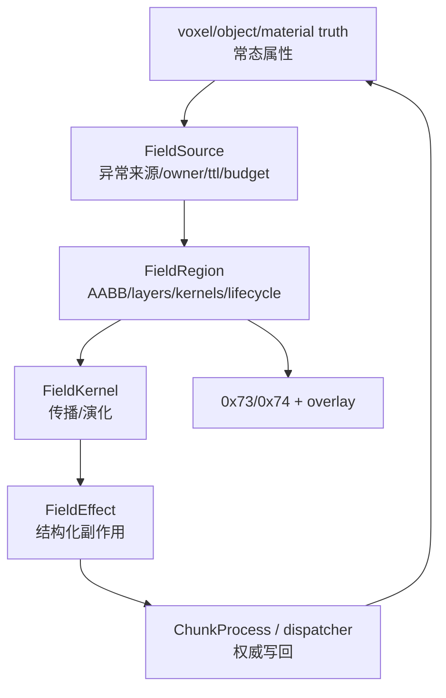

# 局部场与涌现系统当前事实

> 当前唯一事实文档。覆盖 Phase 7+ local field runtime、涌现系统、材料/光/结构/化学/表面元件的当前状态。

## 体素权威基线

- Phase 1-6 已收口：refined truth、typed edit intent、canonical persistence、prefab v2 transaction、fence/resume、object provenance、ObjectStateDelta、属性目录、温湿度基础、FieldLayer / FieldRegion / FieldDebugOverlay。
- 在线客户端 confirmed truth 只能来自服务端 `ChunkSnapshot`、`ChunkDelta`、`VoxelIntentResult`、`ObjectStateDelta`、`FieldRegionSnapshot`。

## Field Runtime 当前模型

- `FieldRegion` 管生命周期、AABB、layers、kernels、source 关系。
- `FieldLayer` 管单一 field type 的稀疏值。
- `FieldKernel` 管传播算法，只演化 field 并产出 effects。
- `FieldRuntime` 是异常场入口，负责创建/复用/销毁 field region。
- `FieldTickWorker` 负责 per-region tick、snapshot push、destroy 通知。
- `0x73` / `0x74` 是 field snapshot / destroy 下发路径。

## Kernel 边界

Field kernel 不直接改世界：

- 可以读 storage / material / object projection。
- 可以更新 `FieldLayer`。
- 可以产出结构化 `FieldEffect`。
- 不得绕过 ChunkProcess、事务、版本、fence 直接写 voxel/object/combat truth。
- `write_voxel_attribute(:temperature)` 等写回必须经 chunk authority 应用。

## 已落地能力

| 能力 | 当前事实 |
| --- | --- |
| 温度 | signed delta field，set-temperature/cool 入口，回到环境阈值可销毁 region |
| 材料物性 | thermal / electric / ignition / melting / freezing / boiling 等属性可由 catalog/effective attribute 读取 |
| 电导 | `ConductionPathKernel`、`FieldRuntime.ensure_conduction_path/1`、HTTP/Web CLI 入口 |
| 电源 | `material_id=6` 的 power block 是默认物理电源，普通 iron 只做导线 |
| 电热 | conduction path 可估算 Joule heat，写回 voxel temperature truth |
| 热烟 | GUI field overlay 可基于 power draw 产生 smoke visual；不是 voxel truth |
| 闭合电路 | `CircuitComponentAnalysis` 闭合 source-load 谓词作为 current overlay 准入 |
| 相邻双 chunk | 已支持直接相邻、边界接触的双 shard conduction 最小切片 |
| 介质击穿 | `ElectricDischargeKernel` / `conduction_mode: :discharge` 已形成瞬时 ionized channel |
| 光 | 已从客户端白炽派生升级为服务端权威光场，含 light layer / light_color / LightPropagationKernel 等 |
| 化学/氧化 | 燃烧和铁氧化收敛为 `ChemicalReaction` recipe；iron → rust 自然退出导电 |
| 结构 | structural support/stress/collapse effect 已形成烧梁/放电毁梁 → 坍塌链路 |
| SurfaceElement | 服务端数据与 wire 已通，含 catalog、Storage 面槽、ChunkProcess 权威 ops、snapshot TLV |

## 尚未完成

- generic persistent source owner 存活探测、持续预算扣减、自动续租。
- 完整跨 chunk field orchestration：当前只支持有限相邻 shard，不做全地图搜索。
- batched `FieldEffect` dispatcher：当前仍容易逐 effect 写回、逐次 fan-out，需要 chunk 内 batch mutation。
- Phase 8 gameplay effects：ignite/freeze/melt/object damage/combat/source effects 仍待统一边界。
- 完整电路仿真、tick-by-tick 能量扣减、材料熔断破坏。
- SurfaceElement 的物理参与、客户端完整渲染/解码、delta 专用 op。
- Prefab/object 统一 participant projection 尚未覆盖所有局部场。

## 正交涌现原则

- 常态在 voxel/object/material truth，异常才进 field。
- 系统激活由材料属性向量派生，不用 per-device 规则或 material_id 白名单。
- 系统之间只通过 committed truth 耦合。
- 客户端外观是服务端 material/tag/field 的纯函数，不本地模拟燃烧、导电、热扩散。
- `state_flags` 当前真实用途偏向 diode/transistor 投影，不应复活为 burning/frozen/wet 等通用外观位。

## 被取代的旧结论

| 旧结论 | 当前事实 |
| --- | --- |
| Phase 7 只是温度按钮 demo | 已形成温度、电导、电热、热烟、闭合电路、击穿等可操作 runtime 起点 |
| 光只是客户端白炽派生 | 当前已有服务端权威光场 as-built |
| `state_flags` 承载 burning/frozen/wet/charred 外观 | 已被 material/tag/field 纯函数渲染方向取代 |
| iron 锈蚀需要专门“锈了断电”规则 | iron → rust 通过 truth/material 属性自然退出导电 |

## 证据源

- [`docs/voxel-server-authority/README.md`](../../../voxel-server-authority/README.md)
- [`docs/plans/2026-05-16-phase7-local-field-runtime-roadmap.md`](../../../plans/2026-05-16-phase7-local-field-runtime-roadmap.md)
- [`docs/plans/2026-05-14-phase7-field-kernel-architecture.md`](../../../plans/2026-05-14-phase7-field-kernel-architecture.md)
- [`docs/plans/2026-05-19-prefab-field-participant-projection.md`](../../../plans/2026-05-19-prefab-field-participant-projection.md)
- [`docs/voxel-server-authority/2026-06-16-orthogonal-systems-architecture.md`](../../../voxel-server-authority/2026-06-16-orthogonal-systems-architecture.md)
- [`docs/voxel-server-authority/2026-06-17-S4-chemistry-oxidation-system.md`](../../../voxel-server-authority/2026-06-17-S4-chemistry-oxidation-system.md)
- [`docs/2026-06-23-light-as-orthogonal-system.md`](../../../2026-06-23-light-as-orthogonal-system.md)
- [`docs/2026-06-23-mechanical-stress-structural-collapse.md`](../../../2026-06-23-mechanical-stress-structural-collapse.md)
- [`docs/voxel-server-authority/2026-06-17-unit-morphology-and-surface-element-layer.md`](../../../voxel-server-authority/2026-06-17-unit-morphology-and-surface-element-layer.md)
- [`clients/Voxia/docs/2026-06-27-voxia-emergence-render-design.md`](../../../../clients/Voxia/docs/2026-06-27-voxia-emergence-render-design.md)
