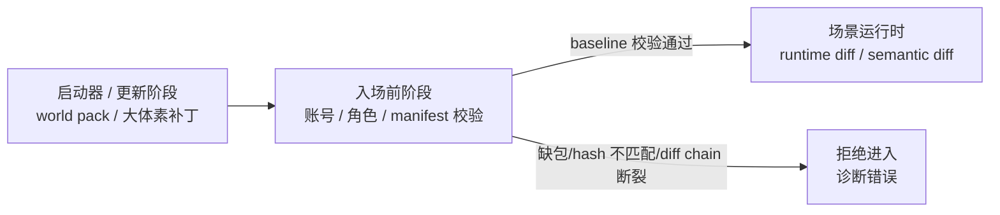

# 体素真值、基线与运行时 Diff 当前事实

> 当前唯一事实文档。它覆盖“世界是什么”的事实源、客户端基线校验、启动器/入场/运行时三阶段边界。

## 当前最高层原则

**权威体素数据是服务器生命周期里的唯一事实源。**

- WorldGen 噪声只应作为一次性 world-seed migration，开发期用于灌入权威 store。
- 真实地图导入未来应作为同层 migration，灌入同一个权威 store。
- chunk 服务、远景 LOD、raycast、碰撞、远程交互都应只读或派生自权威体素。
- 派生物必须显式维护一致性，例如编辑后 dirty LOD mip，而不是依赖“源不会变”的隐式假设。

## 三阶段边界

当前设计要求：

- 大体素包、广域重写、全量 tile 更新不进入 scene runtime 热路径。
- 本地 `world pack / region manifest / chunk baseline / diff chain` 必须在进入场景前校验。
- 校验失败视为客户端数据不可被信任，必须拒绝进入场景。
- 禁止用运行时 `ChunkSnapshot`、resync、自愈逻辑或静默兜底绕过基线校验。
- 进入场景后只流送已验证基线之上的 runtime diff、语义 diff、prefab/object/event diff。

## Tile 预算口径

生产流式预算已经冻结如下：

| 单位 | 定义 |
| --- | --- |
| chunk | `16×16×16` macro cell，边长 `16m`，共 `4096` cells |
| tile | `7×7×7` chunks，边长 `112m`，共 `1,404,928` cells |
| 近场窗口 | `27 tiles = 3×3×3 tiles = 9,261 chunks = 37,933,056 cells` |
| 跨 tile 边界新增 | 若旧窗口保留，只新增一片 `3×3 = 9 tiles` |
| 穿过一个 tile 时间 | 按 `6m/s`，约 `18.67s` |

本轮拍板：先按这个口径继续设计和排查当前 streaming / editability 问题，不再把“同步数据量可能很大”作为当前缺陷的默认解释。
数据量大的问题后期实际碰到吞吐瓶颈再量化；当前只作为后续风险记录，不能提前当作当前可操作区域不刷新或编辑无效的主因。遇到实际瓶颈时，必须用 observe/CLI 统计 `tiles_changed`、`chunks_changed`、`ops`、`bytes`、`encode_ms`、`send_queue_bytes` 后再针对性设计。

该口径的独立决策记录见
[`docs/plans/2026-06-28-voxel-tile-budget-runtime-diff-decision.md`](../../../plans/2026-06-28-voxel-tile-budget-runtime-diff-decision.md)。

## 当前实现与目标的差异

| 主题 | 当前实现/状态 | 目标事实 |
| --- | --- | --- |
| 近场 chunk truth | Scene / ChunkProcess 持热 truth，server snapshot/delta authoritative | 保持 |
| 远景 LOD 数据源 | `0x6A` 默认读取 `LodHeightmapStore` 持久化 projection；chunk snapshot 写入同事务 upsert projection；已有显式 `LodProjection.Rebuilder`；开发/demo bootstrapper 可触发 projection rebuild；`WorldPackBootstrapper` 可按显式 chunk bounds 生成真实 WorldGen pack；缺 cell 显式失败 | 补齐 launcher 包管理、material/top surface 和完整 dirty/rebuild 调度 |
| WorldGen 噪声 | 默认关闭，仅保留显式 dev opt-in / migration helper | 降级为 migration，生产不进 runtime |
| chunk runtime materialization | `ChunkProcess` 生产默认只接受持久化 snapshot / provided storage；缺失、损坏或 store 不可用会启动失败并 emit `voxel_chunk_materialization_failed`；`DefaultRegionBootstrapper` 开发/demo 默认通过 `DevSeed` 写 starter chunk snapshots 并 rebuild LOD projection；`WorldPackBootstrapper` 可在启动/部署阶段写真实 WorldGen snapshots；测试/dev 可显式 `missing_chunk_policy: :empty` 或 `worldgen: [enabled?: true]` | 补完整 32km 生成预算/调度、真实地图 import，减少测试空策略依赖 |
| 客户端 baseline | 入场前强校验 + 服务端 ready manifest + UE 本地随机访问 pack 加载已接入 | 后续需补 launcher/update UI、pack hash/index、region manifest 和 handshake 完整实现 |
| runtime snapshot | 当前订阅路径仍会发 snapshot | 长期只作为已验证基线上的正常权威同步之一，不允许当 baseline 兜底 |

## 被取代的旧结论

| 旧结论 | 当前事实 |
| --- | --- |
| 客户端可以只拿 seed 自生成远景基线 | 被真实地图/权威 store 方向取代；客户端不应持第二真值 |
| 远景 heightmap 可长期按运行时噪声生成 | 已诊断为平行真值缺陷，后续改派生 mip |
| 缺 chunk 可静默跑噪声 fallback | 已废止：正式运行时缺块启动失败并输出 `voxel_chunk_materialization_failed`；噪声/空 chunk 只能显式 dev/test opt-in |
| baseline 缺失可 snapshot/resync 自愈 | 必须拒绝入场，不允许兜底 |

## 证据源

- [`AGENTS.md`](../../../../AGENTS.md)
- [`docs/2026-06-28-权威体素唯一事实源-噪声降为migration.md`](../../../2026-06-28-权威体素唯一事实源-噪声降为migration.md)
- [`docs/2026-06-28-体素世界与远景渲染-当前真相(整合).md`](../../../2026-06-28-体素世界与远景渲染-当前真相(整合).md)
- [`docs/plans/2026-06-28-voxel-tile-budget-runtime-diff-decision.md`](../../../plans/2026-06-28-voxel-tile-budget-runtime-diff-decision.md)
- [`docs/2026-06-25-voxel-world-production-architecture.md`](../../../2026-06-25-voxel-world-production-architecture.md)
- [`clients/Voxia/docs/2026-06-28-streaming-window-follow-fix.md`](../../../../clients/Voxia/docs/2026-06-28-streaming-window-follow-fix.md)
