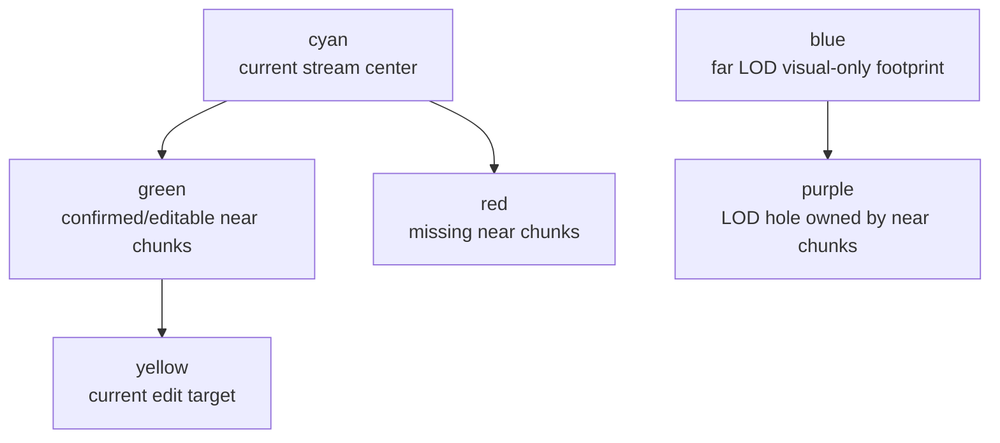

# 客户端可操作区域当前事实

> 当前唯一事实文档。原无扩展名文件 `client_active_region` 只保留为跳转提示。

## 定义

客户端可操作区域不是“画面上看见的区域”，而是满足以下条件的 near voxel chunk 集合：

1. 服务端已确认订阅；
2. 客户端已应用权威 `ChunkSnapshot` 或 `ChunkDelta`；
3. 本地 confirmed voxel store 能支持 collision、raycast、hit box 和 edit target；
4. 点击时的 raycast target 位于当前 player-derived streaming window 内；
5. edit intent 通过 Gate/World/Scene 权威校验并收到 `VoxelIntentResult` / `ChunkDelta`。

## Voxia 当前实现

- 当前 UE Voxia 近场订阅半径是 `SubscribeRadius = 3` chunks，即 `7×7×7 = 343` chunks，约 ±48m。
- `AVoxiaPawn::GetStreamingWorldPosition()` 是 streaming/debug/editability 的统一玩家位置源。
- movement 后再计算 streaming center，避免角色移动后真实网格和 LOD 不跟随。
- Gate 订阅展开 center-first，避免当前编辑/碰撞 chunk 被外圈 shell 饿住。
- current center chunk 未确认时，客户端重试会重新发送完整 active window；自动路径禁止用 `radius=0` center-only 订阅，因为服务端会把它当作最新完整可操作窗口并裁掉其他 chunk。
- real mouse click 会在点击时刷新 build raycast，拒绝 stale hit 或 outside-current-window hit。

## Debug 可视化语义

- `-VoxiaDebugCanvasHUD`：轻量 HUD + 3D streaming debug overlay。
- `-VoxiaStreamDebug`：只开 3D streaming wireframes。
- `-VoxiaNoStreamDebug`：禁用 overlay。
- target label 区分 `editable`、`outside current window`、`MISSING`，不把所有 hit box 都当合法 edit target。

## CLI / 日志验证入口

- 客户端：`-VoxiaStdioCli` + `scripts/voxia_stdio_cli.js`
  - 关键命令：`snapshot`、`until_window_followed`、`until_editable`、`break`、`place`、`move`、`subscribe_current`。
  - `snapshot` 应报告 `current_stream_chunk`、`last_subscribed_chunk`、near-window coverage、`hit.in_current_window`、`hit.editable`、`last_click`。
- 服务端：`scripts/voxia_server_stdio_cli.exs`
  - `chunk <scene_id> <cx> <cy> <cz>` 同时查 Gate subscribers、World route/lease owner、Scene chunk status、DataService snapshot status。
  - `logs gate voxel_chunk_subscribe_worker_error` 用于区分客户端未请求、World 路由错、Scene 不可用。

## 当前剩余风险

- 近场 fill 期间可能有短暂“既无近场、又被 LOD skip”的真空环。
- 远景 LOD 拼接 skirt 已有代码修复和 AutomationTest 断言，但尚未完成 UE Automation / 实机截图验证。
- 当前 runtime 仍存在 snapshot 洪峰和低优先级 bulk 数据压住交互路径的风险；已通过 worker/latest-wins/center-first 缓解，但长期需要 channel/priority/budget 设计。
- 客户端 baseline / launcher /入场校验还未实现；当前文档记录的是设计硬约束。

## 被取代的旧结论

| 旧结论 | 当前事实 |
| --- | --- |
| 绿色区域不动一定是客户端没发订阅 | 2026-06-28 实证还包括 World stale scene owner route 到旧 node 的服务端问题 |
| 点击无效一定是 mouse input bug | 可操作区域依赖 confirmed chunk、current window、raycast 和服务端 result |
| 面片墙主要是 greedy mesher 合并错误 | 最新判断中 far LOD skip / missing skirt / visual-only LOD 假目标是关键来源 |

## 证据源

- [`clients/Voxia/docs/2026-06-28-streaming-window-follow-fix.md`](../../../../clients/Voxia/docs/2026-06-28-streaming-window-follow-fix.md)
- [`clients/Voxia/docs/2026-06-28-远景LOD-heightmap-设计与拼接缝隙根因.md`](../../../../clients/Voxia/docs/2026-06-28-远景LOD-heightmap-设计与拼接缝隙根因.md)
- [`clients/Voxia/Source/Voxia/Gameplay/README.md`](../../../../clients/Voxia/Source/Voxia/Gameplay/README.md)
- [`clients/Voxia/Source/Voxia/Debug/README.md`](../../../../clients/Voxia/Source/Voxia/Debug/README.md)
