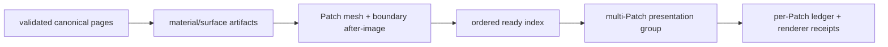

# Voxia Near/Far 20 秒全增量流送设计

日期：2026-08-17
状态：用户已确认，进入实施
范围：`clients/Voxia` 唯一生产组合根、RuntimeMock Real-RHI 首阶段门禁；数据源接口保持 source-neutral

## 1. 目标

本阶段把“玩家可玩”和“完整远景”拆成两个连续且可独立验收的硬时限：

1. 世界 Root 启动后，完整 `3×3×3 = 27 tiles = 216 Near patches = 9261 chunks`
   必须在 `10s` 内完成。Near 期间显示真实进度；Near 的精确所有权、renderer coverage、
   parity 与 post-visibility 条件全部闭合后，立即允许玩家操作。
2. 玩家入场时启动独立 Far 时钟。当前 Tile 对应的完整 Full Far 目标
   `33725 pages / 6859 Far patches` 必须在随后 `10s` 内完成构建、呈现、账本提交、
   renderer audit 与资源静止。
3. 首次完整流程上限约为 `20s`。Far 的 `10s` 从 Near 放行时刻起算，不含 Near 时间。
4. 玩家未离开当前 Tile 时，不产生新的完整地形目标；相机旋转只重排尚未开始的 Far 工作。
5. 玩家跨 Tile 后只处理完整 XYZ 差集：保留重叠内容、构建 entered、在替代内容可见后退役
   exited。跨 Tile 差集拥有新的 `10s` Far 截止时间，绝不退回全量重建。

## 2. 不变量

- confirmed voxel truth、TargetKey、PatchVersion、canonical boundary slot、SceneHost ledger 与
  renderer receipt 的既有权威语义不变。
- Near 是唯一玩家放行门禁；Far 失败不得伪装完成，也不得悄悄降低目标范围。
- Full Far 的最终目标仍是全部 `6859` patches。可视锥只决定顺序，不负责裁掉目标。
- 同一 TargetKey 内，每个 Patch 仍有独立版本、after-image、read-set 复核、commit serial 与
  coverage receipt；批处理不能生成第二份 live truth。
- 已开始、ready 或提交中的工作不因相机旋转而取消。旋转不得重置 Far 截止时间。
- 跨 Tile 使用 retain/enter/exit 的完整三维差集；禁止 XZ column、固定 Y 或有限 Y 带。
- baseline、manifest、hash 或 diff chain 不可信时硬失败，禁止用运行时快照自愈绕过。

## 3. 方案比较

### 方案 A：只改优先级

按距离与视角排序能改善“先看到什么”，但不会减少 Full build `31.864s` 或 presentation drain
`142.400s`，无法满足 `10s`。不采用。

### 方案 B：只把每 Patch fence 改成共享 fence

把约 `3748` 个 renderer mutation 的逐 Patch 双 fence 合并，可以显著减少排空时间；但 Full build
仍超过 `10s`，Near/Far 也没有完整的 deadline、相机重排和跨 Tile 生命周期。只能作为局部机制，
不能单独成为方案。

### 方案 C：deadline 驱动的全增量流水线（采用）

同时实施四个正交机制：

1. 冻结目标与全增量生命周期；
2. 距离优先、角度次优先的可重排待办索引；
3. provider → artifact → mesh → presentation 的连续流水线与缓存复用；
4. 连续 Patch 前缀共享 staging/post-visibility fence 的呈现组。

该方案同时消除构建屏障和逐 Patch GPU 往返，并保留独立 Patch 真值。

## 4. 目标与优先级

### 4.1 冻结空间目标

Root 首次获得权威玩家位置时冻结 `AnchorTile`、TargetKey 和完整 Full Far patch map。同一 Tile 内
只维护这一目标；普通走动或相机旋转不能生成新的 generation。

跨 Tile 时建立新 TargetKey，并从 SceneHost 当前 live ledger 计算精确 `retained / entered / exited`。
retained 直接复用；entered 进入流水线；exited 在替代内容 post-visibility 完成后异步退役。

### 4.2 确定性排序

每个尚未开始的 Far Patch 使用以下字典序 key：

```text
(distance_shell, angular_bucket, exact_angle_key, stable_xyz)
```

- `distance_shell`：Patch AABB 到冻结玩家完整 XYZ 锚点的最近距离层，绝对优先，由近及远；
- `angular_bucket`：Patch 中心方向与当前相机 forward 的夹角分桶，由视野中心向外；
- `exact_angle_key`：同桶内使用确定性的点积/叉积量化值；
- `stable_xyz`：最后以完整 XYZ 稳定打破并列。

相机方向达到角度滞回阈值后，只重建 pending/speculative 索引；in-flight、ready、held、正在提交和
已提交项保持不动。重排有固定最小间隔，不取消工作、不改变版本、不重置 deadline。

## 5. 构建流水线

Root 绑定通过 H gate 的 source 与 TargetKey 后立即允许 Full Far 做不可见准备，但 Near 永远拥有
CPU、GameThread 与呈现许可的最高优先级。Far 只能使用明确的 spare capacity；Near 完整后解除
Far 限速并启动 `FarDeadline`。

Full Far 不再等待整阶段 barrier：



- page、artifact 与 mesh 都按稳定身份缓存并跨目标复用；缓存只是派生数据，不是 confirmed truth；
- producer 按优先级窗口持续投喂，不等待完整 `BuildFuture` 才发布近端 Patch；
- worker 数由冻结运行配置和硬件并发度决定，Near 活跃时必须服从 Near reserve；
- 任一阶段的身份、依赖或容量错误直接令当前 target Fatal。

## 6. 多 Patch 呈现组

SceneHost 增加单一 active presentation group。一个 group 只包含同一 TargetKey、同一 coherence
epoch、按当前优先级连续取出的有界 Patch 前缀。

1. 每个 Patch 独立运行 planner、read-set 与 after-image 校验；
2. 无渲染命令的 Patch 在组内保留独立语义提交，但不创建 RHI fence；
3. renderer mutation 先分别建立 hidden candidate，整个组共用一道 staging fence；
4. fence 完成后，SceneHost 在有界 GameThread 预算内按原顺序执行可见提交与独立 ledger commit；
5. 整组共用一道 post-visibility fence；完成后逐 Patch 发布 committed receipt 并排队退役旧资源；
6. 可见提交前任一 Patch 失败则整组不切换；已经进入可见提交的组必须完成当前组，再由新 target
   通过正常差集替换，禁止半途伪回滚。

组大小由 Patch 数、预计 renderer command 数、GameThread staging 预算和剩余 deadline 自适应，
但必须有静态上限。初始门禁使用 `64 renderer mutations / group`、`2ms staging slice`，以实跑证据
调整；禁止通过单帧无界提交换取总时长。

## 7. Deadline 与失败

- `NearDeadline = RootStart + 10s`；超时进入可诊断 Session Failed，不能放行玩家。
- `FarDeadline = PlayableAt + 10s`；超时保持已经正确呈现的内容，但当前 Far target 标记 Fatal，
  UI/CLI 明确报告所处阶段、剩余 Patch、最老 waiter 与预计瓶颈，不能写成 settled。
- 跨 Tile 的 Far deadline 从新 Tile target 被 Root 接受时起算；retain 内容立即计入完成度。
- deadline 只用于检测和调度紧迫度，不能跳过 H gate、版本校验、fence 或 coverage audit。

## 8. 可观测面

`client_flow_state`、`voxel_world_root_state`、`pure3d_world_state` 与 smoke index 至少公开：

- Near/Far `started_at / elapsed_ms / deadline_ms / remaining_ms / deadline_state`；
- `anchor_tile / target_key / retained / entered / exited / target / committed`；
- `distance_shell / angular_bucket / camera_priority_revision / pending_reprioritized`；
- provider、artifact、mesh、ready-index、presentation-group 各阶段 pending/in-flight/completed；
- group 数、平均/最大 Patch 数、共享 staging/post fence 数、无命令与 renderer mutation 数；
- same-tile suppressed target count、跨 Tile diff generation 与缓存复用量；
- coverage gap/overlap/seam/orphan、fatal reason 与最老 waiter。

产物继续写入 `.demo/observe/`；累计 transport 日志必须可轮换，不能无限增长成为隐性 I/O 状态。

## 9. 验收

第一阶段固定门禁：

- 地图：`L_VoxiaProductionWorld`；
- profile：RuntimeMock 唯一生产组合根；
- 图形：`1280×720 Real-RHI`；
- 样本：当前开发机连续 `10` 次独立冷启动；
- 每一次均满足 Near `<=10000ms`、Far 从 Playable 起 `<=10000ms`；不使用平均值掩盖超时；
- Full Far 终态精确 `33725 pages / 6859 patches`，mailbox/ready/in-flight/fatal 为 `0`，
  settled/quiescent/coverage/parity clean；
- 固定相机、连续转向、同 Tile 走动、单轴/双轴/三轴跨 Tile、负坐标与快速折返均有结构化验证；
- 同 Tile 走动的完整目标 generation 不增加；跨 Tile 只出现精确差集；
- Null-RHI 只覆盖纯逻辑和结构，不替代 Real-RHI 门禁。

Online provider 后续必须复用同一目标、优先级、增量、deadline 与呈现组接口；首阶段 Mock 通过不等于
服务端 pages、网络或 launcher 已完成。
