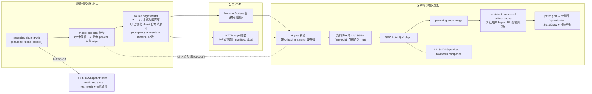

# Voxia 体素世界 LOD 分层与各层技术选型 — 设计稿

> 日期：2026-07-06　状态：设计稿 v2（待拍板；v1 经 1 轮对抗评审后修订，修订记录见 §11）
> 定位：[`2026-07-05-voxia-voxel-lod-production-route.md`](./2026-07-05-voxia-voxel-lod-production-route.md)（生产路线，冻结）的下游细化——把"L0-L4 + SVO + source pages + mesh renderer"的路线拍板落成**每一层的边界、技术选型和选型理由**。本稿不推翻任何已冻结决策；新增决策项用 `T-` 前缀标出，等待拍板。
> 证据源：GPT-5.5 两份方案的对抗评审（[`2026-07-06-gpt55-lod23-proposal-review.md`](./2026-07-06-gpt55-lod23-proposal-review.md)）、codex 三份代码调研、UE 5.8 源码实地核查（`D:\UE\UE_5.8`）、8km 实测锚点（`_session-handoff.md:32-37`）。
> 术语口径：base / delta / truth / snapshot 的统一定义见 [`glossary.md`](./glossary.md)（2026-07-06 拍板）——本稿的 source page 即"远区 7m snapshot"。
> 数据源终态：**投影路线已拍板为终态**（[`2026-07-06-projection-route-final-decision.md`](./2026-07-06-projection-route-final-decision.md)）——§3.2b 的"pages 为唯一生产远景源"不再是待拍板项；同构路线（客户端 WorldGen ⊕ overlay）降格为定向优化选项。

## 0. 一句话总纲

**权威在服务端，派生在管线，渲染在引擎；每往外一环，分辨率减半、更新变慢、语义变弱**——从 L0 的"可编辑真值"到 L3 的"只求轮廓可信"，任何一层都不得向内层反向拥有语义。

## 1. 设计准则（选型的判据，先于选型）

| # | 准则 | 来源 |
| --- | --- | --- |
| P-1 | confirmed truth 只来自服务端；远景一律 visual-only（无碰撞/编辑/AI），缺源硬失败不 fallback | AGENTS.md §2.1-2.3、路线 §3/§6 |
| P-2 | **入带角尺寸 ≤ 约 20px**；相邻带分辨率跳变 ≤ 2×（1920px/90°FOV ≈ 21px/°）。跳变款在 L0/L1 边界**显式豁免**：1m 真值层与派生层之间存在固有断层（collar 后仍 3.5×），治理手段是 underlap+skirt+suppression 而非分辨率阶梯（见 §6） | GPT 方案吸收 + 评审 I-9 修订 |
| P-3 | 预算由 observe 驱动，不预设扛得住：每层给出 quad/内存量级估算 + 实测锚点 + **置信度标注**，超预算先降级配置再谈新技术 | W-7 |
| P-4 | 失效粒度逐层变粗、更新频率逐层变慢；失效过滤由**服务端权威判定**且有最终一致性上界 | 评审采纳项 #9 |
| P-5 | 一切派生物可重建、可缓存、可版本化；缓存 key 覆盖 content/source/diff/material/LOD/renderer 全维版本，**并有淘汰与容量预算** | 6-28 唯一真值 + 现有 artifact cache |
| P-6 | 优先吃引擎白送的能力（静态 draw path、组件级剔除），自研渲染组件只在实测瓶颈出现后启动 | UE 5.8 核查 |

## 2. 分层总表（T-1：分带口径）

距离用中心 tile 的 Chebyshev tile 距离 d 表达（1 tile=112m；**环距含垂直分量，见 §7**）。

| 层 | 范围 | 约距离 | 分辨率 | 数据源 | 渲染技术 | 语义 |
| --- | --- | --- | --- | --- | --- | --- |
| **L0 近景** | d ≤ 1（3×3×3 tiles） | 0-336m 盒 | **1m 真体素** | 服务端 `ChunkSnapshot/Delta/IntentResult` + verified world pack | per-chunk greedy mesh + ProcMesh section 增量；碰撞/raycast 直查 confirmed VoxelStore | 交互真值：编辑/碰撞/object/field |
| **L1 近中景** | d 2-8 | 224-896m | SVO 叶 **7m**（P2 期在 d2-4 加 **3.5m collar**，需放宽 depth clamp 至 5，见 §9 步 7） | source pages（7m mip，H gate） | SVO leaf-surface + per-cell greedy merge → patch 分组件 DynamicMesh（StaticDraw） | visual-only |
| **L2 中远景** | d 9-24 | ~1.0-2.7km | 叶 **14m**（7m 页规约降采样，算子见 T-4） | 同上 | 同上，更新频率降一档 | visual-only |
| **L2.5 远景过渡** | d 25-40 | ~2.8-4.5km | 叶 **28m** | 同上 | 同上 | visual-only |
| **L3 远景** | d 41-72 | ~4.6-8.06km | 叶 **56m** | 同上 | 同上，最低频更新，雾融合 | visual-only 轮廓 |
| **L4 超远景**（**defer**，触发条件见 §3.3） | d 73-96 | 8.2-10.75km | SVDAG | runtime SVDAG payload（源自同一 pages；**要求 pages 覆盖扩到 d96，页体积约翻倍**，未扩则 L4 无源禁用） | GPU raymarch composite（debug/AB，升格按路线 §4.2 门槛） | 剪影 |
| **天空层** | 8km+ | — | 无几何 | — | SkyAtmosphere + ExponentialHeightFog + 云/天体 | 氛围 |

与 2026-07-05 路线的差异只有一处：**L2/L3 之间插入 28m 过渡环（L2.5，T-2，已拍板 2026-07-06）**。它是调参决策不是架构决策——在八叉树梯子（112/2^k = 56/28/14/7m）上做 3 个远环只有三种摆法，各有代价；L2.5 是 Pareto 点：

| 3 环 vs 4 环 | 全场 quads（无 merge） | 代价 |
| --- | ---: | --- |
| 7/14/56（=路线原文） | 1.14M | d24/25 处 **4× 跳变**（56m@2.8km 入带 24px，山脊换环可见跳粗） |
| 7/14/28 到天边 | 2.05M | 无跳变，**+53% 预算** |
| 7/28/56 | ~0.9M | 4× 跳变提前到 1km（34px），最差 |
| **7/14/28/56（本稿）** | **1.34M** | 全部 2× 跳变，+18% 预算 |

**T-2 已拍板采纳四环（2026-07-06）**——派生环全链 2× 跳变、每个入带角尺寸 ≤20px（17/12/15px）、代价 +18% quads。回退钩子保留：若垂直多层落地（B5）后 merge 合计冲破预算，降级序列第二档即撤 L2.5 回 7/14/56（见 §5），其余设计不受影响——回退成本只是一行 tier 配置加一次预算复核。

**角误差验证（P-2 达标性）**：

| 边界 | 入带角尺寸 | 出带角尺寸 | 跳变 |
| --- | ---: | ---: | ---: |
| L1 入带 7m@224m | 38px →（collar 后 3.5m）19px | 7m@896m ≈ 9.5px | L0→L1：collar 后 3.5×（P-2 跳变款显式豁免，靠 skirt/underlap/suppression 治理） |
| L2 入带 14m@1008m | 17px | 6.4px | 2× |
| L2.5 入带 28m@2800m | 12px | 7.6px | 2× |
| L3 入带 56m@4592m | 15px | 8.5px | 2× |

对照 GPT 方案：其 4m→16m@1km、16m→64m@4km 是两处 4× 跳变靠雾兜底，其 L0 边界 2× 平滑靠 LOD1 开 2m（无合并 4.28M quads 的预算悬崖）换来。本分层用 collar（merge 后净增约 +7.5 万 quads）以约 1/40 的代价把 L0 边缘角尺寸拉到同一 19px 水平，代价是接受边界 3.5× 跳变由缝隙策略治理。

## 3. 每层技术选型与理由

### 3.1 L0：服务端权威 1m 体素（现状即终态骨架）

技术：verified world pack（release manifest + sha256 + entry gate）→ confirmed `FVoxiaVoxelStore` → `FVoxiaGreedyMesher` mask+merge → ProcMesh section 按 chunk 增量（预算 `VoxiaNearMeshBuildBudgetMs`）；碰撞与 raycast **直查体素 store，不建 UE 物理网格**（`VoxiaCharacterMovement.h:24`、`VoxiaVoxelRaycast.h:11`、near mesh `CreateMeshSection(..., false)` 不建碰撞）；编辑走 intent → 服务端 delta 回流。

为什么：
- **交互正确性要求真值**：任意格随时可被编辑，必须 full-res 且与服务端一致（W-6：窗口内不分体素分辨率）。
- **体素直查碰撞优于 mesh 碰撞**：省掉 Chaos cook 成本与 mesh/truth 双重表达的失步风险，且天然可与服务端复算对齐（GPT 方案推荐 Chaos 近身碰撞，本仓现状是更优解，不改）。
- **ProcMesh section 而非合并大 mesh**：近景高频局部 dirty（编辑/delta），section 粒度=chunk 粒度，增量重建路径已实测。
- 边缘细节：L0 初始 hydration 未完成期间的填充桥接沿既有 fill-bridge 先例（`_session-handoff.md:74`），far 侧 suppression 的收放以 near-window 契约为准。

### 3.2 L1-L3：SVO 距离环 + source pages + per-cell greedy merge + 分组件 DynamicMesh

这是本稿的主体。四个选型逐个给理由：

**a) 数据结构：SVO macro cell（112m/cell）+ 每环 depth，而不是 GPT 的"每带均匀 mip + 448m/896m 容器"（T-3：维持现结构）**

- 两者表达力等价，但 SVO 白送三件事：同质空间自动坍缩（均匀 mip 要为纯空气/纯实心付满采样）、SVDAG 子树去重（实测 compression 0.37，直接供 L4 raymarch）、单一结构覆盖全部环（换环=换 depth，不是换容器类型）。
- 112m cell 的 dirty/替换/缓存粒度**优于** 448m：一次编辑失效 1/64 的体积；GPT 自己也警告"region 粒度不能过大"。
- 已建成并通过 automation + 真实 RHI smoke；推倒重来没有收益。
- **远环 cell 管理开销的诚实说明**（评审 I-10 修订）：`MacroCellTiles` 是全局单值配置，放大它会等比放大所有环的叶尺寸——**不能**用来只放大远环容器。按环差异化容器（远环 448m）= 每环不同 cell 尺寸/叶语义/cache key/boundary，属结构改动，登记 defer（触发条件：远环 cell 管理成本在 observe 中成为可测瓶颈）。现实缓解手段是聚合上传粒度（patch 已聚合 8×8 tiles）与远环低频更新。

**b) 数据源：服务端物化 source pages（7m occupancy+material mip / macro cell），粗环由客户端规约降采样（T-4）——数据源路线部分已终态拍板（2026-07-06 投影路线裁决）,T-4 待冻结的只剩 payload 编码与规约算子细节**

- **为什么不是客户端 WorldGen 采样**（GPT 两版方案的地基）：① S4 仲裁冻结——parity CI 未绿前客户端推导不得驱动渲染，而 parity 已被故意拆除（客户端 3D 化分歧）；② 3D 内容按 W-Q6=A 归 delta，客户端只能重算最无聊的基底，亮点内容全要走服务端修正；③ 窗外 mip 合并 1m diff 需要合并后状态，客户端没有——被修改区必然退化为服务端物化下发，即"次选"本来就是必经之路；④ authored 世界（元决策）无 WorldGen 可采样，pages 管线两个世界通用。**"程序化重算胜过搬字节"的洞察保留，重算放在只有一份实现的服务端**（未修改区服务端直采 mip 分辨率，无需 71TB 全量物化；已修改 chunk 从库中合并降采样）。
- **为什么 page 装 7m mip 而不是原始 chunk / SVO 节点 / mesh**：原始 chunk 是 71TB 问题；SVO 节点让树编码变成线协议、mesh 路径吃不动；mesh artifact 依赖 BoundarySignature（随玩家窗口位形变化），服务端不可能预发，且 raymarch 吃不了。7m mip 是**唯一同时喂饱 mesh 和 raymarch 两个 renderer 的中立格式**，压缩后 ~1-2KB/cell、radius=72 单 Y 层 ≈ 20-40MB（L4 profile 扩到 d96 时约 +16-32MB）。
- **为什么只发最细一档（7m）**：粗环由整数规约得到——整数运算天然跨端确定，无浮点 parity 问题，且省掉多档重复存储与多档失效。
- **规约算子契约（评审 F-2 修订，随 T-4 拍板）**：
  1. **1m→7m（服务端）**：occupancy = **any-solid**（343 格中任一实心即实心）；material = 实心子格**众数**，平票按 material id 确定性 tie-break。
  2. **7m→14/28/56m（客户端）**：occupancy = **any-solid**——必须与 SVO 树的 Mixed-leaf 语义一致（`BuildOccupancySvoNode` 中 Mixed leaf 即视为占据并发面），否则"降采样后建树"与"细数据直接建树"分叉、粗环轮廓腐蚀出洞；material 同众数规则。
  3. **any-solid 的已知代价（显式签收）**：粗环几何单调膨胀（56m 环比 28m 环最多"胖"一圈），换环过渡是**重叠型**而非缝隙型——skirt 治缝不治重叠，因此换环处以 cross-fade/dither 为主、skirt 为辅（§6）；跨 depth seam 断言在膨胀语义下定义为"细侧面必须被粗侧体积覆盖"（覆盖性断言，非逐面配对）。
  4. **material 生产端缺口（显式登记）**：服务端 NIF 现只导出 `column_height`/`heightmap_region`，无 material 函数；7m material mip 需要 pages writer 侧新实现，且必须与 1m migration 的材质规则一致（规则与一致性验证归 §9 步 5）。

**c) mesh 生成：exposed-face + per-cell masked greedy merge（T-5：merge 落地，作用域限 cell 内）**

- 现状逐 leaf 面 EmitQuad 无合并，8km 实测 3.7M quads。per-cell greedy merge 的预期收益**按带不同**（评审 I-4 修订）：细环（7m/3.5m）同深度平面多，预期 ÷2-4；粗环（28m/56m）octree 同质坍缩已吃掉大平面（depth1 cell 仅 8 叶），预期仅 ÷1.2-2。侧面/底面占比高（标定 k=4.06 中顶面仅 1/k ≈ 25%，其余为侧/底面——由标定推导，非直接实测），悬崖/岛侧壁的大平面合并收益最好。
- **作用域必须限 cell 内**：跨 cell 合并会让 artifact 几何依赖邻居内容 → 一次编辑 dirty 27 邻居、移动复用率（实测 0.988）崩掉。cell 内合并是确定性的，patch fingerprint 复用不受影响。
- merge 是**承重墙不是优化**：它使 3.5m collar 和垂直多层（§7）的预算变得可负担。

**d) 渲染后端：按 patch 分组件的 `UDynamicMeshComponent` + `SetMeshDrawPath(StaticDraw)` + 按环分频更新（T-6）**

- **结构性风险（推演，未在生产规模实测——评审 F-1 修订）**：现状 RuntimeMesh 后端 `RefreshSvoRuntimeMesh` 在每帧上传批次后从全部已积累 patch 重建整棵 `FDynamicMesh3` 再 `SetMesh`（`VoxiaWorldActor.cpp:2046-2049,1007-1026`）。按代码推演，8km 规模 361 patch 流式期间总功 ≈ O(N²) ≈ 23 个全量 mesh 当量，单次全量重建为秒级 CPU + GB 级瞬态。该路径**迄今只在 9-page fixture 规模实测过**；已有的 min 42.8 FPS 实测出自 ProcMesh 后端且在上传完成后采样，**与本风险无因果**（其真实来源单独立案排查，见 §9）。分组件的收益表述为：消除该理论 O(N²) 与全量替换尖峰风险 + 免费获得组件级视锥剔除（单组件剔除率为 0，分组件典型可剔 50-70%）。
- **为什么开 StaticDraw**：UE5.8 `EDynamicMeshDrawPath::StaticDraw` 产 cached MeshDrawCommand（`BaseDynamicMeshComponent.h:81,615,631`），远景是低频整体替换、不用 fast-update 家族，互斥无痛——引擎白送（P-6）。
- **为什么现在不自研 UPrimitiveComponent/SceneProxy**：其收益（打包顶点格式省 2-3× 显存、artifact 直传砍 FDynamicMesh3 中间态、组件内 LOD）只在"分组件+StaticDraw 吃完后仍有实测 hitch/显存瓶颈"时兑现。登记为 defer，触发条件写死。
- **为什么不是 Nanite/HLOD/RVT/impostor**：Nanite 运行时构建是 UE5.8 API 级不可行（NaniteBuilder editor-only，运行时 `BuildFromMeshDescriptions` 强制 fast-build），离线 bake 归 S5 且先做 editor 手工 A/B 再决定建不建 farm；WP/HLOD 对零静态 actor 的纯运行时世界输入为空集；RVT 是 2D 投影缓存，与 3D 远景（崖壁/浮空岛底面）模型冲突；impostor 被 L4 raymarch 支配（逐像素视差/轮廓 vs 八面体近似）。
- **更新频率分带（P-4 的渲染侧）**：L1 跨 tile 即时增量；L2 跨 tile 批量合并；L2.5/L3 低频队列（秒级 coalesce），远环 dirty 永远排在近环之后。
- **材质/光照口径**：远景沿现状顶点色三桶材质（matte/translucent/emissive）+ 既有补光 RIG；RuntimeMesh 不进 Lumen scene（无距离场/surface cache），远景不投动态阴影；atlas/材质保真属独立专项，不阻塞本稿。

### 3.3 L4：raymarch-only SVDAG profile（**defer**，2026-07-06 拍板：不排期、不扩圈，触发条件写死）

技术：runtime SVDAG payload（root table + 去重 node buffer，实测 10.7km 仅 9.3MB）→ ByteAddress buffer → raymarch composite 屏幕合成。

为什么保留该路线：mesh 路线的 quad 数随视距平方增长，raymarch 成本随屏幕分辨率恒定、数据随 SVDAG 去重亚线性增长——对超远距**渐近正确**（实测 radius 96 @120FPS vs mesh 同视距不可行）。但它只解决视觉、工程风险集中在手写 shader，**不作为 L1-L3 默认**（路线 §4.2 六条升格门槛不变）。

**defer 决策（2026-07-06，两个决策显式拆开）**：

- **决策一（第五环要不要）= defer**。L4 的收益端取决于两个当前无答案的问题——①是否存在需要 >8km 可见的标志性内容；②大气美术是否定调"清澈"（雾若按 8km 收尾，L4 画了也被雾吃掉；雾变薄又反过来削弱对 L2.5/L3 粗糙度的遮蔽——雾预算与几何视距是互补品）。触发条件（**命中任一**再启动扩圈评估）：
  1. 世界内容出现需要 >8km 可见的标志性结构（天空岛群/巨型地标），美术明确要求；
  2. 美术定调清澈大气（能见度 >8km），且截图审计中 8km 天空收尾露馅；
  3. 垂直玩法落地后，高空俯瞰视角的世界尽头截断在真实巡航审计中被判不可接受。
- **决策二（raymarch 路线保温）= 继续，且与扩圈解耦**。里程碑 B 步 B3 的"从 pages 构建 SVDAG payload"保留，用途标注为 **raymarch AB 保温（d≤72 范围内）**，服务 §4.2 升格门槛的证据采集，不背 L4 生产化名义、不需要 pages 扩圈。
- **若将来触发启用**：L4 声明为**低一致性档**——不进即时 dirty fan-out，只吃周期性 manifest 刷新（分钟级）或登录/传送重拉；服务端即时失效范围仍停在 d72，新增复杂度被钳制在量变（pages 覆盖 ×1.78、分发 +16-32MB），唯一质变成本（raymarch composite 生产化）归属决策二的升格门槛管辖。L4 不牵动实体 AOI/wire 协议（pages 走 HTTP）。
- 源数据与 mesh 路线共用同一 pages（T-4 收益）；**前提是 pages 覆盖按 profile 扩到 d96**，未扩则该 profile 显式无源禁用，不得 fallback。

### 3.4 天空层：无几何

SkyAtmosphere + 高度雾 + 云。雾承担 L3 入带过渡的遮蔽兜底（P-2），但**雾只遮 2× 跳变的剩余误差，不背 4× 跳变的锅**——这是 L2.5 存在的原因。

## 4. 数据流与失效契约

**失效契约（T-7，分带过滤——从 GPT 方案吸收后本仓化，按编辑类型分列）**：

1. 编辑 commit 后，服务端在 outbox 旁把 chunk 变更聚合到 macro cell 粒度，**在权威侧比对该 cell 的 7m mip 是否真的变了**（这要求服务端持久化 per-cell 当前 mip 作比对基准——新增派生状态，归属见 §9 步 5）→ 变了才 bump `source_revision`、重发布 page、fan-out dirty 通知。
2. **过滤命中率按编辑类型不同（any-solid 语义下，显式签收）**：
   - **挖掘**：高过滤率——只有挖掉 7m 格内最后一块实心才翻 occupancy；
   - **放置（空气中新建）**：必然翻动 empty→mixed——新建结构远景尽早可见，视为特性而非缺陷；
   - **表层材质变化**：翻动 material mip 概率高——material-only 变更（轮廓不变）允许按带降频合并下发，不即时失效粗环。
3. 粗带天然免疫细带未翻动的 diff：14/28/56m 是 7m 的确定性函数，7m 没变则粗带必然没变。
4. **最终一致性上界**：聚合器维护 per-cell 变更计数与时间水位，超阈值或周期到期强制重派生——"过滤"永远只是延迟，不是永久漂移（自维护不变量纪律）。
5. 客户端补 dirty 输入 API（现状 dirty 只是构建输出）：`InvalidateMacroCells(cells, source_revision)` → 只重建命中 cell。

**高频修改世界下的定位澄清（2026-07-06 问答定稿）**：本世界真值高频修改（MMO 多人编辑 + 涌现），但远景管线是**为持续重派生设计的流式系统，不是静态烘焙**。三层衰减把"世界修改率"降为"远景重建率"：① L0 吸收热交互编辑（chunk store + delta 流）；② mip 过滤吸收大部分远景相关编辑（any-solid 下挖掘几乎不翻、放置必翻=新结构尽早可见、材质变化降频合并）；③ coalesce + 分带限频把剩余变成批式后台重建。关键性质：**成本 ∝ 翻动率而非世界规模**。SVDAG 的"编辑弱项"是原地改树（共享子树 copy-on-write）；本设计从不原地改树，只做 cell 粒度整格重派生（实测 0.1ms/cell 后台 + 1-2KB/cell 页重拉），弱项在架构上不触发。量化参考：100 玩家同盘每秒 1 编辑 ≈ 过滤后 10-30 cell/s ≈ 3ms/s 后台 CPU + 几十 KB/s；千人级施工 ≈ 秒级远景延迟仍在预算内。**换轨触发条件**（defer 已登记）：若玩法使远景可见的大规模地形改造成为常态背景活动、翻动率线性拖垮重派生吞吐，则远景结构换 brick pool 类原地可编辑表示——T-4 的中立页格式保证换轨只动客户端派生段。涌现/场本身不走本管线（W-12：field truth 独立通道，远景只显示体素后果）。

**page 运行时分发通道（T-11，评审 F-3 修订）**：推荐**失效通知（wire 新 opcode，只传 cell 列表 + 新 source_revision）+ payload 走 HTTP 拉取**（复用 auth_server `/ingame/voxel/*` 家族），不在 wire 内嵌 page payload。理由：page 是可缓存静态内容（CDN 友好、多客户端共享同一 revision）、失败重试语义简单、不占用游戏连接带宽。manifest 滚动：重发布 = 追加新 revision 条目 + 保留旧条目至 TTL，客户端按 revision 拉取并过 sha256 gate；缺新页时旧 revision 的 artifact 继续显示并标 stale（时间窗行为，非缺源 fallback）。

**launcher 分发范围契约（T-12，2026-07-06 方向拍板，字段细节随 B1 冻结）**：

1. **范围真相源在服务端 manifest**：pack/pages 的 expected 集合由服务端声明，客户端只做差集下载与 sha256 校验；`required_shard_set = f(logical_scene_id, 角色最后位置, 窗口半径契约)`——三个输入服务端全有，由 `world_manifest` 响应确定性给出。"服务器预读"的正确形态是服务端计算 required set，不是预测玩家行为。
2. **1m world pack 三段式范围**：
   - **保底段**（范围静态、内容动态）：出生区/传送枢纽等系统锚点，新角色 required set 的默认值；
   - **热度段**（范围动态）：服务端按运行时热度指标（订阅密度/编辑密度/人口分布）滚动维护推荐预置集，进 manifest 下发——全沙盒兼容：热点是运行时涌现而非设计时输入，玩家自建城镇自动进预置集；
   - **窗口段 + 冷区按需**：角色位置窗口差集下载；传送/长途目的地在**入场前 gate 补拉**，大体素包永不进 scene runtime 热路径（三阶段边界纪律）。
3. **pages 全图单档预下发**：source pages 以 **7m 单档全图覆盖**，launcher 阶段全量/差集拉平至当前 revision（全图单 Y 层 80-160MB、垂直多层 100-400MB 量级）；14/28/56m 不存储不下发（T-4 单档决策的分发面——多档存储只 +14% 空间但失效链复杂度是乘法，且整数规约是全项目唯一被允许参与生产渲染的客户端本地重算，因其为纯整数确定性函数）。
4. **两条架构不变量**：
   - **pack = checkpoint 的客户端分发形态**：内容 = `base ⊕ 全部 delta`（含玩家建造），全沙盒不改变管线，只加快 pack 变旧速度（由 compact 周期 + shard 增量更新对冲，热区 shard 高频翻新、冷区长期稳定，失效粒度自适应热度分布）；
   - **pack 新鲜度只是效率参数**：正确性由登录 `known[]` 对账保证（服务端只对版本不同的 chunk 回 0x62）——pack 旧 = 登录增量大，不 = 错。
5. **新增设计项（登记，归 C4）**：①热度统计与推荐预置集（observe 驱动 + manifest 字段）；②shard 失效经济学（热区小 shard / 冷区大 shard，或按翻新率自适应切分——shard grid 设计的新约束）。

## 5. 预算表（P-3；k=4.06 标定于 3D preview 内容；2.5D 生产内容约减半）

| 带 | cells | 叶 | quads（无 merge） | merge 系数（按带） | merge 后 |
| --- | ---: | --- | ---: | --- | ---: |
| L1 d2-8 | 280 | 7m | 291k | ÷2-4 | 73-146k |
| L2 d9-24 | 2,112 | 14m | 549k | ÷2-3 | 183-275k |
| L2.5 d25-40 | 4,160 | 28m | 270k | ÷1.2-2 | 135-225k |
| L3 d41-72 | 14,464 | 56m | 234k | ÷1.2-2 | 117-195k |
| **合计** | 21,016 | | **1.34M** | | **0.51-0.84M** |
| （P2 collar d2-4 @3.5m） | 72 | 3.5m | **净增 +224k**（替换原 7m 贡献 75k） | ÷2-4 | 净增约 +56-112k |

- 对照实测锚点：当前默认配置 3.70M quads @ avg 69-85 FPS（RTX 5060）。本分层无 merge 已 −64%。
- **垂直多层修正（评审 I-5 修订）**：有效 cell ×1.3-2.5 后 merge 合计 **0.66-2.1M**——区间上半超 1M，届时降级手段（按序）：收紧占据层清单口径 → 撤 L2.5（回 3 环）→ 远环容器放大（defer 结构项）。不承诺"仍在 1M 以下"。
- **标定迁移风险（显式脚注）**：k=4.06 标定于 WorldGen 路径的高度自适应 Y-slab root bounds；§7 改 112³ 立方 cell 后 k 需重新标定，预算表在垂直落地时同步复核。
- 内存口径：CPU mesh ~424B/quad（瘦身后 ~210B，§9 步 8）；persistent cache 增加 LRU 淘汰 + 容量上限，旧 source_revision 的孤儿 artifact 在 gate 通过后清除；RAM 中间态（FDynamicMesh3/patch map）纳入 observe 字段。

## 6. seam 与过渡（T-8）

- **L0/L1 边界**：沿现有 near-skip skirt（24 macro 下探）+ underlap；suppression 契约不变（focus/近场覆盖处远景裁掉，不双显示）。P-2 跳变豁免记录于此：1m→3.5m（collar 后）的断层由这组缝隙策略治理，不追分辨率阶梯。
- **环内跨 depth 边界（3.5↔7↔14↔28↔56m）**：any-solid 规约下粗侧单调膨胀，边界是**重叠型**而非缝隙型——处理以换环 cross-fade/dither 为主、细侧向粗侧 skirt 为辅；seam 断言定义为**覆盖性断言**（细侧边界面必须被粗侧体积覆盖，抽样验证：小半径 automation 全量断言 + 8km 规模按环边界抽样），替代现状不验证跨 depth 的 seam_check。
- **换环重分配**（玩家移动使 cell 换 depth）：保旧 artifact 至新 artifact 上传完成（现状已保证），patch 层加 0.2-0.5s cross-fade（材质 dither），observe 暴露 `ring_reassigned_cells` / `fade_in_flight`。
- 原则不变：seam 全部是视觉策略，不改 truth 边界（路线 §6）。

## 7. 垂直维度（T-9）

- **稀疏多层立方 cell**：`VerticalRadiusTiles>0`，cell 保持 112³ 立方（保住每环叶尺寸语义）；source pages manifest 增加 **per-column 占据层清单**（该 tile 柱哪些 Y 层含实心表面——含地下 delta 造出的空腔表面）。地表 1-2 层/柱 + 岛屿/洞穴层，有效 cell ≈ 单层的 1.3-2.5 倍。
- **清单自身是派生态，必须有 revision 与失效通知（评审 I-2 修订）**：玩家高空建岛 = **新增占据层** = 清单变更（不是既有 page 内容变更）。清单由服务端聚合器维护，携带独立 `manifest_revision`；dirty 通知包含"清单变更"类型，客户端收到后重拉清单再定位新 expected 层。否则 H gate 的 expected 集合过期，"缺源硬失败"被静默绕过（违反 P-1）。
- **拒绝"全 Y 柱 root bounds"方案**：八叉树各轴同步二分，Y 跨 900m 的 cell 在 depth4 时 Y 向叶 56m 而 XZ 7m——垂直分辨率隐性劣化 8×，且地表与岛耦合进同一 artifact 粗化 dirty 粒度。
- **环距离改 3D Chebyshev，且 near-skip 同步 3D 化（评审 I-3 修订）**：现 near-skip 是 XZ 圆盘整柱剔除——垂直多层落地后会把"头顶 >1 tile 的浮空岛"整柱剔掉而 L0 又不覆盖（垂直窗外），两层都不渲染形成真空。修正：near-skip 只作用于 L0 窗口实际覆盖的 Y 层（|Δy|≤1），其余 Y 层按 3D 环距正常分级；地下同理。
- H gate 口径：expected = 当前 manifest_revision 清单列出的占据层，缺层硬失败（fixture 的 `vertical_checks` 已证明多 Y 包可行）。

## 8. 显式 tier 契约与验收（T-10）

- tier 升为一等概念：配置显式表（形如 `-VoxiaSvoLodRings=3.5@4,7@8,14@24,28@40,56@72`，含 collar 档）、`svo`/observe 输出 per-ring `cells/quads/depth`、source pages manifest 记录 `lod_config`——替代现在 samples/ring 推导且 Transport 与脚本默认不一致的状态。
- 验收门槛（沿路线 §8 追加）：per-ring quad/内存预算断言；跨 depth **覆盖性** seam 断言（小半径全量 + 大半径抽样）；换环 fade 可观测；`render_perf` 长巡航（跨 ≥8 tiles 连续移动）avg/min FPS 门槛；远景阴影策略断言；截图审计含"入带角尺寸"目视复核视角；cache 容量/淘汰计数。
- **动态负载可观测（里程碑 C 验收必含）**：`far_dirty_cells_per_sec`、`rebuild_queue_depth`、`page_refetch_bandwidth` 三字段进 observe——"世界到底多频繁地打到远景"由数据回答；超阈值即击发 defer 的换轨触发条件，而不是架构惊喜。
- 三入口：真实操作（飞行巡航）、automation（per-ring 断言 + seam 抽样）、CLI（`until_svo_*` 家族扩 ring 字段）。

## 9. 阶段路线（按里程碑分三列车；2026-07-06 v2.1 调整：客户端渲染正确先行）

> 排序原则（用户拍板方向）：**里程碑 A 只做客户端渲染正确**，零服务端依赖，全部在 `-VoxiaWorldGenPreview` / fixture 下验收；**里程碑 B 冻结接口契约**并让客户端消费管线以 fixture 为源跑通——先冻契约、后实现服务端，让客户端成为服务端接入时的现成 oracle；**里程碑 C 才动服务端**，对着已验证契约实现。唯一不能推迟到 C 的"服务端相关"工作是 B1 的**纸面契约冻结**——契约冻结便宜、事后翻改昂贵，A/B 的渲染与消费管线需要固定靶子。

### 里程碑 A：客户端渲染正确（零服务端依赖，WorldGen preview 即可验收）

| 步 | 内容 | 备注 |
| --- | --- | --- |
| A1 | 切默认分级（samples=2）+ 显式 tier 契约 + L2.5 第三环 | **非纯配置**：现代码只有 near/mid 两环 boost（+3/+2），第三环需扩 `FVoxiaSvoBuildConfig` 字段 + `SameReusableSvoConfig` 等式 + cache key `lod_config` 连带（quads −64% 仍成立） |
| A2 | RuntimeMesh 分组件 + StaticDraw + 分频更新 | 消除理论 O(N²) 与全量替换尖峰风险 + 视锥剔除；**同时立案排查 min 42.8 FPS 实测尖峰的真实来源**（出自 ProcMesh、上传完成后，与本步无因果） |
| A3 | per-cell greedy merge | 按带系数验收（细环 ÷2-4、粗环 ÷1.2-2），quad_count 回归 |
| A4 | 跨 depth 覆盖性 seam 断言 + 换环 fade + L1 collar（3.5m，**含 depth clamp 1..4→5 放宽**） | collar 排在 merge 后系预算依赖（无 merge 时 +224k 不可负担） |
| A5 | 顶点格式瘦身（424→~210B/quad）+ cache LRU/容量 | 可与 A3/A4 并行 |

**A 验收**：8km WorldGen preview 长巡航（跨 ≥8 tiles）——per-ring quad/内存预算断言、无洞/无双显/换环不跳、截图审计 + `render_perf` 门槛全绿。垂直维持现状 Y-slab 行为（浮空岛在 preview 下已可见），立方多层留到 B5。

### 里程碑 B：接口冻结 + 客户端 pages 真消费（fixture 为源，仍不动服务端）

| 步 | 内容 | 备注 |
| --- | --- | --- |
| B1 | **拍板并冻结 T-4（page payload + 规约算子）、T-11（分发通道语义）与 T-12（launcher 分发范围：required-set、三段式、热度预置集与 shard grid 字段）为纸面契约**；**pages coverage radius 必须为 manifest 一等字段**（不得隐含 d72——L4 defer 的安全销：将来扩圈是数据变更不是契约变更） | 只写契约不写服务端代码；A 期间即可完成 |
| B2 | fixture 生成器升级：产出**真 7m mip page payload**（从 preview WorldGen 按 T-4 算子计算） | 扩展现有 `svo_source_pages_fixture`，dummy payload 退役 |
| B3 | **客户端 pages 真消费管线**：page decode → 规约降采样 → 按环建树 → 从 pages 构建 SVDAG payload（用途=raymarch AB 保温，d≤72，不背 L4 生产化，见 §3.3 决策二） | **全新主干代码**（现状 page 只是 hash gate 输入、渲染吃预物化 artifact） |
| B4 | 客户端 dirty 输入 API（`InvalidateMacroCells`）+ fixture 模拟失效通知的回归 | T-7 的客户端半边 |
| B5 | 垂直稀疏多层 + 3D 环距 + near-skip 3D 化 + manifest 占据层清单（进 fixture）| 落地后重新标定 k、复核预算表 |

**B 验收**：fixture 包驱动全管线（页→降采样→树→merge→上传→seam→suppression→移动/垂直回归），正/负向 gate 全绿。**此时客户端 = 服务端接入的验收 oracle**。

### 里程碑 C：服务端接入（对着已验证契约实现）

| 步 | 内容 | 备注 |
| --- | --- | --- |
| C1 | pages writer（occupancy any-solid + material 众数） | **material 派生规则与 1m migration 一致性在此复核——这是 B1 冻约后唯一残留的服务端侧契约风险**（NIF 现无 material 函数，I-8） |
| C2 | dirty 聚合 + per-cell mip 比对基准持久化 + `source_revision/diff_chain_hash` 真值 | app 归属建议：聚合器挂 scene_server commit 链旁，pages writer 挂 world_server（`WorldPackSvoSourceMaterializer` 同族），mip 基准表落 data_service——待拍板 |
| C3 | 失效通知 opcode（0x6D/0x6E 已占用，另配）+ T-11 HTTP 通道 + manifest 滚动 | 客户端 far_visual_sync 适配层已就绪待 opcode |
| C4 | launcher/update 真实包 + 端到端 smoke；**按 T-12 实现 required-set 差集下载、热度预置集、传送 gate 补拉与 shard 粒度分级** | 复用 B 的全部验收入口，服务端产物必须让既有 smoke 全绿 |

### defer（触发条件写死，不排期）

自研 SceneProxy（触发：A2 后实测 hitch/显存仍瓶颈）；按环差异化容器（触发：远环管理成本可测瓶颈）；**L4 第五环扩圈**（触发：§3.3 三条件命中任一；启用形态=低一致性档）；raymarch 升格（路线 §4.2 门槛）；Nanite bake farm（触发：editor 手工 A/B 数据显著）；Event Overlay（协议留 optional event descriptor 字段，玩法到大事件阶段再做）；**同构路线定向加法**（触发：终态裁决稿 §4 画像全命中；形态=处女地基底本地生成，被修改区仍走投影）；**隐秘区域的 pages/pack 准入规则**（触发：隐私/隐匿玩法立项；背景：7m pages 全服可见轮廓，1m 预置只是细节提前，隐匿闸门须在分发准入层做而非 pack 范围机制）。

## 10. 不做什么（显式负决策）

- 不采用客户端 WorldGen 作为生产远景源（重启条件见评审稿 §2，五条全满足才重开）。
- 不引入 448m/896m 新容器类型（按环差异化容器登记 defer，非"旋钮"）。
- 不做 GPT 的 LOD1 2m/4m 独立中景层（2m 是预算悬崖；7m+collar 以远低成本达到同一入带角尺寸准则）。
- 不做运行时 Nanite / WP HLOD / RVT / impostor（理由见 §3.2d）。
- 不做每 cell 多渲染路径择优阶梯（stable vs runtime）——S5 bake 存在之前没有对象；fallback 永远限定"source 已验证、构建中/拉取中"的时间窗行为，缺源仍硬失败。

## 11. 修订记录

- v1（2026-07-06）：初稿。
- v2（2026-07-06）：经 1 轮对抗评审修订。致命项：F-1 撤销 min 42.8 FPS 与 O(N²) 的错误因果绑定（改为推演风险 + 单独立案）；F-2 补规约算子契约（any-solid/众数）与按编辑类型的过滤命中率、签收膨胀语义与覆盖性 seam 定义；F-3 补 T-11 运行时 page 分发通道与 manifest 滚动；F-4 补 collar 的 depth clamp 放宽与 L2.5 第三环的代码改动申报。重要项：L4 pages 覆盖前提（I-1）、垂直清单 revision/失效（I-2）、near-skip 3D 化（I-3）、按带 merge 系数与合计修正 0.51-0.84M（I-4）、垂直预算改口 0.66-2.1M + 降级序列（I-5）、collar 净增量口径（I-6）、补步 4 客户端 pages 真消费主干（I-7）、material 生产端缺口登记（I-8）、P-2 跳变款 L0/L1 显式豁免（I-9）、MacroCellTiles 全局单值澄清（I-10）。次要项：k 标定迁移脚注、cache 淘汰/内存 observe、材质光照口径、tier 语法含 collar、碰撞断言补锚点、fill-bridge 注记。
- v2.1（2026-07-06）：§9 按用户拍板方向重组为三列里程碑（A 客户端渲染正确 → B 接口冻结+fixture 消费 → C 服务端接入）；步骤内容不变，只改分组与验收口径；显式记录"B1 纸面契约冻结不可推迟"与"C1 material 派生是冻约后唯一残留服务端契约风险"。
- v2.2（2026-07-06）：补"高频修改世界下的定位澄清"（流式重派生系统定位、三层衰减、SVDAG 编辑弱项不触发论证、换轨触发条件、量化参考）；§8 验收增加 `far_dirty_cells_per_sec` / `rebuild_queue_depth` / `page_refetch_bandwidth` 动态负载 observe 字段（里程碑 C 必含）。
- v2.3（2026-07-06）：落术语表 [`glossary.md`](./glossary.md)（base / delta / truth / snapshot 四词口径 + 客户端 snapshot-only 推论 + 远区修改回流回路），文首加指针；无技术内容变更。
- v2.4（2026-07-06）：①数据源终态拍板落稿（[`2026-07-06-projection-route-final-decision.md`](./2026-07-06-projection-route-final-decision.md)）——投影路线为终态，§3.2b 数据源选型不再待拍板；②L4 从"可选 profile"改为 **defer**（§3.3 重写：第五环与 raymarch 保温两决策拆开、三条触发条件写死、启用形态=低一致性档）；③B1 增加"coverage radius 为 manifest 一等字段"硬要求；④B3 SVDAG payload 构建标注为 raymarch AB 保温用途；⑤defer 清单补 L4 扩圈与同构路线定向加法两条。
- v2.5（2026-07-06）：**T-2 拍板采纳**——L2.5 四环分带（7/14/28/56m）定案：用 +18% quads 买掉 d24/25 处唯一的 4× 跳变，派生环全链 2×、入带角尺寸全部 ≤20px；L0/L1 边界断层仍按 P-2 豁免款由缝隙策略治理。§2 待拍板标记清除；垂直预算降级序列中"撤 L2.5"回退钩子保留（P-3：最终由 observe 数据复核）。
- v2.6（2026-07-06）：新增 **T-12 launcher 分发范围契约**（required-set 由服务端确定性计算、1m pack 三段式范围含全沙盒兼容的热度预置集、pages 全图 7m 单档预下发、"pack=checkpoint 分发形态"与"pack 新鲜度只是效率参数"两条不变量、热度统计与 shard 失效经济学两项设计登记）；B1 冻结范围扩 T-12；C4 补 required-set/热度预置集/传送 gate 补拉/shard 分级实现项；defer 清单补隐秘区域分发准入规则。
