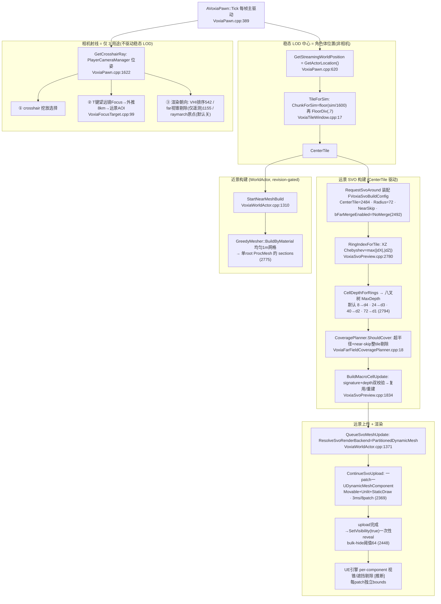
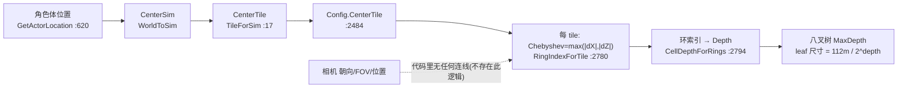
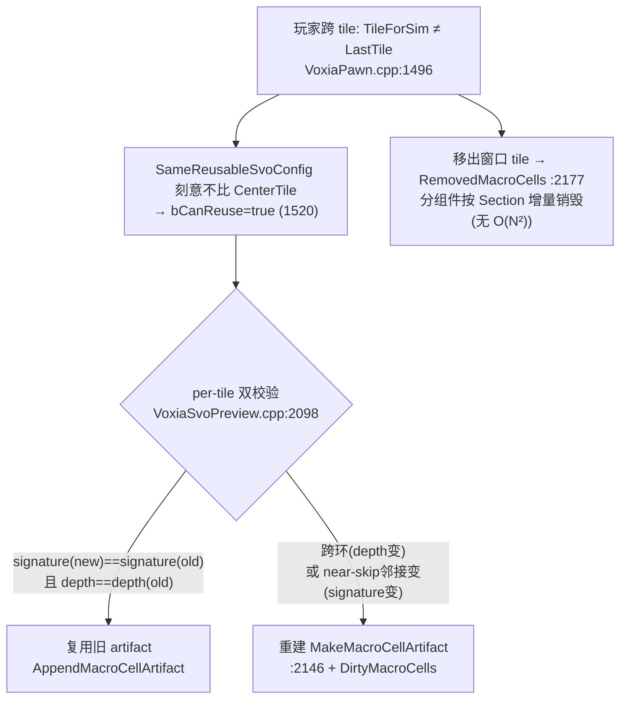

# Voxia 客户端 voxel 渲染管线：相机 · 焦点 · LOD 切换（研究笔记）

> 2026-07-07。为 VLOD-A3b Step 6 真实 RHI A/B 的机位设计而做的管线研究。方法：6 路子代理并行深挖 + 综合交叉核验，全程 `文件:行号` 实证。
> **覆盖范围局限**：端到端链路主要覆盖 `-VoxiaWorldGenPreview` **本地预览路径**；真实服务器 InScene 路径（`NearWindow.CenterTile` 是否服务器 AOI 下发）未证实——见 §6 开放问题。
> 行号锚基于 `clients/Voxia`（子仓，含 `1fc93d2` raymarch 默认关）。

## 0. 头号结论：相机**不驱动**稳态 LOD 切换

客户端里**没有任何 camera-frustum / screen-space-error 的 LOD 逻辑**。某 tile 被赋予哪个 LOD depth，是**玩家角色体位置**（`GetActorLocation()`）的纯函数，**与相机朝向/FOV/位置无关**。

- 稳态 LOD/流送中心 = `GetStreamingWorldPosition() = GetActorLocation()`（`Gameplay/VoxiaPawn.cpp:620`，注释 "centre on the LOCAL character"），**不是相机**。
- 相机位姿（`GetCrosshairRay`，`Gameplay/VoxiaPawn.cpp:1622`）只喂 3 个用途，**无一赋 per-tile depth**：① crosshair 挖放；② 按 `T` 键望远镜 Focus（一次性远景 AOI region，`Gameplay/VoxiaFocusTarget.cpp:99`）；③ 渲染侧朝向（VHI 排序 `:542` / far 组件视锥剔除**仅遥测** `:1155` / raymarch probe 原点，默认关）。
- 结论：原地转相机不改任何 tile 的 depth / 覆盖 / tile 集。相机唯一影响"渲染了什么"的是 UE 引擎对每个 far 分组件的相机相对视锥剔除——是**可见性剔除**，非 LOD 选择。

## 1. 端到端管线（相机 / 体位置 双源）

## 2. LOD depth 因果链（"相机→LOD"的精确回答）

- 四环 tier 契约默认 `{8→d4, 24→d3, 40→d2, 72→d1}`（`CellDepthForRings`，`VoxiaSvoPreview.cpp:2794`）。
- 环距用 **XZ 平面 Chebyshev 距离** `max(|dX|,|dZ|)`（`RingIndexForTile:2780`），线性扫环取首个 `Chebyshev ≤ OuterRadiusTiles`。
- leaf 尺寸 = `112m / 2^depth`（tile 足迹 112m，depth 决定八叉树细分）。

## 3. 中心移动时的 LOD 切换（增量复用）

- `SvoTileSignature`（`:1644`）对 ±X/±Z 四邻的 near-skip 抑制状态编码：**远离近场环的 tile 签名恒=1、depth 不变 → 直接复用**；中心移动只重建"薄薄一圈"边界 tile。
- 双校验保证"增量结果 == 全量结果"：几何是"源+tile+深度"纯函数，但边界统计/skirt 依赖近场邻接、depth 依赖距离环，中心移动同改两者，故受影响 tile 必须重建。

## 4. 近景 vs 远景 渲染分工

| 维度 | 近景 | 远景 SVO |
| --- | --- | --- |
| 中心 | 角色体位置 chunk（`ResolveNearMeshPriorityCenterChunk:418`） | CenterTile（角色体 tile） |
| 触发 | revision-gated（Voxel/Field revision 变）+ 4ms/512chunk 预算续帧（`:2902`） | SvoRevision 变 + 0.25s poll + 3ms/8patch（`:2369`） |
| mesh | `GreedyMesher::BuildByMaterial` 均匀 1m 网格（16³, 100cm）+ 12.5cm 精修（`:609`） | per-cell 变深度 leaf + **A3b greedy merge** |
| 组件 | 合批进**单个 root ProcMesh**，按 render bucket（matte/translucent/emissive）每 chunk 1-3 section，池化复用（`:2775`） | **一 patch 一 `UDynamicMeshComponent`**（Movable+Unlit+StaticDraw，`:2369`） |
| 剔除 | 近景 root 始终可见；空 chunk / 六邻全实心遮挡 chunk 直接跳过（`IsFullyOccludedUniformChunk:505`） | UE 引擎 per-component 视锥/遮挡剔除 **[推断]**；游戏侧只做 bulk on/off（`:1368`） |
| 材质/光照 | `MaterialForId` 路由 Voxel/Translucent/Emissive 材质，读 FieldStore 温度/光照做 emergence shading（`SolidAtWorld:558`）→ **进 Lumen** | `ResolveSvoPartitionedMaterial` **Unlit**，`FarVisual.ApplyTo` 关 DistanceField/RT/Shadow（`:1239` / `MeshComponentDesc.cpp:47`）→ **不进 Lumen GI** |
| 边界 | — | near-skip 整 tile 剔除让远景避开近景区；交界竖面 **24m skirt**（`GVoxiaSvoBoundarySkirtMacros`，`:19`） |

## 5. 后端与 raymarch

- **默认后端 = `PartitionedDynamicMesh`**（`ResolveSvoRenderBackend:891`，无 override 时 `:906` 返回它）。ProcMesh/HISM/RuntimeMesh/Partitioned 均可经 `-VoxiaSvoRenderBackend=` 覆盖；第 5 枚举 `NaniteStaticMeshBake` 保留未用。
- **StaticDraw 无条件应用**（`:2387`），仅 `-VoxiaSvoFarDynamicDraw` 能覆盖。`bStaticBakeReady`（`RenderArtifact.cpp:60`）**运行期不 gate**，只被 automation 断言——与任务原描述"准入门"不符（见 §6）。
- **raymarch 默认关**：`ShouldEnableSvoRaymarch`（`VoxiaWorldActor.cpp:490`）+ gate（`:1969`）+ `bSvoRuntimeGpuBuffersReady`（`:1984`）默认 false → go-live 不建 runtime buffer、不跑 compute，只走三角形 proxy mesh。开启时才用 world-space camera ray（`RaymarchComposite.cpp:292`）。

## 6. 诚实边界（推断 / 未证 / 已纠正）

1. **[推断]** "UE 引擎真的对每个 far 组件执行视锥/遮挡剔除"——只证到前置条件（每 patch 是独立组件带自身 bounds，`:2455`/`:1208`），未追引擎渲染器代码证明剔除真触发。远景"相机↔渲染"耦合的关键推断点。
2. **[未证 · Step 6 重点看]** 跨 depth 环界（depth4↔depth3）是否产生可见裂缝/T-junction——只有 near-skip 24m skirt，**无跨环 stitch 代码**，判据里也无"外邻 tile 深度不同"一项。
3. **[未证]** 真实服务器 InScene 下 `NearWindow.CenterTile` 是否服务器 AOI 下发（而非本地角色位置）。
4. **[已纠正的假警报]** 子代理称 `1fc93d2`（raymarch 默认关）不存在——**错误**：它确在 `clients/Voxia` 子仓；子代理在 `ex_mmo_cluster` 仓跑 git 才失败。raymarch 默认关成立（代码 gate + `1fc93d2` 双证）。
5. **[头注释过时]** `MeshComponentDesc.h:27` 注释称需 Static mobility，但 `.cpp:47` 强制 Movable（执行真相）。
6. **[未证]** 帧内 `Pawn::Tick` vs `WorldActor::Tick` 调度顺序；持久 artifact cache 命中与增量双校验两条"复用"来源的等价性；近景 greedy mesher 竖直轴落 grid 轴 1 还是 2（三处口径自洽但未逐面验）。

## 7. 对 Step 6 真实 RHI A/B 的启示

1. **"同机位" = 同一 pawn actor 位置（同 CenterTile）**，不是仅同相机朝向。tile 集/每 tile depth/覆盖全由体位置决定。采样前先核对两次 tile 集与组件数一致，才能把 RHI delta 干净归因给 merge。
2. **A/B 开关 = `-VoxiaSvoFarNoMerge`**（`:2492`，`bFarMergeEnabled=!Param`，默认 ON）。除该 flag 外命令行必须完全一致——**绝不带 `-VoxiaSvoRaymarch*`**（会转真走 GPU compute、彻底改 RHI 画像）、不带 `-VoxiaSvoRenderBackend=`、不带 `-VoxiaSvoFarDynamicDraw`。
3. **机位朝外眺望穿过多环**，让远景 shell 落入视锥——否则相机朝地/朝近会被引擎剔掉大部分 far 组件，merge 的 overdraw 收益被掩盖。用 `far_visible` 遥测（`CountVisibleSvoPartitionedComponents:1155`）确认视锥内 far 组件数，作 A/B 可比性前置门槛。
4. **先等 LOD 收敛再采样**：far 异步构建 + 0.25s poll + **bulk-hide（阈值 64）藏整池直到 upload_complete 才一次性 reveal**（`:2448`）——必须 reveal 后稳态截取。
5. **Lumen 归因**：远景 SVO 是 Unlit、不进 Lumen GI；merge on/off 的 RHI 差异主要落在**光栅/overdraw 与 draw-call 数**，而非 Lumen 光照。别把 Lumen 侧波动算到 merge 头上。

## 8. 后续行动计划（开放议题登记 —— 勿讨论完即弃）

> 这些议题在 2026-07-07 相机/LOD 研究 + 近/远材质讨论中浮现，登记为**待办**，不随讨论消散。Step 6 先跑**纯 merge A/B**（用户拍板），下列议题按优先级/时机排在其后或并入 Step 6 的可见 RHI 巡航。

| # | 开放议题 | 优先级 | 时机/依赖 |
| --- | --- | --- | --- |
| F1 | 近 Lit / 远 Unlit **光照色差** | 中 | Step 6 之后独立 A/B（不进纯 merge 对照） |
| F2 | 近/远 **emergence 缝**（远景无发光/温度） | 中-低 | 取决于 emergence gameplay 权重；F1 之后 |
| F3 | **跨 depth 环界（d4↔d3）裂缝/T-junction** | 中-高（几何正确性） | Step 6 可见 RHI 巡航**顺带肉眼看**（不加 A/B 维度） |
| F4 | 引擎 per-component **剔除是否真触发**（推断未证） | 低 | Step 6 用 `far_visible` 遥测 + 侧/背视顺带确认 |
| F5 | 真实服务器 InScene 下 **CenterTile 来源**未证 | 中 | 独立调查（不阻塞 Step 6 本地预览路径） |
| F6 | `bStaticBakeReady` 运行期不 gate（设计债） | 低 | 确认设计意图后决定补接线或删字段 |
| F7 | `MeshComponentDesc.h:27` 头注释过时（Static vs Movable） | 低 | 顺手清理 |

**F1 近 Lit / 远 Unlit 光照色差（最主要议题）**
- 证据：近 `M_VoxelVertexColor`(MSM_DefaultLit，顶点色受光，`VoxiaWorldActor.cpp:721`) vs 远 `M_VoxelFarUnlit`(MSM_UNLIT，顶点色直出 Emissive 不受光，`:752`)；解析 `ResolveSvoPartitionedMaterial:1239`。
- 为何重要：强方向光/阴影/昼夜下，近景边缘（≈112m）会出现 lit/unlit 亮度断层。**可见程度未经真实 RHI 视觉验证**（不臆断）。
- 关键背景：Unlit 的**崩溃规避理由已失效**——A2.0 曾把崩溃归为 overdraw 而引入 D6 Unlit，A3.0 反转证明崩溃真凶是 **raymarch**（已由 raymarch-off 修复、与 overdraw 正交）。Unlit 现仅剩 perf/overdraw 理由，且 **A3b merge −52% quad → overdraw 减半**已进一步削弱其必要性。
- 拟定动作：Step 6 纯 merge 跑完后，独立跑一档 **`-VoxiaSvoFarLitMaterial`**（远景改用与近景同一 Lit 材质），量 Lit-far 的 FPS/VRAM 代价；若可接受则评估默认改 Lit 消色差。**FPS delta 必须与 merge 收益单独隔离归因**，不混入纯 merge 对照。

**F2 emergence 缝**：近景烘焙 emergence（热单元 emissive glow / 温度光照，`SolidAtWorld:558`），远景 `MaterialForBounds` 每 leaf 单材质**无 emergence**（A3b 稿 §9.1）。即便 F1 让远景 Lit，发光/温度差异仍在。动作：评估远景是否需烘焙简化 emissive，或接受远景无发光。

**F3 跨环界裂缝**：判据里**无"外邻 tile 深度不同"项**（`IsNearSkipBoundaryFace:589` 只判 near-skip 邻接），无跨环 stitch/skirt 代码；唯一遮缝是 near-skip 24m skirt。d4↔d3 等相邻不同深度环之间是否产生可见裂缝/T-junction 无实证。动作：Step 6 可见 RHI 巡航**重点看环界**；若有缝，设计跨环 stitch 或 skirt（新工作项）。

**F5 服务器路径**：本次端到端只覆盖 `-VoxiaWorldGenPreview` 本地路径；真实服务器下 `NearWindow.CenterTile` 是否服务器 AOI 下发未证。动作：读 `Net/VoxiaTransportSubsystem` 网络分支 + `Interest/VoxiaClientInterestSubsystem` 定论——决定 Step 6 之外的联网 A/B 是否需固定 pawn 位以避免 AOI 抖动引入非 merge 的 tile 集差异。
